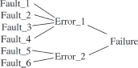
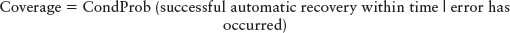
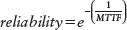
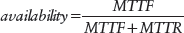
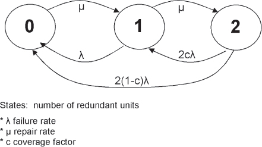
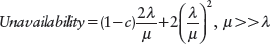
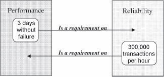
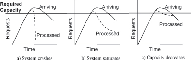
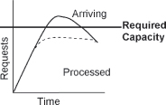
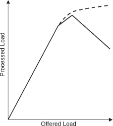

# CHAPTER 1

# Introduction to Fault Tolerance

Like any subject of study, there is a specialized language associated with fault tolerance. This chapter introduces these terms.

> 与任何研究主题一样，有一种专门的语言与容错相关。本章介绍这些术语。

The focus of this book is on ‘Fault Tolerance’ in general and in particular on things that can be done during the design of software to support fault tolerant operation. A system of software or hardware and software that is fault tolerant is able to operate even though some part is no longer performing correctly. Thus the focus of this book is on the software structures and mechanisms that can be designed into a system to enable its continued operation, even though a different part isn’t working correctly. This book describes practices to improve the reliability and availability of software systems. These practices are currently in use in a variety of software application domains.

> 本书的重点是一般的“容错”，特别是在软件设计过程中可以做的事情，以支持容错操作。即使某些部分不再正常运行，容错的软件或硬件和软件系统仍能够运行。因此，**本书的重点是软件结构和机制，这些结构和机制可以设计成一个系统，使其能够继续运行**，即使不同的部分不能正常工作。本书描述了提高软件系统可靠性和可用性的实践。这些实践目前正在各种软件应用领域中使用。

The next few sections define the vocabulary needed to discuss fault tolerance.

> 接下来的几节定义了讨论容错所需的词汇。

# _Fault -> Error -> Failure_

The terms _fault, error_ and _failure_ have very specific meanings.

> 术语“故障”、“错误”和“故障”具有非常具体的含义。

A system **failure** occurs when the delivered service no longer complies with the **specification**, the latter being an agreed description of the system’s expected function and/or service. An **error** is that part of the system state that is liable to lead to subsequent failure; an error affecting the service is an indication that a failure occurs or has occurred. The adjudged or hypothesized cause of an error is a **fault**. \[Lap91, p. 4\]

> 当交付的服务不再符合**规范**时，系统**故障**发生，后者是对系统预期功能和/或服务的约定描述。**错误**是系统状态中可能导致后续故障的部分；影响服务的错误是故障发生或已经发生的指示。错误的判定或假设原因是**错误**\[Lap91，第 4 页\]

Every fault tolerant system composed of software and hardware must have a specification that describes what it means for that system to operate without failure. The system’s specification defines its expected behavior, such as available 99.999% of the time. When the system doesn’t behave in the manner specified in its requirements, it has failed. The term _failure_ refers to system behavior that does not conform to the systems specification.

> 每一个由软件和硬件组成的容错系统都必须有一个规范，说明该系统无故障运行意味着什么。系统规范定义了其预期行为，例如 99.999% 的时间可用。当系统没有按照其要求中指定的方式运行时，它就失败了。术语故障指的是不符合系统规范的系统行为。

These are examples of failures: The system crashes to a stop when it shouldn’t, the system computes an incorrect result, the system is not available for service, the system is unable to respond to user interaction. Whenever the system does the wrong thing it has failed.

> 这些是失败的例子：系统在不应该停止时崩溃，系统计算出错误的结果，系统无法服务，系统无法响应用户交互。每当系统做错事时，它就会失败。

Failures are detected by the observer and users of the system.

> 故障由观察者和系统用户检测。

Failures are dependant upon the requirements and the definition of agreed-upon correct operation of the system. If there is not a specification of what the system should do, there cannot be a failure.

> 故障取决于系统正确运行的要求和定义。如果没有系统应该做什么的规范，就不会出现故障。

Failures are caused by _errors_.

> 故障由 *errors* 引起。

An _error_ is the incorrect system behavior from which a failure may occur. Errors can be categorized into two types, timing or value. Errors that manifest as value errors might be incorrect discrete values or incorrect system state. Timing errors can include total non-performance (the time was infinite).

> 错误是可能发生故障的错误系统行为。错误可以分为两种类型，时间或值。表现为值错误的错误可能是不正确的离散值或不正确的系统状态。计时错误可能包括完全不执行（时间是无限的）。

Some common examples of errors include:

> 一些常见的错误示例包括：

 Timing or Race conditions: communicating processes get out of synchronization and a race for resources occurs.

 Infinite Loops: continuous execution of a tight loop without pausing and without acknowledging the requests of others for shared resources.

 Protocol Error: errors in the messaging stream because of non-conformance with the protocol in use. Unexpected messages sent to other parts of the system, messages sent at inappropriate times, or out of sequence.

 Data inconsistency: Data may be different between two locations, for example memory and disk, or between different elements in a network.

 Failure to Handle Overload conditions: the system is unable to handle the workload.

 Wild Transfer or Wild Write: Data written to an incorrect location of memory or a transfer to an incorrect location occurs if there is a fault in the system.

Any of these example errors could be failures if they deviate from the system’s specification.

> 如果这些示例错误偏离了系统规范，则这些错误都可能是失败的。

Errors are important when talking about fault tolerant systems because errors can be detected before they become failures. Errors are the manifestation of _faults_, and errors are the way that we can look into the system to discover if faults are present.

> 在谈到容错系统时，错误很重要，因为错误可以在故障发生之前被检测到。错误是故障的表现形式，错误是我们可以查看系统以发现是否存在故障的方式。

A _fault_ is the defect that is present in the system that can cause an error. It is the actual deviation from correctness. In a computer program it is the misplaced comma or period, or the missing break statement in a C++ switch statement. Colloquially the fault is often called a ‘bug’, but that word will not appear elsewhere in this book.

> *fault* 是系统中可能导致错误的缺陷。这是与正确性的实际偏差。在计算机程序中，它是放错位置的逗号或句点，或者是 C++switch 语句中缺少的break语句。口头上，错误通常被称为“bug”，但这个词不会在本书的其他地方出现。

The fault might be a latent software defect, or it might be a garbled message received on a communications channel, or a variety of other things. In general, neither the software nor the observers are aware of the presence of a fault until an _error_ occurs.

> 故障可能是潜在的软件缺陷，也可能是在通信信道上接收到的乱码消息，或者其他各种原因。通常，在发生错误之前，软件和观察者都不知道故障的存在。

A number of causes lead to the introduction of a fault into software. These include:

> 许多原因导致软件出现故障。其中包括：

 Incorrect Requirement Specification: Sometimes the software designers and coders were told to build the wrong thing.

 Incorrect Designs: Translating system requirements into a working software design is a complicated process that sometimes results in incorrect designs. The design might not be workable from a pure software standpoint, or it might not be an accurate translation of the requirements. In either case it is faulty.

 Coding Errors: Translating the design into working code can also introduce faults into the system. The compiler/interpreter/code examination tool can catch some faults or a fault can produce syntactically correct code that just does not perform the specified task.

Faults are present in every system. When a fault is lying dormant and not causing any mischief it is said to be _latent_. When the circumstances arise that the latent fault causes something incorrect to happen it is said to become _active_. A fault’s activation results in an error.

> 每个系统都存在故障。当一个故障处于休眠状态且未造成任何损害时，称为 *latent*。当潜在故障导致不正确的事情发生的情况出现时，称为激活。故障激活会导致错误。

## Examples of Fault -> Error -> Failure

To help make these very important definitions clear, here are a few examples.

> 为了帮助明确这些非常重要的定义，这里有几个例子。

A misrouted telephone call is an example of a failure. Telephone system requirements specify that calls should be delivered to the correct recipient. When a faulty system prevents them from being delivered correctly, the system has failed. In this case the fault might have been an incorrect call routing data being stored in the system. The error occurs when the incorrect data is accessed and an incorrect network path is computed with that incorrect data.

> 错误路由的电话呼叫就是失败的一个例子。电话系统要求规定应将呼叫传递给正确的接收者。当故障系统无法正确交付时，系统出现故障。在这种情况下，故障可能是存储在系统中的错误呼叫路由数据。当访问不正确的数据并且使用该错误数据计算出不正确的网络路径时，会发生错误。

A robotic arm used to drill a part in a manufacturing environment provides another example. Consider the fault of a misplaced decimal point in a data constant that is used in the computation of the rotation of the robot’s arm. The data constant might be the number of steps required to rotate the robotic arm one degree. The error might be that it rotates in the wrong direction because of the erroneous computation made with the faulty decimal point. The arm fails by lowering its drill at the wrong location

> 用于在制造环境中钻孔零件的机械臂提供了另一个示例。考虑用于计算机器人手臂旋转的数据常数中小数点错位的错误。数据常数可能是将机器人手臂旋转一度所需的步数。错误可能是因为用错误的小数点进行了错误的计算，所以旋转方向错误。由于在错误的位置降低钻头，手臂出现故障

The preparation of an incorrect bill for service is another example of a failure. The system requirements specify that the customer will be accurately charged for service received. A faulty identification received in a message by a billing system can result in the charges being erroneously applied to the wrong account. The fault in this case might have been in the communications channel (a garbled message), or in the system component that prepares the message for transmission. The error was applying the charges to the wrong account. The fact that the customer receives an incorrect charge is the failure, since they agreed with the carrier to pay for the service that they used and not for unused service.

> 准备不正确的服务账单是另一个失败的例子。系统要求规定，客户将准确收取所接受服务的费用。计费系统在消息中接收到的错误标识可能导致错误地将费用应用到错误的账户。在这种情况下，故障可能发生在通信信道（乱码消息）或准备传输消息的系统组件中。错误是将费用应用到错误的帐户。客户收到不正确的费用是失败的，因为他们同意承运人支付他们使用的服务而不是未使用的服务。

Consider a spacecraft that is given an updated set of program instructions by the Earth station controlling it. An error occurs because someone designing the update incorrectly computed the memory range to be updated. The new program was updated to this incorrect range, which corrupted another part of the programming. The corrupted instructions caused the spacecraft’s antenna to point away from Earth, breaking off communications between Earth and the spacecraft, which led to the mission being considered a failure. The initial fault was the computation of the incorrect memory range.

> 考虑一个航天器，它被控制它的地球站提供了一组更新的程序指令。由于设计更新的人错误地计算了要更新的内存范围，所以发生了错误。新程序被更新到这个不正确的范围，这破坏了编程的另一部分。损坏的指令导致航天器的天线指向地球，切断了地球和航天器之间的通信，这导致任务被视为失败。最初的错误是计算了错误的内存范围。

Banking systems fail when they do not safeguard funds. An example of failure is when a bank’s automatic teller machine (ATM) dispenses too much cash to a customer. Several errors might lead to this failure. One error is that the machine counted out more bills than it should have. In this case the fault might be an incorrect computation module, or a faulty currency sorting mechanism. A different error that can result in the same failure is that the bills were loaded incorrectly into the ATM. The fault was that the courier that loaded the machine put money in the wrong dispensaries, i.e. $20 bills were placed in the $5 storage location and vice versa.

> 如果银行系统不保护资金，就会失败。失败的一个例子是银行的自动柜员机（ATM）向客户发放过多现金。几个错误可能会导致此失败。一个错误是机器计算出的钞票超过了应有的数量。在这种情况下，故障可能是错误的计算模块或错误的货币排序机制。另一个可能导致相同故障的错误是，钞票被错误地装入 ATM。故障是装机的快递员把钱放错了药房，即 20 美元的钞票放在了 5 美元的存储位置，反之亦然。

The last example illustrates how the same failure might result from different faults as shown in <a href="#c01.htm#fig1.2" id="c01.htm#fig1.2a">Figure 2</a>.

> 最后一个示例说明了不同故障如何导致相同故障，如图 2</a>所示。

**[Figure 2](#c01.htm#fig1.2a)** Multiple faults create the same error

> **[图 2]（#c01.htm#fig1.2a）**多个故障导致相同的错误

Another example is the failure of the first Ariane 5 rocket from the European Space Agency. Flight 501 veered off its intended course, broke up and exploded shortly into the flight. The inertial reference system for the Ariane 5 was reused from the Ariane 4. The initial period of the flight the Ariane 5’s flight path took was different enough than Ariane 4 for the inertial reference system to encounter errors in the horizontal velocity calculations. These errors resulted in the failure of the backup inertial reference system, followed by a failure of the active inertial reference system. The loss of inertial reference systems resulted in a large deviation from the desired flight path, which resulted in a mechanical failure that triggered self-destruct circuitry. The fault in this case can be traced to a change in the requirements between Ariane 4 and Ariane 5 that enables for a more rapid buildup of horizontal velocities in Ariane 5. The error that resulted from the horizontal velocity increasing too rapidly resulted in the failure. \[ESA96\]

> 另一个例子是欧洲航天局第一枚阿丽亚娜 5 号火箭的失败。501 航班偏离了原定航线，在飞行中不久就解体并爆炸。阿丽亚娜 5 号的惯性参考系统是从阿丽亚娜 4 号重复使用的。阿丽亚娜 5 号的飞行轨迹与阿丽亚娜 4 号飞行轨迹的初始周期不同，足以使惯性参考系统在水平速度计算中遇到误差。这些误差导致备用惯性参考系统失效，随后是主动惯性参考系统的失效。惯性参考系统的丢失导致了与期望飞行路径的大偏差，这导致了触发自毁电路的机械故障。这种情况下的故障可以追溯到阿丽亚娜 4 号和阿丽亚娜 5 号之间要求的变化，这使得阿丽亚娜 6 号的水平速度能够更快地积累。由于水平速度增长过快导致的误差导致了故障\[ESA96\]

# _Failure Perception \[Lap91\]\[Kop97\]_

A _fail-silent_ failure is one in which the failing unit either presents the correct result or no result at all. A _crash failure_ is one where the unit stops after the first fail-silent failure. When a crash failure is visible to the rest of the system, it is called a _fail-stop_ failure.

> 故障持续故障是指故障单元呈现正确结果或根本没有结果的故障。*crash failure* 是指设备在第一次无故障静音故障后停止的故障。当系统的其他部分可以看到崩溃故障时，它被称为 *fail-stop* failure。

A set-top entertainment system computer fails quietly, without announcing to the world that it has failed. When it fails it just stops providing service. The computer in the Voyager spacecraft fails in a crash failure mode after it detects its first failure, which is detected by the backup computer, which assumes primary control. \[Tom88\]

> 一台机顶娱乐系统计算机悄悄地出现故障，而没有向全世界宣布它出现了故障。当它失败时，它只是停止提供服务。航海家号飞船中的计算机在检测到第一次故障后，以碰撞故障模式出现故障，这是由承担主要控制的备用计算机检测到的\[Tom88\]

Failures can be categorized as either consistent or inconsistent. Consistency refers to whether the failure appears the same each time it is observed. Examining the failure occurs from the viewpoint of the user, the person or other system that is determining that the failing system did not conform to its specifications. Consistent failures are seen as the same kind of failure by all users or observers of a system. An example of failing consistently is reporting ‘1’ in response to all questions that the system is asked.

> 故障可分为一致或不一致。一致性是指每次观察到故障时，故障是否相同。从用户、人员或确定故障系统不符合其规范的其他系统的角度检查故障。一致性故障被系统的所有用户或观察者视为相同类型的故障。持续失败的一个例子是在回答系统询问的所有问题时报告“1”。

Inconsistent failures are ones that appear different to different observers. These are sometimes called two-faced failures, malicious failures or Byzantine failures. These are the most difficult to isolate and correct because the failure is presenting multiple faces to the error detection, processing, and fault treatment phases of recovery.

> 不一致的失败对不同的观察者来说是不同的。这些有时被称为双面失败、恶意失败或拜占庭式失败。这些是最难隔离和纠正的，因为故障在恢复的错误检测、处理和故障处理阶段呈现出多个方面。

An example of an inconsistent failure is to respond with ‘1’ to questions asked by one peer and ‘2’ to questions from all other peers. Another example is when the failing system misroutes all network traffic to a certain network address, and not to other network addresses. The observers of the system, the network peers, see one of two behaviors: either they see a complete absence of network traffic, or they see a flood of network traffic of which most of it is incorrect and should not have been received. This failure is inconsistent because the perception of whether the system is sending traffic or not sending traffic depends on which peer is the observer.

> 不一致失败的一个例子是，对一个同伴提出的问题回答“1”，对所有其他同伴的问题回答为“2”。另一个例子是当故障系统将所有网络流量错误地路由到某个网络地址，而不是其他网络地址时。系统的观察者，即网络对等者，看到了两种行为中的一种：要么看到完全没有网络流量，要么看到大量网络流量，其中大部分是不正确的，不应该被接收到。这种失败是不一致的，因为对系统是否发送流量的感知取决于哪个对等体是观察者。

Inconsistent failures are very hard to detect and to correct because they appear different to each observer. In particular they might appear correct to the part that would detect a failure and incorrect to all other parts of the system. To counter the risk of the failure appearing differently to different observers, fault tolerant design attempts to turn the potentially inconsistent failures into consistent failures. This is accomplished by creating boundaries around failing functionalities, and transforming all failures into fail-silent failures.

> 不一致的故障很难检测和纠正，因为它们对每个观察者来说都是不同的。特别是，它们可能对检测到故障的部件正确，而对系统的所有其他部件不正确。为了应对不同观察者出现不同故障的风险，容错设计试图将潜在的不一致故障转化为一致故障。这是通过围绕故障功能创建边界，并将所有故障转换为无故障故障来实现的。

Fail-silent failures are the easiest type of failures to be tolerated because the observed failure is that the failing unit has stopped working. The reason for the failure is unclear, but the failing element is identified and the failure is contained and is not spreading throughout the system.

> 无故障故障是最容易容忍的故障类型，因为观察到的故障是故障单元已停止工作。故障原因尚不清楚，但故障元件已确定，故障已得到控制，且未在整个系统中蔓延。

# _Single Faults_

Much of the fault tolerant design over the years has been created to handle only one error at a time. The assumption is that only one error will occur at a time and recovery from it has completed before another error occurs. A further assumption is that errors are independent of each other.

> 多年来，大多数容错设计都是为了一次只处理一个错误而创建的。假设一次只会发生一个错误，并且在发生另一个错误之前，从错误中恢复已完成。另一个假设是误差彼此独立。

While this is a common design principle in real life, many failures have occurred when this assumption has been invalid.

> 虽然这是现实生活中常见的设计原则，但当这一假设无效时，许多失败都发生了。

To understand why this is a valuable assumption, consider <a href="#c01.htm#tab1.1" id="c01.htm#tab1.1a">Table 1.1</a>. It shows the theoretical results that indicate how many redundant units are required to tolerate independent faults of three kinds: fail-silent, consistent and malicious (inconsistent). The type of failures tolerated influences the number of components required to tolerate failures. From this table, most designers will see that the most desirable situation is to have the failing unit fail silently, because that requires only two units to tolerate the failures.

> 为了理解为什么这是一个有价值的假设，请考虑表 1.1</a>。它显示了理论结果，表明需要多少冗余单元才能容忍三种独立故障：无故障、一致和恶意（不一致）。容许的故障类型影响容许故障所需的部件数量。从这个表中，大多数设计人员都会看到，最理想的情况是让发生故障的单元无声地发生故障，因为这只需要两个单元就可以承受故障。

[**Table 1.1**](#c01.htm#tab1.1a) Minimum number of components to tolerate failures \[Kop97, p. 121\]

> [**表 1.1**]（#c01.htm#tab1.1a）耐受故障的最小组件数量\[Kop97，p.121\]

---

> ---

**MINIMUM NUMBER OF COMPONENTS TO TOLERATE FAILURES** **TYPE OF FAILURE**

> **耐受故障\***类型故障的最小部件数量\*\*

n + 1 _Fail-silent_ failures

> n+1 次故障

2n + 1 _Consistent_ failures

> 2n+1 \_一致性故障

3n + 1 _Malicious_ failures

> 3n+1 个最大故障

---

> ---

To gain perspective of the ramifications in [Table 1.1](#c01.htm#tab1.1), the computer control system in the Space Shuttle is designed to tolerate two simultaneous failures which must be consistent but need not be silent and, as a result, it has five general purpose computers. \[Skl76\] A typical telephone switching system is designed to tolerate single failures. Many components are duplicated because two units are all that are required to tolerate single failures.

> 为了更好地理解[表 1.1]（#c01.htm#tab1.1）中的影响，航天飞机的计算机控制系统被设计为能够容忍两个同时发生的故障，这两个故障必须是一致的，但不必是无声的，因此它有五台通用计算机\[Skl76\]一个典型的电话交换系统被设计为可以容忍单个故障。许多组件都是重复的，因为只有两个单元才能承受单个故障。

# _Examples of How Vocabulary Makes a Difference_

When debugging failures it is very useful to determine what is the fault, what is the error and what is the failure. Here are a few examples. These also show that the terms, while specific, depend on the viewpoint and the depth of examination.

> 当调试失败时，确定什么是错误、什么是错误以及什么是失败是非常有用的。这里有几个例子。这些还表明，这些术语虽然具体，但取决于观点和检查的深度。

Consider the robotic arm failure presented above. Was the fault that the arm software rotated in the wrong direction, or was it the incorrect data that drove the state change? Knowing which the fault was helps us know what to fix.

> 考虑上述机器人手臂故障。是手臂软件旋转方向错误，还是错误的数据导致了状态变化？知道是哪一个故障有助于我们知道该怎么解决。

As another example, consider the Ariane 5 failure mentioned earlier. Was the fault that the specification didn’t reflect the expected flight path? Or was the fault that the reused component was insufficiently tested to detect the fault? Was the error that the incorrect specification was used, or was the error that the flight path deviated from the Ariane 4 flight path? Identifying and correctly labeling faults and errors simplifies the fault treatment.

> 作为另一个例子，考虑前面提到的 Ariane 5 故障。故障是否在于规范没有反映预期的飞行路径？或者是重复使用的组件未充分测试以检测故障？错误是使用了不正确的规范，还是飞行路径偏离了 Ariane 4 飞行路径？识别并正确标记故障和错误简化了故障处理。

# _Coverage_

The coverage factor is an important metric of a system’s fault tolerance. Highly reliable and highly available systems strive for high coverage factors, 95% or higher.

> 覆盖因子是系统容错性的重要度量。高可靠性和高可用性的系统争取高覆盖率，95% 或更高。

The _coverage_ is the conditional probability that the system will recover automatically within the required time interval given that an error has occurred.

> *coverage* 是给定发生错误，系统将在所需时间间隔内自动恢复的条件概率。

In the Space Shuttle avionics nearly perfect coverage is attained in a complex of four off-the-shelf processors by comparing the output of simultaneous computations in each of the processors. Each Shuttle processor is equipped with a small amount of redundancy management hardware to manage the receipt of the values to be compared. Through the use of this hardware the processor can identify with certainty which of its peers computed an incorrect value. The coverage was increased to 100% through the additional technique of placing a timer on the buses used to communicate between the processors. \[Skl76\]

> 在航天飞机上，通过比较每一个处理器同时计算的输出，四个现成处理器的组合几乎可以实现完美的覆盖。每个 Shuttle 处理器都配备了少量冗余管理硬件，以管理待比较值的接收。通过使用该硬件，处理器可以确定地识别其对等体中的哪一个计算了错误的值。通过在用于处理器之间通信的总线上放置计时器的附加技术，覆盖率提高到 100%\[Skl76\]

Coverage can be computed from the probability associated with detection and recovery.

> 可以根据与检测和恢复相关的概率来计算覆盖率。

Obtaining the probabilities used to compute the coverage factor is difficult. Extensive stability testing and fault insertion testing are required to obtain these values.

> 获得用于计算覆盖因子的概率是困难的。为了获得这些值，需要进行广泛的稳定性测试和故障插入测试。

# _Reliability_

A system’s _reliability_ is the probability that it will perform without deviations from agreed-upon behavior for a specific period of time. In other words, that there will be no failures during a specified time.

> 系统的可靠性是指在特定时间段内，系统在不偏离约定行为的情况下运行的概率。换句话说，在指定的时间内不会出现故障。

The parameters used to describe reliability are Mean Time To Failure (MTTF) and Mean Time to Repair (MTTR). The Mean Time To Failure is the average time from start of operation until the time when the first failure occurs. The Mean Time to Repair is a measure of the average time required to restore a failing component to operation. In the case of hardware this means the time to replace the faulty hardware component in addition to the time to travel to the site to be able to perform the repair actions. The Mean Time Between Failures, or MTBF, is similar to MTTF but reflects the time from the start of operation until the component is restored to operation after repair. MTBF is the sum of MTTF and MTTR. MTBF is used in situations where the system is repairable, and MTTF is used when it cannot be repaired. The start of operations for both MTTF and MTBF refers to when normal operations are resumed, either after initial startup or after recovery has completed. The reliability can be computed with the following equation.

> 用于描述可靠性的参数是平均故障时间（MTTF）和平均修复时间（MTTR）。平均故障时间是指从运行开始到第一次故障发生的平均时间。平均修复时间是将故障组件恢复运行所需的平均时间的度量。对于硬件，这意味着除了到现场执行维修操作的时间外，还需要更换故障硬件组件的时间。平均故障间隔时间（MTBF）与 MTTF 相似，但反映了从开始运行到部件修复后恢复运行的时间。MTBF 是 MTTF 和 MTTR 的总和。MTBF 用于系统可修复的情况，MTTF 用于无法修复的情况。MTTF 和 MTBF 的运行开始是指在初始启动后或恢复完成后恢复正常运行的时间。可靠性可通过以下公式计算。

Failure rate is the inverse of MTTF. A commonly used measurement of failure rate is FITs, or Failures in Time. FITs are the number of failures in 1 × 109 hours.

> 故障率是 MTTF 的倒数。故障率的常用测量方法是 FIT 或故障时间。FIT 是 1×109小时内的故障数。

## Reliability Examples

### _Mars Landers_

The Mars Exploratory Rovers, Spirit and Opportunity, had a design duration of 90 days. The reliability of these two Mars explorers has been so good that they lasted more than 1000 days. However, note that this refers only to complete system failures. There have been partial failures requiring workarounds or fault treatment, such as finding a way to keep the Mars Rover Sprit operating on only five of its six wheels. \[NASA04\]\[NASA06\].

> 火星探索漫游者“勇气号”和“机遇号”的设计工期为 90 天。这两个火星探测器的可靠性非常好，持续了 1000 多天。但是，请注意，这仅指完整的系统故障。有些部分故障需要解决方法或故障处理，例如找到一种方法，使火星车雪碧只能在六个轮子中的五个轮子上运行\[NASA04\]\[NASA06\]。

### _Airplane Navigation System_

Many modern airplanes rely extensively on computers to control critical systems. While the aircraft is in the air, the navigational computers must operate failure-free. On a flight from Chicago to Los Angeles, the navigation system must be failure-free for between four and five hours. The MTTF during the operational phase of the system must be greater than five hours; if it were less the flight crew could expect at least one failure on their flight. If the navigational system fails while the airplane is at the gate on the ground, repairs can return it to operational status before its next flight. Before or after a flight it is still a failure, but it might not be considered into the system’s reliability computations. The MTTR must be low because airlines require their planes to be highly available in order to maximize their return on investment.

> 许多现代飞机广泛依赖计算机来控制关键系统。当飞机在空中时，导航计算机必须无故障运行。在从芝加哥飞往洛杉矶的航班上，导航系统必须在四到五个小时内无故障。系统运行阶段的 MTTF 必须大于 5 小时；如果不是这样的话，机组人员可能会在飞行中至少出现一次故障。如果飞机在地面登机口时导航系统发生故障，维修人员可以在下一次飞行前将其恢复到运行状态。在飞行之前或之后，它仍然是一个故障，但它可能不会被考虑到系统的可靠性计算中。MTTR 必须很低，因为航空公司要求其飞机高度可用，以最大限度地提高投资回报。

## Measuring Reliability

There are two primary methods of determining the reliability of a system. The first is to watch the system for a long time and calculate the probability of failure at the end of the time. The other is to predict the number of faults and from that number to predict the probability of failures (both numbers of failures and durations). Software Reliability Engineering focuses on measuring and predicting reliability.

> 确定系统可靠性的主要方法有两种。首先是长时间观察系统，并计算时间结束时的故障概率。另一种是预测故障数量，并根据该数量预测故障概率（故障数量和持续时间）。软件可靠性工程专注于测量和预测可靠性。

# _Availability_

A system’s availability is the percentage of time that it is able to perform its designed function. _Uptime_ is when the system is available, _downtime_ is when it is not. A common way to express availability is in terms of a number of nines, as indicated in <a href="#c01.htm#tab1.2" id="c01.htm#tab1.2a">Table 1.2</a>.

> 系统的可用性是它能够执行其设计功能的时间百分比 *Uptime* 是系统可用时，*downtime* 是不可用时。表示可用性的一种常见方法是使用数个 9，如表 1.2</A>所示。

[**Table 1.2**](#c01.htm#tab1.2a) Availability as a number of nines

> [**表 1.2**]（#c01.htm#tab1.2a）可用性为 9

---

> ---

**EXPRESSION** **MINUTES PER YEAR OF DOWNTIME**

> **表示每年停机时间\***分钟\*\*

100% 0

> 100% 0

Three 9s 99.9% 525.6

> 三个 9 99.9%525.6

Four 9s 99.99% 52.56

> 四个 9 99.99%52.56

Four 9s and a 5 99.995% 26.28

> 4 个 9 和 5 99.995%26.28

Five 9s 99.999% 5.256

> “五个 9”99.999%5.256

Six 9s 99.9999% 0.5256

> 六个 9 99.9999%0.5256

100% 0

> 100% 0

---

> ---

Availability is computed as:

> 可用性计算如下：

Availability and Reliability are two concepts that are easy to get confused. Availability is concerned with what percentage of time the system can perform its function. Reliability is concerned with the probability that the system will perform failure-free for a specified period of time.

> 可用性和可靠性是两个容易混淆的概念。可用性与系统执行其功能的时间百分比有关。可靠性与系统在指定时间内无故障运行的概率有关。

## Availability Examples

The 4ESS™ Switch from Alcatel-Lucent had an explicit requirement when it was designed in the 1970s of two hours of downtime every 40 years. This equates to an unavailability of three minutes per year, which is slightly better than five 9s. The 5ESS® Switch from Alcatel-Lucent has achieved six 9’s of availability for a number of years.

> 4ESS™ 阿尔卡特朗讯（Alcatel-Lucent）的交换机在 20 世纪 70 年代设计时有一个明确的要求，即每 40 年停机两小时。这相当于每年三分钟的不可用时间，比五个 9 稍好。阿尔卡特朗讯的 5ESS®交换机多年来实现了六个 9 的可用性。

# _Dependability_

_Dependability_ is a measure of a system’s trustworthiness to be relied upon to perform the desired function. The attributes of dependability are reliability, availability, safety and security. _Safety_ refers to the non-occurrence of catastrophic failures, whose consequences are much greater than the potential benefit. _Security_ refers to the unauthorized access or unauthorized handling of information. Since dependability includes both reliability and availability, the correctness of the result is important. \[Lap91\]

> *可靠性是一种衡量系统可靠性的指标，可用于执行所需功能。可靠性的属性是可靠性、可用性、安全性和安全性*安全性是指不发生灾难性故障，其后果远远大于潜在利益\_安全性是指未经授权访问或未经授权处理信息。由于可靠性包括可靠性和可用性，因此结果的正确性很重要\[圈 91\]

# _Hardware Reliability_

Unlike software, hardware faults can be analyzed statistically based upon behavior and occurrence and also the physics of materials. The reliability of hardware has been studied for a long time, and covered in great depth. Hardware reliability includes the study of the physics and the materials, as well as the way things wear out. There is an array of technical conferences and journals that address this topic, such as the International Reliability Physics Symposium and the Electronic Components Technology Conference and IEEE journals _Device and Materials Reliability, Advanced Packaging and Solid State Circuits_.

> 与软件不同，硬件故障可以根据行为和发生情况以及材料的物理特性进行统计分析。硬件的可靠性已经研究了很长一段时间，并进行了深入的研究。硬件可靠性包括物理和材料的研究，以及磨损的方式。有一系列技术会议和期刊讨论这一主题，如国际可靠性物理研讨会和电子元件技术会议，以及 IEEE 期刊《设备和材料可靠性、先进封装和固态电路》。

# _Reliability Engineering and Analysis_

Software Reliability Engineering is the practice of monitoring and managing the reliability of a system. By collecting fault, error, and failure statistics during development, testing, and field operation, monitoring and managing the parameters of reliability and availability is possible. The _Handbook of Software Reliability Engineering_ \[Lyu96\] contains a number of articles on topics related to Software Reliability Engineering.

> 软件可靠性工程是监控和管理系统可靠性的实践。通过在开发、测试和现场操作期间收集故障、错误和故障统计信息，可以监控和管理可靠性和可用性参数。《软件可靠性工程手册》（_Handbook of Software Reliability Engineering_\[Lyu96\]）包含许多关于软件可靠性工程相关主题的文章。

A widely used technique is Reliability Growth Modeling, which graphs the cumulative number of faults corrected versus time. Prediction methods calculate the cumulative number of faults expected, which enables comparison with the measured results. This, in turn, enables the determination of the number of faults remaining in the system.

> 一种广泛使用的技术是可靠性增长建模，它用图表表示纠正的累计故障数与时间的关系。预测方法计算预期故障的累积数量，从而能够与测量结果进行比较。这反过来又能够确定系统中剩余的故障数量。

Markov modeling of systems (including software components) is another technique useful for predicting the reliability of a system. These models enable analysis of redundancy techniques and prediction of MTTF.

> 系统（包括软件组件）的马尔可夫模型是用于预测系统可靠性的另一种技术。这些模型能够分析冗余技术和预测 MTTF。

Markov models are constructed by defining the possible system states. Transitions between the states are defined and are assigned a probability factor. The probability indicates the likelihood that the transition will occur. An important aspect of the model is that the probability of a state transition depends only on the current state; history is not considered. <a href="#c01.htm#fig1.3" id="c01.htm#fig1.3a">Figure 3</a> shows a simple Markov model for a duplex system in which either system may fail with probability λ and be restored to service with probability µ and a coverage factor c. The failure rate, (λ), is the inverse of the MTTF, and the repair rate (µ) is the inverse of MTTR.

> 通过定义可能的系统状态来构建马尔可夫模型。定义了状态之间的转换，并为其分配了一个概率因子。概率表示转换发生的可能性。该模型的一个重要方面是，状态转换的概率仅取决于当前状态；不考虑历史 <a href=“#c01.htm#fig1.3”id=“c01.htm#fig1.3a”> 图 3</a>显示了双工系统的简单马尔可夫模型，其中任一系统可能以概率 λ 故障，并以概率 µ 和覆盖因子 c 恢复服务。故障率（λ）是 MTTF 的倒数，修复率（µ）是 MTTR 的倒数。

**[Figure 3](#c01.htm#fig1.3a)** Simple duplex system Markov model

> **[图 3]（#c01.htm#fig1.3a）**简单双工系统马尔可夫模型

# _Performance_

Performance and reliability are two closely related concepts. Is the system’s reliability a performance requirement, or is the performance of a system a reliability requirement? An example of a performance requirement is that the application performs failure-free for three days. An example of a requirement for reliability is that the system supports 300 000 transactions per hour with a graceful degradation above this level of traffic, see <a href="#c01.htm#fig1.4" id="c01.htm#fig1.4a">Figure 4</a>. If a working system does not meet these requirements it has failed.

> 性能和可靠性是两个密切相关的概念。系统的可靠性是性能要求，还是系统的性能是可靠性要求？性能要求的一个示例是应用程序执行三天无故障。可靠性要求的一个例子是，系统支持每小时 300 000 个事务，并且在该流量级别以上时，性能会下降，请参见图 4</a>。如果一个工作系统不符合这些要求，它就失败了。

**[Figure 4](#c01.htm#fig1.4a)** Performance or reliability requirements?

> **[图 4]（#c01.htm#fig1.4a）**性能或可靠性要求？

The last requirement mentioned, that the system support 300 000 transactions per hour with a graceful degradation above this level, is an example of a requirement to deal with the situation that the workload exceeds the design requirements. For example, how will the system behave if the workload is more than the 300 000 transactions per hour for which it was designed, for instance 500 000 transactions per hour? The system’s architects and designers must be prepared for these situations as well.

> 最后提到的一个要求是，系统支持每小时 30 万个事务，并在该级别以上进行适度降级，这是处理工作量超过设计要求的情况的一个例子。例如，如果工作负载超过每小时 30 万个事务（例如每小时 50 万个事务），系统将如何运行？系统的架构师和设计者也必须为这些情况做好准备。

Failures of either of these example requirements are performance failures. The failures can be complete, meaning that the system has totally failed, and is therefore totally unavailable. Performance failures can also be partial. The system might not gracefully degrade when the workload is greater than 300 000 transactions per hour. Alternatively, the system might not be fully available for service because it is working to recover from a failure. When the fault tolerance elements are working to detect and process errors and failures, the system may not be operating at the desired level of performance.

> 这些示例需求中的任何一个的失败都是性能失败。故障可能是完全的，这意味着系统已经完全故障，因此完全不可用。性能故障也可能是部分故障。当工作负载超过每小时 30 万个事务时，系统可能不会正常降级。或者，系统可能无法完全用于服务，因为它正在从故障中恢复。当容错元件工作以检测和处理错误和故障时，系统可能无法以期望的性能水平运行。

Clear performance requirements must be specified. The requirements must state how the system is to behave when too many requests for service are received. When the arriving requests for service exceed the amount that the system can handle it is said to be _overloaded_ or _in overload_.

> 必须规定明确的性能要求。需求必须说明当接收到太多服务请求时系统的行为。当到达的服务请求超过系统可以处理的数量时，称为过载或过载。

Some example failures related to system performance are these:

> 与系统性能相关的一些故障示例如下：

 Too many requests for service arriving at the system can lead to failures when the system does not handle the requests in a way that conforms to the specification. For example, the overloaded system might stop working, or become saturated with reduced throughput, or might not return to acceptable levels after the load returns to normal levels. See the three examples in <a href="#c01.htm#fig1.5" id="c01.htm#fig1.5a">Figure 5</a>.

**[Figure 5](#c01.htm#fig1.5a)** Possible system behaviors

> **[图 5]（#c01.htm#fig1.5a）**可能的系统行为

 The system might not be able to handle the expected volume of service requests, which is clearly a failure to achieve the specifications, <a href="#c01.htm#fig1.6" id="c01.htm#fig1.6a">Figure 6</a>.

**[Figure 6](#c01.htm#fig1.6a)** Failing to meet requirements

> **[图 6]（#c01.htm#fig1.6a）**未满足要求

The capacity of a system represents a tradeoff between the system’s cost and its dependability under load. In a study of the US public switched telephone network, although overload, or performance errors, accounted for only six per cent of the outages, they comprised nearly fifty per cent of the lost customer access to the network \[Kuh 97\].

> 系统的容量代表系统的成本和负载下的可靠性之间的权衡。在一项对美国公共交换电话网络的研究中，虽然过载或性能错误仅占中断的 6%，但它们占了客户失去网络访问权的近 50%。

Since failures are the result of faults, a well designed fault tolerant system will be able to both process the required level of requests and gracefully handle excess workload. We can think of the fault as either the system not including the techniques required to handle the arriving workload or the excess number of arriving requests. The former is avoided by clear specifications of desired behavior and designing and building to meet those specifications. The fault of an excess number of arriving requests manifests itself as an error that must be handled by the system. Techniques to gracefully handle these situations are found in Chapter 7, Error Mitigation Patterns. Some example situations from the telephone network that can cause extreme load to be offered to the system include: mass call-ins, such as for concert tickets or voting on shows such as American Idol. The arriving load can also easily exceed the design specifications during periods of natural disasters when people are calling to check on friends and family in the affected areas.

> 由于故障是故障的结果，一个设计良好的容错系统将能够处理所需级别的请求，并优雅地处理多余的工作量。我们可以将故障视为系统不包括处理到达的工作负载所需的技术或到达的请求数量过多。通过明确的预期行为规范以及满足这些规范的设计和建造，避免了前者。到达请求数量过多的错误本身就是一个必须由系统处理的错误。在第 7 章“错误缓解模式”中可以找到优雅地处理这些情况的技巧。来自电话网络的一些可能导致系统承受极端负载的示例情况包括：大量来电，如演唱会门票或《美国偶像》等节目的投票。在自然灾害期间，当人们打电话询问受灾地区的朋友和家人时，到达的负载也很容易超过设计规格。

Long experience in the telephone network has shown the characteristic curve of system response seen in <a href="#c01.htm#fig1.7" id="c01.htm#fig1.7a">Figure 7</a>. As the offered load increases, the system performance follows it to a point beyond which the system runs into internal congestion issues and can no longer handle the offered load. The total handled load begins to fall at this point. The internal delays arise primarily from the time spent finding idle resources, queuing and dequeuing requests. A fault tolerant system should be able to ride through this workload saturation without failing. As the workload decreases the system should follow its same performance curve and continue to process the workload, without any periods of unavailability.

> 在电话网络中的长期经验表明，系统响应的特性曲线见图 7</a>。当提供的负载增加时，系统性能会随之提高，超过该点后，系统会遇到内部拥塞问题，无法再处理提供的负载。此时，总处理负荷开始下降。内部延迟主要源于查找空闲资源、排队和出队请求所花费的时间。容错系统应该能够在这种工作负载饱和状态下运行而不会失败。随着工作负载的减少，系统应遵循其相同的性能曲线，继续处理工作负载，而不会出现任何不可用期。

**[Figure 7](#c01.htm#fig1.7a)** Idealized versus measured load

> **[图 7]（#c01.htm#fig1.7a）**理想负载与测量负载

