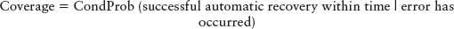

---
tip: translate by openai@2023-04-10 23:17:29
...

# CHAPTER 1

# Introduction to Fault Tolerance

Like any subject of study, there is a specialized language associated with fault tolerance. This chapter introduces these terms.

> 与其他研究主题一样，容错领域也有一套专门的**术语**。本章将对这些术语进行介绍。

The focus of this book is on ‘Fault Tolerance’ in general and in particular on things that can be done during the design of software to support fault tolerant operation. A system of software or hardware and software that is fault tolerant is able to operate even though some part is no longer performing correctly. Thus the focus of this book is on the software structures and mechanisms that can be designed into a system to enable its continued operation, even though a different part isn’t working correctly. This book describes practices to improve the reliability and availability of software systems. These practices are currently in use in a variety of software application domains.

> 本书的重点是关于"容错"的一般概念以及在软件设计过程中可以采取的措施以支持容错操作。一个容错的软硬件系统，即使其中的某部分已经无法正常工作，仍然可以正常运行。因此，本书的重点是在系统中设计的软件结构和机制，以使其在其他部分无法正常工作的情况下仍然可以继续运行。本书介绍了提高软件系统可靠性和可用性的实践。这些实践目前已经用于各种软件应用领域。

The next few sections define the vocabulary needed to discuss fault tolerance.

> 接下来的几部分将定义讨论容错所需的词汇。

# _Fault -> Error -> Failure_

The terms _fault, error_ and _failure_ have very specific meanings.

> 这些术语 _故障，错误_ 和 _失败_ 有非常特定的含义。

A system **failure** occurs when the delivered service no longer complies with the **specification**, the latter being an agreed description of the system’s expected function and/or service. An **error** is that part of the system state that is liable to lead to subsequent failure; an error affecting the service is an indication that a failure occurs or has occurred. The adjudged or hypothesized cause of an error is a **fault**. [Lap91, p. 4]

> 系统**故障**是指所提供的服务不再符合**规格说明**，后者是对系统预期功能和/或服务的约定描述。**错误**是系统状态中可能导致后续故障的部分；影响服务的错误表明故障发生了或已经发生。被认定或假设的错误原因是**缺陷**。[Lap91，第 4 页]

Every fault tolerant system composed of software and hardware must have a specification that describes what it means for that system to operate without failure. The system’s specification defines its expected behavior, such as available 99.999% of the time. When the system doesn’t behave in the manner specified in its requirements, it has failed. The term _failure_ refers to system behavior that does not conform to the systems specification.

> 每个由软件和硬件组成的容错系统都必须有一个规范来描述该系统正常运行的含义。系统的规范定义了其预期行为，例如 99.999% 的可用时间。当系统未按照其需求中规定的方式运行时，即为出现故障。**术语“故障”是指系统行为不符合系统规范。**

These are examples of failures: The system crashes to a stop when it shouldn’t, the system computes an incorrect result, the system is not available for service, the system is unable to respond to user interaction. Whenever the system does the wrong thing it has failed.

> 这些是失败的例子：系统在不应该的时候崩溃停止，系统计算出错误的结果，系统无法提供服务，系统无法响应用户互动。无论何时，只要系统做错了事情，就算是失败。

Failures are detected by the observer and users of the system.

> 故障由系统的观察者和用户检测。

Failures are dependant upon the requirements and the definition of agreed-upon correct operation of the system. If there is not a specification of what the system should do, there cannot be a failure.

> 失败取决于需求和系统约定的正确操作定义。如果没有系统应该做什么的规范，就不能算是失败。

Failures are caused by _errors_.

> **失败是由*错误*引起的。**

An _error_ is the incorrect system behavior from which a failure may occur. Errors can be categorized into two types, timing or value. Errors that manifest as value errors might be incorrect discrete values or incorrect system state. Timing errors can include total non-performance (the time was infinite).

> 错误是指系统行为不正确，可能导致失败。错误可以分为两类，时间错误和数值错误。表现为数值错误的错误可能是不正确的离散值或不正确的系统状态。时间错误可能包括完全不执行(时间无限)。

Some common examples of errors include:

> [!NOTE]
> 这里给出了一些常见的出现故障的情况

> 一些常见的错误示例包括：

Timing or Race conditions: communicating processes get out of synchronization and a race for resources occurs.

- Infinite Loops: continuous execution of a tight loop without pausing and without acknowledging the requests of others for shared resources.
- Protocol Error: errors in the messaging stream because of non-conformance with the protocol in use. Unexpected messages sent to other parts of the system, messages sent at inappropriate times, or out of sequence.
- Data inconsistency: Data may be different between two locations, for example memory and disk, or between different elements in a network.
- Failure to Handle Overload conditions: the system is unable to handle the workload.
- Wild Transfer or Wild Write: Data written to an incorrect location of memory or a transfer to an incorrect location occurs if there is a fault in the system.

> 时序或竞态条件：通信进程失去同步，导致资源竞争。
> 无限循环：紧密循环的连续执行，没有暂停，也不响应他人共享资源的请求。
> 协议错误：由于不符合所使用协议而导致的消息流中的错误。发送给系统其他部分的意外消息、在不适当的时间发送的消息或消息顺序错误。
> 数据不一致：数据在两个位置之间可能存在差异，例如内存和硬盘，或者在网络中的不同元素之间。
> 无法应对过载条件：系统无法承受工作负荷。
> 疯狂传输或疯狂写入：如果系统出现故障，数据将被写入内存的错误位置，或者传输到错误的位置。

Any of these example errors could be failures if they deviate from the system’s specification.

> 任何这些示例错误都可能成为失败，如果它们偏离了系统的规范。

Errors are important when talking about fault tolerant systems because errors can be detected before they become failures. Errors are the manifestation of _faults_, and errors are the way that we can look into the system to discover if faults are present.

> **错误在谈论容错系统时很重要**，因为错误可以在它们变成故障之前被发现。错误是故障的表现，错误是我们可以检查系统以发现是否存在故障的途径。

A _fault_ is the defect that is present in the system that can cause an error. It is the actual deviation from correctness. In a computer program it is the misplaced comma or period, or the missing <span class="inlinecode">break</span> statement in a C++ switch statement. Colloquially the fault is often called a ‘bug’, but that word will not appear elsewhere in this book.

> 故障是系统中存在的可能导致错误的缺陷。它是实际上的正确性偏差。在计算机程序中，它可以是错误放置的逗号或句号，或者在 C++ switch 语句中缺少的`break`语句。口语中，故障通常被称为“bug”，但在本书中不会再出现这个词。

The fault might be a latent software defect, or it might be a garbled message received on a communications channel, or a variety of other things. In general, neither the software nor the observers are aware of the presence of a fault until an _error_ occurs.

> 故障可能是潜在的软件缺陷，也可能是通过通信渠道收到的混乱信息，或者其他各种原因。总的来说，在出现*错误*之前，软件和观察者都不会意识到故障的存在。

A number of causes lead to the introduction of a fault into software. These include:

> 导致软件中出现故障的原因有很多，包括：

Incorrect Requirement Specification: Sometimes the software designers and coders were told to build the wrong thing.

> 需求规格不正确：有时软件设计师和编码人员被告知制作错误的东西。

Incorrect Designs: Translating system requirements into a working software design is a complicated process that sometimes results in incorrect designs. The design might not be workable from a pure software standpoint, or it might not be an accurate translation of the requirements. In either case it is faulty.

> 错误设计：将系统需求转化为可用软件设计是一个复杂的过程，有时可能导致错误设计。从纯软件的角度来看，设计可能是不可行的，或者可能不是对需求的准确翻译。无论哪种情况，这都是有缺陷的。

Coding Errors: Translating the design into working code can also introduce faults into the system. The compiler/interpreter/code examination tool can catch some faults or a fault can produce syntactically correct code that just does not perform the specified task.

> 编码错误：将设计转换为可工作的代码也可能将故障引入系统。编译器/解释器/代码检查工具可以捕捉到一些故障，或者故障可能导致生成语法正确的代码，但这些代码并不能执行指定任务。

Faults are present in every system. When a fault is lying dormant and not causing any mischief it is said to be _latent_. When the circumstances arise that the latent fault causes something incorrect to happen it is said to become _active_. A fault’s activation results in an error.

> 系统中存在各种故障。当故障处于休眠状态，不引起任何问题时，称为*潜在*故障。当出现使潜在故障导致错误发生的情况时，它被称为*活动*故障。故障的激活会导致错误。

## Examples of Fault -> Error -> Failure

To help make these very important definitions clear, here are a few examples.

> 为了帮助更清楚地定义这些非常重要的概念，下面是一些例子。

A misrouted telephone call is an example of a failure. Telephone system requirements specify that calls should be delivered to the correct recipient. When a faulty system prevents them from being delivered correctly, the system has failed. In this case the fault might have been an incorrect call routing data being stored in the system. The error occurs when the incorrect data is accessed and an incorrect network path is computed with that incorrect data.

> 一个被错误路由的电话呼叫是一个失败的例子。电话系统的要求指定呼叫应该被正确地传送给接收者。当一个有缺陷的系统阻止它们正确传送时，系统就失败了。在这种情况下，**故障可能是存储在系统中的不正确的呼叫路由数据**。当访问不正确的数据并计算不正确的网络路径时，就会发生错误。

A robotic arm used to drill a part in a manufacturing environment provides another example. Consider the fault of a misplaced decimal point in a data constant that is used in the computation of the rotation of the robot’s arm. The data constant might be the number of steps required to rotate the robotic arm one degree. The error might be that it rotates in the wrong direction because of the erroneous computation made with the faulty decimal point. The arm fails by lowering its drill at the wrong location

> 一个用于在制造环境中钻孔的机器人手臂就是另一个例子。考虑在计算机器人手臂旋转中使用的数据常数中出现的小数点错误。数据常数可能是旋转机器人手臂一度所需的步数。错误可能是由于使用有错误的小数点而导致它朝着错误的方向旋转。手臂失败了，因为它的钻头降到了错误的位置。

The preparation of an incorrect bill for service is another example of a failure. The system requirements specify that the customer will be accurately charged for service received. A faulty identification received in a message by a billing system can result in the charges being erroneously applied to the wrong account. The fault in this case might have been in the communications channel (a garbled message), or in the system component that prepares the message for transmission. The error was applying the charges to the wrong account. The fact that the customer receives an incorrect charge is the failure, since they agreed with the carrier to pay for the service that they used and not for unused service.

> 错误准备服务账单是另一个失败的例子。系统要求指定客户将准确地收取服务费用。账单系统收到的错误识别信息可能导致错误地将费用应用于错误的帐户。此案例中的错误可能是在通信信道(混乱的消息)中，或者是在准备发送消息的系统组件中。**错误是将费用应用于错误的帐户。** 客户收到错误收费的事实是失败，因为他们同意与运营商支付他们使用的服务费用而不是未使用的服务费用。

Consider a spacecraft that is given an updated set of program instructions by the Earth station controlling it. An error occurs because someone designing the update incorrectly computed the memory range to be updated. The new program was updated to this incorrect range, which corrupted another part of the programming. The corrupted instructions caused the spacecraft’s antenna to point away from Earth, breaking off communications between Earth and the spacecraft, which led to the mission being considered a failure. The initial fault was the computation of the incorrect memory range.

> 考虑一艘航天器，它被地球站控制，被给予一组更新的程序指令。由于设计更新时计算错误的内存范围，发生了错误。新程序被更新到了这个错误的范围，破坏了另一部分程序。损坏的指令导致航天器的天线偏离地球，断开了地球和航天器之间的通信，导致任务被认为是失败的。最初的故障是计算错误的内存范围。

Banking systems fail when they do not safeguard funds. An example of failure is when a bank’s automatic teller machine (ATM) dispenses too much cash to a customer. Several errors might lead to this failure. One error is that the machine counted out more bills than it should have. In this case the fault might be an incorrect computation module, or a faulty currency sorting mechanism. A different error that can result in the same failure is that the bills were loaded incorrectly into the ATM. The fault was that the courier that loaded the machine put money in the wrong dispensaries, i.e. $20 bills were placed in the $5 storage location and vice versa.

> 银行系统在没有保障资金时会失败。失败的一个例子是银行的自动取款机(ATM)向客户发放了太多的现金。可能会出现几种错误导致这种失败。一种错误是机器计算出的钞票数量多于它应该有的数量。在这种情况下，可能是计算模块出错了，或者货币分类机构出现故障。另一种可能导致相同失败的错误是钞票被错误地装入 ATM 机。这个错误是快递员将钱放入了错误的发放处，即将 20 美元放入了 5 美元的存储位置，反之亦然。

The last example illustrates how the same failure might result from different faults as shown in <a href="#c01.htm#fig1.2" id="c01.htm#fig1.2a">Figure 2</a>.

> 最后一个例子说明，**同一个故障可能会由不同的故障引起**，如<a href="#c01.htm#fig1.2" id="c01.htm#fig1.2a">图 2</a>所示。

**[Figure 2](#c01.htm#fig1.2a)** Multiple faults create the same error

> **[图 2](#c01.htm#fig1.2a)** 多个故障会产生相同的错误


Another example is the failure of the first Ariane 5 rocket from the European Space Agency. Flight 501 veered off its intended course, broke up and exploded shortly into the flight. The inertial reference system for the Ariane 5 was reused from the Ariane 4. The initial period of the flight the Ariane 5’s flight path took was different enough than Ariane 4 for the inertial reference system to encounter errors in the horizontal velocity calculations. These errors resulted in the failure of the backup inertial reference system, followed by a failure of the active inertial reference system. The loss of inertial reference systems resulted in a large deviation from the desired flight path, which resulted in a mechanical failure that triggered self-destruct circuitry. The fault in this case can be traced to a change in the requirements between Ariane 4 and Ariane 5 that enables for a more rapid buildup of horizontal velocities in Ariane 5. The error that resulted from the horizontal velocity increasing too rapidly resulted in the failure. [ESA96]

> 一个例子是欧洲航天局首枚 Ariane 5 火箭失败。航班 501 偏离了其预期的航线，爆炸毁损。Ariane 5 的惯性参考系统重用了 Ariane 4 的系统。飞行的最初阶段，Ariane 5 的飞行路径比 Ariane 4 有很大的变化，以致惯性参考系统在水平速度计算中出现错误。这些错误导致备用惯性参考系统失效，接着活动惯性参考系统也失效了。惯性参考系统的丢失导致了与预期航线的大偏差，进而导致机械故障，触发了自毁电路。这种情况的错误可以追溯到 Ariane 4 和 Ariane 5 之间的要求变化，使 Ariane 5 的水平速度可以更快地增加。由于水平速度增加太快而导致的错误，最终导致了失败。[ESA96]

# _Failure Perception [Lap91][kop97]_

A _fail-silent_ failure is one in which the failing unit either presents the correct result or no result at all. A _crash failure_ is one where the unit stops after the first fail-silent failure. When a crash failure is visible to the rest of the system, it is called a _fail-stop_ failure.

> 一种*失败安静*失败是指单元要么提供正确的结果，要么根本不提供结果。一种*崩溃失败*是指单元在第一次失败安静失败后停止工作。当崩溃失败对系统的其他部分可见时，它被称为*失败停止*失败。

> [!note]
> 失败的类型

A set-top entertainment system computer fails quietly, without announcing to the world that it has failed. When it fails it just stops providing service. The computer in the Voyager spacecraft fails in a crash failure mode after it detects its first failure, which is detected by the backup computer, which assumes primary control. [Tom88]

> 当一台机顶盒娱乐系统电脑出现故障时，它不会向外界宣布自己已经失效，而是**悄然失败，停止提供服务**。“探索号”太空船中的电脑在检测到第一个故障，由备用电脑接管主控权之后，以崩溃失效模式失效[Tom88]。

Failures can be categorized as either consistent or inconsistent. Consistency refers to whether the failure appears the same each time it is observed. Examining the failure occurs from the viewpoint of the user, the person or other system that is determining that the failing system did not conform to its specifications. Consistent failures are seen as the same kind of failure by all users or observers of a system. An example of failing consistently is reporting ‘1’ in response to all questions that the system is asked.

> **失败可以分为一致或不一致。一致性是指每次观察到的失败是否相同。** 从用户的角度来检查失败，是指确定失败系统未符合其规格的人或其他系统。所有用户或观察者都认为一致的失败是相同类型的失败。一致失败的一个例子是对系统提出的所有问题都回答“1”。

Inconsistent failures are ones that appear different to different observers. These are sometimes called two-faced failures, malicious failures or Byzantine failures. These are the most difficult to isolate and correct because the failure is presenting multiple faces to the error detection, processing, and fault treatment phases of recovery.

> 不一致的故障是针对不同观察者呈现出不同结果的故障。这些有时被称为双面故障、恶意故障或拜占庭故障。这些是最难隔离和纠正的，因为故障在错误检测、处理和故障处理阶段向恢复呈现多种面貌。

An example of an inconsistent failure is to respond with ‘1’ to questions asked by one peer and ‘2’ to questions from all other peers. Another example is when the failing system misroutes all network traffic to a certain network address, and not to other network addresses. The observers of the system, the network peers, see one of two behaviors: either they see a complete absence of network traffic, or they see a flood of network traffic of which most of it is incorrect and should not have been received. This failure is inconsistent because the perception of whether the system is sending traffic or not sending traffic depends on which peer is the observer.

> 一个不一致的失败的例子是，对一个同行提出的问题回答“1”，而对其他同行提出的问题回答“2”。另一个例子是，失败的系统将所有网络流量路由到某个网络地址，而不是其他网络地址。系统的观察者，网络同行，看到两种行为之一：他们看到完全没有网络流量，或者看到大量的网络流量，其中大多数是不正确的，不应该收到的。这种故障是不一致的，因为系统是否发送流量的感知取决于观察者是哪个同行。

Inconsistent failures are very hard to detect and to correct because they appear different to each observer. In particular they might appear correct to the part that would detect a failure and incorrect to all other parts of the system. To counter the risk of the failure appearing differently to different observers, fault tolerant design attempts to turn the potentially inconsistent failures into consistent failures. This is accomplished by creating boundaries around failing functionalities, and transforming all failures into fail-silent failures.

> **不一致的故障很难检测和纠正**，因为它们对每个观察者来说都不同。特别是，它们可能对可以检测到故障的部分看起来是正确的，但对系统的其他部分来说是不正确的。为了抵消故障在不同观察者之间出现不同的风险，容错设计试图将潜在的不一致故障转变为一致的故障。这是通过在失败的功能周围创建边界，并将所有故障转换为静默失败来实现的。

Fail-silent failures are the easiest type of failures to be tolerated because the observed failure is that the failing unit has stopped working. The reason for the failure is unclear, but the failing element is identified and the failure is contained and is not spreading throughout the system.

> **失效安静失败是最容易容忍的失败类型，因为观察到的失败是失效单元已停止工作。原因不清楚，但是失效元件被识别出来，失败被控制住，没有扩散到整个系统。**

# _Single Faults_

Much of the fault tolerant design over the years has been created to handle only one error at a time. The assumption is that only one error will occur at a time and recovery from it has completed before another error occurs. A further assumption is that errors are independent of each other.

> 近年来，许多容错设计都是为了**一次只处理一个错误**而创建的。假设只会发生一个错误，并且在发生另一个错误之前，恢复工作已经完成。**进一步假设错误是相互独立的**。

While this is a common design principle in real life, many failures have occurred when this assumption has been invalid.

> 当这是现实生活中的一个常见设计原则时，当这个假设不成立时，许多失败也发生了。

To understand why this is a valuable assumption, consider <a href="#c01.htm#tab1.1" id="c01.htm#tab1.1a">Table 1.1</a>. It shows the theoretical results that indicate how many redundant units are required to tolerate independent faults of three kinds: fail-silent, consistent and malicious (inconsistent). The type of failures tolerated influences the number of components required to tolerate failures. From this table, most designers will see that the most desirable situation is to have the failing unit fail silently, because that requires only two units to tolerate the failures.

> 考虑<a href="#c01.htm#tab1.1" id="c01.htm#tab1.1a">表 1.1</a>可以了解为什么这是一个有价值的假设。它显示了理论结果，表明**需要多少个冗余单元来容忍三种独立故障：失效静默、一致和恶意(不一致)。** 可容忍的故障类型影响组件数量来容忍故障。从这张表中，大多数设计师都会看到，**最理想的情况是让失效单元静默失效，因为只需要两个单元就可以容忍故障**。

```
    [**Table 1.1**](#c01.htm#tab1.1a) Minimum number of components to tolerate failures [Kop97, p. 121]

    ---
    **MINIMUM NUMBER OF COMPONENTS TO TOLERATE FAILURES** **TYPE OF FAILURE**
    n + 1 _Fail-silent_ failures
    2n + 1 _Consistent_ failures
    3n + 1 _Malicious_ failures
    ---
```

To gain perspective of the ramifications in [Table 1.1](#c01.htm#tab1.1), the computer control system in the Space Shuttle is designed to tolerate two simultaneous failures which must be consistent but need not be silent and, as a result, it has five general purpose computers. [Skl76] A typical telephone switching system is designed to tolerate single failures. Many components are duplicated because two units are all that are required to tolerate single failures.

> 为了获得[表 1.1](#c01.htm#tab1.1)的影响，空间舱的计算机控制系统被设计为容忍两个同时发生的故障，**这些故障必须是一致的，但不需要是沉默的，因此它有五台通用计算机**。[Skl76] **一个典型的电话交换系统被设计为容忍单个故障。许多部件被复制，因为只需要两个单元就可以容忍单个故障。**

# _Examples of How Vocabulary Makes a Difference_

When debugging failures it is very useful to determine what is the fault, what is the error and what is the failure. Here are a few examples. These also show that the terms, while specific, depend on the viewpoint and the depth of examination.

> **当调试失败时，确定错误、故障和失败的原因非常有用。** 以下是一些例子，也表明这些术语取决于视点和深度检查。

Consider the robotic arm failure presented above. Was the fault that the arm software rotated in the wrong direction, or was it the incorrect data that drove the state change? Knowing which the fault was helps us know what to fix.

> 考虑上面提出的机器人手臂故障。故障是手臂软件旋转方向错误，还是驱动状态变化的数据不正确？知道故障是什么有助于我们知道该如何修复。

As another example, consider the Ariane 5 failure mentioned earlier. Was the fault that the specification didn’t reflect the expected flight path? Or was the fault that the reused component was insufficiently tested to detect the fault? Was the error that the incorrect specification was used, or was the error that the flight path deviated from the Ariane 4 flight path? Identifying and correctly labeling faults and errors simplifies the fault treatment.

> 以另一个例子来看，考虑到先前提到的 Ariane 5 失败。是规范没有反映预期飞行路径的错误吗？还是重复使用的部件不足以检测出故障的错误？错误是使用了错误的规范，还是飞行路径偏离了 Ariane 4 的飞行路径？确定和正确标记故障和错误可以简化故障处理。

# _Coverage_

The coverage factor is an important metric of a system’s fault tolerance. Highly reliable and highly available systems strive for high coverage factors, 95% or higher.

> **覆盖率因子是系统容错能力的重要指标。** 高可靠性和高可用性系统力求覆盖率高，**95％或更高**。

The _coverage_ is the conditional probability that the system will recover automatically within the required time interval given that an error has occurred.

> **覆盖率是指在发生错误的情况下，系统能够在所要求的时间间隔内自动恢复的条件概率。**



In the Space Shuttle avionics nearly perfect coverage is attained in a complex of four off-the-shelf processors by comparing the output of simultaneous computations in each of the processors. Each Shuttle processor is equipped with a small amount of redundancy management hardware to manage the receipt of the values to be compared. Through the use of this hardware the processor can identify with certainty which of its peers computed an incorrect value. The coverage was increased to 100% through the additional technique of placing a timer on the buses used to communicate between the processors. [Skl76]

> **在航天飞机航空电子系统中，通过比较四个现成处理器的输出结果，几乎可以获得完美的覆盖率。** 每个航天飞机处理器都配备了一些冗余管理硬件来管理要比较的值。通过使用这种硬件，处理器可以确定它的同行计算出了错误的值。**通过在用于在处理器之间传输数据的总线上安装一个定时器，覆盖率可以提高到 100％。[Skl76]**

> [!NOTE]
> 这里还引用了一篇论文

Coverage can be computed from the probability associated with detection and recovery.

> **覆盖率可以通过与检测和恢复相关的概率计算出来。**


Obtaining the probabilities used to compute the coverage factor is difficult. Extensive stability testing and fault insertion testing are required to obtain these values.

> 获取计算覆盖因子所使用的概率是困难的。需要进行大量的稳定性测试和故障插入测试才能获得这些值。

# _Reliability_

A system’s _reliability_ is the probability that it will perform without deviations from agreed-upon behavior for a specific period of time. In other words, that there will be no failures during a specified time.

> **系统的可靠性是指它在特定时间内按照协议行为执行的概率。换句话说，在指定的时间内不会发生故障。**

The parameters used to describe reliability are Mean Time To Failure (MTTF) and Mean Time to Repair (MTTR). The Mean Time To Failure is the average time from start of operation until the time when the first failure occurs. The Mean Time to Repair is a measure of the average time required to restore a failing component to operation. In the case of hardware this means the time to replace the faulty hardware component in addition to the time to travel to the site to be able to perform the repair actions. The Mean Time Between Failures, or MTBF, is similar to MTTF but reflects the time from the start of operation until the component is restored to operation after repair. MTBF is the sum of MTTF and MTTR. MTBF is used in situations where the system is repairable, and MTTF is used when it cannot be repaired. The start of operations for both MTTF and MTBF refers to when normal operations are resumed, either after initial startup or after recovery has completed. The reliability can be computed with the following equation.

> **可靠性的参数是平均故障时间(MTTF)和平均修复时间(MTTR)。**
>
> - **平均故障时间是从操作开始到第一次故障发生的平均时间。**
> - **平均修复时间是恢复故障部件到操作状态所需的平均时间。** 在硬件的情况下，这意味着更换故障硬件部件以及前往现场执行修复操作所需的时间。
> - **平均故障间隔时间(MTBF)** 与 MTTF 类似，但反映的是从操作开始到修复后部件恢复操作所需的时间。
>   **MTBF 是 MTTF 和 MTTR 的总和。** MTBF 用于系统可以修复的情况，而 MTTF 用于无法修复的情况。MTTF 和 MTBF 的操作开始时间指的是初始启动或恢复完成后恢复正常操作的时间。可靠性可以用以下公式计算。


Failure rate is the inverse of MTTF. A commonly used measurement of failure rate is FITs, or Failures in Time. FITs are the number of failures in 1 × 10<sup>9</sup> hours.

> **失败率是 MTTF 的倒数。一种常用的失败率测量方法是 FIT，即时间故障次数。** FITs 是 1×10<sup>9</sup>小时内的故障次数。

## Reliability Examples

### _Mars Landers_

The Mars Exploratory Rovers, Spirit and Opportunity, had a design duration of 90 days. The reliability of these two Mars explorers has been so good that they lasted more than 1000 days. However, note that this refers only to complete system failures. There have been partial failures requiring workarounds or fault treatment, such as finding a way to keep the Mars Rover Sprit operating on only five of its six wheels. [NASA04][nasa06].

> 火星探索机器人“Spirit”和“Opportunity”原定设计使用期限为 90 天。但这两台火星探索机器人的可靠性非常好，它们使用时间超过 1000 天。但要注意，这只是指**完全系统故障**。还有**部分故障需要进行解决方案或故障处理，如找到一种方法让火星探索机器人“Spirit”只用其中的五个轮子继续运行[NASA04][nasa06]。**

### _Airplane Navigation System_

Many modern airplanes rely extensively on computers to control critical systems. While the aircraft is in the air, the navigational computers must operate failure-free. On a flight from Chicago to Los Angeles, the navigation system must be failure-free for between four and five hours. The MTTF during the operational phase of the system must be greater than five hours; if it were less the flight crew could expect at least one failure on their flight. If the navigational system fails while the airplane is at the gate on the ground, repairs can return it to operational status before its next flight. Before or after a flight it is still a failure, but it might not be considered into the system’s reliability computations. The MTTR must be low because airlines require their planes to be highly available in order to maximize their return on investment.

> **许多现代飞机严重依赖计算机来控制关键系统。** 当飞机在空中时，导航计算机必须无故障运行。从芝加哥飞往洛杉矶的航班，导航系统必须在 4-5 小时内无故障运行。**系统运行阶段的平均无故障时间(MTTF)必须大于 5 小时**；否则机组人员可能在他们的航班中遇到一次故障。如果导航系统在飞机在地面机位**停靠时发生故障，维修可以在其下一次飞行前将其恢复到可操作状态。** **在飞行前或飞行后仍然是故障，但可能不被计算在系统的可靠性计算中。** 平均故障恢复时间(MTTR)必须很短，因为航空公司要求他们的飞机具有高可用性，以最大化他们的投资回报。

## Measuring Reliability

There are two primary methods of determining the reliability of a system. The first is to watch the system for a long time and calculate the probability of failure at the end of the time. The other is to predict the number of faults and from that number to predict the probability of failures (both numbers of failures and durations). Software Reliability Engineering focuses on measuring and predicting reliability.

> 有两种主要方法来确定系统的可靠性。
>
> - 第一种是**观察系统很长时间，并在结束时计算故障的概率**。
> - 另一种是**预测故障数量，并从中预测故障(故障数量和持续时间)的概率**。
>
> 软件可靠性工程**专注于测量和预测**可靠性。

# _Availability_

A system’s availability is the percentage of time that it is able to perform its designed function. _Uptime_ is when the system is available, _downtime_ is when it is not. A common way to express availability is in terms of a number of nines, as indicated in <a href="#c01.htm#tab1.2" id="c01.htm#tab1.2a">Table 1.2</a>.

> 系统的可用性是它能够完成其设计功能的时间百分比。可用性是指系统可用时的时间，而不可用时的时间称为停机时间。一种常见的表示可用性的方式是以数字九表示，如<a href="#c01.htm#tab1.2" id="c01.htm#tab1.2a">表 1.2</a>所示。

```
    [**Table 1.2**](#c01.htm#tab1.2a) Availability as a number of nines
    ---
    **EXPRESSION** **MINUTES PER YEAR OF DOWNTIME**
    100% 0
    Three 9s 99.9% 525.6
    Four 9s 99.99% 52.56
    Four 9s and a 5 99.995% 26.28
    Five 9s 99.999% 5.256
    Six 9s 99.9999% 0.5256
    100% 0
    ---
```

Availability is computed as:

> 可用性计算如下：


Availability and Reliability are two concepts that are easy to get confused. Availability is concerned with what percentage of time the system can perform its function. Reliability is concerned with the probability that the system will perform failure-free for a specified period of time.

> **可用性和可靠性**是容易混淆的两个概念。可用性涉及系统执行其功能的时间百分比。**可靠性涉及系统在特定时间内无故障执行的概率**。

## Availability Examples

The 4ESS™ Switch from Alcatel-Lucent had an explicit requirement when it was designed in the 1970s of two hours of downtime every 40 years. This equates to an unavailability of three minutes per year, which is slightly better than five 9s. The 5ESS<sup>®</sup> Switch from Alcatel-Lucent has achieved six 9’s of availability for a number of years.

> 1970 年代，来自阿尔卡特朗讯的 4ESS™ 交换机在设计时有一个明确的要求，每 40 年只能停机 2 小时。这相当于每年只有 3 分钟的不可用时间，比五个九的可用性略高。阿尔卡特朗讯的 5ESS<sup>®</sup>交换机已经实现了多年的**六九可用性**。

# _Dependability_

_Dependability_ is a measure of a system’s trustworthiness to be relied upon to perform the desired function. **The attributes of dependability are reliability, availability, safety and security.** _Safety_ refers to the non-occurrence of catastrophic failures, whose consequences are much greater than the potential benefit. _Security_ refers to the unauthorized access or unauthorized handling of information. **Since dependability includes both reliability and availability, the correctness of the result is important. [Lap91]**

> **可靠性是衡量系统可信赖性的一个标准，能够执行所需功能。** **可靠性的属性包括可靠性、可用性、安全性和安全性。**
> 安全性(_Safety_)是指不会发生灾难性故障，其后果远远大于潜在的好处。
> 安全性(_Security_)是指未经授权访问或未经授权处理信息。由于可靠性(dependability)包括可靠性(reliability)和可用性(availability)，所以结果的正确性很重要。[Lap91]

# _Hardware Reliability_

Unlike software, hardware faults can be analyzed statistically based upon behavior and occurrence and also the physics of materials. The reliability of hardware has been studied for a long time, and covered in great depth. Hardware reliability includes the study of the physics and the materials, as well as the way things wear out. There is an array of technical conferences and journals that address this topic, such as the International Reliability Physics Symposium and the Electronic Components Technology Conference and IEEE journals _Device and Materials Reliability, Advanced Packaging and Solid State Circuits_.

> **不同于软件，硬件故障可以根据行为和发生率以及材料物理学进行统计分析。** **硬件的可靠性**已经被研究了很长时间，并且有很深的研究。硬件可靠性包括物理学和材料的研究，以及物品磨损的方式。有一系列技术会议和期刊涉及这一主题，如国际可靠性物理学研讨会、电子元件技术会议和 IEEE 期刊《设备与材料可靠性、先进封装和固态电路》。

# _Reliability Engineering and Analysis_

Software Reliability Engineering is the practice of monitoring and managing the reliability of a system. By collecting fault, error, and failure statistics during development, testing, and field operation, monitoring and managing the parameters of reliability and availability is possible. The _Handbook of Software Reliability Engineering_ [Lyu96] contains a number of articles on topics related to Software Reliability Engineering.

> **软件可靠性**工程是监控和管理系统可靠性的实践。通过在开发、测试和现场操作过程中收集故障、错误和失败统计信息，可以监控和管理可靠性和可用性的参数。《软件可靠性工程手册》[Lyu96]包含了一些与软件可靠性工程相关的文章。

A widely used technique is Reliability Growth Modeling, which graphs the cumulative number of faults corrected versus time. Prediction methods calculate the cumulative number of faults expected, which enables comparison with the measured results. This, in turn, enables the determination of the number of faults remaining in the system.

> 一种广泛使用的技术是可靠性增长建模，它将累计纠正故障数量与时间进行图形化。**预测方法计算预期的累计故障数量，从而可以与测量结果进行比较。进而，可以确定系统中剩余的故障数量。**

Markov modeling of systems (including software components) is another technique useful for predicting the reliability of a system. These models enable analysis of redundancy techniques and prediction of MTTF.

> **马尔可夫建模(包括软件组件)是另一种用于预测系统可靠性的有用技术。这些模型可以分析冗余技术并预测 MTTF。**

Markov models are constructed by defining the possible system states. Transitions between the states are defined and are assigned a probability factor. The probability indicates the likelihood that the transition will occur. An important aspect of the model is that the probability of a state transition depends only on the current state; history is not considered. <a href="#c01.htm#fig1.3" id="c01.htm#fig1.3a">Figure 3</a> shows a simple Markov model for a duplex system in which either system may fail with probability λ and be restored to service with probability µ and a coverage factor c. The failure rate, (λ), is the inverse of the MTTF, and the repair rate (µ) is the inverse of MTTR.

> 马尔可夫模型是通过定义可能的系统状态来构建的。定义状态之间的转换，并为它们分配概率因子。概率表明转换发生的可能性。该模型的一个重要方面是，**状态转换的概率仅取决于当前状态; 历史不被考虑。** <a href="#c01.htm#fig1.3" id="c01.htm#fig1.3a">图 3</a>显示了一个简单的马尔可夫模型，用于双工系统，**其中任一系统可能以概率 λ 失效，以概率 μ 恢复服务，以及覆盖因子 c。故障率(λ)是 MTTF 的倒数，修复率(μ)是 MTTR 的倒数。**

**[Figure 3](#c01.htm#fig1.3a)** Simple duplex system Markov model(简单的双工系统马尔可夫模型)


# _Performance_

Performance and reliability are two closely related concepts. Is the system’s reliability a performance requirement, or is the performance of a system a reliability requirement? An example of a performance requirement is that the application performs failure-free for three days. An example of a requirement for reliability is that the system supports 300 000 transactions per hour with a graceful degradation above this level of traffic, see <a href="#c01.htm#fig1.4" id="c01.htm#fig1.4a">Figure 4</a>. If a working system does not meet these requirements it has failed.

> **性能和可靠性是两个密切相关的概念**。
> **系统的可靠性是性能要求还是系统的性能是可靠性要求？**
> 性能要求的一个例子是应用程序在三天内**无故障运行**。
> 可靠性要求的一个例子是系统每小时支持 30 万笔交易，超过这个流量会出现**优雅降级**，见<a href="#c01.htm#fig1.4" id="c01.htm#fig1.4a">图 4</a>。如果一个运行正常的系统不符合这些要求，它就失败了。

> [!NOTE]
> 这里给出了对于可靠性的两个方面！
> 这对于功能冗余备份的概念辨析很有帮助！

**[Figure 4](#c01.htm#fig1.4a)** Performance or reliability requirements?(性能或可靠性要求？)


The last requirement mentioned, that the system support 300 000 transactions per hour with a graceful degradation above this level, is an example of a requirement to deal with the situation that the workload exceeds the design requirements. For example, how will the system behave if the workload is more than the 300 000 transactions per hour for which it was designed, for instance 500 000 transactions per hour? The system’s architects and designers must be prepared for these situations as well.

> 最后一个要求提到，**系统每小时支持 30 万笔交易，超过这个水平时能够优雅地降级**，这是处理工作负荷超出设计要求的情况的一个要求的示例。例如，如果**工作负荷超过**为其设计的 30 万笔交易，比如 50 万笔交易，系统将如何表现？系统的架构师和设计师**也必须为这些情况做准备**。

Failures of either of these example requirements are performance failures. The failures can be complete, meaning that the system has totally failed, and is therefore totally unavailable. Performance failures can also be partial. The system might not gracefully degrade when the workload is greater than 300 000 transactions per hour. Alternatively, the system might not be fully available for service because it is working to recover from a failure. When the fault tolerance elements are working to detect and process errors and failures, the system may not be operating at the desired level of performance.

> 失败的任何一个示例要求都是性能失败。**失败可以是完全的**，意味着系统完全失败，因此完全不可用。**性能失败也可以是部分的**。当工作量超过 30 万个事务每小时时，系统可能不会优雅地降级。或者，由于正在恢复失败，系统可能不完全可用于服务。当容错元素正在检测和处理错误和故障时，系统可能无法按照预期的性能水平运行。

Clear performance requirements must be specified. The requirements must state how the system is to behave when too many requests for service are received. When the arriving requests for service exceed the amount that the system can handle it is said to be _overloaded_ or _in overload_.

> 明确的性能要求必须被指定。这些要求必须陈述系统在收到太多服务请求时会如何表现。当收到的服务请求超过系统可以处理的量时，就称之为“超负荷”或“超载”。

Some example failures related to system performance are these:

> 一些与系统性能相关的失败的例子有：

Too many requests for service arriving at the system can lead to failures when the system does not handle the requests in a way that conforms to the specification. For example, the overloaded system might stop working, or become saturated with reduced throughput, or might not return to acceptable levels after the load returns to normal levels. See the three examples in <a href="#c01.htm#fig1.5" id="c01.htm#fig1.5a">Figure 5</a>.

> **太多的服务请求到达系统可能会导致系统无法按照规格处理请求而失败。** 例如，过载的系统可能会停止工作，或者会因负载减少而饱和，或者负载恢复正常水平后可能无法恢复到可接受的水平。请参见<a href="#c01.htm#fig1.5" id="c01.htm#fig1.5a">图 5</a>中的三个示例。

**[Figure 5](#c01.htm#fig1.5a)** Possible system behaviors(可能的系统行为)


The system might not be able to handle the expected volume of service requests, which is clearly a failure to achieve the specifications, <a href="#c01.htm#fig1.6" id="c01.htm#fig1.6a">Figure 6</a>.

> 系统可能无法处理预期的服务请求量，这显然是未能实现规格的失败，<a href="#c01.htm#fig1.6" id="c01.htm#fig1.6a">图 6</a>。

**[Figure 6](#c01.htm#fig1.6a)** Failing to meet requirements(未能满足要求)


The capacity of a system represents a tradeoff between the system’s cost and its dependability under load. In a study of the US public switched telephone network, although overload, or performance errors, accounted for only six per cent of the outages, they comprised nearly fifty per cent of the lost customer access to the network [Kuh 97].

> **系统的容量代表了系统成本和负载下的可靠性之间的权衡。** 在对美国公共交换电话网的研究中，尽管过载或性能错误仅占网络中断的 6％，但它们占失去客户访问网络的近 50％[Kuh 97]。

Since failures are the result of faults, a well designed fault tolerant system will be able to both process the required level of requests and gracefully handle excess workload. We can think of the fault as either the system not including the techniques required to handle the arriving workload or the excess number of arriving requests. The former is avoided by clear specifications of desired behavior and designing and building to meet those specifications. The fault of an excess number of arriving requests manifests itself as an error that must be handled by the system. Techniques to gracefully handle these situations are found in Chapter 7, Error Mitigation Patterns. Some example situations from the telephone network that can cause extreme load to be offered to the system include: mass call-ins, such as for concert tickets or voting on shows such as American Idol. The arriving load can also easily exceed the design specifications during periods of natural disasters when people are calling to check on friends and family in the affected areas.

> **由于故障是失败的结果，一个设计良好的容错系统将能够处理所需的请求水平并优雅地处理超负荷工作。** 我们可以把故障看作是系统没有包括处理到达工作负荷所需的技术，或者是到达请求的过多。前者可以通过明确指定期望的行为并设计和构建以满足这些规范来避免。到达请求过多的故障表现为必须由系统处理的错误。**在第 7 章，错误缓解模式中可以找到优雅处理这些情况的技术。** 一些来自电话网络的例子可以导致向系统提供极端负荷，包括：大规模呼叫，如购买演唱会门票或投票参加美国偶像秀之类的节目。在自然灾害期间，当人们打电话查询受影响地区的朋友和家人时，到达的负荷也很容易超过设计规范。

Long experience in the telephone network has shown the characteristic curve of system response seen in <a href="#c01.htm#fig1.7" id="c01.htm#fig1.7a">Figure 7</a>. As the offered load increases, the system performance follows it to a point beyond which the system runs into internal congestion issues and can no longer handle the offered load. The total handled load begins to fall at this point. The internal delays arise primarily from the time spent finding idle resources, queuing and dequeuing requests. A fault tolerant system should be able to ride through this workload saturation without failing. As the workload decreases the system should follow its same performance curve and continue to process the workload, without any periods of unavailability.

> 长期经验表明，电话网络的响应特性曲线如图 7 所示。**随着提供的负载增加，系统性能也随之增加，但到达一定程度后，系统就会遇到内部拥塞问题，无法处理提供的负载。** 总处理量在此点开始下降。内部延迟主要来自寻找空闲资源、排队和出队请求所花费的时间。一个容错系统应该能够经受住这种负载饱和，而不会失败。随着负载的减少，系统应该沿着同样的性能曲线继续处理负载，而不会出现不可用的时期。

**[Figure 7](#c01.htm#fig1.7a)** Idealized versus measured load(理想化与测量负载对比)


<span id="c02.htm"></span>
