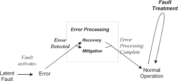

---
tip: translate by openai@2023-04-11 08:38:39
...

# CHAPTER 3

# Introduction to the Patterns

This chapter builds on the definitions of Chapter 1 and the Fault Tolerant Mindset of Chapter 2 to provide an introduction to the patterns. This includes information about the context that is assumed by, and is shared by, the patterns found in the later chapters.

> 本章基于第一章的定义和第二章的容错心态，为模式提供了一个介绍。这包括了后面章节中模式所假定和共享的上下文信息。

Four phases of fault tolerance describe the execution time lifecycle of a fault: **_error detection, error recovery, error mitigation_** and **_fault treatment_**. These are shown in <a href="#c03.htm#fig3.8" id="c03.htm#fig3.8a">Figure 8</a>. To be fault tolerant, the first thing that must happen when a fault activates and an error occurs is error detection. This can happen through a routine means such as an audit (checksum) check, or through special components that are designed to detect when an error has happened.

> 四个故障容错阶段描述了故障的执行时间生命周期：**错误检测、错误恢复、错误缓解**和**故障处理**。这些都在<a href="#c03.htm#fig3.8" id="c03.htm#fig3.8a">图 8</a>中表示。**为了具有故障容错能力，当故障激活并发生错误时，第一件事必须发生的是错误检测。** 这可以通过常规方式（如校验和检查）或通过特定组件来实现，以检测错误发生。

**[Figure 8](#c03.htm#fig3.8a)** Four phases of fault tolerance(故障容错的四个阶段)

Once detected the error must be processed, which is the focus of the next two phases. These phases are executed in real time and will affect the unavailability of the system. Error recovery works to substitute an error-free system state for the erroneous system state that was detected.

> 一旦发现错误，必须进行处理，这是接下来两个阶段的重点。这些阶段是实时执行的，会影响系统的不可用性。错误恢复的工作是为发现的错误系统状态替换出一个错误免疫的系统状态。

In some cases the error can be removed, or mitigated, without transitioning to a different system state. For example when an erroneous data value can be corrected and processing can continue, as opposed to returning the system to the state from which it could attempt to recompute the data value correctly.

> 在某些情况下，可以在不转换到不同系统状态的情况下消除或减轻错误。例如，当可以纠正错误的数据值并继续处理时，而不是将系统返回到可以尝试正确计算数据值的状态。

Fault treatment is done last, and is the step in which the fault is removed from the system through software update or patching mechanisms. [Lap91, pp 23–25] Restoration of normal operation usually resumes before fault treatment begins.

> **故障处理是最后一步，是通过软件更新或补丁机制从系统中移除故障的步骤。[Lap91，第 23-25 页]在开始故障处理之前，通常会恢复正常操作。**

Chapters 5 through 8 focus on the four phases of fault tolerance. Chapter 5 addresses detection techniques. Chapters 6 and 7 cover error processing: Chapter 6 discusses error recovery techniques. Error mitigation is covered in Chapter 7 and Chapter 8 discusses fault treatment techniques. Chapter 5 also contains error processing patterns that provide a foundation for those in Chapters 6 and 7. Chapter 4 focuses on architectural attributes of the system, those things that cut across the entire system.

> 章节 5 到 8 聚焦于容错的四个阶段。第 5 章讨论检测技术。第 6 和 7 章涵盖错误处理：第 6 章讨论错误恢复技术。第 7 章讨论错误缓解，第 8 章讨论故障处理技术。第 5 章还包含错误处理模式，为第 6 和 7 章提供基础。第 4 章聚焦于系统的体系结构属性，即贯穿整个系统的事物。

The patterns that follow discuss fault tolerance both to protect data from the effects of faults and to protect execution flows from faults. The choice of which technique is appropriate for any given design problem is based on the context of the problem and the system’s specifications.

> 以下模式讨论了容错性，既可以保护数据免受故障影响，也可以保护执行流程免受故障影响。为特定设计问题选择适当技术的选择取决于问题的环境和系统的规格。

# _Shared Context for These Patterns_

The shared context for these patterns includes the following attributes. Most of the patterns focus narrowly on the fault tolerance issue so that they are small enough and discrete enough that an individual developer or a small team can use them.

> 这些模式共享的上下文包括以下属性。大多数模式都专注于容错问题，因此它们足够小且足够离散，以便单个开发人员或小团队可以使用它们。

## Real-Time

The patterns apply to both soft and hard real-time systems. Soft real-time refers to systems that do not have functions that absolutely must occur at certain times or with specified frequency. Soft real-time systems have deadlines, but failure to satisfy a system deadline does not result in a catastrophic failure. The limits of acceptable variation due to system workload are described in the system’s requirements. An example of a soft real-time system is a web server. Responses are desired very quickly, but if a request should take longer than specified it won’t result in a system failure. On the other hand in a hard real-time system, such as an aircraft flight control system, there can be catastrophic consequences if a deadline is missed. Late results can have just as catastrophic an impact as a totally missed deadline. Hard real-time systems have much more stringent constraints that soft real-time systems. The fault tolerance techniques that should be employed in hard real-time systems are a superset of the ones in this book.

> **这些模式适用于软实时系统和硬实时系统。**
> 软实时系统指的是没有必须在特定时间或指定频率发生的功能的系统。软实时系统有截止日期，但未能满足系统截止日期不会导致灾难性失败。受系统负载影响的可接受变化范围在系统要求中描述。软实时系统的一个例子是 Web 服务器。要求响应得很快，但如果请求超过指定的时间不会导致系统失败。
> 另一方面，在硬实时系统中，如飞机飞行控制系统，如果错过截止日期可能会导致灾难性后果。迟到的结果可能会像完全错过截止日期一样具有灾难性的影响。硬实时系统有更严格的约束条件。**应在硬实时系统中采用的容错技术是本书中的超集。**

## High Reliability

The system will have stringent availability and correctness requirements.

> 系统将具有严格的可用性和正确性要求。

### _High Availability_

The systems should be available for service as much as possible. The system’s requirements will state the expectations of the customer for what percentage of the time the system will be available.

> 系统应尽可能多地提供服务。系统的要求将阐明客户对系统可用时间的期望百分比。

### _Failure Rate Requirements_

The system has requirements for acceptable failure rates, such as ‘only 1 in 100 000 transactions may be dropped or otherwise mishandled’. These requirements define the needed accuracy of the results and when taken together with the unavailability requirements define the dependability requirements of the system. In some cases the requirements will be very stringent to avoid catastrophic failures, for example the failure of the navigational control system in an aircraft is a serious matter that must be avoided. In some cases, the requirements for accuracy will not be as stringent.

> **系统有可接受的失败率的要求**，如“每 10 万笔交易中只有 1 笔可能被丢失或处理不当”。这些要求定义了结果所需的准确性，并且与不可用性要求一起定义了系统的可靠性要求。在某些情况下，要求非常严格，以避免灾难性失败，例如飞机的导航控制系统的失败是一个严重的问题必须避免。在某些情况下，准确性的要求不会那么严格。

## State or Stateless

The _state_ of the system is the combination of local variables, execution location (i.e. the program counter), and workload status that describes what the system is doing at any specific instance. A system’s state information may be stored internally, in memory or externally, in a file system or database. Systems that have only small amounts of state information have different needs for recovery techniques than do systems that keep large amounts of state information.

> **系统的状态是本地变量、执行位置（即程序计数器）和工作状态的组合，描述系统在任何特定实例上正在做什么。** 系统的状态信息可以存储在内部，在内存中或外部，在文件系统或数据库中。**只有少量状态信息的系统对恢复技术的需求与保存大量状态信息的系统不同。**

Web servers provide an example of stateless systems. Requests arrive at the server, are processed and then they are no longer part of the system. An individual operating system command that starts and completes in a short time is another example of a stateless command.

> **网络服务器提供了一个无状态系统的例子。** 请求到达服务器，然后被处理，之后就不再是系统的一部分。**一个在短时间内启动和完成的单个操作系统命令也是一个无状态命令的例子。**

The public switched telephone network provides an example of a stateful system, one with a large amount of state information. Call requests arrive over time, require information to be exchanged with other systems, and some state must be preserved for the duration of the telephone call. Systems with operations that take considerable time are usually stateful. A computer’s operating system is an example of a stateful system because it manages information on behalf of its applications. When a stateful system loses state it loses its ability to continue its processing.

> 公共交换电话网络提供了一个有状态系统的例子，它具有大量的状态信息。呼叫请求随着时间的推移而到达，需要与其他系统交换信息，并且**必须保留一些状态以持续电话通话**。**操作时间较长的系统通常是有状态的。** 计算机操作系统就是一个有状态系统的例子，因为它代表应用程序管理信息。**当有状态系统丢失状态时，它就失去了继续处理的能力。**

There are patterns in this book that address the needs of both stateless or stateful systems. Some patterns, such as CHECKPOINT (37) are more appropriate to systems with state information. Other patterns such as FRESH WORK BEFORE STALE (55) are well suited to systems with only a little state information. Other patterns apply in either case.

> 在本书中**有一些模式可以满足无状态或有状态系统的需求**。一些模式，如
>
> - CHECKPOINT（37）更适用于**具有状态信息**的系统。其他模式，如
> - FRESH WORK BEFORE STALE（55）非常适合**只有少量状态信息**的系统。其他模式适用于任何情况。

## External Observers

Fault tolerant systems have observers and monitors, either operating personnel or other computer systems that watch the systems for errors and failures. Information about all detected errors and failures and any actions taken to compensate for them is a basic requirement on the system. Sometimes DECORATORS [GHJ+95] and FACADES [GHJ+95] are used to wrap entities that do not and cannot be made to report. Some system’s observers are interested in real-time data, for example spacecraft launch telemetry. Some system’s observers are only interested in obtaining reports periodically, such as when an automobile’s control computer is checked at the repair shop.

> **可靠性系统有观察者和监视器**，可以是操作人员或其他计算机系统，用来**监控系统的错误和故障**。关于所有检测到的错误和故障以及采取的补救措施的信息是系统的基本要求。有时会使用 **DECORATORS [GHJ+95]和 FACADES [GHJ+95]来包装不能报告的实体**。一些系统的观察者对**实时数据感兴趣**，例如航天器发射遥测。一些系统的观察者只有在**定期获取报告**时才感兴趣，例如在汽车修理店检查控制计算机时。

## Integrated Fault Tolerance(集成的容错耐受性)

The system capabilities discussed in these patterns sit on top of the application-required functionality and are orthogonal in many ways to the primary functioning of the system. For example, the parts that control recovery from errors could be used for many different applications, and similarly the application could work with many recovery processes and methods.

> 系统功能在这些模式中讨论的能力坐落在应用程序所需的功能之上，并且在许多方面与系统的主要功能是正交的。例如，控制错误恢复的部分可以用于许多不同的应用程序，同样，应用程序也可以使用许多不同的恢复过程和方法。

Talking about the fault tolerance concepts as though they are separate parts of the system simplifies the discussion, but in practice they are integrated with the application. Some programming paradigms, such as Aspect Oriented Programming, recognize the fact that the fault tolerance capabilities are orthogonal to the main application functionality. These support adding fault tolerant capabilities to the system in the form of cross-cutting aspects. In traditional programming paradigms the fault tolerance activities are merged with other capabilities. The patterns in this book do not presuppose or require either of these paradigms.

> 谈论**容错概念好像它们是系统的独立部分会简化讨论，但实际上它们与应用程序是集成的**。一些编程范式，如面向方面编程，认识到容错能力是与主要应用功能正交的事实。这些支持以横切方面的形式将容错能力添加到系统中。在传统的编程范式中，容错活动与其他功能合并。本书中的模式既不预设也不要求这些范式。

## Fault Tolerance is Not Free

Achieving fault tolerance and maintaining a state of readiness to handle errors and failures when they occur is not free. You should expect to be using more development resources than you would use for a non-fault tolerant project. At execution time, some resources will be dedicated to keeping the system fault tolerant. In some systems, processor time will be used to monitor the system. In other situations, extra memory will be required to store duplicate copies of data. The system’s requirements and operational profiles will help the system’s engineers to determine what extra resources are required.

> **实现容错和保持准备状态以处理发生的错误和故障并非零开销**。您应该期望使用比非容错项目更多的开发资源。在执行时，**一些资源将被用于保持系统容错**。在某些系统中，处理器时间将用于监视系统。在其他情况下，**需要额外的存储器来存储数据的重复副本**。系统的要求和操作概要将帮助系统工程师确定所需的额外资源。

## Long Lived Systems

Systems that are designed and built to be fault tolerant have a longer life than other systems. For one reason, they don’t fail in ways that prompt their replacement. Another reason is that they are costlier to build. This extra expense causes their owners to want to protect their investment by keeping the system for a long time.

> **系统设计和构建为容错的系统比其他系统的寿命更长**。出于一个原因，它们不会以引发其更换的方式失败。**另一个原因是它们的建造成本更高。这种额外的开支会使其所有者想要保护自己的投资，以便长期使用该系统。**

# _Terminology_(术语)

You are building a _system_ that consists of hardware and software _components_. Implementation of these components might use _modules_, or some other mechanism, such as _classes._ The system is being built to provide some _application_ functionality. Some functions not directly related to the application functionality, for example fault tolerance, will also be present in the system.

> 你正在构建一个由硬件和软件组件组成的系统。实现这些组件可能使用模块或其他机制，如类。该系统正在构建以提供某些应用程序功能。**一些不直接与应用程序功能相关的功能，例如容错性，也将存在于该系统中。**

In addition to using the application functionality, people interact with the system by executing _procedures_. Procedures are sequences of human-computer interaction steps.

> 除了使用应用程序功能外，人们还可以通过执行*程序*来与系统交互。程序是人机交互步骤的序列。

Within a software component, there are _tasks_ that are executing on a _unit_ of some kind. The unit might refer to hardware or software entities, or it might mean a small logical corner of the system. The term ‘task’ is used here to denote an element of computation that could be the single program in a microcontroller, or a process or a thread or any other way of grouping execution time into specific application functionality.

> 在软件组件中，有一些任务正在某种单元上执行。该单元可以指硬件或软件实体，也可以指系统的一个小的逻辑角落。**这里使用“任务”一词来表示一个计算元素，可以是微控制器中的单个程序、进程、线程或者其他将执行时间分组到特定应用功能的方式。**

When the software component and all of its tasks are executing the application that the system was designed to perform, and there are no errors changing the execution and no special fault tolerance code is executing, the component is said to be engaged in its _normal_ processing.

> 当软件组件及其所有任务正在执行系统设计的应用程序时，如果没有改变执行的错误，也没有特殊的容错代码在执行，则该组件被称为正在进行正常处理。

The correctness of _computational results_ is examined to determine if errors are present. These results might be either the numerical results of a computation or the side effects of such a computation or even the results of some action triggered by the system.

> 检查计算结果的正确性以确定是否存在错误。这些结果可能是计算的数值结果，也可能是这种计算的副作用，甚至可能是系统触发的某些操作的结果。

The system you are building is in a community of some kind with other elements that are its peers. The community might be a large scale _network_ such as the internet, where the individual systems are widely distributed geographically and may not be homogeneous. At the other end the system that employs these techniques might be different processor cores in the same silicon package.

> 你正在构建的系统是一个社区，其中有其他元素作为它的同行。该社区可能是一个大规模的网络，如互联网，其中单个系统分布在地理上广泛，可能不是同质的。另一端，使用这些技术的系统可能是同一硅片封装中的不同处理器核心。
