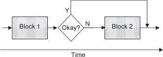
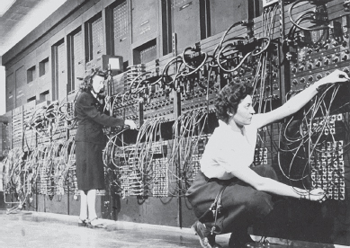
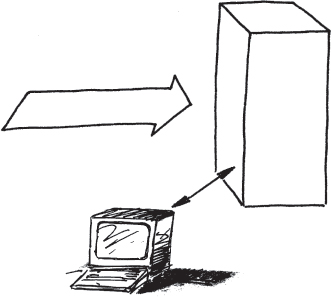
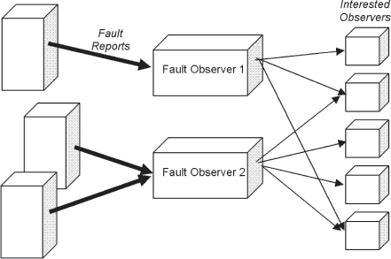
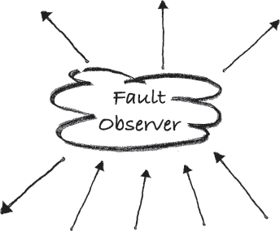

# CHAPTER 4

# Architectural Patterns

This chapter and the patterns it contains reflect architectural lessons from highly available systems of all sizes. The overall system architecture greatly influences how tolerant of faults the system will be. This chapter’s techniques contain architectural considerations that cut across all parts of the system. They do not fit neatly into the categories of error detection, error recovery, error mitigation, and fault treatment. They do not focus solely on a particular class or module; they influence the design of the whole system.

> 本章及其包含的模式反映了各种规模的高可用系统的架构经验。整个系统架构极大地影响了系统对故障的容忍度。本章的技术包含贯穿系统所有部分的架构考虑。它们不完全适合于错误检测、错误恢复、错误缓解和故障处理的类别。他们并不只关注某个特定的类或模块；它们影响整个系统的设计。

These patterns are also among the first patterns applied to a new design project that needs to support fault tolerant operation. This is another reason for placing them here, in a separate chapter, rather that sorting them into the chapters of specific techniques.

> 这些模式也是应用于需要支持容错操作的新设计项目的首批模式之一。这是将它们放在这里的另一个原因，放在一个单独的章节中，而不是将它们分类到特定技术的章节中。

For example, the pattern MINIMIZE HUMAN INTERVENTION (5), which is found in this chapter, acknowledges that in order for a system to be highly available it must recover as quickly as possible. People are slow when compared with a computer. Asking a person to intervene in an error situation slows down recovery, which in turn reduces availability. A highly available system should not need to ask for human intervention. To reduce recovery times, the design of every part of the system must include the capabilities for the system to resolve the problems by itself. This need for a global usage of the principles results in the pattern being architectural. Every part of the system must support and implement the architecture established by this pattern, or its benefits will be blocked. For example, wherever one module fails to use MINIMIZE HUMAN INTERVENTION and pauses to wait for operating control the system availability is greatly reduced.

> 例如，本章中的模式 MINIMIZE HUMAN INTERVENTION（5）承认，为了使系统高度可用，必须尽快恢复。与计算机相比，人的速度慢。要求一个人在错误情况下进行干预会减慢恢复速度，从而降低可用性。一个高度可用的系统不应该需要人为干预。为了减少恢复时间，系统每个部分的设计必须包括系统自行解决问题的能力。这种对原则全局使用的需求导致了模式的体系结构。系统的每一部分都必须支持和实现由这种模式建立的架构，否则它的好处将受到阻碍。例如，当一个模块无法使用“最小化人为干预”并暂停等待操作控制时，系统可用性会大大降低。

<a href="#c04.htm#tab4.1" id="c04.htm#tab4.1a">Table 4.1</a> lists all of the patterns in this chapter. Their order is that of the language shown in <a href="#c04.htm#fig4.9" id="c04.htm#fig4.9a">Figure 9</a> and also the order that the patterns appear within this chapter.

[**Table 4.1**](#c04.htm#tab4.1a) Architectural patterns

> [**表 4.1**]（#c04.htm#tab4.1a）建筑图案

---

> ---

**PATTERN** **PATTERN INTENT**

> **模式***模式意图**

UNITS OF MITIGATION (1) Decide what the units of fault tolerance will be during the architecture phase.

> 缓解单位（1）决定在架构（architecture）阶段容错单位是什么。

CORRECTING AUDITS (2) Design data to be checked and check data for errors. If errors are found, correct both the erroneous data and look for errors in related data.

> 纠正审计（2）待检查的设计数据和错误检查数据。如果发现错误，请更正错误数据并查找相关数据中的错误。

REDUNDANCY (3) Maximize availability by having alternate hardware or software that can perform the same function.

> 冗余（3）通过具有可执行相同功能的替代硬件或软件，最大限度地提高可用性。

RECOVERY BLOCKS (4) Increase the probability of successfully meeting acceptance tests by providing sequential execution of alternate computations.

> 恢复块（4）通过提供交替计算的顺序执行，增加成功满足验收测试的概率。

MINIMIZE HUMAN INTERVENTION (5) People make mistakes and are slow; to minimize downtime the system should take care of itself, without human intervention.

> 尽量减少人为干预（5）人们犯错误，行动迟缓；为了尽量减少停机时间，系统应自行处理，而无需人工干预。

MAXIMIZE HUMAN PARTICIPATION (6) Provide the capability for knowledgeable people to guide the system’s error processing.

> 最大化人类参与（6）为知识渊博的人员提供指导系统错误处理的能力。

MAINTENANCE INTERFACE (7) Establish an interface to the system separate from the application’s interface to facilitate maintenance interactions.

> 维护接口（7）建立与应用程序接口分离的系统接口，以促进维护交互。

SOMEONE IN CHARGE (8) Every fault tolerance action undertaken by the system should have a clearly identified entity controlling and monitoring the action.

> 负责人（8）系统执行的每个容错操作都应有一个明确标识的实体来控制和监控操作。

ESCALATION (9) When error processing steps are not producing the desired effect on the system, try a more all-encompassing means.

> 升级（9）当错误处理步骤无法对系统产生预期效果时，请尝试更全面的方法。

FAULT OBSERVER (10) Coordinate reporting to all observers that a fault is present, reported, and recovery actions escalated.

> 故障观察员（10）协调向所有观察员报告故障存在、报告和上报恢复行动。

SOFTWARE UPDATE (11) Design the system to allow the installation of new versions of the software.

> 软件更新（11）设计系统以允许安装新版本的软件。

---

> ---

**[Figure 9](#c04.htm#fig4.9a)** Architectural pattern language map

> **[图 9]（#c04.htm#fig4.9a）**架构模式语言图

[Figure 9](#c04.htm#fig4.9) contains one possible pattern language map from the patterns in Chapter 4.

> [图 9]（#c04.htm#fig4.9）包含第 4 章中模式的一个可能的模式语言映射。

The UNITS OF MITIGATION (1) are the building blocks of a fault tolerant system. They define the elements that may be repaired and restarted as needed to process errors. The UNITS OF MITIGATION guide the decisions about how REDUNDANCY (3) will be implemented in the system. The units of mitigation and redundant units are an intersecting set of the parts of the ultimate system design. These should be defined first to provide guidance for the remainder of the system’s design. Few techniques for creating redundant software exist; RECOVERY BLOCKS (4) discusses one practical method.

> 缓解单元（1）是容错系统的组成部分。它们定义了可以根据需要修复和重新启动以处理错误的元素。缓解单位指导如何在系统中实施冗余（3）的决策。缓解单元和冗余单元是最终系统设计的一组交叉部分。这些应首先定义，为系统设计的其余部分提供指导。很少有创建冗余软件的技术；RECOVERY BLOCKS（4）讨论了一种实用的方法。

CORRECTING AUDITS (2) are checks of all the system’s important data to ensure both the data’s correct value and that the structure of the data is not corrupted. Data must be well designed and must be designed to be checked, or _audited_. When erroneous data is detected it should be corrected immediately, if possible.

> 纠正审计（2）是对系统所有重要数据的检查，以确保数据的正确值和数据结构没有损坏。数据必须设计良好，并且必须设计为可检查或可审核。如果可能，当检测到错误数据时，应立即纠正。

To ensure that the system is always doing useful work, either application or fault tolerance related, every error processing action should have SOMEONE IN CHARGE (8). In some cases this will be the operating personnel through MAXIMIZE HUMAN PARTICIPATION (6).

> 为了确保系统始终在做有用的工作，无论是应用程序还是容错相关的工作，每个错误处理操作都应该有专人负责（8）。在某些情况下，这将是操作人员通过最大限度的人力参与（6）。

Sometimes error processing can’t immediately correct the problem, due to poor isolation or other reasons. In these cases ESCALATION (9) guides the selection of possible alternative actions for the system.

> 有时，由于隔离不良或其他原因，错误处理无法立即纠正问题。在这些情况下，ESCALATION（9）指导选择系统可能的替代操作。

The fault tolerance actions of the system should not rely on operating personnel to resolve problems because people can easily make matters worse, so the system should be designed to MINIMIZE HUMAN INTERVENTION (5). Experienced personnel, for example the system designers, can make valuable contributions, so the system should enable this through MAXIMIZE HUMAN PARTICIPATION (6). To ensure that operating personnel can always access the system when necessary, and to ensure that maintenance requests are not lost or discarded by the application, a separate MAINTENANCE INTERFACE (7) is used. This interface will provide a direct avenue to the maintenance functionality, not risking or relying on the maintenance requests to be separated properly from the application data stream.

> 系统的容错操作不应依赖操作人员来解决问题，因为人们很容易使问题变得更糟，因此系统的设计应尽量减少人为干预（5）。经验丰富的人员，例如系统设计师，可以做出有价值的贡献，因此系统应该通过最大限度的人类参与来实现这一点（6）。为了确保操作人员在必要时始终能够访问系统，并确保应用程序不会丢失或丢弃维护请求，使用了单独的维护接口（7）。该接口将为维护功能提供一条直接途径，而不会冒险或依赖于将维护请求与应用程序数据流适当分离。

Fault tolerant systems usually operate in an environment where there are other systems or personnel watching how the system is performing at any given time. The FAULT OBSERVER (10) interface provides that oversight capability into the system.

> 容错系统通常在有其他系统或人员在任何给定时间观察系统运行情况的环境中运行。故障观察器（10）接口为系统提供监督功能。

Most fault tolerant systems will require some update of software version to either correct faults or to introduce new functionality, and this is discussed in SOFTWARE UPDATE (11).

> 大多数容错系统都需要更新软件版本以纠正故障或引入新功能，这在软件更新（11）中进行了讨论。

# 1. Units of Mitigation

… You are designing a fault tolerant system. You are using good programming methods and have set up the appropriate quality methodologies and project standards. You are at the early design stages where the system design is still malleable.

> …您正在设计一个容错系统。您正在使用良好的编程方法，并建立了适当的质量方法和项目标准。您正处于早期设计阶段，系统设计仍具有延展性。

You know that there will be faults in the system. When they activate they cause errors and a fail-stop or fail-safe design makes some part (or all) of the system unavailable. The risk is that the failing part is the whole system. You want to reduce, or mitigate, this risk of a complete shutdown.

> 你知道系统会有故障。当它们激活时，会导致错误，故障停止或故障安全设计会使系统的部分（或全部）不可用。风险在于，失败的部分是整个系统。您希望减少或减轻完全关闭的风险。

**How can you keep the whole system from being unavailable when an error occurs?**

> **当发生错误时，如何防止整个系统不可用**

In the simplest designs, there is one module that performs all of the work. When this monolith has an error, no work will be done. Choosing to consider the entire system as a whole limits the kinds of recoveries that are possible without the system being unavailable. Having only one module means that the entire system must stop to recover an error.

> 在最简单的设计中，有一个模块执行所有工作。当这个整体出现错误时，将不进行任何工作。选择将整个系统视为一个整体会限制在系统不可用的情况下可能进行的恢复类型。只有一个模块意味着整个系统必须停止才能恢复错误。

The amount of overhead increases as the size of the components decreases because bookkeeping needs increase. Overhead increases both statically, e.g. memory used, and dynamically, e.g. in terms of execution time. As the size of the units decreases more and more, other options to recover and mitigate errors become possible, because the system can now treat errors in one unit while the others continue operation. Some of the techniques possible include FAILOVER (36), retaining state via CHECKPOINTS (37), redirecting operations through ROLLBACK (32) or ROLL-FORWARD (33) and many others described later in this book.

> 由于记账需求的增加，开销的数量会随着组件大小的减少而增加。开销静态地（例如使用的内存）和动态地（例如执行时间）增加。随着单元的大小越来越小，其他恢复和减轻错误的选项变得可能，因为系统现在可以在一个单元中处理错误，而其他单元继续运行。一些可能的技术包括 FAILOVER（36）、通过 CHECKPOINTS（37）保持状态、通过 ROLLBACK（32）或 ROLL-FORWARD（33）重定向操作以及本书后面描述的许多其他技术。

Interfaces between the units of mitigation must be well defined and clear. It is along these interfaces that the mitigation actions take place to recover from errors or reduce the impact of errors. When there are more units in the system, there are more interfaces.

> 缓解单元之间的接口必须明确明确。正是通过这些接口，采取缓解措施以从错误中恢复或减少错误的影响。当系统中有更多的单元时，就会有更多的接口。

If there are smaller parts of a system that make well defined units, with clear interfaces, use these as the basic unit of mitigation. With finer granularity, it is more economical to replicate the units as described in REDUNDANCY (3). Load sharing is possible with multiple copies when they are not actively involved in error mitigation. The units of mitigation should contain atomic actions that do not rely heavily on communication with other units of mitigation to accomplish their task.

> 如果系统中有较小的部分组成了定义明确的单元，具有清晰的接口，则将这些部分用作缓解的基本单元。由于粒度更细，复制 REDUNDANCY（3）中所述的单元更经济。当多个副本不主动参与错误缓解时，可以使用多个副本进行负载共享。缓解单元应包含不严重依赖与其他缓解单元通信来完成任务的原子行动。

The dividing line between different parts of the system must be clearly discernable. And the boundary must be respected, dividing the system into discrete parts. The clear separation between parts of the system is important to keep errors contained, which is the primary reason for dividing the system at all.

> 系统不同部分之间的分界线必须清晰可辨。必须尊重边界，将系统划分为不同的部分。系统各部分之间的清晰分离对于控制错误非常重要，这是划分系统的主要原因。

No two design problems are identical. Therefore, there is no one right answer to the question about what the basic units should be. In some cases, the answer is building a monolithic structure. In other systems, the units of mitigation are quite small.

> 没有两个设计问题是相同的。因此，对于基本单元应该是什么这个问题，没有一个正确的答案。在某些情况下，答案是构建一个整体结构。在其他系统中，缓解单位相当小。

The architectural style in use, such as a three-tiered architecture, can provide units of mitigation that are similar from situation to situation. But even in that case you need to determine if there are other units present in the architecture.

> 所使用的体系结构样式，例如三层体系结构，可以提供不同情况下类似的缓解单元。但即使在这种情况下，您也需要确定架构中是否存在其他单元。

The units of mitigation can be duplicated to provide for REDUNDANCY (3), which will allow multiple copies of the functionality to perform simultaneously. Adding additional redundant units helps with both performance enhancements by supporting load sharing, and with error processing. The system can redirect the workload to a different unit if one needs to be removed from service temporarily to support error processing.

> 可以复制缓解单元以提供冗余（3），这将允许同时执行功能的多个副本。通过支持负载共享和错误处理，添加额外的冗余单元有助于提高性能。如果需要暂时停止服务以支持错误处理，系统可以将工作负载重定向到不同的单元。

This pattern describes a design level activity. The results of applying this pattern during design will be identifiable within the architecture of the system, even though they are not providing the structure of the application. The units of mitigation are run time entities because error handling is done during execution.

> 此模式描述设计级活动。在设计期间应用此模式的结果将在系统的架构中被识别，即使它们没有提供应用程序的结构。缓解单元是运行时实体，因为错误处理是在执行期间完成的。

The architecture might show natural lines of cleavage, such as cluster architectures, terminal/protocol handlers, tasks dedicated to a certain processor or processor core, etc. The units of mitigation do not need to be symmetric, or of identical size. The units of mitigation that support the primary functionality (the application) can be larger than the units for the support functionality. This is because the failures in the support functions typically have less stringent availability requirements than the primary application.

> 架构可能会显示自然的分裂线，例如集群架构、终端/协议处理器、专用于某个处理器或处理器核心的任务等。缓解单元不需要是对称的，也不需要大小相同。支持主要功能（应用程序）的缓解单元可以大于支持功能的单元。这是因为支持功能中的故障通常对可用性的要求不如主应用程序严格。

Portions of the system that perform different functions, such as interfacing to users or handling a database, are good units of mitigation. When there are separate processors in a distributed system, these make good units of mitigation.

> 系统中执行不同功能的部分，例如与用户接口或处理数据库，是很好的缓解单元。当分布式系统中有单独的处理器时，这些处理器是很好的缓解单元。

When there are groupings of similar functionalities, the entities that are grouped are good units of mitigation. For example threads in a threadpool make good units of mitigation. Another example is in a system that involves inherent redundancy or duplication, such as the example ‘objects for characters’ used in explaining the FLYWEIGHT pattern. \[GHJ+95\]

> 当存在类似功能的分组时，分组的实体是良好的缓解单元。例如，线程池中的线程是很好的缓解单元。另一个例子是在涉及固有冗余或重复的系统中，例如用于解释 FLYWEIGHT 模式的“字符对象”示例\[GHJ+95\]

The units of mitigation should conform to the boundaries of memory spectrum or processor assignment. Units of mitigation should not share more than one processor unless there is shared memory, or more than one region of non-distributed memory. Error detection and processing techniques work best with clear boundaries of memory.

> 缓解单元应符合内存频谱或处理器分配的边界。缓解单元不应共享多个处理器，除非存在共享内存或多个非分布式内存区域。错误检测和处理技术在内存边界清晰的情况下效果最佳。

The division of the system into units of mitigation should also consider the recovery and mitigation techniques available to it. If the only change in process state is at the level of the whole system, then the whole system should be the unit of mitigation; in practice it will be. When recovery actions such as RESTART (31) can be done at a fine-grained level, pick the units of mitigation correspondingly small. For example, if restart of individual Java containers will be possible in an application server system, pick the containers as the units of mitigation. \[CBF+04\]

> 将系统划分为缓解单元还应考虑其可用的恢复和缓解技术。如果过程状态的唯一变化是在整个系统的水平上，则整个系统应为缓解单元；当恢复操作（如 RESTART（31））可以在细粒度级别执行时，选择相应较小的缓解单元。例如，如果可以在应用程序服务器系统中重新启动单个 Java 容器，则选择容器作为缓解单元\[CBF+04\]

The units of mitigation should be able to conduct self checks to detect when they are not operating correctly. The units of mitigation should fail silently in a deterministic way. If the units are so small that any errors that occur cannot be recovered or mitigated, the unit is too small. For example, picking individual statements in a function or method is impractical because most languages will only be able to correct the results of the function or method, not the intermediate calculations. Both internal data and execution errors should be detected.

> 缓解单位应能够进行自我检查，以检测其何时运行不正常。缓解单元应以确定性的方式无声地失效。如果单元太小，无法恢复或减轻发生的任何错误，则单元太小。例如，在函数或方法中选择单个语句是不切实际的，因为大多数语言只能纠正函数或方法的结果，而不能纠正中间计算。应检测内部数据和执行错误。

The units of mitigation must be barriers to errors. The boundaries and implementation of the units of mitigation must prevent errors from being communicated outside the boundary. The unit of mitigation must detect internal errors quickly. The only acceptable indication to other parts of the system should be the single indication that an error has occurred. It is desirable for units of mitigation to fail silently and to isolate failures from other parts of the system.

> 缓解单元必须是错误的障碍。缓解单元的边界和实施必须防止错误在边界之外传播。缓解单元必须快速检测内部错误。系统其他部分唯一可接受的指示应为发生错误的单一指示。缓解单元最好无声地发生故障，并将故障与系统的其他部分隔离开来。

The units of mitigation must be recognizable elements of the system. Choosing to have only portions of the smallest nameable entity in the system as a basic unit of mitigation means that either the naming or the unit of mitigation selection was wrong. Error reports and actions will be addressed to the unit, so it must be nameable.

> 缓解单元必须是系统的可识别元素。选择仅将系统中最小可命名实体的一部分作为基本缓解单元意味着命名或缓解单元选择错误。错误报告和操作将发送给该单元，因此必须可命名。

Therefore,

> 因此

**Divide the system into parts that will contain both any errors and the error recovery. Choose the divisions that make sense for your system, <a href="#c04.htm#fig4.10" id="c04.htm#fig4.10a">Figure 10</a>. Design the rest of the system around these parts that represent the basic units of error mitigation.**

> **将系统分成包含所有错误和错误恢复的部分。选择对系统有意义的分区，<a href=“#c04.htm#fig4.10”id=“c04.htm#fig4.10a”> 图 10</a>。围绕这些代表错误缓解基本单元的部分设计系统的其余部分**

**[Figure 10](#c04.htm#fig4.10a)** Different UNITS OF MITIGATION

> **[图 10]（#c04.htm#fig4.10a）**不同的缓解单位

The actual resolution of this problem will vary with the situation and will result in analysis of the various tradeoffs/forces: Overhead and complexity, natural divisions in the architecture and architectural style basic concepts.

> 该问题的实际解决方案将因情况而异，并将导致各种权衡/力量的分析：开销和复杂性、架构中的自然划分以及架构风格的基本概念。

This pattern represents an essential step to identify the units of error detection and error processing.

> 该模式表示识别错误检测和错误处理单元的重要步骤。

Ignoring the divisions between units of mitigation will not produce an optimal solution to system availability. It leads to too much of the system being unavailable or of recovery attempts failing because the failure is slightly out of scope for the unit of mitigation.

> 忽略缓解单元之间的划分不会产生系统可用性的最佳解决方案。这会导致太多的系统不可用或恢复尝试失败，因为故障稍微超出了缓解单元的范围。

Within UNITS OF MITIGATION the system should focus resources on error processing, in other words, perform a CONCENTRATED RECOVERY (29). This will reduce the unavailability time and make it more predictable.

> 在缓解单元内，系统应将资源集中在错误处理上，换句话说，执行集中恢复（29）。这将减少不可用时间，并使其更加可预测。

The patterns REDUNDANCY (3), FAILOVER (36), WHAT TO SAVE (38) and REMOTE STORAGE (39) offer considerations that can help you decide what the UNITS OF MITIGATION should be.

> 冗余模式（3）、故障转移模式（36）、保存内容模式（38）和远程存储模式（39）提供了一些考虑因素，可以帮助您确定缓解单位。

This pattern describes hardware and software units and major parts. ERROR HANDLERS (30) and RECOVERY BLOCKS (4) describe recovery for software algorithms and smaller parts of the system.

> 该模式描述了硬件和软件单元以及主要部件。错误处理器（30）和恢复块（4）描述了软件算法和系统较小部分的恢复。

Example: Consider a three-tiered architecture (User interface, functional process and data access layers). We are adding fault tolerance into it and want it to be able to seamlessly recover when it detects any faults or errors. The system should be able to mitigate the error quickly and efficiently through one of the mechanisms described later with minimal disruption to service, i.e. minimal downtime.

> 示例：考虑三层体系结构（用户界面、功能流程和数据访问层）。我们正在为其添加容错功能，并希望它能够在检测到任何故障或错误时无缝恢复。系统应能够通过稍后描述的机制之一快速有效地减轻错误，对服务的中断最小，即停机时间最小。

At first you think of making the whole system the unit of recovery. This is a common approach; one that many systems have historically taken. The problem with this approach is that when something fails the entire system needs to participate in the mitigation, making it unavailable.

> 首先，你想让整个系统成为恢复的单位。这是一种常见的方法；这是许多系统历史上采用的方法。这种方法的问题是，当某些东西发生故障时，整个系统需要参与缓解，从而使其不可用。

After consideration, you think that there should be some smaller units of mitigation than the entire system. The next obvious solution is to make the basic unit be one of the tiers. There are already clean interfaces between the tiers, so that if one of the tiers needs to participate in mitigation the neighboring tiers already know how to communicate with it.

> 经过考虑，您认为应该有一些比整个系统更小的缓解单元。下一个明显的解决方案是使基本单元成为其中一个层。这些层之间已经有了干净的接口，因此如果其中一个层需要参与缓解，则相邻层已经知道如何与其通信。

However, unless there are redundant tiers (which can exist in a large scale system) then any tier level error processing actually takes the whole system out of service. The effects of this can be reduced by queuing requests from the other tiers while waiting for the mitigation to complete. The still available tiers will still process requests and queue requests awaiting the recovery to end.

> 然而，除非存在冗余层（在大规模系统中可能存在），否则任何层级错误处理实际上都会使整个系统停止运行。通过在等待缓解完成时对来自其他层的请求进行排队，可以减少这种影响。仍然可用的层仍将处理请求，并对等待恢复结束的请求进行排队。

A common solution is to mitigate at the tier level with either redundant tiers or queues and other request buffering. It is based on the benefits that having multiples of the tier-level entities can provide, in addition to the mitigation of errors. Whenever a single tier contains a detected error the system can redistribute the workload around the unit with the error until it can be safely brought back to correct operation (mitigated). …

> 一种常见的解决方案是在层级别使用冗余层或队列以及其他请求缓冲进行缓解。除了减少错误之外，它还基于具有多个层级实体可以提供的好处。每当一个单层包含检测到的错误时，系统就可以重新分配带有错误的单元周围的工作负载，直到可以安全地恢复到正确的操作（减轻）…

# 2. Correcting Audits

… Data errors can and do occur.

> …数据错误可能也确实会发生。

Data can be thought of as being static or dynamic. Static data doesn’t change very often during normal operations. Configuration data is static data that might change infrequently, for example only when a SOFTWARE UPDATE (11) is made. Applications also have data that doesn’t change, for example telephone area (region) codes change very infrequently.

> 数据可以被认为是静态的或动态的。静态数据在正常操作期间不会经常更改。配置数据是可能不经常更改的静态数据，例如，只有在进行软件更新（11）时才会更改。应用程序的数据也不会改变，例如，电话区域（地区）代码很少改变。

Dynamic data changes frequently during normal execution. Per transaction memory, scratch memory, request-handling data structures are all examples. In a financial application system the currency exchange rate or the current prices for a stock are dynamic data. In a scientific application the intermediate results are dynamic data.

> 动态数据在正常执行期间频繁更改。每事务内存、临时内存、请求处理数据结构都是示例。在金融应用系统中，货币汇率或股票的当前价格是动态数据。在科学应用中，中间结果是动态数据。

Data errors occur because something corrupted the data element. The corruption might come from low level hardware, such as memory chips, or they might be other application functions that store incorrect values into a data element. Random and transient events also occur, such as alpha rays emitted from integrated circuit packaging.

> 发生数据错误是因为数据元素损坏。损坏可能来自低级硬件，例如内存芯片，也可能是将错误值存储到数据元素中的其他应用程序函数。随机和瞬态事件也会发生，例如从集成电路封装发射的阿尔法射线。

**Faulty data causes errors.**

> **错误数据会导致错误**

Errors from faulty data easily propagate throughout the system. When the period of time between detection and recovery is long, there is a larger chance of another task using the erroneous data and making an erroneous (and possibly failing) decision with it.

> 错误数据的错误很容易在整个系统中传播。当检测和恢复之间的时间间隔较长时，另一个任务使用错误数据并做出错误（可能失败）决策的可能性较大。

In real-time and transaction oriented systems the dynamic data is always changing. The values that were installed during initialization or DATA RESET (41) will change for valid reasons. But sometimes they will be changed to erroneous values.

> 在实时和面向事务的系统中，动态数据总是在变化。初始化或数据重置（41）期间安装的值将因有效原因而更改。但有时它们会被更改为错误的值。

The context of the data must be considered. For example the number ‘1974’ is valid as a year, but not valid as an age. The context should be used to help define the allowable data checks.

> 必须考虑数据的上下文。例如，数字“1974”作为年份有效，但作为年龄无效。上下文应用于帮助定义允许的数据检查。

Errors in data can cause several different types of errors. Future computations might be incorrect, for example if the currency exchange rate is incorrect then all conversions from one currency to another that use the erroneous rate will be incorrect. Execution can transfer incorrectly; consider an erroneous value used in a selection statement (like a C-language switch statement) can result in the wrong conditional code to be executed. Another error that is possible is that erroneous data can cause errors in other data that is unrelated, for example when a pointer is incorrect and starts overwriting a part of memory that is unrelated to the faulty pointer. A classic example of this last situation is writing into very low memory addresses because the pointer value was zero. Another category of error caused by bad data is that of resources that are orphaned because the data referencing them is no longer present.

> 数据中的错误可能会导致几种不同类型的错误。未来的计算可能不正确，例如，如果货币汇率不正确，则使用错误汇率的从一种货币到另一种货币的所有转换都将不正确。执行可能会错误转移；考虑选择语句（如 C 语言switch语句）中使用的错误值可能会导致执行错误的条件代码。另一个可能的错误是，错误数据可能会导致其他无关数据中的错误，例如，当指针不正确并开始覆盖与错误指针无关的部分内存时。最后一种情况的典型例子是写入非常低的内存地址，因为指针值为零。坏数据导致的另一类错误是由于引用它们的数据不再存在而成为孤立资源的错误。

Checking, or ‘auditing’, data for errors is accomplished by using other information that is known about the data to determine its correctness. Checks are done by using the structural properties of the data structures, or by using information known in advance about the data’s values. The first kind of checks looks to the structure of the data, for example that a linked list’s pointers are correct or that a queue or list has an allowable number of entries. Redundant information can be stored along with the data to report if the data is incorrect. CHECKSUMS (25) is an example of this detection method. Knowing at design time that only certain values of a piece of data are legal enables checking the data at execution time for correctness.

> 检查或“审计”数据的错误是通过使用已知的其他数据信息来确定其正确性来完成的。检查是通过使用数据结构的结构财产，或使用有关数据值的预先已知信息来完成的。第一类检查检查数据的结构，例如，链接列表的指针是否正确，或者队列或列表是否具有允许的条目数。冗余信息可以与数据一起存储，以便在数据不正确时报告。CHECKSUMS（25）是这种检测方法的一个例子。在设计时知道只有一段数据的某些值是合法的，就可以在执行时检查数据的正确性。

Some of the ways that data can be checked:

> 检查数据的一些方法：

 **Check structural properties**: Check that linked lists are correctly linked, stack and queue pointers are within bounds, pointers and counters related to the data structures match the data structures (e.g. the number of items on a linked list is the actual number of items).

 **Known correlations**: The same or related data is stored in multiple locations, known conversion factors between data values (e.g. centigrade to Fahrenheit temperatures), cross linkages between different data structures, for example one linked list coupled to another linked list exists, software data meant to mimic hardware status is correct.

 **Sanity checks**: Values are within the range of expected values, CHECKSUMS (25) are correct.

 **Direct Comparison**: Duplicate copies of data are stored to serve as checks to each other. This technique is primarily useful for static data, although in some cases important dynamic control information should be saved in two different places as well.

COMPLETE PARAMETER CHECKING (14) discusses error detection when entering and leaving methods and functions. These checks provide a way to use the mechanisms above to detect errors in dynamic data close to where it became erroneous.

> 完整参数检查（14）讨论了进入和离开方法和功能时的错误检测。这些检查提供了一种使用上述机制来检测动态数据中接近错误位置的错误的方法。

You must design the system’s data to be easily audited. Use two way linked lists because then linkages are redundant and enable easy checking. Use redundant locations in other parts of the system for data to enable easy checking. Use non-trivial values for static configuration values because then simple errors will be very obvious.

> 您必须将系统数据设计为易于审核。使用双向链接列表，因为这样链接是多余的，可以方便地进行检查。在系统的其他部分使用冗余位置来存储数据，以便于检查。对静态配置值使用非平凡值，因为这样简单的错误将非常明显。

Many data errors can be corrected automatically. When they can be corrected automatically the time from detection to error-free operation is reduced, which enhances system availability.

> 许多数据错误可以自动纠正。当它们能够被自动校正时，从检测到无错误操作的时间减少了，这提高了系统的可用性。

Depending upon the nature of the detected data errors the correction mechanisms vary. If the linked list is incorrect the linkages can be rebuilt. If orphaned resources are found they can be released for other uses. If correlated data is inconsistent it can be made consistent. If values are out of a normally expected range perform a DATA RESET (41). The data fault might be correctable by either its CHECKSUM (25) or by an ERROR CORRECTING CODE (57). If it is not correctable the effects of the fault can be mitigated by using the MARKED DATA (56) technique. If it can’t be corrected, and can’t be mitigated, then an error recovery action will be necessary.

> 根据检测到的数据错误的性质，校正机制有所不同。如果链接列表不正确，则可以重建链接。如果发现孤立资源，则可以将其释放用于其他用途。如果相关数据不一致，则可以使其一致。如果值超出正常预期范围，则执行数据重置（41）。数据故障可以通过校验和（25）或纠错码（57）纠正。如果无法纠正，则可以使用标记数据（56）技术减轻故障的影响。如果无法纠正并且无法缓解，则需要执行错误恢复操作。

When a data error cannot be corrected automatically, other recovery steps should be taken. These can include unwinding the execution from an ERROR HANDLER (30) or restoring the erroneous data from a CHECKPOINT (37) and ROLLING BACK (32).

> 当数据错误无法自动纠正时，应采取其他恢复步骤。这些可以包括从错误处理程序（30）展开执行或从检查点（37）和回滚（32）恢复错误数据。

If the detection of the erroneous data was accomplished through a COMPLETE PARAMETER CHECK (14) or a ROUTINE AUDIT(24), or otherwise corrected by an ERROR HANDLER(30), then execution can resume at the point of detection. This emphasizes the need to put the detection mechanism as close to the point of first access as possible. Frequently some code re-execution will be required to undo the most recent action that involved the erroneous data. ROLLBACK (32) might be required to move the system to a state where this re-execution can occur. If it is impossible to return to that point then a RETURN TO REFERENCE POINT(34) should occur to return the system to a known state from which processing can continue.

> 如果错误数据的检测是通过完整参数检查（14）或例行审计（24）完成的，或通过错误处理器（30）纠正的，则可以在检测点恢复执行。这强调了需要将检测机制尽可能靠近第一访问点。通常需要重新执行一些代码来撤消涉及错误数据的最近操作。可能需要 ROLLBACK（32）将系统移动到可能发生此重新执行的状态。如果不可能返回到该点，则应出现返回参考点（34），以使系统返回到可以继续处理的已知状态。

Where there’s one data error there might be others. When a data error is detected a prudent step is to consider what other data might be erroneous. The detected error might be the result of a number of computations that should all be considered suspicious and checked for errors.

> 如果有一个数据错误，可能会有其他数据错误。当检测到数据错误时，谨慎的步骤是考虑哪些其他数据可能是错误的。检测到的错误可能是大量计算的结果，这些计算都应被视为可疑并检查错误。

Automatic correction mechanisms must ensure that after correction the related data items are consistent. In the 4ESS™ Switch, each kind of data has an associated Audit Implicator Index (AII). The AII is used to link the audits together by pointing from the faulty data to other data that is somehow related. The specific audit components for the linked data can be executed to determine if the known faulty data has corrupted any other data. For example, a data error in the Auxiliary Call Register data structure implicates the Call Register data structure. AIIs are used to tell the auditing programs about relationships between different data structures that might not be easy to discern during execution time examination.

> 自动校正机制必须确保校正后相关数据项一致。在 4ESS 中 ™ 切换，每种数据都有一个关联的审计隐含索引（AII）。AII 用于通过将错误数据指向其他相关数据来将审计联系在一起。可以执行链接数据的特定审计组件，以确定已知故障数据是否损坏了任何其他数据。例如，辅助呼叫寄存器数据结构中的数据错误涉及呼叫寄存器数据数据结构。AII 用于告诉审计程序不同数据结构之间的关系，这些关系在执行时检查时可能不容易识别。

All the data that is important to the system’s operation should be checked. For each data structure in the system you should consider what would happen if it became corrupted and erroneous. During this analysis you will probably find some items, such as temporary variables, that don’t have enough significance to the system to cause them to be checked. You will also find some data, for example a list of busy and idle resources, that is extremely significant and must be kept correct at all times.

> 应检查对系统运行重要的所有数据。对于系统中的每个数据结构，您应该考虑如果它被损坏和错误，会发生什么。在此分析过程中，您可能会发现一些项目，例如临时变量，对系统没有足够的意义，无法进行检查。您还将发现一些数据，例如繁忙和空闲资源的列表，这些数据非常重要，必须始终保持正确。

During design and test phases tests such as these audits might be used to ensure correct system operation. Leaving the tests in and handling the errors that they report as errors rather than diagnostic messages to the testers will increase system reliability.

> 在设计和测试阶段，可以使用这些审计等测试来确保正确的系统操作。将测试留在测试中，并处理他们作为错误而不是诊断消息报告给测试人员的错误，将提高系统可靠性。

In order to detect the fault that is causing the erroneous data to appear, the data error needs to be recorded and tracked. Repeated occurrences of events in the reports of data errors is useful to identify the fault. Any detection of data errors should be logged to enable for causal analysis. Notify the FAULT OBSERVER (10) to achieve this.

> 为了检测导致错误数据出现的故障，需要记录和跟踪数据错误。数据错误报告中事件的重复出现有助于识别故障。应记录数据错误的任何检测结果，以便进行因果分析。通知故障观察者（10）以实现此目的。

There are three tasks that should occur when data errors are detected: 1. correction, 2. logging, and 3. resume execution at the point of detection with the corrected data value.

> 检测到数据错误时，应执行以下三项任务：1。校正，2。日志记录和 3。在检测点用校正的数据值恢复执行。

This can be accomplished by three different tasks, or it can be accomplished by a part of the system designed to perform these three tasks as quickly as possible in support of CONCENTRATED RECOVERY (29).

> 这可以通过三个不同的任务来完成，或者可以通过系统的一部分来完成，该系统被设计为尽可能快地执行这三个任务，以支持集中恢复（29）。

Therefore,

> 因此

**Detect and correct data errors as soon as possible, <a href="#c04.htm#fig4.11" id="c04.htm#fig4.11a">Figure 11</a>. Check related data for errors, correct and record the occurrence of the error.**

> **尽快检测并纠正数据错误，<a href=“#c04.htm#fig4.11”id=“c04.ht#fig4.11a”> 图 11</a>。检查相关数据中的错误，纠正并记录错误的发生**

**[Figure 11](#c04.htm#fig4.11a)** Errors are corrected

> **[图 11]（#c04.htm#fig4.11a）**错误已纠正

The system can have more than one ‘audit’. The system should have a common auditing infrastructure that enables individual audits to be created for different tasks. The 4ESS™ Switch has a common framework into which more than 100 different audits connect. Some are related to each other and reuse common components, such as linked list linkage checking, and many have unique functionality.

> 系统可以有多个“审核”。系统应该有一个通用的审计基础设施，可以为不同的任务创建单独的审计。4ESS™ Switch 有一个通用的框架，100 多个不同的审计连接到该框架中。有些相互关联并重用通用组件，如链接列表链接检查，许多组件具有独特的功能。

The reliability of the system will be improved because the probability of faulty data causing errors is reduced.

> 由于错误数据导致错误的概率降低，系统的可靠性将得到提高。

Other parts of the system, such as COMPLETE PARAMETER CHECKING (14) sometimes detect data errors. In systems with many different kinds of data they should direct the error reports to CORRECTING AUDITS (2). These parts of the system responsible for data integrity will be able to perform data FAULT CORRELATION (12).

> 系统的其他部分，如完整参数检查（14）有时会检测数据错误。在具有许多不同类型数据的系统中，他们应该将错误报告提交给纠正审计（2）。负责数据完整性的系统的这些部分将能够执行数据故障关联（12）。

The latent data fault should be reported to the FAULT OBSERVER (10) so that patterns and trends can be identified and corrected. If the data errors are numerous, or have the potential to cause a serious failure, then SOMEONE IN CHARGE (8) can trigger the ESCALATION (9) of data correction efforts. ESCALATION describes an example of this mechanism. …

> 潜在数据故障应报告给故障观察者（10），以便识别和纠正模式和趋势。如果数据错误众多，或可能导致严重故障，则负责人（8）可以触发数据纠正工作的升级（9）。ESCALATION 描述了此机制的一个示例…

# 3. Redundancy

… You are designing a system that should tolerate faults and have the maximum possible uptime. The amount of downtime between an error occurring (even before a failure happens) and resuming normal operation should be as small as possible.

> …您正在设计一个能够容忍故障并具有最大可能正常运行时间的系统。发生错误（甚至在故障发生之前）和恢复正常操作之间的停机时间应尽可能少。

Multiple software and hardware components are combined to make up a system. The availability of all of these, software, hardware and systems, are important.

> 多个软件和硬件组件被组合成一个系统。所有这些软件、硬件和系统的可用性都很重要。

There are two main ways that errors are processed. In some cases they can be masked and mitigated without changing the system state. The other way involves error recovery to place the system in a failure-free state.

> 处理错误的主要方式有两种。在某些情况下，可以在不改变系统状态的情况下对其进行屏蔽和缓解。另一种方法涉及错误恢复，以使系统处于无故障状态。

**How can we reduce the amount of time between error detection and the resumption of normal operation after error recovery?**

> **如何减少错误检测和错误恢复后恢复正常操作之间的时间**

Availability refers to the percentage of time that the system is performing failure-free. See Chapter 1. During the period from when an error is detected until normal system processing is resumed after processing of the error the system is not performing its normal work. It is not available. Minimizing this time period increases availability.

> 可用性是指系统无故障运行的时间百分比。见第 1 章。在从检测到错误到处理错误后恢复正常系统处理的期间，系统不执行其正常工作。它不可用。最小化此时间段可提高可用性。

Error processing cannot begin until the error is detected. Some aspects of detection are routine events and don’t count into unavailability. This includes the normal time to schedule an error detection check and to execute it in the error-free case. When the system detects an error it must focus on processing the error and that usually stops the normal execution.

> 在检测到错误之前，无法开始错误处理。检测的某些方面是常规事件，不计入不可用性。这包括安排错误检测检查并在无错误情况下执行该检查的正常时间。当系统检测到错误时，它必须专注于处理错误，这通常会停止正常执行。

Minimizing unavailability when the error is being mitigated requires that the mitigation steps, such as marking the data as erroneous (see MARKED DATA (56)) be done as quickly as possible. A way to speed up mitigation activities is to perform just enough work during the error processing time to mask the error and defer as much as possible until after the resumption of normal execution. Notification about the error to the interested parties by the FAULT OBSERVER (10) can be deferred until normal operations are resumed. Mitigation needs fast techniques to minimize unavailability.

> 当错误得到缓解时，将不可用性降至最低要求尽快采取缓解措施，例如将数据标记为错误（参见标记数据（56））。加快缓解活动的一种方法是在错误处理时间内执行足够的工作，以掩盖错误，并尽可能推迟到恢复正常执行之后。故障观察员（10）向相关方发出的错误通知可推迟至恢复正常操作。缓解需要快速的技术来最大限度地减少不可用性。

Error recovery returns the system to a failure-free state. There are many techniques discussed in Chapter 6 that require large amounts of time to recover. For example CHECKPOINT (37) and ROLLBACK (32) require the time to copy large amounts of memory and then to reset system state to the point of rollback. In any recovery effort the effects of the error must be undone and the new error-free state instantiated. Minimizing these steps lead to minimizing unavailability.

> 错误恢复使系统返回到无故障状态。第 6 章中讨论了许多需要大量时间才能恢复的技术。例如，CHECKPOINT（37）和 ROLLBACK（32）需要时间复制大量内存，然后将系统状态重置为回滚点。在任何恢复工作中，必须撤消错误的影响，并实例化新的无错误状态。将这些步骤最小化可将不可用性降至最低。

Reduction in the time to complete either of these parts of recovery reduces the time spent processing the errors.

> 完成恢复的这两个部分所需时间的减少减少了处理错误所花费的时间。

What if execution can be resumed before the bad effects of the error are undone? This would reduce the period of unavailability. Resuming execution in an element that is identical to the one with the error, but without the error achieves this. Having another way of accomplishing the same work, different software, different hardware or different systems is ‘redundancy’. What if the instantiation of the error-free state took almost no time? This reduces the period of unavailability. This can be accomplished by having a redundant unit, without the error, that can begin normal operations quickly.

> 如果可以在错误的不良影响消除之前恢复执行呢？这将缩短不可用的时间。在与有错误但没有错误的元素相同的元素中恢复执行可以实现这一点。用另一种方式完成相同的工作、不同的软件、不同的硬件或不同的系统是“冗余”。如果无错误状态的实例化几乎不花时间怎么办？这缩短了不可用的时间。这可以通过一个冗余单元来实现，该单元可以快速开始正常操作，而不会出错。

Consider three types of redundancy: spatial, temporal, and informational. Spatial redundancy is present when the system has multiple copies (in different places) that are redundant, which provides alternatives that may be selected with minimal unavailability. Temporal redundancy refers to redundancy that occurs over time, which helps achieve correct results but lengthens the time of unavailability. When information is repeated it can be used to aid detection and correction, this is informational redundancy. \[ACM+00\]

> 考虑三种类型的冗余：空间冗余、时间冗余和信息冗余。当系统具有冗余的多个副本（在不同的位置）时，存在空间冗余，这提供了可在最小不可用性的情况下选择的替代方案。时间冗余是指随着时间的推移出现的冗余，这有助于实现正确的结果，但会延长不可用的时间。当信息被重复时，它可以用来帮助检测和校正，这就是信息冗余\[ACM+00\]

It is easy to understand and visualize spatial redundancy in terms of hardware: multiple copies of the hardware platform. Redundancy doesn’t have to mean identical functionality. All that is required is that some other part of the system can perform the work of the failing part. This might be a duplicate, identical module, or it might be another component that has extra programming that enables it to also perform some computations when the primary component cannot function correctly.

> 很容易理解和可视化硬件方面的空间冗余：硬件平台的多个副本。冗余不一定意味着功能相同。所需要的只是系统的其他部分可以执行故障部分的工作。这可能是一个重复的、相同的模块，也可能是另一个具有额外编程的组件，使其能够在主组件无法正常工作时执行一些计算。

Five general purpose computers are used in the Space Shuttle. One is used to perform non-critical computations and the remaining four are used for critical functions. A system of redundant communications buses is used to connect these four critical computers with the various sensors and actuators throughout the spacecraft. In normal, failure-free operation each of the four computers are performing the same function and sending instructions to the peripheral device. The devices that act on these instructions compare the results (i.e. VOTING (21)) from the four computers to detect if one of the computers (and the instructions it provided) is incorrect. The four computers can also watch each other by monitoring the other’s instructions sent to peripherals as well as self testing comparison functions. \[Skl76\]

> 航天飞机使用了五台通用计算机。一个用于执行非关键计算，其余四个用于关键功能。冗余通信总线系统用于将这四台关键计算机与整个航天器的各种传感器和致动器连接起来。在正常的无故障操作中，四台计算机中的每一台都执行相同的功能并向外围设备发送指令。执行这些指令的设备比较来自四台计算机的结果（即投票（21）），以检测其中一台计算机（及其提供的指令）是否不正确。这四台计算机还可以通过监控发送给外围设备的指令以及自我测试比较功能来相互监视\[Skl76\]

Telephone switching systems such as the 4ESS™ Switch used two duplicated processors for their main computations. Processors that interface to the outside world use a different redundancy scheme.

> 电话交换系统，如 4ESS™ Switch 使用两个重复的处理器进行主要计算。与外界连接的处理器使用不同的冗余方案。

You must be careful with software redundancy. Unless you have consciously done something to cause multiple instances of software to be diverse, or different, they will be identical. Diversity is a great asset in the avoidance of error propagation. Since software is deterministic, multiple instances of identical software will all fail when presented with the same stimuli, although the identical stimuli might never reoccur.

> 你必须小心软件冗余。除非你有意识地做了一些事情，使软件的多个实例变得多样或不同，否则它们将是相同的。多样性是避免错误传播的重要资产。由于软件是确定性的，当呈现相同的刺激时，相同软件的多个实例都会失败，尽管相同的刺激可能永远不会再次出现。

RECOVERY BLOCKS (4) \[AK76\] \[LA90\] provide a way to include temporal software redundancy. A program with RECOVERY BLOCKS consists of a primary block and secondary blocks. If the result of the primary block fails its acceptance test then the secondary blocks are executed in sequence until a result is obtained that passes the acceptance test. If no acceptable result is found then ERROR HANDLING (30) is triggered. N-Version Programming gives software a way of providing spatial redundancy.

> RECOVERY BLOCKS（4）\[AK76\]\[LA90\]提供了一种包括时间软件冗余的方法。带有 RECOVERY BLOCKS 的程序由主块和辅助块组成。如果主块的结果未通过其验收测试，则依次执行次块，直到获得通过验收测试的结果。如果未找到可接受的结果，则触发错误处理（30）。N 版本编程为软件提供了一种提供空间冗余的方法。

Some avionics systems execute the same software on multiple processors with VOTING (21) to determine the correct value. In these systems a way of providing software redundancy is to provide for transition periods where some of the multiple processors are executing on the new versions of software, and other processors are still executing the prior version. This will prevent a new fault from causing an error in all of the processors simultaneously. After a time of trialing the new versions and observing that they are error-free, the processors executing the prior version of the software will be upgraded to the new version. \[Lop06\]

> 一些航空电子系统使用 VOTING（21）在多个处理器上执行相同的软件，以确定正确的值。在这些系统中，提供软件冗余的一种方式是提供过渡期，其中多个处理器中的一些在新版本的软件上执行，而其他处理器仍在执行先前版本。这将防止新故障同时在所有处理器中造成错误。在试用新版本并观察到它们是无错误的一段时间后，执行先前版本软件的处理器将升级到新版本\[Lop06\]

Informational redundancy is provided by having multiple versions of the same data available to the system. The multiple versions can be stored in different places on different types of storage, for example disk and flash memory. This enables ready access to alternate versions of the data that CORRECTING AUDITS (2) can use to quickly make a correction. Information can also be stored in several different representations. For example, if the distance between two points is needed it can be stored as both the distance and the location of the endpoints which can be used to recompute the distance quickly.

> 信息冗余是通过将同一数据的多个版本提供给系统来实现的。多个版本可以存储在不同类型的存储设备上的不同位置，例如磁盘和闪存。这使得可以随时访问 CORRECTING AUDITS（2）可用于快速进行更正的数据的替代版本。信息也可以以几种不同的表示形式存储。例如，如果需要两点之间的距离，则可以将其存储为端点的距离和位置，以便快速重新计算距离。

Redundancy as discussed here helps the system to be more available. Redundancy is sometimes introduced to improve performance. In this case there are multiple copies that are used in parallel, for example in a cluster of computers, or multiple instances of the same process. In either case a mechanism to distribute work between the copies is needed. In a redundancy-for-performance environment the availability enhancing effects are supplied by providing excess capacity. For example, availability is enhanced when a cluster of redundant systems provide an idle extra processor to assume the workload of a failing processor. Web servers are frequently combined in a cluster arrangement with a load balancer that distributes requests to the most idle server. Should one of the servers become unavailable, the other servers in the cluster will assume the failing server’s share of the work.

> 这里讨论的冗余有助于系统更可用。有时引入冗余以提高性能。在这种情况下，存在并行使用的多个副本，例如，在计算机集群中，或同一进程的多个实例中。无论哪种情况，都需要在副本之间分配工作的机制。在性能冗余环境中，通过提供过剩容量来提供可用性增强效果。例如，当冗余系统集群提供空闲的额外处理器以承担故障处理器的工作负载时，可用性会增强。Web 服务器经常与负载平衡器组合在一起，负载平衡器将请求分配给最空闲的服务器。如果其中一台服务器不可用，集群中的其他服务器将承担故障服务器的工作份额。

Redundancy is not free. There are the capital costs of extra resources such as memory or processing. There are also inherent risks and costs associated with maintaining the redundant elements.

> 冗余不是免费的。内存或处理等额外资源存在资本成本。还存在与维护冗余元件相关的固有风险和成本。

Therefore,

> 因此

**Provide redundant capabilities that support quick activation to enable error processing to continue in parallel with normal execution. See <a href="#c04.htm#fig4.12" id="c04.htm#fig4.12a">Figure 12</a>.**

> **提供支持快速激活的冗余功能，使错误处理能够与正常执行并行进行。参见图 12</a>**

**[Figure 12](#c04.htm#fig4.12a)** Redundancy

> **[图 12]（#c04.htm#fig4.12a）**冗余

There are many ways to provide this redundancy. Spatial redundancy methods include Active-Active, Active-Passive, N+1 (generally N+M) redundancy, etc. Both Saridakis \[Sar02\] and Ahluwalia and Jain \[AJ06\] have described these different methods of providing redundancy as patterns. These have various tradeoffs in costs v. recovery time as can be seen in <a href="#c04.htm#fig4.13" id="c04.htm#fig4.13a">Figure 13</a>.

> 有许多方法可以提供这种冗余。空间冗余方法包括主动-主动、主动-被动、N+1（通常为 N+M）冗余等。Saridakis\[Sar02\]和 Ahluwalia 和 Jain\[AJ06\]都将这些不同的冗余方法描述为模式。如图 13</a>所示，成本与恢复时间之间存在各种权衡。

**[Figure 13](#c04.htm#fig4.13a)** Cost v. recovery time tradeoffs

> **[图 13]（#c04.htm#fig4.13a）**成本与恢复时间的权衡

Active-Active provides a totally redundant UNITS OF MITIGATION (1) for the critical functionality. At any given time, both of the elements are active and load sharing. However, either of the elements is capable of processing the entire load. Active-active provides the fastest recovery, but it also has a high cost because there is much more capability in the system than is needed for the ordinary workload. Active-Active implies a pairing between the two active units. In an Active-Standby situation, the standby is again paired with an Active element. But in Active-Standby the standby element is not performing useful work. This means that the same amount of resources is needed as in the Active-Active case but during periods of normal operation the standby is idle. It is merely ready to assume actions. There is a one to one relationship between the active element and the standby. Variants of both Active-Active and Active-Standby exist related to how often the active and redundant elements share state. The more often they share state the quicker the recovery, but also the more expensive in terms of execution overhead and reduced communications bandwidth.

> 主动-主动为关键功能提供完全冗余的缓解单元（1）。在任何给定的时间，这两个元素都是活动的和负载共享的。然而，任何一个元件都能够处理整个负载。主动-主动提供了最快的恢复，但它也有很高的成本，因为系统中的功能比普通工作负载所需的多得多。Active Active 表示两个活动单元之间的配对。在 Active Standby（活动待机）情况下，待机再次与 Active（活动）元件配对。但在活动待机状态下，待机元件没有执行有用的工作。这意味着所需的资源量与主动-主动情况相同，但在正常操作期间，待机是空闲的。它只是准备好采取行动。有源元件和备用元件之间存在一对一关系。活动-活动和活动-备用的变体与活动和冗余元素共享状态的频率有关。它们共享状态的频率越高，恢复速度越快，但在执行开销和通信带宽方面也越昂贵。

In situations where a one to one relationship, such as described by the previous two methods, is too expensive, N+M Redundancy is a useful technique. In this configuration there are N active elements processing the workload of the system. There are also M redundant, standby elements in the system, ready to assume control when a failure occurs in any of the N. This requires that there be some way to redirect traffic from any of the N active units to one of the redundant sets. Frequently there are not dedicated pools of spare or standby units, instead any of the elements might at any given time be performing as one of the active elements or as one of the standby elements. Multiple and different redundancy schemes may be used simultaneously. For example multiple software versions may be executing on redundant hardware.

> 在前两种方法描述的一对一关系过于昂贵的情况下，N+M 冗余是一种有用的技术。在此配置中，有 N 个活动元素处理系统的工作负载。系统中还有 M 个冗余的备用元件，当 N 中的任何一个发生故障时，它们随时准备承担控制权。这需要有某种方法将流量从 N 个活动单元中的任意一个重定向到冗余集中的一个。通常不存在备用或备用单元的专用池，相反，任何元件在任何给定时间都可能作为活动元件之一或备用元件之一运行。可以同时使用多种不同的冗余方案。例如，多个软件版本可以在冗余硬件上执行。

Redundancy comes to play when the error tolerance is exceeded. RIDING OVER TRANSIENTS (26) is a technique to determine if errors are permanent and exceed the tolerance limit. ESCALATION (9) guides the choices of alternate error processing techniques.

> 当超过错误容差时，冗余开始发挥作用。跨越瞬变（26）是一种确定误差是否是永久性的并超过公差极限的技术。ESCALATION（9）指导选择其他错误处理技术。

The system will use FAILOVER (36) to perform the transition between the formerly active element and the redundant part.

> 系统将使用 FAILOVER（36）执行先前激活元件和冗余部件之间的转换。

In any system of redundancy a concern is whether the redundant elements are themselves failure-free and ready for service. The redundant element might have a latent fault that will activate when they are asked to begin execution. In some cases ROUTINE EXERCISES (23) can be used to exercise the redundant units to give them time processing actual work so that any errors can be detected.

> 在任何冗余系统中，一个问题是冗余元件本身是否无故障且可随时使用。冗余元素可能有一个潜在的故障，当他们被要求开始执行时，该故障将被激活。在某些情况下，可以使用常规练习（23）来练习冗余单元，以给它们处理实际工作的时间，从而可以检测到任何错误。

One use of Redundancy is as a way to quickly resume execution (ROLLBACK (32)) using saved state restored from a CHECKPOINT (37). REMOTE STORAGE (39) can help you decide whether REDUNDANCY should be used in conjunction with Checkpoints.

> 冗余的一种用途是使用从 CHECKPOINT（37）恢复的保存状态快速恢复执行（ROLLBACK（32））。远程存储（39）可以帮助您决定 REDUNDANCY 是否应与检查点一起使用。

Redundancy is used to protect the system from the effects of different modes of failure. [Table 1.2](#c01.htm#tab1.2) in Chapter 1 shows that to recover from a fail-silent failure requires n+1 redundant elements. To recover from malicious failures requires 3n+1 redundant elements. A VOTING (21) mechanism is needed is needed to arbitrate the results from the redundant components. …

> 冗余用于保护系统免受不同故障模式的影响。第 1 章中的[表 1.2]（#c01.htm#tab1.2）显示，要从无故障故障中恢复，需要 n+1 个冗余元素。要从恶意故障中恢复，需要 3n+1 个冗余元素。需要一个表决（21）机制来仲裁来自冗余组件的结果…

# 4. Recovery Blocks

… Latent faults exist in software. When the software with the fault is in the same state and it encounters the same input needed to activate the fault, it will always respond the same way: it will activate.

> …软件中存在潜在故障。当出现故障的软件处于相同状态并且遇到激活故障所需的相同输入时，它将始终以相同的方式响应：它将激活。

**How can we make sure that processing results in an error-free value, when executing the same code repeatedly will produce the same error?**

> **当重复执行相同的代码将产生相同的错误时，我们如何确保处理产生无错误的值**

Alternate solutions need different implementations. At the system level, or large component level, N-Version Programming provides multiple implementations that satisfy the same specification requiring multiple independent development teams. At the scale of one development team they can produce multiple versions of individual modules or algorithms. A goal of this design team is to make the alternatives resistant to the same fault stimuli. The discussion will continue with these lower-level alternatives.

> 替代解决方案需要不同的实施方式。在系统级或大型组件级，N 版本编程提供了满足同一规范的多个实现，需要多个独立的开发团队。以一个开发团队的规模，他们可以生产多个版本的单个模块或算法。该设计团队的目标是使备选方案能够抵抗相同的故障刺激。将继续讨论这些较低级别的备选方案。

When there are multiple REDUNDANT (3) implementations the system can execute them simultaneously and pick the best answer using a combination of REDUNDANCY and VOTING (21). Another way of using multiple implementations is to execute them sequentially. Overhead is limited because alternative implementations only execute when the system detects errors. If the first alternative completes successfully, and the system is satisfied with the results, then the alternatives are not executed. Each of these alternatives is a ‘recovery block’.

> 当存在多个冗余（3）实现时，系统可以同时执行它们，并使用冗余和投票（21）的组合来选择最佳答案。使用多个实现的另一种方式是顺序执行它们。开销是有限的，因为替代实现仅在系统检测到错误时执行。如果第一个备选方案成功完成，并且系统对结果满意，则不执行备选方案。这些备选方案中的每一个都是“恢复块”。

A program with recovery blocks consists of a primary block and secondary blocks. If the result of the primary block fails its acceptance test then secondary blocks execute in sequence until the acceptance test passes. If no acceptable result is found then an ERROR HANDLER (30) is invoked. \[AK76\]\[LA90\] The acceptance test is specific to the application context of the recovery block. \[Tor00\]

> 具有恢复块的程序由主块和辅助块组成。如果主块的结果未通过验收测试，则次块依次执行，直到验收测试通过。如果没有找到可接受的结果，则调用错误处理器（30）\[AK76\][LA90\]验收测试特定于恢复块的应用程序上下文\[扭矩\]

The general structure of a program with recovery blocks appears in <a href="#c04.htm#fig4.14" id="c04.htm#fig4.14a">Figure 14</a>.

> 带有恢复块的程序的一般结构如图 14</a>所示。

**[Figure 14](#c04.htm#fig4.14a)** Recovery Block structure

> **[图 14]（#c04.htm#fig4.14a）**恢复块结构

A common approach with recovery blocks is to make each successive block more simple than its predecessor. Each has a higher probability of satisfying the acceptance test because it is more simple. Some information is lost at each successive block because it is not performing all of the actions that were initially to be done by the primary block.

> 恢复块的一种常见方法是使每个连续块比其前一个块更简单。每一个都有更高的概率满足验收测试，因为它更简单。由于它没有执行最初由主块执行的所有操作，所以在每个连续块中都会丢失一些信息。

CHECKPOINTS (37) must be saved at the start of execution of the primary block. This is needed to enable resumption of execution with secondary blocks with the same state as at the beginning of primary block execution.

> 必须在开始执行主块时保存 CHECKPOINTS（37）。这是需要的，以便能够恢复具有与主块执行开始时相同状态的辅助块的执行。

There is no requirement that separate teams come up with the alternatives. However, it is human nature to reuse design and code, so you need to try extra hard to ensure that the alternates are indeed different.

> 没有要求单独的团队提出备选方案。然而，重用设计和代码是人之常情，因此您需要格外努力，以确保两者确实不同。

The recovery blocks are UNITS OF MITIGATION (1). They both contain errors and are the basic units of REDUNDANCY (3) in which error processing is possible. Error processing in the case of recovery blocks is to retry with a different secondary block.

> 恢复块是缓解单元（1）。它们都包含错误，并且是冗余（3）的基本单元，其中错误处理是可能的。在恢复块的情况下，错误处理是使用不同的辅助块重试。

The recovery block structure is useful to watch large operations in the system as well as small ones. Two examples are monitoring that SOFTWARE UPDATES (11) are applied correctly and that the actions people make are correct (and providing _undo_ if they are not).

> 恢复块结构可用于监视系统中的大型操作和小型操作。两个例子是监控软件更新（11）是否正确应用，以及人们所做的操作是否正确（如果不正确，则提供_undo_）。

Therefore,

> 因此

**Provide a diversity of REDUNDANCY (3) implementations, either different designs or different coding. Execute them within a framework that checks for acceptable results from the execution of one and try the next secondary block, if the results were unacceptable. Refer to the execution diagram in <a href="#c04.htm#fig4.15" id="c04.htm#fig4.15a">Figure 15</a>.**

> **提供不同设计或不同编码的冗余（3）实现的多样性。在一个框架内执行它们，该框架检查执行一个块的可接受结果，如果结果不可接受，则尝试下一个辅助块。请参阅图 15</a>中的执行图**

**[Figure 15](#c04.htm#fig4.15a)** Recovery Block execution

> **[图 15]（#c04.htm#fig4.15a）**恢复块执行

As an example, consider a case where a section of the program to sort is considered a UNIT OF MITIGATION (1). Different sorting algorithms are the RECOVERY BLOCKS. The try/throw/catch mechanism of languages such as C++ and Java give one way to implement RECOVERY BLOCKS. <a href="#c04.htm#fig4.16" id="c04.htm#fig4.16a">Figure 16</a> shows a short example of using try/catch blocks to reliably sort.

> 例如，考虑一个案例，其中要排序的程序部分被视为缓解单元（1）。不同的排序算法是 RECOVERY BLOCKS。C++ 和 Java 等语言的try/show/catch机制提供了一种实现 RECOVERY BLOCKS 的方法 <a href=“#c04.htm#fig4.16”id=“c04.ht#fig4.16a”> 图 16</a>显示了一个使用try/catch块进行可靠排序的简短示例。

**[Figure 16](#c04.htm#fig4.16a)** Sorting recovery block example

> **[图 16]（#c04.htm#fig4.16a）**排序恢复块示例

ESCALATION (9) is used when none of the primary or secondary blocks meet the acceptance test.

> 当一次或二次块均不符合验收测试时，使用自动扶梯（9）。

You must avoid the temptation to produce many, many secondary blocks. Project needs and reliability predictions drive the number of alternatives. The time spent processing the same information in successive secondary blocks is time that the system is unavailable for other work. Balance the need to have the result, or the ability to try different methods, with the overall system availability specification. You want to come up with an acceptable answer. \[Rin03\]. You want to LIMIT RETRIES (35) to keep the system from getting ‘stuck’ processing one portion of is program.

> 你必须避免产生许多、许多次块的诱惑。项目需求和可靠性预测决定了备选方案的数量。在连续的辅助块中处理相同信息所花费的时间是系统不可用于其他工作的时间。在获得结果的需求或尝试不同方法的能力与总体系统可用性规范之间取得平衡。你想得出一个可以接受的答案\[Rin03\]。您希望限制重试（35），以防止系统在处理程序的一部分时“卡住”。

Secondary blocks have the option of trying the same function but using less desirable techniques. This can provide partial functionality to the system. For example, consider this example for reliably writing data to a disk from Lee and Anderson \[LA90\] p. 212 shown in <a href="#c04.htm#fig4.17" id="c04.htm#fig4.17a">Figure 17</a>.

> 辅助块可以选择尝试相同的功能，但使用不太理想的技术。这可以为系统提供部分功能。例如，考虑将 Lee 和 Anderson\[LA90\]p.212 中的数据可靠地写入磁盘的示例，如图 17</a>所示。

**[Figure 17](#c04.htm#fig4.17a)** Disk writing recovery blocks

> **[图 17]（#c04.htm#fig4.17a）**磁盘写入恢复块

Added system complexity due to the acceptance test and the lack of alternative algorithms are two drawbacks of recovery blocks. Shared, global data also reduces the effectiveness of recovery blocks.

> 由于验收测试而增加的系统复杂性和缺少替代算法是恢复块的两个缺点。共享的全局数据也会降低恢复块的有效性。

Failure of a recovery block should not be used as an indication of a permanent fault in the system. The block may be reusable with different input or initial state. \[Tor00\]

> 恢复块的故障不应作为系统中永久故障的指示。该块可以在不同的输入或初始状态下重复使用\[扭矩\]

RECOVERY BLOCKS offer primarily temporal redundancy, since they execute sequentially. Parallelism is possible through Distributed Recovery Blocks. For more information, see Kim \[Kim95\]. …

> RECOVERY BLOCKS 主要提供时间冗余，因为它们按顺序执行。通过分布式恢复块可以实现并行性。有关详细信息，请参阅 Kim \[Kim95\]…

# 5. Minimize Human Intervention

… People are the cause of many failures in long-running systems through the inappropriate actions they sometimes take. In a study of the US telephone network, human errors accounted for almost one half of the failures that were under the control of the telephone companies. Hardware and software errors evenly split the remainder \[Kuh97\].

> ……在长期运行的系统中，人们有时会采取不适当的行动，从而导致许多故障。在对美国电话网络的一项研究中，在电话公司控制的故障中，人为错误几乎占了一半。硬件和软件错误平均分配了剩余部分\[Kuh97\]。

The system is malleable. Either you are writing the components to specifications or if they are standard components then modification is possible.

> 该系统具有延展性。您可以按照规范编写组件，或者如果它们是标准组件，则可以进行修改。

**How can we prevent people from doing the wrong things and causing errors?**

> **我们如何才能防止人们做错事并造成错误**

There are three categories of errors in highly available systems. These are hardware, software and procedural. Hardware errors are those that occur in the computers and related elements, such as networks, that provide a platform for the system. Software errors are discussed in Chapters 1 and 2 and result from any design or implementation faults in the software base. Procedural errors are the result of mistakes made by operating personnel. Procedural errors cover the whole spectrum from actions not taken when they should have been to actions that should not have been performed. The system must be designed to minimize the ability for operating personnel to cause procedural errors.

> 高可用性系统中有三类错误。这些是硬件、软件和程序。硬件错误是指在为系统提供平台的计算机和相关元件（如网络）中发生的错误。第 1 章和第 2 章讨论了软件错误，这些错误是由软件库中的任何设计或实现错误引起的。程序错误是操作人员错误的结果。程序错误涵盖了从本应采取的行动到本不应采取的措施的所有范围。系统的设计必须尽量减少操作人员造成程序错误的能力。

People do worse than computers in situations where there are long series of steps needed to accomplish a task. People skip steps, either accidentally or on purpose. Computer systems will do them in the same order each time.

> 在需要一系列步骤才能完成任务的情况下，人们比计算机做得更糟。人们不小心或故意跳过步骤。计算机系统每次都会按照相同的顺序进行操作。

Human operators become bored and inattentive with routine, monotonous tasks. If routine operations are failure-free then there is a chance that the operators will not be looking at the display of something that they need to take action on.

> 操作员对日常单调的任务感到厌烦和不注意。如果常规操作是无故障的，那么操作员有可能不会看到他们需要采取行动的东西的显示。

Many iterations of an automatic reaction to a situation can occur while a person is still deciding what to do. Computers are fast and can react while people are still considering what to do. Events, normal processing or failures, are happening so quickly that inclusion of the human operator is infeasible. Design the system to detect and process errors automatically. This will be the fastest way to return to system availability. The specific actions that the system should be designed to do to achieve this goal of automatic processing are dependant on the system’s specification and operating context. The patterns in later chapters of this book offer fundamental techniques for automatic detection and processing.

> 当一个人仍在决定要做什么时，对一种情况的自动反应可能会发生多次迭代。计算机速度很快，当人们仍在考虑要做什么的时候，计算机可以做出反应。事件、正常处理或故障发生得如此之快，以至于包括人工操作员是不可行的。设计自动检测和处理错误的系统。这将是恢复系统可用性的最快方式。为实现自动处理的目标，系统应采取的具体行动取决于系统的规范和操作环境。本书后面章节中的模式提供了自动检测和处理的基本技术。

One of the things that people do better than machines is drawing meaning from sequences of events that seem unrelated. Experienced people can solve problems swiftly because of this ability. The system should give these experienced people enough information to help automatic actions. The system must also provide the mechanisms to enable them to intervene when necessary, this is described in MAXIMIZE HUMAN PARTICIPATION (6).

> 人们比机器做得更好的一件事是从看似无关的事件序列中提取意义。有经验的人能够快速解决问题，因为他们有这种能力。系统应向这些有经验的人提供足够的信息，以帮助他们采取自动行动。该系统还必须提供机制，使其能够在必要时进行干预，这在最大限度的人类参与（6）中有所描述。

As a group, the human operating personnel have slow response times, slower than the computer in general and especially if their attention is elsewhere. They might not be looking to the system to notice that they should do something. Design the system to present status information to the operators as quickly as possible and in a way that they notice. Sounding an AUDIBLE ALARM \[HS00\] is one way to get their attention quickly.

> 作为一个群体，人类操作人员的反应时间很慢，通常比计算机慢，特别是当他们的注意力在其他地方时。他们可能不会指望系统注意到他们应该做些什么。设计该系统，以便尽快以操作员注意到的方式向操作员显示状态信息。发出声音警报\[HS00\]是快速引起他们注意的一种方式。

There is an old saying among programmers and testers: ‘A quiet system is a dead system.’ Many capabilities have been added to many systems over the years to let the monitors know that the system is still alive. The spinning hourglass or spinning wheel icons of popular operating systems give the user an indication that the system is performing actual work and has not died. The system must give the operating personnel enough information to be comfortable that the system is performing adequately, and has not stopped working. If the operators are not comfortable that the system is operating, they will do something; and what they do might make the situation worse.

> 程序员和测试人员之间有一句老话：“安静的系统就是一个死系统。”多年来，许多系统都添加了许多功能，以让监视器知道系统仍然存在。流行操作系统的旋转沙漏或旋转轮图标向用户提供系统正在执行实际工作且尚未停止的指示。系统必须向操作人员提供足够的信息，以确保系统运行正常，且未停止工作。如果操作员对系统运行不满意，他们会采取措施；他们的所作所为可能会使情况更糟。

Therefore,

> 因此

**Design the system in a way that it is able to process and resolve errors automatically, before they become failures. This speeds error recovery and reduces the risk of procedural errors contributing to system unavailability.** The system should provide the operating personnel with enough information for them to follow the progress of error detection and processing progress, but the operating personnel shouldn’t be required for the resolution of errors.

> **设计系统时，使其能够自动处理和解决错误，而不会出现故障。这加快了错误恢复，并降低了导致系统不可用的程序错误的风险。**系统应向操作人员提供足够的信息，以便他们跟踪错误检测和处理进度，但不应要求操作人员解决错误。

Avoid <a href="#c04.htm#fig4.18" id="c04.htm#fig4.18a">Figure 18</a>.

> 避免图 18</a>。

**[Figure 18](#c04.htm#fig4.18a)** Error reporting to avoid

> **[图 18]（#c04.htm#fig4.18a）**要避免的错误报告

How do you implement this?

> 您如何实现这一点？

**1.** Make sure that errors are reported to the FAULT OBSERVER (10) which will ensure that all the appropriate monitoring systems will be notified.

> **1.**确保向故障观察者（10）报告错误，以确保通知所有适当的监控系统。

**2.** Make sure that individual components do not send messages to the outside world. Concentrate input and output using patterns from ‘An Input and Output Pattern Language’ \[HS00\].

> **2.**确保各个组件不会向外界发送消息。使用“输入和输出模式语言”\[HS00\]中的模式集中输入和输出。

**3.** Design the strategies and techniques into the system that enable it to detect, process, and ultimately treat the faults, errors, and failures without human assistance.

> **3.**在系统中设计策略和技术，使其能够在无需人工协助的情况下检测、处理并最终处理故障、错误和故障。

The system will recover more quickly and will not rely on the skill or attention of the human operators. But when there are skillful operators available, the system should be able to MAXIMIZE HUMAN PARTICIPATION (6) to more quickly resolve errors.

> 系统将更快地恢复，并且不会依赖于操作员的技能或注意力。但是，当有熟练的操作员可用时，系统应该能够最大限度地提高人类参与度（6），以更快地解决错误。

Procedural errors will be reduced if the operating personnel have access to predefined practices and procedures to follow to aid in their recovery. This is discussed in REINTEGRATION (59). Procedures should be written to guide even the experts to ensure that they do not accidentally skip an important step as they are assisting the system. If the procedures prove to be incorrect, correct them (REVISE PROCEDURE (63)).

> 如果操作人员能够使用预定义的实践和程序来帮助他们恢复，程序错误将减少。这一点在重新整合（59）中进行了讨论。应编写程序来指导专家，确保他们在协助系统时不会意外跳过重要步骤。如果程序证明不正确，则予以纠正（修订程序（63））。

ERROR HANDLERS (30) and RECOVERY BLOCKS (4) are two ways to manage large blocks of processing without involving people.

> ERROR HANDLERS（30）和 RECOVERY BLOCKS（4）是在不涉及人员的情况下管理大型处理块的两种方法。

‘An Input and Output Pattern Language’ \[HS00\] provides many patterns for effective communication with people. Patterns are included to manage the flow of information by providing separate MAINTENANCE INTERFACES (7) for different groups of people, providing AUDIBLE ALARMS and prioritizing output messages by performing IO TRIAGE. …

> “输入和输出模式语言”\[HS00\]提供了许多与人有效沟通的模式。通过为不同人群提供单独的维护界面（7）、提供声音警报以及通过执行 IO 测试确定输出消息的优先级，包括管理信息流的模式…

# 6. Maximize Human Participation

…Faults exist in the system.

> …系统中存在故障。

The system is MINIMIZING HUMAN INTERVENTION (5) to reduce the risk of unavailability due to procedural errors.

> 该系统最大限度地减少了人为干预（5），以减少因程序错误导致的不可用风险。

People built the system. You are designing it now. The designers of the system understand how it works, and how it should work. Experienced operators know how it does operate. The expertise of these people can help to resolve problems quickly.

> 人们建立了这个系统。你现在正在设计它。系统的设计者了解它是如何工作的，以及它应该如何工作。经验丰富的操作员知道它是如何操作的。这些人的专业知识可以帮助快速解决问题。

**Should the system ignore people totally? That will reduce procedural errors.**

> **系统是否应该完全忽略人？这将减少程序错误**

Procedural errors contribute to system unavailability. The actions of human operators must be moderated by what is in the best interest of the system, and as described in MINIMIZE HUMAN INTERVENTION (5), the involvement of people should be limited.

> 程序错误导致系统不可用。人类操作员的行动必须以符合系统最佳利益的方式进行调节，如“最小化人类干预”（5）中所述，应限制人员的参与。

The system should provide ways for experts to contribute to the resolution of errors. There are different kinds of experts: some helped build the system, and some are very skilled at its maintenance and operation. Commands and directives to the system to steer its recovery let the operators eliminate false attempts and focus recovery down productive paths. For example, if the system is attempting a ROLLBACK recovery with state restored from a CHECKPOINT (37) but the storage containing the checkpoint data is known to the operator to be faulty, an operator that is aware of the disk problem can cause the system to RESTART (31) rather than ROLLBACK (32).

> 该系统应为专家提供帮助解决错误的方法。有不同种类的专家：有些人帮助构建了系统，有些人在维护和操作方面非常熟练。向系统发出命令和指令以引导其恢复，使操作员能够消除错误尝试，并将恢复集中在生产路径上。例如，如果系统正在尝试从 CHECKPOINT（37）恢复状态的 ROLLBACK 恢复，但操作员知道包含检查点数据的存储有故障，则知道磁盘问题的操作员可以使系统重新启动（31）而不是 ROLLBACK（32）。

External observers, people in the present case, tend to have a broader view of the situation that the system will be able to have. They can make up for gaps in the programming that keeps the system from a clear view, and they can know about physical problems, for example that the system backups are a long distance away. But the people can also make spur of the moment decisions that might be incorrect.

> 外部观察者，即本案中的人，倾向于更广泛地看待系统所能面对的情况。他们可以弥补编程中的空白，使系统无法清晰查看，并且可以了解物理问题，例如，系统备份距离很远。但人们也可以一时冲动做出可能不正确的决定。

Information about a critical situation, for example all the telephone lines going out of service, or a critical piece of the system hardware failing, needs to be reported as soon as it is detected to enable the operators to repair it. Defer reporting information about trivial things to display until after reporting the important information. Display the most important information first, followed by less important information. Use a timestamp or message sequence tag to facilitate a complete understanding of the system state. Output messages reporting errors are called ‘Action Messages’ because they require some action on the part of the local workforce. ‘An Input and Output Pattern Language’ \[HS00\] contains many patterns for prioritizing this information and presenting it in the most useful way.

> 一旦检测到紧急情况，就需要立即报告有关紧急情况的信息，例如所有电话线路停止服务，或系统硬件的关键部分发生故障，以使操作员能够进行维修。将有关琐碎事项的报告信息推迟到报告重要信息后才显示。首先显示最重要的信息，然后显示不太重要的信息。使用时间戳或消息序列标记有助于全面了解系统状态。报告错误的输出消息称为“操作消息”，因为它们需要本地工作人员采取某些操作“输入和输出模式语言”\[HS00\]包含许多模式，用于对这些信息进行优先级排序并以最有用的方式呈现。

There is no one always-correct kind of involvement. For some systems, such as safety-critical systems like avionics, the ability of the operator to override or alter error processing is essential and absolute. In other systems, such as networking systems that don’t have safety ramifications, human involvement aids error processing but is not essential. In some systems, such as home appliances, the operator standing in front of the microwave oven attempting to warm their tea will be unable to guide the oven’s error processing at all and should not be enabled to for a different kind of safety reason than the avionics example.

> 没有人总是正确的参与。对于某些系统，如航空电子设备等安全关键系统，操作员超控或更改错误处理的能力是必不可少的。在其他系统中，例如没有安全影响的网络系统中，人为参与有助于错误处理，但这不是必要的。在一些系统中，例如家用电器，站在微波炉前试图加热茶的操作员将根本无法指导微波炉的错误处理，并且出于与航空电子设备示例不同的安全原因，不应启用该功能。

The system can enter a ‘safe mode’ and perform no further automatic actions while waiting for the human participation. This is the correct thing to do in situations where the risk of incorrect action is very high, for example safety-critical systems. Another example is spacecraft that will enter a lower power mode and wait for human analysis of complicated error. \[Mor05\]

> 系统可以进入“安全模式”，在等待人员参与时，不再执行其他自动操作。在错误操作风险非常高的情况下，例如安全关键系统，这是正确的做法。另一个例子是航天器将进入低功率模式，等待人类对复杂错误的分析\【05 月】

Therefore,

> 因此

**Know the user and their ability. Design the system to enable knowledgeable operating personnel to participate in a positive way, <a href="#c04.htm#fig4.19" id="c04.htm#fig4.19a">Figure 19</a>, toward error detection and error processing. Provide appropriate MAINTENANCE INTERFACES (7) and FAULT OBSERVER (10) capabilities to give the operators the information that they need to be able to contribute constructively.**

> **了解用户及其能力。设计系统，使知识丰富的操作人员能够积极参与图 19 中的错误检测和错误处理。提供适当的维护界面（7）和故障观察仪（10）功能，以向操作员提供他们需要的信息，以便他们能够做出建设性贡献**

**[Figure 19](#c04.htm#fig4.19a)** Enable people to unlock error detection and processing

> **[图 19]（#c04.htm#fig4.19a）**使人们能够解锁错误检测和处理

Use the MAINTENANCE INTERFACE (7) to get information into and out of the system quickly and without the risk of loss due to difficulties processing regular workload on the usual input channels. The FAULT OBSERVER (10) is one way to get information and reports out to the operating personnel so that they can constructively assist in error detection and error processing.

> 使用维护界面（7）快速地将信息输入和输出系统，而不会因难以在通常的输入通道上处理常规工作负载而导致信息丢失。故障观察员（10）是向操作人员提供信息和报告的一种方式，以便他们能够建设性地协助错误检测和错误处理。

Procedural errors will be reduced if the operating personnel have access to predefined practices and procedures to follow to aid in their recovery. This is discussed in REINTEGRATION (59). Procedures should be written to guide even the experts to ensure that they do not accidentally skip an important step as they are assisting the system. If the procedures prove to be incorrect you should correct them (REVISE PROCEDURE (63)).

> 如果操作人员能够使用预定义的实践和程序来帮助他们恢复，程序错误将减少。这一点在重新整合（59）中进行了讨论。应编写程序来指导专家，确保他们在协助系统时不会意外跳过重要步骤。如果程序被证明不正确，则应予以纠正（修订程序（63））。

If the system is designed to allow skilled people to participate in recovery, and that participation repeatedly fails, change the system to prevent future failures. REVISE PROCEDURE (63) for engaging people. Make the changes to the system via SOFTWARE UPDATE (11) to MINIMIZE HUMAN INTERVENTION (5).

> 如果系统设计为允许技术人员参与恢复，而这种参与一再失败，则应更改系统以防止未来失败。修订程序（63）以吸引员工。通过软件更新（11）对系统进行更改，以尽量减少人为干预（5）。

Sometimes it is possible to undo erroneous actions made by people. For example, you can build a RECOVERY BLOCK (4) like system to check if a REINTEGRATION (59) or SOFTWARE UPDATE (11) has been performed successfully. If not, allow for the undoing of the actions.

> 有时，人们做出的错误行为是可以撤销的。例如，您可以构建一个类似 RECOVERY BLOCK（4）的系统，以检查是否成功执行了 REINTEGRATION（59）或 SOFTWARE UPDATE（11）。如果没有，则允许撤消操作。

After errors have been resolved, a ROOT CAUSE ANALYSIS (62) should be done to determine if the human participation in the recovery aided or hindered recovery. Improving the automatic detection and processing should also be considered. What actions did the expert operating personnel take that can be made automatic next time? …

> 错误解决后，应进行根本原因分析（62），以确定人类参与恢复是否有助于或阻碍恢复。还应考虑改进自动检测和处理。专家操作人员采取了哪些行动，下次可以自动执行…

# 7. Maintenance Interface

… You are designing a system that should have maximum availability. In addition to the primary application, some tasks are maintenance related. Making the maintenance tasks visible to the outside world makes the system design more robust.

> …您正在设计一个应具有最大可用性的系统。除了主应用程序之外，有些任务与维护相关。使维护任务对外界可见，使系统设计更加稳健。

**Should maintenance and application requests be intermingled on the application input and output channels?**

> **维护和应用程序请求是否应该在应用程序输入和输出通道中混合**

Many highly available devices have maintenance commands to perform configuration, logging or health and status checking actions. These are in addition to the messages or other form of input to the system that are used for its application processing. These workload related inputs will greatly outnumber the maintenance messages in most applications.

> 许多高可用性设备都有维护命令来执行配置、日志记录或运行状况和状态检查操作。这些是对用于应用程序处理的系统的消息或其他形式的输入的补充。这些与工作负载相关的输入将大大超过大多数应用程序中的维护消息。

If the system provides only one interface then the inputs meant for the application and for maintenance will be intermixed. The inputs need to be separated inside the system. This message processing inside the system will use system processing resources.

> 如果系统仅提供一个接口，则用于应用和维护的输入将被混合。输入需要在系统内部分离。系统内部的此消息处理将使用系统处理资源。

This is a problem because when it is most important to enter maintenance commands might be when the system is overloaded with application inputs or in the midst of error processing. Because of the low volume of maintenance messages, any efforts to SHED LOAD (49) can result in losing the important maintenance inputs.

> 这是一个问题，因为输入维护命令最重要的时候可能是系统应用程序输入过载或在错误处理过程中。由于维护信息量低，任何卸载（49）的努力都可能导致丢失重要的维护输入。

Another problem is that intermixing maintenance inputs and application inputs can open the system up for security breaches. A malicious person with legitimate access to the application can attempt to breach the security of the system by submitting a maintenance command instead of an application-related one.

> 另一个问题是，混合维护输入和应用程序输入可能会导致系统出现安全漏洞。具有对应用程序的合法访问权限的恶意人员可以通过提交维护命令而不是与应用程序相关的命令来尝试破坏系统的安全性。

A solution to both of these problems is to have a separate maintenance interface. Processing of inputs over this maintenance interface can be given a priority level that ensures that the inputs are received in and made available in a timely manner. It also prevents the malicious people with legitimate application access from having the ability to submit maintenance inputs that might breach the system.

> 这两个问题的解决方案都是有一个单独的维护界面。该维护接口上的输入处理可以被赋予优先级，以确保输入被及时接收并可用。它还防止具有合法应用程序访问权限的恶意人员能够提交可能破坏系统的维护输入。

In the midst of failure-induced crisis situations, having a separate interface into the system just for maintenance communication saves time and reduces unavailability. It gives operating personnel the information they need to make decisions more quickly than if this critical information is only available on the one interface. It also reduces errors by directing the human operators down the right path.

> 在故障引发的危机情况中，为维护通信而在系统中设置单独的接口可节省时间并减少不可用性。它为操作人员提供了做出决策所需的信息，而不是仅在一个界面上提供这些关键信息。它还通过引导操作员沿着正确的路径前进来减少错误。

The maintenance interface should be visible to those personnel and other systems that need access. It should also be well secured. Malicious people will attempt to gain access and control of the system through it, so access security measures should be employed on it.

> 维护界面应对需要访问的人员和其他系统可见。它也应牢固固定。恶意的人会试图通过它访问和控制系统，因此应该对其采取访问安全措施。

This pattern is not advocating hidden trap doors which would enable secret access to developers or maintainers, or malicious people. The maintenance interface should be used for all the maintenance actions and should be a regular part of the system.

> 这种模式并不提倡隐藏的陷阱门，这将使开发人员、维护人员或恶意人员能够秘密访问。维护界面应用于所有维护操作，并且应是系统的常规部分。

The maintenance interface can be shared among maintenance and maintenance-like functions. For example, accessing logging information may not be directly maintenance related, but would be an acceptable use of the maintenance interface. When defining the list of permitted uses of the maintenance channel, take a broad view, enabling many uses. Weigh this against the ability to get important information out quickly, as described in MIND YOUR OWN BUSINESS in ‘An Input and Output Pattern Language’ \[HS00\]. However, do not enable application-related workload to use it.

> 维护界面可以在维护和类似维护的功能之间共享。例如，访问日志记录信息可能与维护无关，但可以接受使用维护接口。在定义维护通道的许可使用列表时，请从广泛的角度考虑，以实现多种用途。根据“输入和输出模式语言”\[HS00\]中的“思考你自己的业务”中所述，权衡这一点与快速获取重要信息的能力。但是，不要启用与应用程序相关的工作负载来使用它。

Therefore,

> 因此

**Provide a separate interface to the system for the exclusive or almost exclusive use of maintenance interactions. Refer to <a href="#c04.htm#fig4.20" id="c04.htm#fig4.20a">Figure 20</a>.**

> **为系统提供一个单独的接口，以独占或几乎独占地使用维护交互。请参阅图 20</a>**

**[Figure 20](#c04.htm#fig4.20a)** A separate interface for maintenance activities

> **[图 20]（#c04.htm#fig4.20a）**维护活动的单独界面

This will free up the normal application level interfaces for application workload.

> 这将为应用程序工作负载释放正常的应用程序级接口。

Many routers and hubs sold for home and small office use provide an example of a Maintenance Interface. The primary application interface is via their Ethernet ports. The Maintenance Interface is a special web based interface made available on an Ethernet port that does not need to be active for the device to perform its primary functions.

> 许多出售给家庭和小型办公室使用的路由器和集线器提供了维护接口的示例。主要应用程序接口通过其以太网端口。维护接口是一种特殊的基于 web 的接口，可在以太网端口上使用，设备无需处于活动状态即可执行其主要功能。

Refer to ‘An Input and Output Pattern Language’ \[HS00\] for patterns discussing how the maintenance interface can be effectively managed and used. …

> 有关讨论如何有效管理和使用维护界面的模式，请参阅“输入和输出模式语言”\[HS00\]…

# 8. Someone in Charge

… You are designing a fault tolerant system. There are multiple parts which provide the system with several UNITS OF MITIGATION (1) and REDUNDANCY (3). The system design enables it to process errors automatically, MINIMIZE HUMAN INTERVENTION (5).

> …您正在设计一个容错系统。有多个部分为系统提供了几个缓解单元（1）和冗余单元（3）。系统设计使其能够自动处理错误，最大限度地减少人为干预（5）。

Error processing actions are not trivial which means that they require time to complete.

> 错误处理操作并不简单，这意味着它们需要时间来完成。

**Anything can go wrong, even during error processing. When this happens the system might stop doing the error processing in addition to not doing the normal processing.**

> **任何事情都可能出错，即使在错误处理过程中也是如此。发生这种情况时，系统可能会停止执行错误处理，而不执行正常处理**

Detection is hard; recovery is also hard. Within the world of fault tolerance, there are two kinds of detection. The first kind is to detect an actual error that has occurred. The second is to detect that part of the system has stopped processing by failing silently. The second is easier.

> 检测困难；复苏也很困难。在容错的世界中，有两种检测。第一种是检测已发生的实际错误。第二种方法是检测系统的一部分已通过无声故障停止处理。第二种更容易。

If part of the system knows what should be happening then the system is more robust. That part can detect if something does not work and then they can fix it or at least report to the FAULT OBSERVER (10). This is like a hiker leaving a plan with the ranger station that specifies their route and expected duration so that the ranger can send help if the hiker is overdue.

> 如果系统的一部分知道应该发生什么，那么系统就更加健壮。该部件可以检测是否有故障，然后他们可以修复或至少向故障观察者报告（10）。这就像一名徒步旅行者向护林员站留下了一份计划，该计划规定了他们的路线和预计的持续时间，以便护林员在徒步旅行者逾期时能够提供帮助。

If something does not work there must be part of the system that can restart processing actions to resolve the situation.

> 如果某些东西不起作用，系统中必须有一部分可以重新启动处理操作以解决问题。

If this part of the system knows what is going on with the recovery, it can oversee the system behavior, reducing propagation. The FAULT OBSERVER (10) and SYSTEM MONITOR (15) both sometimes perform this kind of function, although both have different primary functions; the FAULT OBSERVER collects and distributes reports to interested parties and the SYSTEM MONITOR detects errors.

> 如果系统的这一部分知道恢复过程中发生了什么，它可以监控系统行为，减少传播。故障观察器（10）和系统监视器（15）有时都执行这类功能，尽管两者具有不同的主要功能；故障观察员收集并向相关方分发报告，系统监视器检测错误。

In many forms of REDUNDANCY (3) there is one element that is marked as ‘active’. When there is a single active element, label the others either standby or spare. The active element is the one that is in charge of error processing on the other elements. If the system has multiple active elements, as can happen when they share the workload, develop some heuristic that will identify which is in charge during error processing.

> 在许多形式的冗余（3）中，有一个元素被标记为“活动”。当有一个活动元件时，将其他元件标记为备用或备用。活动元素是负责其他元素上的错误处理的元素。如果系统有多个活动元素（如它们共享工作负载时可能发生的情况），开发一些启发式方法，以确定错误处理过程中负责的元素。

A problem with having a single component in charge of fault tolerance activities is that it provides a single point of failure. This pattern does not say that the system must have a single entity that has global responsibility. For any individual fault tolerance related action there must be a clearly identified or identifiable responsible entity. This responsibility can be distributed across the system so that there are a series of responsible entities close to where error processing activities are needed and need supervision.

> 由单个组件负责容错活动的一个问题是它提供了单点故障。这种模式并不意味着系统必须有一个具有全球责任的单一实体。对于任何单独的容错相关行动，必须有明确识别或可识别的责任实体。这种责任可以分布在整个系统中，以便有一系列责任实体接近需要错误处理活动并需要监督的地方。

The module that performs the management can get complicated if it has to administer many different kinds of activities. This is another argument against having a large module centrally administer the fault tolerance activities. When there is more code in a module there is more possibility for faults to be added to the system.

> 如果必须管理许多不同类型的活动，则执行管理的模块可能会变得复杂。这是另一个反对让大型模块集中管理容错活动的论点。当模块中有更多代码时，系统中增加故障的可能性就更大。

If you can design in some component responsible for the management of errors, the system is more robust. Error processing frequently requires coordination to determine the correct actions or to orchestrate ESCALATION (9).

> 如果您可以设计一些负责管理错误的组件，那么系统将更加健壮。错误处理通常需要协调以确定正确的操作或协调自动升级（9）。

Some examples of components responsible for the various actions: the caller of a method or function is in charge of that relationship. Systems frequently have a module charged with proper initialization and startup. Clusters of systems can have a management node that monitors the individual system to determine if they are operational and to initiate restarts if they are not.

> 负责各种操作的组件的一些示例：方法或函数的调用者负责该关系。系统通常有一个模块负责正确的初始化和启动。系统集群可以具有一个管理节点，该节点监视单个系统以确定它们是否可操作，如果不可操作，则启动重新启动。

Therefore,

> 因此

**All fault tolerant related activities have some component of the system (‘someone’) that is clearly in charge and that has the ability to determine correct completion and the responsibility to take action if it does not complete correctly. If a failure occurs, this component will be sure that the new failure doesn’t stop the system.**

> **所有容错相关活动都有系统的某个组件（“某人”），该组件明确负责，有能力确定正确完成，并有责任在未正确完成时采取行动。如果发生故障，该组件将确保新的故障不会停止系统**

The component in charge must be able to monitor the progression of actions taken to process the error and if they become stalled it must be able to initiate alternative actions, possibly ESCALATION (9) to more drastic measures. See <a href="#c04.htm#fig4.21" id="c04.htm#fig4.21a">Figure 21</a>.

> 负责的组件必须能够监控为处理错误而采取的行动的进度，如果这些行动陷入停滞，则必须能够启动替代行动，可能会升级（9）至更严厉的措施。参见图 21</a>。

**[Figure 21](#c04.htm#fig4.21a)** Responsibility list

> **[图 21]（#c04.htm#fig4.21a）**责任列表

Failures even during error processing will not result in the system silently disappearing. Some component of the system will know if it fails silently and if error processing is not successful. There is also a component that can stimulate ESCALATION (9) if attempted error processing does not succeed.

> 即使在错误处理过程中出现故障，也不会导致系统自动消失。系统的某些组件将知道它是否无声地失败，以及错误处理是否不成功。如果尝试的错误处理没有成功，还有一个组件可以刺激 ESCALATION（9）。

Sometimes the FAULT OBSERVER (10) or the SYSTEM MONITOR (15) perform dual rolls and serve as the elements in charge in addition to their other responsibilities.

> 有时，故障观察者（10）或系统监视器（15）执行双重滚动，除了其其他职责外，还作为负责元件。

The general techniques of SYSTEM MONITOR (15), including HEARTBEATS (16) and ACKNOWLEDGEMENTS (17), can be used to ensure that the system has not silently failed. The problem of ‘dual masters’ arises when more than one element claims to be SOMEONE IN CHARGE. A similar problem arises in VOTING (21). The system must have an automatic way of resolving this situation. Two simple techniques to resolve the issue are to use a lower address or an earlier processor start time to decide which should be considered to be in charge. …

> 系统监视器（15）的一般技术，包括心跳（16）和确认（17），可用于确保系统没有无声故障。当不止一个元素声称是负责人时，就会出现“双主”的问题。投票中也出现了类似的问题（21）。系统必须有一种自动解决这种情况的方法。解决此问题的两种简单方法是使用较低的地址或较早的处理器启动时间来决定应由哪个处理器负责…

# 9. Escalation

… The system has tried many options to process or mitigate an error or failure in a component. Error processing has stalled without completing. Error processing must succeed to enable the system to resume normal operation.

> …系统已尝试了许多选项来处理或减轻组件中的错误或故障。错误处理在未完成的情况下停止。错误处理必须成功，才能使系统恢复正常操作。

CORRECTING AUDITS (2) were unsuccessful. Attempts to ROLLBACK (32) or ROLL-FORWARD (33) have not worked. The system is still suffering from the effects of the error.

> 纠正审计（2）未成功。尝试 ROLLBACK（32）或 ROLL-FORWARD（33）均无效。该系统仍然受到错误的影响。

The system is built around the principles of MINIMIZE HUMAN INTERVENTION (5) and attempts to take care of itself. There are assigned components to serve as SOMEONE IN CHARGE (8).

> 该系统以尽量减少人为干预（5）的原则为基础，并试图自行处理。有指定的组件作为负责人（8）。

**What does the system do when its attempt to process an error in a component is not achieving the correct effect?**

> **当系统试图处理组件中的错误未达到正确效果时，系统会做什么**

Nothing so far has worked. What next?

> 到目前为止，一切都没有奏效。接下来呢？

The error just gets stuck sometimes. Like a dirty music recording (vinyl or CD) that repeats. Knocking the system out of the error state that it is in requires something drastic.

> 错误有时会卡住。就像肮脏的音乐唱片（黑胶唱片或 CD）重复播放。要将系统从其所处的错误状态中剔除，需要采取一些激烈的措施。

Sometimes the system can repeat the attempts to recover the component endlessly. This is the correct option if the attempts do not cause damage and if they might have a chance to work, particularly if the problem is actually a transient. Transients might be the result of a flood of erroneous messages sent by a peer, or a hardware fault stimulating the transient error. Transients also result from a software element that does something incorrectly (erroneously) but then starts doing it correctly without any error processing. RIDING OVER TRANSIENTS (26) should be incorporated to avoid trying to recover from true transients.

> 有时，系统可以重复尝试无休止地恢复组件。如果这些尝试不会造成损坏，并且它们可能有机会工作，特别是如果问题实际上是暂时的，那么这是正确的选择。瞬变可能是对等方发送的大量错误消息的结果，也可能是硬件故障导致的瞬变错误。瞬变也是由软件元素错误地（错误地）做了一些事情，但随后开始正确地做，而没有任何错误处理而导致的。应包括跨瞬变（26），以避免试图从真实瞬变中恢复。

In most cases, though, simply repeating the same techniques is not the right thing to do. Blindly repeating the same techniques result in the system being stuck in a loop. The system should LIMIT RETRIES (35) to prevent this from happening. In some circumstances, such as when the recovery attempt deletes data in case it was the data element that caused the error, it is not safe to repeat the recovery or mitigation steps.

> 然而，在大多数情况下，简单地重复相同的技术不是正确的做法。盲目地重复相同技术会导致系统陷入循环。系统应限制重试（35）以防止发生这种情况。在某些情况下，例如在数据元素导致错误的情况下，当恢复尝试删除数据时，重复恢复或缓解步骤是不安全的。

More drastic alternatives include making the error processing less local. In the example just mentioned, more and more processes, farther and farther from the faulty one, become involved in the recovery. More drastic alternatives also include actions that become progressively more intrusive into the operation of the component. For example, a first attempt might be to correct an input and retry an action. If that doesn’t achieve success then the task that processes the input is restored to a pre-error state through a CHECKPOINT (37) and ROLLBACK (32). If that does not succeed then the task is RESTARTED (31). And if that doesn’t succeed then the task undergoes a FAILOVER (36) to a redundant processor.

> 更激烈的选择包括减少错误处理的局部性。在刚刚提到的示例中，越来越多的进程，离故障进程越来越远，参与到恢复中。更激烈的替代方案还包括对组件操作的干预逐渐增加的行动。例如，第一次尝试可能是纠正输入并重试操作。如果没有成功，则处理输入的任务通过 CHECKPOINT（37）和 ROLLBACK（32）恢复到错误前状态。如果没有成功，则任务重新启动（31）。如果这不成功，则任务将通过故障转移（36）到冗余处理器。

For example, the system might attempt to restart a component process in an attempt to process an error. If that fails the system can restart a group of processors. The next step, in case restarting a group of processes fails, is to restart an entire processor. For every corrective action, there is a more drastic alternative.

> 例如，系统可能会尝试重新启动组件进程以尝试处理错误。如果失败，系统可以重新启动一组处理器。如果重新启动一组进程失败，下一步是重新启动整个处理器。对于每一项纠正措施，都有一个更激烈的选择。

CORRECTING AUDITS (2) in the 4ESS™ Switch provides an example of escalation. When a data or data structure error is detected the system corrects it but keeps a count of how often it occurs, using a LEAKY BUCKET COUNTER (27). When the same data is erroneous too many times in too short a time period the lowest level of system-wide recovery is initiated. This recovery, called a ‘Phase 1’, reinitializes software data structures. If the audit continues to find incorrect data, up to three Phase 1s will be attempted. If the error is still not corrected then the system’s SOMEONE IN CHARGE (8) escalates the recovery to the next most drastic level, ‘Phase 2’. If the Phase 2 is unsuccessful in correcting the problem then a ‘Phase 3’ is initiated. Phase 3 is the highest level of initiation that the system can begin automatically. It corrects software and hardware states using almost every means possible. If the error persists after three Phase 3s then the most drastic action possible automatically is done, which is a Phase 3 that returns all dynamic data to its initial values, performing a large-scale DATA RESET (41). \[MRY77\]

> 纠正 4ESS 中的审计（2）™ Switch 提供了一个升级示例。当检测到数据或数据结构错误时，系统会进行纠正，但会使用泄漏桶计数器（27）对其发生频率进行计数。当同一数据在太短的时间内错误太多次时，启动最低级别的系统范围恢复。此恢复称为“阶段 1”，它重新初始化软件数据结构。如果审计继续发现不正确的数据，将尝试最多三个阶段 1。如果错误仍未纠正，则系统的负责人（8）将恢复升级到下一个最严重的级别，即“阶段 2”。如果阶段 2 未能纠正问题，则启动“阶段 3”。阶段 3 是系统可以自动启动的最高启动级别。它使用几乎所有可能的方法纠正软件和硬件状态。如果错误在三个阶段 3s 后仍然存在，则自动执行最剧烈的动作，这是一个阶段 3，将所有动态数据返回到其初始值，执行大规模数据重置（41）\[先生 77\]

Therefore,

> 因此

**When recovery or mitigation is failing, escalate the action to the next more drastic action. See <a href="#c04.htm#fig4.22" id="c04.htm#fig4.22a">Figure 22</a>.**

> **当恢复或缓解失败时，将行动升级到下一个更激烈的行动。参见图 22</a>**

**[Figure 22](#c04.htm#fig4.22a)** Escalating to more drastic measures

> **[图 22]（#c04.htm#fig4.22a）**升级为更严厉的措施

Escalation should report to SOMEONE IN CHARGE (8) for it to trigger some new action. Depending on the nature of the errors and failures, it might request that there be human intervention. You should ensure that people can override system behavior when absolutely necessary.

> 升级应向负责人（8）报告，以便触发一些新的行动。根据错误和故障的性质，它可能会要求人为干预。您应该确保在绝对必要的时候，人们可以忽略系统行为。

A predefined list of recovery steps that a human operator can use should be available, when they are part of the escalation sequence. The list should start with those things that have a high probability of recovering, but are fast and have a minimal impact on other aspects of system operation. If those things do not succeed, follow with other actions that are increasingly disruptive and slower.

> 操作员可以使用的恢复步骤的预定义列表在升级序列中时应可用。列表应该从恢复概率高、但速度快、对系统运行其他方面影响最小的那些事情开始。如果这些事情没有成功，那么就采取其他破坏性越来越大、速度越来越慢的行动。

Generic escalation steps cannot be created because the context of each application of this pattern will be different.

> 无法创建通用升级步骤，因为此模式的每个应用程序的上下文都不同。

Identifying the steps to escalate through is part of the art of designing a fault tolerant system. Methods like keeping track of the number of actions tried and using a LEAKY BUCKET COUNTER (27) to decide when too many attempts have occurred within a certain time are useful. Understanding the likely causes of errors and the failure modes of the system is essential. This understanding comes from the Fault Tolerant Mindset.

> 确定要升级的步骤是设计容错系统的一部分。诸如跟踪尝试的动作数量以及使用泄漏桶计数器（27）来确定在特定时间内发生过多尝试的时间等方法都是有用的。了解错误的可能原因和系统的故障模式至关重要。这种理解来自容错思维。

At the end of the chain of ESCALATIONS, sometimes the best thing is to resume partial operation. Isolate the functionality that has the errors and allow the rest of the system to proceed as best as it can. People will almost always have to step in and correct the situation, or at least tell the system to retry the error correction. Graceful, partial degradation of service is an option when the faulty components are easily confined or when there are workarounds. For example Weir and Noble in \[NW01\] use the example of using an approximate value when the detailed calculation fails.

> 在升级链的末端，有时最好的办法是恢复部分操作。隔离出现错误的功能，并允许系统的其他部分尽可能地继续工作。人们几乎总是必须介入并纠正这种情况，或者至少告诉系统重试错误纠正。当故障部件很容易受到限制或存在解决方案时，可以选择优雅、部分降级的服务。例如，\[NW01\]中的 Weir 和 Noble 使用了详细计算失败时使用近似值的示例。

In extreme cases the system might forget where it is in the ESCALATION step, perhaps because of memory corruption or some other reason. When this situation is detected they will declare that their current ESCALATION step is in the middle of the range and proceed from there. As they determine the correct status of the system they can then adjust up or down in the ESCALATION strategy to the most appropriate value. Many systems use an odd number of ESCALATION steps so that there is a step ‘in the middle’.

> 在极端情况下，系统可能会忘记它在 ESCALATION 步骤中的位置，这可能是因为内存损坏或其他原因。当检测到这种情况时，他们将声明其当前的 ESCALATION 步骤处于范围的中间，并从中继续。当他们确定系统的正确状态时，他们可以在 ESCALATION 策略中向上或向下调整到最合适的值。许多系统使用奇数个 ESCALATION 步骤，因此有一个“中间”步骤。

When a more drastic action is attempted, there is a better chance that the system will break out of the error state.

> 当尝试更激烈的操作时，系统更有可能脱离错误状态。

SLOW IT DOWN (53) has another example of an ESCALATION strategy in use. …

> 慢下来（53）还有一个正在使用的升级策略的例子…

# 10. Fault Observer

… You are designing a system that is meant to be fault tolerant. You know that errors might happen and you want to be prepared for them. No system exists totally in isolation; it always has someone (people or computers) that watches over it. For example, the human operating personnel are watching. Even a microprocessor-controlled refrigerator has a person that is interested in how it is working. The person might not want to receive reports that the refrigerator is working correctly, but will want an indication of some kind when it fails.

> …您正在设计一个容错系统。你知道错误可能会发生，你要做好准备。没有一个系统是完全孤立的；它总是有人（人或计算机）在监视它。例如，人类操作人员在监视。即使是微处理器控制的冰箱，也有人对其工作方式感兴趣。此人可能不想收到冰箱工作正常的报告，但希望在冰箱出现故障时得到某种指示。

The system is built around the principle of MINIMIZE HUMAN INTERVENTION (5) and so is designed to detect and process errors automatically.

> 该系统基于最小化人为干预（5）的原则构建，因此设计用于自动检测和处理错误。

People are interested in what faults were found and what errors were corrected, both to help the system during error recovery (MAXIMIZE HUMAN PARTICIPATION (6)) and to be able to perform SOFTWARE UPDATES (11), REINTEGRATION (59) and REVISE PROCEDURES (63).

> 人们对发现的故障和纠正的错误很感兴趣，这既有助于系统在错误恢复过程中（最大限度地减少人为参与（6）），也有助于执行软件更新（11）、重新整合（59）和修订程序（63）。

**The system does not stop when errors are detected, it automatically corrects them. How will people know what faults and errors have been detected and processed, both currently and in the past?**

> **当检测到错误时，系统不会停止，而是自动纠正错误。人们如何知道目前和过去检测到并处理了哪些故障和错误**

Everyone wants to know what’s going on. There might be external systems monitoring the actions of the system that you are designing. The monitoring system wants to know when things are going wrong so that it can repair broken hardware or request software changes via a SMALL PATCH (61) or SOFTWARE UPDATE (11).

> 每个人都想知道发生了什么。可能有外部系统在监视您正在设计的系统的操作。监控系统想知道什么时候出了问题，以便可以通过小补丁（61）或软件更新（11）修复损坏的硬件或请求软件更改。

The system’s design enables it to gracefully detect, contain, and mitigate faults and errors. But it needs a way to tell everyone that is interested what is happening. The PUBLISHER-SUBSCRIBER \[BMR+96\] pattern describes an effective way of distributing this fault information. The observers, both people and other systems, register their interest in the information by subscribing for it. When new information arrives, such as a report that an error has been detected, it is published to all of the subscribers.

> 该系统的设计使其能够优雅地检测、控制和减轻故障和错误。但它需要一种方法来告诉所有感兴趣的人正在发生什么。PUBLISHERSUBSCRIBER\[BMR+96\]模式描述了分发此故障信息的有效方法。观察者，包括人和其他系统，通过订阅信息来登记他们对信息的兴趣。当新信息到达时，例如检测到错误的报告，它将发布给所有订阅者。

The Forestry Department of the US Department of Agriculture maintains a collection of fire towers to monitor the forests of the United States for fires. When a fire occurs the forest rangers staffing the towers notify the concerned parties, who range from crews who will fight the fire to residents that might be affected by the fire. These towers serve the role of observer of the faults of a forest (which are fires). In practice there are enough towers to provide FAULT CORRELATION (12) and triangulation, but even a single observer can report the fault to all of the interested parties.

> 美国农业部林业部维护着一组消防塔，以监测美国森林的火灾情况。当火灾发生时，塔上的护林员会通知相关各方，从救火队员到可能受火灾影响的居民。这些塔充当着观察森林断层（即火灾）的角色。在实践中，有足够多的塔来提供故障关联（12）和三角测量，但即使是单个观察者也可以向所有相关方报告故障。

All the parts that identify and process errors need to be able to publish it. Publishing the information from every part that detects errors is inefficient. It results in duplicate code, which is both a maintenance headache and a good place for other faults to hide. It can also result in confusion among the observers because errors might be reported multiple times by different components of the system. Multiple occurrences of redundant information confuse human operators, increasing the likelihood of procedural errors and reducing the impact of MAXIMIZING HUMAN PARTICIPATION (6). It is better to have the publication concentrated.

> 识别和处理错误的所有部件都需要能够发布它。发布每个检测到错误的部件的信息是低效的。这会导致代码重复，这既是维护的难题，也是隐藏其他错误的好地方。它还可能导致观察者之间的混淆，因为系统的不同组件可能会多次报告错误。重复出现的冗余信息使操作员感到困惑，增加了程序错误的可能性，并减少了最大限度地减少人员参与的影响（6）。最好集中出版。

The FAULT OBSERVER publishes information about the presence of a fault to the operating personnel over the MAINTENANCE INTERFACE (7). Intermixing fault information and reports in with regular communications can result in valuable information being lost. The FAULT OBSERVER controls, or at least is able to report, any hardware status indicators such as lamps or LEDs.

> 故障观察者通过维护界面（7）向操作人员发布有关故障存在的信息。将故障信息和报告与常规通信混合使用可能会导致宝贵的信息丢失。故障观察仪控制或至少能够报告任何硬件状态指示器，如灯或 LED。

You can build one or more fault observers into the system. The observers can assist in the collection, correlation, and publication of fault information to all the subscribing monitors. As faults are detected they will be reported to the fault observer, see <a href="#c04.htm#fig4.23" id="c04.htm#fig4.23a">Figure 23</a>.

> 您可以在系统中构建一个或多个故障观察器。观察员可以协助收集、关联故障信息，并将其发布给所有订阅监视器。当检测到故障时，将向故障观察者报告，请参见图 23</a>。

**[Figure 23](#c04.htm#fig4.23a)** Collecting and publishing fault reports

> **[图 23]（#c04.htm#fig4.23a）**收集和发布故障报告

If multiple fault observers are built into a system they should either provide redundancy for each other or be dedicated to different types and collections of faults.

> 如果在一个系统中内置了多个故障观察器，它们应该为彼此提供冗余，或者专用于不同类型和故障集合。

The system is built to detect errors. From errors, faults may be inferred. The interested parties are usually interested in both faults and errors. Since a single error can be produced by any of multiple faults, refer to [Figure 2](#c01.htm#fig1.2), page 6, knowing which fault. Knowing which fault has been correlated with the error helps the observing, interested parties know how to provide the most assistance to the systems’ fault tolerance goals.

> 该系统用于检测错误。从错误中可以推断出故障。相关方通常对错误和错误都感兴趣。由于多个故障中的任何一个都可能产生单个错误，请参阅第 6 页的[图 2]（#c01.htm#fig1.2），了解哪个故障。了解哪个故障与错误相关有助于观察，相关方知道如何为系统的容错目标提供最大的帮助。

The Fault Observer does not need to be an internal part of the system, it can be an external entity that receives reports and passes them along to other parties that are interested, see <a href="#c04.htm#fig4.24" id="c04.htm#fig4.24a">Figure 24</a>. Some fire towers are placed in the midst of the forest and others around the edges. Parts of the system could provide this information directly but then there would need to be the subscription and publication mechanisms built into many places, again a maintenance burden.

> 故障观察者不需要是系统的内部部分，它可以是一个外部实体，接收报告并将其传递给感兴趣的其他方，请参见图 24</a>。一些消防塔被放置在森林中间，其他的则被放置在边缘。系统的一些部分可以直接提供这些信息，但随后需要在许多地方建立订阅和发布机制，这也是一个维护负担。

**[Figure 24](#c04.htm#fig4.24a)** Potential system boundaries

> **[图 24]（#c04.htm#fig4.24a）**潜在系统边界

All other interested system components, other systems and the operating personnel subscribe with the FAULT OBSERVER. Some examples are the components that perform FAULT CORRELATION (12) and serve as SOMEONE IN CHARGE (8) within the system that will use the published information to guide fault tolerance activities. Other systems that are interested include administrative and cooperating systems like load balancers, maintenance systems, and personnel paging systems. The people responsible for maintaining the system will subscribe as well to receive the reports that can guide their actions.

> 所有其他感兴趣的系统组件、其他系统和操作人员都订阅故障观察者。一些示例是执行故障关联（12）并充当系统内负责人（8）的组件，这些组件将使用发布的信息来指导容错活动。其他感兴趣的系统包括管理和协作系统，如负载平衡器、维护系统和人员寻呼系统。负责维护系统的人员也将订阅并接收可指导其行动的报告。

Observing faults and reporting them to interested parties is not the same as FAULT CORRELATION (12). The two mechanisms work side by side to provide complete information to the error processing components, to SOMEONE IN CHARGE (8) and to all the subscribing parties.

> 观察故障并向相关方报告故障与故障相关性（12）不同。这两种机制并行工作，为错误处理组件、负责人（8）和所有订阅方提供完整信息。

Fault treatment techniques such as those in Chapter 8 rely on published information about the faults that have occurred to decide how to apply a SMALL PATCH (61) and REINTEGRATE (59). An effective way to present the historical information that they need is through a logging mechanism, which should subscribe to receive notifications from the FAULT OBSERVER.

> 第 8 章中的故障处理技术依赖于已发布的故障信息来决定如何应用小补丁（61）和重新整合（59）。显示他们所需的历史信息的一种有效方式是通过日志记录机制，该机制应订阅接收故障观察者的通知。

Therefore,

> 因此

**Report all errors to the FAULT OBSERVER. The fault observer will ensure that all interested parties receive information about the errors that are occurring, <a href="#c04.htm#fig4.25" id="c04.htm#fig4.25a">Figure 25</a>.**

> **向故障观察员报告所有错误。故障观察者将确保所有相关方收到有关正在发生的错误的信息，<a href=“#c04.htm#fig4.25”id=“c04.htm#fig4.25a”> 图 25</a>**

**[Figure 25](#c04.htm#fig4.25a)** A FAULT OBSERVER receives and publishes information

> **[图 25]（#c04.htm#fig4.25a）**故障观察员接收并发布信息

Since the FAULT OBSERVER gets information about all errors, it makes sense to have it perform some other fault tolerance functions as well. For example, it can serve as SOMEONE IN CHARGE (8) and also perform FAULT CORRELATION (12). However, all of the responsibilities of these three important functionalities must be mapped into the resulting component; leave nothing out, even though they are combined.

> 由于 FAULT OBSERVER 获取所有错误的信息，因此它也可以执行一些其他容错功能。例如，它可以充当负责人（8），也可以执行故障关联（12）。然而，这三个重要功能的所有职责都必须映射到生成的组件中；即使它们结合在一起，也不要遗漏任何内容。

A note about log files: Ensure that the system has a strategy to handle the situation when log files fill up. Many real systems have had additional failures because a log file filled totally with error reports when the system could not gracefully handle the log full condition. Two possible alternatives are to use a circular log or a set of logs that are cycled between.

> 关于日志文件的注意事项：确保系统具有在日志文件填满时处理情况的策略。许多真实的系统都出现了额外的故障，因为当系统无法正常处理日志已满的情况时，日志文件中充满了错误报告。两种可能的选择是使用循环日志或一组在其间循环的日志。

The FAULT OBSERVER receives reports for distribution to interested parties, without micro-managing the actions of the objects discussed in these patterns. …

> 故障观察者接收报告以分发给相关方，而无需对这些模式中讨论的对象的行为进行微观管理…

# 11. Software Update

… You are designing the architecture of the system and identifying major areas of responsibility. Even with extremely good fault prevention through software quality methods, there will be faults in the software.

> ……您正在设计系统的架构并确定主要责任领域。即使通过软件质量方法进行了非常好的故障预防，软件中也会出现故障。

The system or application that you are deploying will need to change at some point in the future. Most systems evolve with time, requiring that new features be added. The change might be because you want to add functionality, or it might be to treat a fault. The changes that are needed might be in the application, or the software that supports the application (i.e. the middleware), or it might be in the operating system or even in firmware deeply embedded within the system’s hardware.

> 您正在部署的系统或应用程序将需要在将来的某个时候进行更改。大多数系统随着时间的推移而发展，需要添加新的功能。更改可能是因为您想要添加功能，也可能是为了处理故障。所需的更改可能在应用程序或支持应用程序的软件（即中间件）中，也可能在操作系统中，甚至在系统硬件中嵌入的固件中。

The system is unavailable while it is being stopped and restarted to install new software. This is downtime. It might be ‘planned downtime’, but it is downtime nevertheless.

> 系统在停止并重新启动以安装新软件时不可用。这是停机时间。这可能是“计划内停机”，但它仍然是停机。

Availability is an important attribute of fault tolerant systems. Downtime must be minimized. Stopping and restarting to install new software is unacceptable.

> 可用性是容错系统的一个重要属性。必须尽量减少停机时间。停止并重新启动以安装新软件是不可接受的。

**The system and its applications must not stop operating, not even to install new software.**

> **系统及其应用程序不得停止运行，甚至不得安装新软件**

The time spent building the changed version of the software is irrelevant to the availability of the running system. It is done ‘off-line’, in a special environment for development.

> 构建软件更改版本所花费的时间与运行系统的可用性无关。它是在一个特殊的开发环境中“离线”完成的。

This pattern is about the mechanisms a system needs before it is deployed the first time to minimize the time spent installing new software because that time is unavailable for application processing. This unavailability must be minimal.

> 这种模式与系统在首次部署之前所需的机制有关，以尽量减少安装新软件所花费的时间，因为这些时间不可用于应用程序处理。这种不可用性必须最小。

Eventually you will need to determine how to make changes to the system. After deploying the system the first time, how will you get the hooks you need to update the system into the system. You will need the capability to make changes in order to add the capability to make changes. Some systems require that they be updated remotely and automatically.

> 最终，您需要确定如何对系统进行更改。在第一次部署系统后，如何获取将系统更新到系统中所需的钩子。您将需要进行更改的功能，以便添加进行更改的能力。有些系统要求远程自动更新。

At the extreme of longest period of unavailability is the installation of a revised version of the software as a totally new application that accesses the same infrastructure components. Because it shares the infrastructure components, both the new and the old applications cannot both be running at the same time without special precautions built into the system beforehand.

> 最长的不可用期是将软件的修订版本安装为访问相同基础结构组件的全新应用程序。由于它共享基础架构组件，如果没有事先在系统中内置的特殊预防措施，新应用程序和旧应用程序就不能同时运行。

A slightly better situation is that the new software can overlap with the old software version and be ready for work as soon as removal of the old one occurs. This is essentially a FAILOVER (36) from the old version to the new version. If done well this has minimal downtime. Adding automated acceptance tests to detect if the new version fails and triggering a return to the old software version is a form of RECOVERY BLOCKS (4).

> 稍微好一点的情况是，新软件可以与旧软件版本重叠，并且一旦删除旧软件，就可以开始工作。这本质上是从旧版本到新版本的失败（36）。如果做得好，停机时间最少。添加自动验收测试以检测新版本是否失败并触发返回到旧软件版本是 RECOVERY BLOCKS（4）的一种形式。

Consider a software update on the AT&T 3B20D processor, which runs a variant of the UNIX™ operating system. A new version of software is installed and begins running with a duplicate call stack. All new requests are directed to the new version of the software. When the old version completes all of the work assigned to it, it is terminated, leaving only the new version running. This technique results in an update of software from an old version to a new version with zero downtime.

> 考虑 AT&T 3B20D 处理器上的软件更新，该处理器运行 UNIX 的变体 ™ 操作系统。安装了新版本的软件，并开始使用重复的调用堆栈运行。所有新请求都指向软件的新版本。当旧版本完成分配给它的所有工作时，它将终止，只留下新版本运行。这项技术可以将软件从旧版本更新到新版本，且无停机时间。

Sometimes you can replace only specific parts of an application. For example, you might be able to apply a SMALL PATCH (61) to a small part (a function or even a bit). Typically, these methods require extensive infrastructure in place to facilitate the change.

> 有时，您只能替换应用程序的特定部分。例如，您可以将小补丁（61）应用于一个小部件（一个函数甚至一个位）。通常，这些方法需要广泛的基础设施来促进变革。

In any of these scenarios, the trade offs are the duration of unavailability due to making the transition and the infrastructure required within the system to facilitate the change.

> 在任何一种情况下，权衡是由于进行过渡而导致的不可用持续时间以及系统内促进变化所需的基础设施。

Changes to different levels of the system may result in needing different capabilities to support the updates. For example special mechanisms might be needed to download and install updates to firmware. The support tools for firmware updates will not be the same tools to update the application. You must consider the need for support tools for each kind of software in the system. Kinds of software include firmware, flash memory based, disk based and memory resident. Over the life of a long-lived system all of these will be updated at some point.

> 对系统不同级别的更改可能导致需要不同的功能来支持更新。例如，可能需要特殊机制来下载和安装固件更新。固件更新的支持工具将与更新应用程序的工具不同。您必须考虑系统中每种软件对支持工具的需求。软件种类包括固件、基于闪存、基于磁盘和驻留内存。在一个长寿命系统的生命周期中，所有这些都将在某个时刻更新。

The Mars Exploratory Rovers have received a number of software updates during their missions. As the mission passed the 90-day design goal, other interesting experiments could be conducted. Some required that updates to the Rover software be made to implement the experiment. Navigational system improvements have allowed the Rovers to become more autonomous than they were originally. And occasional component failures have required workarounds, such as to teach Spirit to ‘favor’ or not use extensively a balky wheel. \[NASA04\]

> 火星探索漫游者号在执行任务期间收到了一些软件更新。随着任务完成 90 天的设计目标，还可以进行其他有趣的实验。有些人要求对 Rover 软件进行更新以实施实验。导航系统的改进使漫游者变得比原来更加自主。偶尔出现的组件故障需要变通办法，比如教 Spirit“青睐”或不广泛使用一个不稳定的轮子\[NASA04\]

New capabilities added to a system sometimes means changed interfaces. Not every part of a complex system that might have several subsystems can be updated simultaneously. You must consider whether the new system should be backward compatible to support interactions with other systems that have not been updated. Backward compatibility is achieved by defining a version indicator and rules for the new software for how to process the request and how to cope with missing or changed attributes. Sometimes forward compatibility can be added, especially if a long term system upgrade path can be defined. Forward compatibility usually means treating the next version’s special attributes as no-ops and ignoring them. The pattern on ‘MESSAGE VERSIONING’ \[PT02\] talks about two ways to implement forward and backward compatibility for messages.

> 添加到系统中的新功能有时意味着接口的改变。复杂系统中可能有几个子系统的每个部分都不能同时更新。您必须考虑新系统是否应该向后兼容，以支持与尚未更新的其他系统的交互。向后兼容是通过为新软件定义版本指示符和规则来实现的，其中包括如何处理请求以及如何处理丢失或更改的属性。有时可以添加前向兼容性，特别是如果可以定义长期系统升级路径。前向兼容性通常意味着将下一版本的特殊属性视为无操作并忽略它们。“MESSAGE VERSIONING”\[PT02\]上的模式讲述了实现消息向前和向后兼容性的两种方法。

You are employing the Fault Tolerant Mindset as you are designing all the parts of the system. What can go wrong when you update the system? What are the failures? You need to be able to update the system without encountering any of these failures.

> 在设计系统的所有部分时，您采用了容错思维。更新系统时会出现什么问题？失败是什么？您需要能够在不遇到任何这些故障的情况下更新系统。

Updating a running system benefits from MAXIMIZING HUMAN PARTICIPATION (6). Operating personnel have to create the software update and are required usually to initiate the application of the update. This may need to be done remotely. But software update also benefits from MINIMIZE HUMAN INTERVENTION (5) because the steps required to initiate the update easily become tedious and repetitive to the operators and prone to errors. When procedural errors occur you should learn from the mistakes and REVISE PROCEDURES (63) to reduce the likelihood that they will reoccur in the future.

> 更新正在运行的系统得益于最大限度地提高人类参与度（6）。操作人员必须创建软件更新，通常需要启动更新应用程序。这可能需要远程完成。但是，软件更新也得益于最大限度地减少人为干预（5），因为启动更新所需的步骤很容易变得乏味和重复，并且容易出错。当出现程序错误时，您应该从错误中吸取教训，并修订程序（63），以减少将来再次发生错误的可能性。

Changes will be required to the software after every release, including the first one. The capabilities to support software update must be built into the system from the very beginning or else there is no way to update the system to add the software update capabilities.

> 每次发布（包括第一次发布）后都需要对软件进行更改。支持软件更新的功能必须从一开始就内置到系统中，否则无法更新系统以添加软件更新功能。

Therefore,

> 因此

**Design the ability to change your software into its** **_first_** **release. See <a href="#c04.htm#fig4.26" id="c04.htm#fig4.26a">Figure 26</a>. Enhance this capability as becomes necessary in every subsequent release. Do not assume that software update will be an easy problem that you can solve after deployment.**

> **设计将您的软件更改为其***_first_***版本的能力。参见图 26</a>。在每个后续版本中都需要增强此功能。不要认为软件更新是一个简单的问题，您可以在部署后解决**

**[Figure 26](#c04.htm#fig4.26a)** Replacing part of the program

> **[图 26]（#c04.htm#fig4.26a）**替换部分程序

You can now start to think about what mechanism is the best for your environment. The options range from changing things at very low levels with patches or to replace the entire system and restart the application.

> 现在，您可以开始思考什么机制最适合您的环境。这些选项包括使用补丁以非常低的级别更改内容，或者替换整个系统并重新启动应用程序。

Sometimes system specifications can be written to allow the time for regular (annual, semi-annual, etc.) software updates to not be counted as downtime against the overall system availability targets. This special update time is called ‘planned downtime’ and isn’t used in reliability computations. …

> 有时，可以编写系统规范，以允许定期（每年、半年等）软件更新的时间不计入总体系统可用性目标的停机时间。这种特殊的更新时间称为“计划停机时间”，不用于可靠性计算…
