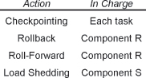

---
tip: translate by openai@2023-04-11 00:15:09
...

# CHAPTER 4

# Architectural Patterns

This chapter and the patterns it contains reflect architectural lessons from highly available systems of all sizes. The overall system architecture greatly influences how tolerant of faults the system will be. This chapter’s techniques contain architectural considerations that cut across all parts of the system. They do not fit neatly into the categories of error detection, error recovery, error mitigation, and fault treatment. They do not focus solely on a particular class or module; they influence the design of the whole system.

> 这一章节及其所包含的**模式反映了各种规模的高可用系统的架构教训**。**整体系统架构极大地影响系统的容错能力。** 本章节的技术包含了贯穿整个系统的架构考虑。它们不能完美地分类为错误检测、错误恢复、错误缓解和故障处理。它们不仅仅关注特定的类或模块，而是影响整个系统的设计。

These patterns are also among the first patterns applied to a new design project that needs to support fault tolerant operation. This is another reason for placing them here, in a separate chapter, rather that sorting them into the chapters of specific techniques.

> 这些模式也是首先应用于需要支持容错操作的新设计项目的模式之一。这是将它们放在这里，在一个独立的章节中，而不是将它们分类到特定技术章节中的另一个原因。

For example, the pattern MINIMIZE HUMAN INTERVENTION (5), which is found in this chapter, acknowledges that in order for a system to be highly available it must recover as quickly as possible. People are slow when compared with a computer. Asking a person to intervene in an error situation slows down recovery, which in turn reduces availability. A highly available system should not need to ask for human intervention. To reduce recovery times, the design of every part of the system must include the capabilities for the system to resolve the problems by itself. This need for a global usage of the principles results in the pattern being architectural. Every part of the system must support and implement the architecture established by this pattern, or its benefits will be blocked. For example, wherever one module fails to use MINIMIZE HUMAN INTERVENTION and pauses to wait for operating control the system availability is greatly reduced.

> 例如，本章中找到的 **MINIMIZE HUMAN INTERVENTION(5)模式**承认， _为了使系统具有高可用性，它必须尽快恢复_ 。与计算机相比，人类行动缓慢。要求人类干预错误情况会减慢恢复速度，从而降低可用性。**高可用性系统不应该需要人类干预。** 为了减少恢复时间，**系统的每个部分的设计都必须包括系统自行解决问题的能力**。这种对原则的全局使用需要导致模式成为体系结构。系统的每个部分都必须支持和实施由此模式建立的体系结构，否则其好处将被阻塞。例如，如果一个模块未使用 MINIMIZE HUMAN INTERVENTION 并暂停等待操作控制，则系统可用性将大大降低。

[**Table 4.1**](#c04.htm#tab4.1a) Architectural patterns(架构模式)

```markdown
**PATTERN** **PATTERN INTENT**

- UNITS OF MITIGATION (1) Decide what the units of fault tolerance will be during the architecture phase.
- CORRECTING AUDITS (2) Design data to be checked and check data for errors. If errors are found, correct both the erroneous data and look for errors in related data.
- REDUNDANCY (3) Maximize availability by having alternate hardware or software that can perform the same function.
- RECOVERY BLOCKS (4) Increase the probability of successfully meeting acceptance tests by providing sequential execution of alternate computations.
- MINIMIZE HUMAN INTERVENTION (5) People make mistakes and are slow; to minimize downtime the system should take care of itself, without human intervention.
- MAXIMIZE HUMAN PARTICIPATION (6) Provide the capability for knowledgeable people to guide the system’s error processing.
- MAINTENANCE INTERFACE (7) Establish an interface to the system separate from the application’s interface to facilitate maintenance interactions.
- SOMEONE IN CHARGE (8) Every fault tolerance action undertaken by the system should have a clearly identified entity controlling and monitoring the action.
- ESCALATION (9) When error processing steps are not producing the desired effect on the system, try a more all-encompassing means.
- FAULT OBSERVER (10) Coordinate reporting to all observers that a fault is present, reported, and recovery actions escalated.
- SOFTWARE UPDATE (11) Design the system to allow the installation of new versions of the software.

> 缓解单位(1)决定在体系结构阶段的容错单位。
> 纠正审核(2)要检查的设计数据并检查数据是否错误。如果发现错误，请纠正错误数据并查找相关数据中的错误。
> 冗余(3)通过拥有可以执行相同功能的备用硬件或软件来最大化可用性。
> 恢复块(4)通过提供替代计算的顺序执行，增加了成功满足接受测试的可能性。
> 最大程度地减少人类干预(5)人会犯错，并且很慢；为了最大程度地减少停机时间，系统应在不干预的情况下照顾自己。
> 最大化人类参与(6)为知识渊博的人提供指导系统错误处理的能力。
> 维护接口(7)建立了与应用程序接口分开的系统接口，以促进维护交互。
> 负责的人(8)系统采取的每种容错行动都应具有控制和监视动作的明确确定的实体。
> 升级(9)当错误处理步骤没有产生对系统的所需效果时，请尝试使用更多的全部功能。
> 故障观察者(10)向所有观察者进行坐标报告，该报告存在故障，报告和恢复措施升级。
> 软件更新(11)设计系统以安装新版本的软件。
```

**[Figure 9](#c04.htm#fig4.9a)** Architectural pattern language map(建筑模式语言图)


[Figure 9](#c04.htm#fig4.9) contains one possible pattern language map from the patterns in Chapter 4.

> [图 9](#c04.htm#fig4.9)包含第 4 章中模式的一个可能的模式语言图。

The UNITS OF MITIGATION (1) are the building blocks of a fault tolerant system. They define the elements that may be repaired and restarted as needed to process errors. The UNITS OF MITIGATION guide the decisions about how REDUNDANCY (3) will be implemented in the system. The units of mitigation and redundant units are an intersecting set of the parts of the ultimate system design. These should be defined first to provide guidance for the remainder of the system’s design. Few techniques for creating redundant software exist; RECOVERY BLOCKS (4) discusses one practical method.

> **UNITS OF MITIGATION(1)是容错系统的基础组成部分。** 它们定义了可以根据需要修复和重新启动的元素。UNITS OF MITIGATION **指导关于如何在系统中实施冗余(3)的决策**。**单元的缓解和冗余单元是最终系统设计的一组交叉集合。** 这些应该首先定义，以提供系统设计的其余部分的指导。**创建冗余软件的技术很少；RECOVERY BLOCKS(4)讨论了一种实用的方法。**

> [!NOTE]
> 系统冗余的相关问题讨论

CORRECTING AUDITS (2) are checks of all the system’s important data to ensure both the data’s correct value and that the structure of the data is not corrupted. Data must be well designed and must be designed to be checked, or _audited_. When erroneous data is detected it should be corrected immediately, if possible.

> **检查(2)(CORRECTING AUDITS)是对所有重要系统数据的检查，以确保数据的正确值和数据结构不被破坏。** 数据必须设计得当，并且必须设计得可以被检查或审计。当检测到错误数据时，应该立即纠正，如果可能的话。

To ensure that the system is always doing useful work, either application or fault tolerance related, every error processing action should have SOMEONE IN CHARGE (8). In some cases this will be the operating personnel through MAXIMIZE HUMAN PARTICIPATION (6).

> **为了确保系统总是在做有用的工作，无论是应用程序还是容错相关，每个错误处理操作都应有负责人(8)(SOMEONE IN CHARGE)。** 在某些情况下，这将是通过最大化人力参与(6)(MAXIMIZE HUMAN PARTICIPATION)的操作人员。

Sometimes error processing can’t immediately correct the problem, due to poor isolation or other reasons. In these cases ESCALATION (9) guides the selection of possible alternative actions for the system.

> 有时，由于隔离不良或其他原因，错误处理无法立即纠正问题。在这些情况下，升级(9)指导系统的可能替代行动的选择。

The fault tolerance actions of the system should not rely on operating personnel to resolve problems because people can easily make matters worse, so the system should be designed to MINIMIZE HUMAN INTERVENTION (5). Experienced personnel, for example the system designers, can make valuable contributions, so the system should enable this through MAXIMIZE HUMAN PARTICIPATION (6). To ensure that operating personnel can always access the system when necessary, and to ensure that maintenance requests are not lost or discarded by the application, a separate MAINTENANCE INTERFACE (7) is used. This interface will provide a direct avenue to the maintenance functionality, not risking or relying on the maintenance requests to be separated properly from the application data stream.

> 系统的容错措施不应依赖操作人员来解决问题，因为人们很容易使事情变得更糟，因此系统应被设计为最小化人工干预(5)。有经验的人员，例如系统设计师，可以做出有价值的贡献，因此系统应该通过最大化人参与(6)来实现这一点。为了确保操作人员在必要时总能访问系统，并确保维护请求不会被应用程序丢失或丢弃，使用一个单独的维护接口(7)。该接口将提供一条直接通往维护功能的途径，而不会冒险或依赖将维护请求正确地从应用程序数据流中分离出来。

Fault tolerant systems usually operate in an environment where there are other systems or personnel watching how the system is performing at any given time. The FAULT OBSERVER (10) interface provides that oversight capability into the system.

> 系统容错通常在其他系统或人员实时监视系统运行情况的环境中运行。故障观察器(10)接口为系统提供了监督能力。

Most fault tolerant systems will require some update of software version to either correct faults or to introduce new functionality, and this is discussed in SOFTWARE UPDATE (11).

> 大多数容错系统都需要更新软件版本以纠正故障或引入新功能，这在软件更新(11)中有所提及。

# 1. Units of Mitigation


… You are designing a fault tolerant system. You are using good programming methods and have set up the appropriate quality methodologies and project standards. You are at the early design stages where the system design is still malleable.

> 你正在设计一个容错系统。你使用良好的编程方法，并设置了适当的质量方法和项目标准。你正处于系统设计仍然可塑性的早期设计阶段。

You know that there will be faults in the system. When they activate they cause errors and a fail-stop or fail-safe design makes some part (or all) of the system unavailable. The risk is that the failing part is the whole system. You want to reduce, or mitigate, this risk of a complete shutdown.

> 你知道系统中会有故障。当它们激活时，它们会导致错误，并且失败停止或安全设计使一部分(或全部)系统不可用。风险是故障部分是整个系统。您希望减少或减轻完全关闭的风险。

**How can you keep the whole system from being unavailable when an error occurs?**

> 何种方式可以在出现错误时防止整个系统不可用？

In the simplest designs, there is one module that performs all of the work. When this monolith has an error, no work will be done. Choosing to consider the entire system as a whole limits the kinds of recoveries that are possible without the system being unavailable. Having only one module means that the entire system must stop to recover an error.

> **在最简单的设计中，有一个模块执行所有工作。当这个巨石出现错误时，没有工作将被完成。** 选择将整个系统作为一个整体来考虑，会限制可能的恢复方式，而不会使系统不可用。**只有一个模块意味着整个系统必须停止以恢复错误。**

The amount of overhead increases as the size of the components decreases because bookkeeping needs increase. Overhead increases both statically, e.g. memory used, and dynamically, e.g. in terms of execution time. As the size of the units decreases more and more, other options to recover and mitigate errors become possible, because the system can now treat errors in one unit while the others continue operation. Some of the techniques possible include FAILOVER (36), retaining state via CHECKPOINTS (37), redirecting operations through ROLLBACK (32) or ROLL-FORWARD (33) and many others described later in this book.

> **随着组件尺寸的减小，管理费用也会增加，因为记账需求增加。** 管理费用既会静态增加，例如内存使用量，也会动态增加，例如执行时间。**随着单元尺寸越来越小，恢复和缓解错误的其他选择也变得可能**，因为系统现在可以在其他单元继续运行的同时处理一个单元的错误。一些可能的技术包括故障转移(36)(ROLLBACK)，通过检查点(37)(ROLL-FORWARD)保留状态，通过回滚(32)或向前滚动(33)重定向操作以及本书后面介绍的许多其他技术。

Interfaces between the units of mitigation must be well defined and clear. It is along these interfaces that the mitigation actions take place to recover from errors or reduce the impact of errors. When there are more units in the system, there are more interfaces.

> 接口必须清晰明确地定义在减轻单元之间。正是在这些接口上，减轻措施才能恢复错误或减少错误的影响。当系统中有更多单元时，就会有更多的接口。

If there are smaller parts of a system that make well defined units, with clear interfaces, use these as the basic unit of mitigation. With finer granularity, it is more economical to replicate the units as described in REDUNDANCY (3). Load sharing is possible with multiple copies when they are not actively involved in error mitigation. The units of mitigation should contain atomic actions that do not rely heavily on communication with other units of mitigation to accomplish their task.

> **如果系统有更小的部分可以形成明确的单元，并具有清晰的接口，则应将其作为缓解的基本单元。** 细粒度更低，按照冗余(3)中所述复制单元更具经济效益。**当它们不积极参与错误缓解时，可以使用多个副本进行负载共享。缓解单元应包含不依赖于与其他缓解单元的通信来完成其任务的原子操作。**

> [!NOTE] > **当它们不积极参与错误缓解时，可以使用多个副本进行负载共享。**
> 这里提到了之前我也考虑到的问题，这个冗余备份的技术在空闲的时候可以用来实现 “负载均衡” 的技术

The dividing line between different parts of the system must be clearly discernable. And the boundary must be respected, dividing the system into discrete parts. The clear separation between parts of the system is important to keep errors contained, which is the primary reason for dividing the system at all.

> **系统的不同部分之间必须有一条明显的分界线。边界必须得到尊重，将系统分割成独立的部分。清楚地分离系统的部分对于限制错误非常重要，这也是将系统分割的主要原因。**

No two design problems are identical. Therefore, there is no one right answer to the question about what the basic units should be. In some cases, the answer is building a monolithic structure. In other systems, the units of mitigation are quite small.

> 没有两个设计问题是完全相同的。因此，没有一个正确的答案来回答有关基本单元应该是什么的问题。在某些情况下，答案是建立一个整体结构。在其他系统中，**缓解的单位相当小**。

The architectural style in use, such as a three-tiered architecture, can provide units of mitigation that are similar from situation to situation. But even in that case you need to determine if there are other units present in the architecture.

> 使用的架构风格，比如三层架构，可以提供类似情况下的缓解单元。但即使在这种情况下，您也需要确定架构中是否存在其他单元。

The units of mitigation can be duplicated to provide for REDUNDANCY (3), which will allow multiple copies of the functionality to perform simultaneously. Adding additional redundant units helps with both performance enhancements by supporting load sharing, and with error processing. The system can redirect the workload to a different unit if one needs to be removed from service temporarily to support error processing.

> **可以复制缓解单元，以提供冗余(3)，以便多个功能副本可以同时执行。** 添加额外的冗余单元有助于性能增强，因为它支持负载共享，以及错误处理。如果需要暂时从服务中移除一个单元以支持错误处理，系统可以将工作负载重定向到不同的单元。

This pattern describes a design level activity. The results of applying this pattern during design will be identifiable within the architecture of the system, even though they are not providing the structure of the application. The units of mitigation are run time entities because error handling is done during execution.

> 这种模式描述了一个设计层次的活动。在设计过程中应用这种模式的结果将可以在系统的架构中识别出来，即使它们不提供应用程序的结构。减轻单元是运行时实体，因为错误处理是在执行过程中进行的。

The architecture might show natural lines of cleavage, such as cluster architectures, terminal/protocol handlers, tasks dedicated to a certain processor or processor core, etc. The units of mitigation do not need to be symmetric, or of identical size. The units of mitigation that support the primary functionality (the application) can be larger than the units for the support functionality. This is because the failures in the support functions typically have less stringent availability requirements than the primary application.

> 架构可能显示自然的分离线，例如集群架构、终端/协议处理器、专门针对某个处理器或处理器核心的任务等。缓解单元不需要是对称的或大小相同的。支持主要功能(应用程序)的缓解单元可以比支持辅助功能的单元大。这是因为辅助功能中的故障通常具有比主要应用程序更不严格的可用性要求。

Portions of the system that perform different functions, such as interfacing to users or handling a database, are good units of mitigation. When there are separate processors in a distributed system, these make good units of mitigation.

> **系统的不同部分负责执行不同功能，比如与用户进行交互或处理数据库，都是很好的缓解单元。当分布式系统中有独立的处理器时，这些也是很好的缓解单元。**

When there are groupings of similar functionalities, the entities that are grouped are good units of mitigation. For example threads in a threadpool make good units of mitigation. Another example is in a system that involves inherent redundancy or duplication, such as the example ‘objects for characters’ used in explaining the FLYWEIGHT pattern. [GHJ+95]

> 当有类似功能的分组时，被分组的实体是很好的缓解单元。**例如线程池中的线程是很好的缓解单元。** 另一个例子是在一个系统中涉及内在的冗余或重复，比如用于解释 FLYWEIGHT 模式的“对象字符”的例子。[GHJ+95]

> [!NOTE]
> 这里提到了 **例如线程池中的线程是很好的缓解单元。**
> 这个例子和上面的 “负载均衡” 技术想呼应

The units of mitigation should conform to the boundaries of memory spectrum or processor assignment. Units of mitigation should not share more than one processor unless there is shared memory, or more than one region of non-distributed memory. Error detection and processing techniques work best with clear boundaries of memory.

> 单位的缓解应该符合内存谱系或处理器分配的边界。**单位的缓解不应该共享超过一个处理器，除非有共享内存**，或者超过一个非分布式内存区域。**错误检测和处理技术最好在内存的明确边界上运行。**

The division of the system into units of mitigation should also consider the recovery and mitigation techniques available to it. If the only change in process state is at the level of the whole system, then the whole system should be the unit of mitigation; in practice it will be. When recovery actions such as RESTART (31) can be done at a fine-grained level, pick the units of mitigation correspondingly small. For example, if restart of individual Java containers will be possible in an application server system, pick the containers as the units of mitigation. [CBF+04]

> **系统的划分为缓解单元也应该考虑可用于其的恢复和缓解技术。** 如果过程状态的唯一变化发生在整个系统的层次上，那么整个系统应该是缓解单元；在实践中，这也是如此。**当恢复操作(如重新启动)可以在细粒度级别完成时，请将缓解单元划分为相应的小单元。** 例如，如果在应用程序服务器系统中可以重新启动单个 Java 容器，请将容器作为缓解单元。[CBF + 04]

The units of mitigation should be able to conduct self checks to detect when they are not operating correctly. The units of mitigation should fail silently in a deterministic way. If the units are so small that any errors that occur cannot be recovered or mitigated, the unit is too small. For example, picking individual statements in a function or method is impractical because most languages will only be able to correct the results of the function or method, not the intermediate calculations. Both internal data and execution errors should be detected.

> **单元减轻应能够进行自检，以检测它们是否运行不正常。单元减轻应以确定性的方式静默失败。** 如果单元太小，以至于不能恢复或减轻发生的任何错误，则该单元太小。例如，在函数或方法中选择单独的语句是不切实际的，因为**大多数语言只能纠正函数或方法的结果，而不是中间计算。应检测内部数据和执行错误。**

The units of mitigation must be barriers to errors. The boundaries and implementation of the units of mitigation must prevent errors from being communicated outside the boundary. The unit of mitigation must detect internal errors quickly. The only acceptable indication to other parts of the system should be the single indication that an error has occurred. It is desirable for units of mitigation to fail silently and to isolate failures from other parts of the system.

> 单元级的缓解措施必须是错误的阻隔。**边界和实施单元级的缓解措施必须阻止错误被传播到边界之外。** 单元级的缓解措施必须迅速检测内部错误。对系统的其他部分唯一可接受的指示应只有一个错误发生的指示。最好的是，单元级的缓解措施能够静默失败，并将失败隔离开来，不影响系统的其他部分。

The units of mitigation must be recognizable elements of the system. Choosing to have only portions of the smallest nameable entity in the system as a basic unit of mitigation means that either the naming or the unit of mitigation selection was wrong. Error reports and actions will be addressed to the unit, so it must be nameable.

> 单位的缓解必须是系统中可识别的元素。选择仅将系统中最小可命名实体的部分作为缓解的基本单位意味着命名或单位缓解选择都是错误的。错误报告和行动将针对单位，因此它必须可以命名。

Therefore,

**Divide the system into parts that will contain both any errors and the error recovery. Choose the divisions that make sense for your system, <a href="#c04.htm#fig4.10" id="c04.htm#fig4.10a">Figure 10</a>. Design the rest of the system around these parts that represent the basic units of error mitigation.**

> 将系统分成包含任何错误和错误恢复的部分。根据您的系统选择合理的分割，<a href="#c04.htm#fig4.10" id="c04.htm#fig4.10a">图 10</a>。根据这些代表基本错误缓解单元的部分来设计系统的其余部分。

**[Figure 10](#c04.htm#fig4.10a)** Different UNITS OF MITIGATION(不同的减灾措施)


The actual resolution of this problem will vary with the situation and will result in analysis of the various tradeoffs/forces: Overhead and complexity, natural divisions in the architecture and architectural style basic concepts.

> 实际的解决方案会因情况而异，并会导致**对各种权衡/力量的分析：开销和复杂性、自然分割的架构和架构风格的基本概念**。

This pattern represents an essential step to identify the units of error detection and error processing.

> 这种模式代表了识别错误检测和错误处理单元的基本步骤。

Ignoring the divisions between units of mitigation will not produce an optimal solution to system availability. It leads to too much of the system being unavailable or of recovery attempts failing because the failure is slightly out of scope for the unit of mitigation.

> 忽略缓解单元之间的划分不会产生对系统可用性的最佳解决方案。这会导致系统不可用的情况过多，或者恢复尝试失败，因为故障超出了缓解单元的范围。

Within UNITS OF MITIGATION the system should focus resources on error processing, in other words, perform a CONCENTRATED RECOVERY (29). This will reduce the unavailability time and make it more predictable.

> 在减灾措施的单位(UNITS OF MITIGATION)中，**系统应该集中资源处理错误，换句话说，进行集中恢复(29)。这将减少不可用时间，使其更加可预测。**

The patterns REDUNDANCY (3), FAILOVER (36), WHAT TO SAVE (38) and REMOTE STORAGE (39) offer considerations that can help you decide what the UNITS OF MITIGATION should be.

> 这些模式 REDUNDANCY(3)、FAILOVER(36)、WHAT TO SAVE(38)和 REMOTE STORAGE(39)提供了一些考虑，可以帮助您决定应该采取什么样的缓解措施。

This pattern describes hardware and software units and major parts. ERROR HANDLERS (30) and RECOVERY BLOCKS (4) describe recovery for software algorithms and smaller parts of the system.

> 这种模式描述了硬件和软件单元以及主要部件。错误处理器(30)和恢复块(4)描述了软件算法和系统较小部件的恢复。

Example: Consider a three-tiered architecture (User interface, functional process and data access layers). We are adding fault tolerance into it and want it to be able to seamlessly recover when it detects any faults or errors. The system should be able to mitigate the error quickly and efficiently through one of the mechanisms described later with minimal disruption to service, i.e. minimal downtime.

> 考虑一个三层架构(用户接口、功能处理和数据访问层)。我们正在为其添加容错功能，希望它能够在检测到任何故障或错误时无缝恢复。该系统应能够通过稍后描述的其中一种机制迅速有效地缓解错误，并且服务时间最小化，即最小化停机时间。

At first you think of making the whole system the unit of recovery. This is a common approach; one that many systems have historically taken. The problem with this approach is that when something fails the entire system needs to participate in the mitigation, making it unavailable.

> 首先，您考虑使整个系统成为恢复的单位。这是一种常见的方法；许多系统历史上都采用了这种方法。问题是，当某些东西失败时，整个系统都需要参与缓解，使其不可用。

After consideration, you think that there should be some smaller units of mitigation than the entire system. The next obvious solution is to make the basic unit be one of the tiers. There are already clean interfaces between the tiers, so that if one of the tiers needs to participate in mitigation the neighboring tiers already know how to communicate with it.

> 经过考虑，您认为应该有比整个系统更小的缓解单元。下一个明显的解决方案是使基本单元成为其中的一个层次。各层之间已经有清晰的接口，因此，如果某个层需要参与缓解，邻近的层已经知道如何与它进行通信。

However, unless there are redundant tiers (which can exist in a large scale system) then any tier level error processing actually takes the whole system out of service. The effects of this can be reduced by queuing requests from the other tiers while waiting for the mitigation to complete. The still available tiers will still process requests and queue requests awaiting the recovery to end.

> 然而，**除非有多余的层(在大规模系统中可能存在)**，否则任何层级的错误处理实际上会使整个系统停止服务。通过在等待缓解完成时对其他层次进行排队处理，可以减少这种影响。仍然可用的层次仍将处理请求并队列等待恢复结束的请求。

A common solution is to mitigate at the tier level with either redundant tiers or queues and other request buffering. It is based on the benefits that having multiples of the tier-level entities can provide, in addition to the mitigation of errors. Whenever a single tier contains a detected error the system can redistribute the workload around the unit with the error until it can be safely brought back to correct operation (mitigated). …

> 一个常见的解决方案是**在层级上进行缓解，使用冗余层级或队列和其他请求缓冲**。它基于具有多个层级实体所提供的好处，以及错误的缓解。**每当单个层级包含检测到的错误时，系统可以在具有错误的单元周围重新分配工作负载，直到它可以安全地恢复到正确的操作(缓解)。**

> [!NOTE]
> 感觉这个想法，和我之前的那个专利特别像

# 2. Correcting Audits


… Data errors can and do occur.

> 数据错误确实会发生。

Data can be thought of as being static or dynamic. Static data doesn’t change very often during normal operations. Configuration data is static data that might change infrequently, for example only when a SOFTWARE UPDATE (11) is made. Applications also have data that doesn’t change, for example telephone area (region) codes change very infrequently.

> 数据可以被认为是**静态的或动态**的。静态数据在正常操作中不会经常改变。**配置数据是静态数据**，可能只在做软件更新时才会改变。应用程序也有不会改变的数据，例如电话区号很少改变。

Dynamic data changes frequently during normal execution. Per transaction memory, scratch memory, request-handling data structures are all examples. In a financial application system the currency exchange rate or the current prices for a stock are dynamic data. In a scientific application the intermediate results are dynamic data.

> **动态数据在正常执行期间经常发生变化。** 每笔交易内存、临时内存、请求处理数据结构都是例子。在金融应用系统中，汇率或股票的当前价格都是动态数据。在科学应用中，中间结果是动态数据。

Data errors occur because something corrupted the data element. The corruption might come from low level hardware, such as memory chips, or they might be other application functions that store incorrect values into a data element. Random and transient events also occur, such as alpha rays emitted from integrated circuit packaging.

> 数据错误是由于某些东西破坏了数据元素而发生的。**损坏可能来自低级硬件，如内存芯片**，或者可能是其他将错误值存储到数据元素中的应用程序功能。**还会发生随机和瞬态事件**，如集成电路封装发出的 α 射线。

**Faulty data causes errors.**(数据错误会导致错误)

Errors from faulty data easily propagate throughout the system. When the period of time between detection and recovery is long, there is a larger chance of another task using the erroneous data and making an erroneous (and possibly failing) decision with it.

> **错误的数据很容易在整个系统中传播。** 当检测和恢复之间的时间较长时，另一项任务使用错误数据并做出错误(可能失败)决定的机会更大。

In real-time and transaction oriented systems the dynamic data is always changing. The values that were installed during initialization or DATA RESET (41) will change for valid reasons. But sometimes they will be changed to erroneous values.

> 在实时和事务导向系统中，动态数据总是在变化。在初始化或数据重置(41)期间安装的值会因有效原因而改变。但有时它们会被更改为错误值。

The context of the data must be considered. For example the number ‘1974’ is valid as a year, but not valid as an age. The context should be used to help define the allowable data checks.

> **数据的上下文必须考虑在内。** 例如，'1974'是一个有效的年份，但不能作为一个有效的年龄。应使用上下文来帮助定义允许的数据检查。

Checking, or ‘auditing’, data for errors is accomplished by using other information that is known about the data to determine its correctness. Checks are done by using the structural properties of the data structures, or by using information known in advance about the data’s values. The first kind of checks looks to the structure of the data, for example that a linked list’s pointers are correct or that a queue or list has an allowable number of entries. Redundant information can be stored along with the data to report if the data is incorrect. CHECKSUMS (25) is an example of this detection method. Knowing at design time that only certain values of a piece of data are legal enables checking the data at execution time for correctness.

> 检查或“审计”数据的错误是通过使用关于数据的其他已知信息来确定其正确性来完成的。**检查是通过使用数据结构的结构属性或者使用关于数据值的预先知道的信息来完成的。** 第一种检查**看向数据的结构**，例如链表的指针是否正确，或者队列或列表是否有允许的条目数。可以存储冗余信息来报告数据是否不正确。校验和(25)是这种检测方法的一个例子。在设计时知道一个数据块的值只有一定的值是合法的，可以在执行时检查数据的正确性。

Some of the ways that data can be checked:

COMPLETE PARAMETER CHECKING (14) discusses error detection when entering and leaving methods and functions. These checks provide a way to use the mechanisms above to detect errors in dynamic data close to where it became erroneous.

> 完整参数检查(14)(COMPLETE PARAMETER CHECKING (14))讨论了**在进入和离开方法和函数时进行错误检测**。这些检查提供了一种方法，可以使用上述机制来检测动态数据中接近变得错误的地方的错误。

You must design the system’s data to be easily audited. Use two way linked lists because then linkages are redundant and enable easy checking. Use redundant locations in other parts of the system for data to enable easy checking. Use non-trivial values for static configuration values because then simple errors will be very obvious.

> 你必须设计系统的数据，以便于审计。使用双向链表，因为链接是冗余的，可以轻松检查。在系统的其他部分使用冗余位置来存储数据，以便于轻松检查。对静态配置值使用非平凡的值，因为这样简单的错误就会非常明显。

Many data errors can be corrected automatically. When they can be corrected automatically the time from detection to error-free operation is reduced, which enhances system availability.

> 许多数据错误可以自动纠正。当它们可以**自动纠正**时，从检测到无错误操作的时间会减少，从而提高系统可用性。

Depending upon the nature of the detected data errors the correction mechanisms vary. If the linked list is incorrect the linkages can be rebuilt. If orphaned resources are found they can be released for other uses. If correlated data is inconsistent it can be made consistent. If values are out of a normally expected range perform a DATA RESET (41). The data fault might be correctable by either its CHECKSUM (25) or by an ERROR CORRECTING CODE (57). If it is not correctable the effects of the fault can be mitigated by using the MARKED DATA (56) technique. If it can’t be corrected, and can’t be mitigated, then an error recovery action will be necessary.

> **根据检测到的数据错误的性质，修正机制有所不同。如果链表不正确，可以重建链接。如果发现孤立的资源，可以释放用于其他用途。如果相关数据不一致，可以使其一致。如果值超出正常预期范围，请执行数据重置(41)。数据故障可能可以通过校验和(25)或纠错码(57)来纠正。如果无法纠正，可以通过使用标记数据(56)技术来减轻故障的影响。如果无法纠正，也无法减轻，则需要执行错误恢复操作。**

When a data error cannot be corrected automatically, other recovery steps should be taken. These can include unwinding the execution from an ERROR HANDLER (30) or restoring the erroneous data from a CHECKPOINT (37) and ROLLING BACK (32).

> 当数据错误无法自动纠正时，应采取其他恢复步骤。这些可能包括**从错误处理程序(30)撤消执行，或从检查点(37)和回滚(32)恢复错误数据**。

> [!NOTE]
> 这些对数据的安全检查上，和 QoS 很容易联系起来

If the detection of the erroneous data was accomplished through a COMPLETE PARAMETER CHECK (14) or a ROUTINE AUDIT(24), or otherwise corrected by an ERROR HANDLER(30), then execution can resume at the point of detection. This emphasizes the need to put the detection mechanism as close to the point of first access as possible. Frequently some code re-execution will be required to undo the most recent action that involved the erroneous data. ROLLBACK (32) might be required to move the system to a state where this re-execution can occur. If it is impossible to return to that point then a RETURN TO REFERENCE POINT(34) should occur to return the system to a known state from which processing can continue.

> **如果通过完整的参数检查(14)或例行审计(24)或错误处理程序(30)检测到错误数据，则可以从检测点继续执行。这强调了将检测机制放置在第一次访问点尽可能近的重要性。通常需要重新执行一些代码来撤消涉及错误数据的最近操作。可能需要回滚(32)以将系统移至可以重新执行的状态。如果无法返回该点，则应该返回参考点(34)以使系统返回可以继续处理的已知状态。**

Where there’s one data error there might be others. When a data error is detected a prudent step is to consider what other data might be erroneous. The detected error might be the result of a number of computations that should all be considered suspicious and checked for errors.

> 当发现一个数据错误时，可能还有其他错误。**当检测到数据错误时，明智的一步是考虑可能存在其他错误的数据。** 检测到的错误可能是多个计算的结果，应该都要怀疑并检查是否存在错误。

Automatic correction mechanisms must ensure that after correction the related data items are consistent. In the 4ESS™ Switch, each kind of data has an associated Audit Implicator Index (AII). The AII is used to link the audits together by pointing from the faulty data to other data that is somehow related. The specific audit components for the linked data can be executed to determine if the known faulty data has corrupted any other data. For example, a data error in the Auxiliary Call Register data structure implicates the Call Register data structure. AIIs are used to tell the auditing programs about relationships between different data structures that might not be easy to discern during execution time examination.

> **自动纠正机制必须确保纠正后相关数据项保持一致。** 在 4ESS™ 交换机中，每种数据都有一个相关的审计指示索引(AII)。AII 用于通过从有错误的数据指向其他与之相关的数据来链接审计。可以执行特定的审计组件来确定已知有错误的数据是否已经损坏了其他任何数据。例如，辅助呼叫注册数据结构中的数据错误会牵涉到呼叫注册数据结构。AII 用于告诉审计程序不同数据结构之间可能在执行时间检查期间不易察觉的关系。

All the data that is important to the system’s operation should be checked. For each data structure in the system you should consider what would happen if it became corrupted and erroneous. During this analysis you will probably find some items, such as temporary variables, that don’t have enough significance to the system to cause them to be checked. You will also find some data, for example a list of busy and idle resources, that is extremely significant and must be kept correct at all times.

> 所有对系统操作重要的数据都应该进行检查。对于系统中的每个数据结构，应该考虑如果它变得损坏和错误会发生什么。在这个分析过程中，您可能会发现一些像临时变量这样的项目，它们对系统的重要性不够，因此不必检查。您还会发现一些数据，例如忙碌和空闲资源的列表，这些数据非常重要，必须始终保持正确。

During design and test phases tests such as these audits might be used to ensure correct system operation. Leaving the tests in and handling the errors that they report as errors rather than diagnostic messages to the testers will increase system reliability.

> 在设计和测试阶段，可以使用这些审计等测试来确保正确的系统操作。将测试保留下来，将它们报告的错误处理为错误而不是给测试人员发送诊断消息，可以提高系统的可靠性。

In order to detect the fault that is causing the erroneous data to appear, the data error needs to be recorded and tracked. Repeated occurrences of events in the reports of data errors is useful to identify the fault. Any detection of data errors should be logged to enable for causal analysis. Notify the FAULT OBSERVER (10) to achieve this.

> 为了检测导致错误数据出现的故障，需要记录和跟踪数据错误。在数据错误报告中重复出现的事件有助于识别故障。应记录任何数据错误的检测，以便进行因果分析。通知故障观察者(10)实现此目的。

There are three tasks that should occur when data errors are detected: 1. correction, 2. logging, and 3. resume execution at the point of detection with the corrected data value.

> 当检测到数据错误时，应该执行三项任务：
>
> - 1.纠正，
> - 2.记录，
> - 3.以纠正的数据值在检测点处恢复执行。

> [!NOTE]
> 看到这里感觉应该将 QoS 结合起来使用，应该是多个策略一起来完成一个功能

This can be accomplished by three different tasks, or it can be accomplished by a part of the system designed to perform these three tasks as quickly as possible in support of CONCENTRATED RECOVERY (29).

> 这可以通过三项不同的任务来完成，或者可以通过一个系统的部分来尽可能快地完成这三项任务，以支持集中恢复(29)。

Therefore,

**Detect and correct data errors as soon as possible, <a href="#c04.htm#fig4.11" id="c04.htm#fig4.11a">Figure 11</a>. Check related data for errors, correct and record the occurrence of the error.**

> 检测和纠正数据错误尽快，<a href="#c04.htm#fig4.11" id="c04.htm#fig4.11a">图 11</a>。检查相关数据是否有错误，纠正并记录错误发生的情况。

**[Figure 11](#c04.htm#fig4.11a)** Errors are corrected(错误已经被纠正)


The system can have more than one ‘audit’. The system should have a common auditing infrastructure that enables individual audits to be created for different tasks. The 4ESS™ Switch has a common framework into which more than 100 different audits connect. Some are related to each other and reuse common components, such as linked list linkage checking, and many have unique functionality.

> 系统**可以拥有不止一个“审计”**。系统应该有一个共同的审计基础设施，可以用于创建不同任务的审计。**4ESS™ 交换机有一个共同的框架，可以连接超过 100 种不同的审计。其中一些是相关的，可以重用公共组件，比如链表链接检查，而且很多都有独特的功能。**

The reliability of the system will be improved because the probability of faulty data causing errors is reduced.

> 系统的可靠性将会提高，因为有故障的数据导致错误的概率降低了。

Other parts of the system, such as COMPLETE PARAMETER CHECKING (14) sometimes detect data errors. In systems with many different kinds of data they should direct the error reports to CORRECTING AUDITS (2). These parts of the system responsible for data integrity will be able to perform data FAULT CORRELATION (12).

> 其他系统部分，例如完整的参数检查(14)有时会检测到数据错误。 在具有许多不同类型数据的系统中，它们应将错误报告发送到纠正审计(2)。 这些负责数据完整性的系统部分将能够执行故障相关(12)。

The latent data fault should be reported to the FAULT OBSERVER (10) so that patterns and trends can be identified and corrected. If the data errors are numerous, or have the potential to cause a serious failure, then SOMEONE IN CHARGE (8) can trigger the ESCALATION (9) of data correction efforts. ESCALATION describes an example of this mechanism. …

> 故障的潜在数据应上报给故障观察者(10)，以便识别和纠正模式和趋势。如果数据错误众多，或者有可能导致严重故障，那么负责人(8)可以触发数据纠正工作的升级(9)。升级是这种机制的一个例子。...

# 3. Redundancy


… You are designing a system that should tolerate faults and have the maximum possible uptime. The amount of downtime between an error occurring (even before a failure happens) and resuming normal operation should be as small as possible.

> 你正在设计一个应能容忍故障并具有最大可能的正常运行时间的系统。**在发生错误(即使在发生故障之前)和恢复正常操作之间的停机时间应尽可能小。**

Multiple software and hardware components are combined to make up a system. The availability of all of these, software, hardware and systems, are important.

> 多个软件和硬件组件结合在一起构成一个系统。这些软件、硬件和系统的可用性都很重要。

There are two main ways that errors are processed. In some cases they can be masked and mitigated without changing the system state. The other way involves error recovery to place the system in a failure-free state.

> 在处理错误时，有两种主要方法。在某些情况下，它们可以被掩盖和减轻，而不改变系统状态。另一种方法涉及错误恢复，以使系统处于无故障状态。

**How can we reduce the amount of time between error detection and the resumption of normal operation after error recovery?**(我们如何减少错误检测和错误恢复后恢复正常操作之间的时间)

Availability refers to the percentage of time that the system is performing failure-free. See Chapter 1. During the period from when an error is detected until normal system processing is resumed after processing of the error the system is not performing its normal work. It is not available. Minimizing this time period increases availability.

> **可用性指的是系统无故障运行的时间百分比。** 参见第 1 章。从检测到错误到系统处理错误后恢复正常处理的这段时间，系统不能正常工作。它不可用。**缩短这段时间可以提高可用性。**

> [!NOTE]
> 使用 DDS 中 QoS - Ownership 的策略只是为了实现这个缩短时间的一个措施而已...
> 这前面还有一个时间，就是发现错误的时间，使用 liveless 策略就可以了吗？

Error processing cannot begin until the error is detected. Some aspects of detection are routine events and don’t count into unavailability. This includes the normal time to schedule an error detection check and to execute it in the error-free case. When the system detects an error it must focus on processing the error and that usually stops the normal execution.

> 错误处理不能开始，直到发现错误。某些检测方面是常规事件，不影响可用性。这包括正常安排错误检测检查和在无错误情况下执行的时间。当系统检测到错误时，它必须专注于处理错误，这通常会停止正常执行。

Minimizing unavailability when the error is being mitigated requires that the mitigation steps, such as marking the data as erroneous (see MARKED DATA (56)) be done as quickly as possible. A way to speed up mitigation activities is to perform just enough work during the error processing time to mask the error and defer as much as possible until after the resumption of normal execution. Notification about the error to the interested parties by the FAULT OBSERVER (10) can be deferred until normal operations are resumed. Mitigation needs fast techniques to minimize unavailability.

> 减少故障排除时的不可用性要求尽快执行缓解步骤，如将数据标记为错误(参见标记数据(56))。**加速缓解活动的一种方法是在错误处理时只执行足够的工作以掩盖错误，并尽可能地将其延迟到正常执行后。** 通过故障观察器(10)向有关各方通知有关错误可以推迟到恢复正常操作后。缓解需要快速技术来最大限度地减少不可用性。

> [!NOTE]
>
> - 只执行足够的工作
> - 尽可能延迟到正常的状态后再执行

Error recovery returns the system to a failure-free state. There are many techniques discussed in Chapter 6 that require large amounts of time to recover. For example CHECKPOINT (37) and ROLLBACK (32) require the time to copy large amounts of memory and then to reset system state to the point of rollback. In any recovery effort the effects of the error must be undone and the new error-free state instantiated. Minimizing these steps lead to minimizing unavailability.

> 系统恢复将系统恢复到无故障状态。第六章中讨论的**许多技术需要大量时间来恢复**。例如检查点(37)和回滚(32)**需要时间来复制大量内存，然后将系统状态重置到回滚点**。在任何恢复活动中，必须撤销错误的影响，并实例化新的无错误状态。最小化这些步骤可以最小化不可用性。

Reduction in the time to complete either of these parts of recovery reduces the time spent processing the errors.

> **减少这些恢复部分完成所需的时间可以缩短处理错误的时间**。

What if execution can be resumed before the bad effects of the error are undone? This would reduce the period of unavailability. Resuming execution in an element that is identical to the one with the error, but without the error achieves this. Having another way of accomplishing the same work, different software, different hardware or different systems is ‘redundancy’. What if the instantiation of the error-free state took almost no time? This reduces the period of unavailability. This can be accomplished by having a redundant unit, without the error, that can begin normal operations quickly.

> 如果可以在错误的不良影响未撤销之前恢复执行，这将减少不可用的时间段。在没有错误的元素中恢复执行可以实现这一点。使用不同的软件、不同的硬件或不同的系统来完成相同的工作是“冗余”。如果实例化无错误状态几乎没有时间，这将减少不可用的时间段。**通过拥有一个没有错误的冗余单元，可以快速开始正常操作来实现这一点。**

Consider three types of redundancy: spatial, temporal, and informational. Spatial redundancy is present when the system has multiple copies (in different places) that are redundant, which provides alternatives that may be selected with minimal unavailability. Temporal redundancy refers to redundancy that occurs over time, which helps achieve correct results but lengthens the time of unavailability. When information is repeated it can be used to aid detection and correction, this is informational redundancy. [ACM+00]

> **考虑三种冗余：空间冗余、时间冗余和信息冗余。**
>
> - **空间冗余**存在时，系统有多个副本(位于不同的地方)，这些副本是冗余的，可以在最小的不可用性情况下选择其中一个。
> - **时间冗余**指的是随着时间的推移而产生的冗余，有助于获得正确的结果，但会延长不可用性的时间。
> - 当信息被重复使用时，可以用来帮助检测和纠正，这就是**信息冗余**。[ACM+00]

> [!NOTE]
> 在进行节点动态热备份的时候需要从这三个角度进行考虑！
> 在进行节点备份的时候需要考虑着三个方面！

It is easy to understand and visualize spatial redundancy in terms of hardware: multiple copies of the hardware platform. Redundancy doesn’t have to mean identical functionality. All that is required is that some other part of the system can perform the work of the failing part. This might be a duplicate, identical module, or it might be another component that has extra programming that enables it to also perform some computations when the primary component cannot function correctly.

> 硬件方面很容易理解和可视化空间冗余：多份硬件平台的副本。**冗余不一定意味着完全相同的功能。所需要的只是系统的其他部分可以执行失效部分的工作。这可能是一个重复的、完全相同的模块，也可能是另一个具有额外编程的组件，当主要组件无法正常工作时，它也可以执行一些计算。**

> [!NOTE]
> 备份的节点应该能够支持指定部署到不同的板端，即空间上的动态部署
> **冗余**并不是完全的**克隆**？！

Five general purpose computers are used in the Space Shuttle. One is used to perform non-critical computations and the remaining four are used for critical functions. A system of redundant communications buses is used to connect these four critical computers with the various sensors and actuators throughout the spacecraft. In normal, failure-free operation each of the four computers are performing the same function and sending instructions to the peripheral device. The devices that act on these instructions compare the results (i.e. VOTING (21)) from the four computers to detect if one of the computers (and the instructions it provided) is incorrect. The four computers can also watch each other by monitoring the other’s instructions sent to peripherals as well as self testing comparison functions. [Skl76]

> 五台通用计算机被用于太空梭。其中**一台用于执行非关键计算，其余四台用于关键功能**。**一个冗余通信总线系统用于连接这四台关键计算机和飞船上的各种传感器和执行器**。在正常的无故障操作中，四台计算机都在执行同一功能，并向外围设备发送指令。这些执行指令的设备**会比较结果(例如投票(21))来检测是否有计算机(及其提供的指令)不正确**。这四台计算机**还可以通过监视其他计算机发送给外围设备的指令以及自检比较功能来相互监控。**[Skl76]

Telephone switching systems such as the 4ESS™ Switch used two duplicated processors for their main computations. Processors that interface to the outside world use a different redundancy scheme.

> 电话交换系统，如 4ESS™ 交换机，**用两台重复的处理器进行主要计算**。**与外界接口的处理器使用不同的冗余方案。**

> [!note]
> 与外界接口的处理器使用不同的冗余方案？
> 这句话是什么意思？

You must be careful with software redundancy. Unless you have consciously done something to cause multiple instances of software to be diverse, or different, they will be identical. Diversity is a great asset in the avoidance of error propagation. Since software is deterministic, multiple instances of identical software will all fail when presented with the same stimuli, although the identical stimuli might never reoccur.

> 你**必须小心软件冗余**。**除非你有意识地做些事情使多个软件实例不同，否则它们将是相同的。多样性在避免错误传播中是一个很大的资产。由于软件是确定性的，相同软件的多个实例在面对相同的刺激时将都失败，尽管相同的刺激可能永远不会再次发生。**

> [!NOTE]
> 这里提到了当时和 peng.sun 在讨论软件备份时候的一个问题，就是软件的多个实例是完全相同的，如果一个软件失败了，及时重启多少次都是失败的，就像之前港口车上电启动一样，就是重启很多次应用还是失败。
> 前面有通过多个实例对一个计算结果进行综合的校验问题，这个应该是为了保证结果的正确性来实施的方案！并不是为了通过多个来实现安全，虽然使用多个硬件来运行实例，可以避免一个受到破坏而产生问题，但那是考虑了硬件的因素而有的效果。

RECOVERY BLOCKS (4) [AK76] [LA90] provide a way to include temporal software redundancy. A program with RECOVERY BLOCKS consists of a primary block and secondary blocks. If the result of the primary block fails its acceptance test then the secondary blocks are executed in sequence until a result is obtained that passes the acceptance test. If no acceptable result is found then ERROR HANDLING (30) is triggered. N-Version Programming gives software a way of providing spatial redundancy.

> 恢复块(4)(RECOVERY BLOCKS (4))[AK76] [LA90]提供了一种包含**时间软件冗余**的方法。一个具有**恢复块的程序由主块和辅助块组成**。如果主块的结果未通过接受测试，则依次执行辅助块，直到获得通过接受测试的结果。如果没有找到可接受的结果，则触发错误处理(30)。**N 版本编程为软件提供了一种提供空间冗余的方法**。

Some avionics systems execute the same software on multiple processors with VOTING (21) to determine the correct value. In these systems a way of providing software redundancy is to provide for transition periods where some of the multiple processors are executing on the new versions of software, and other processors are still executing the prior version. This will prevent a new fault from causing an error in all of the processors simultaneously. After a time of trialing the new versions and observing that they are error-free, the processors executing the prior version of the software will be upgraded to the new version. [Lop06]

> 在一些航空电子系统中，多个处理器使用投票(21)来**执行相同的软件，以确定正确的值**。为了提供软件冗余，这些系统会提供**过渡期**，其中**一些多处理器正在执行新版本的软件，而其他处理器仍在执行先前的版本**。这将防止新的故障导致所有处理器同时出错。在试用新版本并观察无错误后，正在执行先前软件版本的处理器将升级到新版本。[Lop06]

> [!NOTE]
> A/B 分区？

Informational redundancy is provided by having multiple versions of the same data available to the system. The multiple versions can be stored in different places on different types of storage, for example disk and flash memory. This enables ready access to alternate versions of the data that CORRECTING AUDITS (2) can use to quickly make a correction. Information can also be stored in several different representations. For example, if the distance between two points is needed it can be stored as both the distance and the location of the endpoints which can be used to recompute the distance quickly.

> **信息冗余**是通过向系统提供多个版本的相同数据来实现的。多个版本可以**存储在不同的地方**，使用不同的存储类型，例如磁盘和闪存内存。这使得可以快速访问数据的备用版本，以便审计(2)能够快速进行修正。信息也可以以**多种不同的表示形式存储**。例如，如果需要两点之间的距离，可以将其存储为距离和端点位置，以便可以快速重新计算距离。

Redundancy as discussed here helps the system to be more available. Redundancy is sometimes introduced to improve performance. In this case there are multiple copies that are used in parallel, for example in a cluster of computers, or multiple instances of the same process. In either case a mechanism to distribute work between the copies is needed. In a redundancy-for-performance environment the availability enhancing effects are supplied by providing excess capacity. For example, availability is enhanced when a cluster of redundant systems provide an idle extra processor to assume the workload of a failing processor. Web servers are frequently combined in a cluster arrangement with a load balancer that distributes requests to the most idle server. Should one of the servers become unavailable, the other servers in the cluster will assume the failing server’s share of the work.

> 冗余如在此讨论的，有助于系统更可用。**有时会引入冗余来提高性能。** 在这种情况下，有多个副本是并行使用的，例如在一个计算机集群中，或者多个相同进程的实例。无论哪种情况，都需要一种机制来在副本之间分发工作。在冗余-提高性能的环境中，提供过剩容量来提供可用性增强的效果。例如，**当一个冗余系统集群提供一个空闲的额外处理器来承担故障处理器的工作负载时，可用性就会得到增强。** 网络服务器经常结合一个负载平衡器，将请求分发给最空闲的服务器。如果其中一个服务器不可用，集群中的其他服务器将承担失败服务器的工作份额。

Redundancy is not free. There are the capital costs of extra resources such as memory or processing. There are also inherent risks and costs associated with maintaining the redundant elements.

> **冗余不是免费的。额外资源，如内存或处理器，会有资本成本。维护冗余元素也会有固有的风险和成本。**

Therefore,

**Provide redundant capabilities that support quick activation to enable error processing to continue in parallel with normal execution. See <a href="#c04.htm#fig4.12" id="c04.htm#fig4.12a">Figure 12</a>.**

> 提供冗余的能力，以支持快速激活，以便使错误处理能够与正常执行并行进行。参见<a href="#c04.htm#fig4.12" id="c04.htm#fig4.12a">图 12</a>。

**[Figure 12](#c04.htm#fig4.12a)** Redundancy(冗余)


There are many ways to provide this redundancy. Spatial redundancy methods include Active-Active, Active-Passive, N+1 (generally N+M) redundancy, etc. Both Saridakis [Sar02] and Ahluwalia and Jain [AJ06] have described these different methods of providing redundancy as patterns. These have various tradeoffs in costs v. recovery time as can be seen in <a href="#c04.htm#fig4.13" id="c04.htm#fig4.13a">Figure 13</a>.

> 有许多方法可以提供冗余。**空间冗余方法包括 Active-Active、Active-Passive、N+1(通常是 N+M)冗余等**。 Saridakis [Sar02]和 Ahluwalia 和 Jain[AJ06]都将这些提供冗余的不同方法描述为模式。如<a href="#c04.htm#fig4.13" id="c04.htm#fig4.13a">图 13</a>所示，它们**在成本与恢复时间之间存在各种权衡**。

**[Figure 13](#c04.htm#fig4.13a)** Cost v. recovery time tradeoffs(成本与恢复时间的折衷)


> [!NOTE]
> 这里是提到了几种不同的策略，之后可以进一步看一下

Active-Active provides a totally redundant UNITS OF MITIGATION (1) for the critical functionality. At any given time, both of the elements are active and load sharing. However, either of the elements is capable of processing the entire load. Active-active provides the fastest recovery, but it also has a high cost because there is much more capability in the system than is needed for the ordinary workload. Active-Active implies a pairing between the two active units.
In an Active-Standby situation, the standby is again paired with an Active element. But in Active-Standby the standby element is not performing useful work. This means that the same amount of resources is needed as in the Active-Active case but during periods of normal operation the standby is idle. It is merely ready to assume actions. There is a one to one relationship between the active element and the standby. Variants of both Active-Active and Active-Standby exist related to how often the active and redundant elements share state. The more often they share state the quicker the recovery, but also the more expensive in terms of execution overhead and reduced communications bandwidth.

> - **活动-活动(Active-Active)提供了完全冗余的缓解单元(1)，用于关键功能。任何时候，两个元素都是活跃的，并且进行负载共享。** 但是，任何一个元素都能够处理整个负载。活动-活动提供了**最快的恢复**，但它的成本也很高，因为系统中的能力比普通工作负载要多得多。活动-活动意味着**两个活动单元之间的配对**。
> - 在活动-待机(Active-Standby)状态下，**待机也与活动元素配对**。但是在活动-待机状态下，**待机元素不执行有用的工作**。这意味着**需要与活动-活动情况相同的资源**，但在正常运行期间待机是空闲的。它仅仅准备接受行动。活动元素和待机元素之间存在一对一的关系。活动-活动和活动-待机的变体都与活动和冗余元素**共享状态的频率有关。共享状态的频率越高，恢复越快**，但执行开销和通信带宽也越大。

> [!NOTE]
> 这里的共享状态应该是之前讨论的状态共享的问题，从这里可以看出来，只要是以一定的频率进行同步，那么在两次同步状态之间就存在状态差，这个就像积分一样，只要划分的足够小就能够忽略这个值。
> 在实际的工程问题上不可能是趋近于无穷的，但是类似于控制工程中提到的 5% 的问题，可以将其做成一个可配置的选项，让用户给出可接受的范围。通过类似 QoS 的策略来保证，也不能完全按照用户的配置来。

In situations where a one to one relationship, such as described by the previous two methods, is too expensive, N+M Redundancy is a useful technique. In this configuration there are N active elements processing the workload of the system. There are also M redundant, standby elements in the system, ready to assume control when a failure occurs in any of the N. This requires that there be some way to redirect traffic from any of the N active units to one of the redundant sets. Frequently there are not dedicated pools of spare or standby units, instead any of the elements might at any given time be performing as one of the active elements or as one of the standby elements. Multiple and different redundancy schemes may be used simultaneously. For example multiple software versions may be executing on redundant hardware.

> 在一对一关系太昂贵的情况下，**N+M 冗余**是一种有用的技术。在这种配置中，有 N 个活动元素处理系统的工作负载。系统中还有 M 个冗余的待机元素，准备在任何一个 N 发生故障时接管控制权。这要求有一些方法可以将流量从任何一个 N 活动单元重定向到其中一个冗余集合。通常没有专用的备用单元池，而是任何元件可能在任何时间都可以执行活动元素或备用元素之一的角色。可以同时使用多种不同的冗余方案。例如，可以在冗余硬件上执行多个软件版本。

> [!NOTE]
> 这里冗余的方案就特别像是我之前写得专利中使用到的类似线程池的技术了，对多个节点抽象出一个公共的节点，以此准备一个池子。

Redundancy comes to play when the error tolerance is exceeded. RIDING OVER TRANSIENTS (26) is a technique to determine if errors are permanent and exceed the tolerance limit. ESCALATION (9) guides the choices of alternate error processing techniques.

> **当超出容错限度时，冗余就会发挥作用。** **RIDING OVER TRANSIENTS(26)是一种用于确定错误是否是永久性的并超出容错限度的技术。ESCALATION(9)指导了替代错误处理技术的选择。**

The system will use FAILOVER (36) to perform the transition between the formerly active element and the redundant part.

> **系统将使用故障转移(36)来执行从以前活动元素到冗余部分的转换。**

In any system of redundancy a concern is whether the redundant elements are themselves failure-free and ready for service. The redundant element might have a latent fault that will activate when they are asked to begin execution. In some cases ROUTINE EXERCISES (23) can be used to exercise the redundant units to give them time processing actual work so that any errors can be detected.

> 在任何冗余系统中，一个关注的**问题是冗余元素本身是否无故障且准备好投入服务**。冗余元素可能具有潜在的故障，当要求它们开始执行时，这些故障会被激活。**在某些情况下，可以使用常规练习(23)来锻炼冗余单元，让它们有时间处理实际工作，以便检测出任何错误。**

> [!NOTE]
> 偶尔处理工作？

One use of Redundancy is as a way to quickly resume execution (ROLLBACK (32)) using saved state restored from a CHECKPOINT (37). REMOTE STORAGE (39) can help you decide whether REDUNDANCY should be used in conjunction with Checkpoints.

> 一种使用冗余的方法是快速恢复执行(回滚(32))，使用从检查点(37)恢复的保存状态。**远程存储(39)可以帮助您决定是否应该将冗余与检查点结合使用**。

> [!NOTE]
> 远程存储？

Redundancy is used to protect the system from the effects of different modes of failure. [Table 1.2](#c01.htm#tab1.2) in Chapter 1 shows that to recover from a fail-silent failure requires n+1 redundant elements. To recover from malicious failures requires 3n+1 redundant elements. A VOTING (21) mechanism is needed is needed to arbitrate the results from the redundant components. …

> 冗余被用来保护系统免受不同失效模式的影响。第一章的[表 1.2](#c01.htm#tab1.2)显示，
>
> - **要从失效无声失效中恢复需要 n+1 个冗余元素**。
> - **要从恶意失效中恢复需要 3n+1 个冗余元素**。
> - 需要一个**投票(21)机制来仲裁冗余组件的结果**。...

# 4. Recovery Blocks


… Latent faults exist in software. When the software with the fault is in the same state and it encounters the same input needed to activate the fault, it will always respond the same way: it will activate.

> **软件中存在潜在的故障。当具有故障的软件处于相同状态，并遇到激活故障所需的相同输入时，它总是会做出相同的反应：它会被激活。**

**How can we make sure that processing results in an error-free value, when executing the same code repeatedly will produce the same error?**(如何确保多次执行相同代码时，处理结果不会出现错误？)

> [!NOTE]
> 这里提出了一个很关键的问题

Alternate solutions need different implementations. At the system level, or large component level, N-Version Programming provides multiple implementations that satisfy the same specification requiring multiple independent development teams. At the scale of one development team they can produce multiple versions of individual modules or algorithms. A goal of this design team is to make the alternatives resistant to the same fault stimuli. The discussion will continue with these lower-level alternatives.

> **需要不同实现的替代解决方案。** 在系统级别或大组件级别，N-Version 编程提供多种实现，满足相同的规范，要求多个独立的开发团队。在一个开发团队的规模上，他们可以生成单个模块或算法的多个版本。这个设计团队的目标是使**这些替代方案对相同的故障刺激具有抗性**。讨论将继续进行这些较低级别的替代方案。

When there are multiple REDUNDANT (3) implementations the system can execute them simultaneously and pick the best answer using a combination of REDUNDANCY and VOTING (21). Another way of using multiple implementations is to execute them sequentially. Overhead is limited because alternative implementations only execute when the system detects errors. If the first alternative completes successfully, and the system is satisfied with the results, then the alternatives are not executed. Each of these alternatives is a ‘recovery block’.

> **当有多个冗余(3)实现时，系统可以同时执行它们，并使用冗余和投票(21)的组合来选择最佳答案。**
> 另一种使用多个实现的方法是**按顺序执行**它们。
> 开销有限，因为只有在系统检测到错误时才执行替代实现。如果第一个替代方案成功完成，系统对结果满意，那么不会执行替代方案。每个替代方案都是一个“恢复块”。

A program with recovery blocks consists of a primary block and secondary blocks. If the result of the primary block fails its acceptance test then secondary blocks execute in sequence until the acceptance test passes. If no acceptable result is found then an ERROR HANDLER (30) is invoked. [AK76][la90] The acceptance test is specific to the application context of the recovery block. [Tor00]

> **一个具有恢复块的程序由主块和次块组成。** > **如果主块的结果未通过接受测试，则次块按顺序执行，直到接受测试通过。如果没有找到可接受的结果，则调用错误处理程序(30)。[AK76] [LA90] 接受测试是特定于恢复块的应用程序上下文的。[Tor00]**

The general structure of a program with recovery blocks appears in <a href="#c04.htm#fig4.14" id="c04.htm#fig4.14a">Figure 14</a>.

> 图 14 中展示了一个带有恢复块的程序的一般结构。

**[Figure 14](#c04.htm#fig4.14a)** Recovery Block structure(恢复块结构)


A common approach with recovery blocks is to make each successive block more simple than its predecessor. Each has a higher probability of satisfying the acceptance test because it is more simple. Some information is lost at each successive block because it is not performing all of the actions that were initially to be done by the primary block.

> 一种常见的恢复块方法是**使每个后续块比其前辈更简单**。每个块都有更高的满足接受测试的概率，因为它更简单。在每个后续块中，一些信息会丢失，因为它不执行最初由主块完成的所有操作。

> [!NOTE]
> Beatles 作为框架可以提供这个能力吗，让用户无感的这种？！

CHECKPOINTS (37) must be saved at the start of execution of the primary block. This is needed to enable resumption of execution with secondary blocks with the same state as at the beginning of primary block execution.

> 检查点(37)(CHECKPOINTS (37))必须在执行主块的开始时保存。这是**为了使使用相同状态的次级块从主块执行开始时继续执行**。

> [!NOTE]
> 状态同步的问题

There is no requirement that separate teams come up with the alternatives. However, it is human nature to reuse design and code, so you need to try extra hard to ensure that the alternates are indeed different.

> 没有要求不同的团队提出替代方案。但是，重复使用设计和代码是人类的本性，因此**您需要额外努力，以确保这些替代方案确实是不同的。**

The recovery blocks are UNITS OF MITIGATION (1). They both contain errors and are the basic units of REDUNDANCY (3) in which error processing is possible. Error processing in the case of recovery blocks is to retry with a different secondary block.

> 恢复块是缓解单元(1)。它们都包含错误，是冗余(3)的基本单元，可以进行错误处理。在恢复块的情况下，错误处理是使用不同的辅助块重试。

The recovery block structure is useful to watch large operations in the system as well as small ones. Two examples are monitoring that SOFTWARE UPDATES (11) are applied correctly and that the actions people make are correct (and providing _undo_ if they are not).

> 恢复块结构可以有效地监视系统中的大型操作和小型操作。两个例子是监控软件更新(11)是否正确应用，以及人们所做的行为是否正确(如果不正确，提供撤消功能)。

Therefore,

**Provide a diversity of REDUNDANCY (3) implementations, either different designs or different coding. Execute them within a framework that checks for acceptable results from the execution of one and try the next secondary block, if the results were unacceptable. Refer to the execution diagram in <a href="#c04.htm#fig4.15" id="c04.htm#fig4.15a">Figure 15</a>.**

> 提供多种 REDUNDANCY(3)实现，可以是不同的设计或不同的编码。在一个框架中执行它们，检查一个执行的可接受结果，**如果结果不可接受，就尝试下一个次要块**。请参考<a href="#c04.htm#fig4.15" id="c04.htm#fig4.15a">图 15</a>中的执行图。

**[Figure 15](#c04.htm#fig4.15a)** Recovery Block execution(恢复块执行)


**[Figure 16](#c04.htm#fig4.16a)** Sorting recovery block example(排序恢复块示例)


ESCALATION (9) is used when none of the primary or secondary blocks meet the acceptance test.

> **当主要或次要的块都不符合接受测试时，就使用升级(9)(ESCALATION (9))。**

You must avoid the temptation to produce many, many secondary blocks. Project needs and reliability predictions drive the number of alternatives. The time spent processing the same information in successive secondary blocks is time that the system is unavailable for other work. Balance the need to have the result, or the ability to try different methods, with the overall system availability specification. You want to come up with an acceptable answer. [Rin03]. You want to LIMIT RETRIES (35) to keep the system from getting ‘stuck’ processing one portion of is program.

> 你必须**避免诱惑去生成许多许多的次要块**。项目需求和可靠性预测驱动着可用的替代方案的数量。在连续的次要块中处理同样的信息所花费的时间，就是系统不可用于其他工作的时间。要在获得结果的需求，或者试验不同的方法的能力，与整个系统可用性规范之间取得平衡。你想得到一个可接受的答案。[Rin03]。你想要**限制重试(35)(LIMIT RETRIES (35))，以防止系统在处理程序的某一部分时卡住**。

Secondary blocks have the option of trying the same function but using less desirable techniques. This can provide partial functionality to the system. For example, consider this example for reliably writing data to a disk from Lee and Anderson [LA90] p. 212 shown in <a href="#c04.htm#fig4.17" id="c04.htm#fig4.17a">Figure 17</a>.

> 二次块有选择尝试同样的功能，但使用不太理想的技术。这可以为系统提供部分功能。例如，参考 Lee 和 Anderson [LA90] p.212 中的<a href="#c04.htm#fig4.17" id="c04.htm#fig4.17a">图 17</a>中的例子，**可以可靠地将数据写入磁盘**。

**[Figure 17](#c04.htm#fig4.17a)** Disk writing recovery blocks(磁盘写入恢复块)


Added system complexity due to the acceptance test and the lack of alternative algorithms are two drawbacks of recovery blocks. Shared, global data also reduces the effectiveness of recovery blocks.

> 由于接受测试和缺乏替代算法而增加的系统复杂性是恢复块的两个缺点。**共享的全局数据也会降低恢复块的有效性**。

Failure of a recovery block should not be used as an indication of a permanent fault in the system. The block may be reusable with different input or initial state. [Tor00]

> 失败的恢复块不应被用作系统永久性故障的指示。该块可以使用不同的输入或初始状态**重新使用**。[Tor00]

> [!NOTE]
> 这个点是之前没有注意到的，就是对于有问题的节点是否要立即杀死
> 如果采用多个完全相同功能的节点来实现功能的冗余备份的话，如果节点过一会好了呢，主要目标是在对功能进行备份的基础上，可以用最小的资源实现。

> [!NOTE]
> qibing.hua 之前一直提到的一致性算法，相对于一致性算法而言，更重要的一个问题是这个一致性算法是应用在哪里，应对什么样子的需求。

RECOVERY BLOCKS offer primarily temporal redundancy, since they execute sequentially. Parallelism is possible through Distributed Recovery Blocks. For more information, see Kim [Kim95]. …

> **RECOVERY BLOCKS 主要提供时间冗余，因为它们是按顺序执行的**。通过**分布式恢复块可以实现并行性**。有关更多信息，请参阅 Kim [Kim95]...

> [!NOTE]
> 这个之后可以进一步了解一下：
> **分布式恢复块可以实现并行性**

# 5. Minimize Human Intervention


… People are the cause of many failures in long-running systems through the inappropriate actions they sometimes take. In a study of the US telephone network, human errors accounted for almost one half of the failures that were under the control of the telephone companies. Hardware and software errors evenly split the remainder [Kuh97].

> **人类的行为有时会导致长期运行系统的许多失败。** 在对美国电话网络的研究中，人为错误占据了电话公司可控制的失败的近一半 [Kuh97]。

The system is malleable. Either you are writing the components to specifications or if they are standard components then modification is possible.

> 系统是可塑性的。要么你正在按照规格编写组件，要么如果它们是标准组件，那么修改是可能的。

**How can we prevent people from doing the wrong things and causing errors?**(我们怎样才能阻止人们做错事情并导致错误？)

There are three categories of errors in highly available systems. These are hardware, software and procedural. Hardware errors are those that occur in the computers and related elements, such as networks, that provide a platform for the system. Software errors are discussed in Chapters 1 and 2 and result from any design or implementation faults in the software base. Procedural errors are the result of mistakes made by operating personnel. Procedural errors cover the whole spectrum from actions not taken when they should have been to actions that should not have been performed. The system must be designed to minimize the ability for operating personnel to cause procedural errors.

> 在高可用系统中有三种错误类别。这些是**硬件、软件和程序**。
>
> - 硬件错误是发生在提供系统平台的计算机和相关元素(如网络)中的错误。
> - 软件错误在第 1 和第 2 章中讨论，是由软件基础的设计或实施缺陷导致的。
> - **程序错误是由操作人员犯的错误造成的。** > **程序错误涵盖了从本该采取但未采取行动到不应该执行的行动的全部范围。** 系统必须设计得尽可能减少操作人员造成程序错误的能力。

People do worse than computers in situations where there are long series of steps needed to accomplish a task. People skip steps, either accidentally or on purpose. Computer systems will do them in the same order each time.

> 人们在需要完成任务需要许多步骤的情况下，表现比电脑差。人们会不小心或故意跳过某些步骤。而电脑系统每次都会按照相同的顺序来完成。

Human operators become bored and inattentive with routine, monotonous tasks. If routine operations are failure-free then there is a chance that the operators will not be looking at the display of something that they need to take action on.

> 人类操作者在日常重复单调的任务中会变得厌烦和疏忽。如果日常操作没有出现故障，那么操作者可能不会去关注他们需要采取行动的显示器。

Many iterations of an automatic reaction to a situation can occur while a person is still deciding what to do. Computers are fast and can react while people are still considering what to do. Events, normal processing or failures, are happening so quickly that inclusion of the human operator is infeasible. Design the system to detect and process errors automatically. This will be the fastest way to return to system availability. The specific actions that the system should be designed to do to achieve this goal of automatic processing are dependant on the system’s specification and operating context. The patterns in later chapters of this book offer fundamental techniques for automatic detection and processing.

> 许多自动反应的迭代可能发生，而人仍在考虑该做什么时。计算机运行速度快，可以在人们仍在考虑该做什么时就做出反应。**事件、正常处理或故障发生的速度很快，以至于不可能包括人类操作者。** **设计系统以自动检测和处理错误。这将是恢复系统可用性的最快方式。** 系统应被设计成执行哪些特定动作以实现自动处理的目标取决于系统的规格和操作环境。本书后面章节提供了自动检测和处理的基本技术。

One of the things that people do better than machines is drawing meaning from sequences of events that seem unrelated. Experienced people can solve problems swiftly because of this ability. The system should give these experienced people enough information to help automatic actions. The system must also provide the mechanisms to enable them to intervene when necessary, this is described in MAXIMIZE HUMAN PARTICIPATION (6).

> **人们比机器做得更好的事情之一是从似乎无关的事件序列中汲取意义。经验丰富的人可以由于这种能力而迅速解决问题。** 该系统应为这些经验丰富的人提供足够的信息以帮助自动采取行动。该**系统还必须提供机制以使其在必要时进行干预**，这是在最大化人类参与的情况下进行描述的(6)(MAXIMIZE HUMAN PARTICIPATION (6))。

As a group, the human operating personnel have slow response times, slower than the computer in general and especially if their attention is elsewhere. They might not be looking to the system to notice that they should do something. Design the system to present status information to the operators as quickly as possible and in a way that they notice. Sounding an AUDIBLE ALARM [HS00] is one way to get their attention quickly.

> 作为一个团体，人类操作人员的反应时间较慢，比一般电脑慢，尤其是当他们的注意力放在其他地方时。他们可能不会注意到系统应该做些什么。设计系统尽快向操作人员提供状态信息，并以他们注意到的方式。发出可听到的警报[HS00]是让他们迅速注意到的一种方式。

There is an old saying among programmers and testers: **‘A quiet system is a dead system.’** Many capabilities have been added to many systems over the years to let the monitors know that the system is still alive. The spinning hourglass or spinning wheel icons of popular operating systems give the user an indication that the system is performing actual work and has not died. The system must give the operating personnel enough information to be comfortable that the system is performing adequately, and has not stopped working. If the operators are not comfortable that the system is operating, they will do something; and what they do might make the situation worse.

> **在程序员和测试人员之间有句古老的谚语：“安静的系统是死系统。”** 多年来，许多系统都增加了许多功能，以让监视器知道系统仍然存活。流行操作系统的**旋转沙漏或旋转轮图标可以让用户知道系统正在执行实际工作，而不是停止工作**。系统必须给操作人员足够的信息，使他们放心系统正在正常运行，而不是停止工作。如果操作人员不放心系统正在运行，他们会采取行动，他们所做的可能会使情况变得更糟。

> [!NOTE]
> 这点之前没有考虑到，或许在系统功能设计的时候应该考虑足够的 log 信息，或者其他？

Therefore,

**Design the system in a way that it is able to process and resolve errors automatically, before they become failures. This speeds error recovery and reduces the risk of procedural errors contributing to system unavailability.** The system should provide the operating personnel with enough information for them to follow the progress of error detection and processing progress, but the operating personnel shouldn’t be required for the resolution of errors.

> **设计系统以便能够在错误变成故障之前自动处理和解决错误**，从而加快错误恢复并降低程序错误导致系统不可用的风险。系统应该为操作人员提供足够的信息，使他们能够跟踪错误检测和处理进度，**但不需要操作人员解决错误**。

Avoid <a href="#c04.htm#fig4.18" id="c04.htm#fig4.18a">Figure 18</a>.

**[Figure 18](#c04.htm#fig4.18a)** Error reporting to avoid(避免错误报告)


How do you implement this?

**1.** Make sure that errors are reported to the FAULT OBSERVER (10) which will ensure that all the appropriate monitoring systems will be notified.

> 确保将错误报告给故障观察者(10)，以**确保所有适当的监控系统都会得到通知**。

**2.** Make sure that individual components do not send messages to the outside world. Concentrate input and output using patterns from ‘An Input and Output Pattern Language’ [HS00].

> **确保个体组件不向外界发送消息。使用“输入输出模式语言”[HS00]中的模式集中输入和输出。**

> [!NOTE]
> 这句话的意思是？

**3.** Design the strategies and techniques into the system that enable it to detect, process, and ultimately treat the faults, errors, and failures without human assistance.

> **3.** 将策略和技术设计到系统中，使其能够在没有人工干预的情况下检测、处理和最终治疗故障、错误和失败。

The system will recover more quickly and will not rely on the skill or attention of the human operators. But when there are skillful operators available, the system should be able to MAXIMIZE HUMAN PARTICIPATION (6) to more quickly resolve errors.

> 系统将更快地恢复，而不依赖于人类操作者的技能或注意力。但是当有熟练的操作者可用时，系统应该能够最大化人类参与，以更快地解决错误。

Procedural errors will be reduced if the operating personnel have access to predefined practices and procedures to follow to aid in their recovery. This is discussed in REINTEGRATION (59). Procedures should be written to guide even the experts to ensure that they do not accidentally skip an important step as they are assisting the system. If the procedures prove to be incorrect, correct them (REVISE PROCEDURE (63)).

> 如果操作人员可以访问预定义的实践和程序以帮助他们恢复，则程序错误将会减少。这在 REINTEGRATION(59)中讨论过。应该编写程序指导专家，以确保他们在协助系统时不会意外跳过一个重要步骤。如果程序被证明是不正确的，请修正它们(REVISE PROCEDURE(63))。

ERROR HANDLERS (30) and RECOVERY BLOCKS (4) are two ways to manage large blocks of processing without involving people.

> 错误处理器(30)和恢复块(4)是两种不涉及人工处理的大型处理块的管理方式。

‘An Input and Output Pattern Language’ [HS00] provides many patterns for effective communication with people. Patterns are included to manage the flow of information by providing separate MAINTENANCE INTERFACES (7) for different groups of people, providing AUDIBLE ALARMS and prioritizing output messages by performing IO TRIAGE. …

> **《输入输出模式语言》[HS00]提供了许多有效沟通人们的模式。** 模式包括通过为不同群体提供单独的维护接口(7)，提供可听到的警报和通过执行 I/O 分类来优先处理输出消息来管理信息流。

# 6. Maximize Human Participation


…Faults exist in the system.

> 系统中存在缺陷。

The system is MINIMIZING HUMAN INTERVENTION (5) to reduce the risk of unavailability due to procedural errors.

> 系统正在最小化人工干预(5)，以减少由程序错误引起的不可用性的风险。

People built the system. You are designing it now. The designers of the system understand how it works, and how it should work. Experienced operators know how it does operate. The expertise of these people can help to resolve problems quickly.

> 人们建立了这个系统。你现在正在设计它。系统的设计者了解它是如何运作的，以及它应该如何运作。有经验的操作人员知道它是如何运作的。这些人的专业知识可以帮助快速解决问题。

**Should the system ignore people totally? That will reduce procedural errors.**

> 应该完全忽略人吗？这会减少程序错误。

Procedural errors contribute to system unavailability. The actions of human operators must be moderated by what is in the best interest of the system, and as described in MINIMIZE HUMAN INTERVENTION (5), the involvement of people should be limited.

> 过程错误导致系统不可用。人类操作员的行为必须受到系统最佳利益的约束，正如在“最小化人工干预”(5)中所描述的，人的参与应该有限。

The system should provide ways for experts to contribute to the resolution of errors. There are different kinds of experts: some helped build the system, and some are very skilled at its maintenance and operation. Commands and directives to the system to steer its recovery let the operators eliminate false attempts and focus recovery down productive paths. For example, if the system is attempting a ROLLBACK recovery with state restored from a CHECKPOINT (37) but the storage containing the checkpoint data is known to the operator to be faulty, an operator that is aware of the disk problem can cause the system to RESTART (31) rather than ROLLBACK (32).

> 系统应该提供方法让专家参与错误的解决。有不同类型的专家：一些帮助构建系统，一些擅长系统的维护和运行。命令和指令可以帮助操作者消除错误尝试，并将恢复集中到有效的路径上。例如，如果系统正在尝试使用来自检查点(37)的状态进行回滚恢复，但操作者知道存储检查点数据的磁盘存在问题，知道磁盘问题的操作者可以让系统重新启动(31)而不是回滚(32)。

External observers, people in the present case, tend to have a broader view of the situation that the system will be able to have. They can make up for gaps in the programming that keeps the system from a clear view, and they can know about physical problems, for example that the system backups are a long distance away. But the people can also make spur of the moment decisions that might be incorrect.

> 外部观察者，本案中的人，往往对情况有更宽泛的看法。他们可以弥补系统缺失的编程，使系统能够清晰地看到，也可以知道物理问题，例如系统备份距离很远。但是人们也可能会做出不正确的即时决定。

Information about a critical situation, for example all the telephone lines going out of service, or a critical piece of the system hardware failing, needs to be reported as soon as it is detected to enable the operators to repair it. Defer reporting information about trivial things to display until after reporting the important information. Display the most important information first, followed by less important information. Use a timestamp or message sequence tag to facilitate a complete understanding of the system state. Output messages reporting errors are called ‘Action Messages’ because they require some action on the part of the local workforce. ‘An Input and Output Pattern Language’ [HS00] contains many patterns for prioritizing this information and presenting it in the most useful way.

> 重要情况的信息，例如所有电话线路停止服务或关键系统硬件发生故障，需要在发现后立即报告，以便操作员进行修复。将报告无关紧要的信息推迟到报告重要信息后再显示。**首先显示最重要的信息，然后是较不重要的信息。** **使用时间戳或消息序列标记**来帮助完全理解系统状态。报告错误的输出消息被称为“动作消息”，因为它们需要当地工作人员采取一些行动。《输入输出模式语言》[HS00]包含许多优先次序和以最有用的方式呈现信息的模式。

There is no one always-correct kind of involvement. For some systems, such as safety-critical systems like avionics, the ability of the operator to override or alter error processing is essential and absolute. In other systems, such as networking systems that don’t have safety ramifications, human involvement aids error processing but is not essential. In some systems, such as home appliances, the operator standing in front of the microwave oven attempting to warm their tea will be unable to guide the oven’s error processing at all and should not be enabled to for a different kind of safety reason than the avionics example.

> **没有一种总是正确的参与方式。** 对于一些系统，如航空电子系统等安全关键系统，操作者重写或改变错误处理的能力是必不可少的和绝对的。在其他系统，如没有安全后果的网络系统中，人类参与有助于错误处理，但不是必需的。在一些系统中，如家用电器，站在微波炉前尝试热茶的操作者将无法指导微波炉的错误处理，也不应该被允许做出不同于航空电子系统的安全考虑。

The system can enter a ‘safe mode’ and perform no further automatic actions while waiting for the human participation. This is the correct thing to do in situations where the risk of incorrect action is very high, for example safety-critical systems. Another example is spacecraft that will enter a lower power mode and wait for human analysis of complicated error. [Mor05]

> **系统可以进入“安全模式”，**在等待人类参与的同时不再执行任何自动操作。在风险非常高的情况下，这是正确的做法，例如安全关键系统。另一个例子是航天器会**进入较低的功耗模式，等待人类对复杂错误进行分析**。[Mor05]

> [!NOTE]
> 之前看到的 NXP 的例子就是属于这种情况

Therefore,

**Know the user and their ability. Design the system to enable knowledgeable operating personnel to participate in a positive way, <a href="#c04.htm#fig4.19" id="c04.htm#fig4.19a">Figure 19</a>, toward error detection and error processing. Provide appropriate MAINTENANCE INTERFACES (7) and FAULT OBSERVER (10) capabilities to give the operators the information that they need to be able to contribute constructively.**

> 了解用户及其能力。设计系统，使有知识的操作人员能够以积极的方式参与<a href="#c04.htm#fig4.19" id="c04.htm#fig4.19a">图 19</a>中的错误检测和错误处理。提供适当的维护接口(7)和故障观察器(10)功能，为操作人员提供他们需要的信息，以便能够做出有建设性的贡献。

**[Figure 19](#c04.htm#fig4.19a)** Enable people to unlock error detection and processing

> 让人们解锁错误检测和处理


Use the MAINTENANCE INTERFACE (7) to get information into and out of the system quickly and without the risk of loss due to difficulties processing regular workload on the usual input channels. The FAULT OBSERVER (10) is one way to get information and reports out to the operating personnel so that they can constructively assist in error detection and error processing.

> 使用维护接口(7)(MAINTENANCE INTERFACE (7))可以快速地将信息输入和输出系统，而不会因为在通常输入通道上处理常规工作负荷而导致数据丢失的风险。故障观察器(10)是向操作人员提供信息和报告的一种方式，以便他们能够积极地帮助检测和处理错误。

> [!NOTE]
> 这种带接口的操作，还涉及到了操作人员的输入，或许可以作为后面有了基础功能之后。

Procedural errors will be reduced if the operating personnel have access to predefined practices and procedures to follow to aid in their recovery. This is discussed in REINTEGRATION (59). Procedures should be written to guide even the experts to ensure that they do not accidentally skip an important step as they are assisting the system. If the procedures prove to be incorrect you should correct them (REVISE PROCEDURE (63)).

> 如果操作人员可以访问预定义的实践和程序以帮助他们恢复，程序性错误将会减少。这在 REINTEGRATION(59)中讨论了。应该编写程序来指导甚至专家，以确保他们在协助系统时不会意外地跳过一个重要步骤。如果程序证明是错误的，你应该修正它们(REVISE PROCEDURE(63))。

If the system is designed to allow skilled people to participate in recovery, and that participation repeatedly fails, change the system to prevent future failures. REVISE PROCEDURE (63) for engaging people. Make the changes to the system via SOFTWARE UPDATE (11) to MINIMIZE HUMAN INTERVENTION (5).

> 如果系统设计为允许有技能的人参与恢复，而这种参与反复失败，则更改系统以防止未来的失败。修改参与人员的程序(63)。通过软件更新(11)来最大限度地减少人工干预(5)来更改系统。

Sometimes it is possible to undo erroneous actions made by people. For example, you can build a RECOVERY BLOCK (4) like system to check if a REINTEGRATION (59) or SOFTWARE UPDATE (11) has been performed successfully. If not, allow for the undoing of the actions.

> 有时可以撤销人们犯下的错误行为。例如，可以建立一个恢复块(4)系统来检查重新整合(59)或软件更新(11)是否已成功完成。如果没有，则允许撤消行动。

After errors have been resolved, a ROOT CAUSE ANALYSIS (62) should be done to determine if the human participation in the recovery aided or hindered recovery. Improving the automatic detection and processing should also be considered. What actions did the expert operating personnel take that can be made automatic next time? …

> 在解决错误后，应该进行根本原因分析(62)，以确定人类参与恢复是否有助于恢复。还应考虑改进自动检测和处理。专家操作人员采取了哪些可以下次自动执行的操作？…

# 7. Maintenance Interface


… You are designing a system that should have maximum availability. In addition to the primary application, some tasks are maintenance related. Making the maintenance tasks visible to the outside world makes the system design more robust.

> 你正在设计一个应该具有最高可用性的系统。**除了主要应用程序外，还有一些维护任务。让维护任务对外界可见可以使系统设计更加健壮。**

> [!NOTE]
> 这是一个很好的建议！

**Should maintenance and application requests be intermingled on the application input and output channels?**

> 应该在应用程序输入和输出通道上混合维护和应用程序请求吗？

Many highly available devices have maintenance commands to perform configuration, logging or health and status checking actions. These are in addition to the messages or other form of input to the system that are used for its application processing. These workload related inputs will greatly outnumber the maintenance messages in most applications.

> 许多高可用性的设备具有执行配置、日志记录或健康和状态检查操作的维护命令。除了用于应用程序处理的消息或其他形式的输入之外，还有这些工作负载相关的输入。在大多数应用程序中，这些工作负载相关的输入将大大超过维护消息。

If the system provides only one interface then the inputs meant for the application and for maintenance will be intermixed. The inputs need to be separated inside the system. This message processing inside the system will use system processing resources.

> 如果系统只提供一个接口，那么用于应用程序和维护的输入将混合在一起。输入需要在系统内部分离。系统内部的此消息处理将使用系统处理资源。

This is a problem because when it is most important to enter maintenance commands might be when the system is overloaded with application inputs or in the midst of error processing. Because of the low volume of maintenance messages, any efforts to SHED LOAD (49) can result in losing the important maintenance inputs.

> 这是一个问题，因为当系统负载过重或正在处理错误时，输入维护命令最为重要。**由于维护消息量较低，任何减轻负载(49)的努力都可能导致重要的维护输入丢失。**

Another problem is that intermixing maintenance inputs and application inputs can open the system up for security breaches. A malicious person with legitimate access to the application can attempt to breach the security of the system by submitting a maintenance command instead of an application-related one.

> 另一个问题是**混合维护输入和应用程序输入可能会使系统容易受到安全攻击**。一个有合法访问应用程序的恶意人可以试图通过提交维护命令而不是与应用程序相关的命令来破坏系统的安全性。

> [!NOTE]
> 这里对维护命令的输入问题很有参考价值！

A solution to both of these problems is to have a separate maintenance interface. Processing of inputs over this maintenance interface can be given a priority level that ensures that the inputs are received in and made available in a timely manner. It also prevents the malicious people with legitimate application access from having the ability to submit maintenance inputs that might breach the system.

> 解决这两个问题的方法是拥有一个**独立的维护接口**。通过这个维护接口处理输入可以获得一个优先级，以确保输入及时收到并可用。它还可以防止具有合法应用程序访问权限的恶意人员提交可能破坏系统的维护输入。

In the midst of failure-induced crisis situations, having a separate interface into the system just for maintenance communication saves time and reduces unavailability. It gives operating personnel the information they need to make decisions more quickly than if this critical information is only available on the one interface. It also reduces errors by directing the human operators down the right path.

> 在失败引起的危机情况下，为维护通信建立单独的接口可以节省时间，减少不可用性。它为操作人员提供了他们需要的信息，使他们比只能在一个接口上获得关键信息时更快地做出决定。它还通过引导人类操作员沿着正确的路径来减少错误。

The maintenance interface should be visible to those personnel and other systems that need access. It should also be well secured. Malicious people will attempt to gain access and control of the system through it, so access security measures should be employed on it.

> 接口应该对需要访问的人员和其他系统可见。它也应该得到良好的保护。恶意的人会尝试通过它获得系统的访问和控制权，因此应该在它上采用访问安全措施。

This pattern is not advocating hidden trap doors which would enable secret access to developers or maintainers, or malicious people. The maintenance interface should be used for all the maintenance actions and should be a regular part of the system.

> 这种模式**不提倡设置隐藏的陷阱门**，以便开发者或维护人员或恶意人士获得秘密访问权限。维护接口应用于所有维护操作，**应该是系统的一个常规部分**。

The maintenance interface can be shared among maintenance and maintenance-like functions. For example, accessing logging information may not be directly maintenance related, but would be an acceptable use of the maintenance interface. When defining the list of permitted uses of the maintenance channel, take a broad view, enabling many uses. Weigh this against the ability to get important information out quickly, as described in MIND YOUR OWN BUSINESS in ‘An Input and Output Pattern Language’ [HS00]. However, do not enable application-related workload to use it.

> **维护接口可以在维护和类似维护功能之间共享**。例如，访问日志信息可能不是直接与维护相关的，但是可以使用维护接口。在定义允许使用维护通道的列表时，要从广泛的角度来看，以使许多用途得到支持。要权衡这一点，以便能够快速获得重要信息，如《输入和输出模式语言》[HS00]中所述。但是，不要允许应用程序相关的工作负载使用它。

Therefore,

**Provide a separate interface to the system for the exclusive or almost exclusive use of maintenance interactions. Refer to <a href="#c04.htm#fig4.20" id="c04.htm#fig4.20a">Figure 20</a>.**

> 提供一个单独的接口给系统，专门或几乎专门用于维护交互。参考<a href="#c04.htm#fig4.20" id="c04.htm#fig4.20a">图 20</a>。

**[Figure 20](#c04.htm#fig4.20a)** A separate interface for maintenance activities(用于维护活动的单独接口)


This will free up the normal application level interfaces for application workload.

> 这将为应用程序工作负载释放出普通应用级接口。

Many routers and hubs sold for home and small office use provide an example of a Maintenance Interface. The primary application interface is via their Ethernet ports. The Maintenance Interface is a special web based interface made available on an Ethernet port that does not need to be active for the device to perform its primary functions.

> 许多专为家庭和小型办公室出售的路由器和集线器提供了一个维护接口的例子。主要的应用接口是通过他们的以太网端口。维护接口是一个特殊的基于 Web 的接口，**可以通过一个不需要激活的以太网端口访问，以便设备执行其主要功能**。

Refer to ‘An Input and Output Pattern Language’ [HS00] for patterns discussing how the maintenance interface can be effectively managed and used. …

> 参考《输入与输出模式语言》[HS00]，讨论如何有效管理和使用维护接口的模式。

# 8. Someone in Charge


… You are designing a fault tolerant system. There are multiple parts which provide the system with several UNITS OF MITIGATION (1) and REDUNDANCY (3). The system design enables it to process errors automatically, MINIMIZE HUMAN INTERVENTION (5).

> 你正在设计一个容错系统。有多个部分提供系统的几个缓解单元(1)和冗余(3)。系统设计使其能够自动处理错误，最小化人工干预(5)。

Error processing actions are not trivial which means that they require time to complete.

> 错误处理操作并不简单，这意味着它们**需要时间**才能完成。

**Anything can go wrong, even during error processing. When this happens the system might stop doing the error processing in addition to not doing the normal processing.**

> 任何事情都**可能出错，即使在错误处理时也不例外**。当这种情况发生时，系统**可能既不执行错误处理，也不执行正常处理**。

**Detection is hard; recovery is also hard.** Within the world of fault tolerance, there are two kinds of detection. The first kind is to detect an actual error that has occurred. The second is to detect that part of the system has stopped processing by failing silently. The second is easier.

> **检测很难；恢复也很难。** 在容错性的世界里，有两种检测。
> 第一种是**检测已经发生**的实际错误。
> 第二种是检测系统的**某部分已经通过静默失败而停止处理**。第二种更容易。

If part of the system knows what should be happening then the system is more robust. That part can detect if something does not work and then they can fix it or at least report to the FAULT OBSERVER (10). This is like a hiker leaving a plan with the ranger station that specifies their route and expected duration so that the ranger can send help if the hiker is overdue.

> 如果系统的一部分**知道应该发生什么**，那么系统就更加健壮。该部分可以检测是否出现故障，然后可以修复它，或者至少向故障观察器(10)报告。这就像徒步旅行者在巡逻站留下一份计划，指定他们的路线和预期的持续时间，以便如果徒步旅行者迟到，巡逻站可以派出援助。

If something does not work there must be part of the system that can restart processing actions to resolve the situation.

> **如果某事不起作用，必须有一部分系统可以重新启动处理操作来解决这种情况。**

> [!NOTE]
> 写到需求里？！

If this part of the system knows what is going on with the recovery, it can oversee the system behavior, reducing propagation. The FAULT OBSERVER (10) and SYSTEM MONITOR (15) both sometimes perform this kind of function, although both have different primary functions; the FAULT OBSERVER collects and distributes reports to interested parties and the SYSTEM MONITOR detects errors.

> 如果系统的这一部分知道恢复情况，它就可以监督系统行为，减少传播。故障观察者(10)和系统监视器(15)有时都会执行这种功能，尽管它们有不同的主要功能；故障观察者收集并向有关各方分发报告，而系统监视器检测错误。

> [!NOTE]
> DDS 中 QoS 的 Liveliness 的策略有点像是一个很初级的 FAULT OBSERVER (10) and SYSTEM MONITOR (15)
> 另外还要弄清楚目前系统中已经有的 watch_dog 功能的工作原理，以及在目前框架中的作用。

In many forms of REDUNDANCY (3) there is one element that is marked as ‘active’. When there is a single active element, label the others either standby or spare. The active element is the one that is in charge of error processing on the other elements. If the system has multiple active elements, as can happen when they share the workload, develop some heuristic that will identify which is in charge during error processing.

> 在许多冗余形式(3)中，有一个元素被标记为“活动”。**当只有一个活动元素时，将其他元素标记为待机或备用。** 活动元素负责其他元素的错误处理。如果系统有多个活动元素，就像它们共享工作负载时可能发生的那样，可以开发一些启发式方法来确定错误处理时哪个负责。

A problem with having a single component in charge of fault tolerance activities is that it provides a single point of failure. This pattern does not say that the system must have a single entity that has global responsibility. For any individual fault tolerance related action there must be a clearly identified or identifiable responsible entity. This responsibility can be distributed across the system so that there are a series of responsible entities close to where error processing activities are needed and need supervision.

> **有一个单独组件负责容错活动的问题是，它提供了一个单点故障。** 这种模式并不是说系统必须有一个具有全局责任的单一实体。**对于任何个别的容错相关行动，必须有一个明确或可识别的负责实体。** 这种责任可以分布在系统中，使得有一系列负责实体靠近错误处理活动所需的地方，并需要监督。

The module that performs the management can get complicated if it has to administer many different kinds of activities. This is another argument against having a large module centrally administer the fault tolerance activities. When there is more code in a module there is more possibility for faults to be added to the system.

> **模块执行管理可能会变得复杂，如果它必须管理许多不同类型的活动。这是反对在中央有一个大模块管理容错活动的另一个论据。** 当模块中有更多的代码时，系统中就有更多的可能性会添加故障。

If you can design in some component responsible for the management of errors, the system is more robust. Error processing frequently requires coordination to determine the correct actions or to orchestrate ESCALATION (9).

> 如果你能设计一些负责错误管理的组件，那么系统会更加健壮。错误处理通常需要协调来确定正确的行动或协调升级(9)。

Some examples of components responsible for the various actions: the caller of a method or function is in charge of that relationship. Systems frequently have a module charged with proper initialization and startup. Clusters of systems can have a management node that monitors the individual system to determine if they are operational and to initiate restarts if they are not.

> 一些负责各种操作的组件的例子：调用方法或函数的调用者负责该关系。系统通常有一个模块负责正确的初始化和启动。系统群集可以有一个管理节点监控个别系统，以确定它们是否运行，如果没有运行，则启动重新启动。

Therefore,

**All fault tolerant related activities have some component of the system (‘someone’) that is clearly in charge and that has the ability to determine correct completion and the responsibility to take action if it does not complete correctly. If a failure occurs, this component will be sure that the new failure doesn’t stop the system.**

> 所有容错相关的活动都有一个系统组件(“某人”)，该组件明确负责，有能力确定正确完成，并有责任采取行动，如果它没有正确完成。如果发生故障，此组件将确保新故障不会阻止系统的运行。

The component in charge must be able to monitor the progression of actions taken to process the error and if they become stalled it must be able to initiate alternative actions, possibly ESCALATION (9) to more drastic measures. See <a href="#c04.htm#fig4.21" id="c04.htm#fig4.21a">Figure 21</a>.

> 负责的组件必须能够监控处理错误所采取的行动的进展，如果它们变得停滞不前，必须能够启动替代行动，可能是升级(9)到更激进的措施。请参见<a href="#c04.htm#fig4.21" id="c04.htm#fig4.21a">图 21</a>。

**[Figure 21](#c04.htm#fig4.21a)** Responsibility list(责任清单)


Failures even during error processing will not result in the system silently disappearing. Some component of the system will know if it fails silently and if error processing is not successful. There is also a component that can stimulate ESCALATION (9) if attempted error processing does not succeed.

> 如果在错误处理过程中出现故障，系统也不会悄然消失。某些系统组件会知道如果它静默失败，如果错误处理不成功。还有一个组件可以在尝试错误处理不成功时促进升级(9)。

Sometimes the FAULT OBSERVER (10) or the SYSTEM MONITOR (15) perform dual rolls and serve as the elements in charge in addition to their other responsibilities.

> 有时，故障观察者(10)或系统监视器(15)会扮演双重角色，除了其他职责外，还负责负责管理。

The general techniques of SYSTEM MONITOR (15), including HEARTBEATS (16) and ACKNOWLEDGEMENTS (17), can be used to ensure that the system has not silently failed. The problem of ‘dual masters’ arises when more than one element claims to be SOMEONE IN CHARGE. A similar problem arises in VOTING (21). The system must have an automatic way of resolving this situation. Two simple techniques to resolve the issue are to use a lower address or an earlier processor start time to decide which should be considered to be in charge. …

> **系统监视器(15)的一般技术，包括心跳(16)和确认(17)，可用于确保系统没有静默失败。** 当多个元素声称自己是负责人时，就会出现“双重主机”的问题。在投票(21)中也出现类似的问题。系统必须有一种自动方式来解决这个问题。解决这个问题的两种简单技术是使用较低的地址或较早的处理器启动时间来决定哪一个应被认为负责。

> [!NOTE]
> watch_dog？

# 9. Escalation


… The system has tried many options to process or mitigate an error or failure in a component. Error processing has stalled without completing. Error processing must succeed to enable the system to resume normal operation.

> 系统已经尝试了许多方法来处理或缓解组件中的错误或故障。错误处理没有完成就停滞了。错误处理必须成功才能使系统恢复正常运行。

CORRECTING AUDITS (2) were unsuccessful. Attempts to ROLLBACK (32) or ROLL-FORWARD (33) have not worked. The system is still suffering from the effects of the error.

> 第二次审计纠正失败了。回滚(32)或前滚(33)的尝试都没有奏效。系统仍然受到错误的影响。

The system is built around the principles of MINIMIZE HUMAN INTERVENTION (5) and attempts to take care of itself. There are assigned components to serve as SOMEONE IN CHARGE (8).

> 系统围绕最小化人工干预(5)的原则构建，试图自己照顾自己。有分配的组件来担任负责人(8)。

**What does the system do when its attempt to process an error in a component is not achieving the correct effect?**

> 在尝试处理组件中的错误时，**如果没有达到正确的效果，系统会做什么？**

Nothing so far has worked. What next?

> 迄今为止什么都**没有奏效。接下来怎么办？**

The error just gets stuck sometimes. Like a dirty music recording (vinyl or CD) that repeats. Knocking the system out of the error state that it is in requires something drastic.

> 有时候这个错误就会卡住，就像一张脏乎乎的音乐唱片(黑胶或 CD)重复播放一样。**要把系统从当前的错误状态中拉出来，需要采取一些极端的措施。**

Sometimes the system can repeat the attempts to recover the component endlessly. This is the correct option if the attempts do not cause damage and if they might have a chance to work, particularly if the problem is actually a transient. Transients might be the result of a flood of erroneous messages sent by a peer, or a hardware fault stimulating the transient error. Transients also result from a software element that does something incorrectly (erroneously) but then starts doing it correctly without any error processing. RIDING OVER TRANSIENTS (26) should be incorporated to avoid trying to recover from true transients.

> **有时系统可以无休止地重复尝试恢复组件。如果尝试不造成损害，并且有可能成功**，**特别是如果问题实际上是一个瞬态的，那么这是正确的选择。瞬态可能是由对等体发送的大量错误消息导致的，或者是硬件故障导致的瞬态错误。瞬态也可能是由软件元素错误地做了某些事情，但是没有发生错误处理而开始正确地做。应该采用“骑行越过瞬态”(26)以避免尝试恢复真正的瞬态。**

> [!NOTE]
> 这个不就是向之前港口车上电的问题吗！
> 这段话没有完全理解？

In most cases, though, simply repeating the same techniques is not the right thing to do. Blindly repeating the same techniques result in the system being stuck in a loop. The system should LIMIT RETRIES (35) to prevent this from happening. In some circumstances, such as when the recovery attempt deletes data in case it was the data element that caused the error, it is not safe to repeat the recovery or mitigation steps.

> **在大多数情况下，重复同样的技术并不是正确的做法。盲目地重复相同的技术会导致系统陷入循环。** 系统应限制重试次数(35)以防止发生这种情况。在某些情况下，例如恢复尝试删除数据以防止数据元素导致错误时，重复恢复或缓解步骤是不安全的。

> [!NOTE]
> 这一点在前面讲对软件实例来说进行空间的多重备份时候讲到过了
> 相同的软件对于相同的应激输入的反映应该是确定性的，即具有相同的反映(再次崩溃)

More drastic alternatives include making the error processing less local. In the example just mentioned, more and more processes, farther and farther from the faulty one, become involved in the recovery. More drastic alternatives also include actions that become progressively more intrusive into the operation of the component. For example, a first attempt might be to correct an input and retry an action. If that doesn’t achieve success then the task that processes the input is restored to a pre-error state through a CHECKPOINT (37) and ROLLBACK (32). If that does not succeed then the task is RESTARTED (31). And if that doesn’t succeed then the task undergoes a FAILOVER (36) to a redundant processor.

> **更加激进的替代方案包括减少错误处理的局部性。** 在前面提到的例子中，越来越多的进程，越来越远离故障的进程，参与到恢复中。
> 更加激进的替代方案还包括对组件操作逐渐更加侵入的行动。例如，首先尝试纠正输入并重试操作。如果不能达到成功，则通过检查点(37)和回滚(32)将处理输入的任务恢复到错误之前的状态。
> 如果不能成功，则重新启动(31)该任务。如果不能成功，则该任务进行故障转移(36)到冗余处理器。

> [!NOTE]
> 这里给出了对于应用起不来的情况该怎么办，应该是有一套流程来
> 就像之前的港口车上电问题一样，应该有一套完善的流程来逐步降级，重启等等
> 这段内容可以保留参考

For example, the system might attempt to restart a component process in an attempt to process an error. If that fails the system can restart a group of processors. The next step, in case restarting a group of processes fails, is to restart an entire processor. For every corrective action, there is a more drastic alternative.

> 例如，系统可能会尝试重新启动一个组件进程来处理错误。如果失败，系统可以重新启动一组处理器。**如果重新启动一组进程失败，下一步就是重新启动整个处理器。对于每一种纠正措施，都有更激进的替代方案。**

CORRECTING AUDITS (2) in the 4ESS™ Switch provides an example of escalation. When a data or data structure error is detected the system corrects it but keeps a count of how often it occurs, using a LEAKY BUCKET COUNTER (27). When the same data is erroneous too many times in too short a time period the lowest level of system-wide recovery is initiated. This recovery, called a ‘Phase 1’, reinitializes software data structures. If the audit continues to find incorrect data, up to three Phase 1s will be attempted. If the error is still not corrected then the system’s SOMEONE IN CHARGE (8) escalates the recovery to the next most drastic level, ‘Phase 2’. If the Phase 2 is unsuccessful in correcting the problem then a ‘Phase 3’ is initiated. Phase 3 is the highest level of initiation that the system can begin automatically. It corrects software and hardware states using almost every means possible. If the error persists after three Phase 3s then the most drastic action possible automatically is done, which is a Phase 3 that returns all dynamic data to its initial values, performing a large-scale DATA RESET (41). [MRY77]

> 在 4ESS™ 交换机中，审计纠正(2)提供了一个升级的例子。
>
> - **当检测到数据或数据结构错误时，系统会进行纠正**，但会使用**漏桶计数器(27)**记录发生的次数。**如果在短时间内出现同样的错误过多次，系统就会启动最低级别的系统恢复。** 这种恢复称为“**阶段 1**”，它会重新初始化软件数据结构。
> - 如果审计继续发现错误数据，**最多可以尝试三个阶段 1**。
> - 如果错误仍未得到纠正，**系统的负责人(8)将恢复升级到下一个最极端的级别**，即“**阶段 2**”。如果阶段 2 未能纠正问题，
> - 则会启动“**阶段 3**”。阶段 3 是**系统可以自动启动的最高级别**。它**使用几乎所有可能的方法来校正软件和硬件状态**。如果错误在三个阶段 3 之后仍然存在，
> - 则系统会**自动采取最极端的行动**，即使用将所有动态数据重置回其初始值(41)的阶段 3 来**执行大规模的数据重置**。 [MRY77]

> [!NOTE]
> 就很离谱，这里就特别适用于港口车上电不能启动的问题
> 就上面的流程来说，确实是一个完善的流程方案

Therefore,

**When recovery or mitigation is failing, escalate the action to the next more drastic action. See <a href="#c04.htm#fig4.22" id="c04.htm#fig4.22a">Figure 22</a>.**

> **当恢复或缓解措施失败时，将行动升级到下一个更严厉的行动。** 参见<a href="#c04.htm#fig4.22" id="c04.htm#fig4.22a">图 22</a>。

**[Figure 22](#c04.htm#fig4.22a)** Escalating to more drastic measures(采取更激进的措施)


Escalation should report to SOMEONE IN CHARGE (8) for it to trigger some new action. Depending on the nature of the errors and failures, it might request that there be human intervention. You should ensure that people can override system behavior when absolutely necessary.

> 应该向负责人报告(8)，以便引发一些新的行动。根据错误和故障的性质，可能要求进行人为干预。您应该确保在绝对必要的情况下可以覆盖系统行为。

A predefined list of recovery steps that a human operator can use should be available, when they are part of the escalation sequence. The list should start with those things that have a high probability of recovering, but are fast and have a minimal impact on other aspects of system operation. If those things do not succeed, follow with other actions that are increasingly disruptive and slower.

> 一份预定义的恢复步骤列表应该在人类操作者升级序列的时候可以使用。这个列表应该从那些有较高恢复可能性，但是快速且对系统操作的其他方面影响最小的步骤开始。**如果这些步骤不能成功，则接下来执行其他越来越具有破坏性和较慢的操作。**

Generic escalation steps cannot be created because the context of each application of this pattern will be different.

> 通用的升级步骤不能被创建，因为这种模式的每个应用的上下文都是不同的。

Identifying the steps to escalate through is part of the art of designing a fault tolerant system. Methods like keeping track of the number of actions tried and using a LEAKY BUCKET COUNTER (27) to decide when too many attempts have occurred within a certain time are useful. Understanding the likely causes of errors and the failure modes of the system is essential. This understanding comes from the Fault Tolerant Mindset.

> 识别升级步骤是设计容错系统的艺术的一部分。跟踪尝试的次数，并使用漏桶计数器(27)(LEAKY BUCKET COUNTER (27))来决定在特定时间内发生了太多尝试的情况是有用的。理解可能导致错误的原因以及系统的失效模式是必不可少的。这种理解来自容错心态。

At the end of the chain of ESCALATIONS, sometimes the best thing is to resume partial operation. Isolate the functionality that has the errors and allow the rest of the system to proceed as best as it can. People will almost always have to step in and correct the situation, or at least tell the system to retry the error correction. Graceful, partial degradation of service is an option when the faulty components are easily confined or when there are workarounds. For example Weir and Noble in [NW01] use the example of using an approximate value when the detailed calculation fails.

> 在升级链的末尾，有时最好的事情是恢复部分操作。隔离具有错误的功能，让系统尽可能地继续运行。人们几乎总是不得不介入，纠正情况，或者至少告诉系统重试错误更正。当有故障的组件容易隔离或者有可行的解决方案时，优雅的部分服务降级是一种选择。例如，Weir 和 Noble 在[NW01]中使用了当详细计算失败时使用近似值的例子。

In extreme cases the system might forget where it is in the ESCALATION step, perhaps because of memory corruption or some other reason. When this situation is detected they will declare that their current ESCALATION step is in the middle of the range and proceed from there. As they determine the correct status of the system they can then adjust up or down in the ESCALATION strategy to the most appropriate value. Many systems use an odd number of ESCALATION steps so that there is a step ‘in the middle’.

> 在极端情况下，系统可能会忘记它在升级步骤中的位置，可能是因为内存损坏或其他原因。当发现这种情况时，他们会宣布他们当前的升级步骤处于范围的中间，然后从那里开始。随着他们确定系统的正确状态，他们可以将升级策略调整到最合适的值。许多系统使用奇数的升级步骤，这样就有一个“中间”步骤。

When a more drastic action is attempted, there is a better chance that the system will break out of the error state.

> 当采取更加严厉的行动时，系统有更好的机会从错误状态中解脱出来。

SLOW IT DOWN (53) has another example of an ESCALATION strategy in use. …

> 慢慢来(53)(SLOW IT DOWN (53))有另一个例子，即使用升级策略。

# 10. Fault Observer


… You are designing a system that is meant to be fault tolerant. You know that errors might happen and you want to be prepared for them. No system exists totally in isolation; it always has someone (people or computers) that watches over it. For example, the human operating personnel are watching. Even a microprocessor-controlled refrigerator has a person that is interested in how it is working. The person might not want to receive reports that the refrigerator is working correctly, but will want an indication of some kind when it fails.

> 你正在设计一个旨在具有容错性的系统。你知道可能会发生错误，你想为此做好准备。没有系统完全独立存在，它总是有一些(人或计算机)监视它的人。例如，操作人员正在监视。甚至是微处理器控制的冰箱也有一个对它的工作感兴趣的人。这个人可能不想收到冰箱正常工作的报告，但是当它失败时会有某种指示。

The system is built around the principle of MINIMIZE HUMAN INTERVENTION (5) and so is designed to detect and process errors automatically.

> 系统围绕最小化人工干预的原则(5)构建，因此设计用于自动检测和处理错误。

People are interested in what faults were found and what errors were corrected, both to help the system during error recovery (MAXIMIZE HUMAN PARTICIPATION (6)) and to be able to perform SOFTWARE UPDATES (11), REINTEGRATION (59) and REVISE PROCEDURES (63).

> 人们对发现的故障和纠正的错误都感兴趣，既可以在错误恢复期间帮助系统(最大化人力参与(6))，也可以进行软件更新(11)、重新整合(59)和修订程序(63)。

**The system does not stop when errors are detected, it automatically corrects them. How will people know what faults and errors have been detected and processed, both currently and in the past?**

> **系统在检测到错误时不会停止，而是会自动纠正它们。**人们如何知道当前和过去检测到的故障和错误？

Everyone wants to know what’s going on. There might be external systems monitoring the actions of the system that you are designing. The monitoring system wants to know when things are going wrong so that it can repair broken hardware or request software changes via a SMALL PATCH (61) or SOFTWARE UPDATE (11).

> 大家都想知道发生了什么。可能有外部系统在监控你正在设计的系统的行为。监控系统想知道什么时候出了问题，以便它可以修复损坏的硬件或通过小补丁(61)或软件更新(11)请求软件更改。

The system’s design enables it to gracefully detect, contain, and mitigate faults and errors. But it needs a way to tell everyone that is interested what is happening. The PUBLISHER-SUBSCRIBER [BMR+96] pattern describes an effective way of distributing this fault information. The observers, both people and other systems, register their interest in the information by subscribing for it. When new information arrives, such as a report that an error has been detected, it is published to all of the subscribers.

> **系统的设计使其能够优雅地检测、包含和缓解故障和错误。但它需要一种方式来告知所有感兴趣的人和系统发生了什么。** 发布者-订阅者[BMR + 96]模式描述了一种有效地分发这些故障信息的方式。观察者，无论是人还是其他系统，都可以通过订阅来注册他们对信息的兴趣。当新的信息到达，例如报告检测到错误时，它将被发布给所有订阅者。

> [!NOTE]
> 软件故障了，也能将类似 Liveliness 的状态信息发送出去，前面提到的专门的通道，和这里提到的告知其他人。

The Forestry Department of the US Department of Agriculture maintains a collection of fire towers to monitor the forests of the United States for fires. When a fire occurs the forest rangers staffing the towers notify the concerned parties, who range from crews who will fight the fire to residents that might be affected by the fire. These towers serve the role of observer of the faults of a forest (which are fires). In practice there are enough towers to provide FAULT CORRELATION (12) and triangulation, but even a single observer can report the fault to all of the interested parties.

> 美国农业部的林业部维护着一系列的火塔，以监控美国森林的火情。当发生火灾时，驻守火塔的森林管理员会通知有关各方，从抗火队伍到可能受到火灾影响的居民。这些塔楼扮演着观察森林故障(火灾)的角色。在实践中，有足够的塔楼可以提供故障相关性(12)和三角测量，但即使只有一个观察者也可以向所有有兴趣的各方报告故障。

All the parts that identify and process errors need to be able to publish it. Publishing the information from every part that detects errors is inefficient. It results in duplicate code, which is both a maintenance headache and a good place for other faults to hide. It can also result in confusion among the observers because errors might be reported multiple times by different components of the system. Multiple occurrences of redundant information confuse human operators, increasing the likelihood of procedural errors and reducing the impact of MAXIMIZING HUMAN PARTICIPATION (6). It is better to have the publication concentrated.

> **所有识别和处理错误的部分都需要能够发布它们。将每个检测到错误的部分的信息发布是低效的。** 这会导致重复的代码，这既是一个维护问题，也是其他故障隐藏的好地方。这也可能导致观察者之间的混乱，因为错误可能会被系统的不同组件多次报告。重复信息的多次出现会使人类操作者感到困惑，增加程序错误的可能性，并降低最大化人类参与(6)的影响。最好将发布集中起来。

> [!NOTE]
> 这就是健康检查机制，我应该有主动、被动的方式获得节点(应用)状态信息的能力。
> 充分考虑 watch_dog、Liveliness、healthd等功能机制。

The FAULT OBSERVER publishes information about the presence of a fault to the operating personnel over the MAINTENANCE INTERFACE (7). Intermixing fault information and reports in with regular communications can result in valuable information being lost. The FAULT OBSERVER controls, or at least is able to report, any hardware status indicators such as lamps or LEDs.

> 故障观察者通过维护接口(7)向操作人员发布有关存在故障的信息。把故障信息和报告混合在常规通信中可能会导致有价值的信息丢失。故障观察者控制或至少能够报告任何硬件状态指示器，如灯或 LED。

You can build one or more fault observers into the system. The observers can assist in the collection, correlation, and publication of fault information to all the subscribing monitors. As faults are detected they will be reported to the fault observer, see <a href="#c04.htm#fig4.23" id="c04.htm#fig4.23a">Figure 23</a>.

> 你可以在系统中构建一个或多个故障观察器。观察器可以协助收集、关联和发布故障信息给所有订阅的监视器。当故障被检测到时，它们将被报告给故障观察器，请参见<a href="#c04.htm#fig4.23" id="c04.htm#fig4.23a">图 23</a>。

**[Figure 23](#c04.htm#fig4.23a)** Collecting and publishing fault reports(收集和发布故障报告)


If multiple fault observers are built into a system they should either provide redundancy for each other or be dedicated to different types and collections of faults.

> 如果在系统中建立多个故障观察者，它们应该互相提供冗余或专门用于不同类型和收集的故障。

The system is built to detect errors. From errors, faults may be inferred. The interested parties are usually interested in both faults and errors. Since a single error can be produced by any of multiple faults, refer to [Figure 2](#c01.htm#fig1.2), page 6, knowing which fault. Knowing which fault has been correlated with the error helps the observing, interested parties know how to provide the most assistance to the systems’ fault tolerance goals.

> 系统是为了检测错误而建立的。**从错误中可以推断出故障。有兴趣的各方通常对故障和错误都感兴趣。** 由于单个错误可能是由多个故障引起的，请参见[图 2](#c01.htm#fig1.2)，第 6 页，了解哪个故障。知道哪个故障与错误相关联有助于观察有兴趣的各方了解如何提供最大的帮助来实现系统的故障容错目标。

The Fault Observer does not need to be an internal part of the system, it can be an external entity that receives reports and passes them along to other parties that are interested, see <a href="#c04.htm#fig4.24" id="c04.htm#fig4.24a">Figure 24</a>. Some fire towers are placed in the midst of the forest and others around the edges. Parts of the system could provide this information directly but then there would need to be the subscription and publication mechanisms built into many places, again a maintenance burden.

> **责任观察员不需要作为系统的内部部分，它可以是一个外部实体**，接收报告并将其传递给其他感兴趣的各方，参见图 24。有些消防塔被放置在森林中心，有些放置在边缘。系统的一部分可以直接提供这些信息，但是这样就需要在许多地方构建订阅和发布机制，这又是一种维护负担。

**[Figure 24](#c04.htm#fig4.24a)** Potential system boundaries(潜在的系统边界)


All other interested system components, other systems and the operating personnel subscribe with the FAULT OBSERVER. Some examples are the components that perform FAULT CORRELATION (12) and serve as SOMEONE IN CHARGE (8) within the system that will use the published information to guide fault tolerance activities. Other systems that are interested include administrative and cooperating systems like load balancers, maintenance systems, and personnel paging systems. The people responsible for maintaining the system will subscribe as well to receive the reports that can guide their actions.

> 所有其他感兴趣的系统组件、其他系统和操作人员都订阅故障观察器。一些例子包括执行故障关联(12)并在使用发布的信息来指导故障容错活动的系统中担任负责人(8)的组件。其他感兴趣的系统包括管理和协作系统，如负载均衡器、维护系统和人员寻呼系统。负责维护系统的人员也会订阅报告，以引导他们的行动。

Observing faults and reporting them to interested parties is not the same as FAULT CORRELATION (12). The two mechanisms work side by side to provide complete information to the error processing components, to SOMEONE IN CHARGE (8) and to all the subscribing parties.

> 观察故障并将其报告给有兴趣的各方并不等同于故障关联(12)。这两种机制共同工作，为错误处理组件提供完整信息，给负责人(8)和所有订阅各方。

Fault treatment techniques such as those in Chapter 8 rely on published information about the faults that have occurred to decide how to apply a SMALL PATCH (61) and REINTEGRATE (59). An effective way to present the historical information that they need is through a logging mechanism, which should subscribe to receive notifications from the FAULT OBSERVER.

> 技术处理故障，如第 8 章所述，依靠发布的有关发生故障的信息来决定如何应用小补丁(61)和重新整合(59)。有效地展示所需的历史信息的一种方法是**通过日志机制，它应该订阅从故障观察器接收通知**。

Therefore,

**Report all errors to the FAULT OBSERVER. The fault observer will ensure that all interested parties receive information about the errors that are occurring, <a href="#c04.htm#fig4.25" id="c04.htm#fig4.25a">Figure 25</a>.**

> **请将所有错误报告给故障观察员。** 故障观察员将确保所有有兴趣的各方都能收到有关发生错误的信息，<a href="#c04.htm#fig4.25" id="c04.htm#fig4.25a">图 25</a>。

**[Figure 25](#c04.htm#fig4.25a)** A FAULT OBSERVER receives and publishes information(故障观察器接收并发布信息)


Since the FAULT OBSERVER gets information about all errors, it makes sense to have it perform some other fault tolerance functions as well. For example, it can serve as SOMEONE IN CHARGE (8) and also perform FAULT CORRELATION (12). However, all of the responsibilities of these three important functionalities must be mapped into the resulting component; leave nothing out, even though they are combined.

> 由于故障观察者可以获取所有错误的信息，因此将其用于其他容错功能也是有意义的。例如，它可以充当负责人，同时执行故障相关性。但是，这三个重要功能的所有职责都必须映射到最终的组件中，不要漏掉任何一个，即使它们被组合起来了。

A note about log files: Ensure that the system has a strategy to handle the situation when log files fill up. Many real systems have had additional failures because a log file filled totally with error reports when the system could not gracefully handle the log full condition. Two possible alternatives are to use a circular log or a set of logs that are cycled between.

> 注意日志文件：确保系统有一个处理日志文件填满的情况的策略。许多真实的系统因为日志文件被错误报告填满而无法优雅地处理填满的日志而出现了额外的故障。两个可能的替代方案是使用循环日志或者一组循环使用的日志文件。

The FAULT OBSERVER receives reports for distribution to interested parties, without micro-managing the actions of the objects discussed in these patterns. …

> 故障观察者接收报告，将其分发给感兴趣的各方，而不会对这些模式中涉及的对象的行动进行微观管理。

# 11. Software Update


… You are designing the architecture of the system and identifying major areas of responsibility. Even with extremely good fault prevention through software quality methods, there will be faults in the software.

> 你正在设计系统的架构并确定主要职责领域。即使通过软件质量方法进行极其良好的错误预防，软件中仍会有错误。

The system or application that you are deploying will need to change at some point in the future. Most systems evolve with time, requiring that new features be added. The change might be because you want to add functionality, or it might be to treat a fault. The changes that are needed might be in the application, or the software that supports the application (i.e. the middleware), or it might be in the operating system or even in firmware deeply embedded within the system’s hardware.

> 系统或应用程序您部署的将来会有所变化。大多数系统随着时间的推移而发展，需要添加新功能。变化可能是因为你想添加功能，或者可能是为了解决故障。所需的变化可能是在应用程序中，或者是支持应用程序的软件(即中间件)，或者可能是在操作系统中，甚至是在系统硬件中深层嵌入的固件中。

The system is unavailable while it is being stopped and restarted to install new software. This is downtime. It might be ‘planned downtime’, but it is downtime nevertheless.

> 系统在停止并重新启动以安装新软件时不可用。这是停机时间。它可能是“计划停机时间”，但它仍然是停机时间。

Availability is an important attribute of fault tolerant systems. Downtime must be minimized. Stopping and restarting to install new software is unacceptable.

> 可用性是容错系统的重要属性。必须尽量减少停机时间。停止和重新启动以安装新软件是不可接受的。

**The system and its applications must not stop operating, not even to install new software.**

> 系统及其应用程序不得停止运行，甚至不能安装新软件。

The time spent building the changed version of the software is irrelevant to the availability of the running system. It is done ‘off-line’, in a special environment for development.

> 时间花费在构建软件的改版版本与运行系统的可用性无关。它是在一个专门的开发环境中“离线”完成的。

This pattern is about the mechanisms a system needs before it is deployed the first time to minimize the time spent installing new software because that time is unavailable for application processing. This unavailability must be minimal.

> 这种模式是关于系统部署前需要的机制，以尽量减少安装新软件的时间，因为这些时间不能用于应用程序处理。这种不可用性必须是最小的。

Eventually you will need to determine how to make changes to the system. After deploying the system the first time, how will you get the hooks you need to update the system into the system. You will need the capability to make changes in order to add the capability to make changes. Some systems require that they be updated remotely and automatically.

> 最终，您需要确定如何对系统进行更改。在第一次部署系统之后，您将如何将更新系统所需的钩子添加到系统中？您需要有更改的能力，以便添加更改的能力。一些系统需要远程和自动更新。

At the extreme of longest period of unavailability is the installation of a revised version of the software as a totally new application that accesses the same infrastructure components. Because it shares the infrastructure components, both the new and the old applications cannot both be running at the same time without special precautions built into the system beforehand.

> **在最长的不可用时间段的极端是将软件的修订版本安装为一个全新的应用程序**，该应用程序访问相同的基础设施组件。由于它共享基础设施组件，新的和旧的应用程序都不能在同一时间运行，除非系统中事先构建了特殊的预防措施。

A slightly better situation is that the new software can overlap with the old software version and be ready for work as soon as removal of the old one occurs. This is essentially a FAILOVER (36) from the old version to the new version. If done well this has minimal downtime. Adding automated acceptance tests to detect if the new version fails and triggering a return to the old software version is a form of RECOVERY BLOCKS (4).

> 新的软件可以与旧的软件版本重叠，在移除旧版本后就可以准备工作，这种情况要好一些。这**本质上是从旧版本到新版本的故障转移(36)**。如果做得好的话，它的停机时间会很短。添加自动接受测试以检测新版本是否失败，并触发返回旧软件版本，这是一种恢复块(4)。

Consider a software update on the AT&T 3B20D processor, which runs a variant of the UNIX™ operating system. A new version of software is installed and begins running with a duplicate call stack. All new requests are directed to the new version of the software. When the old version completes all of the work assigned to it, it is terminated, leaving only the new version running. This technique results in an update of software from an old version to a new version with zero downtime.

> 考虑 AT&T 3B20D 处理器上的软件更新，它运行 UNIX™ 操作系统的变体。安装了新版本的软件，并开始使用重复的调用堆栈运行。所有新请求都被重定向到新版本的软件。当旧版本完成分配给它的所有工作时，它将被终止，只剩下新版本运行。这种技术可以从旧版本到新版本更新软件，而不会出现停机时间。

> [!NOTE]
> 这个技术很有意思，或者可以详细了解一下，并应用进来

Sometimes you can replace only specific parts of an application. For example, you might be able to apply a SMALL PATCH (61) to a small part (a function or even a bit). Typically, these methods require extensive infrastructure in place to facilitate the change.

> 有时，您只能替换应用程序的特定部分。例如，您可以将小补丁(61)应用于小部分(函数甚至位)。通常，这些方法需要建立大量的基础架构来实现更改。

In any of these scenarios, the trade offs are the duration of unavailability due to making the transition and the infrastructure required within the system to facilitate the change.

> 在任何这些场景中，权衡因为做出转变而导致的不可用性持续时间以及系统内部为了促进变化所需要的基础设施。

Changes to different levels of the system may result in needing different capabilities to support the updates. For example special mechanisms might be needed to download and install updates to firmware. The support tools for firmware updates will not be the same tools to update the application. You must consider the need for support tools for each kind of software in the system. Kinds of software include firmware, flash memory based, disk based and memory resident. Over the life of a long-lived system all of these will be updated at some point.

> 更改系统的不同级别可能会导致需要不同的能力来支持更新。例如，可能需要特殊机制来下载和安装固件更新。固件更新的支持工具不会是更新应用程序的同一个工具。您必须考虑每种软件所需的支持工具。软件类型包括固件、基于闪存的、基于磁盘的和基于内存的。在长寿命系统的生命周期中，这些都将在某个时候更新。

The Mars Exploratory Rovers have received a number of software updates during their missions. As the mission passed the 90-day design goal, other interesting experiments could be conducted. Some required that updates to the Rover software be made to implement the experiment. Navigational system improvements have allowed the Rovers to become more autonomous than they were originally. And occasional component failures have required workarounds, such as to teach Spirit to ‘favor’ or not use extensively a balky wheel. [NASA04]

> 火星探索机器人在任务期间接收了多个软件更新。当任务超过 90 天的设计目标时，可以进行其他有趣的实验。有些实验需要更新机器人软件来实施实验。导航系统的改进使机器人比最初更加自主。偶尔的部件故障需要进行解决方法，比如教会精神“偏好”或不使用不稳定的车轮。[NASA04]

New capabilities added to a system sometimes means changed interfaces. Not every part of a complex system that might have several subsystems can be updated simultaneously. You must consider whether the new system should be backward compatible to support interactions with other systems that have not been updated. Backward compatibility is achieved by defining a version indicator and rules for the new software for how to process the request and how to cope with missing or changed attributes. Sometimes forward compatibility can be added, especially if a long term system upgrade path can be defined. Forward compatibility usually means treating the next version’s special attributes as no-ops and ignoring them. The pattern on ‘MESSAGE VERSIONING’ [PT02] talks about two ways to implement forward and backward compatibility for messages.

> 新增加到系统的功能有时会意味着接口变化。复杂系统的每个部分都不能同时更新。您必须考虑新系统是否应该兼容以前的版本以支持与尚未更新的其他系统的交互。向后兼容通过定义版本指示器和新软件的规则实现，以便处理请求以及如何应对缺失或更改的属性。有时可以添加向前兼容性，特别是如果可以定义长期系统升级路径。向前兼容通常意味着将下一个版本的特殊属性视为无操作并忽略它们。“消息版本”模式[PT02]讨论了两种实现消息的前向和后向兼容性的方法。

You are employing the Fault Tolerant Mindset as you are designing all the parts of the system. What can go wrong when you update the system? What are the failures? You need to be able to update the system without encountering any of these failures.

> 你在设计系统的各个部分时，正在采用容错心态。当更新系统时会出现什么问题？有哪些失败？你需要能够更新系统而不遇到这些失败。

Updating a running system benefits from MAXIMIZING HUMAN PARTICIPATION (6). Operating personnel have to create the software update and are required usually to initiate the application of the update. This may need to be done remotely. But software update also benefits from MINIMIZE HUMAN INTERVENTION (5) because the steps required to initiate the update easily become tedious and repetitive to the operators and prone to errors. When procedural errors occur you should learn from the mistakes and REVISE PROCEDURES (63) to reduce the likelihood that they will reoccur in the future.

> 更新运行系统的好处是最大化人员参与(6)。操作人员必须创建软件更新，通常需要启动更新的应用程序。这可能需要远程完成。但软件更新也受益于最小化人工干预(5)，因为启动更新所需的步骤对操作员来说很容易变得乏味和重复，容易出错。当程序错误发生时，你应该从错误中吸取教训，修改程序(63)，以减少将来重复发生的可能性。

Changes will be required to the software after every release, including the first one. The capabilities to support software update must be built into the system from the very beginning or else there is no way to update the system to add the software update capabilities.

> **系统必须从一开始就具备软件更新的能力**，否则每次发布更新后都需要对软件进行更改，而没有办法更新系统以添加软件更新功能。

> [!NOTE]
> 在功能容错的能力上，感觉也应该考虑这个问题，除了热备份之外，还能进行更新？
> 可能没有吧

Therefore,

**Design the ability to change your software into its** **_first_** **release. See <a href="#c04.htm#fig4.26" id="c04.htm#fig4.26a">Figure 26</a>. Enhance this capability as becomes necessary in every subsequent release. Do not assume that software update will be an easy problem that you can solve after deployment.**

> 设计能力，将你的软件变更为其首次发布版本。参见图 26。随着每个后续版本的发布，不断增强这种能力。**不要假设软件更新将是一个容易解决的问题，只能在部署后解决。**

**[Figure 26](#c04.htm#fig4.26a)** Replacing part of the program(替换程序的一部分)


You can now start to think about what mechanism is the best for your environment. The options range from changing things at very low levels with patches or to replace the entire system and restart the application.

> 你现在可以开始考虑什么机制最适合你的环境。选项从使用补丁改变低级别的事情，到替换整个系统并重新启动应用程序，都有。

Sometimes system specifications can be written to allow the time for regular (annual, semi-annual, etc.) software updates to not be counted as downtime against the overall system availability targets. This special update time is called ‘planned downtime’ and isn’t used in reliability computations. …

> 有时，系统规范可以被编写以允许定期(每年，每半年等)软件更新的时间不被计入系统可用性目标的停机时间。这种特殊的更新时间被称为“计划停机时间”，不用于可靠性计算。...
