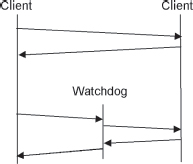
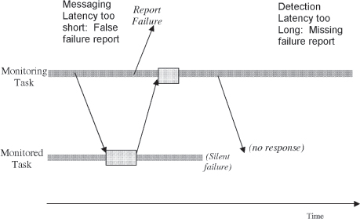
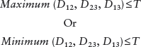

**[Figure 28](#c05.htm#fig5.28a)** Detection patterns language map(检测模式语言图)

[Figure 28](#c05.htm#fig5.28) contains one possible language mapping for the patterns found in this chapter.

> 图 28 包含本章发现的模式的一种可能的语言映射。

The patterns in this chapter aid the detection of errors and failures. When errors are detected they must be isolated and kept from spreading. The capability to isolate errors to specific units is possible once the UNITS OF MITIGATION (1) have been defined. FAULT CORRELATION (12) pinpoints and identifies the location of the fault by grouping and associating errors. ERROR CONTAINMENT BARRIER (13) discusses the detection and containment of errors. COMPLETE PARAMETER CHECKING (14) describes the most thorough way of preventing errors from passing through the boundaries between entities in the software design. This pattern advocates completely checking every value exchanged by the system, both internally and externally. If any are found to be outside the expected boundaries, or outside the boundaries of what is known in advance about the system, then an error is inferred.

> 本章的模式**有助于检测错误和故障**。
>
> - 当检测到错误时，必须将其隔离并防止其传播。
> - **一旦定义了缓解单元(1)，就可以将错误隔离到特定单元。**
> - 故障相关(12)将故障精确定位并识别故障位置，通过分组和关联错误。
> - 错误隔离屏障(13)讨论了检测和隔离错误的方法。
> - 完整参数检查(14)描述了防止错误从软件设计中的实体之间传递的最彻底的方法。该模式建议完全检查系统之间交换的每个值，包括内部和外部。如果发现任何值超出预期边界或超出系统已知边界，则推断出错误。

The next collection of patterns is used to detect whether elements of execution (processes, tasks, threads, processors) have stopped working, Watchdogs have been used for many years in microcontroller-based systems. These systems have a processing element that acts strictly as the Watchdog element. This Watchdog will initiate a system reset to restart the microcontroller if it detects an anomaly. In systems built of parts larger than microcontrollers, Watchdog elements are enhanced by software components that oversee the monitoring. The Watchdog becomes one of the tools at the disposal of the monitor. The basic principle of a Watchdog, which is to have one element monitor the behavior of another, is found in several of the patterns in this chapter. SYSTEM MONITOR (15) talks about adding a task to the system that is in charge of monitoring whether the other parts are working. HEARTBEATS (16) is a key mechanism employed for this purpose. Information that a task is functioning normally can be sent as part of the ACKNOWLEDGEMENT (17) of routine communications. In some cases the best way to check that tasks are functioning is to implement a WATCHDOG (18), which is a monitor that watches to see that a task is alive by the kind of interaction that it has with its peers.

> 下一组模式用于**检测执行元素(进程、任务、线程、处理器)是否已停止工作**，**看门狗**已经在基于微控制器的系统中使用多年。这些系统**有一个处理元素，其专门充当看门狗元素**。如果检测到异常，该看门狗将启动系统重新启动微控制器。在比微控制器更大的系统中，看门狗元素**由软件组件增强，该组件负责监控**。看门狗成为监视器可以使用的工具之一。本章中的几个模式都发现了看门狗的基本原理，即让一个元素监视另一个元素的行为。系统监视器(15)谈到了在系统中添加一个负责监视其他部分是否正常工作的任务。心跳(16)是实现这一目的的关键机制。发送任务正常运行的信息可以作为常规通信的确认(17)的一部分。在某些情况下，检查任务是否正常工作的最佳方法是实现看门狗(18)，这是一种监视器，通过它与其同行的交互来查看任务是否存活。

Many detection techniques rely on some sort of threshold to detect an error. It is important to set a REALISTIC THRESHOLD (19) to avoid falsely reporting errors.

> **许多检测技术依赖于某种阈值来检测错误。设定一个现实的阈值很重要，以避免错误报告。**

Impending failures of the system's performance must also be detected. Many different metrics are available within systems that are usable to detect this. EXISTING METRICS (20) discusses not adding new metrics but instead using ones that already exist.

> 系统性能**即将失败的情况也必须被检测出来**。系统中提供了多种可用于检测此情况的指标。现有指标(20)讨论的不是添加新的指标，**而是使用已有的指标。**

When the system has REDUNDANT (3) elements, sometimes it is necessary to perform VOTING (21) to determine which is producing the correct result.

> **当系统有多余(3)个元素时，有时需要进行投票(21)来确定哪个产生正确的结果。**

> [!NOTE]
> 这里提到的**选举算法**相关的内容

Fault tolerant systems are made more reliable through ROUTINE MAINTENANCE (22) functions. By periodically identifying errors and correcting faults the system's fault tolerance will be increased. When there are REDUNDANT (3) elements the technique of ROUTINE EXERCISES (23) to alternate which of the redundant elements is active and which is standby is very effective.

> 故障容错系统通过**定期维护(22)**功能变得更加可靠。**通过定期识别错误并纠正故障，系统的故障容忍性将会增加。当有冗余(3)元素时，定期练习(23)来交替激活哪个冗余元素并保持备用状态的技术非常有效。**

> [!NOTE]
> 这里提到了对于多个冗余元素应该怎么处理
> 不是，简单的作为单独的备份，但是也不是完全出于负载均衡的考虑
> 提到了定期维护的概念：**定期练习**

To ensure that data that is used by the system is correct, ROUTINE AUDITS (24) are performed. The audits will correct any data that they find erroneous. CHECKSUMS (25) are a useful technique to detect data errors.

> 为了**确保系统使用的数据是正确的，定期审计(24)**进行。审计将纠正任何他们发现的错误数据。**校验和(25)**是检测数据错误的有用技术。

> [!NOTE]
> 这里提到的定期审计，应该就是类似“锁步”的概念，是**软件层面的锁步**

Two of the patterns, RIDING OVER TRANSIENTS (26) and LEAKY BUCKET COUNTER (27) discuss creating a threshold for an allowable number of errors. If the errors are permanent the threshold will be very low, probably one. If the errors are transients then a larger number may be tolerated before the system decides that recovery actions are needed.

> 两种模式，RIDING OVER TRANSIENTS(26)和 LEAKY BUCKET COUNTER(27)讨论了设定一个允许错误数量的阈值。如果**错误是永久性的**，那么阈值会非常低，可能是 1。如果**错误是瞬态**的，那么在系统决定采取恢复措施之前可以容忍较大数量的错误。

> [!NOTE]
> 这里给出对于错误划分的依据，瞬态还是永久！
> 这一点还是值得参考的

# 12. Fault Correlation

... An error or a failure has been detected. **There are a number of potential causes for it.**

> 出现了错误或失败。可能有多种原因。

In order to be more fault tolerant the system has been designed to fail silently when it fails. As a result, all that is known when the failure is first detected is that it has failed. In order to process an error or failure the system needs to identify the error, and what fault caused the error.

> 为了**更加容错，系统被设计成在失败时静默失败**。因此，在首次检测到失败时所知道的就是它已经失败了。为了处理错误或失败，系统需要识别错误以及是什么故障导致了错误。

``{=html}

> [!NOTE]
> 感觉对应到实际的应用技术上应该是 `try {...} catch {...}`，还是 `if {...} else {...}`

**What fault is activating?**

> **什么故障正在激活？**

Errors can be caused by any of several faults. Particular errors keep occurring. The system has been RIDING OVER TRANSIENTS (26) but the system needs to make certain that the current error is the one that it is interested in ignoring. If it is a different error then the system should initiate error processing.

> 错误可能由多种原因引起。特定错误不断发生。**系统一直在忽略瞬态(26)，但系统需要确定当前的错误是它要忽略的错误。** 如果是另一个错误，系统应该启动错误处理。

> [!NOTE]
> 系统应该判断错误的种类？！

What has the error done? Has execution stopped? If so, what capabilities are no longer available? What was the size of the stack at the time of the error? Were logs collected? What data is incorrect? Is it frequently changing data or is it a constant?

> - 错误发生了什么？
> - 执行停止了吗？
> - 如果是，哪些功能不再可用？
> - 在发生错误时栈的大小是多少？
> - 日志被收集了吗？
> - 哪些数据不正确？
> - 是经常变化的数据还是恒定的？

> [!NOTE]
> 需要判断错误引发的一系列思考
> 这些思考问题的角度还是挺有价值的

The system should correct the actual fault that has caused the problem. Too large a recovery will impact too much of the system. Identification of the fault allows targeted recovery actions to be taken. \[CBF+04\]

> 系统应该纠正导致问题的实际故障。恢复过大会影响系统太多。确定故障可以采取有针对性的恢复措施。\[CBF+04\]

Fault tolerance is about handling the unanticipated and undetectable errors that occur during execution. But as faults are being removed from the system during design and test, different common errors will have been uncovered, isolated, and corrected. The clues to error types, or their 'signatures', learned during these activities help you know what kinds of errors are likely to occur during normal execution.

> **容错性是关于处理在执行过程中发生的意料之外和难以检测的错误。** 但是，随着设计和测试过程中的故障被消除，不同的常见错误将被发现、隔离和纠正。在这些活动中学习到的错误类型或其"签名"的线索可以帮助您知道在正常执行期间可能发生哪些类型的错误。

For example, if a large and complex system has a large number of off-by-one errors uncovered during test, the error signature found is that loops are traversed one too many times. This identifies a flaw in the execution limits of ranges or conditional checks. Since a large number of different occurrences were found during testing, there is a high probability that not all of them were uncovered during test and that some will be present in the production system. The system should be prepared through the addition of detection mechanisms that will find this kind of error. And the system should be programmed to correctly process off-by-one errors when they occur. In order to do this the system must be able to detect the errors, and determine that they are of the type 'off-by-one'.

> 例如，如果一个大型且复杂的系统在测试中发现了大量的偏移错误，那么发现的错误签名是循环被多次遍历。这指出了范围或条件检查的执行限制中的缺陷。由于在测试中发现了许多不同的发生情况，因此很有可能测试中没有发现所有的错误，而有些错误会出现在生产系统中。系统应该通过增加检测机制来准备好，以便能够发现这种错误。系统应该被编程以正确处理发生的偏移错误。为了做到这一点，系统必须能够检测出错误，并确定它们是"偏移"类型的。

The error must be masked so that the fault is tolerated. Identifying precisely what fault created the error is needed for treatment, but not for error processing. Similar errors can be given similar error processing treatment.

> 错误必须被掩盖，以便容忍这个故障。确切地确定是什么故障引起了错误是必要的治疗，但不是用来处理错误的。类似的错误可以被给予相似的错误处理治疗。

For example, normal execution should resume after a failure in a REDUNDANT (3) unit. After the error is detected and identified to be a failing component, the fastest method of recovery is to FAILOVER (36) to the redundant unit. Treating the fault that produced the failure can be deferred until after application execution has been resumed on the standby unit.

> 例如，**在冗余(3)单元出现故障后，正常执行应该恢复。在检测到错误并识别为故障部件后，恢复的最快方法是切换到冗余单元。可以推迟处理导致故障的故障，直到备用单元上的应用程序执行已经恢复。**

> [!NOTE]
> 这里提到了对于冗余元素的使用，是为了能够快速的切换，以便为处理故障提供时间
> 这里倒是给出一个更深入的层次，之前只是考虑对于冗余元素的一个切换，这里还提到了在切换到冗余元素之后，可以**继续对于问题的元素进行故障诊断**，判断类型；这里就有比较多的事情可以做了，如果是能够引发问题的未知错误，应该采取一些有效的手段；尤其是问题出现在节点本身上，即切换了冗余节点应该还是会复现，这样的话更应该采取有效的措施。

Errors can occur in clumps. One fault triggers an error that in turn triggers other errors. Failure can be prevented ideally by processing the initial fault that started the chain of errors. Some errors will come in groups by their nature affecting multiple instances of a resource close together. Again it is better to process the error through a correcting, recovery technique rather than mitigating each of the many instances.

> **错误可能会成簇发生。一个故障会引发一个错误，反过来又会引发其他错误。** 理想情况下，可以通过处理最初引发错误链的故障来防止失败。有些错误会按照其性质组成群体，影响资源的多个实例。同样，最好的办法是通过纠正和恢复技术来处理错误，而不是缓解许多实例中的每一个。

When several errors occur close together in time, they might be related. In deciding what faults the system has, the multiple errors should be used to triangulate the location of the error.

> **当几个错误在短时间内发生，它们可能有关联。** 在决定系统有什么故障时，应该使用多个错误来确定错误的位置。

> [!NOTE]
> 这个是对整个系统的功能有相应的梳理，感觉是能够对应到之前对于功能安全问题考虑中的各种功能树，故障网络
> 这个应该是是更大的方案考虑了

When data errors are detected the correlation involves the identification of related data that also needs to be checked. The CORRECTING AUDITS (2) can assist with the association through Audit Implicator Indices that link related structures together as well as correct the data.

> 当检测到数据错误时，相关性涉及识别需要检查的相关数据。审计纠正(2)可以通过审计暗示指数将相关结构联系在一起，并纠正数据。

Consider two examples: is missing a HEARTBEAT (16) message the result of a failed monitored task or is it because the communications link did not correctly convey the message? For an internet example, is the failure of the web page request due to a network failure or a failure of the web server? Whenever errors are suspected in peers that are at the other end of a communications link from the detection point, communications failures must be added to the list of potential errors.

> 考虑两个例子：缺少心跳(16)消息是监控任务失败的结果还是通信链路没有正确传达消息？对于互联网例子，网页请求失败**是因为网络故障还是**网页服务器故障？每当在检测点与通信链路另一端的对等体中**发现错误时，必须将通信故障添加到潜在错误列表中**。

The system can be designed to grow its ability to detect and process errors through Bayesian learning techniques. The system can maintain information about the errors that are detected and the successful processing steps and learn how to recognize and process errors that were not covered in the initial design.

> 系统可以**设计成通过贝叶斯学习技术增强其检测和处理错误的能力**。系统可以保留**有关检测到的错误和成功处理步骤的信息**，并学习如何识别和处理最初设计中未涵盖的错误。

> [!NOTE]
> 好家伙，这里就直接上 AI 了？！
> 上专利？！！

Therefore,

**Look at the unique signature of the error to sort it into the fault category for which error processing steps are known, `<a href="#c05.htm#fig5.29" id="c05.htm#fig5.29a">`{=html}Figure 29`</a>`{=html}.**

> 看看错误的独特签名，将其分类到已知的故障类别中，请参见`<a href="#c05.htm#fig5.29" id="c05.htm#fig5.29a">`{=html}图 29`</a>`{=html}。

**[Figure 29](#c05.htm#fig5.29a)** Sorting errors into related groups

``{=html}

Once an error has been characterized by its signature an ERROR CONTAINMENT BARRIER (13) can be established to prevent it from spreading.

> 一旦**错误被其签名特征化，就可以建立错误隔离屏障(13)**以防止其扩散。

> [!CHATGPT]
> "/hirain/fault_20230417.md"
> 就相关的概念进行了讨论

The system will know the most effective means to handle the error because it has been grouped into a set for which the best actions are known. The patterns in Chapter 6 and Chapter 7 describe techniques for error processing, ranging from MARKED DATA (56) for data errors to altering execution sequence through ROLLBACK (32) and RESTART (31). When the correlation identifies the error as being related to overload, OVERLOAD TOOLBOXES (42) will help the system determine the correct actions to take.

> 系统将知道最有效的方式来处理错误，因为它已被分组到一组，其中最佳行动已知。**第 6 章和第 7 章中的模式描述了错误处理的技术**，从数据错误的标记数据(56)到通过回滚(32)和重新启动(31)改变执行序列。**当相关性识别出错误与负载相关时，负载工具箱(42)将帮助系统确定正确的行动。**

> [!NOTE]
> 负载工具箱？！

The correlations and supporting data should be shared via the FAULT OBSERVER (10). This allows people, through MAXIMIZE HUMAN PARTICIPATION (6), to take preventive actions or to schedule ROUTINE MAINTENANCE (22) to correct the fault. ...

> 应该通过故障观察器(10)共享相关性和支持数据。这使得人们能够通过最大化人力参与(6)采取预防措施或安排例行维护(22)来纠正故障。...

# 13. Error Containment Barrier

... The system is designed to perform as well as it can in the presence of faults. The necessary fault tolerance framework elements are in place. The software knows that it is supposed to be within a highly available system. The mechanisms for detection of faults have been designed into the system. The system is designed as a collection of UNITS OF MITIGATION (1).

> 系统设计旨在在存在故障的情况下尽可能地发挥最佳性能。必要的容错框架元素已经就绪。软件知道它应该处于**高可用系统**中。**故障检测机制已经设计到系统中。该系统被设计为一系列缓解单元(1)。**

> [!NOTE]
> 按照这个概念来看，我目前在做的工作就是“高可用系统”！

Errors in one part of the system, or in one computation, can spread and cause errors or failures at other places in the system. Errors spread through several mechanisms: erroneous messages, corrupted (incorrect) pooled memory or actions based on the results of other incorrect actions.

> 错误可以在系统的一个部分或一次计算中传播，并在系统的其他地方造成错误或失败。错误通过几种机制传播：错误的消息，损坏的(不正确的)池内存或基于其他不正确操作结果的操作。

``{=html}

**What is the first thing that the system must do when it detects an error?**

> **当系统检测到错误时，它首先要做什么？**

> [!NOTE]
> do what

Unless something is done the error will continue through the system forever or until it eventually causes a failure that results in termination. This is the nature of errors.

> **除非采取行动，否则错误将永远继续在系统中，直到最终导致失败并导致终止。这就是错误的本质。**

The effects of an error cannot always be predicted in advance. Nor can all the potential errors be predicted. Software reliability modeling, verification techniques, fault prevention techniques, and software quality efforts reduce the number of faults present in the system. The system must be adaptable and able to handle unanticipated errors. This capability must be put in place during the design phase. The capabilities require conscious preparation. This is the Fault Tolerant Mindset.

> **错误的影响并不总是能够提前预料到。也不是所有的潜在错误都能够预料到。** 软件可靠性建模、验证技术、故障预防技术和软件质量努力减少系统中存在的故障数量。**系统必须具有可适应性，并能够处理意外的错误。这种能力必须在设计阶段就放置好。这些能力需要有意识的准备。这就是容错心态。**

Fault tolerance is living with faults. The system must find a way to ignore or mask the faults in order to tolerate them. But some ways of masking errors result in their still being propagated throughout the system. If the system does not just 'ignore' errors, what can it do? One option is to cry 'HELP' and terminate. But this does not fit into the framework of fault tolerance within the system (see MINIMIZE HUMAN INTERVENTION (5)). Sometimes terminating is the only practical option, for example when an error is detected that makes the system unsafe.

> **容错性就是忍受缺陷的存在。** 系统必须找到一种方法来忽略或掩盖这些缺陷以实现容错性。但是**有些掩盖错误的方法会导致错误仍然在整个系统中传播。如果系统不仅仅是"忽略"错误，它还可以做什么？**一种选择是喊"救命"并终止。但是这不符合系统容错性的框架(见最小化人为干预(5))。有时终止是唯一的实际选择，例如当检测到一个使系统不安全的错误时。

> [!NOTE]
> 这里提到，终止是使系统不安全时错误的唯一选择，也就是说，对于冗余备份中主从节点的切换是最后没有办法的办法！
> 就是说，应该添加一些更为通用的处理手段才可以较为完善。

Another option is to take steps to mitigate the error. This is not always possible though; it depends on the nature of the error and the fault. Some errors, particularly data errors, can be mitigated by means such as CORRECTING AUDITS (2).

> 另一种选择是采取措施来减轻错误。不过，这并不总是可能的，这取决于错误的性质和故障。一些错误，特别是数据错误，可以通过诸如审计纠正(2)等方式来减轻。

An effective way of mitigation for some errors is to mark them for all other parts of the system to know that they are erroneous. This eliminates the need for the other parts of the system to detect the errors; they can concentrate on taking the steps appropriate for them to mitigate them. This is discussed in MARKED DATA (56).

> 一种有效的缓解错误的方法是将它们标记给系统的其他部分，以知道它们是错误的。这样可以消除系统其他部分检测错误的需要；它们可以专注于采取适当的步骤来缓解它们。这在标记数据(56)中有所讨论。

Sometimes the errors cannot be corrected automatically, but since you chose to MINIMIZE HUMAN INTERVENTION (5) the system will try automatic recovery. In these cases error recovery steps must be taken to move the system to an error free state.

> 有时错误无法自动纠正，但由于您选择最小化人工干预(5)，系统将尝试自动恢复。 在这些情况下，必须采取错误恢复步骤以将系统移动到错误免费状态。

Errors move, or propagate, from component to component in the system unless something is done to stop them. In software the barrier is the boundary of the UNIT OF MITIGATION (1) that contains the fail-silent component. Failing silently implies that any error that is detected within a UNIT OF MITIGATION presents a silent interface to other parts of the system. The actual internal errors are masked to provide only an indication of silent failure. When this is detected the signs and symptoms of the detected error are sent to FAULT CORRELATION (12) which analyzes the error providing guidance to the techniques most useful to process the error.

> **除非采取措施阻止，否则错误会从系统的一个组件传播到另一个组件。** 在软件中，屏障是包含安静失败组件的缓解单元(1)的边界。安静失败意味着在缓解单元中检测到的任何错误都会向系统的其他部分提供一个安静的接口。实际的内部错误被掩盖，仅提供安静失败的指示。当检测到时，将检测到的错误的症状和符号发送到故障关联(12)，该关联分析错误，为处理错误提供最有用的技术指导。

> [!NOTE]
> 这里一直提到了 “边界”，结合上面提到的，除了直接切换节点之外，框架应该提供 “边界” 的能力；
> 这点需要从用户给出的数据结果上来考虑，因为框架是没有办法知道用户的处理策略的，就不能对用户的逻辑进行设置边界？！
> 或者是否可以主动设置一些 API 让用户设计出有边界的框架，这点应该是可取的，比如有 if 逻辑，框架会协助用户添加 else 的逻辑。
> 这个可能就比较复杂了，当前这个迭代还是对直接的节点切换进行考虑。

Therefore,

**The system should isolate the error to a UNIT OF MITIGATION (1). Stop the flow of errors from one part to another with a barrier impervious to errors, QUARANTINE (28), and initiate either error recovery or error mitigation, see `<a href="#c05.htm#fig5.30" id="c05.htm#fig5.30a">`{=html}Figure 30`</a>`{=html}.** Invoke appropriate notification, logging, mitigation, and recovery functions. Do not leave the error unprocessed.

> 系统应**将错误隔离到一个缓解单元(1)**。使用一个对错误不可渗透的屏障(隔离)(28)阻止错误从一部分流向另一部分，并启动错误恢复或错误缓解，请参见`<a href="#c05.htm#fig5.30" id="c05.htm#fig5.30a">`{=html}图 30`</a>`{=html}。调用适当的通知、记录、缓解和恢复功能。不要将错误未处理。

**[Figure 30](#c05.htm#fig5.30a)** Take actions when an error is encountered

> 当遇到错误时，采取行动(参见图 30)

In order to be able to contain errors the system must be able to detect them. Additionally it must have the ability to decide what course of action is the safest given the circumstances of the error. Detection as close to the fault in either structural proximity or time is the best case scenario.

> 为了能够包含错误，系统必须能够检测它们。此外，它必须有能力根据错误的情况决定采取何种行动是最安全的。最好的情况是，在结构上接近或时间上接近故障的情况下检测到它们。

``{=html}

The error should be isolated and contained by techniques discussed in Chapter 6 and Chapter 7 that recover from an error or mitigate the effects of the error. COMPLETE PARAMETER CHECKING (14) provides a means to detect that an error has not been contained.

> 错误应该通过第 6 章和第 7 章讨论的技术隔离和控制，以恢复出错或减轻错误的影响。**完整的参数检查(14)提供了一种检测错误是否被控制的方法。**

Faulty hardware components can be isolated by activity bits that indicate whether a particular component is in service, or in error processing, or in some other state. When isolating faulty hardware it is very important to prevent the faulty component from spreading malicious information across the system, the so-called babbling problem. A way to address this is to isolate network connections (or other communication links) to the faulty component. MARKED DATA (56) describes a method of marking erroneous information to contain its future use. ERROR CORRECTING CODES (57) and CORRECTING AUDITS (2) discuss ways of correcting erroneous information. The collection of patterns that includes ROLLBACK (32), ROLL-FORWARD (33) as well as RETURN TO REFERENCE POINT (34) and RESTART (31) discuss ways of transitioning to an error free state.

> 故障硬件部件可以通过活动位来隔离，这些活动位指示特定部件是处于服务状态，错误处理状态，还是其他状态。
>
> - 隔离故障硬件时，非常重要的是防止故障部件将恶意信息传播到系统中，即所谓的**唠叨问题**。解决这个问题的一种方法是隔离网络连接(或其他通信链路)到故障部件。
> - **标记数据(56)**描述了一种将错误信息标记以限制其未来使用的方法。
> - 纠错码(57)和校验(2)讨论了纠正错误信息的方法。包括回滚(32)，滚动前进(33)，返回参考点(34)和重新启动(31)在内的模式集讨论了转换到无错误状态的方法。

When the error is related to an overload of work requests, OVERLOAD TOOLBOXES (42) should be used to identify which mitigation technique will be the most appropriate to contain and mitigate the effects of the overload. ...

> 当错误与工作请求超载有关时，应使用**超载工具箱(42)**来确定哪种缓解技术将是最适合控制和缓解超载影响的。...

> [!NOTE]
> 这里给出了很有价值的参考点，错误可能与请求相关，或者说错误按照导致的源头可以进行划分
> 如果具体就是和请求超载相关的时候，即使是切换了已经连接超时的节点，新的节点也会因为同样的问题产生错误；
> 比较合理的处理方式应该是使用多个备份的节点一起接收？或者是动态调整接收的请求，除了设置合理的超时时间外，还要限制接收的请求。

# 14. Complete Parameter Checking

... You want to detect errors before they cause a problem. Faults and errors result in the system being unavailable. They also cause the system's functions to be erroneous, making the system undependable.

> 你想在错误引起问题之前检测错误。故障和错误会导致系统不可用。它们也会导致系统功能出错，使系统不可靠。

Errors in one part of the system propagate to other parts of the system. If the errors are incorrect computational results, then errors can compound as they move through the system. If the errors are incorrect actions, they can trigger further erroneous actions.

> 系统的一部分出错会传播到其他部分。如果错误是不正确的计算结果，错误会随着系统的传播而加重。如果错误是不正确的行动，它们可能会引发进一步的错误行动。

> [!NOTE]
> 这一点一直在被提及，就是阻止错误的扩散。
> 更大点的视角来讲，处理错误应该有个流程，粗略的来说，可能是：
> 先发现问题，评估问题，阻止问题，处理问题，等等
> 以这个逻辑，应该可以搭建出来一个小一些子框架，专门是用来处理冗余故障
> 这样，之后遇到什么新的故障检测或者回复的需求，可以从框架的角度进行考虑和设计就比较方便了
> 这点作为优先考虑设计的内容！

The system's requirements are exacting. The dependability of the system is important. Not only must the system be available, it must also be correct. The system is performing an application that has a high cost associated with failure, for example the system is safety-critical. Another example is in critical functions of the system that are instrumental to all other functions completing correctly, such as a task scheduler in a real-time system. In this last context the individual tasks that are scheduled can fail without adverse system consequences, but all of the tasks must be given an opportunity to execute which requires the scheduler to be operational.

> 系统的要求非常严格。**系统的可靠性很重要。系统不仅要可用，还必须是正确的。** 该系统执行的应用程序具有高成本的失败风险，例如系统是安全关键型的。另一个例子是系统中对所有其他功能完成正确至关重要的关键功能，例如实时系统中的任务调度程序。在最后的情况下，调度的单个任务可能会失败而不会导致系统出现问题，但是所有任务都必须有机会执行，这就要求调度程序可以正常运行。

> [!NOTE]
> 从系统的层面来讲，这里提到了两个设计的点：
>
> - 可用；
> - 正确。

The other patterns in this book are ensuring that the dependable components are executing through the use of a SYSTEM MONITOR (15), possibly with HEARTBEATS (16) or a WATCHDOG (18) function. CORRECTING AUDITS (2) and CHECKSUMS (25) are used to ensure that data stored in memory is correct.

> - **其他模式在本书中是确保可靠组件通过使用系统监视器(15)执行**，可能使用**心跳(16)或看门狗(18)**功能。
> - 校正审计(2)和校验和(25)用于确保存储在内存中的数据是正确的。

> [!NOET]
> 这里一直提到使用这两个技术手段，并且也是项目中确实使用
> 除了我考虑的使用 dds 中的 QoS 策略，应该对这两种技术有了解
> 或许可以结合在一起使用

It takes time to detect an error. The further from the point of error, when a fault activates, that detection occurs, the larger window in which it could fail, or could propagate to other parts of the system.

> **这需要时间来检测错误。越是远离错误发生点，当故障激活时，检测才会发生，可能失败或传播到系统的其他部分的窗口就越大。**

> [!NOTE]
> 具体不是特别理解，但是总的意思应该是尽可能的缩短故障检测时间吧

``{=html}

**How can the time from fault activation to error detection be minimized?**

> 如何将从故障激活到错误**检测的时间最小化？**

The fastest option is to check for error at every operation that the system conducts. An example is an active-active REDUNDANT (3) pair of processors that are operating in lock-step and comparing results on every basic operation, and reporting an error when there is a mismatch. This is how the central processors in the 4ESS™ Switch interact. This tight coupling and rapid detection works best for hardware failures, and not as well for software failures because the two processors are executing the same program and will both compute an erroneous result from the same incorrect input; and since the results matched in each processor the error will not be detected.

> 最快的选择是在系统进行的**每一个操作中检查错误**。
> 一个例子是一对(3)可活动的**冗余处理器，它们以锁步方式运行**并在每个基本操作上进行比较，并在发生不匹配时报告错误。这就是 4ESS™ 交换机中的中央处理器的工作方式。这种紧密耦合和快速检测最适合硬件故障，而不适合软件故障，因为两个处理器正在执行相同的程序，并且都会从相同的错误输入中计算出错误的结果；由于每个处理器的结果相符，因此错误不会被检测到。

Other systems, such as the Space Shuttle computers, compute results simultaneously but only compare their end results \[Skl76\], frequently by VOTING (21). This relaxation of timing allows different, REDUNDANT (3) software implementations to be used to compute the results. Detection is still fast, but it is slower than lock step.

> 其他系统，如**航天飞机计算机，可以同时计算结果，但只有通过投票(21)比较它们的最终结果\[Skl76\]**。这种时间的放松使得可以使用不同的冗余(3)软件实现来计算结果。**检测仍然很快，但比锁步慢。**

> [!NOTE]
> 这里列举出硬件中的锁步方式和软件总的投票比较方式！
> 所以，**投票就是类似硬件中锁步**的技术手段了！

Both of these examples, the 4ESS™ Switch and the Space Shuttle, rely both on REDUNDANCY (3) and the frequent checks and comparisons of low-level results. When REDUNDANCY is not present in the system the comparisons can still occur.

> 两个例子，4ESS™ 交换机和航天飞机，都依赖冗余(3)和对低级结果的频繁检查和比较。**即使系统中没有冗余，也可以进行比较。**

> [!NOTE]
> 这里提出一个很好的问题，没有冗余节点，是否可以进行比较，以保证结果的正确性
> 因为通过冗余的方式对系统的计算资源是有消耗的
> 如果可以对节点计算的结果的特征进行提取，可以**充要的给出正确和错误的判断方式**，或许是个很好的手段！

There can be many things that can be checked even without redundant results to compare. You know at design time the acceptable ranges of values for function/method arguments and also for basic computations. The system can use these attributes to detect errors. An example is to check whether the index to an entry being removed from a buffer is within the acceptable range of buffer indices.

> 可以检查许多事情，即使没有多余的结果可供比较。您知道**设计时函数/方法参数以及基本计算的可接受范围**。系统可以使用这些属性来检测错误。例如，检查从缓冲区中删除的条目的索引是否在缓冲区索引的可接受范围内。

Any checking that is done results in increased reliability. Arguments passed into a function or method, the results returned from functions and methods, and the results of computations can all be checked.

> **任何检查都会增加可靠性。** 传入函数或方法的参数，函数和方法返回的结果，以及计算的结果都可以检查。

> [!NOTE]
> 以函数为单位，从计算的输入输出的角度进行全面的检查，可以保证故障的发生处理
> **这个角度来看是可以由框架来提供检测的能力！！**

The time between fault activation and their detection decreases with the frequency of checks, as the checks get closer together temporally and spatially. The trade off is that it reduces performance, since all the extra checks take time. Determining the correct checks to add takes development time that could be spent on other things, and these add to the maintenance requirements of the system.

> **随着检查频率的增加，故障激活到检测的时间会减少。** 这种交易的代价是性能会降低，因为所有的额外检查都需要花费时间。确定要添加的正确检查需要花费开发时间，这些时间可能可以用在其他事情上，并且会增加系统的维护需求。

> [!NOTE]
> 上面这个技术手段是从“减少检测时间”的角度出发的！
> 这里也提到了缺点，就是性能会降低，但是相比直接进行冗余节点的备份方式进行的话，应该还是小一些的吧
> 这样来说，系统对于节点备份的粒度就多样了，对这个角度是从系统备份上来说，不是前面的故障或者错误的处理
>
> ---
>
> 不知道这点和系统的实时性上是不是有出入，但是实时性其中也是包含了确定性的部分，应该是在合理的时间范围内应该是给提供的吧
> 或者给出一个动态的开关，如果系统的负载运行，会执行检测；反之不会。这样可以做到动态平衡，应该不算是增加了不确定性吧，因为系统的负载较高的时候，如果还进行检测，相对的是会增加不确定性？！还是说，系统本身设计之初就必须设计好一定不会有高负载
> 在 windriver 的培训课上，老师也是说过，这个实时性一定是要 CPU 有一定

The checks can be put inline with the actual processing that uses the data being checked, but that can lead to confusion. In many cases the checks can be reused among a number of operations (in this example, for the other arithmetic computations). Putting the checks in a separate place, possibly a library, can make maintenance easier. Since it is the elementary operations that are being checked, a separate function or method for each elementary operation can be used to perform all the necessary checks.

> 检查可以与使用被检查的数据的实际处理放在一起，但这可能会引起混乱。在许多情况下，检查可以在许多操作之间重复使用(在本例中，对于其他算术计算)。将检查放在一个单独的地方，可能是一个库，可以使维护更容易。由于正在检查的是基本操作，因此可以使用一个单独的函数或方法来执行所有必要的检查。

Basic operations of the system, even as simple as division, can be checked to ensure that it was performed correctly. Consider:

> 系统的基本操作，即使是像除法这样简单的操作，也可以检查以确保操作是正确的。考虑一下：

Partial input validation would check that B and C are within the general ranges that are appropriate for the operation. That A is a valid receiver of the information is also checked. Strict typing, either by coding standard or by language support, can help to make sure that operations are on appropriate types of data.

> 部分输入验证会检查 B 和 C 是否在适合操作的一般范围内。还会检查 A 是否是有效的信息接收者。严格的类型检查，无论是通过编码标准还是语言支持，都可以帮助确保操作是在适当类型的数据上进行的。

To completely check the input in this case will require this additional check be made so that overflow and underflow won't result. (The IEEE Not A Number standard is discussed in MARKED DATA (56). This is not meant as a pattern language linkage between these patterns.) In this example, the absolute value of C is checked to ensure correct operation by both the common two's compliment and the more rare one's compliment processors.

> 在这种情况下，要彻底检查输入需要进行额外的检查，以防止溢出和欠收。(IEEE 非数字标准在 MARKED DATA(56)中讨论。这并不意味着在这些模式之间建立模式语言链接。)在这个例子中，检查 C 的绝对值以确保常见的二进制补码和更少见的一进制补码处理器的正确操作。

> [!NOTE]
> 感觉上面提到的一些内容像是 ROS2 代码设计中尤其是对于 QoS 的校验时候的设计，里面有各种各样的检查。
> 但是可能也不太一样，这个更像是针对运行时候的错误检查
> ROS2 中的像是程序加载运行阶段的检查，以确保

Base the decision to include a check on these considerations: What is the probability of error within the entity that is checked? How critical are any errors that occur within that entity? If errors are likely or errors are critical perform a check.

> 根据以下考虑因素决定是否进行检查：
>
> - 检查实体中可能出现的错误的概率是多少？
> - 出现的错误有多严重？
> - 如果出现的错误可能性大或者错误严重，则进行检查。

Some computations that a system performs are very expensive. When a less costly approximation is available, it can be used to check that the result of the expensive computation is reasonable.

> 一些系统执行的计算非常昂贵。当有更便宜的近似值可用时，可以用它来检查昂贵计算的结果是否合理。

Every method or function has assumptions about results of the operations it invokes. A check to validate that the assumptions are correct detects errors before they can spread.

> 每种方法或函数都对其调用的操作结果有所假设。检查以验证这些假设是正确的，可以在错误扩散之前检测到它们。

Programming by contract is a variation of the checking everything proposed by this pattern. A method or function has a 'contract' that specifies its interface and the obligations and benefits to both caller and called methods or functions. The obligations specify the preconditions that the caller must guarantee when making the call. This benefits the called function or method by ensuring that it receives correct, or at least not erroneous, inputs. The called function or method then guarantees that it will provide a result to its caller that is not erroneous. These contracts are implemented by using checks before and after the processing to ensure that both the input and the output of the method/function meet the contracted specification.

> 编程契约是检查这种模式提出的一切的变化。一个方法或函数有一个"合同"，指定其接口以及调用者和被调用者方法或函数的义务和利益。义务指定调用者在发起调用时必须保证的先决条件。这对被调用的函数或方法有利，因为它可以确保接收到正确的，或者至少不是错误的输入。被调用的函数或方法然后保证它将向其调用者提供一个不是错误的结果。这些合同是通过在处理之前和之后使用检查来实现的，以确保方法/函数的输入和输出符合合同规定。

Therefore,

**Perform frequent checks on data and operations to detect errors quickly and prevent errors from propagating to the rest of the system, `<a href="#c05.htm#fig5.31" id="c05.htm#fig5.31a">`{=html}Figure 31`</a>`{=html}.**

> 进行频繁的数据和操作检查，以快速检测错误并防止错误传播到系统的其他部分，`<a href="#c05.htm#fig5.31" id="c05.htm#fig5.31a">`{=html}图 31`</a>`{=html}。

**[Figure 31](#c05.htm#fig5.31a)** Check responses for correctness

When errors are detected, error processing should be initiated. The error should be reported to the FAULT OBSERVER (10).

> **当检测到错误时，应启动错误处理。应将错误报告给故障观察者(10)。**

``{=html}

These checks can be used in addition to REDUNDANCY (3) to increase dependability.

> 这些检查可以与冗余(3)一起使用，以增加可靠性。

Violations of any of the elementary operations indicate errors and error processing should begin.

> 违反任何基本操作都会导致错误，应该开始处理错误。

When data errors are detected the error should be reported to CORRECTING AUDITS (2) which will perform FAULT CORRELATION(12) to find, check, and correct related data. Many systems, such as the 5ESS® Switch, report on the output channel any violations of the basic checks. In this and other systems, these are called asserts. Asserts are frequently used during testing, but are useful during normal execution in moderation. In keeping with MINIMIZE HUMAN INTERVENTION (5) important information should not be lost in a flood of asserts.

> 当检测到**数据错误时**，应将错误报告给纠正审计(2)，以执行故障相关性(12)以查找、检查和纠正相关数据。许多系统，如 5ESS® 交换机，会在输出通道上报告任何违反基本检查的情况。在这些系统中，这些被称为断言。断言在测试期间经常使用，但在正常执行中适度使用也很有用。为了符合最小化人工干预(5)的要求，重要信息不应在断言的洪流中丢失。

A variation to detecting errors as described here and passing them to the error processing mechanisms is to mask the detected error into an acceptable result. For all the results generated by the system an 'acceptability envelope' is constructed. Layers of components surrounding the core modules will mask any errors coming out of the core by changing the error into something that is within the acceptability envelope. This technique can be used as a wrapper around already existing code that needs to be made more fault tolerant, or it can be used with a less well written code to mask its faults. \[Rin03\]. ...

> 一种变体是检测错误，如此处所述，并将它们**传递给错误处理机制，就是将检测到的错误变换成可接受的结果**。为系统生成的所有结果**构建"可接受范围"**。围绕核心模块的层层组件将通过将错误变换为可接受范围内的内容来掩盖来自核心的任何错误。这种技术可以用作**需要更加容错的现有代码的外壳**，或者可以用于编写较差的代码以掩盖其缺陷。\[Rin03\]...

> [!NOTE] > `围绕核心模块的层层组件将通过将错误变换为可接受范围内的内容来掩盖来自核心的任何错误。`
> 这种说法应该就是指可以通过**框架提供**的能力了

# 15. System Monitor(系统监视器)

... The system that you are designing must be available continuously. The design of the system is for it to exhibit crash failures, where it silently stops working. When part of it stops working, the system needs to find out quickly so that recovery techniques can be applied. A FAULT OBSERVER (10) is in use to coordinate information flow.

> 系统设计必须持续可用。系统的设计是为了表现出崩溃故障，它默默地停止工作。当它的某部分停止工作时，**系统需要迅速发现，以便应用恢复技术。** 使用故障观察器(10)来协调信息流。

You know the characteristics of the interprocessor and intraprocessor communications systems, such as paths and performance characteristics. You can add additional messages without harming system behavior by saturating the system.

> 你知道跨处理器和内处理器通信系统的特性，比如路径和性能特征。通过使系统饱和，你可以添加额外的消息而不会损害系统行为。

You are designing a computing system and the architecture contains a critical component that must always be operating.

> 你正在设计一个**计算系统，架构包含一个必须始终运行的关键组件**。

**How does one part of the system keep track that another part is alive and functioning?**

> **如何让系统的一部分跟踪另一部分是否存活且正常运行？**

The silent cessation of operations in a fail-silent mode or crash failure mode is the best for ensuring the system's continued operation because it minimizes error propagation. However, when a part of the system just stops, silently, the other parts might not realize, and they might not take the steps needed to keep the overall application working correctly. There must be some way of finding out if a needed part of the system is still working.

> 在失败安静模式或崩溃失败模式中，操作的静默中止最有利于确保系统的持续运行，因为它可以最小化错误传播。但是，当系统的一部分静默地停止时，其他部分可能没有意识到，他们可能不会采取必要的步骤来保持整个应用程序的正常工作。**必须有某种方法来查看系统中是否仍有必要的部分正在工作。**

If the part of the system that has a failure can safely inform the rest of the system about its state then error recovery can begin more quickly. However, stopping silently is preferred to the situation where the failing component is aggressive about telling the world that it has a problem. Blindly reporting the problem to everyone uses up networking bandwidth and processing power, especially since not all of the other parts of the system need to know.

> 如果**有故障的系统部分能够安全地向其他系统部分发出其状态信息，那么错误恢复就可以更快地开始。** 然而，沉默是最好的，而不是出现故障部分向世界宣告自己有问题的情况。**盲目的向所有人报告问题会消耗网络带宽和处理能力**，特别是因为其他系统部分不需要知道这些信息。

> [!NOTE]
> 这里针对错误报告的问题给出一些较为详细的考量！

An alternative is that the failing component just keeps 'looking' like it is working: Performing actions but not performing them correctly. This is a significant problem because it can fool everyone into thinking that the failing component is working correctly. This is a malicious failure and is very hard to detect.

> 另一种选择是，**失败的组件只是看起来像它正在工作：执行操作但没有正确执行它们。这是一个严重的问题**，因为它可以欺骗每个人认为失败的组件正常工作。这是一个恶意的失败，**很难检测到。**

You could rely on ACKNOWLEDGEMENT (17) messages. These are sent from one component to another in response to something happening. They work well when the system can't afford any messaging bandwidth or processing time to proactively monitor them. A problem is that acknowledgements require that there be an ordinary exchange of information that can stimulate the acknowledgements. If this routine exchange does not exist then acknowledgements will not solve the problem.

> 你可以**依靠确认(17)消息**。这些消息是在某件事发生时从一个组件发送到另一个组件的。当系统无法承担任何消息带宽或处理时间来主动监控它们时，它们表现得很好。问题是，确认**需要有一个普通的信息交换来激发确认**。如果这种常规交换不存在，那么确认就无法解决问题。

> [!NOTE]
> 这里提到的 **“确认消息” 的能力**是否也是可以由框架提供的一个能力呢
> 这里提到如果需要确认消息的能力，就需要监控者和被监控者之间有基本的信息交换的通道，如果这种信息交换是不存在的呢？
> 或者这种信息交换对系统的影响是多少
> 这个能力是否可以由框架直接提供，是可以的！需要设计

Another solution is to create a mechanism that will actively monitor whether part of the system has stopped working. It could be in the same processor or in a different processor. Choosing a location for this monitor is highly sensitive to the context. If the system is a simple one that must execute on a single processor and hardware support is unavailable, it must be located as a separate task on the same processor. If the system is a custom development with the option of adding a separate monitor hardware component, and the system's reliability requirements are stringent, then separate hardware is the correct choice.

> **另一个解决方案是创建一个机制，它可以主动监控系统的某个部分是否停止工作。** 它**可以在同一个处理器中，也可以在不同的处理器中。**选择监控器的位置取决于上下文。如果系统是一个简单的系统，必须在单个处理器上执行，而且没有硬件支持，那么它必须作为同一处理器上的**单独任务**定位。如果系统是一个可以添加单独的监控硬件组件的定制开发，而且系统的可靠性要求很严格，那么**单独的硬件**是正确的选择。

> [!NOTE]
> 依据上面的设计要求，这里需要对系统设计的监控能力，或者是 beatles 中已经有的 watch_dog 和 healthd 等机制有考量。

The monitoring capability can be distributed throughout the system in the most efficient way. Their activities must be coordinated and their responsibilities clearly defined to avoid gaps in coverage.

> **监控能力可以以最有效的方式分布在整个系统中。必须协调他们的活动，明确责任**，以避免覆盖范围的空缺。

> [!NOTE]
> 感觉这个能力确实应该是

An important part of the monitoring task's purpose is to watch for failures in parts of the system and report a problem if they stop working. The monitor can monitor one component of the system, or it could monitor several important components, taking the correct actions when one of them stops. WATCHDOGS (18) are useful to implement this.

> 重要的监控任务的目的之一是**监控系统的部分是否发生故障，并报告问题**。监控可以监控系统的一个组件，也可以监控几个重要的组件，当其中一个停止工作时采取正确的措施。**WATCHDOGS(18)可以用来实现这一点。**

Therefore,

**Create a Monitor to study system behavior, or the behavior of specific parts of the system to make sure that they continue operating correctly, `<a href="#c05.htm#fig5.32" id="c05.htm#fig5.32a">`{=html}Figure 32`</a>`{=html}. When the watched components stop, the monitor should report the occurrence to the FAULT OBSERVER (10) and initiate corrective action.**

> 创建一个监视器来研究系统行为或特定部分的行为，以确保它们继续正常运行，`<a href="#c05.htm#fig5.32" id="c05.htm#fig5.32a">`{=html}图 32`</a>`{=html}。当被观察的组件停止时，监视器应向故障观察器(10)报告发生情况，并启动纠正措施。

**[Figure 32](#c05.htm#fig5.32a)** A monitoring task

Any thresholds set should be REALISTIC THRESHOLDS (19).

> 设定的任何阈值都应该是现实的阈值(19)。

The task might be implemented as part of either the FAULT OBSERVER (10) or SOMEONE IN CHARGE (8). Alternatively it might be built as a separate element that is in close communication with them.

> 任务可以作为故障观察器(10)或负责人(8)的一部分实施。或者，它可以作为一个与它们紧密联系的独立元素来构建。

Once you've decided to include a SYSTEM MONITOR you must decide how long it should wait before sounding an alarm. REALISTIC THRESHOLD (19) discusses appropriate threshold times. RIDING OVER TRANSIENTS (26) and LEAKY BUCKET COUNTERS (27) discuss ways of making sure that the anomalous behavior that the system is seeing is an actual problem rather than a transient or intermittent problem.

> 一旦你决定包括一个系统监控器，你必须决定它在发出警报前应该等待多长时间。《实际阈值》(19)讨论了适当的阈值时间。《越过瞬变》(26)和《漏桶计数器》(27)讨论了确保系统所见到的异常行为是实际问题而不是瞬变或间歇性问题的方法。

The SYSTEM MONITOR can operate in several ways. If additional resources (processing and messaging both) can be spared for the monitoring tasks, HEARTBEAT (16) messages received from the monitored tasks are useful. If software and communications resources cannot be spared, perhaps specialized hardware can be added to the task from afar, just keeping track that it is behaving correctly. This is a WATCHDOG (18).

> 系统监视器可以以多种方式运行。如果有额外的资源(处理和消息)可以用于监视任务，接收到被监视任务发出的心跳(16)消息是有用的。如果没有软件和通信资源可以节省，**也许可以从远处添加专用硬件来完成任务，只要跟踪正确行为即可。这就是看门狗(18)。**

Now that you've created a way to find out if a watched task is still functioning, what should the system do when it is not? At the most basic level, the SYSTEM MONITOR should inform the FAULT OBSERVER (10). Refer to patterns about recovery and mitigation presented in Chapters 6 and 7 for other suggestions of actions to take if the SYSTEM MONITOR detects an error. If there is a FAULT OBSERVER present in the system then the detected error, and the planned error processing, should be reported to it. In systems with extreme fault tolerance requirements the FAULT OBSERVER is frequently the entity that takes a global view of the situation and decides on the best processing steps to take, taking on the role of SOMEONE IN CHARGE (8).

> 当您创建了一种检查观察任务是否仍在运行的方法后，如果发现任务不在运行，系统应该做什么？最基本的级别，系统监视器应该通知故障观察者(10)。**如果系统监视器检测到错误，可参考第 6 章和第 7 章中有关恢复和缓解的模式，获得其他建议的处理步骤。** 如果系统中有故障观察者，则应将检测到的错误和计划的错误处理报告给它。在要求极高容错性的系统中，故障观察者通常是负责全局视图的实体，决定采取最佳处理步骤，承担负责人的角色(8)。

The correct choice of action to recover the component depends on the system's context and requirements. In a situation such as a financial application, where numeric correctness is required, shutting down the system so it no longer processes transactions is sometimes the desirable option. This is an example of CONCENTRATED RECOVERY (29). For example, it would be better for an Automatic Teller Machine to stop taking customer requests than to erroneously dispense money while it is processing an error. In a situation where high availability is required, but where correctness is not as important, there are three other error processing options that could be employed: Switching to a standby process/task via REDUNDANCY (3), restarting the faulty task with RESTART (31) or just noting the situation and leaving the remedy to a human through MAXIMIZE HUMAN PARTICIPATION (6). ...

> 正确的恢复组件的行动方式取决于系统的上下文和要求。在金融应用程序的情况下，需要数值正确性，有时最好的选择是关闭系统，使其不再处理交易。这是集中恢复(29)的一个例子。例如，自动取款机停止接受客户请求要比误发款时更好。在需要高可用性但正确性不那么重要的情况下，可以采用三种其他错误处理方式：通过冗余(3)切换到备用进程/任务，使用重新启动(31)重新启动故障任务，或者只记录情况，并将补救交给人类通过最大化人类参与(6)。...

# 16. Heartbeat

... Both silent and crash failures are possible. They must be detected as quickly as possible to minimize the Mean Time To Repair attribute of availability.

> 两种静默失败和崩溃失败都是可能的。为了最大限度地减少可用性的平均修复时间，必须尽快检测出来。

Communications paths have known and finite communications latency. You know in advance how long messages will take to go between the SYSTEM MONITOR (15) and the monitored task.

> 通信路径具有已知且有限的通信延迟。您事先知道系统监视器(15)和被监视任务之间的消息需要多长时间。

**How does the SYSTEM MONITOR know that a particular monitored task is still working?**

> **系统监视器如何知道特定监控任务仍在运行？**

If the SYSTEM MONITOR (15) does not have any indication that a task is still functioning (still alive) it will be assumed to have failed and error processing action should be taken as described in SYSTEM MONITOR. Unnecessary error processing wastes system resources.

> 如果系统监视器(15)没有任何指示任务仍在运行(仍然活着)，则将假定其已失败，并按照系统监视器中的说明采取错误处理措施。不必要的错误处理会浪费系统资源。

If the activity level is low then the monitored task might look dead when it is only idle. The monitored task must do something to let the monitors know that it is working. This could be to change a flag value occasionally, send a message to the monitor reporting health, execute a special system call, etc.

> 如果活动水平较低，那么被监视的任务可能看起来已经死亡，而实际上它只是处于空闲状态。**被监视的任务必须做一些事情让监视器知道它正在工作。这可以通过偶尔改变标志位的值**，向监视器报告健康状况，执行特殊的系统调用等来实现。

The health reports, or heartbeats, should occur at regular intervals. The timing enables the SYSTEM MONITOR (15) to detect that the monitored task has fallen behind or missed a report. REALISTIC THRESHOLD (19) provides guidance for setting appropriate intervals.

> 报告或心跳应该按照固定的时间间隔出现。这种时机使系统监控器(15)可以检测到被监控的任务落后或错过报告。实际阈值(19)提供了设置适当时间间隔的指导。

Sometimes the task being monitored does not realize that it is being watched. This occurs when an existing application is being integrated into a highly available environment. When the existing application gains its new responsibilities, sometimes it cannot be altered, so it can't assume a more active part of the monitoring relationship. The monitored task might have such an important place in the system that it does not care that others know it is alive; it assumes that it always will be. This kind of task frequently arises when people unfamiliar with fault tolerance principles design without considering the possibility of faults, errors and failures. In these cases the SYSTEM MONITOR (15) should initiate a request for a status report or 'heartbeat'.

> 有时，被监视的任务并不知道自己正在被监视。当一个现有应用程序被集成到高可用环境中时，就会发生这种情况。当现有应用程序获得新的职责时，有时它不能被改变，因此它不能扮演监控关系中更积极的角色。被监视的任务可能在系统中有如此重要的地位，以至于它不在乎别人知道它是活着的；它假设它总是会存在的。当不熟悉容错原理的人设计时，不考虑故障、错误和失败的可能性，这种任务经常出现。**在这些情况下，系统监视器(15)应发起状态报告或"心跳"的请求。**

You must weigh the time overhead associated with adding messages or other fault tolerance related actions with the benefit of the coverage that they provide. During idle periods the overhead will be negligible. During busy periods the REALISTIC THRESHOLD (19) is very important to reduce the unnecessary overhead that is draining processing and messaging bandwidth from real work. When the system is busy heartbeat messages can lead to extra messages that aren't necessary because the stream of ACKNOWLEDGEMENTS (17) is giving sufficient status information. In these cases you can use the correct processing of a sequence of requests as a sign of life. See DEFERRABLE WORK (43) and WATCHDOG (18). Building the intelligence to vary the thresholds (REALISTIC THRESHOLD) based upon workload level adds complexity and introduces faults.

> 你必须**权衡添加消息或其他容错相关操作所带来的时间开销，以及它们提供的覆盖范围。** **在空闲期间，开销将是可以忽略不计的。在繁忙时期，实际阈值(19)非常重要，以减少不必要的开销，这些开销会从实际工作中消耗处理和消息带宽。** 当系统繁忙时，心跳消息可能会导致不必要的消息，因为确认(17)的流会提供足够的状态信息。在这些情况下，您可以使用正确处理请求序列作为生命的标志。**请参见可延迟工作(43)和看门狗(18)。** 构建根据工作负载水平变化的阈值(实际阈值)的智能添加复杂性并引入错误。

> [!NOTE]
> 这里也是给出了两个方面：
>
> - 空闲时期是一种状态；
> - 繁忙时期是一种状态。

The heartbeat from the monitored task to the monitor can be a message periodically if the monitored and monitoring tasks are separated by a message passing interface.

> 监视任务到监控任务的心跳可以是一个定期发送的消息，如果监视任务和监控任务之间通过消息传递接口分离。

A 'ping like' message is a very simple way for the SYSTEM MONITOR (15) to ask if the monitored task is still processing. The message will stimulate an ACKNOWLEDGEMENT (17) response. However, too many of these messages, both in frequency between any pair, and related to the number of monitored tasks, can saturate the messaging system and should only be done when the system can add additional messages without harming system behavior.

> 一条"**类似 ping**"的消息是系统监视器(15)询问被监视任务是否仍在处理的非常简单的方式。这条消息会**引发一个确认(17)回复**。但是，这样的消息太多，无论是任何一对之间的频率，还是与被监视任务的数量有关，都会使消息系统饱和，因此只有在系统可以**添加额外的消息而不会损害系统行为时才应该这样做**。

Another way for the monitored task to report that it is still processing is for it to regularly execute a system call that was created for heartbeating purposes. Failure to execute the system call at a predetermined interval indicates a failure.

> 另一种方式让被监视的任务报告它仍在处理的方式是它定期执行一个专门用于心跳的系统调用。如果在预定的时间间隔没有执行系统调用，就表示失败。

Care must be taken that the heartbeats do not have unintended side effects. For example, switching to a part of the program to send a heartbeat interrupts normal processing and if done improperly the system state might not be restored correctly after the heartbeat is sent.

> 要小心，心跳不应产生意外的副作用。例如，切换到程序的一部分发送心跳会中断正常处理，如果处理不当，在发送心跳后系统状态可能无法正确恢复。

Therefore,

**The SYSTEM MONITOR (15) should see a periodic heartbeat from the monitored task, `<a href="#c05.htm#fig5.33" id="c05.htm#fig5.33a">`{=html}Figure 33`</a>`{=html}. If the monitored task does not supply a heartbeat response within the required time then recovery action should be taken.**

> 系统监视器(15)应该能够看到被监视任务的定期心跳，如`<a href="#c05.htm#fig5.33" id="c05.htm#fig5.33a">`{=html}图 33`</a>`{=html}所示。如果被监视的任务在规定的时间内没有提供心跳响应，则应采取恢复措施。

**[Figure 33](#c05.htm#fig5.33a)** Regularly scheduled HEARTBEATS

There are two variants to this solution: In the first one the monitored task sends a periodic, autonomous report to the SYSTEM MONITOR (15) to show that it is alive. In the second the SYSTEM MONITOR requests the monitored task give it a report. Choosing a variant depends on factors such as the complexity that will be built into the SYSTEM MONITOR, whether the monitored task can be enhanced with the automatic capability.

> 有两种解决方案：第一种是被监控的任务定期发送**自主报告**给系统监控(15)，以显示它是活跃的。第二种是**系统监控要求**被监控的任务给它一份报告。选择一种方案取决于诸如系统监控将要建立多少复杂性，被监控的任务是否可以增加自动能力等因素。

REALISTIC THRESHOLD (19) offers guidance on the frequency of the heartbeats.

> **REALISTIC THRESHOLD (19) 提供了关于心跳频率的指导。**

> [!NOTE]
> 这一点或许可以仔细看一下，对于频率的设定肯定是有帮助的

WATCHDOG (18) describes a way of monitoring a task by watching its interactions with the rest of the system. WATCHDOG requires that the monitored task do something that can be watched.

> 监控(18)描述了一种通过观察其与系统其他部分的交互来监视任务的方法。**监控要求被监视的任务做一些可以被观察的事情。**

> [!NOTE] > **监控要求被监视的任务做一些可以被观察的事情。**
> 这句话感觉挺重要的

If the heartbeats arrive, but do not look quite right, the SYSTEM MONITOR (15) must decide if it was a fault in the communications system, or if the monitored system is alive -- but not well. Heartbeats can also be enhanced to check correctness of functioning.

> 如果心跳到达，但看起来不太对，系统监视器(15)必须决定**是否是通信系统出现故障，还是被监视的系统还活着**------但不太好。心跳也可以增强以检查功能的正确性。

Failures of the communications paths will appear as though the monitored system is not functioning because it didn't respond to HEARTBEAT messages. FAULT CORRELATION (12) is needed to ensure that communication failures are detected.

> **通信路径的故障会表现得像监控系统没有正常工作，因为它没有响应心跳消息。需要故障关联(12)来确保检测到通信故障。**

> [!NOTE]
> 这个事情，在前面某一部分好像是已经讨论过了，这里似乎是给出了一些具体的表达
> 如果一个问题出现了，可能不能确定是不是我关心的问题
> 进一步的，应该要采取哪些手段，是否应该直接切换备用节点
> 就像是上面的问题，如果是通信的问题，那么切换了备份节点也一样是检测不到心跳

The amount of time that a heartbeat message takes to go from monitored task to monitoring task, or round trip from the monitor, is also an indication of messaging delays. When the delays become too long error mitigation actions can be taken to improve system performance. Detection of message delays is input to the selection of the correct OVERLOAD TOOLBOX (42) of mitigation techniques that should be employed.

> 心跳消息从被监视的任务发送到监视任务或从监视器发出的**回程时间的长短也可以反映消息延迟的情况**。**当延迟变得太长时，可以采取错误缓解措施来改善系统性能。** 检测消息延迟是选择正确的超载工具箱(42)缓解技术的输入。

> [!NOTE]
> 这里给出的就是一种预防的措施！
> 可以可以

Heartbeats are useful when the monitor is a person. The IBM TSS operating system had a command called 'BLEEP' that added one dot to the display every few seconds. This gave an indication that something was actually happening. Today's operating systems provide spinning disks or spinning hourglasses to reassure the human System Monitors that the monitored task is still working. ...

> **心跳对人来监控很有用。IBM TSS 操作系统有一个叫做"BLEEP"的命令，每隔几秒就会在显示器上添加一个点。这表明有事情正在发生。如今的操作系统提供旋转磁盘或旋转沙漏，以确保人类系统监视器正在监视的任务仍在工作。**

> [!NOTE]
> BLEEP

# 17. Acknowledgement

... The monitored task is in regular communications with the SYSTEM MONITOR (15) or with a third party that the SYSTEM MONITOR can reliably share information with, for example the FAULT OBSERVER (10).

> 监控任务定期与系统监视器(15)或系统监视器可以可靠地共享信息的第三方通信，例如故障观察者(10)。

Information that a task has failed is only needed when the task is in use. If the task is unneeded the failure may remain latent and wait for some other mechanism to detect and correct it later. Detection does not always need to occur immediately, although faster detection leads to faster resolution. For example, in some cases the system only needs to know if a crash failure has occurred when it tries to use the crashed, monitored task, for example a daily report writing task.

> 信息表明任务失败只有在任务使用时才需要。如果任务不需要，失败可能会潜伏下来，等待其他机制来检测和纠正。检测不一定需要立即发生，虽然快速检测可以更快地解决问题。例如，在某些情况下，**系统只有在尝试使用崩溃的监控任务时，比如每日报告书写任务时，才需要知道是否发生了崩溃故障**。

> [!NOTE]
> 这整本书给出的各种各样的错误解决的方式，分类等等
> 感觉可以综合为一个 QoS 策略，类似于 DDS 的 QoS 类似或许可以形成一套完整的系统
> 每个迭代提供一个 QoS ？
> 这个感觉或真的不错

Normal operations consist of a request (a query or instruction) from one task to another. It may or may not have a reply (an answer or a completion report). The target of the request (the task that will perform the action and possibly reply) is the system to be monitored. This could be either a client-server system or a system that requires peer to peer communication. In these systems there is a message flow that creates a two way dialog between the tasks.

> 正常操作包括一个任务向另一个任务发出请求(查询或指令)。它可能有也可能没有回复(答案或完成报告)。请求的目标(将执行操作并可能回复的任务)是要监视的系统。**这可以是客户端-服务器系统，也可以是需要点对点通信的系统。在这些系统中，消息流会在任务之间创建双向对话。**

Messages have overhead associated with them. Adding extra messages to the system increases the bandwidth requirements and has the potential to delay more important information.

> **消息伴随着额外的开销。增加系统中的额外消息会增加带宽要求，并有可能延迟更重要的信息。**

---

**When there is a dialog between two tasks, what's the easiest way for one task to determine that the other task is alive and functioning?**

> 当两个任务之间进行对话时，一个任务确定另一个任务**是否存活且正常运行最简单的方法是什么？**

You could add extra overhead by adding in separate mechanisms to report a failure, such as HEARTBEAT (16) messages but they add complexity and hence the potential for faults.

> 你可以通过添加单独的机制来报告故障，比如**心跳消息(16)，但这会增加复杂度，从而增加故障的可能性。**

You could add the hardware or software elements to act as a WATCHDOG (18) but that also adds complexity.

> 你可以**添加硬件或软件元素来充当看门狗(18)，但这也会增加复杂性。**

An easy way is to add acknowledging information to a reply that is (or will be) sent. This is referred to as piggybacking. \[Tan81\]. This results in some additional complexity in both parties. The logic will be required in the requestor that looks for valid information in the acknowledgement. The monitored system might be asked to add some special information if it is aware that it is being monitored. If the monitored system is not aware that it is being watched then there might be no extra complexity required on its side.

> **一种简单的方法是在回复中添加确认信息(或将要发送)。这被称为借助。** \[Tan81\]。这导致**双方都有一些额外的复杂性**。请求者需要逻辑来查找确认中的有效信息。**如果监控系统知道自己正在被监控，可能会要求添加一些特殊信息。如果监控系统不知道自己正在被监视，那么它的一边可能不需要额外的复杂性。**

> [!NOTE]
> 不太理解这句话

A disadvantage of using the reply is that if there aren't requests then there aren't replies that can report a status. Even though information about a failure is only needed when a task is needed, if the system has the information earlier the failing task can be restored before it is needed.

> 使用**回复的缺点是，如果没有请求，就没有可以报告状态的回复。** 尽管只有在需要任务时才需要关于失败的信息，但如果系统更早地获得信息，则可以在需要之前恢复失败的任务。

If the request will take a long time then the requestor might think that the request has died. In these cases an interim acknowledgement that merely acknowledges receipt of the request can help. A response to the reply will be sent later, when the request completes.

> 如果请求需要花费很长时间，请求者可能会认为请求已经失效。在这种情况下，只是确认收到请求的中间确认可以帮助。稍后将在请求完成后发送响应。

If the communication protocol does not require a reply then this mechanism does not work, as there is no routine communication to which the acknowledgement can be added.

> 如果通信协议不需要回复，那么这种机制就不起作用，因为没有例行通信可以加上确认。

Therefore,

**Send an acknowledgement for all requests, `<a href="#c05.htm#fig5.34" id="c05.htm#fig5.34a">`{=html}Figure 34`</a>`{=html}. All requests should require a reply to acknowledge receipt and to indicate that the monitored system is alive and able to adhere to the protocol. If the acknowledgement reply is not received then a failure should be reported to the FAULT OBSERVER (10) and error processing should be initiated.**

> 发送确认回复以应答所有请求，`<a href="#c05.htm#fig5.34" id="c05.htm#fig5.34a">`{=html}图 34`</a>`{=html}。所有请求都应要求回复以确认收到并指示监控系统存活并能够遵守协议。如果没有收到确认回复，则应向故障观察器(10)报告故障，并启动错误处理。

> [!NOTE]
> 这个和心跳有什么区别吗
> 心跳是主动发送或者接受吗
> 这个应答性质的是两者之间的，这样是更适合应用和备份应用之间的问题吗

**[Figure 34](#c05.htm#fig5.34a)** Requests are acknowledged

Missing an acknowledgement message does not always need to lead to reporting a failure. A REALISTIC THRESHOLD (19) can be set which can lead to better performance and a reduced number of false alarms. The system can be designed to RIDE OVER TRANSIENTS (26).

> **缺少确认消息并不总是需要导致报告失败。可以设定一个实际的阈值(19)，可以带来更好的性能和减少假阳性的报警。系统可以设计为克服瞬变(26)。**

> [!NOTE]
> 不太理解这句话！

Refer to SYSTEM MONITOR (15) for a discussion of actions that might be taken if the Acknowledgement is not received.

**> 请参阅系统监视器(15)，讨论如果没有收到确认信息时可以采取的措施。**

> [!NOTE]
> 这个是第 15 小结给出的内容

This pattern does not address the situation where the target task is responding to requests with acknowledgements, but is not sane and is not processing the requests. Some other mechanisms such as CHECKSUMS (25), WATCHDOG (18) or COMPLETE PARAMETER CHECKING (14) are needed.

> 这种模式**不能解决目标任务回应请求但不正常且不处理请求的情况**。需要其他机制，如校验和(25)、看门狗(18)或完整参数检查(14)。

Refer to protocol literature to indicate how important acknowledgement of all messages is. ...

> 参考协议文献来表明承认所有消息的重要性。

# 18. Watchdog

… You are implementing a SYSTEM MONITOR (15). You are worried about adding complex software to the system because that can reduce the reliability.

> …您正在实现系统监视器(15)。您担心在系统中添加复杂的软件，因为这会降低可靠性。

There are a number of different contexts in which this pattern will apply. They represent different dimensions in your architecture; not all of them need to be met for this to be the correct pattern: You can’t spare messaging or processing cycles to add new, piggybacked messages that you’d have to add if you implemented HEARTBEATS (16), or you might have the ability to add special hardware to implement the monitoring functionality.

> 这种模式将应用于许多不同的环境。它们代表了架构中的不同维度；**并不是所有这些都需要满足才能成为正确的模式**：如果你实现了 HEARTBEATS(16)，你不能腾出消息或处理周期来添加新的附带消息，或者你可能有能力添加特殊硬件来实现监控功能。

---

**How can the system ensure a task is alive with a simple mechanism and you can’t or don’t want to add to messaging or processing overhead?**

> **系统如何通过简单的机制确保任务处于活动状态，而您不能或不想增加消息传递或处理开销**

The first thought is to have the monitored function report its status. The patterns HEARTBEAT (16) and ACKNOWLEDGEMENT (17) add extra messages, or at least extra information to existing messages to report that the monitored task is actually working. But in many circumstances the messaging bandwidth has already been designed too small for the application and you just can’t add in any new messages. And if something is faulty it may not report its state correctly. Status reporting capability adds complexity, and hence the chance for additional faults.

> 第一个想法是**让被监控的功能报告其状态**。模式 HEARTBEAT(16)和 ACKNOWLEDGEMENT(17)向现有消息添加额外的消息，或至少添加额外的信息，以报告所监视的任务实际上正在工作。但在许多情况下，消息传递带宽对于应用程序来说已经设计得太小了，您无法添加任何新消息。如果有问题，它可能无法正确报告其状态。状态报告功能增加了复杂性，从而增加了发生额外故障的机会。

> [!NOTE]
> 本身就是为了冗余备份，所以确实有必要考虑心跳死了怎么办
> 系统对于整个冗余备份的模块的心跳作为整体的心跳，这样才合理
> 这点是个之前没有考虑到的问题。

If you can’t add messages to the system, you can add checks on the validity of the monitored tasks operations. One way discussed in other patterns is the redundancy based detection of errors. Perhaps the system can verify the results with another copy in parallel through N-Version Programming or sequentially through RECOVERY BLOCKS (4). However these techniques are very expensive, in terms of both processing resources and complexity.

> 如果无法向系统添加消息，则可以**添加对受监视任务操作有效性的检查**。其他模式中讨论的一种方法是**基于冗余的错误检测**。也许系统可以**通过 N 版本编程并行地或通过 RECOVERY BLOCKS(4)顺序地用另一个副本验证结果**。然而，**就处理资源和复杂性而言**，这些技术非常昂贵。

One way of monitoring the system without increasing the complexity is to watch activities that happen routinely. For example, the monitoring task can watch to ensure that the communications are happening as expected. The monitor can ride on the coat tails of the monitored activities. Are messages going both ways? Are they frequent enough? The monitor doesn’t become part of the message stream, it watches from afar.

> 在不增加复杂性的情况下监控系统的**一种方法是监视经常发生的活动**。例如，监控任务可以监视以确保通信按预期进行。监视器可以**在被监视活动的尾部进行监视**。消息是双向的吗？他们是否足够频繁？**监视器不会成为消息流的一部分，而是在远处监视。**

> [!NOTE]
> 不明白这里的尾部是什么含义？
> 这种方式是可以不增加复杂性的吗

Another technique that adds only a little to the complexity of the system is to set a hardware time before a critical operation is started. At the end of the operation the timer is checked to determine if the timing was within acceptable limits. The timer can also be checked while the critical operation is proceeding to detect that it has not completed within acceptable limits.

> 另一种增加系统复杂性的技术是在**关键操作开始之前设置硬件时间。在操作结束时，检查计时器以确定计时是否在可接受的范围内。在关键操作进行时，也可以检查计时器，以检测其未在可接受的范围内完成。**

Sometimes you can add new hardware to the design. A simple hardware component that will watch the monitored task’s execution can be built. It might monitor the control leads of a microcontroller, or it might watch a word in memory that the task is known to use, or it could be a passive observer watching an exchange of messages.

> 有时您可以在设计中**添加新硬件**。可以构建一个简单的硬件组件来监视被监视任务的执行。它可能会**监控微控制器的控制引线，或者它可能会在内存中观察任务已知使用的单词，或者它可以是一个被动的观察者，观察消息的交换。**

Even if new hardware cannot be added the monitor can watch some kinds of things from another process on the same processor or even from another general purpose processor (as contrasted with dedicated watching hardware).

> 即使**不能添加新的硬件，监视器也可以从同一处理器上的另一个进程，甚至从另一个通用处理器(与专用监视硬件相比)监视某些类型的东西。**

Therefore,

**Add in the capability for the monitor to observe the monitored task’s activities, much as a Watchdog tends the flock. This Watchdog can be either a hardware or a software component depending on the system requirements, but in either case it will watch visible effects of the monitored task. The monitored task will not be modified, <a href="#c05.htm#fig5.35" id="c05.htm#fig5.35a">Figure 35</a>. The Watchdog should take some actions to get the monitored task back into the flock if it strays too far from expected and desired behavior.**

> **增加监视器观察被监视任务活动的能力，就像看门狗管理羊群一样。该看门狗可以是硬件或软件组件，具体取决于系统要求，但无论在哪种情况下，它都将监视所监视任务的可见效果。受监控的任务不会被修改，<a href=“#c05.htm#fig5.35”id=“c05.htm#fig5.35a”> 图 35</a>。如果监控任务偏离预期和期望的行为太远，看门狗应该采取一些措施将其重新纳入群中**

**[Figure 35](#c05.htm#fig5.35a)** A Watchdog interposes itself on message traffic

One way of implementing this is via peepholes or hardware test points to enable the Watchdog to look inside the tasks. \[RH03\]

> 实现这一点的一种**方法是通过窥视孔或硬件测试点，使看门狗能够查看任务内部\[RH03\]**

This pattern is very similar to SYSTEM MONITOR (15). A key difference is that a SYSTEM MONITOR watches a number of tasks, whereas a WATCHDOG is assigned to monitor only one. Typically a WATCHDOG will report to a System Monitor and to a FAULT OBSERVER (10) when the WATCHDOG detects a failure.

> 此模式**与 SYSTEM MONITOR(15)非常相似**。一个关键的区别是系统监视器监视多个任务，而 WATCHDOG 只被分配监视一个任务。**通常，当看门狗检测到故障时，看门狗会向系统监视器和故障观察者(10)报告。**

SYSTEM MONITOR (15) describes the kinds of things that a WATCHDOG can do if it detects that the monitored task is not behaving properly.

> **SYSTEM MONITOR(15)描述了如果 WATCHDOG 检测到被监视的任务运行不正常，它可以做的事情。**

Refer to _Patterns for Time-Triggered Embedded Systems_ \[Pon01\] and related papers \[PO02\] for much more information about using WATCHDOGS in the microcontroller domain. The Space Shuttle avionics use WATCHDOGS to detect a failure in one of two operational general purpose computers. \[Skl76\]

> 有关在微控制器域中使用 WATCHDOGS 的更多信息，请参阅 _Patterns for Time Triggered Embedded Systems_\[Pon01\]和相关论文\[PO02\]。航天飞机航空电子设备使用 WATCHDOGS 检测两台通用计算机中的一台出现故障\[Skl76\]

EXISTING METRICS (20) contains an example of watching existing indicators. …

> 现有指标(20)包含一个观察现有指标的示例…

# 19. Realistic Threshold

… You are implementing a SYSTEM MONITOR (15) or related techniques to monitor critical functionality. The SYSTEM MONITOR takes action when something takes an unexpectedly long time.

> …您正在实施系统监控(15)或相关技术来监控关键功能。当发生意外的长时间事件时，系统监视器会采取行动。

> [!NOTE]
> 这里解决的是 when 的问题

**How much time should elapse before the SYSTEM MONITOR takes action when an error is detected?**

> **当检测到错误时，系统监视器需要多长时间才能采取行动**

The elapsed time is a hard real-time constraint on the system execution \[Pfi98\]. The deadlines must be chosen with care.

> 经过的时间是系统执行的硬实时约束\[Pfi98\]。必须谨慎选择截止日期。

Two different times are of interest, detection latency and messaging latency, see <a href="#c05.htm#fig5.36" id="c05.htm#fig5.36a">Figure 36</a>. Both require some care in choosing their values. _Detection latency_ refers to how long the monitor, e.g. the SYSTEM MONITOR (15), should wait for a response before taking action. _Messaging latency_ refers to the time between queries to determine the status of the monitored task. Detection latency values are typically expressed as an integer multiple of the Messaging latency. For example, the detection latency might be N missed messages and each of these N messages is sent ‘messaging latency’ apart.

> 检测延迟和消息传递延迟是两个不同的时间，请参见图 36</a>。两者在选择价值观时都需要谨慎*检测延迟*是指监视器(例如系统监视器(15))在采取行动之前应等待响应的时间*消息传递延迟(Messaging latency)*是指确定受监视任务状态的查询之间的时间。**检测延迟值通常表示为消息传递延迟的整数倍**。例如，检测延迟可能是 N 条错过的消息，而这 N 条消息中的每一条都是“消息延迟”发送的。

**[Figure 36](#c05.htm#fig5.36a)** Latency terminology

Poorly chosen values of either detection latency or messaging latency will result in poor system performance. If either the messaging latency or the detection latency is too short the monitor is hypersensitive to minor interruptions. If they are too long the effectiveness of the monitor is diminished, because too many errors can occur before any error is detected. <a href="#c05.htm#fig5.37" id="c05.htm#fig5.37a">Figure 37</a> shows these possibilities.

> 检测延迟或消息传递延迟的值选择不当将导致系统性能不佳。如果消息传递延迟或检测延迟太短，则监视器对轻微中断非常敏感。如果它们太长，监视器的有效性就会降低，因为在检测到任何错误之前可能会发生太多错误 <a href=“#c05.htm#fig5.37”id=“c05.htm#fig5.37a”> 图 37</a>显示了这些可能性。

**[Figure 37](#c05.htm#fig5.37a)** Problems with incorrect thresholds

> [!NOTE]
> 动态调整这个延迟的时间是不是可以上专利？

For example, consider a system with the following parameters. The best case message round trip time from the monitoring task to the monitored task is 50 microseconds, and the worst case is 100 microseconds. The time is the same in both directions, so each message takes either 25 or 50 microseconds respectively. The monitoring task takes 20 microseconds to prepare a HEARTBEAT (16) message and 15 microseconds to process the reply message. It takes the monitored task 15 microseconds to process the HEARTBEAT and to reply to the monitor. For simplicity of the example assume that missing one message will result in the detection of a failure, and so the detection latency is set to one missed message.

> 例如，考虑具有以下参数的系统。从监控任务到监控任务的最佳消息往返时间为 50 微秒，最坏情况为 100 微秒。两个方向的时间相同，因此每条消息分别需要 25 或 50 微秒。监控任务需要 20 微秒来准备 HEARTBEAT(16)消息，并且需要 15 微秒来处理回复消息。被监视的任务需要 15 微秒来处理 HEARTBEAT 并回复监视器。为了简化示例，假设丢失一条消息将导致检测到故障，因此检测延迟设置为一条丢失消息。

With the example numbers above, if the messaging latency is set to 50 microseconds then failures will always be reported because this only accounts for the best case message passing time. It does not include the time required to process the messages, which totals to 50 microseconds. If the messaging latency is set to 1000 microseconds then even with the worst case message round trip time, the message will have been returned and allowance for processing time has been made. But in this case, with a 1000 microsecond messaging latency time, the monitored task might have failed up to 1940 microseconds before detection. This is because failure might have occurred immediately after sending a reply to a heartbeat message, at time 60 microseconds, but it will be the next heartbeat, sent at time 1020 microseconds, that won’t be returned and even that won’t be detected until the next heartbeat is about to be sent at time 2000 microseconds. <a href="#c05.htm#tab5.2" id="c05.htm#tab5.2a">Table 5.2</a> illustrates the timing for this case.

> 对于上面的示例数字，如果消息传递延迟设置为 50 微秒，那么将始终报告失败，因为这只占最佳消息传递时间。它不包括处理消息所需的时间，总共 50 微秒。如果消息传递延迟设置为 1000 微秒，那么即使在最坏的情况下消息往返时间，消息也将被返回，并已留出处理时间。但在这种情况下，由于消息传递延迟时间为 1000 微秒，被监视的任务可能在检测之前失败了 1940 微秒。这是因为，在发送心跳消息的回复后，在 60 微秒时可能会立即发生故障，但在 1020 微秒时发送的下一个心跳将不会被返回，甚至在 2000 微秒时将要发送下一个心动之前也不会被检测到 <a href=“#c05.htm#tab5.2”id=“c05.ht#tab5.2a”> 表 5.2</a>说明了这种情况的时间。

[**Table 5.2**](#c05.htm#tab5.2a) Example heartbeat failure

**TIME (\***µ**\*S)** **NORMAL SCENARIO** **FAILURE SCENARIO**
0 Monitor starts preparing first heartbeat Monitor starts preparing first heartbeat
20 Heartbeat sent to monitored task Heartbeat sent to monitored task
45 Best case message arrives at monitored task Best case message arrives at monitored task
60 Monitored task replies to heartbeat Monitored task replies to heartbeat
60+ Message in progress **Monitored task fails**
80 Heartbeat received by monitor with best case transmission
95 Monitor completes processing heartbeat
1000 Monitor starts preparing second heartbeat Monitor starts preparing second heartbeat
1020 Heartbeat sent to monitored task Heartbeat sent to monitored task
1045 Best case message arrives at monitored task Best case message arrives at monitored task
1060 Monitored task replies to heartbeat
1061 Message in progress
1080 Heartbeat received by monitor with best case transmission
1095 Monitor completes processing heartbeat
2000 Monitor starts preparing third heartbeat Monitor starts preparing third heartbeat; the fact that the second heartbeat has not arrived is noticed and **failure is reported**.

> 0 监视器开始准备第一次心跳监视器开始准备首次心跳
> 20 发送到受监视任务的心跳发送到受监控任务的心跳
> 45 最佳情况消息到达监控任务最佳情况消息抵达监控任务
> 60 监控任务对心跳的回复监控任务对心率的回复
> 60+ 消息正在进行**监控任务失败**
> 80 监视器接收到的心跳，具有最佳情况传输
> 95 监视器完成处理心跳
> 1000 监视器开始准备第二次心跳监视器开始准备第一次心跳
> 1020 发送到受监视任务的心跳发送到受监控任务的心跳
> 1045 最佳情况消息到达被监视任务最佳情况消息抵达被监视任务
> 1060 受监视的任务对心跳的响应
> 1061 消息正在进行中
> 1080 心跳由监视器接收，具有最佳情况传输
> 1095 监视器完成处理心跳
> 2000 监视器开始准备第三次心跳监视器开始准备第一次心跳；注意到第二次心跳尚未到达的事实，并报告**失败**。

> [!NOTE]
> 这里给出的心跳检测阈值的问题很有参考价值

There are several key relationships that must be considered when setting the thresholds:

> 设置阈值时必须考虑以下几个关键关系：

- length of time of the recovering action, e.g. of the RESTART (31);
- communications round trip time;
- and the severity of errors that go undetected.

Look to your availability requirements for the guidance to solve this problem. For critical tasks, without an active load sharing companion, the monitor cannot afford to wait so long that one failure + the detection latency time + the time to restart the task exceeds the availability requirement.

> 请**查看您的可用性要求，以获得解决此问题的指导**。对于关键任务，如果没有活动的负载共享伙伴，监视器无法等待太长时间，以至于一次故障 + 检测延迟时间 + 重新启动任务的时间超过可用性要求。

If the task being monitored has parallel instances that can share the load while it is not working, especially with automatic load distribution by some other entity, then the detection latency time can be longer because load sharing mechanisms will adapt automatically to a failed instance.

> 如果正在监视的任务具有并行实例，这些实例可以在其不工作时共享负载，特别是在某些其他实体自动分配负载的情况下，则检测延迟时间可能更长，因为**负载共享机制将自动适应失败的实例**。

> [!NOTE]
> 这里给出了负载均衡问题和心跳检测机制的相互配合问题

The messaging latency in this pattern is almost always slightly greater than the communications round trip time. One reason is that having an excessive number of status messages in the system is considered a drain on resources, so generally the system should wait for a message to return or time out before sending the next message.

> 这种模式中的消息传递延迟几乎总是略大于通信往返时间。一个原因是，在系统中有过多的状态消息被认为是资源的消耗，因此通常系统应该等待消息返回或超时，然后再发送下一个消息。

A minimal messaging latency is:

> 最小消息传递延迟为：

- The worst-case communications round trip time;
- the processing time at the component being monitored;
- the processing time at the monitor.

> - 最坏情况下的通信往返时间；
> - 所述部件处的处理时间被监控；
> - 监视器上的处理时间。

This requires the monitor to be waiting for and processing only one status message at a time. If the monitor is not able to process the message immediately then you should also factor its delay to start processing.

> 这要求监视器一次只能等待和处理一条状态消息。**如果监视器无法立即处理消息，则还应考虑其延迟以开始处理。**

A minimal detection latency value is one messaging latency interval. Setting detection latency to be equal to one messaging latency interval makes a very unforgiving system. Any errors at all will trigger an error report. Unexpected communications messaging latencies as well as slow target processing can result in errors being reported when the target has not failed.

> 最小检测延迟值是一个消息传递延迟间隔。将检测延迟设置为等于一个消息传递延迟间隔，会使系统变得非常无情。任何错误都会触发错误报告。意外的通信消息传递延迟以及缓慢的目标处理可能会导致在目标未失败时报告错误。

Typically, however, the detection latency is set to be a small number of messaging latency times. For example, an error might be reported when three status messages have been missed.

> 然而，通常将检测延迟设置为少量消息传递延迟时间。例如，当错过三条状态消息时，可能会报告错误。

Therefore,

**Set the** **_messaging_** **latency based upon the worst case communications time combined with the time required to process one HEARTBEAT (16) message.**

> **根据最坏情况下的通信时间以及处理一条 HEARTBEAT(16)消息所需的时间，设置\***消息**\*等待时间**

**Set the** **_detection_** **latency based upon the criticality of the functionality. Make it a multiple of the messaging latency. Use a smaller multiple for extremely critical or unique tasks, larger for REDUNDANT (3) tasks.**

> **根据功能的关键性设置\***检测**\*延迟。使其成为消息传递延迟的倍数。对于极为关键或独特的任务使用较小的倍数，对于冗余(3)任务使用较大的倍数**

**Set the latencies so that the monitor will be informed in a timely enough manner to meet the availability requirement, and yet is the maximum possible so that false triggers don’t occur.**

> **设置延迟，以便以足够及时的方式通知监控器以满足可用性要求，同时也是最大可能的延迟，以便不会发生错误触发**

Max. unavailability > message latency + detection latency + restart time

> 最大不可用性 > 消息延迟 + 检测延迟 + 重新启动时间

The best choices for the thresholds will maximize both latencies while minimizing unavailability, <a href="#c05.htm#fig5.38" id="c05.htm#fig5.38a">Figure 38</a>.

> 阈值的最佳选择将最大化两个延迟，同时最小化不可用性，<a href=“#c05.htm#fig5.38”id=“c05.htm#fig5.38a”> 图 38</a>。

**[Figure 38](#c05.htm#fig5.38a)** Threshold maximization

The system can be built in a manner so that it will learn what to choose as realistic thresholds. When excessive amounts of missed or false triggers are triggered the system can automatically adjust the thresholds accordingly.

> 该系统可以以这样的方式构建，即它将学习选择什么作为现实阈值。当触发过多的错过或错误触发时，系统可以相应地自动调整阈值。

Refer to SYSTEM MONITOR (15) for a discussion of what steps it can take when the error is detected.

> 有关检测到错误时可以采取的步骤的讨论，请参阅系统监视器(15)。

Techniques such as RIDING OVER TRANSIENTS (26) and LEAKY BUCKET COUNTERS (27) can help smooth responses and make even too short a detection latency work well.

> **诸如跨越瞬变(26)和泄漏桶计数器(27)之类的技术可以帮助平滑响应，并使即使太短的检测延迟也能很好地工作。**

> [!NOTE]
> 这里提到的技术感觉很有意思，不太清楚是怎么帮助平滑响应的

The system can also be programmed to automatically and dynamically adjust the threshold values based on workload and feedback from the various system parts.

> 该系统还可以被编程为**基于工作负载和来自各个系统部件的反馈来自动和动态地调整阈值。**

> [!NOTE]
> 我靠，假的吧，上面上想到可以动态的修改这个阈值的问题，这里就给出了！

Here are some examples of real thresholds. The attitude computer on the Voyager spacecraft sends a heartbeat to the command computer every two seconds which detects a failure when one heartbeat is skipped. The frequency of checking was determined based upon an overload condition detected in tests using one second heartbeats. During the time between heartbeats the attitude control computer performs self checks. If any checks fail it does not send a heartbeat to the command computer. \[Tom88\]

> 下面是一些**实际阈值的示例**。旅行者号飞船上的姿态计算机每两秒向指挥计算机发送一次心跳，当跳过一次心跳时，指挥计算机就会检测到故障。检查频率是根据在使用 1 秒心跳的测试中检测到的过载情况确定的。在心跳之间的时间内，姿态控制计算机执行自检。如果任何检查失败，它不会向命令计算机发送心跳\[Tom88\]

Within the 4ESS™ Switch there is a heartbeat between the main call processing processor, the ‘1B’, and the Direct Link Node or DLN, a processor that interfaces to an attached token ring network that is used for external signaling. Since the heartbeat messages checked both that the DLN was still functioning, as well as measuring the congestion, a complicated heartbeat system was created. The message round trip time was determined to be about 100 milliseconds in the best case, with messages being sent every 120 milliseconds. The detection latency was set to be three missed messages. Since the heartbeat was also measuring congestion on the message path, the length of time that the messages took from the 1B to the DLN and back to the 1B was also used to trigger various error mitigation (overload) controls in an example of EXISTING METRICS (20) \[GHJ98\]. …

> 4ESS 内 ™ 切换主呼叫处理处理器“1B”和直接链路节点(DLN)之间的心跳，DLN 是连接到用于外部信令的附加令牌环网络的处理器。由于心跳消息检查 DLN 是否仍在运行，以及测量拥塞，因此创建了一个复杂的心跳系统。在最佳情况下，消息往返时间被确定为大约 100 毫秒，消息每 120 毫秒发送一次。检测延迟设置为三条错过的消息。由于心跳也在测量消息路径上的拥塞，因此在现有 METRICS(20)\[GHJ98\]的示例中，消息从 1B 到 DLN 再返回到 1B 所花费的时间长度也用于触发各种错误缓解(过载)控制…

# 20. Existing Metrics

… The problem appears to be that more resources are needed than are available to process the workload. Depending on the system design the appearance of an overload can take different forms.

> ……问题似乎是需要的资源多于处理工作负载所需的资源。根据系统设计，**过载**的外观可以采取不同的形式。

**How should we judge the severity of too many resource requests? Is there any way that the system might measure how the severity of an overload without contributing to the overload?**

> **我们应该如何判断过多资源请求的严重性？系统是否有任何方法可以在不造成过载的情况下测量过载的严重程度**

> [!NOTE]
> 感觉这个就是对应港口车的问题

Indicators can be created to measure the severity of the overload. Adding them to the system can give extremely accurate measures of the resource requests and of the availability of resources. But computing the indicators introduces additional overhead into the system. The system is already overloaded so this is a bad time to add overhead work.

> 可以创建指示器来测量过载的严重程度。将它们添加到系统中可以非常准确地衡量资源请求和资源可用性。**但计算指标会给系统带来额外的开销。系统已经过载，所以现在不是增加开销的好时机。**

You want to let the system process the arriving workload as best as it can. The system shouldn’t waste time on work that is unnecessary. This is discussed more in DEFERRABLE WORK (43).

> 您希望让系统尽可能地处理到达的工作量。**系统不应将时间浪费在不必要的工作上。这在《可防御工作》(43)中有更多讨论。**

When the system is working and processing the maximum workload that it can is also a bad time for an error to occur. Adding special software that will work primarily when the system is overloaded is risky because there might be latent faults within the section of code that is only executed during overload.

> 当系统工作并处理最大工作负载时，也是发生错误的好时机。添加主要**在系统过载时工作的特殊软件是有风险的**，因为只有在过载期间才执行的代码部分可能存在潜在错误。

The operating system and other infrastructure parts have a variety of measurements built in. The system can use already existing indicators. Some indicators such as per cent CPU idle time can be used. This does not increase overhead, since the data is already available. The CPU idle time or alternately the processor occupancy is a metric that system designers include as a measure of workload and its variability.

> 操作系统和其他基础设施部分内置了各种测量。**系统可以使用现有的指标。** 可以使用 **CPU 空闲时间百分比等一些指标。** 这不会增加开销，因为数据已经可用。CPU 空闲时间或处理器占用率是系统设计者用来衡量工作负载及其可变性的指标。

> [!NOTE]
> 这里给出了一些系统已经过载的情况下，该如何监控

These already existing indicators might not contain precisely the information that is needed to control the system’s overload. Instead of basing control decisions on the measure of average time spent to handle each request that succeeds, the percentage CPU occupancy can be used. It doesn’t directly report the time per request; it instead offers only an indication of the total system workload. But the time per request requires the collection of request duration and arithmetic on it to determine the metric. Processor occupancy is readily available within the system.

> 这些已经存在的指示器**可能不准确地**包含控制系统过载所需的信息。可以使用 CPU 占用率，而不是基于处理每个成功请求所花费的平均时间来进行控制决策。它不直接报告每个请求的时间；相反，它只提供总系统工作负载的指示。但是，每个请求的时间需要收集请求持续时间并对其进行运算，以确定度量。**处理器占用率在系统内随时可用。**

HEARTBEAT (16) and ACKNOWLEDGEMENT (17) messages are regular messages that can be expected in a system that employs those techniques. The amount of time that they take to travel across the system can serve as an indicator of messaging path congestion. This mechanism is used in the 4ESS™ Switch over a circuitous message path between two processors that goes through another processor along the way. When the time becomes excessive, overload controlling error mitigation is initiated.

> HEARTBEAT(16)和 ACKNOWLEDGEMENT(17)消息是在使用这些技术的系统中可以预期的常规消息。**它们在系统中运行所花费的时间可以作为消息传递路径拥塞的指标。** 该机制用于 4ESS™ 在两个处理器之间切换一条迂回的消息路径，该路径沿途经过另一个处理器。**当时间过长时，启动过载控制错误缓解。**

Therefore:

**Use pre-existing indicators already tied to the resource as an indicator of the system’s overload condition, <a href="#c05.htm#fig5.39" id="c05.htm#fig5.39a">Figure 39</a>.**

> **使用已绑定到资源的预先存在的指示器作为系统过载状态的指示器，<a href=“#c05.htm#fig5.39”id=“c05.htm#fig5.39a”> 图 39</a>**

**[Figure 39](#c05.htm#fig5.39a)** Use metrics already in place

The system will have data to allow it to assess the severity of an overload and to perform FAULT CORRELATION (12) on the system.

> 系统将**具有数据，以允许其评估过载的严重程度，并在系统上执行故障关联(12)**。

It is important to periodically REASSESS THE OVERLOAD DECISION (44) by checking the overload indicators. …

> 通过检查过载指示器，定期重新考虑过载决定(44)非常重要…

> [!NOTE]
> 设计过载指示器？！

# 21. Voting

… REDUNDANCY (3) exists in the system. Not just any redundancy, but some sort of redundancy that provides multiple answers. This could be multiple hardware units working on the same problem and computing the answers separately. It might also apply to having multiple copies of a software element, all computing the same result in parallel.

> …系统中存在冗余(3)。不只是任何冗余，而是**提供多种答案的某种冗余**。这可能是多个硬件单元在处理同一个问题并分别计算答案。它也可能**适用于一个软件元素的多个副本，所有副本都并行计算相同的结果。**

The initial reason that you installed REDUNDANCY (3) is because you are afraid that the redundant element might have latent faults that prevent it from behaving error-free.

> 安装 REDUNDANCY(3)的最初原因是，您担心冗余元素可能存在潜在故障，从而使其无法正常运行。

**The system has multiple answers. How does it know what answer should be used?**

> **系统有多个答案。它如何知道应该使用什么答案**

With multiple versions of an answer how does the system know which one is correct? Refer to [Table 1.2](#c01.htm#tab1.2) in Chapter 1 which shows how many elements are needed to support certain numbers of faults/errors, for example 3n+1 to survive malicious failures. Deciding which of the responses is correct is a difficult problem.

> 对于**多个版本的答案，系统如何知道哪一个是正确的？** 请参阅第 1 章中的[表 1.2](#c01.htm#tab1.2)，其中显示了需要多少元素来支持特定数量的故障/错误，例如 3n+1 以避免恶意故障。**决定哪一个答案是正确的是一个难题。**

Deciding a granularity level of redundant results to choose the answer is sometimes decided during the architectural design phase based upon the UNITS OF MITIGATION (1), but it is generally decided during design time. Smaller granularity provides simpler results, and the choices of acceptable alternatives will be smaller. Computing multiple versions of a result for comparison will use less processing resources because the computations are small. Comparisons at a higher level of abstraction are more likely to result in multiple correct results, but if there is variation in the computations the results are less likely to be identical. \[Tor00\]

> 确定冗余结果的粒度级别以选择答案有时是在架构设计阶段根据缓解单元(1)决定的，但通常是在设计阶段决定的。粒度越小，结果越简单，可接受的替代方案的选择也越少。计算结果的多个版本进行比较将使用较少的处理资源，因为计算量较小。较高抽象级别的比较更有可能产生多个正确的结果，但如果计算中存在差异，则结果不太可能相同\[扭矩\]

You could make an assumption about which would be correct, for example that the ‘active’ element is the one that should be trusted. When there’s a disagreement this rule identifies that the ‘standby’ or secondary active element is the one with the fault. In order for this to work methods such as ROUTINE EXERCISES (23) are required to periodically check that the ‘active’ is working correctly. If the system does not, it can get into the situation where the ‘active’ is the one with the fault, but the “’standby’ is constantly being told that it’s at fault, and is isolated from service to enable its (non-existent) faults to be treated.

> 您可以假设哪一个是正确的，例如，“active”元素是应该被信任的元素。当出现分歧时，该规则确定“备用”或辅助激活元件是故障元件。为了使其发挥作用，需要定期检查“活动”是否正常工作，如常规锻炼(23)。如果系统没有这样做，它可能会进入这样一种情况，即“活动”是有故障的，但“待机”总是被告知它有故障，并与服务隔离，以使其(不存在的)故障得到处理。

In some cases the ‘answers’ that need to be compared are quite large. This can pose a problem in network bandwidth, storage space, or timing to receive and compare. In cases like this a CHECKSUM (25) can be used to reduce the quantity of resources needed to decide. The Space Shuttle flight controls use checksums on the outputs of the four computers generating their commands to assess validity. \[Skl76\]

> 在某些情况下，需要比较的“答案”非常大。这可能会在网络带宽、存储空间或接收和比较的时间方面造成问题。在这种情况下，可以**使用 CHECKSUM(25)来减少需要决定的资源量**。航天飞机飞行控制使用四台计算机输出的校验和来生成指令，以评估其有效性\[Skl76\]

In some cases the answers that resulted from the various sources can be expected to be identical, for example integers or characters. In some cases however the results may deviate in ways that prevent direct comparison. The deviations can occur either due to inexact hardware representations, for example slight differences in floating point numbers, or the deviation can result from inadequate design or algorithm implementation. Chen and Avizienis \[CA78\] describe two ways of handling the cases where inexact voting is required. Adaptive voting schemes predict the results based upon past experience. These mechanisms work by predicting what the correct value should be and then taking the computational result that is closest to the predicted value. \[Tor00\] In one method, a weighted sum of the results is computed: \[CA78\]

> 在某些情况下，来自不同来源的答案可能是相同的，例如整数或字符。然而，在某些情况下，结果可能会出现偏差，从而妨碍直接比较。这些偏差可能是由于硬件表示不精确，例如浮点数的微小差异，或者是由于设计或算法实现不充分而导致的。Chen 和 Avizienis\[CA78\]描述了处理需要不精确投票的情况的两种方法。**自适应投票方案基于过去的经验预测结果。** 这些机制的工作原理是预测正确的值，然后得到最接近预测值的计算结果\[Tor00\]在一种方法中，计算结果的加权和：\[CA78\]

Where the results to be compared are the Ri variables and the Wi’s are weights that are computed in a way to minimize the impact of erroneous Ri’s. The Wi’s are all positive and they sum to one. This requires a computation to arrive at the result, which can be quite slow. If the computed result, R, is used in further computations the system needs to ensure that the errors present in the results do not accumulate.

> 其中要比较的结果是 Ri 变量，Wi 是以最小化错误 Ri 的影响的方式计算的权重。Wi 都是正的，加起来就是 1。这需要计算才能得出结果，这可能非常缓慢。如果在进一步计算中使用计算结果 R，则系统需要确保结果中存在的误差不会累积。

In non-adaptive voting an allowable discrepancy between the results to be compared is used to arrive at the correct result. Non-adaptive voting can be implemented by comparing the maximums or minimums of the differences between values with a threshold. If the results to be voted upon are all close to each other then any of the results can be used for continued processing. If the results diverge wildly, even if only a minority of them diverges, then the comparison will report the diverging value and some form of recovery or recalculation can begin. Choosing to use maximum or minimum is based on the context of the situation and the most likely types of deviations expected to be seen:

> 在非自适应投票中，使用待比较结果之间的允许差异来获得正确结果。可以**通过将值之间的差异的最大值或最小值与阈值进行比较来实现非自适应投票。** 如果要投票的结果彼此接近，则任何结果都可以用于继续处理。如果结果差异很大，即使只有少数结果出现差异，那么比较将报告差异值，并且可以开始某种形式的恢复或重新计算。选择使用最大值或最小值取决于情况的背景和预计出现的最可能的偏差类型：

> [!NOTE]
> 在不超出超时时间的情况下，重新计算是否可行？

Where Dij is the absolute value of the difference between Ri and Rj.

> 其中 Dij 是 Ri 和 Rj 之差的绝对值。

There are cases where neither of these equations will ever succeed in finding a result. In order to use these you must know something about the data sensitivity of the algorithms in use, the capabilities and limitations of the computational hardware, and allowable thresholds.

> 在某些情况下，这两个方程都无法找到结果。为了使用这些，您必须了解所使用算法的数据敏感性、计算硬件的功能和限制以及允许的阈值。

Care must be taken to prevent any communications message latency from affecting the results of the voting. For example if the responses to be compared must travel some distance over a network before the comparison, appropriate waits and latches must be used to ensure that correct pairs of information are compared.

> 必须小心**防止任何通信消息延迟影响投票结果**。例如，如果要比较的响应在比较之前必须在网络上行进一定距离，则必须使用适当的等待和锁存器来确保比较正确的信息对。

If there are more than two elements performing the calculation, for example in a system with triple modular redundancy, then a simple strategy is to conduct a majority vote to determine which computation is correct. These work with any number of elements greater than two, but beware of the scenario where there is no majority and the vote is evenly split. Four units can get into this situation where two can vote on each of the possible answers.

> 如果有两个以上的元素执行计算，例如在具有**三模块冗余的系统中，那么一个简单的策略是进行多数表决以确定哪个计算是正确的**。这些方法适用于任意数量的大于两个的元素，但要注意没有多数票且选票均等的情况。四个单元可以进入这种情况，两个单元可以对每个可能的答案进行投票。

Other methods for selection in cases of multiple elements are generalized median voting, formalized plurality voting, and the weighted average technique discussed above. Generalized median voting selects the result that is the median of the computations by iteratively removing from consideration the extreme values. Formalized plurality voting divides the calculations into partitions based upon their value. An element is chosen at random from the partition that has the largest number of members. \[LCE89\]

> 在多个元素的情况下选择的其他方法是广义中值投票、形式化的多个投票和上面讨论的加权平均技术。广义中值投票通过迭代去除极值来选择作为计算中值的结果。形式化的多人投票根据其值将计算划分为多个分区。从成员数最多的分区中随机选择一个元素\[LCE89\]

Care must be taken if the voting is between results that are different yet correct. For example if the result is a grouping of data without a specified order then there can be more than one correct solution. A means of choosing one of the results must be designed.

> 如果投票结果不同但正确，则必须小心。例如，如果结果是一组没有指定顺序的数据，那么可以有多个正确的解决方案。**必须设计一种选择结果之一的方法。**

Computer programs are generally deterministic, unless there are faults active. In the case of the redundancy presented at the beginning of this pattern any disagreement in the computation is the sign of an error. This is based on two assumptions. The first is that the redundant elements were given the same inputs. The second is that the elements were designed to produce the same results when given the same inputs. If these assumptions are true then any disagreement must be a sign of error.

> 除非存在活动故障，否则计算机程序通常是确定性的。在这种模式开始时出现冗余的情况下，计算中的任何不一致都是错误的标志。这基于两个假设。第一个是冗余元素被赋予相同的输入。第二个是，当给定相同的输入时，这些元素被设计为产生相同的结果。如果这些假设是正确的，那么任何不一致都是错误的标志。

Voting mechanisms of necessity cannot check for specific correct answers. They must instead check for whether the results are acceptable or consistent. \[Tor00\]

> 必要的**投票机制无法检查具体的正确答案**。相反，他们必须**检查结果是否可接受或一致**\[Tor00\]

Therefore,

**Devise a voting strategy to select from the available solutions. If there is any disagreement with the vote, treat the element that loses the vote as erroneous and begin error processing on it. See <a href="#c05.htm#fig5.40" id="c05.htm#fig5.40a">Figure 40</a>.**

> **设计一个投票策略，从可用的解决方案中进行选择。如果对投票有任何异议，请将失去投票的元素视为错误，并开始对其进行错误处理。请参见图 40</a>**

**[Figure 40](#c05.htm#fig5.40a)** Which one to pick?

With any voting scheme the design must mitigate the effects of malicious failures. These can split the vote or otherwise make it very difficult to determine which of the responses is correct.

> 对于任何投票方案，设计都必须减轻恶意失败的影响。这些可能会分散投票，否则很难确定哪一个回答是正确的。

The voting should be administered by SOMEONE IN CHARGE (8). With any voting method you must also make sure that you can trust the entity taking the vote. Is the voting circuit actually the element in the complex that contains the fault? This can prevent your vote from being correct. …

> 投票应由负责人进行(8)。对于任何投票方法，您还必须确保您可以信任参与投票的实体。表决电路实际上是包含故障的综合体中的元件吗？这会阻止您的投票正确…

# 22. Routine Maintenance

… You are building a system that should tolerate faults and continue operation. Your requirements specify that the system should run failure-free for long periods of time.

> …您正在构建一个能够容忍故障并继续运行的系统。您的要求**指定系统应长期无故障运行**。

Well designed systems avoid whole classes of errors that can be anticipated. Sometimes the errors result from faults that are very difficult to isolate and correct.

> 精心设计的系统避免了可预见的各类错误。有时错误是由很难隔离和纠正的故障引起的。

**How can we keep preventable errors from occurring?**

> **我们如何防止可预防的错误发生**

Data stored in memory might become corrupted by task errors, procedural mistakes or even electromagnetic radiation. Checking memory for errors can prevent the errors from spreading.

> 存储在内存中的数据可能会因任务错误、程序错误甚至电磁辐射而损坏。**检查内存中的错误可以防止错误扩散。**

Memory leaks are a type of fault that occur in many systems. In general terms a memory leak is a loss of finite resources due to faults. When these faults are detected early, the system can prevent errors and failures by not allowing the fault to activate. The leak might occur because of a design or coding fault, or it might result from a failure to adequately FINAL HANDLE (50) requests. Unchecked memory leaks usually lead to failures. Periodic checks of memory usage and memory loss allow the system to return the resources to the available pool preventing errors.

> 内存泄漏是发生在许多系统中的一种故障。一般来说，内存泄漏是由于故障而导致的有限资源损失。当早期检测到这些故障时，系统可以通过不允许故障激活来防止错误和故障。泄漏可能是由于设计或编码错误导致的，也可能是由于未能充分完成 FINAL HANDLE(50)请求导致的。未经检查的内存泄漏通常会导致故障。**对内存使用情况和内存丢失的定期检查允许系统将资源返回到可用池以防止错误。**

Many systems perform Garbage Collection, generally depending on the nature of the programming language in use. Garbage Collection works in much the same way as the memory leak cleanup mentioned earlier.

> 许多系统执行垃圾收集，通常取决于使用的编程语言的性质。垃圾收集的工作方式与前面提到的内存泄漏清理大致相同。

CORRECTING AUDITS (2) are used to keep the system’s data error-free. The audits can be invoked on a routine basis to continually check the data, ROUTINE AUDITS (24).

> 纠正审计(2)用于保持系统数据无错误。可以在常规基础上调用审计，以持续检查数据，例行审计(24)。

Data and memory allocations are just two of the resources that can be checked and maintained periodically. Any other finite resource can also be checked and corrected if any errors are found; examples of checkable resources include network ports, network connections, and database connections.

> 数据和内存分配只是可以定期检查和维护的两种资源。如果发现任何错误，也可以检查和纠正任何其他有限资源；可检查资源的示例包括网络端口、网络连接和数据库连接。

Therefore,

**Perform routine, preventive maintenance on the system. See <a href="#c05.htm#fig5.41" id="c05.htm#fig5.41a">Figure 41</a>.**

> **对系统进行日常预防性维护。参见图 41</a>**

**[Figure 41](#c05.htm#fig5.41a)** Set aside time for Maintenance

A little preventive maintenance avoids many common and easily preventable errors. Audits can be executed on a routine basis as can hardware exercises, ROUTINE AUDITS (24) and ROUTINE EXERCISES (23).

> 少量的预防性维护可以避免许多常见且容易预防的错误。审计可以在常规基础上进行，硬件练习、常规审计(24)和常规练习(23)也是如此。

The preventive maintenance can be initiated either through an operator (or support system) request through the MAINTENANCE INTERFACE (7) or it can be built into the system to happen automatically.

> 预防性维护可以通过操作员(或支持系统)通过维护接口(7)请求启动，也可以内置在系统中自动进行。

Many operating systems and scheduling regimes make use of a system idle process to ‘eat up’ time not used by the actual process work. Low priority tasks can be run during this time to perform preventive maintenance on the system. One way of scheduling a routine task is to use a low priority in a multi-priority scheduler. The system can access the data and determine its correctness (i.e. whether it is fault-free). If it is not fault-free then either correct it or report the error and initiate error processing. If these audits are done in a low priority maintenance task, when the application gets busy, defer the work. This is discussed in DEFERRABLE WORK (43).

> 许多操作系统和调度机制利用系统空闲进程来“消耗”实际进程工作未使用的时间。在此期间可以运行低优先级任务，以对系统执行预防性维护。调度例程任务的一种方法是在多优先级调度器中使用低优先级。系统可以访问数据并确定其正确性(即是否无故障)。如果它不是无故障的，则纠正它或报告错误并启动错误处理。如果这些审计是在低优先级维护任务中完成的，那么当应用程序变得繁忙时，请推迟工作。这在《可防御工作》(43)中进行了讨论。

ROUTINE AUDITS (24) are a good technique to check through the data to determine if it is correct, and has not been corrupted. The audits look at the values and sometimes the meaning of the data to determine if it is correct. This is a form of ROUTINE MAINTENANCE. …

> 例行审计(24)是一种很好的技术，可以检查数据，以确定数据是否正确，并且没有损坏。审计会查看数据的值，有时还会查看数据的含义，以确定数据是否正确。这是一种例行维护…

# 23. Routine Exercises

… You are building a fault tolerant system where some components are sitting idle waiting to replace a failing component.

> …您正在构建一个容错系统，其中**一些组件处于闲置状态，等待更换故障组件。**

This applies to the Active-Standby and N + M REDUNDANCY (3) schemes.

> 这适用于主动待机和 N+M 冗余(3)方案。

**How do you know that REDUNDANT (3) elements that will be called into service by a FAILOVER (36) in case of an error or failure will actually work?**

> **您如何知道在发生错误或故障时，FAILOVER(36)将调用进入服务的冗余(3)元素将实际工作**

Failure-free operations do not exercise all of the hardware or all of the software in a system. Some of the hardware and software are intended for operation only when there has been a failure. Without periodic usage these components do not have the opportunity to report problems with their use.

> 无故障操作不会使用系统中的所有硬件或所有软件。某些硬件和软件仅用于发生故障时的操作。如果没有定期使用，这些组件就没有机会报告使用中的问题。

You can blindly assume that the standby will be perfectly functional but that does not conform to the Fault Tolerant Mindset. Or you can assume that they might be broken and will not work. In that case, you should fix them before they are required to perform.

> **您可以盲目地假设待机将完全正常，但这不符合容错思维。** 或者你可以假设它们可能坏了，无法工作。在这种情况下，您应该在要求它们执行之前修复它们。

No tests are infallible. So even the best designed test might not identify latent faults. And since you can’t stop the system to check everything for latent faults you can’t perform very invasive tests.

> 没有任何测试是绝对正确的。因此，即使是设计最好的测试也可能无法识别潜在故障。而且，由于您无法停止系统检查所有潜在故障，因此无法执行非常侵入性的测试。

Checking for latent faults can be accomplished by using the standby element to execute the application. Make the standby become the active unit. If it is fault-free then it should safely handle the whole load. If it has latent errors then it will fail. But then you know that it has a fault and shouldn’t be trusted. Perform a FAILOVER (36) and go back to the previous state.

> 通过使用备用元件执行应用程序，可以完成对潜在故障的检查。使待机状态变为活动状态。如果它是无故障的，那么它应该安全地处理整个负载。如果它有潜在的错误，那么它将失败。但你知道它有缺陷，不应该被信任。**执行故障切换(36)并返回到先前状态。**

> [!NOTE]
> 这里还有个问题，就是如果故障是因为软件本身的运行时的状态引起的，比如某一个瞬时的输入导致了状态的变化
> 这个时候如果状态同步发生了作用，那么备份的节点切换进来也一定是会产生错误的！
> 冗余备份需要仔细思考的问题
>
> ---
>
> "检测硬件瞬时故障的有效方法是在不同时间执行相同的执行\[Kop97\]"
> 这句话或许是一种解决办法

An effective way to detect hardware transient faults is to perform the same execution at different times. \[Kop97\]

> 检测硬件瞬时故障的有效方法是在不同时间执行相同的执行\[Kop97\]

When an error occurs and a fault is identified in a component, the newly active unit should be removed from service to enable the service personnel to correct the fault. This leaves the system vulnerable to failures in the active components in a duplicated system that now has no standby REDUNDANCY (3). This problem is addressed by running ROUTINE EXERCISES during periods of relatively light workload.

> 当发生错误并且在部件中识别出故障时，应将新激活的单元从服务中移除，以使服务人员能够纠正故障。这使得系统容易受到复制系统中活动组件故障的影响，而复制系统现在没有备用冗余(3)。这个问题可以通过在**工作量相对较轻的时期进行常规锻炼来解决。**

When FAILOVER (36) to the standby is made to perform its routine exercises it should be monitored for a short period to see if it will fail. If no error occurs, allow the previous active, now the standby, unit to execute any of its built in tests or other diagnostic tests. This ROUTINE MAINTENANCE (22) will help it to be more trustworthy when it is made active again.

> **当故障切换(36)至备用状态以执行其常规练习时，应短时间监控其是否会故障。如果没有发生错误，则允许前一个活动单元(现在是备用单元)执行任何内置测试或其他诊断测试。此例行维护(22)将帮助其在再次激活时更加可靠。**

> [!NOTE]
> 这个描述或许可以哈
> 还有就是昨天讨论时候提出对于状态存储，应该可以考虑让框架提供指定的结构让用户来存储
> 这个设计和我之前考虑的一样！
> 下次可以继续提出来

Therefore,

**Routinely exercise, or execute, the system components that will be required in an error situation. This will identify those components that have latent faults. The faults can then be corrected before a failure occurs that requires the faulty component to be used for real operation. See <a href="#c05.htm#fig5.42" id="c05.htm#fig5.42a">Figure 42</a>.**

> **定期练习或执行错误情况下所需的系统组件。这将识别具有潜在故障的部件。然后可以在故障发生之前纠正故障，这需要将故障部件用于实际操作。参见图 42</a>**

**[Figure 42](#c05.htm#fig5.42a)** Alternate active unit to exercise them all

Generally this pattern applies to hardware units, although standby software modules can be exercised also.

> 通常，这种模式适用于硬件单元，但也可以使用备用软件模块。

After ROUTINE EXERCISES have been done the system can merely diagnose the units and leave them on standby, or it can diagnose then and make them active again.

> 在完成常规锻炼后，系统只能诊断单元并使其处于待机状态，也可以诊断然后使其再次激活。

Most hardware has some sort of check that is done when power is turned on. If there are not formal diagnostic tests, these can be used to check hardware.

> 大多数硬件都会在打开电源时进行某种检查。如果没有正式的诊断测试，这些测试可以用来检查硬件。

When ROUTINE EXERCISES are performed, errors can occur. This is the goal of the routine exercise, but it is better to have a REPRODUCIBLE ERROR (60) uncover the error and the existence of a fault than to have the error occur when you can’t be certain that the standby itself will be fault-free. Sometimes the system owner will complain about errors being unearthed. The response to this complaint is to point out that the alternative would be much more severe, namely a failure during normal operation, perhaps during a busy period. In general, execute the ROUTINE EXERCISES during periods of low activity.

> 执行常规练习时，可能会发生错误。这是例行练习的目标，但最好使用可复制错误(60)来揭示错误和故障的存在，而不是在无法确定备用设备本身是否无故障时发生错误。有时，系统所有者会抱怨发现了错误。对此投诉的回应是指出，另一种情况会严重得多，即在正常运行期间，可能在繁忙期间发生故障。**通常，在低活动期进行常规锻炼。**

In some circumstances, the system administrator might want to defer ROUTINE EXERCISES to avoid further degrading their system.

> 在某些情况下，系统管理员可能希望推迟常规练习，以避免系统进一步降级。

Using the ROUTINE EXERCISES technique must be decided on an individual basis. Not every component in the system is important enough to operation that it needs exercising. …

> 必须根据个人情况决定使用常规锻炼技术。并非系统中的每一个组件都足够重要，需要锻炼…

# 24. Routine Audits

> [!NOTE]
> 这几个日常的处理操作，都提到了，需要等待系统空闲的时候才能生效
> 这个就需要监控系统的状态了，比如前面提到的可以最低限度引入负载的方式，监控系统的 cpu 占用情况

… The system has some idle time during which it can perform ROUTINE MAINTENANCE (22). Even though it might have real-time deadlines, there is some idle time that can be allocated.

> …系统有一些空闲时间，在此期间可以执行例行维护(22)。尽管它可能有实时截止日期，但仍有一些空闲时间可以分配。

The system employs CORRECTING AUDITS (2) to detect and correct erroneous data.

> 系统采用纠正审计(2)来检测和纠正错误数据。

**Faulty data can exist in the system for a long time before it causes errors.**

> **错误数据可能在系统中存在很长时间，然后才会导致错误**

Bad data is faulty. It causes errors in the system, for example incorrect computations, incorrect actions. Faulty data easily propagates throughout the system.

> 错误数据是错误的。它会导致系统错误，例如错误的计算、错误的操作。**错误数据很容易在整个系统中传播。**

When the period of time between detection and recovery is long, there is a larger chance of another task using the erroneous data and making an erroneous (and possibly failing) decision with it.

> 当检测和恢复之间的时间间隔较长时，另一个任务使用错误数据并做出错误(可能失败)决策的可能性较大。

It is much more desirable to find data faults and errors in a controlled way than to encounter them in normal operations. This is the data equivalent of a fail-silent failure. If found unexpectedly then the data might propagate to other parts of the system and cause other failures.

> **以可控的方式查找数据故障和错误比在正常操作中遇到它们更可取。** 这是相当于无故障故障的数据。如果意外发现，则数据可能传播到系统的其他部分并导致其他故障。

Checking all the data in a system for faults takes time. The system can penalize each data access by checking for errors at that point, which is similar to COMPLETE PARAMETER CHECKING (14). Or the checking can be done at a time when normal processing won’t be effected. This might be in an idle time slot, or it might be during the execution of a maintenance task. Good performance engineering recommends that processors not be scheduled for full processor occupancy, so there is some capacity available for ROUTINE MAINTENANCE (22).

> **检查系统中的所有数据是否存在故障需要时间。** 系统可以通过检查该点的错误来惩罚每次数据访问，这类似于完全参数检查(14)。或者，可以在不影响正常处理的时间进行检查。这可能是在空闲时间段，也可能是在执行维护任务期间。**良好的性能工程建议不要将处理器安排为完全占用处理器，因此有一些容量可用于日常维护(22)。**

> [!NOTE]
> 这里对系统提出了一些要求

Many operating systems and scheduling regimes make use of a system idle process to ‘eat up’ time not used by the actual process work. Low priority tasks can be run during this time to perform ROUTINE MAINTENANCE (22) on the system. One way of scheduling a routine task is to use a low priority in a multi priority scheduler. The system can access the data and determine its correctness (i.e. whether it is fault-free). If it is not fault-free then either correct it or report the error and initiate error processing. If these audits are done in a low priority maintenance task, when the application gets busy, defer the work. This is discussed in DEFERRABLE WORK (43).

> 许多操作系统和**调度机制利用系统空闲进程来“消耗”实际进程工作未使用的时间。** 在此期间可以运行低优先级任务，以在系统上执行例行维护(22)。调度例程任务的一种方法是在多优先级调度器中使用低优先级。系统可以访问数据并确定其正确性(即是否无故障)。如果它不是无故障的，则纠正它或报告错误并启动错误处理。如果这些审计是在低优先级维护任务中完成的，那么当应用程序变得繁忙时，请推迟工作。这在《可防御工作》(43)中进行了讨论。

Where there’s one error in data there might be others. When a data error is detected a prudent step is to consider what other data might be erroneous. The detected error might be the result of a number of computations that should all be considered suspicious and checked for errors.

> 如果数据中有一个错误，可能会有其他错误。当检测到数据错误时，谨慎的步骤是考虑哪些其他数据可能是错误的。检测到的错误可能是大量计算的结果，这些计算都应被视为可疑并检查错误。

Any detection of data errors should be logged to allow for causal analysis, so the occurrences should be reported to the FAULT OBSERVER (10).

> 应记录数据错误的任何检测结果，以便进行因果分析，因此应将发生的情况报告给故障观察者(10)。

Therefore,

**Routinely check data to find latent faults, <a href="#c05.htm#fig5.43" id="c05.htm#fig5.43a">Figure 43</a>. This checking should be done during idle times. If faults are found invoke CORRECTING AUDITS (2) to correct and report the fault.**

> **定期检查数据以查找潜在故障，<a href=“#c05.htm#fig5.43”id=“c05.htm#fig5.43a”> 图 43</a>。该检查应在空闲时间进行。如果发现故障，调用纠正审计(2)纠正并报告故障**

**[Figure 43](#c05.htm#fig5.43a)** Periodic audits in parallel with the application

The reliability of the system will be improved because the probability of faulty data causing errors is reduced.

> 由于错误数据导致错误的概率降低，系统的可靠性将得到提高。

The latent data fault should be reported to the FAULT OBSERVER (10) so that patterns and trends can be identified and corrected. If the data errors are numerous, or have the potential to cause a serious failure, then SOMEONE IN CHARGE (8) can trigger the ESCALATION (9) of data correction efforts. …

> 潜在数据故障应报告给故障观察者(10)，以便识别和纠正模式和趋势。如果数据错误众多，或可能导致严重故障，则负责人(8)可以触发数据纠正工作的升级(9)…

# 25. Checksum

… The system is fault tolerant so it detects and processes data errors. CORRECTING AUDITS (2) is the usual mechanism. The data might come from memory, or from the receipt of a message. Erroneous data needs detection.

> …该系统是容错的，因此它可以检测和处理数据错误。**纠正审计(2)是通常的机制。数据可能来自内存，也可能来自消息的接收。错误数据需要检测。**

_Data_ in this pattern can be a structure or an aggregation; it does not need to refer to a single value.

> *此模式中的数据*可以是结构或聚合；它不需要引用单个值。

One of the ways to detect incorrect data values is to store redundant information along with the value to be monitored.

> 检测错误数据值的方法之一是**将冗余信息与要监视的值一起存储。**

**How can we detect that a data value is incorrect?**

> **我们如何检测数据值不正确**

The structure and contents of the data that needs to be correct in order to be fault tolerant spans a wide continuum of size from individual bits to large blocks of memory.

> 为了容错，数据的结构和内容需要正确，从单个位到大的内存块，数据的大小范围很广。

Maintaining a redundant copy of a data element in some place or manner that it can’t be changed enables detection of an incorrect data value. When a question of correctness is asked the value can be compared to the unchangeable copy; if they do not match one is in error. But that is impractical in many cases. Depending on the application algorithm you might not know in advance what data to save unchangeable copies for. A more practical reason to not save unchangeable copies is the amount of memory that would be consumed to store a duplicate of everything. Maintaining a few duplicate values for comparison is feasible if the algorithm enables it.

> 以某种无法更改的位置或方式维护数据元素的冗余副本，可以检测到错误的数据值。当提出正确性问题时，可以将该值与不可更改的副本进行比较；如果它们不匹配，则有一个是错误的。但这在很多情况下是不切实际的。根据应用程序算法，您可能事先不知道要为哪些数据保存不可更改的副本。不保存不可更改副本的一个更实际的原因是存储所有副本所需的内存量。**如果算法允许，则保留一些重复值进行比较是可行的。**

> [!NOTE]
> 这句话或许也是值得考虑

Another way of storing redundant information is to compute some aggregate value based on the data being checked. For example, in a structure that contains a number of integers the system can sum them. This is the mechanism employed in the Space Shuttle avionics to determine if command signals sent from multiple processors are correct. \[Skl76\] This works if the ordering of the values within the structure is insignificant. But if the ordering of the values has meaning then summing the elements won’t work, since addition is commutative. They might sum to the same value even though the addends (the data being checked) has changed.

> **存储冗余信息的另一种方法是基于正在检查的数据计算一些聚合值。** 例如，在包含多个整数的结构中，系统可以对它们求和。这是航天飞机航空电子设备中用来确定从多个处理器发送的命令信号是否正确的机制\[Skl76\]如果结构中的值的顺序无关紧要，则此方法有效。**但如果值的排序有意义，那么求和元素就不起作用，因为加法是可交换的。** 即使加数(被检查的数据)发生了变化，它们的总和也可能是相同的值。

A more sophisticated kind of redundant data is a checksum which is computed in a way that avoids the problem just mentioned. For it to be useful, it should be computed in a way that data values can be uniquely checked. The purpose of the checksum is to increase confidence that the data is being checked. Going backwards from the checksum to the original data is not required.

> **一种更复杂的冗余数据是校验和，它的计算方式可以避免刚才提到的问题。** 为了使其有用，应该以可以唯一检查数据值的方式计算它。校验和的目的是增加正在检查数据的信心。**不需要从校验和返回到原始数据。**

A simple example of a checksum to detect errors is the use of parity. The parity bit serves as a flag that the data it is watching has changed. Parity only detects the error. The concept is extended in ERROR CORRECTING CODES (57) by adding additional information that will enable the erroneous data to be corrected.

> 校验和检测错误的一个简单示例是**使用奇偶校验**。奇偶校验位用作它正在监视的数据已经改变的标志。奇偶校验仅检测错误。在纠错码(57)中，通过添加将使错误数据得以纠正的附加信息来扩展该概念。

Hashing algorithms such as SHA, MD5 and others are used in many places to compute a checksum over a block of information to identify whether it altered either accidentally or maliciously. Hashing functions can be used to enhance fault tolerance by checking data that is received over transmission lines, or data that is stored on the system.

> **哈希算法**，如 SHA、MD5 和其他算法，在许多地方被用来计算一个信息块的校验和，以识别它是意外更改还是恶意更改。散列函数可用于通过检查通过传输线接收的数据或存储在系统上的数据来增强容错能力。

As an example, the 4ESS™ Switch uses hashing algorithms to serve as checksums on memory images stored on disk. Additional hash based checksums are used to ensure that the stored hash values are themselves stored correctly. Periodic ROUTINE AUDITS (24) compute the checksum of system memory. If the checksum does not match the stored value the region of memory is reloaded from disk storage.

> 例如，4ESS™ Switch 使用哈希算法作为存储在磁盘上的内存映像的校验和。使用其他基于哈希的校验和来确保存储的哈希值本身正确存储。定期例行审计(24)计算系统内存的校验和。如果校验和与存储值不匹配，则将从磁盘存储重新加载内存区域。

Message checksums, such as the IPv4 header checksum, only help the system know if the message was transmitted correctly. It does not indicate whether the data that was initially sent was correct.

> 消息校验和(如 IPv4 报头校验和)只能帮助系统知道消息是否正确传输。它不指示最初发送的数据是否正确。

Therefore,

**Add a checksum to the data value, or over the block of data, <a href="#c05.htm#fig5.44" id="c05.htm#fig5.44a">Figure 44</a>. The CHECKSUM’S value is an indicator of whether the data is correct or not.**

> **将校验和添加到数据值或数据块上，<a href=“#c05.htm#fig5.44”id=“c05.htm#fig5.44a”> 图 44</a>。CHECKSUM 值指示数据是否正确**

**[Figure 44](#c05.htm#fig5.44a)** Compute a Checksum

When the data watched by a checksum is altered during normal operation it is important to recompute the checksum. Periodically recomputing CHECKSUMS for static data serves both as a validity audit and removes errors that might have been introduced into the checksum itself.

> 当校验和监视的数据在正常操作期间发生变化时，重新计算校验和很重要。**定期重新计算**静态数据的 CHECKSUMS 既可以作为有效性审计，**也可以删除可能引入校验和本身的错误**。

CHECKSUMS are solely for the purposes of detection. CHECKSUMS can be enhanced to become ERROR CORRECTING CODES (57) if enough information is present to enable the correct data value to be reconstructed. …

> **CHECKSUMS 仅用于检测**。如果存在足够的信息以使得能够重建正确的数据值，则校验和可以被增强为纠错码(57)…

# 26. Riding Over Transients

… The system is in an environment where there are many potential errors that can occur and faults that might activate. Not all of them cause permanent failures. Transient faults and errors will disappear autonomously over time. Imagine a stretch of road where there are many bumps; each bump affects your vehicle for only a moment and then is gone. Lightning striking power or telephone poles can send a transient surge of electricity over the lines that all connected systems need to ride through, but the surge will disappear.

> …系统所处的环境中可能会出现许多潜在错误和可能激活的故障。**并非所有这些都会导致永久性故障**。**瞬时故障和错误将随时间自动消失**。想象一段有很多颠簸的道路；每一次颠簸只会影响你的车辆片刻，然后就消失了。雷击电源或电线杆会在所有连接系统都需要通过的线路上发出短暂的电涌，但电涌会消失。

> [!NOTE]
> 这里给出的点很好，不是所有的错误都是永久的
> 这样就说明我们的冗余备份方案进一步细化，可以应对哪一类故障，肯定不是永久的！
> 应该是瞬时的，那么如果是瞬时的，状态就是个问题呢，这点前面已经讨论过了
> 这里说瞬时故障会消失，但是瞬时故障不会使系统宕机吗？？
> 下面提到了，应该避免有些瞬时故障是会对系统产生长时间故障的，可能有些瞬时故障确实不会对系统产生什么影响
> 这个对故障的划分方式也可以进行参考

Error processing may ESCALATE (9) through successively more dramatic recovery strategies until it finds the right one, the one that masks or corrects the error.

> **错误处理可以通过连续的更戏剧性的恢复策略来升级(9)，直到找到正确的恢复策略，即屏蔽或纠正错误的策略。**

---

**How can the system avoid wasting resources processing transient errors that won’t have a long term effect on the system?**

> **系统如何避免浪费资源处理不会对系统产生长期影响的瞬时错误**

Many times the first signs of an error are not the true signatures of the error. The first appearances of a situation might appear like something different.

> 很多时候，**错误的最初迹象并不是错误的真正特征**。一种情况的第一次出现可能看起来有所不同。

‘Patience is a virtue’ to allow the true signature of an error to show itself.

> **“耐心是一种美德”，可以让错误的真正特征显现出来。**

You want the system to be able to detect errors and failures as quickly as possible so that processing can begin. Premature error processing can result in taking incorrect actions.

> 您希望系统能够尽快检测错误和故障，以便开始处理。**过早的错误处理可能导致采取错误的操作。**

You need to consider the possibility of transient errors during the design phase. The classic example of errors working themselves out is a lightning strike or a static electric discharge. A static electric discharge might cause a momentary error, but then its effects can totally disappear. Some other examples of transient errors are the noise on a signal bus or an alpha particle that toggles a bit.

> 您需要**在设计阶段考虑瞬态错误的可能性。** 解决错误的典型例子是雷击或静电放电。静电放电可能会导致瞬时误差，但其影响可能会完全消失。瞬态误差的其他一些例子是信号总线上的噪声或切换一位的阿尔法粒子。

The system should not waste time processing transient errors. There are more useful tasks to be completed. If a disk read returns with a parity error, repeating the read operation will succeed if the cause of the parity error was transient.

> **系统不应浪费时间处理瞬时错误。** 还有更多有用的任务需要完成。如果磁盘读取返回奇偶校验错误，如果奇偶校验错误的原因是暂时的，则**重复读取操作将成功。**

> [!NOTE]
> 可以通过重复检验一下，或者像之前说的，可以将之前保存的状态进行恢复，而不仅仅是完全的同步
> 这样可以进行重复的校验
> 这里提到的重复可能是面向下一次的，上面提到的冗余备份状态可以是计算下一次的

Errors have signatures that can be identified by FAULT CORRELATION (12). Combinations of effects seen when the error occurs enables them to be categorized. Signatures for errors that result from transient faults can be determined in advance and then used to determine if the error should be tolerated briefly because it is a transient, or if immediate action should be taken.

> 错误具有可通过故障相关性(12)识别的特征。错误发生时所看到的效果的组合使它们能够被分类。可以预先确定瞬时故障导致的错误的特征，然后使用该特征来确定是否应短暂容忍错误，因为它是瞬时的，或者是否应立即采取行动。

The length of time that an error or failure should be tolerated before error processing is initiated depends on the context. In situations where the error might easily propagate to other parts of the system, for example by corrupting data, the number of errors that are tolerated should be low. In other situations, such as web requests, many faults should be tolerated before error processing is initiated because the nature of the request is unreliable.

> 在启动错误处理之前，**应容忍错误或失败的时间长度取决于上下文**。在错误可能容易传播到系统的其他部分的情况下，例如通过损坏数据，可以容忍的错误数量应该很低。在其他情况下，例如 web 请求，**在启动错误处理之前，应该容忍许多错误，因为请求的性质是不可靠的。**

Therefore,

**Monitor the system and conduct FAULT CORRELATION (12) when errors occur. The system should begin error processing immediately if the error or failure is not one of those identified in advance as being transient. If the correlation indicates that it might be from a transient fault, monitor the frequency of occurrence but take no other action unless it is occurring more than expected, <a href="#c05.htm#fig5.45" id="c05.htm#fig5.45a">Figure 45</a>.**

> **监控系统并在发生错误时进行故障关联(12)。如果错误或故障不是预先识别为暂时的错误或故障之一，系统应立即开始错误处理。如果相关性表明其可能来自瞬时故障，则监控发生频率，但不采取其他措施，除非发生频率超过预期，<a href=“#c05.htm#fig5.45”id=“c05.htm#fig5.45a”> 图 45</a>**

**[Figure 45](#c05.htm#fig5.45a)** Transients pass through, other errors do not

If many messages are arriving that all exhibit the characteristics of faulty messages, the threshold for RIDING OVER TRANSIENTS must be very short to avoid filling buffers completely full of faulty messages. The risk of propagation during the threshold delay must be weighed against the effort to process a transient error that might not be present by the time the processing logic tries to isolate it.

> 如果到达的许多消息都表现出故障消息的特征，则跨越传输的阈值必须非常短，以避免将缓冲区完全填满故障消息。**阈值延迟期间的传播风险必须与处理瞬时错误的努力进行权衡，该瞬时错误在处理逻辑尝试隔离时可能不存在。**

Note that there are three cases identified here. Some errors and failures that are detected are clearly not transient and error processing should begin immediately. Of the errors and failures that might be the result of a transient fault, if they are occurring with a low frequency, error processing should wait until either another non-transient error occurs or the frequency of the errors or failures increases to unacceptable levels. The third case is where the frequency of a transient occurring exceeds a limit.

> 请注意，这里确定了**三种情况**。检测到的某些错误和故障显然不是瞬时的，错误处理应立即开始。在可能由瞬时故障导致的错误和故障中，如果**这些错误和故障以较低的频率发生，错误处理应等待**，直到发生另一个非瞬时错误或错误或故障的频率增加到不可接受的水平。第三种情况是瞬态发生的频率超过极限。

> [!NOTE]
> 对发生的故障有一个计数？才能判断故障发生的频率？

Error processing is only done for non-transient errors and failures. This is more efficient in terms of system resources and supports higher availability.

> 仅对非瞬时错误和故障进行错误处理。这在系统资源方面更有效，并支持更高的可用性。

As an example, RIDING OVER TRANSIENTS can be lazily implemented by not checking the return code from disk writes. The assumption is that disks are inherently reliable. If the disk is operating correctly, the return code will identify it as such. If the disk has a permanent, non-transient error, then it has probably failed already and error processing will have prevented the attempt to write the disk at all. If the disk has a transient error, the code could be either success or failure; by not checking the code the system will ride over the transient.

> 例如，RIDING OVER TRANSIENTS 可以通过不检查磁盘写入的返回代码来实现。**假设磁盘本质上是可靠的。**如果磁盘运行正常，则返回代码将识别磁盘。如果磁盘出现永久性、非暂时性错误，那么它可能已经失败，错误处理将根本阻止写入磁盘的尝试。如果磁盘出现暂时错误，则代码可能是成功或失败；**通过不检查代码，系统将越过瞬态。**

At the other end of the spectrum web requests are inherently unreliable and so people do not wait very long to re-request a web page. If the request times out and they retry, they are riding over the transient network error, in this case ignoring that the error occurred. If every web page requested generates an error then permanent faults, such as DNS servers or proxies being out of service, are suspected. In these cases if the user has permission they will initiate error recovery or error mitigation to enable future requests to complete.

> 另一方面，web **请求本身就不可靠**，因此人们不会等待很长时间来重新请求网页。如果请求超时并重试，则它们将跳过暂时的网络错误，在这种情况下，忽略发生的错误。**如果请求的每个网页都会生成错误，则怀疑存在永久性故障**，例如 DNS 服务器或代理服务器停止服务。**在这些情况下，如果用户有权限，他们将启动错误恢复或错误缓解**，以使将来的请求能够完成。

RIDING OVER TRANSIENTS is a combination of error detection and error processing. It is deciding that an error should not receive further, more intensive, processing. But regardless of whether the error in this case is determined to be a transient, it should be reported to the FAULT OBSERVER (10). Another part of the system with more information about system state might decide that this error that looks like a transient is not really a transient in this particular case and begin full blown error processing.

> RIDING OVER TRANSIENTS 是错误检测和错误处理的结合。它决定不对错误进行进一步、更密集的处理。但无论这种情况下的错误是否被确定为瞬态，都应将其报告给故障观察者(10)。具有更多系统状态信息的系统的另一部分可能会决定，在这种特定情况下，看起来像瞬态的错误实际上不是瞬态，并开始全面的错误处理。

The pattern LEAKY BUCKET COUNTERS (27) describes a very useful mechanism for monitoring a situation and only reacting when it has been determined to be non-transitory. You should set the leaky bucket’s drain threshold to the time interval within which the errors, if non-transient, will reoccur. You should set the overflow threshold to a number that indicates that you are sure that if the error/failure were transient they would not reoccur that many times. When overflow occurs, the system should initiate error processing immediately. If the bucket drains completely you know that it was a transient. …

> 模式泄漏铲斗计数器(27)描述了一种非常有用的机制，用于监测情况，并仅在确定其为非暂时性时作出反应。您应该将泄漏桶的排放阈值设置为错误(如果非瞬时)将再次出现的时间间隔。您应该将溢出阈值设置为一个数字，该数字表示您确信如果错误/故障是暂时的，它们不会重复出现那么多次。发生溢出时，系统应立即启动错误处理。如果桶完全排空，你就知道这是一个短暂的…

# 27. Leaky Bucket Counter

> [!NOTE]
> 上面刚考虑到是否需要对问题进行计数分析，以判断是否是瞬时的

… You are designing a system that is intended to recognize and correct errors automatically. In this environment the system needs to know if a problem is something that comes and goes intermittently, or only happens once, i.e. is ‘transient’, or is a repeating permanent fault that needs to be corrected, RIDING OVER TRANSIENTS (26).

> …您正在设计一个旨在自动识别和纠正错误的系统。在这种环境中，系统**需要知道问题是间歇性出现还是仅发生一次，即“暂时性”，还是需要纠正的重复永久性故障，超越瞬态(26)。**

Not all errors are so critical that the first occurrence of them stimulates error processing.

> **并非所有错误都是如此重要，以至于第一次出现错误就刺激错误处理。**

> [!NOTE]
> 这句话特别好！

This pattern is ideal for systems that deal with transactions where it is acceptable to ignore, process incorrectly or even discard individual transactions. The flow of transactions might bring multiple errors that could be either transient or permanent. The system wants to smooth the error triggering process.

> 这种模式**非常适合处理可以忽略、错误处理甚至丢弃单个事务的系统**。事务流可能会带来多个暂时或永久的错误。**系统希望平滑错误触发过程。**

> [!NOTE]
> 这点上面就提到过一次，平滑处理，可能是通过某些变量来进行平均，或者是 KF?
> 专利？

**How does the system know if an error is transient or intermittent?**

> **系统如何知道错误是暂时的还是间歇性的**

> [!NOTE]
> 好家伙，这里就明确给出了问题！
> 这本书还真的是很全面呢

Not all faults are permanent. Sometimes transient faults occur that cause errors which can lead to failures. By their transitory nature they are difficult or impossible to isolate and correct. Examples of transient faults include signal crosstalk, static electric discharges, lightning strikes or intermittently broken keys on a keyboard. The component that reports the error might be an innocent victim of the transient. It shouldn’t be punished.

> 并非所有的故障都是永久性的。有时会发生瞬时故障，导致可能导致故障的错误。由于其短暂性，它们很难或不可能被隔离和纠正。瞬时故障的例子包括信号串扰、静电放电、雷击或键盘上的间歇性按键断裂。报告错误的组件可能是瞬态的无辜受害者。它不应该受到惩罚。

In many cases you are willing to allow a certain number of errors if they aren’t too close together. If they come too close together you want the system to trigger some sort of error processing action.

> 在许多情况下，如果它们不太靠近，您愿意允许一定数量的错误。如果它们太接近，您希望系统触发某种错误处理操作。

Therefore,

**Each UNIT OF MITIGATION (1) that is to be watched has a LEAKY BUCKET COUNTER. The counter receives a predetermined value when the system is first initialized. Whenever an error is detected the counter is incremented. Periodically the counter is decremented, but never beyond its initial value.**

> **要监视的每个缓解单元(1)都有一个泄漏铲斗计数器。当系统首次初始化时，计数器接收预定值。每当检测到错误时，计数器就会递增。计数器会定期递减，但不会超过其初始值**

**Exceeding a predetermined upper threshold means that the errors are occurring faster than acceptable and the errors should be considered to be permanent and not transient.**

> **超过预定的上限阈值意味着错误发生得比可接受的更快，并且错误应被认为是永久性的而不是暂时性的**

**Unless and until this happens the errors should be considered transient. See <a href="#c05.htm#fig5.46" id="c05.htm#fig5.46a">Figure 46</a>.**

> **除非发生这种情况，否则错误应被视为暂时的。参见图 46</a>**

**[Figure 46](#c05.htm#fig5.46a)** A leaky bucket

A counter incrementing past a predetermined threshold value indicates that the rate of error or fault events exceeds the allowable rate (as defined by the empty or leak rate, the rate of errors and the threshold value).

> 递增超过预定阈值的计数器指示错误或故障事件的速率超过允许速率(由空或泄漏速率、错误速率和阈值定义)。

> [!NOTE]
> 不光是计数错误，还可以计算错误的速率

Applying this solution produces a system that can determine if an error is transient or permanent and react appropriately.

> 应用此解决方案可以生成一个系统，该系统可以确定错误是暂时的还是永久的，并做出适当的反应。

You must design the rate of emptying to a value that achieves the desired behavior. If the inflow of errors exactly equals the normal emptying then the system will reach a steady state and errors will not be reported. The steady state just mentioned indicates that the maximum number of allowable transients is being encountered. This maximum can be set (by changing the emptying rate) at design time, through configuration parameters or even through the system learning what a tolerable level of occurrence is.

> 您必须**将排空率设计为能够实现所需行为的值**。如果错误流入量恰好等于正常排空量，则系统将达到稳定状态，不会报告错误。刚刚提到的稳定状态表明遇到了最大数量的允许瞬变。该最大值可以在设计时通过配置参数或甚至通过系统学习可容忍的发生水平来设置(通过改变排空率)。

> [!NOTE]
> 这个系统达到稳定状态的设计特别有意思！
> 感觉已经完全像是控制理论了
> 那么接下来要设计的 QoS 策略就像是不同的控制算法

If the empty rate is too high then the system will never identify non-transient errors.

> 如果空速率太高，则系统将永远不会识别非瞬时错误。

Utas in \[Utas05\] provides an example implementation of a LEAKY BUCKET COUNTER.

> \[Utas05\]中的 Utas 提供了泄漏桶计数器的示例实现。

In the 4ESS™ Switch the usual use of a Leaky Bucket is to trigger error recovery when the number of occurrences is more than three. The LEAKY BUCKET COUNTER is decremented by one every 30 seconds.

> 在 4ESS 中 ™ 切换泄漏桶的通常用途是在发生次数超过三次时触发错误恢复。泄漏铲斗计数器**每 30 秒递减一次**。

LEAKY BUCKET COUNTERS is a way of implementing RIDING OVER TRANSIENTS (26). Refer there for a discussion of what steps should be taken when faults are identified. …

> 泄漏铲斗计数器是一种实现跨越瞬态的方法(26)。请参阅此处，了解识别故障时应采取的步骤…
