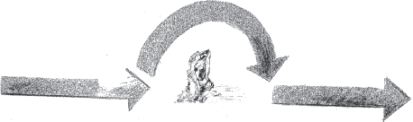
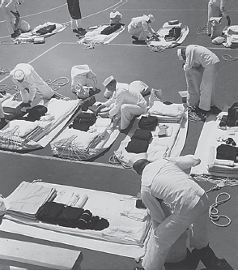

# CHAPTER 6

# Error Recovery Patterns

Error detection, discussed in the previous chapter, does not ‘fix’ the error. The error is still present in the system and can still cause a failure. The patterns in this chapter address error recovery, one of the two means of processing the error and resuming error-free operation. Error recovery continues execution even with a detected error by placing the system in a state that does not contain the error. This means resuming execution at a known place, allowing it to continue processing at least as well as it did before the error was detected. The other means of error processing is error mitigation to mask the error. The next chapter discusses error mitigation.

> 上一章中讨论的错误检测并不能“修复”错误。该错误仍存在于系统中，仍可能导致故障。本章中的模式涉及错误恢复，这是处理错误和恢复无错误操作的两种方法之一。通过将系统置于不包含错误的状态，即使检测到错误，错误恢复也会继续执行。这意味着在已知位置恢复执行，允许它至少像检测到错误之前一样继续处理。错误处理的另一种方法是减少错误以掩盖错误。下一章讨论错误缓解。

Error recovery consists of two main parts. The first part involves undoing the bad effects of the error. The second part involves creating an error free state in the system that can resume execution. Both of these must use a minimum amount of time in order to maximize availability. REDUNDANCY (3) is used when possible to produce the fastest possible recovery.

> 错误恢复包括两个主要部分。第一部分涉及消除错误的不良影响。第二部分涉及在系统中创建可以恢复执行的无错误状态。这两者都必须使用最少的时间，以最大限度地提高可用性。在可能的情况下，使用冗余（3）以产生尽可能快的恢复。

Many of these patterns involve preserving system state through checkpoints. A CHECKPOINT (37) is an incrementally saved state that facilitates rapidly restoring processing to a point at which the state was saved. Restoring from the saved state decreases the time required to return to the same state that existed at the time of the error. Instead of having to replay the entire sequence of events from the beginning, processing can resume quickly from an intermediate state. This decrease in recovery time increases the amount of time that the system is available for service, which is its availability.

> 其中许多模式涉及通过检查点保存系统状态。CHECKPOINT（37）是一种增量保存的状态，有助于将处理快速恢复到保存状态的点。从保存状态恢复将减少返回到错误发生时存在的相同状态所需的时间。处理可以从中间状态快速恢复，而不必从头开始重放整个事件序列。恢复时间的减少增加了系统可用于服务的时间，即可用性。

However, restoring a saved checkpoint is only part of error recovery. Many of these patterns correct errors by changing the system state to one where the error does not exist, for example by resuming execution at the point before the fault activated.

> 但是，恢复保存的检查点只是错误恢复的一部分。其中许多模式通过将系统状态更改为不存在错误的状态来纠正错误，例如，通过在故障激活之前恢复执行。

<a href="#c06.htm#tab6.1" id="c06.htm#tab6.1a">Table 6.1</a> lists all of the patterns in this chapter. Their order is that of the language shown in <a href="#c06.htm#fig6.47" id="c06.htm#fig6.47a">Figure 47</a> and also the order that the patterns appear within this chapter.

[**Table 6.1**](#c06.htm#tab6.1a) Error recovery patterns

> [**表 6.1**]（#c06.htm#tab6.1a）错误恢复模式

---

> ---

**PATTERN** **PATTERN INTENT**

> **模式\***模式意图\*\*

QUARANTINE (28) Take steps to isolate and confine a sick element to keep it from corrupting the rest of the system.

> 检疫（28）采取措施隔离和限制生病的元素，以防止其破坏系统的其余部分。

CONCENTRATED RECOVERY (29) The system should have as few distractions as possible during error recovery.

> 集中恢复（29）在错误恢复过程中，系统应尽可能少地分散注意力。

ERROR HANDLER (30) Provide a controlled manner for handling errors.

> 错误处理器（30）提供处理错误的受控方式。

RESTART (31) Resume execution by restarting the program from the beginning.

> RESTART（31）通过从头开始重新启动程序来恢复执行。

ROLLBACK (32) Resume normal execution by moving to a state in the execution path but before the error occurred.

> ROLLBACK（32）通过移动到执行路径中但在错误发生之前的状态来恢复正常执行。

ROLL-FORWARD (33) Resume normal execution by advancing to a future state that would have been reached if the error had not occurred.

> ROLL-FORWARD（33）通过前进到未来状态恢复正常执行，如果没有发生错误，则会达到该状态。

RETURN TO REFERENCE POINT (34) Resume execution by returning to a specific known state. That place might not have been in the execution path that led to the error, but it is known to be safe.

> 返回参考点（34）通过返回到特定的已知状态来恢复执行。该位置可能不在导致错误的执行路径中，但已知是安全的。

LIMIT RETRIES (35) Do not return to the scene of an error without changing something, because the error might reoccur.

> 限制重试（35）不要在不更改内容的情况下返回错误场景，因为错误可能会再次出现。

FAILOVER (36) Recover by switching to a redundant unit.

> 故障（36）通过切换到冗余单元进行恢复。

CHECKPOINT (37) Save state periodically so that it does not need to be regenerated from the beginning of execution.

> CHECKPOINT（37）定期保存状态，以便不需要从执行开始重新生成状态。

WHAT TO SAVE (38) Checkpoints should save information of global interest to long-duration processes.

> 保存内容（38）检查点应将全局感兴趣的信息保存到长时间进程中。

REMOTE STORAGE (39) Consider REDUNDANCY (3) and other recovery factors when deciding where to place checkpoints.

> 远程存储（39）在决定在何处放置检查点时，请考虑冗余（3）和其他恢复因素。

INDIVIDUALS DECIDE TIMING (40) Let each process decide when to take a checkpoint based on their knowledge of their own needs.

> 个人决定时间（40）让每个流程根据自己的需求决定何时进行检查。

DATA RESET (41) Restore some data to its initial (or a predetermined) value when it is found incorrect.

> 数据重置（41）当发现数据不正确时，将一些数据恢复到其初始（或预定）值。

---

> ---

**[Figure 47](#c06.htm#fig6.47a)** Error recovery pattern language map

> **[图 47]（#c06.htm#fig6.47a）**错误恢复模式语言映射

[Figure 47](#c06.htm#fig6.47) contains a language mapping of the patterns found in chapter 6.

> [图 47]（#c06.htm#fig6.47）包含第 6 章中发现的模式的语言映射。

When an error is detected it must be isolated and prevented from spreading. During detection, steps can be taken as described in ERROR CONTAINMENT BARRIER (13). When recovery begins it should QUARANTINE (28) the erroneous part to prevent spreading. Error recovery done with the least loss of availability is done in a single-minded manner, CONCENTRATED RECOVERY (29).

> 当检测到错误时，必须将其隔离并防止其扩散。在检测过程中，可以采取错误遏制屏障（13）中所述的步骤。当恢复开始时，应隔离（28）错误部分，以防止扩散。以最少的可用性损失完成的错误恢复是以单一的方式完成的，即集中恢复（29）。

ERROR HANDLERS (30) are a common way to handle errors that occur during execution. They enable the collection of common error handling code in easy to maintain centralized locations. Many computer languages provide support for error handling mechanisms.

> 错误处理程序（30）是处理执行过程中发生的错误的常用方法。它们支持在易于维护的集中位置收集常见错误处理代码。许多计算机语言都支持错误处理机制。

Error recovery returns the system to normal operation. After any active recovery, SOMEONE IN CHARGE (8) must decide from which point to continue execution. There are four basic places from which the execution can resume. The case that requires the longest to complete is to RESTART (31) the system and resume with a totally clean slate. In other cases execution can resume from a state close to the state that had the error. If the chance of repeating the error is low then a ROLLBACK (32) can be used. If the chances of repeating the error are high then ROLL-FORWARD (33) will be the most effective technique. In cases where the error was not in the primary application functions, for example when it is within the fault tolerance code, a RETURN TO REFERENCE POINT (34) is an effective technique.

> 错误恢复使系统恢复正常运行。在任何主动恢复之后，负责人（8）必须决定从哪个点继续执行。可以从四个基本位置恢复执行。需要最长时间才能完成的情况是重新启动（31）系统，然后重新开始。在其他情况下，执行可以从接近发生错误的状态恢复。如果重复错误的机会很低，则可以使用 ROLLBACK（32）。如果重复错误的机会很高，则 ROLL-FORWARD（33）将是最有效的技术。在错误不在主要应用程序功能中的情况下，例如，当错误在容错代码内时，返回参考点（34）是一种有效的技术。

The possibility exists with most of these techniques that the system will become stuck in a loop of error/error recovery/continued execution/error … It is important to build in the mechanism to LIMIT RETRIES (35) to break this cycle.

> 大多数这些技术都有可能使系统陷入错误/错误恢复/继续执行/错误的循环中……建立限制重试（35）机制以打破这一循环很重要。

When the system has REDUNDANT (3) elements a common form of error recovery is to FAILOVER (36) to the backup elements. Resumption of normal operations after a FAILOVER involves both deciding where to begin processing within the new active unit and also the restoration of internal saved state from CHECKPOINTS (37).

> 当系统具有冗余（3）元件时，常见的错误恢复形式是故障切换（36）到备份元件。故障切换后恢复正常操作既包括决定在新的活动单元内从何处开始处理，也包括从检查点（37）恢复内部保存状态。

Either the occurrence of an error, or the error recovery, frequently results in the loss of data. CHECKPOINTS (37) of system data help by enabling the return of data and system state to something between the time of the error and the initial state of the system. CHECKPOINTS are an effective technique, but lead to the need to decide WHAT TO SAVE (38); where to store it, REMOTE STORAGE (39); and when CHECKPOINTS should be taken, INDIVIDUALS DECIDE TIMING (40).

> 错误的发生或错误恢复通常会导致数据丢失。系统数据的检查点（37）有助于将数据和系统状态返回到错误时间和系统初始状态之间的某个状态。检查点是一种有效的方法，但需要决定保存什么（38）；远程存储（39）；当应该采取检查点时，个人决定时间（40）。

When it is the data that is faulty, a DATA RESET (41) might be initiated if the fault cannot be corrected.

> 当数据出现故障时，如果无法纠正故障，则可能会启动数据重置（41）。

# 28. Quarantine

… The system has errors. The system element with the errors has been identified. It might be a particular software module that is continually producing errors, or it might be a hardware element that is incorrect.

> …系统出现错误。已识别出存在错误的系统元素。可能是某个特定的软件模块不断产生错误，也可能是硬件元件不正确。

Every time the system is asked (or allowed) to perform work it responds with an error.

> 每次系统被要求（或允许）执行工作时，它都会以错误响应。

The presence of an error poses the risk that the error will propagate, i.e. that the error will be the fault that stimulates an error in a different element.

> 错误的存在会带来错误传播的风险，即错误将是在不同元素中激发错误的故障。

The system consists of UNITS OF MITIGATION (1) that encapsulate the functionality of the system.

> 该系统由封装系统功能的缓解单元（1）组成。

**How can the system prevent errors from spreading?**

> **系统如何防止错误传播**

Information is passed between parts of the system through interfaces. When the information is erroneous it might activate a latent fault in the receiving part of the system. Even if it doesn’t activate a latent fault in the receiver, the receiving element might make incorrect decisions based on the error.

> 信息通过接口在系统的各个部分之间传递。当信息错误时，可能会激活系统接收部分的潜在故障。即使它没有激活接收器中的潜在故障，接收元件也可能基于错误做出错误的决定。

A Babbling Idiot is an element that sends messages at the wrong time. A Babbling Idiot starts talking to its peers consistently and erroneously. These babbling elements must be isolated and kept from spreading incorrect information throughout the system. \[Kop97\]

> 胡言乱语的白痴是在错误的时间发送信息的元素。一个叽叽喳喳的白痴开始不断地错误地与同伴交谈。这些胡言乱语的元素必须被隔离并防止在整个系统中传播错误信息\[Kop97\]

The information interface might be a software interface between elements/methods/procedures. Or if the element is hardware then there is some sort of interface between it and the other parts.

> 信息接口可以是元素/方法/过程之间的软件接口。或者如果元件是硬件，那么它和其他部件之间有某种接口。

A common technique when designing the interface between potentially unreliable components is to place a parameter that gives an indication about whether the result should be ignored. If this indicator parameter is set to an unsafe value then the result should not be believed. This is similar to MARKED DATA (56)

> 在设计潜在不可靠组件之间的接口时，一种常见的技术是放置一个参数，该参数指示是否应忽略结果。如果此指示器参数设置为不安全值，则不应相信结果。这类似于标记数据（56）

In the best case the faulty nodes which might be UNITS OF MITIGATION (1) can be isolated from the rest of the system and totally removed from all application processing. If it is not doing anything it can’t create errors that can spread. Well designed UNITS OF MITIGATION will fail silently, making the isolation simple.

> 在最佳情况下，可能是缓解单元（1）的故障节点可以与系统的其余部分隔离，并从所有应用程序处理中完全删除。如果它不做任何事情，就不会产生可能传播的错误。精心设计的缓解单元将无声地失败，使隔离变得简单。

The software or hardware element might _have_ to be included in the main application and therefore the system can’t isolate it. If the failing element must be involved in the computation, even though it has been deemed unreliable and as a consequence its result will not be used, you must then be concerned about side effects. What side effects might have happened when the element was performing its work? Did it send a message to another system? Did it alter memory? Did it change the system state? Side effects are difficult to undo.

> 软件或硬件元素可能包含在主应用程序中，因此系统无法将其隔离。如果失败的元素必须参与计算，即使它被认为不可靠，因此其结果不会被使用，那么您必须担心副作用。当元素执行其工作时可能会发生什么副作用？它是否向另一个系统发送了消息？它改变了记忆吗？它改变了系统状态吗？副作用很难消除。

The barrier around the faulty element must be impermeable so that not even side effects are permitted. Spacecraft will enter a ‘safe mode’ and wait for the involvement of ground personnel in situations where the on-board error processing mechanisms cannot handle the system. When in this mode they are quarantining the entire system to reduce the error propagation. This leaves the system in a known state for future ground-based corrective actions. \[Mor05\]

> 故障元件周围的屏障必须是不可渗透的，因此不允许出现任何副作用。在机载错误处理机制无法处理系统的情况下，航天器将进入“安全模式”，等待地面人员的介入。在这种模式下，他们隔离整个系统以减少错误传播。这将使系统处于已知状态，以便将来采取基于地面的纠正措施\【05 月】

Therefore,

> 因此

**Establish a barrier around the element that prevents it from both contributing to the useful work and also prevents it from propagating its error into other parts of the system, see <a href="#c06.htm#fig6.48" id="c06.htm#fig6.48a">Figure 48</a>.**

> **在元素周围建立一个屏障，防止它对有用的工作做出贡献，也防止它将错误传播到系统的其他部分，请参见图 48</a>**

**[Figure 48](#c06.htm#fig6.48a)** Build a fence around the error

> **[图 48]（#c06.htm#fig6.48a）**围绕错误建立围栏

Parts of the system might be isolated in a Quarantine zone, meaning that the application is not totally available. Errors from a known-faulty UNITS OF MITIGATION (1) will not be propagated through the system. …

> 系统的某些部分可能被隔离在隔离区中，这意味着应用程序不完全可用。来自已知故障缓解单元（1）的错误不会通过系统传播…

# 29. Concentrated Recovery

… An error has been detected. Now is the time for the system to process the error. System state has been saved through a series of CHECKPOINTS (37).

> …检测到错误。现在是系统处理错误的时候了。通过一系列检查点（37）保存了系统状态。

The system is required to be highly available. Minimizing recovery time increases availability.

> 要求系统高度可用。将恢复时间最小化可提高可用性。

The system has a number of techniques that can recover the system and its applications. These include saving system state periodically through CHECKPOINTS (37) and restoring it in conjunction with a ROLLBACK (32), ROLL-FORWARD (33), and RETURN TO REFERENCE POINT (34). Mitigation tasks such as MARKED DATA (56) are also related.

> 该系统有许多技术可以恢复系统及其应用程序。这些包括通过检查点（37）定期保存系统状态，并结合回滚（32）、回滚（33）和返回参考点（34）恢复系统状态。缓解任务，如标记数据（56）也是相关的。

**When processing an error, how should the system minimize unavailability?**

> **处理错误时，系统应如何将不可用性降至最低**

The system should make the recovery as fast as possible. ‘Fast’ is in terms of the duration of the recovery. Time spent recovering is time that the applications are unavailable and is part of the application or system’s Mean Time To Repair.

> 系统应使恢复速度尽可能快。”“快速”是指恢复的持续时间。恢复所花费的时间是应用程序不可用的时间，是应用程序或系统平均修复时间的一部分。

With well chosen UNITS OF MITIGATION (1), part of the system can be recovering from an error while other Units continue execution. When the UNIT OF MITIGATION is in something of which there is only one, the whole unit must participate in the recovery.

> 使用精心选择的缓解单元（1），当其他单元继续执行时，系统的一部分可以从错误中恢复。当缓解单元处于只有一个的情况下时，整个单元必须参与恢复。

Within a UNIT OF MITIGATION (1) the erroneous part that needs recovery or mitigation might not be the whole. This allows the possibility of the unit performing some non-recovery tasks during the error processing. Performing other work simultaneously with error processing introduces a number of risks.

> 在缓解单元（1）中，需要恢复或缓解的错误部分可能不是全部。这允许单元在错误处理期间执行一些非恢复任务。在错误处理的同时执行其他工作会带来许多风险。

These are some of the risks. The application state will be subtly changing even while the system is recovering. For example, new requests will be arriving or common resources will be used by another task. Contention for resources will make the recovery take longer. The amount of time required for the recovery will vary, making prediction and analysis more difficult.

> 这些是一些风险。即使系统正在恢复，应用程序状态也会发生微妙的变化。例如，新的请求将到达，或者公共资源将被另一个任务使用。争夺资源将使复苏需要更长时间。恢复所需的时间会有所不同，这使得预测和分析更加困难。

To shorten the time of recovery the system should make its own recovery its primary task. If other tasks are unaffected by the error, lower their priority while recovery is underway to reduce the elapsed time for recovery.

> 为了缩短恢复时间，系统应将自己的恢复作为首要任务。如果其他任务不受错误影响，请在恢复过程中降低其优先级，以减少恢复所需的时间。

The trade off here is between the speed of recovery and the handled workload. Speed of recovery is measured in unavailability while the handled workload is measured in terms of system throughput and revenue.

> 这里的权衡是恢复速度和处理的工作量之间的权衡。恢复速度是以不可用性来衡量的，而处理的工作量是以系统吞吐量和收入来衡量的。

Deferring work that is arriving will require that it be dropped and ignored totally, or that it be buffered for future processing. The length of time for the recovery action defines which of these is needed. In most systems both capabilities will be implemented. Dropping the arriving work is a way to SHED LOAD (49). Several patterns including FRESH WORK BEFORE STALE (55) and QUEUE FOR RESOURCES (46) describe how the queued requests should be handled.

> 延迟即将到来的工作将需要将其丢弃并完全忽略，或者对其进行缓冲以备将来处理。恢复操作的时间长度定义了需要哪些操作。在大多数系统中，这两种功能都将实现。放下到达的工件是卸载的一种方式（49）。包括 FRESH WORK BEFORSTALE（55）和 QUEUE FOR RESOURCES（46）在内的几个模式描述了应该如何处理排队的请求。

If the system is concentrating on recovery it might appear dead to its observers. Be certain to periodically let the connected systems know that recovery is underway and that requests will either be queued for later processing or discarded. The FAULT OBSERVER (10) can perform the notification.

> 如果系统专注于恢复，观察者可能会觉得它已经死了。一定要定期让连接的系统知道恢复正在进行，请求将排队等待稍后处理或被丢弃。故障观察员（10）可以执行通知。

Therefore,

> 因此

**Focus all necessary resources on the recovery task so that the recovery time can be minimized. See <a href="#c06.htm#fig6.49" id="c06.htm#fig6.49a">Figure 49</a>.**

> **将所有必要的资源集中在恢复任务上，以便将恢复时间降至最低。参见图 49</a>**

**[Figure 49](#c06.htm#fig6.49a)** Restrict other work during recovery

> **[图 49]（#c06.htm#fig6.49a）**恢复期间限制其他工作

There should be SOMEONE IN CHARGE (8) making sure that the CONCENTRATED RECOVERY succeeds and doesn’t cause other failures. A QUARANTINE (28) around the recovering task should be created.

> 应该有人负责（8）确保集中恢复成功，不会导致其他故障。应围绕恢复任务创建一个 QUARANTINE（28）。

Extra work that can prevent error propagation (LIMIT RETRIES (35)) _should_ be done during restoration. For example, incrementing error counters, notifying the FAULT OBSERVER (10) and supporting the actions of SOMEONE IN CHARGE (8) should be done. …

> 在恢复过程中，应进行额外的工作，以防止错误传播（LIMIT RETRIES（35））。例如，应增加错误计数器，通知故障观察者（10）并支持负责人（8）的行动…

# 30. Error Handler

… The system has detected an error in execution. This error affects the overall control flow, and normal processing cannot continue unless some actions are taken.

> …系统在执行中检测到错误。此错误会影响整个控制流程，除非采取某些操作，否则正常处理无法继续。

**Developing and maintaining application code is complicated by the need to process errors.**

> **开发和维护应用程序代码由于需要处理错误而变得复杂**

Error handling is non-productive work done by the system. It counts as time during which the application is unavailable. CONCENTRATED RECOVERY (29) might be fast, but it adds up and reduces overall availability.

> 错误处理是系统完成的非生产性工作。它计算应用程序不可用的时间。集中恢复（29）可能很快，但它会增加并降低总体可用性。

When handling an error the system should stop error propagation, correct or mitigate the effects of the error, and report to the FAULT OBSERVER (10). This is all possible within the main application flow through the use of conditional branches. Since there are common actions that need to be taken for all errors it makes sense to set the common actions aside in a separate place.

> 处理错误时，系统应停止错误传播，纠正或减轻错误的影响，并向故障观察者报告（10）。通过使用条件分支，这在主应用程序流中都是可能的。由于存在需要针对所有错误采取的常见操作，因此将常见操作放在单独的位置是有意义的。

When the same error can occur at multiple places in the same program, separating and reusing the handler minimizes overall code size. It also reduces the risk of updating only some of the local error handling blocks of code if a global change becomes necessary. The need to make the same change in multiple locations requires a significant maintenance effort and can easily introduce fault into the software.

> 当相同的错误可能发生在同一程序中的多个位置时，分离和重用处理程序可以最小化总代码大小。如果需要进行全局更改，它还可以降低仅更新部分本地错误处理代码块的风险。需要在多个位置进行相同的更改需要大量的维护工作，并且很容易将故障引入到软件中。

Separating out the error handling logic into separate parts introduces the problem of correctly treating the context of each place that detects the error and invokes the handler. Each will be slightly different from the other places. The error handler must be able to correctly perform all the ‘clean-up’ tasks for all of the places from which it might be called. This requires careful planning to avoid coupling the error handler too tightly with the programs that invoke it.

> 将错误处理逻辑分离为单独的部分，会带来正确处理检测到错误并调用处理程序的每个位置的上下文的问题。每个地方都会与其他地方略有不同。错误处理程序必须能够正确执行可能调用它的所有位置的所有“清理”任务。这需要仔细规划，以避免错误处理程序与调用它的程序过于紧密地耦合。

The time spent processing errors is time not spent on the main functionality. Not every error that your program detects should be sent to an error handler. If something can easily be corrected in place locally and normal processing resumed, do that. Use an error handler when normal processing cannot be resumed for some reason.

> 处理错误所花费的时间是不花费在主要功能上的时间。不是程序检测到的每个错误都应该发送到错误处理程序。如果可以很容易地在本地纠正某些问题并恢复正常处理，请执行此操作。当由于某种原因无法恢复正常处理时，请使用错误处理程序。

Many languages support the concept of exceptions and error handling. When an error is detected an exception is raised. This exception marks the fact that normal processing cannot continue and that something special must be done to correct the situation. The special processing is done by the error handler. Similarly, RECOVERY BLOCKS (4) generally provide a final choice when none of the blocks completes successfully. The final choice when the others all fail is the error handler.

> 许多语言支持异常和错误处理的概念。当检测到错误时，将引发异常。此异常标志着正常处理无法继续，必须采取特殊措施来纠正这种情况。特殊处理由错误处理程序完成。类似地，当没有一个块成功完成时，RECOVERY BLOCKS（4）通常提供最终选择。当其他都失败时，最后的选择是错误处理程序。

When handling of the error completes, pass control back to the application, which must be able to resume execution. The invocation of the error handler occurs as soon as error detection occurs, or should it be deferred and started later? This issue depends very heavily on the situation and the source of the error. Reducing the risk of error propagation should be foremost in your mind as you design the mechanism.

> 错误处理完成后，将控制权传递回应用程序，应用程序必须能够恢复执行。错误处理程序的调用在错误检测发生时立即发生，还是应该延迟并稍后启动？这个问题在很大程度上取决于情况和错误的来源。在设计机制时，降低错误传播的风险应该是您的首要任务。

Sometimes the error detection mechanisms will detect errors that are trivial within the context where they were found. For example, an error from a file reading function might be an error or it might just be a signal that reading is completed. The interpretation depends on the context. In situations where the error is not really an error, the error handler should be able to distinguish this fact and allow execution to resume with only minimal action. In these trivial cases the error should not be reported to the FAULT OBSERVER (10) and the overhead of a separate error handler is not required. Cases of trivial or inconsequential errors should be handled by the detecting program inline and should not invoke the error handler.

> 有时，错误检测机制会检测到在发现错误的上下文中微不足道的错误。例如，文件读取函数的错误可能是错误，也可能只是读取完成的信号。解释取决于上下文。在错误不是真正的错误的情况下，错误处理程序应该能够区分这一事实，并允许仅用最小的操作就恢复执行。在这些微小的情况下，不应将错误报告给故障观察者（10），并且不需要单独的错误处理程序的开销。微小或无关紧要的错误应由检测程序内联处理，不应调用错误处理程序。

Therefore,

> 因此

**Separate error processing code in special handling blocks for easier maintenance and to facilitate new handlers being added in the future, <a href="#c06.htm#fig6.50" id="c06.htm#fig6.50a">Figure 50</a>.**

> **在特殊处理块中分离错误处理代码，以便于维护，并便于将来添加新的处理程序，<a href=“#c06.htm#fig6.50”id=“c06.htm#fig6.50a”> 图 50</a>**

**[Figure 50](#c06.htm#fig6.50a)** Handle the error in an error handler

> **[图 50]（#c06.htm#fig6.50a）**在错误处理程序中处理错误

An error handler can process errors from across different parts of the system, centralizing its handling.

> 错误处理程序可以处理来自系统不同部分的错误，集中处理。

Some languages, such as C++ and Java, have predefined language constructs to support exceptions. Even if language support is not available, the system can mimic this behavior. Do not ignore exceptions that happen. Design the system to process them.

> 一些语言，如 C++ 和 Java，具有预定义的语言结构来支持异常。即使语言支持不可用，系统也可以模仿这种行为。不要忽略发生的异常。设计处理它们的系统。

The error has been contained. Execution must continue from somewhere. In many cases it can resume at or near the point of error. Errors processed by a catch block are examples of this. Sometimes execution should return to a place right before the error occurred to retry the action that produced the error, being careful to LIMIT RETRIES (35). For example, for some of the errors possible from a database transaction retrying is the correct next step. Return to a point before the error occurred through a ROLLBACK (32) and the restoration of a CHECKPOINT (37). Resuming execution with minimal disruption is more likely if the error processing code resides within the same module as the point of detection.

> 错误已包含。必须从某处继续执行。在许多情况下，它可以在错误点或错误点附近恢复。catch块处理的错误就是这样的例子。有时，执行应该返回到错误发生之前的某个位置，以重试产生错误的操作，注意限制重试（35）。例如，对于数据库事务中可能出现的一些错误，下一步正确的做法是重试。通过 ROLLBACK（32）和 CHECKPOINT（37）的恢复返回到错误发生之前的点。如果错误处理代码与检测点位于同一模块内，则更可能以最小中断恢复执行。

Some errors that have affected major parts of the system make the choice of where to return to for normal execution unclear. For example, where should execution continue after an error involving a missing method or function is encountered? The system could immediately skip to some safe place, using a technique such as ROLL-FORWARD (33), or RETURN TO REFERENCE POINT (34). This would stop the control flow and prevent the error from propagating down the normal control path.

> 一些错误影响了系统的主要部分，使得选择返回何处进行正常执行变得不清楚。例如，遇到涉及缺少方法或函数的错误后，应该在哪里继续执行？系统可以立即跳到某个安全的地方，使用滚动前进（33）或返回参考点（34）等技术。这将停止控制流并防止错误沿着正常控制路径传播。

If there are resources that need to be ‘cleaned up’ and released from the task that has had an error, use FINAL HANDLING (50). …

> 如果有资源需要“清理”并从发生错误的任务中释放，请使用“最终处理”（50）…

# 31. Restart

… The error is really bad. None of the other mechanisms to recover from the error are appropriate.

> ……错误真的很严重。从错误中恢复的其他机制都不合适。

ESCALATION (9) has resulted after the other possible ways of recovery are tried but have failed to recover the system.

> 在尝试了其他可能的恢复方法但未能恢复系统后，出现了升级（9）。

**How can execution resume when recovery from the error is not possible?**

> **当无法从错误中恢复时，如何恢复执行**

Some errors require very drastic action. The SOMEONE IN CHARGE (8) might have overseen a series of ESCALATION (9) steps, but none of the steps resolved the error. This is a truly persistent fault.

> 有些错误需要采取非常严厉的措施。负责人可能监督了一系列升级步骤，但没有一个步骤解决了错误。这是一个真正持久的错误。

Restarting the application can resolve the error if the fault is in the application. If the fault is in the underlying hardware or operating system/middleware layers then the application restart will not help.

> 如果故障在应用程序中，则重新启动应用程序可以解决该错误。如果故障发生在底层硬件或操作系统/中间件层，那么应用程序重启将无济于事。

Many techniques such as ROLLBACK (32) and ROLL-FORWARD (33) recover the application by moving it to an error free state along the normal execution path. In some cases a RETURN TO REFERENCE POINT (34) is the appropriate state transition because it breaks (or usually breaks) from the error’s execution path to a pre-determined safe place. The point of initialization is a pre-determined safe place for most applications and systems. ESCALATION (9) needs additional actions to try when these techniques don’t work.

> 许多技术如 ROLLBACK（32）和 ROLL-FORWARD（33）通过将应用程序沿正常执行路径移动到无错误状态来恢复应用程序。在某些情况下，返回参考点（34）是适当的状态转换，因为它从错误的执行路径中断（或通常中断）到预定的安全位置。对于大多数应用程序和系统来说，初始化点是一个预先确定的安全位置。当这些技术不起作用时，ESCALATION（9）需要额外的操作来尝试。

The system must return to service quickly after the recovery actions, so restarts shouldn’t be performed frequently if they take long periods of time. Different levels of recovery can be implemented that take different amounts of time. A ‘cold’ restart level will initialize everything as though it were the initial power-on of the system after a potentially unclean shutdown. Extra checks to ensure that the file system is in the proper state might be required as part of a cold restart. A ‘warm’ restart can restore the system to an initial value but skip certain lengthy steps. This relies on the assumption that the skipped steps are not needed based upon system state, for example that the file system is intact and does not need to be checked.

> 恢复操作后，系统必须快速恢复服务，因此如果重启需要很长时间，则不应频繁执行。可以实施不同级别的恢复，这需要不同的时间。“冷”重启级别将初始化一切，就好像它是在潜在的不干净关机后系统的初始通电一样。作为冷重启的一部分，可能需要额外检查以确保文件系统处于正确状态。“热”重启可以将系统恢复到初始值，但可以跳过某些冗长的步骤。这依赖于这样的假设，即根据系统状态不需要跳过的步骤，例如文件系统是完整的，不需要检查。

Sometimes the restarts can be done at a very fine level, targeting specific tasks or portions of tasks, for example, restarting only small groups of Java containers in an application server environment. This technique is very effective against transient errors. If the restart does not succeed in recovering then ESCALATION (9) to restarts of larger groups is possible. In order for this to be successful the error detection mechanisms must be able to isolate the fault to a very small part of the system. \[CBF+04\]

> 有时，可以在非常精细的级别执行重新启动，以特定任务或任务的一部分为目标，例如，在应用程序服务器环境中仅重新启动少量 Java 容器。这种技术对瞬时误差非常有效。如果重新启动未能成功恢复，则可以升级（9）以重新启动更大的组。为了成功实现这一点，错误检测机制必须能够将故障隔离到系统的一小部分\[CBF+04\]

Therefore,

> 因此

**Restart the system. Suffer the loss of time and state to reinitialize and restart the application from the beginning, <a href="#c06.htm#fig6.51" id="c06.htm#fig6.51a">Figure 51</a>.**

> **重新启动系统。从一开始重新初始化和重新启动应用程序会损失时间和状态，<a href=“#c06.htm#fig6.51”id=“c06.htm#fig6.51a”> 图 51</a>**

**[Figure 51](#c06.htm#fig6.51a)** Restart from the beginning

> **[图 51]（#c06.htm#fig6.51a）**从头开始

The decision to take this action is something that should be done by SOMEONE IN CHARGE (8) as a CONCENTRATED RECOVERY (29). The actions should be reported to the FAULT OBSERVER (10) so that the outside world can be informed that the action is happening. A SYSTEM MONITOR (15) can watch the recovery action to make sure that it starts and finishes as planned.

> 采取这一行动的决定应该由负责人（8）作为集中恢复（29）来完成。应将行动报告给故障观察者（10），以便通知外界行动正在发生。系统监视器（15）可以监视恢复操作，以确保恢复操作按计划开始和结束。

Restarting execution is frequently needed in conjunction with a FAILOVER (36) to redundant units.

> 通常需要重新启动执行，同时对冗余单元进行故障切换（36）。

CHECKPOINTS (37) enable state to be advanced rapidly to one that is close to the time of the error. A system RESTART followed by restoring from a saved CHECKPOINT quickly gets the system close to the state at the time of an error.

> 检查点（37）使状态能够快速前进到接近错误发生时的状态。系统重新启动，然后从保存的 CHECKPOINT 恢复，可以快速使系统接近错误时的状态。

Sometimes it is useful to have different levels of RESTART. Each level takes a differing amount of time, which enables the most appropriate one to be used to minimize recovery time. These can correspond to different states. Typically the different levels will take differing amounts of time and be more and more drastic. The different levels are sometimes given names such as warm, cold, reload and reboot to indicate their severity. \[Utas05\] This gives ESCALATION (9) the opportunity to try less dramatic and shorter RESTARTS first.

> 有时有不同级别的 RESTART 是有用的。每个级别都需要不同的时间，这使得可以使用最合适的级别来最小化恢复时间。这些可以对应于不同的状态。通常，不同的级别需要不同的时间，并且会越来越激烈。不同级别有时会被命名为 warm、cold、reload 和 reboot，以表示其严重性\[Utas05\]这给了 ESCALATION（9）一个机会，可以先尝试不那么戏剧化、更短的餐厅。

An example of varying severity RESTARTS from the 4ESS™ Switch is shown in <a href="#c06.htm#tab6.2" id="c06.htm#tab6.2a">Table 6.2</a>. …

> 4ESS 中不同严重程度的 RESTARTS 示例 ™ 开关如表 6.2 所示…

[**Table 6.2**](#c06.htm#tab6.2a) 4ESS™ Switch restart levels \[CCR+77, pp 1117–1118\]

> [**表 6.2**]（#c06.htm#tab6.2a）4ESS™ 交换机重启级别\[CCR+77，第 1117–1118 页\]

---

> ---

**RECOVERY ACTIONS** **ACTIONS TAKEN**

> **采取的恢复操作\*\*\***

Phase 1 Software initialization only. Initialize many system variables and RETURN TO REFERENCE POINT (34) (The post recovery processing). No application (Call Processing) impact.

> 仅阶段 1 软件初始化。初始化许多系统变量并返回到参考点（34）（恢复后处理）。无应用程序（呼叫处理）影响。

Phase 2 Hardware initialization only. Restart certain key (and problematic) hardware components. Perform only minor software initialization. Call Processing saves work in progress.

> 阶段 2 仅硬件初始化。重新启动某些关键（和有问题的）硬件组件。仅执行次要的软件初始化。呼叫处理可保存正在进行的工作。

Phase 3 Hardware and software initialization. Call processing saves work in progress.

> 第 3 阶段硬件和软件初始化。呼叫处理可节省正在进行的工作。

Phase 4 Only initiated manually. Hardware and software initialization. All application state is lost.

> 阶段 4 仅手动启动。硬件和软件初始化。所有应用程序状态都将丢失。

---

> ---

# 32. Rollback

… An error has occurred and recovery is now complete. The ERROR HANDLER (30) has completed execution, if there is one in the system. The system is in a context where accuracy is very important, and no bit of incoming information can be ignored. For example no request, incoming message, transaction or sensor input should be ignored.

> …发生错误，现在恢复已完成。错误处理器（30）已完成执行（如果系统中有）。该系统所处的环境中，准确性非常重要，任何传入信息都不能忽略。例如，不应忽略任何请求、传入消息、事务或传感器输入。

Requests that were begun or that arrived between when the error occurred and recovery is completed should have an attempt to be thoroughly processed.

> 在错误发生和恢复完成之间开始或到达的请求应尝试彻底处理。

**Where should processing resume after error recovery?**

> **错误恢复后应在何处恢复处理**

In some kinds of systems that are receiving incoming requests, the requests cannot afford to be missed. They might contain critical bits of telemetry data, or financial information that cannot be lost.

> 在接收传入请求的某些类型的系统中，不能错过请求。它们可能包含关键的遥测数据或不能丢失的财务信息。

The system will need to be returned to a known place in its execution where the components are synchronized. The point where a new work request is begun is an example of a synchronization point where the system is ready to work on the new request.

> 系统需要在执行过程中返回到组件同步的已知位置。开始新工作请求的点是系统准备好处理新请求的同步点的示例。

If a CHECKPOINT (37) is available then the system state can be restored to the one that it was in at the point to which the rollback will proceed. The timing of the CHECKPOINT defines the rollback points. If there are no checkpoints then the rollback should take processing back to right before the last requests were started. Requests should be saved until completed so that if a rollback occurs the requests still exist and can be processed again.

> 如果 CHECKPOINT（37）可用，则系统状态可以恢复到回滚进行时的状态。CHECKPOINT 的计时定义了回滚点。如果没有检查点，则回滚应将处理返回到最后一个请求启动之前。请求应保存到完成，以便在发生回滚时，请求仍然存在并可以再次处理。

When the system state is rolled back some work will be done twice, once before the error and once afterwards. Care must be taken to ensure that side effects of this repeated work does not cause new problems. Redoing some of the work prevents rolling back from being a useful solution in some hard real-time applications, where deadlines might be missed when work is redone.

> 当系统状态回滚时，一些工作将执行两次，一次是在错误之前，一次在错误之后。必须注意确保重复工作的副作用不会导致新的问题。在一些硬实时应用程序中，重做一些工作会阻止回滚成为一个有用的解决方案，因为重做工作可能会错过最后期限。

The assessment of what will be lost by skipping requests can be ignored if a rollback is performed. This is unlike the case of a ROLL-FORWARD (33).

> 如果执行回滚，则可以忽略对跳过请求将丢失的内容的评估。这与向前滚动（33）的情况不同。

Depending upon what system state will be restored during the ROLLBACK there is the chance that the error will reoccur. LIMIT RETRIES (35) discusses the problem of preventing repeating a cycle of errors and error recovery.

> 根据回滚期间将恢复的系统状态，错误可能会再次出现。LIMIT RETRIES（35）讨论了防止重复错误循环和错误恢复的问题。

Therefore,

> 因此

**Return to a point where processing can be synchronized that is before the point of error, <a href="#c06.htm#fig6.52" id="c06.htm#fig6.52a">Figure 52</a>. Tread carefully to LIMIT RETRIES (35).**

> **返回到错误点之前的处理可以同步的点，<a href=“#c06.htm#fig6.52”id=“c06.htm#fig6.52a”> 图 52</a>。小心踩踏以限制重试次数（35）**

**[Figure 52](#c06.htm#fig6.52a)** Return to an earlier time

> **[图 52]（#c06.htm#fig6.52a）**返回到较早的时间

The decision to take this action is something that should be done by SOMEONE IN CHARGE (8) as a CONCENTRATED RECOVERY (29). The actions should be reported to the FAULT OBSERVER (10) so that the outside world can be informed that the action is happening. A SYSTEM MONITOR (15) can watch the recovery action to make sure that it starts and finishes as planned.

> 采取这一行动的决定应该由负责人（8）作为集中恢复（29）来完成。应将行动报告给故障观察者（10），以便通知外界行动正在发生。系统监视器（15）可以监视恢复操作，以确保恢复操作按计划开始和结束。

If ROLLBACKS aren’t succeeding in returning the system to normal operation, be careful to not get stuck trying, see LIMIT RETRIES (35). If a ROLLBACK does not succeed, ROLL-FORWARD (33) is a step that ESCALATION (9) can take.

> 如果 ROLLBACKS 无法成功将系统恢复到正常操作，请注意不要在尝试时卡住，请参阅限制重试（35）。如果 ROLLBACK 未成功，则 ROLL-FORWARD（33）是 ESCALATION（9）可以采取的步骤。

Sometimes so much has happened that the system can’t tell where to ROLLBACK to, but ROLL-FORWARD (33) is not appropriate either. In these cases the system should have REFERENCE POINTS that it can RETURN TO (34).

> 有时发生了太多的事情，以至于系统无法确定回滚到哪里，但 ROLL-FORWARD（33）也不合适。在这些情况下，系统应具有可返回的参考点（34）。

There are some things that the system can do to restart the transaction. It might need to restore from a CHECKPOINTED (37) state to achieve the state before the error occurred. What the stable points are that should be rolled back to help define when to actually take a CHECKPOINT, as discussed in INDIVIDUALS DECIDE TIMING (40) …

> 系统可以执行一些操作来重新启动事务。它可能需要从 CHECKPOINTED（37）状态恢复到错误发生之前的状态。应该回滚哪些稳定点，以帮助定义何时实际执行检查点，如《个人决策时间》（40）中所述…

# 33. Roll-Forward

… An error has occurred. The ERROR HANDLER (30), if employed, has now completed execution; error recovery has been completed.

> …发生错误。错误处理器（30）（如果使用）现在已完成执行；错误恢复已完成。

Ignoring or mishandling a few requests that arrive between the time of error and the time of restarting is acceptable. The message stream might include killer messages that need to be avoided and not processed.

> 忽略或错误处理在错误时间和重新启动时间之间到达的一些请求是可以接受的。消息流可能包含需要避免和不处理的致命消息。

**Where should processing resume after error recovery?**

> **错误恢复后应在何处恢复处理**

The system can return to the point of the error after error recovery. But the processing context was interrupted by the error and its processing. If CHECKPOINTS (37) are being made, there will be one closest to the time of the error, but it will not be precisely at the time of the error. The risk of starting a cycle of errors and error processing is great unless something has changed in the context. Eliminating a killer message from a buffer or setting an execution flag to indicate there has already been an error in this section are two changes to the context that can be made.

> 系统可以在错误恢复后返回到错误点。但处理上下文被错误及其处理中断。如果正在进行 CHECKPOINTS（37），则将有一个最接近错误发生的时间，但不会精确到错误发生的时候。除非上下文发生变化，否则开始错误和错误处理循环的风险很大。从缓冲区中删除致命消息或设置执行标志以指示本节中已经存在错误，这是可以对上下文进行的两个更改。

In some cases returning to the point of error will be appropriate. For example, if the point of error processed a sensor reading that arrives periodically, it will be safe to return to that point and wait for the next reading to arrive. Similarly, if the design of the system prevents any killer messages in the input stream from still being present, returning to the site of the error will be safe.

> 在某些情况下，返回错误点是合适的。例如，如果错误点处理了周期性到达的传感器读数，则返回该点并等待下一个读数到达是安全的。类似地，如果系统的设计防止了输入流中的任何致命消息仍然存在，则返回到错误位置将是安全的。

Not all system designs provide for low risk of repeating the error when returning to the place of the error. And even with careful placement of the error reporting and handling mechanisms sometimes returning is not the right thing to do.

> 并非所有的系统设计都提供了在返回错误位置时重复错误的低风险。即使小心地放置了错误报告和处理机制，有时返回也不是正确的做法。

Returning to the point of the error, or to a ROLLBACK (32) point before the error can result in work being done twice or incompletely. Advancing to a point where all of the related application and system tasks can be resynchronized and where they can all proceed forward from is desirable. This can be accomplished faster than a ROLLBACK (32) that involves redoing some work. This in turn makes rolling forward appropriate for hard real-time systems.

> 返回到错误点，或返回到错误之前的 ROLLBACK（32）点，可能导致工作完成两次或不完整。前进到所有相关的应用程序和系统任务都可以重新同步并且它们都可以继续前进的地步是可取的。这可以比涉及重做某些工作的 ROLLBACK（32）更快地完成。这反过来使滚动适用于硬实时系统。

Many fault tolerant systems are event driven. This means that they are responding to external stimuli, such as incoming web service requests or transaction requests. In these cases a safe thing to do is to advance to the point where the next stimulus is to be received. In other words totally ignore the transactions that were being processed when the error was detected. Of course this does not work if the transaction cannot be ignored. For example if it was crediting a bank account then obviously the transaction cannot be merely ignored. In this case ROLLBACK (32) is appropriate.

> 许多容错系统是事件驱动的。这意味着它们正在响应外部刺激，例如传入的 web 服务请求或事务请求。在这些情况下，安全的做法是前进到下一个刺激点。换句话说，完全忽略检测到错误时正在处理的事务。当然，如果不能忽略该事务，则这不会起作用。例如，如果它是银行账户的贷方，那么显然不能仅仅忽略交易。在这种情况下，ROLLBACK（32）是合适的。

Before a roll-forward can be made, the damage caused by the error must be assessed to be certain that the point being advanced to will be valid. Only if the damage has been mitigated, or will be obviated by the jumping forward, can moving to a forward state be safely done. This is to prevent propagation and the repeating of the error, LIMIT RETRIES (35).

> 在进行前滚之前，必须评估错误造成的损害，以确保前进到的点是有效的。只有当损害已经减轻，或将通过向前跳跃来消除，才能安全地移动到向前状态。这是为了防止传播和重复错误，限制重试（35）。

The ERROR HANDLER (30) is a useful way to manage rolling forward.

> 错误处理器（30）是管理向前滚动的有用方法。

Therefore,

> 因此

**Advance to the next point where the processing across the system can be synchronized. Do not resume execution from the point of error; continue as though the erroneous actions did not complete (or did complete successfully), <a href="#c06.htm#fig6.53" id="c06.htm#fig6.53a">Figure 53</a>.**

> **前进到下一个可以同步整个系统处理的点。不要从错误点恢复执行；继续，就像错误操作没有完成（或成功完成），<a href=“#c06.htm#fig6.53”id=“c06.htm#fig6.53a”> 图 53</a>**

**[Figure 53](#c06.htm#fig6.53a)** Move past the error

> **[图 53]（#c06.htm#fig6.53a）**移过错误

In an event driven system rolling forward causes the system to ignore the rest of the current stimuli, discarding it, and jumping to the point in execution where the next stimuli is received to be processed.

> 在事件驱动系统中，向前滚动会导致系统忽略当前刺激的其余部分，丢弃它，并跳到执行点，在执行点接收下一个刺激以进行处理。

The decision to take this action is something that should be done by SOMEONE IN CHARGE (8) as a CONCENTRATED RECOVERY (29). The actions should be reported to the FAULT OBSERVER (10) so that the outside world can be informed that the action is happening. A SYSTEM MONITOR (15) can watch the recovery action to make sure that it starts and finishes as planned.

> 采取这一行动的决定应该由负责人（8）作为集中恢复（29）来完成。应将行动报告给故障观察者（10），以便通知外界行动正在发生。系统监视器（15）可以监视恢复操作，以确保恢复操作按计划开始和结束。

The system’s state is a future state that would have been encountered eventually if the error had not occurred. The effects of the error have been mitigated and masked so that the error state is not visible. …

> 系统的状态是一种未来的状态，如果没有发生错误，最终会遇到这种状态。错误的影响已得到缓解和屏蔽，因此错误状态不可见…

# 34. Return to Reference Point

… Something very wrong has happened. The system wants to recover from the error, but it is unclear where it should resume.

> ……发生了非常错误的事情。系统希望从错误中恢复，但不清楚应该在哪里恢复。

It frequently occurs when an error is detected in an execution flow that is not part of application processing. For example this occurs when an error occurs during support processing such as maintenance or error processing. In these cases a ROLLBACK (32) to a point in the execution flow is not helpful because that is not the main application flow. A ROUTINE AUDIT (24) is an example of processing outside the normal application that could encounter latent faults.

> 当在不属于应用程序处理的执行流中检测到错误时，通常会发生这种情况。例如，当在维护或错误处理等支持处理过程中发生错误时，就会发生这种情况。在这些情况下，ROLLBACK（32）到执行流中的某个点是没有帮助的，因为这不是主应用程序流。ROUTINE AUDIT（24）是正常应用程序之外可能遇到潜在故障的处理示例。

Some errors are so bad that neither ROLLBACK (32) nor ROLL-FORWARD(33) are the appropriate actions, but not quite so bad that RESTART (31) is needed. The error is insidious but can be contained so that it does not jeopardize future actions or result in error propagation. The system is designed to LIMIT RETRIES (35).

> 有些错误非常严重，以至于 ROLLBACK（32）和 ROLL-FORWARD（33）都不是适当的操作，但也不太严重，以至于需要重新启动（31）。该错误是隐蔽的，但可以加以控制，以便不会危及未来的操作或导致错误传播。该系统设计用于限制重试（35）。

**Where can execution resume when an error occurs that can be recovered but for which the recovery does not provide appropriate ROLLBACK (32) or ROLL-FORWARD(33) places?**

> **当发生可以恢复但恢复无法提供适当的 ROLLBACK（32）或 ROLLBORWARD（33）位置的错误时，在哪里可以恢复执行**

Sometimes, as in the example of a ROUTINE AUDIT (24), ROLLBACK (32) does not help because the application does not need the audit code to be rerun at the point rolled back to. The application will benefit from returning directly to application processing. Similarly ROLL-FORWARD (33) to the end of the audit code helps execution of the audit code continue, not the application. In some cases though simply rolling forward does not take the system to an appropriate place.

> 有时，如在 ROUTINE AUDIT（24）的示例中，ROLLBACK（32）没有帮助，因为应用程序不需要在回滚点重新运行审计代码。直接返回应用程序处理将使应用程序受益。类似地，ROLL-FORWARD（33）到审计代码末尾有助于继续执行审计代码，而不是应用程序。在某些情况下，尽管简单地向前滚动并不能将系统带到适当的位置。

A RESTART (31) can solve the problem well but errors in support processing don’t mean that the application needs to be restarted from the beginning. However, a RESTART takes time and affects the whole system. The error can be mitigated and execution resumed without incurring the penalty of time and state that a RESTART incurs.

> RESTART（31）可以很好地解决问题，但支持处理中的错误并不意味着应用程序需要从头重新启动。然而，RESTART 需要时间并影响整个系统。可以减轻错误并恢复执行，而不会导致 RESTART 导致的时间和状态惩罚。

Reference points are not the same as ROLLBACK (32) points. The places that execution might return in a ROLLBACK scenario are places from which execution can continue because they contain completely coherent states without the error, for example the point at which the most recent CHECKPOINT (37) was saved. ROLLBACK points are dynamic, that is they are created during execution such as when state is saved, and they change with time. Because they are dynamic, determining to which ROLLBACK point execution should continue is determined when the ROLLBACK is needed.

> 参考点与 ROLLBACK（32）点不同。在 ROLLBACK 场景中执行可能返回的位置是可以继续执行的位置，因为它们包含完全一致的状态而没有错误，例如保存最近的 CHECKPOINT（37）的位置。ROLLBACK 点是动态的，也就是说，它们是在执行过程中创建的，例如保存状态时，它们会随着时间而改变。因为它们是动态的，所以当需要 ROLLBACK 时，确定应该继续执行哪个 ROLLBACK 点。

Reference points, on the other hand, are static and are always available as recovery points. They are created at design time. One or more reference points are created for any given module. Most tasks will have some point relative to their own execution that is a safe place. In many cases this is the place where the task is just about to enter its own initialization stage, or is just exiting its own initialization stage. These make good reference points. Another potential reference point is at the point where the support task is about to return to the main application.

> 另一方面，参考点是静态的，始终可用作恢复点。它们是在设计时创建的。为任何给定模块创建一个或多个参考点。大多数任务都会有一些与自己的执行相关的点，这是一个安全的地方。在许多情况下，这是任务即将进入其自己的初始化阶段或即将退出其自己的初始阶段的地方。这些都是很好的参考点。另一个潜在的参考点是支持任务即将返回到主应用程序的点。

Therefore,

> 因此

**Resume execution at a point that is known to be safe, and from which normal execution can resume, <a href="#c06.htm#fig6.54" id="c06.htm#fig6.54a">Figure 54</a>.**

> **在已知安全且可以恢复正常执行的点恢复执行，<a href=“#c06.htm#fig6.54”id=“c06.htm#fig6.54a”> 图 54</a>**

**[Figure 54](#c06.htm#fig6.54a)** Move to a specific place in the code

> **[图 54]（#c06.htm#fig6.54a）**移动到代码中的特定位置

The decision to take this action is something that should be done by SOMEONE IN CHARGE (8) as a CONCENTRATED RECOVERY(29). The actions should be reported to the FAULT OBSERVER(10) so that the outside world can be informed that the action is happening. A SYSTEM MONITOR(15) can watch the recovery action to make sure that it starts and finishes as planned.

> 采取这一行动的决定应该由负责人（8）作为集中恢复（29）来完成。应将行动报告给故障观察者（10），以便通知外界行动正在发生。系统监视器（15）可以监视恢复操作，以确保恢复操作按计划开始和结束。

Execution has resumed at a place from which the application knows how to proceed.

> 执行已在应用程序知道如何继续的位置恢复。

In the C language longjmp provides the mechanism to RETURN TO A REFERENCE POINT. …

> 在 C 语言中，longjmp提供了返回参考点的机制…

# 35. Limit Retries

… When deterministic software executes it produces the same results whenever given the same stimuli. Faults are usually deterministic also: whenever they receive the same stimuli they will cause an error in the same way. A software error will occur when the faulty software encounters the same event with the same data and the same state.

> 当确定性软件执行时，无论何时给予相同的刺激，它都会产生相同的结果。故障通常也是确定性的：每当它们接收到相同的刺激时，它们将以相同的方式导致错误。当故障软件遇到具有相同数据和相同状态的相同事件时，将发生软件错误。

The reason for CHECKPOINTING (37) is to preserve the consistent state and starting data. In some systems the incoming events to be processed will also be captured and reapplied. This might take the form of a log of the events, or merely the retransmission by the far end of the messages that the target system has not acknowledged. If the stimulus needed to cause activation of a latent fault is present in the saved state, or in the message when that stimulus is given to the fault, the fault will reactive and the error will reoccur.

> CHECKPOINTING（37）的原因是保持一致的状态和起始数据。在某些系统中，要处理的传入事件也将被捕获并重新应用。这可能采取事件日志的形式，或者仅仅是目标系统尚未确认的消息远端的重传。如果激活潜在故障所需的刺激出现在已保存状态中，或在向故障提供该刺激时出现在消息中，则故障将发生反应，错误将再次出现。

**Faults are deterministic; when a latent fault is given the same stimuli it will activate in the same way. Reprocessing stimuli from before an error can result in the error reoccurring. The primary objective is to preserve overall system operation, which might only be possible at the expense of individual transactions.**

> **故障具有确定性；当潜在故障被给予相同的刺激时，它将以相同的方式激活。重新处理错误之前的刺激可能导致错误再次发生。主要目标是维护整个系统的运行，这可能仅以牺牲单个事务为代价**

When error processing chooses to return execution to a point encountered earlier in time, there is a risk that the same stimuli will be present and will cause the error to reoccur. A common place for error causing stimuli to lurk is in killer messages that are saved and marked as unprocessed. Another common location for error causing stimuli to exist is within the saved data in a checkpoint.

> 当错误处理选择将执行返回到较早时遇到的点时，存在存在相同刺激并导致错误再次发生的风险。导致错误的刺激潜伏的常见地方是保存并标记为未处理的致命消息。错误导致刺激存在的另一个常见位置是检查点中保存的数据内。

If the events to be processed are being delivered to a distributed system with a series of computers in, for example, an N+M REDUNDANCY (3) arrangement then the failure will march through the entire system, failing one processor after another.

> 如果要处理的事件被传送到具有一系列计算机的分布式系统，例如，N+M 冗余（3）布置，则故障将通过整个系统，一个又一个处理器出现故障。

A bad or ‘killer’ message can cause the error to reoccur repeatedly unless handled carefully. When the message is buffered inside the system, the system can delete killer messages from the buffer before a restored system attempts to reprocess the killer message. The system is especially susceptible to the killer message being distributed to each processor that is restarting after error processing – and causing each to fail in turn. If this is a possibility, and the general system availability is more important than the processing of each individual message, then the internal message buffer should be flushed.

> 如果不小心处理，错误或“致命”信息可能会导致错误反复出现。当消息在系统内缓冲时，系统可以在恢复的系统尝试重新处理杀手消息之前从缓冲区中删除杀手消息。该系统特别容易被分发到错误处理后重新启动的每个处理器的致命消息所影响，并导致每个处理器依次失败。如果这是可能的，并且一般系统可用性比处理每个单独的消息更重要，那么应该刷新内部消息缓冲区。

One way to dispose of only the killer messages is to keep track of which message is currently being processed and delete it from the queue when either it is processed successfully or when it has been found to be killer. When every message contains important information and can’t be deleted, a separate queue of suspicious messages can be used to hold them until they can be processed later within a QUARANTINE (28) zone.

> 只处理致命消息的一种方法是跟踪当前正在处理的消息，并在成功处理或发现致命消息时将其从队列中删除。当每条消息都包含重要信息且无法删除时，可以使用一个单独的可疑消息队列来保存它们，直到稍后可以在检疫区（28）内处理它们。

When messages are buffered, buffer overflow is possible. This is something to be aware of, especially if the message buffer is being added to by a processor or part of the system that is not reacting to the killer message. Strategies to stop buffering new requests must be put in place to prevent buffer overflows.

> 当消息被缓冲时，缓冲区溢出是可能的。这是需要注意的，特别是当处理器或系统的一部分对致命消息没有反应时，消息缓冲区被添加到其中。必须制定停止缓冲新请求的策略，以防止缓冲区溢出。

If messages are not buffered internally then we have less control over the submission of messages. The sender of the killer message can retransmit it when the failed processor does not send an acknowledgement. In this case a logging mechanism to enable the system to preserve recent enough state to be on the lookout for the arrival of such a killer message is needed. Limiting the number of retransmissions in the messaging protocol as well as a panic message from the failed or restarted system both help in this case.

> 如果消息没有在内部缓冲，那么我们对消息提交的控制就更少了。当发生故障的处理器没有发送确认时，杀手消息的发送者可以重新发送它。在这种情况下，需要一种日志记录机制，以使系统能够保持足够的最近状态，以便监视这种致命消息的到来。在这种情况下，限制消息传递协议中的重传次数以及来自故障或重新启动系统的紧急消息都会有所帮助。

Repeated killer messages might be a sign of a denial of service attack on the system. Typically network firewalls or router/switch capabilities are used to detect and isolate malicious traffic. Killer messages should be logged and the log available for either automatic or manual examination to determine if a malicious attack is occurring.

> 重复的致命消息可能是系统遭到拒绝服务攻击的信号。通常，网络防火墙或路由器/交换机功能用于检测和隔离恶意流量。应记录杀手消息，日志可用于自动或手动检查，以确定是否发生恶意攻击。

If the killer event is the result of some internal action then the system should implement a scheme to ROLL-FORWARD to avoid the event being regenerated. Sometimes it is best to skip some work rather than to recreate an error that takes part of the distributed system down. In this case an internal firewall is an effective technique to judge whether the event might be harmful and, if so, eliminate the event.

> 如果杀手事件是某些内部操作的结果，则系统应实施 ROLL-FORWARD 方案，以避免事件重新生成。有时，最好是跳过一些工作，而不是重新创建导致部分分布式系统崩溃的错误。在这种情况下，内部防火墙是一种有效的技术，可以判断事件是否有害，如果有害，则消除事件。

Failures that are related to the presence of certain data and that cause resumption from a checkpoint are reduced through safeguarding the data through audits and other common error detection and correction methods.

> 通过审计和其他常见的错误检测和纠正方法来保护数据，可以减少与某些数据的存在相关的故障以及导致从检查点恢复的故障。

Therefore,

> 因此

**Strategies to handle the reoccurrence of errors in execution and data should be implemented to prevent repeated cycles of errors. See <a href="#c06.htm#fig6.55" id="c06.htm#fig6.55a">Figure 55</a>.**

> **应实施处理执行和数据中重复出现错误的策略，以防止重复出现错误。参见图 55</a>**

**[Figure 55](#c06.htm#fig6.55a)** Don’t retry if errors are likely

> **[图 55]（#c06.htm#fig6.55a）**如果可能出现错误，不要重试

In [Figure 55](#c06.htm#fig6.55), the fault recovery tasks should not return to execute Task B when the fault might still be present. Instead transition to Task C should occur.

> 在[图 55]（#c06.htm#fig6.55）中，当故障仍然存在时，故障恢复任务不应返回执行任务 B。相反，应该转换到任务 C。

When appropriate safeguards are implemented the system should stop the propagation of errors within itself. This will lead to a more available system and one that handles a dangerous environment in a more fault tolerant method.

> 当实施适当的防护措施时，系统应停止错误在其内部传播。这将导致一个更可用的系统，并以更容错的方法处理危险的环境。

Techniques such as RETURN TO REFERENCE POINT (34), RESTART (31), and ROLL-FORWARD (33) all take the system to states that might not immediately reencounter the fault. …

> 返回参考点（34）、重新启动（31）和向前滚动（33）等技术都会使系统进入可能不会立即重新启动故障的状态…

# 36. Failover

… The system has REDUNDANCY (3). The system has detected an error in one of the redundant elements (hardware or software). Unfortunately it is the active element that has the error or has failed.

> …系统具有冗余（3）。系统检测到一个冗余元件（硬件或软件）中存在错误。不幸的是，发生错误或失败的是活动元素。

None of the recovery or mitigation techniques have worked. The system has ESCALATED (9) through state changes, which haven’t masked the error. Techniques such as ROLLBACK (32), ROLL-FORWARD (33), and RETURN TO REFERENCE POINT (34) were tried and did not succeed in restoring error-free execution. In addition, none of the mitigation techniques such as SLOW IT DOWN (53) resolves the error either.

> 恢复或缓解技术均未奏效。系统已通过状态更改进行 ESCALATED（9），但未掩盖错误。尝试了诸如 ROLLBACK（32）、ROLL-FORWARD（33）和 RETURN TO REFERENCE POINT（34）等技术，但未能成功恢复无错误执行。此外，任何缓解技术（如“慢下来”（SLOW IT DOWN）（53））都不能解决该错误。

**The active part of a group of redundant elements has a fault; how can error-free execution continue?**

> **一组冗余元件的活动部分有故障；如何继续无错误执行**

REDUNDANT (3) elements are added to the system so that when an active element fails or needs error processing, execution can continue on the redundant element. This is exactly the situation presented in this problem and context.

> 冗余（3）元素被添加到系统中，以便当活动元素失败或需要错误处理时，可以在冗余元素上继续执行。这正是在这个问题和背景下出现的情况。

The switching from the active to the standby must occur in an orderly way. Switching must occur quickly to minimize the downtime associated with the error detection or failure. Ideally, to continue execution the non-active unit should be placed in the same state as the active unit at the time when the error occurs.

> 从活动状态切换到待机状态必须有序进行。切换必须迅速进行，以尽量减少与错误检测或故障相关的停机时间。理想情况下，为了继续执行，在发生错误时，应将非活动单元置于与活动单元相同的状态。

Data that is used by the failing active unit must be persistent in some way so that the redundant unit that takes over can have access to it. REMOTE STORAGE (39) discusses storing the data in a place that doesn’t fail with the active unit.

> 发生故障的活动单元使用的数据必须以某种方式持久，以便接管的冗余单元可以访问它。远程存储（39）讨论了将数据存储在活动单元不会发生故障的位置。

The system must have SOMEONE IN CHARGE (8) of the transition from the failing active unit to a redundant one. This entity must ensure that the redundant unit is ready to accept control. The controller must also manage the transition to ensure that it happens quickly and without further errors. It must make certain that the element placed in control after the switch doesn’t succumb to the same error, and if it does it must administer further error processing steps.

> 系统必须有人负责（8）从发生故障的活动单元到冗余单元的转换。该实体必须确保冗余单元准备好接受控制。控制器还必须管理转换，以确保其快速发生，不会出现进一步错误。它必须确保在切换后置于控制中的元素不会屈服于相同的错误，如果屈服于同样的错误，则必须执行进一步的错误处理步骤。

The choice of redundancy regime has great effect on the speed with which the switching can occur. If the redundant elements are considered to be ‘hot’ standbys the switchover can occur very quickly with minimal outage of the main application. If the standby is only ‘warm’ then it will require time to return to the same application state. CHECKPOINTS (37) help to get there more quickly. When the standby is ‘cold’, it must be started from an inactive state, which adds time. After it has been started it can be treated as a warm standby.

> 冗余机制的选择对切换发生的速度有很大影响。如果冗余元件被认为是“热”备用元件，则切换可以非常迅速地发生，并且主应用程序的中断最小。如果待机状态仅为“热”，则需要时间才能恢复到相同的应用程序状态。检查点（37）有助于更快地到达目的地。当待机状态为“冷”时，必须从非活动状态启动，这会增加时间。启动后，可将其视为热备用。

When the redundant elements are sharing the workload of tasks a true failover cannot be used. This is the situation where the redundancy has been established in an Active-Active manner and the workload is being shared among multiple elements. Because the redundant element is already processing workload, the load balancing algorithm should move load from the failing element to the unfailed element. Minimal unavailability will result, although the overall throughput of the system will suffer because now there is one fewer element processing the load.

> 当冗余元素共享任务的工作负载时，无法使用真正的故障切换。在这种情况下，冗余以主动-主动方式建立，工作负载在多个元素之间共享。因为冗余元素已经在处理工作负载，所以负载平衡算法应该将负载从故障元素转移到失效元素。尽管系统的总吞吐量将受到影响，但将导致最小的不可用性，因为现在处理负载的元素减少了一个。

Generally the state cannot be magically installed on the non-active element and instead a controlled transition is required that employs ROLLBACK (32), ROLL-FORWARD (33), or RETURN TO REFERENCE POINT (34), possibly with a restoration of CHECKPOINT (37) data. This complicates the transition and requires that the transition from (failed) active to (new) active unit be proactively managed by SOMEONE IN CHARGE (8) to make sure that everything happens correctly.

> 通常，状态不能神奇地安装在非活动元件上，而是需要使用 ROLLBACK（32）、ROLL-FORWARD（33）或 RETURN TO REFERENCE POINT（34）的受控转换，可能需要恢复 CHECKPOINT（37）数据。这使转换变得复杂，并要求由负责人（8）主动管理从（故障）活动单元到（新）活动单元的转换，以确保一切正常发生。

A problem that can occur when a new element becomes the active one is that the current active element does not relinquish control. This presents the problem of a dual master. Dual masters must be detected and corrected as quickly as possible. A difficulty in implementing an algorithm to detect and correct a dual master situation is that the element that was originally the active one has an error, which is why it is being removed from service, and so may not be sane enough to relinquish control.

> 当新元素变为活动元素时可能出现的问题是当前活动元素不放弃控制。这就出现了双主机的问题。必须尽快检测并纠正双主机。实现算法以检测和纠正双主情况的一个困难是，最初是活动元素的元素存在错误，这就是为什么它被从服务中移除，因此可能不够理智，无法放弃控制。

SOMEONE IN CHARGE (8) can instruct other parts of the system to send workload to the new active and starve the formerly active element, either by changing the load balancing or changing IP address mappings. Another way of stopping a dual master is to have the two elements compare certain data created for this situation and select the element to continue operation that meets a criteria such as most recently started, lowest count of errors encountered, lowest work processed, etc. These examples will select the unit that has just been restarted instead of the one that has been executing longer but has an error.

> 负责人（8）可以通过更改负载平衡或更改 IP 地址映射，指示系统的其他部分向新的活动元素发送工作负载，并使以前的活动元素饥饿。停止双主机的另一种方法是让两个元素比较为此情况创建的某些数据，并选择符合标准（如最近启动的、遇到的错误数最少、处理的工作量最少等）的元素继续操作。这些示例将选择刚刚重新启动的单元，而不是执行时间较长但出现错误的单元。

Therefore,

> 因此

**Switch system execution from the current active element to a redundant element, <a href="#c06.htm#fig6.56" id="c06.htm#fig6.56a">Figure 56</a>.**

> **将系统执行从当前活动元素切换到冗余元素，<a href=“#c06.htm#fig6.56”id=“c06.htm#fig6.56a”> 图 56</a>**

**[Figure 56](#c06.htm#fig6.56a)** Failover to a redundant unit

> **[图 56]（#c06.htm#fig6.56a）**故障切换到冗余单元

In cases where the detected error is very severe or wide-ranging, FAILOVER should be the first thing tried. ESCALATION (9) covers this case.

> 如果检测到的错误非常严重或范围很广，则应首先尝试 FAILOVER。ESCALATION（9）涵盖了这种情况。

Whichever choice of standby state is made for the system, some assurance that the standby element will be able to perform the work is needed. ROUTINE EXERCISES (23) describes a way to check if this will be the case.

> 无论为系统选择哪种备用状态，都需要保证备用元件能够执行工作。常规练习（23）描述了一种检查是否会出现这种情况的方法。

The system’s execution can continue on the new element. Use the fault treatment techniques (Chapter 8) to identify, isolate, and correct the fault in the formerly active unit. …

> 系统可以在新元素上继续执行。使用故障处理技术（第 8 章）来识别、隔离和纠正以前活动单元中的故障…

# 37. Checkpoint

… You are building a system that should be fault tolerant. This pattern applies both when the system needs high availability (continuous operation, e.g. telecom), as well as when correctness is required (e.g. banking).

> …您正在构建一个应该容错的系统。这种模式既适用于系统需要高可用性（连续运行，如电信），也适用于需要正确性（如银行）。

The work that arrives at the system for processing cannot be completed instantaneously. Sometimes a fault activates and causes an error during that instant. This might be something hardware related – a power problem or a chip failing, or it might result from a software error in a different part of the system, or it might result from a fault within the UNIT OF MITIGATION (1) processing the work request.

> 到达系统进行处理的工作不能立即完成。有时故障会在这一瞬间激活并导致错误。这可能与硬件有关——电源问题或芯片故障，也可能是由于系统不同部分的软件错误，或者是由于处理工作请求的缓解单元（1）内的故障。

**Work in progress might be lost during the recovery from the error.**

> **在从错误恢复过程中，正在进行的工作可能会丢失**

When either hardware or software errors are detected they must be isolated and processed quickly. Many actions that might be taken to isolate or remediate an error will involve rolling the system back to a known place through a ROLLBACK (32), or back to a system startup state, RESTART (31). All the work that has been performed since this state was last executed will be lost. This might amount to a significant amount of work, especially if the system has been operating for a long time. The _state_ of the system is the combination of local variables, execution location (i.e. the program counter), and workload status that defines what the system is doing at any specific instance.

> 当检测到硬件或软件错误时，必须将其隔离并快速处理。可能采取的隔离或补救错误的许多操作将涉及通过 ROLLBACK（32）将系统回滚到已知位置，或回滚到系统启动状态 RESTART（31）。自上次执行此状态以来已执行的所有工作都将丢失。这可能相当于大量的工作，特别是如果系统已经运行了很长时间。系统的 *state* 是本地变量、执行位置（即程序计数器）和工作负载状态的组合，它们定义了系统在任何特定实例中的操作。

In most systems the tasks will not have existed for a long period leading up to the time of error. Proper selection of the synchronization point to ROLLBACK (32) reduces the amount of work that is lost from those tasks that have been running since startup without pausing to save their work. One extreme is to RESTART (31) the system.

> 在大多数系统中，任务不会存在很长一段时间，直到出现错误。正确选择 ROLLBACK（32）的同步点可以减少那些自启动以来一直在运行而没有暂停保存工作的任务所损失的工作量。一个极端是重新启动（31）系统。

Going to the other extreme will force each process/task to continually save information so that it can determine all the internal state needed to resume the task that it was performing. Tasks can be designed to be able to resume operations from saved task variables and state information.

> 走向另一个极端将迫使每个进程/任务不断地保存信息，以便它能够确定恢复正在执行的任务所需的所有内部状态。任务可以设计为能够从保存的任务变量和状态信息恢复操作。

A compromise is to save a complete checkpoint and then save incremental changes to the state. These incremental changes can be actual changes or they can be the requests and transactions that can be ‘replayed’ to return to the current state.

> 折衷方案是保存完整的检查点，然后保存对状态的增量更改。这些增量更改可以是实际更改，也可以是可以“重放”以返回当前状态的请求和事务。

It takes time to save state. If the failure rate is low this is wasted work. If, however, the failure rate is quite high then lots of time can be saved, and it can pay off to save state frequently. Similarly saving large amounts of data takes time that, depending on the failure rate, will end up as overhead. But if the checkpointed data is even used once then recovery can be much faster.

> 保存状态需要时间。如果故障率低，这是浪费的工作。然而，如果失败率很高，那么可以节省大量时间，并且可以经常节省状态。类似地，保存大量数据所需的时间取决于故障率，最终将成为开销。但如果检查点数据甚至被使用一次，那么恢复速度会快得多。

There are many examples of checkpoints. Checkpoints are saved by long-duration computations executing on massively parallel processor systems where the thousands of processors, taken together, have a short MTTF. The checkpoint allows resumption on a different processor making good use of REDUNDANCY (3). Database systems create a checkpoint periodically and then store incremental transactions that can return the system to the point of the error. Unmanned spacecraft make the equivalent of a checkpoint before they download data to earth stations. This provides a backup in case of communications failure. \[Tom88\] Computer users make a backup copy of data and programs periodically to all restoration to a previous saved state. ‘Backup’ usually refers to times measured in days rather than the short time scales needed to minimize unavailability.

> 检查点有很多例子。检查点是通过在大规模并行处理器系统上执行的长时间计算来保存的，在这些系统中，数千个处理器加在一起，MTTF 很短。检查点允许在不同的处理器上恢复，充分利用冗余（3）。数据库系统定期创建检查点，然后存储增量事务，这些事务可以将系统返回到错误点。无人航天器在将数据下载到地球站之前相当于一个检查点。这在通信故障时提供了备份\[Tom88\]计算机用户定期对数据和程序进行备份，以恢复到以前保存的状态“备份”通常指以天为单位的时间，而不是将不可用性降至最低所需的短时间尺度。

Therefore,

> 因此

**Save state periodically, <a href="#c06.htm#fig6.57" id="c06.htm#fig6.57a">Figure 57</a>. Build in the capability to restore the system to the same state that was saved, without having to recreate the entire execution from startup to the point of the saved state.**

> **定期保存状态，见图 57</a>。内置将系统恢复到保存状态的功能，而无需重新创建从启动到保存状态点的整个执行过程**

**[Figure 57](#c06.htm#fig6.57a)** Periodically saving state information

> **[图 57]（#c06.htm#fig6.57a）**定期保存状态信息

Multiple different processes or tasks saving states frequently consume large amounts of storage. Saving it infrequently reduces memory requirements. However, the point is ongoing continuous (and accurate) execution, not the ability to recreate all of the intermediate states. Stored states may be deleted shortly after either a new state is stored or a restoration from a stored state is conducted.

> 多个不同的进程或任务保存状态通常会消耗大量存储。不经常保存它可以减少内存需求。然而，重点是持续（准确）执行，而不是重新创建所有中间状态的能力。存储的状态可以在存储新状态或从存储状态恢复后不久被删除。

Checkpointing usually occurs in conjunction with a ROLLBACK (32). The point at which the checkpoint is taken becomes the synchronization point that processing returns to.

> 检查点通常与 ROLLBACK（32）一起出现。获取检查点的点成为处理返回的同步点。

Several trade offs exist here. Saving state too often results in excessive storage. Saving it infrequently increases the delay in achieving the actual state at the time of interruption. See INDIVIDUALS DECIDE TIMING (40).

> 这里存在着一些权衡。保存状态太频繁会导致过度存储。不经常保存它会增加中断时实现实际状态的延迟。参见个人决策时间（40）。

Where will the system save the state information? It must be rapidly accessible but not somewhere in the same UNITS OF MITIGATION (1) because it may be unavailable for use depending on the nature of the error. REMOTE STORAGE (39) discusses this in the context of REDUNDANCY (3) and FAILOVER (36).

> 系统将在何处保存状态信息？它必须可以快速访问，但不能位于同一缓解单元（1）中的某个位置，因为根据错误的性质，它可能无法使用。远程存储（39）在冗余（3）和故障转移（36）的上下文中讨论了这一点。

Recurring, permanent software errors are another problem. The system must LIMIT RETRIES (35) because when the software encounters a software fault and stops, and execution is restored from a stored state and retries the code with the fault, the error will reoccur. The saved state will not help. Some other mechanism must prevent infinite looping from saved state, LIMIT RETRIES.

> 反复出现的永久性软件错误是另一个问题。系统必须限制重试（35），因为当软件遇到软件故障并停止，执行从存储状态恢复并重试出现故障的代码时，错误将再次出现。保存的状态没有帮助。其他一些机制必须防止从保存状态 LIMITRETRIES 无限循环。

The consistency of saved state is very important. If INDIVIDUALS DECIDE TIMING (40) then it is possible that not every task in the system saved state is at the same time. In order to resume execution at a state from which all tasks can proceed, care must be taken when designing when to create the checkpoints. This is discussed in INDIVIDUALS DECIDE TIMING as well as in articles by Elnozahy et al. \[EAW+98\] and Saridakis \[Sar03\] who discuss algorithms to create consistent sets of states to which we can restore. …

> 保存状态的一致性非常重要。如果个人决定计时（40），则可能不是系统保存状态下的每个任务都在同一时间。为了在所有任务都可以继续的状态下恢复执行，在设计何时创建检查点时必须小心。这在《个人决策时间》以及 Elnozahy 等人的文章中进行了讨论。\[EAW+98\]和 Saridakis\[Sar03\]讨论了创建一致状态集的算法，我们可以将其恢复到…

# 38. What to Save

… The system is going to save state in a CHECKPOINT (37) occasionally. This will enable it to return to the saved state in case of failure. The computing system/environment has many different processes that are all important to someone. Some deal with the main application of the system. Some are purely administrative in nature.

> …系统偶尔会在 CHECKPOINT（37）中保存状态。这将使其在发生故障时返回到保存状态。计算系统/环境有许多不同的过程，这些过程对某人来说都很重要。一些涉及系统的主要应用。有些纯属行政性质。

**What state information should a saved checkpoint contain?**

> **保存的检查点应包含哪些状态信息**

Many of the system processes are stateless. For example, those processes that purely respond to requests, such as requests from management systems. Saving state does not make any sense for these processes. The _state_ of the system is the combination of local variables, execution location (i.e. the program counter), and workload status.

> 许多系统进程是无状态的。例如，那些纯粹响应请求的流程，例如来自管理系统的请求。保存状态对这些进程没有任何意义。系统的 *state* 是本地变量、执行位置（即程序计数器）和工作负载状态的组合。

Some processes have long lives and depend greatly on saved state. These can benefit from saving state because then it will not have to recreate the entire processing chain to resume execution at the current location.

> 有些进程的寿命很长，并且在很大程度上依赖于保存的状态。这些可以从保存状态中受益，因为这样就不必重新创建整个处理链来在当前位置恢复执行。

Most systems have some global information. All parts of the system need to know what the global values are, and they will influence execution, independent of state. The global data values are attributes of each processes’ state. The global information might not be used as global information by all the parts of the system. It might be used by the operating system, for example, to maintain overall system state but be inaccessible directly to the application.

> 大多数系统都有一些全局信息。系统的所有部分都需要知道全局值是什么，它们将独立于状态影响执行。全局数据值是每个进程状态的属性。全局信息可能不会被系统的所有部分用作全局信息。例如，操作系统可以使用它来维护整个系统状态，但应用程序无法直接访问它。

It takes time to save state. If the failure rate is low, this is wasted work. If, however, the failure rate is quite high then saving state frequently pays off in the amount of time spent recovering. Similarly saving lots of data takes time that depending on the failure rate will end up as overhead. However, higher availability will result from using the checkpointed data even once.

> 保存状态需要时间。如果失败率很低，这是浪费的工作。然而，如果故障率很高，那么节省状态通常会在恢复所花费的时间中得到回报。类似地，保存大量数据需要时间，这取决于故障率，最终将成为开销。然而，即使使用一次检查点数据，也会提高可用性。

Saved state must be consistent. Consistency is a major concern when determining when to create checkpoints. INDIVIDUALS DECIDE TIMING (40) discusses the issue of consistency with respect to the timing of the checkpoint. When deciding what information to save in a checkpoint, include the information necessary to ensure that a set of stored state data from various checkpointing tasks is consistent. This includes common pointers and identifiers that can be compared.

> 保存的状态必须一致。在确定何时创建检查点时，一致性是一个主要问题。个人决策时间（40）讨论了检查点时间的一致性问题。当决定在检查点中保存什么信息时，包括确保来自各种检查点任务的一组存储状态数据一致所必需的信息。这包括可以比较的公共指针和标识符。

Therefore,

> 因此

**Save information that is of interest to all processes (the global information). Also, save information about the long-duration processes that depend on a long progression of state. See <a href="#c06.htm#fig6.58" id="c06.htm#fig6.58a">Figure 58</a>. This information realizes the most benefit.**

> **保存所有进程感兴趣的信息（全局信息）。此外，保存有关依赖于状态长期进展的长时间进程的信息。参见图 58</a>。这些信息实现了最大的好处**

**[Figure 58](#c06.htm#fig6.58a)** What information should be saved?

> **[图 58]（#c06.htm#fig6.58a）**应保存哪些信息？

Sometimes good choices for what to checkpoint can help with LIMIT RETRIES (35) to prevent error propagation. For example information that can help SOMEONE IN CHARGE (8) know that a restoration from a CHECKPOINT (37) and ROLLBACK (32) have already occurred.

> 有时，检查点内容的良好选择可以帮助 LIMITRETRIES（35）防止错误传播。例如，可以帮助负责人（8）知道从 CHECKPOINT（37）和 ROLLBACK（32）恢复已经发生的信息。

INDIVIDUALS DECIDE TIMING (40) discusses when the checkpoints should be made. …

> 个人决策时间（40）讨论了检查点应在何时设置…

# 39. Remote Storage

… The system uses REDUNDANCY (3) for its processing elements through either an Active-Standby or load-balancing scheme.

> 系统通过主动待机或负载平衡方案将冗余（3）用于其处理元件。

The system will not save a copy of the entire system state when a CHECKPOINT (37) is taken, only a part of it, WHAT TO SAVE (38). You want it to be in a safe, reliable location so that you can count on its being there if a ROLLBACK (32) or RESTART (31) is required. The goal of the checkpoint is to provide the most available system, which requires that the recovery be quick.

> 当执行 CHECKPOINT（37）时，系统不会保存整个系统状态的副本，仅保存其中的一部分，即 WHAT TO save（38）。你希望它在一个安全可靠的位置，这样如果需要回滚（32）或重启（31），你就可以指望它在那里。检查点的目标是提供最可用的系统，这需要快速恢复。

**What storage location should be used for CHECKPOINTS (37) to reduce the time before execution can be resumed after error recovery?**

> **CHECKPOINTS（37）应使用哪个存储位置，以减少错误恢复后恢复执行之前的时间**

CHECKPOINTS can be stored in a number of locations: Local memory, local disk space, remote processor, and remote disk.

> 检查点可以存储在多个位置：本地内存、本地磁盘空间、远程处理器和远程磁盘。

Restarting the failing processor from a checkpoint saved locally has advantages such as reduced hardware, since the system does not need additional backup processors; the checkpointed state information can contain processor specific information; and, the processors may be tailored to their function and do not need to be generic to the lowest common denominator. However, restoring a checkpoint on a system requires that the system be operational. If a certain checkpoint can only be restored on a certain processor it must wait for the processor to be restarted and stable before the checkpoint can be restarted. This will lengthen the period of unavailability.

> 从本地保存的检查点重新启动故障处理器具有减少硬件等优点，因为系统不需要额外的备份处理器；检查点状态信息可以包含处理器特定信息；并且，处理器可以根据其功能而定制，并且不需要通用于最低公分母。但是，恢复系统上的检查点需要系统能够运行。如果某个检查点只能在某个处理器上恢复，则必须等待处理器重新启动并稳定后才能重新启动检查点。这将延长不可用的时间。

Migration of the failed processes to a separate processor can help the restoration from checkpoint to occur more quickly. If the failed processor requires a complete restart, the checkpointed processes will have to wait for the system to reach a level of basic processing before execution begins. This lengthens the restarting process. The new target processor can be up and running at the time of the error, ready to begin restoring from a checkpointed state immediately, which will minimize the time of no service. This is a standby mode.

> 将失败的进程迁移到单独的处理器可以帮助更快地从检查点恢复。如果出现故障的处理器需要完全重新启动，则检查点进程必须等待系统达到基本处理级别后才能开始执行。这会延长重新启动过程。新的目标处理器可以在发生错误时启动并运行，准备立即从检查点状态开始恢复，这将最大限度地减少无服务的时间。这是一种待机模式。

If there is no REDUNDANCY (3) in the system then obviously the checkpointed data must be restored to the failing processing element.

> 如果系统中没有冗余（3），那么显然必须将检查点数据恢复到故障处理元件。

It is important to be mindful to not create a single point of failure in the form of the global storage or the checkpoint storage system. This device must also employ appropriate backup and recovery mechanisms.

> 务必注意不要以全局存储或检查点存储系统的形式创建单点故障。该设备还必须采用适当的备份和恢复机制。

The checkpointed data storage must be in a place that the new processing element can access it if a processing element other than the one that saved the checkpoint will use it to restart.

> 如果保存检查点的处理元素以外的其他处理元素将使用它重新启动，则检查点数据存储必须位于新处理元素可以访问它的位置。

Therefore,

> 因此

**Store the saved checkpoints in a centrally accessible location. This enables a new processor to access the saved checkpoint which minimizes the period of unavailability.** <a href="#c06.htm#fig6.59" id="c06.htm#fig6.59a">Figure 59</a> shows checkpoint data being stored in an external, common place. It might be stored on a shared, globally accessible data storage medium, or it might be stored in an external processor with sole responsibility for the management of checkpoints.

> **将保存的检查点存储在中央可访问的位置。这使新处理器能够访问保存的检查点，从而最大限度地缩短不可用时间。**<a href=“#c06.htm#fig6.59”id=“c06.htm#fig6.59a”> 图 59</a>显示了存储在外部公共位置的检查点数据。它可以存储在共享的、全球可访问的数据存储介质上，也可以存储在外部处理器中，由其全权负责检查点的管理。

**[Figure 59](#c06.htm#fig6.59a)** Store checkpoints externally

> **[图 59]（#c06.htm#fig6.59a）**外部存储检查点

This pattern can help you decide whether and how much REDUNDANCY (3) you should design into the system. If checkpoints save the important state information, and you want to restore from a checkpoint quickly, then adding redundant elements can help.

> 这种模式可以帮助您决定是否以及应该在系统中设计多少冗余。如果检查点保存了重要的状态信息，并且您希望从检查点快速恢复，那么添加冗余元素会有所帮助。

The system should not always save everything forever. This will take too much storage – and if really forever it will not release memory. WHAT TO SAVE (38) and INDIVIDUALS DECIDE TIMING (40) discuss the kinds of information to save and the timing of checkpoints. …

> 系统不应该永远保存所有内容。这将占用太多的存储空间，而且如果真的是永久的话，也不会释放内存。保存什么（38）和个人决定时间（40）讨论要保存的信息类型和检查点的时间…

# 40. Individuals Decide Timing

… The system is making CHECKPOINTS (37). Some critical information that is saved (WHAT TO SAVE (38)) is part of the infrastructure. Some is part of the application. Some infrastructure processes are state sensitive and checkpointing the data is beneficial.

> …系统正在进行检查点（37）。保存的一些关键信息（保存内容（38））是基础设施的一部分。有些是应用程序的一部分。一些基础架构进程是状态敏感的，检查点数据是有益的。

**A checkpoint contains information from across the infrastructure or kernel or operating system and application boundaries. Who should decide when to save a checkpoint?**

> **检查点包含来自基础架构或内核或操作系统和应用程序边界的信息。谁应该决定何时保存检查点**

The operating system can create a snapshot of state. Each process must have a flag to tell the operating system that its state is ready for checkpointing. If there are many processes to be included in a snapshot taken at one time then the time to make the snapshot can be long unless special mechanisms are in place to speed it up. When the checkpoints are coordinated, processes might also have to be paused to wait for other processes to become ready for a checkpoint. For many tasks, the time of a common checkpoint will not be ideal, because it results in wasted time.

> 操作系统可以创建状态快照。每个进程必须有一个标志，告诉操作系统其状态已准备好进行检查点。如果一次拍摄的快照中包含多个进程，则创建快照的时间可能很长，除非有专门的机制来加快快照速度。协调检查点后，可能还必须暂停进程，等待其他进程为检查点做好准备。对于许多任务，公共检查点的时间并不理想，因为这会导致时间浪费。

If the system has no faults, and hence never encounters an error that causes a restoration from a saved checkpoint, there is a high time overhead associated with creating checkpoints. All processes will have overhead associated with the checkpoint preparation, even though they won’t benefit from it.

> 如果系统没有故障，因此从未遇到导致从保存的检查点恢复的错误，则与创建检查点相关的时间开销很高。所有流程都会有与检查点准备相关的开销，即使它们不会从中受益。

The state of a process might change during the snapshot creation. Is any other work being done while the snapshot is being created? If there is then the state that is being snapshotted might not be the actual state. State should change between when snapshots creations; otherwise why save the new state?

> 在创建快照期间，进程的状态可能会更改。创建快照时是否正在执行其他工作？如果存在，则正在快照的状态可能不是实际状态。状态应在创建快照时更改；否则为什么要保存新状态？

An alternative is for each process to create a snapshot when it needs to. The problems with this arise after an error when the state is being recreated. Not everything will have taken a snapshot at the same time. Some effort reconciling and rolling back to a consistent checkpoint state will be required. These are so-called ‘independent checkpoints’. They are also ‘dynamic’ checkpoints since they are created as they are needed or become valuable, unlike ‘static’ checkpoints which are only taken at the start of an execution sequence.

> 另一种方法是每个进程在需要时创建快照。在重新创建状态时出现错误后，就会出现此问题。并不是所有的东西都会在同一时间拍摄快照。需要进行一些调整，并回滚到一致的检查点状态。这些是所谓的“独立检查站”。它们也是“动态”检查点，因为它们是在需要或变得有价值时创建的，而不像“静态”检查点那样只在执行序列开始时执行。

Specific triggers can be used to create an independent checkpoint. For example, triggers can be when a particular message is received, or when the process knows it is a good point for a checkpoint. Communication induced checkpoints occur after the processes exchange information to rendezvous on the correct time to take a consistent checkpoint. \[Sar03\] Using a trigger to stimulate the creation of a checkpoint has the appearance of being random to an outside observer. Other times that a checkpoint can be created include at regular time intervals with respect to the overall processing time. These are ‘equidistant’ checkpoints. A ‘modular’ checkpoint is taken when control passes from one module to another. \[Nic95\]

> 可以使用特定的触发器来创建独立的检查点。例如，触发器可以是当接收到特定消息时，或者当流程知道这是检查点的好点时。通信引发的检查点发生在进程交换信息以在正确的时间会合以采取一致的检查点之后\[Sar03\]使用触发器来刺激检查点的创建对于外部观察者来说似乎是随机的。可以创建检查点的其他时间包括相对于总处理时间的定期时间间隔。这些是“等距”检查点。当控制从一个模块传递到另一个模块时，采用“模块化”检查点\[注释 95\]

If the system has failed and has to restore from a saved checkpointed state the resulting system state must be consistent. Consistency is a major concern when determining when to create checkpoints. <a href="#c06.htm#fig6.60" id="c06.htm#fig6.60a">Figure 60</a> illustrates the problem. If processes A and B are exchanging a message, there are two places in time where the checkpoint may be taken. These are indicated as ‘Checkpoint 1’ and ‘Checkpoint 2’. In the case of Checkpoint 1, A has a record that the message has been sent to B, but B has not yet received the message. Checkpoint 1 is inconsistent because A and B do not share the same view of the message. Checkpoint 2 is considered consistent because both A and B have a record that the message was sent from A to B.

> 如果系统出现故障，必须从保存的检查点状态恢复，则生成的系统状态必须一致。在确定何时创建检查点时，一致性是一个主要问题 <a href=“#c06.htm#fig6.60”id=“c06.htm#fig6.60a”> 图 60</a>说明了问题。如果进程 A 和 B 正在交换消息，那么在时间上有两个地方可以执行检查点。这些标记为“检查点 1”和“检查点 2”。在检查点 1 的情况下，A 有一条消息已发送给 B 的记录，但 B 尚未收到该消息。检查点 1 不一致，因为 A 和 B 不共享相同的消息视图。检查点 2 被认为是一致的，因为 A 和 B 都有消息从 A 发送到 B 的记录。

**[Figure 60](#c06.htm#fig6.60a)** Checkpoint consistency

> **[图 60]（#c06.htm#fig6.60a）**检查点一致性

System resources must be balanced between those required to create a checkpoint and those required to recreate state from checkpointed data. If system state will be restored frequently from checkpoints then use the needed resources during creation to ensure that consistent states are saved. Use a mechanism such as coordinated checkpoints where all state is saved simultaneously. If system state is restored from saved checkpoints infrequently then enable each task to independently determine when to take a checkpoint.

> 必须在创建检查点所需的资源和从检查点数据重新创建状态所需的系统资源之间进行平衡。如果将经常从检查点恢复系统状态，则在创建过程中使用所需的资源以确保保存一致的状态。使用协调检查点等机制，同时保存所有状态。如果不经常从保存的检查点恢复系统状态，则允许每个任务独立确定何时执行检查点。

Another solution is to create a big state checkpoint periodically and store only incremental updates/logs to it. This is most appropriate when WHAT TO SAVE (38) is very large or if the state that is being stored is very transactional, resulting in discrete entries that can be saved. Database systems employ this technique to take a checkpoint and then record individual transactions in the form of journal entries. The sum of the checkpoint and its journal entries is equivalent to the next checkpoint that will be taken.

> 另一种解决方案是定期创建一个大的状态检查点，并只存储其增量更新/日志。当“要保存的内容”（38）非常大，或者存储的状态非常事务性，导致可以保存的离散条目时，这是最合适的。数据库系统使用这种技术来获取检查点，然后以日志条目的形式记录各个事务。检查点及其日志条目的总和等于将要执行的下一个检查点。

When there is infrequent interaction between the parts of a system storing information globally in the CHECKPOINTS (37), common CHECKPOINTS are better. If the system has hard real-time requirements then local checkpointing decisions are best because they reflect the local state and its deadlines more accurately.

> 当在 CHECKPOINTS（37）中全局存储信息的系统各部分之间很少发生交互时，公共 CHECKPOINT 更好。如果系统有严格的实时要求，那么本地检查点决策是最好的，因为它们更准确地反映了本地状态及其截止日期。

Therefore,

> 因此

**Each process should take a checkpoint at the best time for it to do it. The effort to recreate a consistent processor view will usually be less than the time to create very large checkpoints such as those created by some global entity such as the infrastructure or kernel or operating system.** Checkpoints will be occurring at various times, <a href="#c06.htm#fig6.61" id="c06.htm#fig6.61a">Figure 61</a>.

> **每个进程都应该在最佳时间创建检查点。重新创建一致的处理器视图的时间通常少于创建非常大的检查点的时间，例如由某些全局实体（如基础架构、内核或操作系统）创建的检查点。**检查点将在不同的时间出现，图 61</a>。

**[Figure 61](#c06.htm#fig6.61a)** Make CHECKPOINTS at best time for each task

> **[图 61]（#c06.htm#fig6.61a）**在每个任务的最佳时间进行检查

LIMIT RETRIES (35) discusses factors to consider when scheduling checkpoints to keep from propagating errors.

> LIMITRETRIES（35）讨论了调度检查点以防止错误传播时要考虑的因素。

CONCENTRATED RECOVERY (29) discusses the effort and resource that should be applied to restoration after an error necessitates the use of a saved state.

> 集中恢复（29）讨论了在错误需要使用已保存状态后，应应用于恢复的努力和资源。

The consistency of saved state is very important. If INDIVIDUALS DECIDE TIMING (40) then it is possible that not every task in the system saved state at the same time. In order to resume execution at a state from which all tasks can proceed, care must be taken when designing when to create the checkpoints. For further information about algorithms to create consistent sets of states to which the system can restore, consult Elnozahy et al. \[EAW+98\] and Saridakis \[Sar03\]. …

> 保存状态的一致性非常重要。如果个人决定计时（40），则可能不是系统中的每个任务都同时保存状态。为了在所有任务都可以继续的状态下恢复执行，在设计何时创建检查点时必须小心。有关创建系统可以恢复到的一致状态集的算法的更多信息，请咨询 Elnozahy 等人\[EAW+98\]和 Saridakis\[Sar03\]…

# 41. Data Reset

… Data has been found to be faulty. There are no CHECKPOINTS (37) of the data so previous version cannot be restored. The system employs CORRECTING AUDIT (2) to detect and correct data errors. There is not enough information for the data to be reconstructed or resurrected.

> …已发现数据有故障。没有数据的 CHECKPOINTS（37），因此无法恢复以前的版本。系统采用纠正审计（2）来检测和纠正数据错误。没有足够的信息来重建或恢复数据。

It is data for which the initial value is known or the first value can be recomputed.

> 它是已知初始值或可以重新计算第一个值的数据。

**What can we do to recover from an unreconstructable, uncorrectable data error?**

> **我们可以做什么来从无法修复、无法纠正的数据错误中恢复**

There are normally two ways of correcting an erroneous data element: to correct it by an audit or to restore it from a checkpoint. Neither of these is possible in the case considered here.

> 通常有两种方法可以纠正错误的数据元素：通过审计纠正错误，或者从检查点恢复错误。在这里考虑的情况下，这两者都不可能。

It is possible that the system will be in a state where the correct value of an erroneous data element cannot be corrected by a CORRECTING AUDIT (2). This can be because of errors in the system or propagation of this error.

> 系统可能处于错误数据元素的正确值不能通过纠正审计（2）纠正的状态。这可能是由于系统中的错误或此错误的传播。

The identification of WHAT TO SAVE (38) did not identify the erroneous data element, so the data has not been saved in a CHECKPOINT (37).

> “保存内容”（38）的标识未标识错误的数据元素，因此数据未保存在检查点（37）中。

What’s left when neither of these options is available? The only option is to set the erroneous data element to a particular value. The easiest, and most effective, value to set the data element to is the value that it was initialized with.

> 如果这两个选项都不可用，剩下什么？唯一的选择是将错误数据元素设置为特定值。将数据元素设置为最简单、最有效的值是它初始化时使用的值。

When the data has no initial value or starting point to which it can be returned the next steps that the system takes depend on the criticality of the data. If it is relatively insignificant then some approximate value can be set, for example the middle value if the data has a well defined range. From this starting point the system can adjust the value through normal operations to a more correct value. If the data is significant to correct operation, then a return to a previously saved CHECKPOINT (37) even if the value in question is not saved as part of it and resumption from a different point where the data is known, such as through a ROLLBACK (32) or ROLL-FORWARD (33) is the appropriate course of action. If there is no such point, the place to return might be the system’s initial state, through a RESTART (31).

> 当数据没有可返回的初始值或起始点时，系统采取的下一步取决于数据的关键性。如果它相对不重要，则可以设置一些近似值，例如，如果数据具有良好定义的范围，则设置中间值。从这个起点开始，系统可以通过正常操作将值调整到更正确的值。如果数据对正确操作很重要，则返回到先前保存的 CHECKPOINT（37），即使所讨论的值未作为其一部分保存，并且从已知数据的不同点（例如通过 ROLLBACK（32）或 ROLL-FORWARD（33））恢复是适当的操作过程。如果没有这一点，则返回的位置可能是系统的初始状态，通过 RESTART（31）。

Therefore,

> 因此

**Reset the data value to its initial value, <a href="#c06.htm#fig6.62" id="c06.htm#fig6.62a">Figure 62</a>.**

> **将数据值重置为初始值，<a href=“#c06.htm#fig6.62”id=“c06.htm#fig6.62a”> 图 62</a>**

**[Figure 62](#c06.htm#fig6.62a)** Reset to the initial value

> **[图 62]（#c06.htm#fig6.62a）**重置为初始值

The initial value is one that was once valid. It may or may not be valid later.

> 初始值是曾经有效的值。以后可能有效，也可能无效。

In the 4ESS™ Switch, the most severe recovery action that the system can initiate automatically sets all dynamic data to their initial values.

> 在 4ESS 中 ™ 交换机是系统可以启动的最严重的恢复操作，它会自动将所有动态数据设置为其初始值。

In many cases, when one data element is reset, others will also need resetting. When this happens, the system must move into a new state where the initial values represent a coherent state. For example if the erroneous data element is a count of the number of elements in a set and it is reset to zero indicating that the set is empty. If the set is not empty then the system state is inconsistent and corrective actions are needed to correct it. This might mean transitioning to a system state where the number of elements in the set can be recomputed, or it might mean emptying the set so that the count is correct. Resetting values to their initial value is very similar and might behave like a RETURN TO A REFERENCE POINT (34) or a RESTART (31).

> 在许多情况下，当一个数据元素被重置时，其他数据元素也需要重置。当这种情况发生时，系统必须进入一个新状态，其中初始值表示一个相干状态。例如，如果错误数据元素是集合中元素数量的计数，并且它被重置为零，指示集合为空。如果集合不为空，则系统状态不一致，需要采取纠正措施来纠正它。这可能意味着转换到可以重新计算集合中元素数的系统状态，也可能意味着清空集合以使计数正确。将值重置为其初始值非常类似，可能表现为返回参考点（34）或重新启动（31）。

The data error has been corrected, but the system state might be inconsistent, as noted above. The system will be ready to proceed as though the error had not happened, but it might not be doing precisely the same work as it was before the error was detected. …

> 数据错误已纠正，但系统状态可能不一致，如上所述。系统将准备好继续运行，就好像错误没有发生一样，但它可能没有执行与检测到错误之前完全相同的工作…

