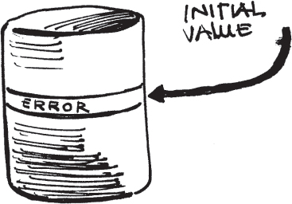

**[Figure 47](#c06.htm#fig6.47a)** Error recovery pattern language map

[Figure 47](#c06.htm#fig6.47) contains a language mapping of the patterns found in chapter 6.

> 图 47 包含了第 6 章中发现的模式的语言映射。

When an error is detected it must be isolated and prevented from spreading. During detection, steps can be taken as described in ERROR CONTAINMENT BARRIER (13). When recovery begins it should QUARANTINE (28) the erroneous part to prevent spreading. Error recovery done with the least loss of availability is done in a single-minded manner, CONCENTRATED RECOVERY (29).

> 当检测到错误时，必须隔离并防止其扩散。在检测过程中，可以根据 ERROR CONTAINMENT BARRIER(13)中的步骤采取措施。恢复开始时，应该隔离(28)有错误的部分以防止扩散。以最小的可用性损失进行错误恢复的方法是以单一的方式进行 CONCENTRATED RECOVERY(29)。

ERROR HANDLERS (30) are a common way to handle errors that occur during execution. They enable the collection of common error handling code in easy to maintain centralized locations. Many computer languages provide support for error handling mechanisms.

> 错误处理器(30)是处理执行期间发生的错误的常见方式。它们使得将常见的错误处理代码收集在易于维护的中央位置。**许多计算机语言提供支持错误处理机制。**

Error recovery returns the system to normal operation. After any active recovery, SOMEONE IN CHARGE (8) must decide from which point to continue execution. There are four basic places from which the execution can resume. The case that requires the longest to complete is to RESTART (31) the system and resume with a totally clean slate. In other cases execution can resume from a state close to the state that had the error. If the chance of repeating the error is low then a ROLLBACK (32) can be used. If the chances of repeating the error are high then ROLL-FORWARD (33) will be the most effective technique. In cases where the error was not in the primary application functions, for example when it is within the fault tolerance code, a RETURN TO REFERENCE POINT (34) is an effective technique.

> 错误恢复将系统恢复到正常运行状态。在任何主动恢复后，负责人(8)必须决定从哪一点继续执行。有四个基本的地方可以从中恢复执行。**最长完成的情况是重新启动(31)系统**，并从完全干净的状态开始。在其他情况下，可以**从接近出错状态的状态继续执行**。如果重复错误的可能性很低，则可以使用回滚(32)。如果重复错误的可能性很高，则回滚(33)将是最有效的技术。如果错误不是在主要的应用程序功能中，例如当它在容错代码中时，则返回参考点(34)是一种有效的技术。

> [!NOTE]
> 通过 DDS 中 QoS 策略保存数据，实现重新启动恢复状态

The possibility exists with most of these techniques that the system will become stuck in a loop of error/error recovery/continued execution/error … It is important to build in the mechanism to LIMIT RETRIES (35) to break this cycle.

> 有可能**使用大多数这些技术，系统会陷入错误/错误恢复/继续执行/错误的循环**中。重要的是**建立机制来限制重试(35)**以打破这个循环。

> [!NOTE]
> 系统要提供 break 的功能

When the system has REDUNDANT (3) elements a common form of error recovery is to FAILOVER (36) to the backup elements. Resumption of normal operations after a FAILOVER involves both deciding where to begin processing within the new active unit and also the restoration of internal saved state from CHECKPOINTS (37).

> **当系统有多余(3)个元素时，一种常见的错误恢复方法是切换(36)到备份元素。** 在切换后**恢复正常操作包括决定在新的活动单元中从哪里开始处理，以及从检查点(37)恢复内部保存的状态。**

> [!NOTE]
> 这讨论的就是状态问题！

Either the occurrence of an error, or the error recovery, frequently results in the loss of data. CHECKPOINTS (37) of system data help by enabling the return of data and system state to something between the time of the error and the initial state of the system. CHECKPOINTS are an effective technique, but lead to the need to decide WHAT TO SAVE (38); where to store it, REMOTE STORAGE (39); and when CHECKPOINTS should be taken, INDIVIDUALS DECIDE TIMING (40).

> 要么**发生错误，要么错误恢复，经常会导致数据丢失。** 系统数据的检查点(37)可以帮助恢复数据和系统状态到错误发生和系统初始状态之间的某个状态。**检查点是一种有效的技术，但需要决定什么要保存(38)；存储在哪里，远程存储(39)；以及何时进行检查点，个人决定时机(40)。**

> [!NOTE]
> 检查点技术

When it is the data that is faulty, a DATA RESET (41) might be initiated if the fault cannot be corrected.

> 如果数据出现故障，如果无法纠正故障，可能会启动数据重置(41)。

# 28. Quarantine

… The system has errors. The system element with the errors has been identified. It might be a particular software module that is continually producing errors, or it might be a hardware element that is incorrect.

> 系统出现了错误。已经确定了出现错误的系统元素。可能是一个持续产生错误的特定软件模块，也可能是一个不正确的硬件元素。

Every time the system is asked (or allowed) to perform work it responds with an error.

> 每次系统被要求(或允许)执行工作时，它都会出现错误。

The presence of an error poses the risk that the error will propagate, i.e. that the error will be the fault that stimulates an error in a different element.

> 存在错误的风险就是错误可能传播，也就是说错误可能会成为引发其他元素错误的原因。

The system consists of UNITS OF MITIGATION (1) that encapsulate the functionality of the system.

> 系统由减灾单元(1)组成，它封装了系统的功能。

---

**How can the system prevent errors from spreading?**

> **如何防止系统出错的传播？**

Information is passed between parts of the system through interfaces. When the information is erroneous it might activate a latent fault in the receiving part of the system. Even if it doesn’t activate a latent fault in the receiver, the receiving element might make incorrect decisions based on the error.

> 信息通过接口在系统的不同部分之间传递。当信息有误时，可能会在接收部分激活潜在的故障。即使没有激活接收部分的潜在故障，接收元件也可能基于错误做出不正确的决定。

A Babbling Idiot is an element that sends messages at the wrong time. A Babbling Idiot starts talking to its peers consistently and erroneously. These babbling elements must be isolated and kept from spreading incorrect information throughout the system. \[Kop97\]

> **一个唠叨的白痴是一个在错误的时间发送消息的元素。** 一个唠叨的白痴开始不断地与其同行者交谈，而且是错误的。这些唠叨的元素必须被隔离，**并且阻止它们将错误的信息传播到整个系统中去。** \[Kop97\]

The information interface might be a software interface between elements/methods/procedures. Or if the element is hardware then there is some sort of interface between it and the other parts.

> 信息界面可能是元素/方法/程序之间的软件界面。如果元素是硬件，那么它和其他部件之间有某种接口。

A common technique when designing the interface between potentially unreliable components is to place a parameter that gives an indication about whether the result should be ignored. If this indicator parameter is set to an unsafe value then the result should not be believed. This is similar to MARKED DATA (56)

> 一种在设计可能不可靠组件之间的界面时常用的技术是**放置一个参数，用以指示结果是否应被忽略**。如果这个指示参数被设置为不安全的值，那么结果不应该被相信。**这类似于标记数据(56)**

In the best case the faulty nodes which might be UNITS OF MITIGATION (1) can be isolated from the rest of the system and totally removed from all application processing. If it is not doing anything it can’t create errors that can spread. Well designed UNITS OF MITIGATION will fail silently, making the isolation simple.

> 在最佳情况下，可能是缓解单元(1)的故障节点可以被隔离出系统的其余部分，并完全从所有应用程序处理中移除。如果它没有做任何事情，就不能产生可以传播的错误。设计良好的缓解单元将无声地失败，使隔离变得简单。

The software or hardware element might _have_ to be included in the main application and therefore the system can’t isolate it. If the failing element must be involved in the computation, even though it has been deemed unreliable and as a consequence its result will not be used, you must then be concerned about side effects. What side effects might have happened when the element was performing its work? Did it send a message to another system? Did it alter memory? Did it change the system state? Side effects are difficult to undo.

> 软件或硬件元件可能必须包含在主应用程序中，因此系统无法将其隔离。如果坏掉的元件必须参与计算，即使它已被认定为不可靠，并且其结果不会被使用，则您必须关注副作用。当元件执行其工作时会发生什么副作用？它是否向另一个系统发送消息？它是否改变了内存？它是否改变了系统状态？副作用很难撤消。

The barrier around the faulty element must be impermeable so that not even side effects are permitted. Spacecraft will enter a ‘safe mode’ and wait for the involvement of ground personnel in situations where the on-board error processing mechanisms cannot handle the system. When in this mode they are quarantining the entire system to reduce the error propagation. This leaves the system in a known state for future ground-based corrective actions. \[Mor05\]

> 错误元件周围的屏障必须是不可渗透的，以便不允许出现任何副作用。当舱内的错误处理机制无法处理系统时，航天器将进入“安全模式”并等待地面人员的参与。在这种模式下，他们正在隔离整个系统以减少错误传播。这使得系统处于未来基于地面的纠正行动的已知状态。[Mor05]

Therefore,

**Establish a barrier around the element that prevents it from both contributing to the useful work and also prevents it from propagating its error into other parts of the system, see <a href="#c06.htm#fig6.48" id="c06.htm#fig6.48a">Figure 48</a>.**

> 在元素周围建立一道屏障，以阻止它既不能参与有用的工作，又不能将错误传播到系统的其他部分，请参见<a href="#c06.htm#fig6.48" id="c06.htm#fig6.48a">图 48</a>。

**[Figure 48](#c06.htm#fig6.48a)** Build a fence around the error

> 在错误周围建立一道围栏。

Parts of the system might be isolated in a Quarantine zone, meaning that the application is not totally available. Errors from a known-faulty UNITS OF MITIGATION (1) will not be propagated through the system. …

> 部分系统可能会被隔离在隔离区中，这意味着应用程序不完全可用。已知有故障的缓解单元(1)的错误不会被传播到系统中。...

# 29. Concentrated Recovery

… An error has been detected. Now is the time for the system to process the error. System state has been saved through a series of CHECKPOINTS (37).

> 一个错误已被检测出来。现在是系统处理错误的时候了。**系统状态已经通过一系列检查点(37)保存了下来。**

> [!NOTE]
> 这里讨论的问题是系统将错误的状态保存下来了

The system is required to be highly available. Minimizing recovery time increases availability.

> 系统需要具有高可用性。**最小化恢复时间可以提高可用性。**

> [!NOTE]
> 这是一个需求吧！可以

The system has a number of techniques that can recover the system and its applications. These include saving system state periodically through CHECKPOINTS (37) and restoring it in conjunction with a ROLLBACK (32), ROLL-FORWARD (33), and RETURN TO REFERENCE POINT (34). Mitigation tasks such as MARKED DATA (56) are also related.

> 系统有许多技术可以恢复系统和应用程序。这些技术包括**定期通过检查点(37)保存系统状态，并与回滚(32)、前进(33)和返回参考点(34)结合使用来恢复。标记数据(56)等缓解任务也有关联。**

> [!NOTE]
> 这里给出了一些状态恢复策略，值得研究

---

**When processing an error, how should the system minimize unavailability?**

> 当处理错误时，系统应该如何最小化不可用性？

The system should make the recovery as fast as possible. ‘Fast’ is in terms of the duration of the recovery. Time spent recovering is time that the applications are unavailable and is part of the application or system’s Mean Time To Repair.

> 系统应尽可能快地完成恢复。“快”是指恢复的持续时间。恢复的时间就是应用程序不可用的时间，是应用程序或系统的平均修复时间的一部分。

With well chosen UNITS OF MITIGATION (1), part of the system can be recovering from an error while other Units continue execution. When the UNIT OF MITIGATION is in something of which there is only one, the whole unit must participate in the recovery.

> 随着精心挑选的缓解单元(1)，部分系统可以在其他单元继续执行的情况下从错误中恢复。当缓解单元只有一个时，整个单元必须参与恢复。

Within a UNIT OF MITIGATION (1) the erroneous part that needs recovery or mitigation might not be the whole. This allows the possibility of the unit performing some non-recovery tasks during the error processing. Performing other work simultaneously with error processing introduces a number of risks.

> 在一个缓解单元(1)中，需要恢复或缓解的错误部分可能不是整体。这允许单元在错误处理期间执行一些非恢复任务。**同时执行其他工作与错误处理会带来一些风险。**

These are some of the risks. The application state will be subtly changing even while the system is recovering. For example, new requests will be arriving or common resources will be used by another task. Contention for resources will make the recovery take longer. The amount of time required for the recovery will vary, making prediction and analysis more difficult.

> 这些是一些风险。即使系统正在恢复，应用程序状态也会微妙地发生变化。例如，新的请求将会到达或其他任务将会使用共同的资源。争夺资源将使恢复时间变长。恢复所需的时间会有所不同，使得预测和分析变得更加困难。

To shorten the time of recovery the system should make its own recovery its primary task. If other tasks are unaffected by the error, lower their priority while recovery is underway to reduce the elapsed time for recovery.

> 为了缩短恢复时间，系统应将恢复作为自己的主要任务。如果其他任务不受错误的影响，在恢复过程中降低他们的优先级，以减少恢复所需的时间。

The trade off here is between the speed of recovery and the handled workload. Speed of recovery is measured in unavailability while the handled workload is measured in terms of system throughput and revenue.

> 这里的**权衡是恢复速度和处理的工作量之间的权衡**。**恢复速度以不可用性来衡量**，而处理的工作量则以系统吞吐量和收入来衡量。

> [!NOTE]
> 作为 QoS 的参数？

Deferring work that is arriving will require that it be dropped and ignored totally, or that it be buffered for future processing. The length of time for the recovery action defines which of these is needed. In most systems both capabilities will be implemented. Dropping the arriving work is a way to SHED LOAD (49). Several patterns including FRESH WORK BEFORE STALE (55) and QUEUE FOR RESOURCES (46) describe how the queued requests should be handled.

> **延迟到达的工作将需要完全丢弃和忽略，或者将其缓冲以备将来处理。** 恢复操作所需的时间定义了需要哪一种。在大多数系统中，这两种功能都将实现。丢弃到达的工作是一种减轻负载(49)的方法。包括“新工作优先于旧工作(55)”和“为资源排队(46)”在内的几种模式描述了如何处理排队的请求。

> [!NOTE]
> 当有一次出现延迟，但是还没有超时的时候，就可以马上启用备份节点了
> 可以直接将 ownership 的优先级直接提升到同等程度，等待超时，直接 kill 失效节点，这样节约了修改时间

If the system is concentrating on recovery it might appear dead to its observers. Be certain to periodically let the connected systems know that recovery is underway and that requests will either be queued for later processing or discarded. The FAULT OBSERVER (10) can perform the notification.

> 如果系统正在集中精力恢复，它可能对观察者来说看起来已经死亡。确保定期让连接的系统知道恢复正在进行中，请求将被排队等待后续处理或被丢弃。故障观察器(10)可以执行通知。

Therefore,

**Focus all necessary resources on the recovery task so that the recovery time can be minimized. See <a href="#c06.htm#fig6.49" id="c06.htm#fig6.49a">Figure 49</a>.**

> 集中所有必要资源用于恢复任务，以便尽可能缩短恢复时间。参见<a href="#c06.htm#fig6.49" id="c06.htm#fig6.49a">图 49</a>。

**[Figure 49](#c06.htm#fig6.49a)** Restrict other work during recovery

There should be SOMEONE IN CHARGE (8) making sure that the CONCENTRATED RECOVERY succeeds and doesn’t cause other failures. A QUARANTINE (28) around the recovering task should be created.

> 应该有一个负责人(8)确保集中恢复成功，不会导致其他失败。应该在恢复任务周围创建一个隔离区(28)。

Extra work that can prevent error propagation (LIMIT RETRIES (35)) _should_ be done during restoration. For example, incrementing error counters, notifying the FAULT OBSERVER (10) and supporting the actions of SOMEONE IN CHARGE (8) should be done. …

> 预防错误传播的额外工作(限制重试(35))应该在恢复期间完成。例如，增加错误计数器，通知故障观察(10)并支持负责人(8)的行动应该完成。…

# 30. Error Handler

… The system has detected an error in execution. This error affects the overall control flow, and normal processing cannot continue unless some actions are taken.

> 系统检测到执行中出现错误。这个错误影响了整体控制流程，除非采取一些措施，否则无法继续正常处理。

**Developing and maintaining application code is complicated by the need to process errors.**

> **开发和维护应用程序代码因需要处理错误而变得复杂。**

Error handling is non-productive work done by the system. It counts as time during which the application is unavailable. CONCENTRATED RECOVERY (29) might be fast, but it adds up and reduces overall availability.

> 错误处理是系统所做的无效工作。它被计算为应用程序不可用的时间。**集中恢复(29)可能很快，但会累积并降低整体可用性。**

> [!NOTE]
> 也可以作为一个错误恢复的 QoS

When handling an error the system should stop error propagation, correct or mitigate the effects of the error, and report to the FAULT OBSERVER (10). This is all possible within the main application flow through the use of conditional branches. Since there are common actions that need to be taken for all errors it makes sense to set the common actions aside in a separate place.

> 当处理错误时，系统应停止错误传播，纠正或减轻错误的影响，并向故障观察者(10)报告。通过使用条件分支，这一切都可以在主应用流程中完成。由于所有错误都需要采取共同的操作，因此将共同的操作放在单独的地方是有意义的。

When the same error can occur at multiple places in the same program, separating and reusing the handler minimizes overall code size. It also reduces the risk of updating only some of the local error handling blocks of code if a global change becomes necessary. The need to make the same change in multiple locations requires a significant maintenance effort and can easily introduce fault into the software.

> 当同一个错误可以在同一个程序的多个地方发生时，分离和重用处理程序可以最大限度地减少整体代码大小。如果需要进行**全局更改，这也会减少更新局部错误处理代码块的风险。在多个位置进行相同的更改需要大量的维护工作，并且很容易在软件中引入错误。**

> [!NOTE]
> 优先使用全局？

Separating out the error handling logic into separate parts introduces the problem of correctly treating the context of each place that detects the error and invokes the handler. Each will be slightly different from the other places. The error handler must be able to correctly perform all the ‘clean-up’ tasks for all of the places from which it might be called. This requires careful planning to avoid coupling the error handler too tightly with the programs that invoke it.

> 将错误处理逻辑分离到不同的部分会引入一个问题，即正确处理每个检测到错误并调用处理程序的上下文。每个地方都会有所不同。**错误处理程序必须能够正确执行所有“清理”任务，以便从调用它的程序中获得最佳效果。** 这需要仔细计划，以**避免将错误处理程序与调用它的程序过于紧密耦合。**

The time spent processing errors is time not spent on the main functionality. Not every error that your program detects should be sent to an error handler. If something can easily be corrected in place locally and normal processing resumed, do that. Use an error handler when normal processing cannot be resumed for some reason.

> 处理错误所花费的时间不是用在主要功能上的时间。不是每个程序检测到的错误都应该发送到错误处理程序。如果可以在当地轻松纠正并恢复正常处理，就这样做。**如果由于某种原因无法恢复正常处理，请使用错误处理程序。**

Many languages support the concept of exceptions and error handling. When an error is detected an exception is raised. This exception marks the fact that normal processing cannot continue and that something special must be done to correct the situation. The special processing is done by the error handler. Similarly, RECOVERY BLOCKS (4) generally provide a final choice when none of the blocks completes successfully. The final choice when the others all fail is the error handler.

> **当检测到错误时，会抛出一个异常。** 这个异常标志着正常处理无法继续，必须采取一些特殊措施来纠正情况。特殊处理是由错误处理程序完成的。类似地，RECOVERY BLOCKS(4)通常提供一个最终的选择，当其他块都没有成功完成时。当其他都失败时的最终选择是错误处理程序。

> [!NOTE]
> 感觉这个是从编程语言上对用户的要求，不知道是否可以添加到框架中
> 或者是系统层面的提供？

When handling of the error completes, pass control back to the application, which must be able to resume execution. The invocation of the error handler occurs as soon as error detection occurs, or should it be deferred and started later? This issue depends very heavily on the situation and the source of the error. Reducing the risk of error propagation should be foremost in your mind as you design the mechanism.

> 当处理错误完成后，将控制权返回给应用程序，应用程序必须能够恢复执行。一旦发生错误检测，就会调用错误处理程序，或者应该推迟并稍后开始？这个问题主要取决于情况和错误的来源。在设计机制时，应该首先考虑**降低错误传播的风险。**

> 集成 DDS 的 QoS？
> 使用之前的数据？

Sometimes the error detection mechanisms will detect errors that are trivial within the context where they were found. For example, an error from a file reading function might be an error or it might just be a signal that reading is completed. The interpretation depends on the context. In situations where the error is not really an error, the error handler should be able to distinguish this fact and allow execution to resume with only minimal action. In these trivial cases the error should not be reported to the FAULT OBSERVER (10) and the overhead of a separate error handler is not required. Cases of trivial or inconsequential errors should be handled by the detecting program inline and should not invoke the error handler.

> 有时候，错误检测机制会检测到在它们被发现的上下文中微不足道的错误。例如，从文件读取函数中发生的错误可能是一个错误，也可能只是读取完成的信号。解释取决于上下文。在错误实际上不是错误的情况下，错误处理程序应该能够区分这一事实，并允许执行仅仅采取最小行动就能恢复。在这些微不足道的情况下，错误不应该报告给故障观察器(10)，不需要单独的错误处理程序。微不足道或无关紧要的错误应该由检测程序内联处理，而不应调用错误处理程序。

Therefore,

**Separate error processing code in special handling blocks for easier maintenance and to facilitate new handlers being added in the future, <a href="#c06.htm#fig6.50" id="c06.htm#fig6.50a">Figure 50</a>.**

> 将错误处理代码分离到特殊处理块中，以便于更容易维护，并且可以方便地在将来添加新的处理器，<a href="#c06.htm#fig6.50" id="c06.htm#fig6.50a">图 50</a>。

**[Figure 50](#c06.htm#fig6.50a)** Handle the error in an error handler

> **处理错误的时候要在错误处理程序中处理(参见图 50)**

An error handler can process errors from across different parts of the system, centralizing its handling.

> 错误处理程序可以处理来自系统不同部分的错误，集中处理它们。

Some languages, such as C++ and Java, have predefined language constructs to support exceptions. Even if language support is not available, the system can mimic this behavior. Do not ignore exceptions that happen. Design the system to process them.

> 一些语言，如 C++和 Java，有预定义的语言结构来支持异常。**即使没有语言支持，系统也可以模仿这种行为。** 不要忽略发生的异常。设计系统来处理它们。

> [!NOTE]
> 这个可以放在后面来做
> 看这个思路就是可以通过框架来提供

The error has been contained. Execution must continue from somewhere. In many cases it can resume at or near the point of error. Errors processed by a catch block are examples of this. Sometimes execution should return to a place right before the error occurred to retry the action that produced the error, being careful to LIMIT RETRIES (35). For example, for some of the errors possible from a database transaction retrying is the correct next step. Return to a point before the error occurred through a ROLLBACK (32) and the restoration of a CHECKPOINT (37). Resuming execution with minimal disruption is more likely if the error processing code resides within the same module as the point of detection.

> **错误已被控制。执行必须从某处继续。** 在许多情况下，它可以**从错误点或附近继续执行**。由catch块处理的错误就是这种情况。有时，执行应该返回到发生错误之前的位置，以重试产生错误的操作，并小心限制重试(35)。例如，对于数据库事务可能出现的一些错误，重试是正确的下一步。通过回滚(32)和检查点(37)的恢复，返回发生错误之前的点。如果错误处理代码位于与检测点相同的模块中，则更有可能以最小的干扰恢复执行。

Some errors that have affected major parts of the system make the choice of where to return to for normal execution unclear. For example, where should execution continue after an error involving a missing method or function is encountered? The system could immediately skip to some safe place, using a technique such as ROLL-FORWARD (33), or RETURN TO REFERENCE POINT (34). This would stop the control flow and prevent the error from propagating down the normal control path.

> 一些影响系统主要部分的错误使得选择回到哪里执行正常程序变得不清楚。例如，**遇到缺少方法或函数的错误时，执行应该继续到哪里？系统可以立即使用诸如 ROLL-FORWARD(33)或 RETURN TO REFERENCE POINT(34)之类的技术跳转到某个安全的地方。** 这将停止控制流并防止错误继续沿着正常的控制路径传播。

If there are resources that need to be ‘cleaned up’ and released from the task that has had an error, use FINAL HANDLING (50). …

> **如果有资源需要从出错任务中清理和释放出来，请使用 FINAL HANDLING (50)。**

# 31. Restart

… The error is really bad. None of the other mechanisms to recover from the error are appropriate.

> **这个错误太糟糕了。没有其他机制可以从错误中恢复。**

ESCALATION (9) has resulted after the other possible ways of recovery are tried but have failed to recover the system.

> 经尝试其他恢复系统的可能方法而未能恢复系统后，升级(9)已发生。

---

**How can execution resume when recovery from the error is not possible?**

> 当无法从错误中恢复时，如何继续执行？

> [!NOET]
> 这个就是最极端的情况了

Some errors require very drastic action. The SOMEONE IN CHARGE (8) might have overseen a series of ESCALATION (9) steps, but none of the steps resolved the error. This is a truly persistent fault.

> 有些错误需要采取非常严厉的行动。负责人可能已经监督了一系列的升级步骤，但是没有一个步骤解决了错误。这是一个真正持久的故障。

Restarting the application can resolve the error if the fault is in the application. If the fault is in the underlying hardware or operating system/middleware layers then the application restart will not help.

> **重新启动应用程序可以解决错误，如果错误在应用程序中。** 如果故障在底层硬件或操作系统/中间件层，那么重新启动应用程序将无济于事。

Many techniques such as ROLLBACK (32) and ROLL-FORWARD (33) recover the application by moving it to an error free state along the normal execution path. In some cases a RETURN TO REFERENCE POINT (34) is the appropriate state transition because it breaks (or usually breaks) from the error’s execution path to a pre-determined safe place. The point of initialization is a pre-determined safe place for most applications and systems. ESCALATION (9) needs additional actions to try when these techniques don’t work.

> 许多技术，如回滚(32)和向前滚动(33)，可以通过沿着正常执行路径将应用程序移动到错误免疫状态来恢复。在某些情况下，**返回参考点(34)是适当的状态转换，因为它从错误的执行路径中断(或通常中断)到预先确定的安全位置。** 初始化点对于大多数应用程序和系统来说是一个预先确定的安全位置。如果这些技术不起作用，升级(9)需要采取额外的行动。

The system must return to service quickly after the recovery actions, so restarts shouldn’t be performed frequently if they take long periods of time. Different levels of recovery can be implemented that take different amounts of time. A ‘cold’ restart level will initialize everything as though it were the initial power-on of the system after a potentially unclean shutdown. Extra checks to ensure that the file system is in the proper state might be required as part of a cold restart. A ‘warm’ restart can restore the system to an initial value but skip certain lengthy steps. This relies on the assumption that the skipped steps are not needed based upon system state, for example that the file system is intact and does not need to be checked.

> 系统在恢复操作完成后必须迅速恢复服务，因此如果重新启动需要花费较长的时间，就不应该频繁进行重新启动。可以实施不同级别的恢复操作，耗时不同。**“冷”重新启动**将把一切恢复到可能是不干净关机后的初始电源开启状态。可能需要执行额外的检查，以确保文件系统处于正确的状态，作为“冷”重新启动的一部分。**“暖”重新启动**可以将系统恢复到初始值，但跳过某些较长的步骤。这依赖于基于系统状态跳过步骤是不需要的假设，例如文件系统完整，不需要进行检查。

> [!NOTE]
> 冷暖重新启动

Sometimes the restarts can be done at a very fine level, targeting specific tasks or portions of tasks, for example, restarting only small groups of Java containers in an application server environment. This technique is very effective against transient errors. If the restart does not succeed in recovering then ESCALATION (9) to restarts of larger groups is possible. In order for this to be successful the error detection mechanisms must be able to isolate the fault to a very small part of the system. \[CBF+04\]

> 有时**重新启动可以以非常精细的级别完成**，针对特定任务或任务的部分，例如，只重新启动应用服务器环境中的小组 Java 容器。这种技术对暂时性错误非常有效。如果重新启动不能成功恢复，则可以升级(9)到更大组的重新启动。为了使这项工作成功，错误检测机制必须能够将故障隔离到系统的一小部分。[CBF + 04]

> [!NOTE]
> 好的探测机制可以减少重启的时间
> 将重启的时间进行重迭，比如指定一个 QoS，当出现一次失效的时候，还没有超出超时时间
> 这个时候如果指定了对应的策略，可以通过冗余框架的能力对应用设置低优先的权限，直接启动
> 这样的好处是可以节省对节点备份的数量，算是一种动态调整策略
> 并且另一个才能免

Therefore,

**Restart the system. Suffer the loss of time and state to reinitialize and restart the application from the beginning, <a href="#c06.htm#fig6.51" id="c06.htm#fig6.51a">Figure 51</a>.**

> **重启系统。承受时间和状态的损失，从头开始重新初始化和重新启动应用程序，如<a href="#c06.htm#fig6.51" id="c06.htm#fig6.51a">图 51</a>所示。**

**[Figure 51](#c06.htm#fig6.51a)** Restart from the beginning

The decision to take this action is something that should be done by SOMEONE IN CHARGE (8) as a CONCENTRATED RECOVERY (29). The actions should be reported to the FAULT OBSERVER (10) so that the outside world can be informed that the action is happening. A SYSTEM MONITOR (15) can watch the recovery action to make sure that it starts and finishes as planned.

> 这一行动的决定应由负责人(8)作为集中式恢复(29)来做。这些行动应向故障观察者(10)报告，以便外界得知此行动正在进行。系统监视器(15)可以监视恢复行动，以确保其按计划启动和完成。

Restarting execution is frequently needed in conjunction with a FAILOVER (36) to redundant units.

> **重新启动执行经常需要与故障转移(36)到冗余单元一起使用。**

CHECKPOINTS (37) enable state to be advanced rapidly to one that is close to the time of the error. A system RESTART followed by restoring from a saved CHECKPOINT quickly gets the system close to the state at the time of an error.

> 检查点(37)可以使状态迅速提升到接近错误发生时的状态。系统重新启动后，通过恢复保存的检查点可以快速使系统接近错误发生时的状态。

Sometimes it is useful to have different levels of RESTART. Each level takes a differing amount of time, which enables the most appropriate one to be used to minimize recovery time. These can correspond to different states. Typically the different levels will take differing amounts of time and be more and more drastic. The different levels are sometimes given names such as warm, cold, reload and reboot to indicate their severity. \[Utas05\] This gives ESCALATION (9) the opportunity to try less dramatic and shorter RESTARTS first.

> 有时候有**不同级别的重启是有用的**，每个级别需要花费不同的时间，以最大程度减少恢复时间。这些可以对应不同的状态。 通常不同的级别会花费不同的时间，并且越来越严重。 不同的级别有时被给予名称，如**温暖，冷，重新加载和重新启动，以表明其严重程度。** \ [Utas05 \] 这给了升级(9)机会先尝试不那么激烈和较短的重启。

> [!NOTE]
> 这个可以很好的用于 QoS 的指标

An example of varying severity RESTARTS from the 4ESS™ Switch is shown in <a href="#c06.htm#tab6.2" id="c06.htm#tab6.2a">Table 6.2</a>. …

> 一个 4ESS™ 交换机的可变严重性重启的示例见<a href="#c06.htm#tab6.2" id="c06.htm#tab6.2a">表 6.2</a>...

[**Table 6.2**](#c06.htm#tab6.2a) 4ESS™ Switch restart levels \[CCR+77, pp 1117–1118\]

**RECOVERY ACTIONS** **ACTIONS TAKEN**

Phase 1 Software initialization only. Initialize many system variables and RETURN TO REFERENCE POINT (34) (The post recovery processing). No application (Call Processing) impact.
Phase 2 Hardware initialization only. Restart certain key (and problematic) hardware components. Perform only minor software initialization. Call Processing saves work in progress.
Phase 3 Hardware and software initialization. Call processing saves work in progress.
Phase 4 Only initiated manually. Hardware and software initialization. All application state is lost.

> 首先只进行第一阶段的软件初始化。初始化许多系统变量，然后返回参考点(34)(恢复后的处理)。没有应用(呼叫处理)的影响。
> 第二阶段仅进行硬件初始化。重新启动某些关键(和有问题)的硬件组件。仅进行少量的软件初始化。处理保存正在进行中的工作。
> 第三阶段硬件和软件初始化。呼叫处理可以保存正在进行的工作。
> 第四阶段仅可手动启动。硬件和软件初始化。所有应用程序状态都会丢失。

---

# 32. Rollback

… An error has occurred and recovery is now complete. The ERROR HANDLER (30) has completed execution, if there is one in the system. The system is in a context where accuracy is very important, and no bit of incoming information can be ignored. For example no request, incoming message, transaction or sensor input should be ignored.

> 出现错误，恢复已完成。如果系统中有错误处理器(30)，则已完成执行。系统处于精确性非常重要的情况下，没有一点传入信息可以被忽略。例如，**不应忽略任何请求、传入消息、交易或传感器输入**。

Requests that were begun or that arrived between when the error occurred and recovery is completed should have an attempt to be thoroughly processed.

> 请求在出错发生和恢复完成期间发起或到达的，应尽力进行彻底处理。

---

**Where should processing resume after error recovery?**

> 在错误恢复后，应该在哪里继续处理？

In some kinds of systems that are receiving incoming requests, the requests cannot afford to be missed. They might contain critical bits of telemetry data, or financial information that cannot be lost.

> 在接收传入请求的某些系统中，不能错过请求。它们可能包含关键的遥测数据或金融信息，**这些信息不能丢失。**

The system will need to be returned to a known place in its execution where the components are synchronized. The point where a new work request is begun is an example of a synchronization point where the system is ready to work on the new request.

> 系统需要回到一个已知的执行位置，在这里组件同步。开始一个新的工作请求的点是一个同步点，系统在这里准备处理新请求。

If a CHECKPOINT (37) is available then the system state can be restored to the one that it was in at the point to which the rollback will proceed. The timing of the CHECKPOINT defines the rollback points. If there are no checkpoints then the rollback should take processing back to right before the last requests were started. Requests should be saved until completed so that if a rollback occurs the requests still exist and can be processed again.

> 如果有可用的检查点(37)，则系统状态可以恢复到回滚将要进行的点时的状态。检查点的时机定义了回滚点。如果没有检查点，则回滚应将处理恢复到上次请求开始之前。请求应该一直保存，直到完成，这样如果发生回滚，请求仍然存在，可以重新处理。

When the system state is rolled back some work will be done twice, once before the error and once afterwards. Care must be taken to ensure that side effects of this repeated work does not cause new problems. Redoing some of the work prevents rolling back from being a useful solution in some hard real-time applications, where deadlines might be missed when work is redone.

> 当系统状态回滚时，有些工作会被重复做两次，一次在错误发生之前，一次在之后。必须小心确保这种重复工作的副作用不会导致新的问题。在一些硬实时应用中，重新做一些工作会阻止回滚成为一个有用的解决方案，因为在重新做工作时可能会错过期限。

The assessment of what will be lost by skipping requests can be ignored if a rollback is performed. This is unlike the case of a ROLL-FORWARD (33).

> 跳过请求所会损失的评估可以忽略，如果执行回滚操作。这与 ROLL-FORWARD(33) 情况不同。

Depending upon what system state will be restored during the ROLLBACK there is the chance that the error will reoccur. LIMIT RETRIES (35) discusses the problem of preventing repeating a cycle of errors and error recovery.

> 根据 ROLLBACK 期间将恢复的系统状态，错误可能会再次发生。LIMIT RETRIES(35)讨论了防止重复错误和错误恢复循环的问题。

Therefore,

**Return to a point where processing can be synchronized that is before the point of error, <a href="#c06.htm#fig6.52" id="c06.htm#fig6.52a">Figure 52</a>. Tread carefully to LIMIT RETRIES (35).**

> 回到一个可以同步处理的点，也就是错误点之前，<a href="#c06.htm#fig6.52" id="c06.htm#fig6.52a">图 52</a>。谨慎操作以限制重试次数(35)。

**[Figure 52](#c06.htm#fig6.52a)** Return to an earlier time

The decision to take this action is something that should be done by SOMEONE IN CHARGE (8) as a CONCENTRATED RECOVERY (29). The actions should be reported to the FAULT OBSERVER (10) so that the outside world can be informed that the action is happening. A SYSTEM MONITOR (15) can watch the recovery action to make sure that it starts and finishes as planned.

> 决定采取此行动的人应该由负责人(8)作为集中式恢复(29)。行动应报告给故障观察者(10)，以便外界能够知道行动正在发生。系统监视器(15)可以监视恢复行动，以确保其按计划启动和完成。

If ROLLBACKS aren’t succeeding in returning the system to normal operation, be careful to not get stuck trying, see LIMIT RETRIES (35). If a ROLLBACK does not succeed, ROLL-FORWARD (33) is a step that ESCALATION (9) can take.

> 如果回滚无法使系统恢复正常运行，要小心不要滞留在尝试过程中，参见限制重试(35)。如果回滚不成功，升级(9)可以采取向前滚动(33)步骤。

Sometimes so much has happened that the system can’t tell where to ROLLBACK to, but ROLL-FORWARD (33) is not appropriate either. In these cases the system should have REFERENCE POINTS that it can RETURN TO (34).

> 有时发生了太多事情，系统无法**确定要回滚到哪里**，但是向前滚动也不合适。在这种情况下，系统应该有参考点，可以返回。

> [!NOTE]
> 回滚到哪里确实也是一个很重要的能力
> 专利？动态回滚？

There are some things that the system can do to restart the transaction. It might need to restore from a CHECKPOINTED (37) state to achieve the state before the error occurred. What the stable points are that should be rolled back to help define when to actually take a CHECKPOINT, as discussed in INDIVIDUALS DECIDE TIMING (40) …

> 系统可以做一些事情来重新启动交易。可能需要从检查点(37)状态恢复，以达到错误发生前的状态。应该回滚到什么稳定点来定义何时进行检查点，就像在个人决定时机(40)中所讨论的那样...

# 33. Roll-Forward

… An error has occurred. The ERROR HANDLER (30), if employed, has now completed execution; error recovery has been completed.

> 出现了一个错误。如果使用了错误处理器(30)，它现在已经执行完毕；错误恢复已经完成。

Ignoring or mishandling a few requests that arrive between the time of error and the time of restarting is acceptable. The message stream might include killer messages that need to be avoided and not processed.

> 忽略或不当处理错误发生后到重新启动之间收到的一些请求是可以接受的。**消息流中可能包含需要避免处理的致命消息。**

> [!NOTE]
> 跳过一些错误

**Where should processing resume after error recovery?**

> 在错误恢复后，处理应该从哪里继续？

The system can return to the point of the error after error recovery. But the processing context was interrupted by the error and its processing. If CHECKPOINTS (37) are being made, there will be one closest to the time of the error, but it will not be precisely at the time of the error. The risk of starting a cycle of errors and error processing is great unless something has changed in the context. Eliminating a killer message from a buffer or setting an execution flag to indicate there has already been an error in this section are two changes to the context that can be made.

> 系统在错误恢复后可以返回到错误发生的点。但是由于错误和处理过程，处理上下文被中断了。如果做了 CHECKPOINTS(37)，最接近错误发生时间的点将会被记录，但不会完全精确到错误发生的时间。如果没有改变处理上下文，很可能会引发一系列的错误和错误处理。可以做的改变有：**从缓冲区中消除致命信息，或者设置一个执行标志来表示这一节已经发生了错误。**

In some cases returning to the point of error will be appropriate. For example, if the point of error processed a sensor reading that arrives periodically, it will be safe to return to that point and wait for the next reading to arrive. Similarly, if the design of the system prevents any killer messages in the input stream from still being present, returning to the site of the error will be safe.

> 在某些情况下，返回到错误点是合适的。例如，如果错误点处理了定期到达的传感器读数，回到那里等待下一个读数到达是安全的。同样，如果系统的**设计防止输入流中仍存在致命消息**，返回到错误点是安全的。

Not all system designs provide for low risk of repeating the error when returning to the place of the error. And even with careful placement of the error reporting and handling mechanisms sometimes returning is not the right thing to do.

> 不是所有的系统设计都能提供低风险的重复错误回到错误发生的地方。即使精心放置错误报告和处理机制，**有时候回到错误发生的地方也不是正确的事情。**

Returning to the point of the error, or to a ROLLBACK (32) point before the error can result in work being done twice or incompletely. Advancing to a point where all of the related application and system tasks can be resynchronized and where they can all proceed forward from is desirable. This can be accomplished faster than a ROLLBACK (32) that involves redoing some work. This in turn makes rolling forward appropriate for hard real-time systems.

> 回到错误点，或者在错误发生之前的回滚(32)点，可能会导致工作被重复执行或不完整。**最好的情况是要求所有相关的应用程序和系统任务都能够重新同步，并且他们都能够继续前进。** 这比回滚(32)要快，因为它不需要重新做一些工作。这反过来又使得向前滚动适用于实时系统。

> 还要关联相关的应用的处理，状态信息等等

Many fault tolerant systems are event driven. This means that they are responding to external stimuli, such as incoming web service requests or transaction requests. In these cases a safe thing to do is to advance to the point where the next stimulus is to be received. In other words totally ignore the transactions that were being processed when the error was detected. Of course this does not work if the transaction cannot be ignored. For example if it was crediting a bank account then obviously the transaction cannot be merely ignored. In this case ROLLBACK (32) is appropriate.

> **许多容错系统是事件驱动的。** 这意味着它们对外部刺激做出反应，比如传入的网络服务请求或事务请求。在这种情况下，一件安全的事情要做就是前进到接收下一个刺激的地方。换句话说，完全忽略在检测到错误时正在处理的事务。当然，**如果事务不能被忽略**，这就行不通了。例如，如果它是为银行账户充值，那么显然事务不能被单纯忽略。在这种情况下，**ROLLBACK(32)是合适的。**

> [!NOTE]
> 这里给出了不能忽略的情况，那么就回滚呗

Before a roll-forward can be made, the damage caused by the error must be assessed to be certain that the point being advanced to will be valid. Only if the damage has been mitigated, or will be obviated by the jumping forward, can moving to a forward state be safely done. This is to prevent propagation and the repeating of the error, LIMIT RETRIES (35).

> 在进行回滚之前，必须评估错误造成的损害，以确保前进的点是有效的。只有在损害已经缓解，或者将通过跳跃而被消除时，才能安全地进入前进状态。这是为了防止传播和重复错误，限制重试(35)。

The ERROR HANDLER (30) is a useful way to manage rolling forward.

> **错误处理器(30)是一种有用的方式来管理滚动前进。**

Therefore,

**Advance to the next point where the processing across the system can be synchronized. Do not resume execution from the point of error; continue as though the erroneous actions did not complete (or did complete successfully), <a href="#c06.htm#fig6.53" id="c06.htm#fig6.53a">Figure 53</a>.**

> 前进到下一个点，在该系统中可以同步处理。**不要从错误点恢复执行；**继续，就像错误的操作没有完成(或已经成功完成)一样，<a href="#c06.htm#fig6.53" id="c06.htm#fig6.53a">图 53</a>。

**[Figure 53](#c06.htm#fig6.53a)** Move past the error

In an event driven system rolling forward causes the system to ignore the rest of the current stimuli, discarding it, and jumping to the point in execution where the next stimuli is received to be processed.

> **在一个事件驱动的系统中，向前滚动会导致系统忽略当前刺激的其余部分，丢弃它，并跳转到下一个刺激被接收并处理的执行点。**

The decision to take this action is something that should be done by SOMEONE IN CHARGE (8) as a CONCENTRATED RECOVERY (29). The actions should be reported to the FAULT OBSERVER (10) so that the outside world can be informed that the action is happening. A SYSTEM MONITOR (15) can watch the recovery action to make sure that it starts and finishes as planned.

> 这项行动的决定应由负责人做出(8)，以实现集中式的恢复(29)。这些行动应向故障观察者(10)报告，以便外界得知此行动正在发生。系统监控(15)可以监视恢复行动，以确保其按计划开始和结束。

The system’s state is a future state that would have been encountered eventually if the error had not occurred. The effects of the error have been mitigated and masked so that the error state is not visible. …

> 系统的状态是一个未来的状态，如果没有发生错误，最终将会遇到。错误的影响已经得到缓解和掩盖，因此错误状态不可见。...

# 34. Return to Reference Point

… Something very wrong has happened. The system wants to recover from the error, but it is unclear where it should resume.

> 出了很大的错误。系统想要从错误中恢复，但**不清楚应该从哪里开始恢复**。

It frequently occurs when an error is detected in an execution flow that is not part of application processing. For example this occurs when an error occurs during support processing such as maintenance or error processing. In these cases a ROLLBACK (32) to a point in the execution flow is not helpful because that is not the main application flow. A ROUTINE AUDIT (24) is an example of processing outside the normal application that could encounter latent faults.

> 当检测到不属于应用程序处理的执行流程中出现错误时，经常会发生这种情况。例如，当维护或错误处理等支持处理过程中出现错误时，会发生这种情况。在这些情况下，**回滚(32)到执行流程的某个点并不能起到帮助**，因为那不是主要的应用流程。例如，常规审计(24)是一种超出正常应用的处理，可能会遇到潜在的故障。

Some errors are so bad that neither ROLLBACK (32) nor ROLL-FORWARD(33) are the appropriate actions, but not quite so bad that RESTART (31) is needed. The error is insidious but can be contained so that it does not jeopardize future actions or result in error propagation. The system is designed to LIMIT RETRIES (35).

> 一些错误非常严重，以至于既不需要回滚(32)，也不需要向前滚动(33)，但也不至于需要重新启动(31)。该错误很阴险，但可以被控制，以免危害到未来的行动或导致错误传播。系统设计时限制重试(35)。

**Where can execution resume when an error occurs that can be recovered but for which the recovery does not provide appropriate ROLLBACK (32) or ROLL-FORWARD(33) places?**

> 当发生可以恢复但恢复不能提供适当回滚(32)或滚动转发(33)位置的错误时，可以在哪里恢复执行？

Sometimes, as in the example of a ROUTINE AUDIT (24), ROLLBACK (32) does not help because the application does not need the audit code to be rerun at the point rolled back to. The application will benefit from returning directly to application processing. Similarly ROLL-FORWARD (33) to the end of the audit code helps execution of the audit code continue, not the application. In some cases though simply rolling forward does not take the system to an appropriate place.

> 有时，就像在常规审计(24)的例子中一样，回滚(32)无济于事，因为应用程序不需要在回滚到的点上重新运行审计代码。应用程序将从直接返回到应用程序处理中受益。同样，向审计代码的末尾滚动前进(33)可以帮助审计代码继续执行，而不是应用程序。但是，在某些情况下，仅仅向前滚动并不能将系统带到一个合适的位置。

A RESTART (31) can solve the problem well but errors in support processing don’t mean that the application needs to be restarted from the beginning. However, a RESTART takes time and affects the whole system. The error can be mitigated and execution resumed without incurring the penalty of time and state that a RESTART incurs.

> 重新启动(31)可以很好地解决问题，但支持处理中的错误并不意味着应用程序需要从头开始重新启动。但是，重新启动需要时间，会影响整个系统。可以减轻错误并恢复执行，而不会产生重新启动所带来的时间和状态的惩罚。

Reference points are not the same as ROLLBACK (32) points. The places that execution might return in a ROLLBACK scenario are places from which execution can continue because they contain completely coherent states without the error, for example the point at which the most recent CHECKPOINT (37) was saved. ROLLBACK points are dynamic, that is they are created during execution such as when state is saved, and they change with time. Because they are dynamic, determining to which ROLLBACK point execution should continue is determined when the ROLLBACK is needed.

> **参考点和回滚(32)点不同。在回滚情况下执行可能返回的位置是包含完全一致状态而没有错误的位置，例如最近保存的检查点(37)。** 回滚点是动态的，也就是说它们是在执行过程中创建的，比如当状态被保存时，它们会随时间变化。由于它们是动态的，因此当需要回滚时，确定执行应该返回到哪个回滚点是需要确定的。

Reference points, on the other hand, are static and are always available as recovery points. They are created at design time. One or more reference points are created for any given module. Most tasks will have some point relative to their own execution that is a safe place. In many cases this is the place where the task is just about to enter its own initialization stage, or is just exiting its own initialization stage. These make good reference points. Another potential reference point is at the point where the support task is about to return to the main application.

> **参考点另一方面，是静态的，总是可以作为恢复点。**它们是在设计时创建的。每个模块会创建一个或多个参考点。大多数任务都会有一个与其执行相关的安全点。在许多情况下，这是任务刚刚进入自己的初始化阶段，或刚刚离开自己的初始化阶段的地方。这些都是很好的参考点。另一个潜在的参考点是支持任务即将返回主应用程序的地方。

> [!NOTE]
> 这里给出了静态和动态的概念，划分的更细致了，很好
> 比如一个完整备份的基础版本，之后是增量版本

Therefore,

**Resume execution at a point that is known to be safe, and from which normal execution can resume, <a href="#c06.htm#fig6.54" id="c06.htm#fig6.54a">Figure 54</a>.**

> **从已知可安全执行的点开始恢复执行，从那里可以恢复正常执行，参见<a href="#c06.htm#fig6.54" id="c06.htm#fig6.54a">图 54</a>。**

**[Figure 54](#c06.htm#fig6.54a)** Move to a specific place in the code

The decision to take this action is something that should be done by SOMEONE IN CHARGE (8) as a CONCENTRATED RECOVERY(29). The actions should be reported to the FAULT OBSERVER(10) so that the outside world can be informed that the action is happening. A SYSTEM MONITOR(15) can watch the recovery action to make sure that it starts and finishes as planned.

> 决定采取这一行动应该由负责人(8)作为集中恢复(29)来完成。行动应向故障观察者(10)报告，以便外界得知此行动正在进行。系统监视器(15)可以监视恢复行动，以确保其按计划启动和完成。

Execution has resumed at a place from which the application knows how to proceed.

> 执行已从应用程序知道如何继续的地方恢复。

In the C language longjmp provides the mechanism to RETURN TO A REFERENCE POINT. …

> 在 C 语言中，longjmp提供了回到参考点的机制。

> [!NOTE]
> 这个是很具体的代码方案了，是否可以集成到框架中

# 35. Limit Retries

… When deterministic software executes it produces the same results whenever given the same stimuli. Faults are usually deterministic also: whenever they receive the same stimuli they will cause an error in the same way. A software error will occur when the faulty software encounters the same event with the same data and the same state.

> **当确定性软件执行时，它会在给定相同刺激的情况下产生相同的结果。故障通常也是确定性的：无论何时接收到相同的刺激，它们都会以相同的方式导致错误。当有错误的软件遇到相同的事件、相同的数据和相同的状态时，就会发生软件错误。**

> [!NOTE]
> 这里给出了一个分析问题的方式：
>
> - 相同的事件
> - 相同的数据
> - 相同的状态
>   就会发生相同的结果

The reason for CHECKPOINTING (37) is to preserve the consistent state and starting data. In some systems the incoming events to be processed will also be captured and reapplied. This might take the form of a log of the events, or merely the retransmission by the far end of the messages that the target system has not acknowledged. If the stimulus needed to cause activation of a latent fault is present in the saved state, or in the message when that stimulus is given to the fault, the fault will reactive and the error will reoccur.

> **检查点(37)的原因是为了保持一致的状态和起始数据。** 在某些系统中，要处理的传入事件也将被捕获并重新应用。这可能采用事件日志的形式，或者仅仅是远端重新发送尚未确认的消息。如果所需的刺激在保存的状态中存在，或者当该刺激给予故障时消息存在，则该故障将重新激活并且错误将重新发生。

**Faults are deterministic; when a latent fault is given the same stimuli it will activate in the same way. Reprocessing stimuli from before an error can result in the error reoccurring. The primary objective is to preserve overall system operation, which might only be possible at the expense of individual transactions.**

> **故障是定时的；当潜在故障给予相同的刺激时，它会以相同的方式启动。重新处理在出错之前的刺激可能会导致错误重现。主要目标是维护整体系统运行，这可能只能以牺牲个别交易为代价。**

When error processing chooses to return execution to a point encountered earlier in time, there is a risk that the same stimuli will be present and will cause the error to reoccur. A common place for error causing stimuli to lurk is in killer messages that are saved and marked as unprocessed. Another common location for error causing stimuli to exist is within the saved data in a checkpoint.

> 当错误处理选择将执行返回到早些时候遇到的点时，**存在着相同的刺激物可能会导致错误重复发生的风险**。杀手消息保存并标记为未处理是错误原因刺激物潜伏的常见地方。另一个常见的错误原因刺激物存在的位置是检查点中保存的数据。

> [!NOTE]
> 这里给出的错误可以换个方式分类，这类问题是按时间发生的

If the events to be processed are being delivered to a distributed system with a series of computers in, for example, an N+M REDUNDANCY (3) arrangement then the failure will march through the entire system, failing one processor after another.

> 如果要处理的事件被传送到一个**分布式系统，比如 N+M 冗余(3)架构，那么失败将会穿过整个系统，一个处理器接一个处理器地失败**。

> [!NOTE]
> 这句话感觉很好，这个可以作为这个需求的大前提，应该是很不错的
> 对于引入的冗余架构不应该让系统产生更多的问题，所以需要考虑的内容应该更全面
> 不然只会引入更多的问题

A bad or ‘killer’ message can cause the error to reoccur repeatedly unless handled carefully. When the message is buffered inside the system, the system can delete killer messages from the buffer before a restored system attempts to reprocess the killer message. The system is especially susceptible to the killer message being distributed to each processor that is restarting after error processing – and causing each to fail in turn. If this is a possibility, and the general system availability is more important than the processing of each individual message, then the internal message buffer should be flushed.

> 一条坏消息或“杀手”消息可能会导致错误反复发生，除非得到妥善处理。当消息被缓冲在系统内部时，系统可以在恢复系统尝试重新处理杀手消息之前，**从缓冲区中删除杀手消息**。系统特别容易受到杀手消息的影响，这些消息被分发给每个在错误处理后重新启动的处理器，从而导致每个处理器都失败。如果这是一种可能性，而总体系统可用性比处理每个单独消息更重要，那么内部消息缓冲区应该被清空。

One way to dispose of only the killer messages is to keep track of which message is currently being processed and delete it from the queue when either it is processed successfully or when it has been found to be killer. When every message contains important information and can’t be deleted, a separate queue of suspicious messages can be used to hold them until they can be processed later within a QUARANTINE (28) zone.

> 一种处理只有杀手消息的方法是跟踪当前正在处理的消息，在成功处理或发现是杀手消息时将其从队列中删除。当每条消息都包含重要信息，**不能被删除时，可以使用一个单独的可疑消息队列将它们放置在隔离(28)区域中，等待稍后处理。**

When messages are buffered, buffer overflow is possible. This is something to be aware of, especially if the message buffer is being added to by a processor or part of the system that is not reacting to the killer message. Strategies to stop buffering new requests must be put in place to prevent buffer overflows.

> 当消息被缓冲时，就有可能发生缓冲区溢出。这是一件需要注意的事情，特别是如果消息缓冲区是由一个不反应杀手消息的处理器或系统的一部分添加的。**必须采取策略来阻止缓冲区溢出，以阻止新请求的缓冲。**

If messages are not buffered internally then we have less control over the submission of messages. The sender of the killer message can retransmit it when the failed processor does not send an acknowledgement. In this case a logging mechanism to enable the system to preserve recent enough state to be on the lookout for the arrival of such a killer message is needed. Limiting the number of retransmissions in the messaging protocol as well as a panic message from the failed or restarted system both help in this case.

> **如果消息没有在内部缓冲，我们就无法对消息的提交有更多的控制。** 发送致命消息的人可以在失败的处理器没有发送确认时重新发送它。在这种情况下，需要一个日志机制，使系统能够保存足够新的状态以便对致命消息的到来保持警惕。限制消息协议中的重传次数以及失败或重新启动系统发送的恐慌消息都有助于这种情况。

> [!NOTE]
> 可能这个就是缓冲的意义之一

Repeated killer messages might be a sign of a denial of service attack on the system. Typically network firewalls or router/switch capabilities are used to detect and isolate malicious traffic. Killer messages should be logged and the log available for either automatic or manual examination to determine if a malicious attack is occurring.

> 重复的杀手信息可能是拒绝服务攻击系统的迹象。通常使用网络防火墙或路由器/交换机功能来检测和隔离恶意流量。应记录杀手信息，日志可以用于自动或手动检查，以确定是否发生恶意攻击。

> [!NOTE]
> 这里给出的应该是网络安全领域中可能会用的了

If the killer event is the result of some internal action then the system should implement a scheme to ROLL-FORWARD to avoid the event being regenerated. Sometimes it is best to skip some work rather than to recreate an error that takes part of the distributed system down. In this case an internal firewall is an effective technique to judge whether the event might be harmful and, if so, eliminate the event.

> 如果杀手事件是内部行动的结果，那么系统应该实施一个向前滚动的方案，以避免事件再次发生。有时，跳过一些工作比重新创建一个使分布式系统崩溃的错误更好。在这种情况下，**内部防火墙是一种有效的技术，可以判断事件是否有害，如果有，则消除事件。**

Failures that are related to the presence of certain data and that cause resumption from a checkpoint are reduced through safeguarding the data through audits and other common error detection and correction methods.

> 通过审计和其他常见的错误检测和纠正方法来保护数据，可以减少与某些数据相关的导致从检查点恢复的失败。

Therefore,

**Strategies to handle the reoccurrence of errors in execution and data should be implemented to prevent repeated cycles of errors. See <a href="#c06.htm#fig6.55" id="c06.htm#fig6.55a">Figure 55</a>.**

> 为了防止错误的重复循环，应实施处理执行和数据中错误的重现的策略。请参见<a href="#c06.htm#fig6.55" id="c06.htm#fig6.55a">图 55</a>。

**[Figure 55](#c06.htm#fig6.55a)** Don’t retry if errors are likely

> **不要在出现错误的情况下重试。**

In [Figure 55](#c06.htm#fig6.55), the fault recovery tasks should not return to execute Task B when the fault might still be present. Instead transition to Task C should occur.

> 在[图 55](#c06.htm#fig6.55)中，**如果故障可能仍然存在，故障恢复任务不应该返回执行任务 B，而应该转换到任务 C。**

When appropriate safeguards are implemented the system should stop the propagation of errors within itself. This will lead to a more available system and one that handles a dangerous environment in a more fault tolerant method.

> **当适当的安全措施得到实施时，系统应该阻止内部错误的传播。这将导致一个更可用的系统，并且能够以更鲁棒的方式处理危险的环境。**

> [!NOTE]
> 这个是目标，是效果

Techniques such as RETURN TO REFERENCE POINT (34), RESTART (31), and ROLL-FORWARD (33) all take the system to states that might not immediately reencounter the fault. …

> 技术，**如返回参考点(34)、重新启动(31)和向前滚动(33)，都将系统带到可能不会立即遇到故障的状态**。 …

> [!NOTE]
> 这个是技术手段要解决的问题

# 36. Failover(故障转移)

… The system has REDUNDANCY (3). The system has detected an error in one of the redundant elements (hardware or software). Unfortunately it is the active element that has the error or has failed.

> **系统有冗余(3)。** 系统检测到其中一个冗余元素(硬件或软件)出现了错误。**不幸的是，出现错误或失效的是活动元素。**

None of the recovery or mitigation techniques have worked. The system has ESCALATED (9) through state changes, which haven’t masked the error. Techniques such as ROLLBACK (32), ROLL-FORWARD (33), and RETURN TO REFERENCE POINT (34) were tried and did not succeed in restoring error-free execution. In addition, none of the mitigation techniques such as SLOW IT DOWN (53) resolves the error either.

> **所有的恢复或缓解技术都没有奏效。** 系统已经通过状态变化(9)而升级，这些变化并没有掩盖错误。尝试过的技术，如回滚(32)、前进(33)和返回参考点(34)都没有成功恢复错误。此外，没有一种缓解技术，如减缓(53)能够解决错误。

> [!NOTE]
> 很明显，这个也是一种故障的情况，最糟糕的，该怎么处理

---

**The active part of a group of redundant elements has a fault; how can error-free execution continue?**

> **当一组冗余元件中的活动部分出现故障时，如何继续执行无错误的操作？**

REDUNDANT (3) elements are added to the system so that when an active element fails or needs error processing, execution can continue on the redundant element. This is exactly the situation presented in this problem and context.

> 系统添加了冗余元素(3)，以便当活动元素**发生故障或需要错误处理时，可以继续在冗余元素上执行**。这正是本问题和上下文中所呈现的情况。

The switching from the active to the standby must occur in an orderly way. Switching must occur quickly to minimize the downtime associated with the error detection or failure. Ideally, to continue execution the non-active unit should be placed in the same state as the active unit at the time when the error occurs.

> **切换从活动到待机必须有序进行。** 切换必须迅速进行，以最小化与错误检测或故障相关的停机时间。理想情况下，为了继续执行，非活动单元应在发生错误时处于与活动单元**相同的状态**。

Data that is used by the failing active unit must be persistent in some way so that the redundant unit that takes over can have access to it. REMOTE STORAGE (39) discusses storing the data in a place that doesn’t fail with the active unit.

> **故障的活动单元使用的数据必须以某种方式持久存在**，以便接管的冗余单元可以访问它。《远程存储》(39)讨论了将数据存储在不会随着活动单元失效而失效的地方。

> [!NOTE]
> 这里提到了状态，也提到了数据必须要以持久的方式存在的问题
> 这个持久存在的问题可以通过 DDS 的 QoS 策略来解决，其实即使的可靠性的存储，也没有必要是真的全部存储
> 而是可以指定的阈值，比如存储 1000 个历史数据，这点可以和 dds 的处理策略进行一个覆盖的操作
> 比如设置这里的优先级更高一些

The system must have SOMEONE IN CHARGE (8) of the transition from the failing active unit to a redundant one. This entity must ensure that the redundant unit is ready to accept control. The controller must also manage the transition to ensure that it happens quickly and without further errors. It must make certain that the element placed in control after the switch doesn’t succumb to the same error, and if it does it must administer further error processing steps.

> 系统必须**有负责人(8)负责从失效的活动单元到冗余单元的转换**。
>
> - 该实体必须**确保冗余单元已准备好**接受控制。
> - 控制器还必须管理转换，以**确保它发生得快速而没有进一步的错误**。
> - 它必须确保切换后控制的元素**不会遭受相同的错误**，
> - 如果出现错误，它必须执行进一步的错误处理步骤。

> [!NOTE]
> 这里给出的考虑的问题的角度就已经很全面了！！！
> 完全可以拿来用

The choice of redundancy regime has great effect on the speed with which the switching can occur. If the redundant elements are considered to be ‘hot’ standbys the switchover can occur very quickly with minimal outage of the main application. If the standby is only ‘warm’ then it will require time to return to the same application state. CHECKPOINTS (37) help to get there more quickly. When the standby is ‘cold’, it must be started from an inactive state, which adds time. After it has been started it can be treated as a warm standby.

> 选择冗余模式会对**切换的速度**产生重大影响。如果**将冗余元素视为“热备份”**，则可以非常快速地切换，主应用程序的中断时间会很短。如果备份仅是“温备份”，则需要时间才能返回到相同的应用程序状态。检查点(37)可以帮助更快达到这一点。当备份是“冷备份”时，必须从非活动状态启动，这需要时间。启动后，它可以被视为温备份。

> [!NOTE]
> 前面杜对于重启问题就提到了有冷、热、暖等等，对重启进行了较为细致的划分
> 这里一直提到的热备份，相对而言就是还有冷备份，或者是暖备份，我觉的系统应该能够提供这个能力
> 比如热备份，就是现在设计的，完全起多个，缺点就是会造成系统的负担，当然也有一些好处，比如说可以实现负载均衡的能力
> 再者，比如冷备份，这个可能是用于针对没有太多关键性的应用，感觉就是目前系统已经具备的能力直接重启，但是不足是，目前的完全重新启动没有任何考虑，就是简单粗暴的直接再重启，这样的效果从之前港口车上来说是没有啥效果
> 再者就是暖备份，这个是避免直接起多份，可以再检测到已经有一次失效了，但是还没有超时的时候，可以利用这个时间间隙，将备份应用起来，好处是可以兼顾安全备份和系统负载
>
> ---
>
> 从这个角度来考虑，系统可以提供一些接口，比如对于应用设置：
>
> - 超时时间和
> - 超时次数，再加上
> - 超时阈值，这个阈值就是启动备份应用的时刻。
>   这样对于超时这个参数就进行了更细粒度的划分

When the redundant elements are sharing the workload of tasks a true failover cannot be used. This is the situation where the redundancy has been established in an Active-Active manner and the workload is being shared among multiple elements. Because the redundant element is already processing workload, the load balancing algorithm should move load from the failing element to the unfailed element. Minimal unavailability will result, although the overall throughput of the system will suffer because now there is one fewer element processing the load.

> **当冗余元素共享任务的工作负荷时，真正的故障转移就不能使用了。** 这是冗余已经以 Active-Active 方式建立，工作负荷正在多个元素之间共享的情况。由于冗余元素已经处理工作负荷，负载均衡算法应该将负载从失效元素移动到未失效元素。可用性最小，尽管系统的整体吞吐量会受到影响，因为现在处理负载的元素只有一个了。

> [!NOTE]
> 这个观点说的是，当时没有考虑清楚这个负载均衡的问题。
> 使用负载均衡的时候，系统就不能起到故障转移了，或者说故障转移的能力下降？！
> 所以，如果这个作为一个 QoS 的话，应该是一个对于故障容错能力较差的方式

Generally the state cannot be magically installed on the non-active element and instead a controlled transition is required that employs ROLLBACK (32), ROLL-FORWARD (33), or RETURN TO REFERENCE POINT (34), possibly with a restoration of CHECKPOINT (37) data. This complicates the transition and requires that the transition from (failed) active to (new) active unit be proactively managed by SOMEONE IN CHARGE (8) to make sure that everything happens correctly.

> **一般情况下，状态不能被魔法般地安装在非活动元素上，而是需要采用回滚(32)、前进(33)或返回参考点(34)的受控转换，可能还需要恢复检查点(37)数据。这使得转换变得复杂，需要有负责人(8)积极管理，确保一切正常发生。**

> [!NOTE]
> 这里提到了状态复制，可能是涉及到了甚多因素。

A problem that can occur when a new element becomes the active one is that the current active element does not relinquish control. This presents the problem of a dual master. Dual masters must be detected and corrected as quickly as possible. A difficulty in implementing an algorithm to detect and correct a dual master situation is that the element that was originally the active one has an error, which is why it is being removed from service, and so may not be sane enough to relinquish control.

> 当一个新元素成为活动元素时，可能会发生**一个问题，即当前活动元素不放弃控制权**。这就带来了双重主机的问题。必须尽快检测和**纠正双重主机**。实施检测和纠正双重主机情况的算法的一个困难是，最初的活动元素有一个错误，这就是为什么它正在被从服务中移除，因此可能不够明智地放弃控制权。

> [!NOTE]
> 这里提到的问题就是使用 DDS 中 QoS 解决的，或者说，这个 QoS 只是解决了这一个问题！
> 其他的还是有很多问题需要考量。

SOMEONE IN CHARGE (8) can instruct other parts of the system to send workload to the new active and starve the formerly active element, either by changing the load balancing or changing IP address mappings. Another way of stopping a dual master is to have the two elements compare certain data created for this situation and select the element to continue operation that meets a criteria such as most recently started, lowest count of errors encountered, lowest work processed, etc. These examples will select the unit that has just been restarted instead of the one that has been executing longer but has an error.

> 有负责人(8)可以指示系统的其他部分将工作负载发送到新的活动元素，并**让原先活动的元素饥饿，可以通过更改负载平衡**或更改 IP 地址映射来实现。另一种阻止双重主机的方法是让两个元素比较为此情况创建的某些数据，并选择继续操作的元素，以满足一定的标准，如最近启动的，遇到的错误最少，处理的工作最少等。这些例子将选择刚刚重新启动的单元，而不是已经执行时间更长但有错误的单元。

> [!NOTE]
> 这里提到了可以通过负载均衡让工作负载逐步迁移的方式将应用备份到冗余元素上，这样的话，状态问题就能解决了
> 这个备份的方式也可以称之为 “暖备份”

Therefore,

**Switch system execution from the current active element to a redundant element, <a href="#c06.htm#fig6.56" id="c06.htm#fig6.56a">Figure 56</a>.**

> 切换系统执行从当前活动元素到冗余元素，<a href="#c06.htm#fig6.56" id="c06.htm#fig6.56a">图 56</a>。

**[Figure 56](#c06.htm#fig6.56a)** Failover to a redundant unit(切换到冗余单元)

> [!NOTE]
> 这个图可以用！

In cases where the detected error is very severe or wide-ranging, FAILOVER should be the first thing tried. ESCALATION (9) covers this case.

> 在检测到的**错误非常严重或范围广泛**的情况下，应**首先试用故障转移**。ESCALATION(9)可以覆盖这种情况。

Whichever choice of standby state is made for the system, some assurance that the standby element will be able to perform the work is needed. ROUTINE EXERCISES (23) describes a way to check if this will be the case.

> 无论选择哪种系统的待机状态，都**需要一些保证，以确保待机元件能够完成工作**。《常规练习》(23)描述了一种检查此情况的方法。

> [!NOTE]
> 这里就提到了需要平常的联系和测试等等，保证待机元件是好的

The system’s execution can continue on the new element. Use the fault treatment techniques (Chapter 8) to identify, isolate, and correct the fault in the formerly active unit. …

> 系统的执行可以继续在新元素上进行。使用故障处理技术(第 8 章)来识别、隔离和**纠正原有活动**单元中的故障。 …

> [!NOTE]
> 对于原有的应用可以不是直接 kill，而是纠正，这样对系统的负载会小一些
> 或者可以问问，是否这样的切换方式会更小的开销，哪些开销会小，大概会小到什么程度

# 37. Checkpoint

… You are building a system that should be fault tolerant. This pattern applies both when the system needs high availability (continuous operation, e.g. telecom), as well as when correctness is required (e.g. banking).

> 你正在构建一个应该具备容错性的系统。无论是系统需要**高可用性**(连续运行，例如电信)，还是需要**正确性**(例如银行)，这种模式都适用。

> [!NOTE]
> 这里提到的两点是很好的，是保证系统的高可用，还是高正确，感觉可以针对这两点，划分出比较明确的场景

The work that arrives at the system for processing cannot be completed instantaneously. Sometimes a fault activates and causes an error during that instant. This might be something hardware related – a power problem or a chip failing, or it might result from a software error in a different part of the system, or it might result from a fault within the UNIT OF MITIGATION (1) processing the work request.

> **系统接收的工作无法立即完成。有时会发生故障，在那一瞬间引发错误。** 这可能是硬件相关的问题 - 电源问题或芯片故障，也可能是系统的另一部分软件出错，或者可能是处理工作请求的缓解单元出现故障。

---

**Work in progress might be lost during the recovery from the error.**

> **恢复错误时，正在进行中的工作可能会丢失。**

When either hardware or software errors are detected they must be isolated and processed quickly. Many actions that might be taken to isolate or remediate an error will involve rolling the system back to a known place through a ROLLBACK (32), or back to a system startup state, RESTART (31). All the work that has been performed since this state was last executed will be lost. This might amount to a significant amount of work, especially if the system has been operating for a long time. The _state_ of the system is the combination of local variables, execution location (i.e. the program counter), and workload status that defines what the system is doing at any specific instance.

> 当**检测到硬件或软件错误时，必须迅速隔离和处理它们**。许多用于隔离或改正错误的操作将把系统**通过回滚(32)滚回到已知的位置，或者滚回到系统启动状态，重新启动(31)**。自从最后执行此状态以来所做的所有工作将丢失。如果系统已经运行了很长时间，这可能会导致大量工作的丢失。系统的*状态*是本地变量、执行位置(即程序计数器)和工作负载状态的组合，它定义了系统在任何特定时刻正在做什么。

In most systems the tasks will not have existed for a long period leading up to the time of error. Proper selection of the synchronization point to ROLLBACK (32) reduces the amount of work that is lost from those tasks that have been running since startup without pausing to save their work. One extreme is to RESTART (31) the system.

> 在大多数系统中，在发生错误之前，任务通常不会存在很长一段时间。正确选择同步点进行回滚(32)可以**减少**从那些自启动以来一直在运行而没有暂停保存工作的任务中**丢失的工作量**。**极端的做法**是重新启动(31)系统。

> [!NOTE]
> 对于这个程度可以通过配置文件进行配置，比如给出一个 [0-100] 用于支持向前回滚多少
> 这个可以加到配置文件中
> 备份的状态有 100 个点，但是如果应用对于状态比较敏感可以给出 10，或者更低
> 如果应用对于状态不敏感，可以给出 90，如果 给到 100 就意味着可以接收重启。
> 下一段中给出的是另一个极端，就是设置为 0

Going to the other extreme will force each process/task to continually save information so that it can determine all the internal state needed to resume the task that it was performing. Tasks can be designed to be able to resume operations from saved task variables and state information.

> 去**另一个极端会迫使每个过程/任务不断保存信息**，以便它可以确定重新开始执行该任务所需的所有内部状态。任务可以被设计成可以从保存的任务变量和状态信息中恢复操作。

> [!NOTE]
> 如果从这里进行出发，是否可以给出实时保存时候是另一套完全不同的机制
> 这样，如果是非零的，这个迭代内就可以做

A compromise is to save a complete checkpoint and then save incremental changes to the state. These incremental changes can be actual changes or they can be the requests and transactions that can be ‘replayed’ to return to the current state.

> **一种妥协方式是保存一个完整的检查点，然后对状态进行增量更改。** 这些增量更改可以是实际更改，也可以是可以 **“重放”以恢复到当前状态的请求和事务**。

> [!NOTE]
> 我靠！！！！
> 这个点之前不是提到过吗！有个 base，之后不断的增量
> 类似于 git diff？
>
> ---
>
> 这里的重放的能力可以是配合重启实现的状态恢复
> 这里是否需要考虑重放和直接备份状态的区别，一个是可以更最大限度的恢复到节点的状态，另一个是可以还原一个过程，或许两者得到的结果不同，但是具体的场景可能还是不太明确。

It takes time to save state. If the failure rate is low this is wasted work. If, however, the failure rate is quite high then lots of time can be saved, and it can pay off to save state frequently. Similarly saving large amounts of data takes time that, depending on the failure rate, will end up as overhead. But if the checkpointed data is even used once then recovery can be much faster.

> **需要花费时间来保存状态。** 如果失败率很低，这就是浪费的工作。但是，如果失败率很高，那么可以节省很多时间，而且**经常保存状态是值得的**。同样，保存大量数据需要时间，这取决于失败率，最终会成为开销。但是，如果检查点数据甚至只使用一次，那么恢复就会快得多。

There are many examples of checkpoints. Checkpoints are saved by long-duration computations executing on massively parallel processor systems where the thousands of processors, taken together, have a short MTTF. The checkpoint allows resumption on a different processor making good use of REDUNDANCY (3). Database systems create a checkpoint periodically and then store incremental transactions that can return the system to the point of the error. Unmanned spacecraft make the equivalent of a checkpoint before they download data to earth stations. This provides a backup in case of communications failure. \[Tom88\] Computer users make a backup copy of data and programs periodically to all restoration to a previous saved state. ‘Backup’ usually refers to times measured in days rather than the short time scales needed to minimize unavailability.

> 有许多检查点的例子。检查点是在大规模并行处理器系统上执行长时间计算时保存的，这些处理器总共具有较短的 MTTF。**检查点允许在不同的处理器上恢复，从而充分利用冗余(3)。** 数据库系统**定期创建检查点，然后存储增量事务，以便将系统恢复到错误点。** 无人驾驶航天器在向地球站下载数据之前进行等效的检查点。**如果通信失败，这将提供备份。** [Tom88]计算机用户定期备份数据和程序，以便恢复到先前保存的状态。“备份”通常指的是以天为单位的时间，而不是缩短时间尺度以最小化不可用性所需的时间。

> [!NOTE]
> 对于冗余的元素
> 可以是投票，进行保证计算正确
> 可以是分布在不同的机器上，进行负载均衡
> 可以是实现不同时期的状态策略的备份

> [!NOTE]
> 如果对于节点进行重启，可以设置，是否优先从已有状态进行重启
> 这个可以作为配置文件的策略提供给用户

> [!NOTE]
> 对，如果通信失败，将提供备份！
> 这个是个必要的策略，作为最近的还原点
> 有些错误可能是他的问题导致的，这个状态并没有问题

> [!NOTE]
> 这里给出了一个很好的考虑，就是恢复的备份节点可以是在不同的机器上的，这样对于负载的问题考虑起来就好很多了

> [!NOTE]
> 系统提供了一个能力可以自平衡这个状态备份的频率。
> 专利？

Therefore,

**Save state periodically, <a href="#c06.htm#fig6.57" id="c06.htm#fig6.57a">Figure 57</a>. Build in the capability to restore the system to the same state that was saved, without having to recreate the entire execution from startup to the point of the saved state.**

> 定期保存状态，<a href="#c06.htm#fig6.57" id="c06.htm#fig6.57a">图 57</a>。建立能力，在不必重新创建整个执行从启动到保存状态的点的情况下恢复系统到相同的状态。

**[Figure 57](#c06.htm#fig6.57a)** Periodically saving state information(定期保存状态信息)

Multiple different processes or tasks saving states frequently consume large amounts of storage. Saving it infrequently reduces memory requirements. However, the point is ongoing continuous (and accurate) execution, not the ability to recreate all of the intermediate states. Stored states may be deleted shortly after either a new state is stored or a restoration from a stored state is conducted.

> 多个不同的进程或任务经常保存状态会消耗大量存储空间。不经常保存可以减少内存需求。但是，**重点是持续连续(和准确)执行**，而**不是重新创建所有中间状态的能力**。存储的状态可能在存储新状态或从存储状态恢复后不久被删除。

> [!NOTE]
> 存储状态考虑有占据时间和空间两个角度
> 针对存储状态占据的空间问题，可以设置存储空间的限制，和存储数量的限制
> 这个是不是可以结合前面的 [0-100] 的敏感值
> 这个仿照 DDS 中对于历史数据的存储策略，比如支持保存到内存，硬盘等等
> 对于硬盘上的时候，可以结合应用的重启恢复的策略结合使用。

Checkpointing usually occurs in conjunction with a ROLLBACK (32). The point at which the checkpoint is taken becomes the synchronization point that processing returns to.

> **检查点通常伴随着回滚(32)而发生。拍摄检查点的点成为处理返回的同步点。**

Several trade offs exist here. Saving state too often results in excessive storage. Saving it infrequently increases the delay in achieving the actual state at the time of interruption. See INDIVIDUALS DECIDE TIMING (40).

> 在这里存在**几种权衡。过于频繁的保存状态会导致过多的存储空间。保存过少会延长中断时实现实际状态的时间。** 参见个人决定时机(40)。

Where will the system save the state information? It must be rapidly accessible but not somewhere in the same UNITS OF MITIGATION (1) because it may be unavailable for use depending on the nature of the error. REMOTE STORAGE (39) discusses this in the context of REDUNDANCY (3) and FAILOVER (36).

> **在哪里系统会保存状态信息？它必须能够快速访问**，但不能放在同一种缓解措施(1)中，因为可能会因为错误的性质而无法使用。远程存储(39)在冗余(3)和故障转移(36)的背景下讨论了这一点。

Recurring, permanent software errors are another problem. The system must LIMIT RETRIES (35) because when the software encounters a software fault and stops, and execution is restored from a stored state and retries the code with the fault, the error will reoccur. The saved state will not help. Some other mechanism must prevent infinite looping from saved state, LIMIT RETRIES.

> **遇到反复出现的永久性软件错误是另一个问题。** 系统**必须限制重试次数(35)**，因为当软件遇到**软件故障并停止时，从存储状态恢复执行并重试具有故障的代码时，错误将会重新出现。保存的状态将无济于事。** 必须有其他机制防止从保存状态中无限循环，限制重试次数。

> [!NOTE]
> 这个错误问题引发的错误就是软件本身，那么保存状态将无济于事。

The consistency of saved state is very important. If INDIVIDUALS DECIDE TIMING (40) then it is possible that not every task in the system saved state is at the same time. In order to resume execution at a state from which all tasks can proceed, care must be taken when designing when to create the checkpoints. This is discussed in INDIVIDUALS DECIDE TIMING as well as in articles by Elnozahy et al. \[EAW+98\] and Saridakis \[Sar03\] who discuss algorithms to create consistent sets of states to which we can restore. …

> **在保存状态时，一致性非常重要。** 如果个人决定时机(40)，那么系统中的**每一个任务可能不会在同一时间保存状态**。为了从每个任务都可以继续执行的状态恢复执行，在设计何时创建检查点时必须小心。这在个人决定时机(INDIVIDUALS DECIDE TIMING)中也有讨论，以及 Elnozahy 等人的文章[EAW + 98]和 Saridakis[Sar03]的文章中也讨论了如何创建一致的状态集，我们可以恢复到这些**状态集**中。...

> [!NOTE]
> 要是考虑这个问题就很复杂了哈！
> **每一个任务可能不会在同一时间保存状态**，可以设置当出现严重问题的时候，快速对系统的状态拍一个拍照！
> 这个可以当做以后的需求来做

# 38. What to Save

… The system is going to save state in a CHECKPOINT (37) occasionally. This will enable it to return to the saved state in case of failure. The computing system/environment has many different processes that are all important to someone. Some deal with the main application of the system. Some are purely administrative in nature.

> 系统偶尔会**在检查点(37)中保存状态**。这将使它能够在失败时返回保存的状态。计算系统/环境有许多不同的进程，对某人来说都很重要。有些是与系统的主要应用有关的。有些则是纯粹的行政性质的。

**What state information should a saved checkpoint contain?**

> **一个保存的检查点应该包含哪些状态信息？**

Many of the system processes are stateless. For example, those processes that purely respond to requests, such as requests from management systems. Saving state does not make any sense for these processes. The _state_ of the system is the combination of local variables, execution location (i.e. the program counter), and workload status.

> **许多系统进程是无状态的**。例如，那些仅响应请求的进程，比如来自管理系统的请求。对于这些进程来说，保存状态没有任何意义。**系统的*状态*是局部变量、执行位置(即程序计数器)和工作状态的组合**。

> [!NOTE]
> 系统的状态包含哪些内容：
> 系统的*状态*是局部变量、执行位置(即程序计数器)和工作状态的组合

Some processes have long lives and depend greatly on saved state. These can benefit from saving state because then it will not have to recreate the entire processing chain to resume execution at the current location.

> **一些进程有很长的寿命，并且严重依赖保存的状态。** 这些进程可以从保存状态中受益，因为这样它就不必重新创建整个处理链条，以便在当前位置恢复执行。

Most systems have some global information. All parts of the system need to know what the global values are, and they will influence execution, independent of state. The global data values are attributes of each processes’ state. The global information might not be used as global information by all the parts of the system. It might be used by the operating system, for example, to maintain overall system state but be inaccessible directly to the application.

> **大多数系统都有一些全局信息。** 系统的所有部分都需要知道全局值是什么，它们会影响执行，独立于状态。**全局数据值是每个进程状态的属性。** 全局信息可能不会被系统的所有部分用作全局信息。例如，它可能被操作系统用来维护整体系统状态，但不能直接访问应用程序。

It takes time to save state. If the failure rate is low, this is wasted work. If, however, the failure rate is quite high then saving state frequently pays off in the amount of time spent recovering. Similarly saving lots of data takes time that depending on the failure rate will end up as overhead. However, higher availability will result from using the checkpointed data even once.

> **需要花费时间来保存状态。** 如果失败率很低，这是浪费的工作。但是，如果失败率很高，那么经常保存状态就会在恢复时间上节省很多时间。同样，**保存大量数据也需要花费时间**，这取决于失败率，最终会成为开销。**但是，即使只使用一次检查点数据，也会带来更高的可用性。**

> [!NOTE] > **但是，即使只使用一次检查点数据，也会带来更高的可用性。**

Saved state must be consistent. Consistency is a major concern when determining when to create checkpoints. INDIVIDUALS DECIDE TIMING (40) discusses the issue of consistency with respect to the timing of the checkpoint. When deciding what information to save in a checkpoint, include the information necessary to ensure that a set of stored state data from various checkpointing tasks is consistent. This includes common pointers and identifiers that can be compared.

> **已保存的状态必须一致。** 在确定何时创建检查点时，一致性是一个重要的考虑因素。《个人决定时机》(40)讨论了**一致性与检查点时机的问题**。在决定保存在检查点中的信息时，应包括确保来自各种检查点任务的存储状态数据一致性所必需的信息，包括可以进行比较的常用指针和标识符。

> [!NOTE]
> 如果框架要是提供了 API 可以将系统的状态保存下来，那么应该可以实现存储状态的一致性的能力。

Therefore,

**Save information that is of interest to all processes (the global information). Also, save information about the long-duration processes that depend on a long progression of state. See <a href="#c06.htm#fig6.58" id="c06.htm#fig6.58a">Figure 58</a>. This information realizes the most benefit.**

> **保存对所有进程都有兴趣的信息(全局信息)。此外，还要保存有关依赖于长期状态进程的信息。** 请参见<a href="#c06.htm#fig6.58" id="c06.htm#fig6.58a">图 58</a>。这些信息可以带来最大的好处。

**[Figure 58](#c06.htm#fig6.58a)** What information should be saved?(需要保存哪些信息？)

Sometimes good choices for what to checkpoint can help with LIMIT RETRIES (35) to prevent error propagation. For example information that can help SOMEONE IN CHARGE (8) know that a restoration from a CHECKPOINT (37) and ROLLBACK (32) have already occurred.

> 有时候，选择合适的检查点可以帮助限制重试次数(35)以防止错误传播。例如，可以帮助负责人(8)知道已经发生了检查点(37)和回滚(32)的信息。

INDIVIDUALS DECIDE TIMING (40) discusses when the checkpoints should be made. …

> 《个人决定时机(40)》讨论何时应该进行检查点。

# 39. Remote Storage

… The system uses REDUNDANCY (3) for its processing elements through either an Active-Standby or load-balancing scheme.

> **系统通过活动-待机或负载平衡方案，为其处理元素使用冗余(3)。**

The system will not save a copy of the entire system state when a CHECKPOINT (37) is taken, only a part of it, WHAT TO SAVE (38). You want it to be in a safe, reliable location so that you can count on its being there if a ROLLBACK (32) or RESTART (31) is required. The goal of the checkpoint is to provide the most available system, which requires that the recovery be quick.

> 系统在进行检查点(37)时不会保存整个系统状态的副本，**只会保存其中的一部分，需要保存什么(38)**。你希望它保存在一个安全可靠的位置，以便在需要回滚(32)或重新启动(31)时可以依靠它。检查点的目标是提供最可用的系统，这需要恢复快速。

**What storage location should be used for CHECKPOINTS (37) to reduce the time before execution can be resumed after error recovery?**

> 请问在出错恢复后，**为了减少执行继续之前的时间，应该使用哪个存储位置来存储检查点(37)**？

CHECKPOINTS can be stored in a number of locations: Local memory, local disk space, remote processor, and remote disk.

> 检查点可以存储在多个位置：**本地内存，本地磁盘空间，远程处理器和远程磁盘。**

> [!NOTE]
> 这点在前面也是提到了，可以参考 DDS 中的 QoS 策略来实现。

Restarting the failing processor from a checkpoint saved locally has advantages such as reduced hardware, since the system does not need additional backup processors; the checkpointed state information can contain processor specific information; and, the processors may be tailored to their function and do not need to be generic to the lowest common denominator. However, restoring a checkpoint on a system requires that the system be operational. If a certain checkpoint can only be restored on a certain processor it must wait for the processor to be restarted and stable before the checkpoint can be restarted. This will lengthen the period of unavailability.

> **重新启动从本地保存的检查点失败的处理器具有诸多优势，例如减少硬件，因为系统不需要额外的备份处理器**；
> 检查点状态信息可以包含特定处理器的信息；
> 处理器可以针对其功能进行定制，而不需要降级到最低公共因子。
> 但是，在系统上**恢复检查点需要系统处于可操作状态**。如果某个检查点只能在特定处理器上恢复，则必须等待该处理器重新启动并稳定后才能重新启动该检查点。这将延长不可用的时间段。

Migration of the failed processes to a separate processor can help the restoration from checkpoint to occur more quickly. If the failed processor requires a complete restart, the checkpointed processes will have to wait for the system to reach a level of basic processing before execution begins. This lengthens the restarting process. The new target processor can be up and running at the time of the error, ready to begin restoring from a checkpointed state immediately, which will minimize the time of no service. This is a standby mode.

> 迁移失败的进程到另一个处理器可以帮助更快地恢复至检查点。如果失败的处理器需要完全重新启动，检查点进程将不得不等待系统达到基本处理水平才能开始执行。这会延长重启过程。**新的目标处理器可以在发生错误时就启动，准备立即从检查点状态恢复，这将最大限度地减少无服务的时间。这是一种待机模式。**

> [!NOTE]
> 这种更大层面的整机的冗余备份也可以具备，应该之后具备的了。

If there is no REDUNDANCY (3) in the system then obviously the checkpointed data must be restored to the failing processing element.

> 如果系统中没有冗余(3)，那么显然，检查点数据必须恢复到失败的处理元件上。

It is important to be mindful to not create a single point of failure in the form of the global storage or the checkpoint storage system. This device must also employ appropriate backup and recovery mechanisms.

> **重要的是要注意不要在全局存储或检查点存储系统中创建单点故障。这个设备也必须采用适当的备份和恢复机制。**

The checkpointed data storage must be in a place that the new processing element can access it if a processing element other than the one that saved the checkpoint will use it to restart.

> 检查点数据存储必须放置在新的处理元素可以访问的地方，如果不是保存检查点的处理元素将使用它来重新启动。

Therefore,

**Store the saved checkpoints in a centrally accessible location. This enables a new processor to access the saved checkpoint which minimizes the period of unavailability.** <a href="#c06.htm#fig6.59" id="c06.htm#fig6.59a">Figure 59</a> shows checkpoint data being stored in an external, common place. It might be stored on a shared, globally accessible data storage medium, or it might be stored in an external processor with sole responsibility for the management of checkpoints.

> 将保存的**检查点存储在一个中央可访问的位置**。这使得新处理器可以访问保存的检查点，从而**最大限度地减少不可用的时间段**。<a href="#c06.htm#fig6.59" id="c06.htm#fig6.59a">图 59</a>显示检查点数据存储在外部公共位置。它可以存储在共享的、全球可访问的数据存储介质上，也可以存储在具有管理检查点的唯一责任的外部处理器上。

> [!NOTE]
> 上面这几个考虑都是在围绕 **“减少最大不可用的时间段”**

**[Figure 59](#c06.htm#fig6.59a)** Store checkpoints externally(将检查点存储在外部)

This pattern can help you decide whether and how much REDUNDANCY (3) you should design into the system. If checkpoints save the important state information, and you want to restore from a checkpoint quickly, then adding redundant elements can help.

> **这种模式可以帮助你决定是否以及如何设计系统中的冗余(3)**。如果检查点保存重要的状态信息，而且你想要快速恢复到检查点，那么增加冗余元素可以帮助。

The system should not always save everything forever. This will take too much storage – and if really forever it will not release memory. WHAT TO SAVE (38) and INDIVIDUALS DECIDE TIMING (40) discuss the kinds of information to save and the timing of checkpoints. …

> **系统不应该总是永久保存所有东西。** 这将占用太多存储空间-如果真的是永久的，它将不会释放内存。什么要保存(38)和个人决定时机(40)讨论要保存的信息类型以及检查点的时机。

# 40. Individuals Decide Timing

… The system is making CHECKPOINTS (37). Some critical information that is saved (WHAT TO SAVE (38)) is part of the infrastructure. Some is part of the application. Some infrastructure processes are state sensitive and checkpointing the data is beneficial.

> 系统正在做检查点(37)。要保存的一些关键信息(要保存的(38))是基础设施的一部分。一些是应用程序的一部分。一些基础架构过程是状态敏感的，检查点数据是有益的。

**A checkpoint contains information from across the infrastructure or kernel or operating system and application boundaries. Who should decide when to save a checkpoint?**

> 记号点包含来自基础架构、内核或操作系统和应用程序边界的信息。谁应该决定什么时候保存检查点？

The operating system can create a snapshot of state. Each process must have a flag to tell the operating system that its state is ready for checkpointing. If there are many processes to be included in a snapshot taken at one time then the time to make the snapshot can be long unless special mechanisms are in place to speed it up. When the checkpoints are coordinated, processes might also have to be paused to wait for other processes to become ready for a checkpoint. For many tasks, the time of a common checkpoint will not be ideal, because it results in wasted time.

> **操作系统可以创建状态的快照。** 每个进程必须有一个标志来告诉操作系统它的状态已准备好进行检查点。如果一次要捕获的快照中包含许多进程，**除非采取特殊机制来加快，否则创建快照的时间可能会很长**。当检查点协调时，进程也可能被暂停，等待其他进程准备好进行检查点。对于许多任务来说，公共检查点的时间不会是理想的，因为它导致浪费时间。

If the system has no faults, and hence never encounters an error that causes a restoration from a saved checkpoint, there is a high time overhead associated with creating checkpoints. All processes will have overhead associated with the checkpoint preparation, even though they won’t benefit from it.

> 如果系统没有故障，因此从未遇到导致从保存的检查点恢复的错误，则创建检查点具有较高的时间开销。所有进程都将具有与检查点准备相关的开销，即使它们不会从中受益。

The state of a process might change during the snapshot creation. Is any other work being done while the snapshot is being created? If there is then the state that is being snapshotted might not be the actual state. State should change between when snapshots creations; otherwise why save the new state?

> 状态快照创建期间，进程的状态可能会发生变化。快照创建期间是否还有其他工作正在进行？如果有，那么正在快照的状态可能不是实际状态。**在快照创建期间状态应该发生变化，否则为什么要保存新的状态？**

An alternative is for each process to create a snapshot when it needs to. The problems with this arise after an error when the state is being recreated. Not everything will have taken a snapshot at the same time. Some effort reconciling and rolling back to a consistent checkpoint state will be required. These are so-called ‘independent checkpoints’. They are also ‘dynamic’ checkpoints since they are created as they are needed or become valuable, unlike ‘static’ checkpoints which are only taken at the start of an execution sequence.

> 一种替代方案是，当需要时，每个进程都创建一个快照。当重新创建状态时，出现错误后出现的问题是，不是所有的东西都会在同一时间进行快照。**需要一些努力来协调和回滚到一个一致的检查点状态。** 这些被称为“独立检查点”。它们也是“动态”检查点，因为它们是在需要或变得有价值时创建的，不像“静态”检查点只在执行序列开始时进行。

Specific triggers can be used to create an independent checkpoint. For example, triggers can be when a particular message is received, or when the process knows it is a good point for a checkpoint. Communication induced checkpoints occur after the processes exchange information to rendezvous on the correct time to take a consistent checkpoint. \[Sar03\] Using a trigger to stimulate the creation of a checkpoint has the appearance of being random to an outside observer. Other times that a checkpoint can be created include at regular time intervals with respect to the overall processing time. These are ‘equidistant’ checkpoints. A ‘modular’ checkpoint is taken when control passes from one module to another. \[Nic95\]

> **特定触发器可用于创建独立检查点。** 例如，当收到特定消息时，或者当进程知道这是一个很好的检查点时，可以使用触发器。通信诱导检查点发生在进程之间交换信息以在正确的时间取得一致检查点之后。使用触发器来刺激创建检查点对外部观察者来说似乎是随机的。其他可以创建检查点的时间包括相对于整个处理时间的定期时间间隔。这些是“等距”检查点。“模块”检查点是在从一个模块传递到另一个模块时进行的。

> [!NOTE]
> 特定消息可以是任务执行失败一次，比如还没超时的时候，用于暖备份？

If the system has failed and has to restore from a saved checkpointed state the resulting system state must be consistent. Consistency is a major concern when determining when to create checkpoints. <a href="#c06.htm#fig6.60" id="c06.htm#fig6.60a">Figure 60</a> illustrates the problem. If processes A and B are exchanging a message, there are two places in time where the checkpoint may be taken. These are indicated as ‘Checkpoint 1’ and ‘Checkpoint 2’. In the case of Checkpoint 1, A has a record that the message has been sent to B, but B has not yet received the message. Checkpoint 1 is inconsistent because A and B do not share the same view of the message. Checkpoint 2 is considered consistent because both A and B have a record that the message was sent from A to B.

> 如果系统失败并且必须从保存的检查点状态恢复，则所得到的系统状态必须是一致的。在确定何时创建检查点时，一致性是一个主要关注点。<a href="#c06.htm#fig6.60" id="c06.htm#fig6.60a">图 60</a>描绘了这个问题。如果进程 A 和 B 正在交换消息，那么有两个时间点可以进行检查点。这些被指示为“检查点 1”和“检查点 2”。在检查点 1 的情况下，A 有一个记录，消息已发送给 B，但 B 尚未收到消息。**检查点 1 是不一致的，因为 A 和 B 对消息的观点不一致。** 检查点 2 被认为是一致的，因为 A 和 B 都有一个记录，消息是从 A 发送给 B 的。

**[Figure 60](#c06.htm#fig6.60a)** Checkpoint consistency(检查点一致性)

System resources must be balanced between those required to create a checkpoint and those required to recreate state from checkpointed data. If system state will be restored frequently from checkpoints then use the needed resources during creation to ensure that consistent states are saved. Use a mechanism such as coordinated checkpoints where all state is saved simultaneously. If system state is restored from saved checkpoints infrequently then enable each task to independently determine when to take a checkpoint.

> 系统资源必须在**创建检查点所需的资源和从检查点数据恢复状态所需的资源之间进行平衡**。如果系统状态经常从检查点恢复，则在创建时使用所需的资源，以确保保存一致的状态。使用诸如协调检查点之类的机制，其中所有状态同时保存。如果系统状态从保存的检查点中恢复得不多，则允许每个任务独立地确定何时进行检查点。

> [!NOTE]
> 如果经常恢复，是不是也要像 weakly hard real time 一样需要限制次数。

Another solution is to create a big state checkpoint periodically and store only incremental updates/logs to it. This is most appropriate when WHAT TO SAVE (38) is very large or if the state that is being stored is very transactional, resulting in discrete entries that can be saved. Database systems employ this technique to take a checkpoint and then record individual transactions in the form of journal entries. The sum of the checkpoint and its journal entries is equivalent to the next checkpoint that will be taken.

> **另一种解决方案是定期创建一个大型状态检查点，只存储增量更新/日志**。当要保存的内容(38)非常大或者存储的状态非常事务性时，这是最合适的。**数据库系统采用这种技术来进行检查点，然后以日志条目的形式记录单个事务。** 检查点及其日志条目的总和等同于下一个要进行的检查点。

When there is infrequent interaction between the parts of a system storing information globally in the CHECKPOINTS (37), common CHECKPOINTS are better. If the system has hard real-time requirements then local checkpointing decisions are best because they reflect the local state and its deadlines more accurately.

> 当系统中存储信息的部分之间的交互不频繁时，公共检查点(37)更好。**如果系统具有硬实时要求，那么最好使用本地检查点决策，因为它们更准确地反映了本地状态及其截止日期。**

Therefore,

**Each process should take a checkpoint at the best time for it to do it. The effort to recreate a consistent processor view will usually be less than the time to create very large checkpoints such as those created by some global entity such as the infrastructure or kernel or operating system.** Checkpoints will be occurring at various times, <a href="#c06.htm#fig6.61" id="c06.htm#fig6.61a">Figure 61</a>.

> 每个进程都应该在最佳时机进行检查点。重新创建一致的处理器视图的努力通常比创建诸如基础架构或内核或操作系统等全局实体创建的大型检查点所花费的时间要少。检查点会在不同的时间发生，图 61。

**[Figure 61](#c06.htm#fig6.61a)** Make CHECKPOINTS at best time for each task(为每项任务选择最佳时间制定检查点)。

LIMIT RETRIES (35) discusses factors to consider when scheduling checkpoints to keep from propagating errors.

> 限制重试(35)讨论了安排检查点以防止传播错误时需要考虑的因素。

CONCENTRATED RECOVERY (29) discusses the effort and resource that should be applied to restoration after an error necessitates the use of a saved state.

> 集中恢复(29)讨论了**在错误需要使用保存状态后，应该应用哪些努力和资源来恢复。**

The consistency of saved state is very important. If INDIVIDUALS DECIDE TIMING (40) then it is possible that not every task in the system saved state at the same time. In order to resume execution at a state from which all tasks can proceed, care must be taken when designing when to create the checkpoints. For further information about algorithms to create consistent sets of states to which the system can restore, consult Elnozahy et al. \[EAW+98\] and Saridakis \[Sar03\]. …

> **在保存状态的一致性非常重要。** 如果个人决定时机(40)，那么系统中的**每个任务可能不会在同一时间保存状态**。为了能够将执行**恢复到所有任务都可以继续执行的状态**，**在设计何时创建检查点时需要小心**。有关用于创建系统可以恢复的一致状态集合的算法的更多信息，请参阅 Elnozahy 等人[EAW + 98]和 Saridakis[Sar03]。

> [!NOTE]
> **恢复到所有任务都可以继续执行的状态**
> 这句话才是冗余备份的真正目的
> 这个可以考虑在备份的时候将关联节点的状态一起
> 之余怎么判断节点是否是关联的，可以按照配置文件的格式，比如在同一个 module中。

# 41. Data Reset

… Data has been found to be faulty. There are no CHECKPOINTS (37) of the data so previous version cannot be restored. The system employs CORRECTING AUDIT (2) to detect and correct data errors. There is not enough information for the data to be reconstructed or resurrected.

> 数据已被发现存在故障。没有数据的检查点(37)，因此无法恢复先前版本。系统采用纠正审计(2)来检测和纠正数据错误。**没有足够的信息使数据重建或复活**。

It is data for which the initial value is known or the first value can be recomputed.

> 这是一些数据，其初始值已知或可以重新计算出第一个值。

**What can we do to recover from an unreconstructable, uncorrectable data error?**

> **我们能做些什么来恢复不可重建、不可纠正的数据错误？**

There are normally two ways of correcting an erroneous data element: to correct it by an audit or to restore it from a checkpoint. Neither of these is possible in the case considered here.

> 在这种情况下，通常有两种方法来纠正错误的数据元素：通过**审计来纠正**它，或者从**检查点中恢复**它。但这两种方法都不可行。

It is possible that the system will be in a state where the correct value of an erroneous data element cannot be corrected by a CORRECTING AUDIT (2). This can be because of errors in the system or propagation of this error.

> 可能会出现系统处于一种状态，即错误数据元素的**正确值无法通过纠正审计(2)来纠正**。这可能是由于**系统中的错误或该错误的传播**造成的。

> [!NOTE]
> 间接错误

The identification of WHAT TO SAVE (38) did not identify the erroneous data element, so the data has not been saved in a CHECKPOINT (37).

> 未能识别出需要保存的(38)错误数据元素，因此**该数据没有被保存在检查点(37)中。**

What’s left when neither of these options is available? The only option is to set the erroneous data element to a particular value. The easiest, and most effective, value to set the data element to is the value that it was initialized with.

> 当这两个选项都不可用时，剩下什么？唯一的选择就是将**错误的数据元素设置为特定的值**。设置数据元素的最简单、最有效的值就是它最初被初始化时的值。

> [!NOTE]
> 我靠，这点也是在之前的专利提到的
> 就是如果不可以用可以直接给一写历史数据使用，为了过度还可以拟合一些数据。
> 嗯嗯，这个可以作为一个 QoS 提供给用户，自行根据应用的状态来进行选择是否启用
> 感觉这个和重新启动时候从历史数据中读取，或者从存储的历史状态中恢复有些结合
> 这个也可以算作如果重启应用的时候，使用哪些策略
> 区别就是恢复的效果和开销两个维度来平衡

When the data has no initial value or starting point to which it can be returned the next steps that the system takes depend on the criticality of the data. If it is relatively insignificant then some approximate value can be set, for example the middle value if the data has a well defined range. From this starting point the system can adjust the value through normal operations to a more correct value. If the data is significant to correct operation, then a return to a previously saved CHECKPOINT (37) even if the value in question is not saved as part of it and resumption from a different point where the data is known, such as through a ROLLBACK (32) or ROLL-FORWARD (33) is the appropriate course of action. If there is no such point, the place to return might be the system’s initial state, through a RESTART (31).

> 当数据没有初始值或起点可以返回时，系统接下来采取的步骤取决于数据的关键性。如果相对不重要，可以设置一些近似值，**例如如果数据具有良好的定义范围，则可以设置中间值。** 从这个起点，**系统可以通过正常操作将值调整到更正确的值**。如果数据对于正确操作至关重要，那么最佳的做法是返回到以前保存的检查点(37)，即使所涉及的值不是其中的一部分，并从数据已知的不同点开始恢复，例如通过回滚(32)或滚动前进(33)。如果没有这样的点，可以通过**重新启动(31)将系统返回到初始状态。**

> [!NOTE]
> 重新启动，这个是系统已经提供的最基础的能力
> 也要考虑什么错误类型可以重新启动
> 以及重新启动也要有一定的次数限制
> 等等

Therefore,

**Reset the data value to its initial value, <a href="#c06.htm#fig6.62" id="c06.htm#fig6.62a">Figure 62</a>.**

> 重置数据值为其初始值，<a href="#c06.htm#fig6.62" id="c06.htm#fig6.62a">图 62</a>。

**[Figure 62](#c06.htm#fig6.62a)** Reset to the initial value(重置为初始值)

> [!NOTE]
> 这里有一个重置初始数值，这个初始数值，可以是状态的一部分，由框架提供的API进行管理

The initial value is one that was once valid. It may or may not be valid later.

> 初始值是曾经有效的值，以后可能有效也可能无效。

In the 4ESS™ Switch, the most severe recovery action that the system can initiate automatically sets all dynamic data to their initial values.

> 在 4ESS™ 交换机中，系统可以自动启动的**最严重的恢复操作是将所有动态数据设置为其初始值。**

In many cases, when one data element is reset, others will also need resetting. When this happens, the system must move into a new state where the initial values represent a coherent state. For example if the erroneous data element is a count of the number of elements in a set and it is reset to zero indicating that the set is empty. If the set is not empty then the system state is inconsistent and corrective actions are needed to correct it. This might mean transitioning to a system state where the number of elements in the set can be recomputed, or it might mean emptying the set so that the count is correct. Resetting values to their initial value is very similar and might behave like a RETURN TO A REFERENCE POINT (34) or a RESTART (31).

> **在许多情况下，当一个数据元素被重置时，其他元素也需要重置。当这种情况发生时，系统必须进入一个新状态，其中初始值表示一致性状态。** 例如，如果错误的数据元素是一组元素的计数，并且被重置为零，表示该集合为空。如果集合不为空，则系统状态不一致，需要采取纠正措施来纠正。这可能意味着转换到一个系统状态，其中可以重新计算集合中的元素数量，或者可能意味着清空集合，以使计数正确。将值重置为其初始值非常相似，可能会表现得像返回参考点(34)或重新启动(31)。

The data error has been corrected, but the system state might be inconsistent, as noted above. The system will be ready to proceed as though the error had not happened, but it might not be doing precisely the same work as it was before the error was detected. …

> **数据错误已经纠正，但系统状态可能不一致**，如上所述。系统将准备继续操作，就像错误没有发生过一样，但它可能不会像在发现错误之前一样进行完全相同的工作。...
