# CHAPTER 7

# Error Mitigation Patterns

The patterns in the previous chapter discuss error recovery methods in which the state of the executing system is changed to permit the system to continue. The patterns in this chapter describe ways to mitigate the effects of the error without changing the application or system state. The mitigation techniques mask errors and compensate for their effects.

> 上一章中的模式讨论了错误恢复方法，其中更改执行系统的状态以允许系统继续运行。本章中的模式描述了在不改变应用程序或系统状态的情况下减轻错误影响的方法。缓解技术掩盖错误并补偿其影响。

Errors are manifest as either an incorrect value or system state; or as a missed timing requirement or constraint. These patterns describe ways to mitigate the effects of both of these types of errors. When the error is of a value or state kind, the mechanisms described in these patterns correct or change the erroneous value and state, or the underlying fault, so that processing can continue from the point at which the error was detected. This differs from the patterns presented in the previous chapter that are concerned with taking the system to a new state from which execution can continue without the error.

> 错误表现为错误值或系统状态；或者作为错过的定时要求或约束。这些模式描述了减轻这两种错误影响的方法。当错误是值或状态类型时，这些模式中描述的机制纠正或更改错误的值和状态或潜在故障，以便处理可以从检测到错误的点开始继续。这与上一章中介绍的模式不同，这些模式涉及将系统带到一个新的状态，从该状态开始，可以继续执行而不会出现错误。

When the error is missed timing or other issues as the result of an excess of workload, the patterns in this chapter present proven techniques to mitigate the effects by giving the system the means to gracefully survive the excess. The underlying faults may not be directly addressed because they might not be local to the overloaded system. For example, the performance error might be the result of an excess of work arriving at the system from outside. The patterns instead design mechanisms into the system to make it possible to continue operation even with the excessive arriving workload. Eventually the arriving load will diminish, at which point the system should return to normal operations. The patterns in this chapter offer alternatives to enable the system to survive the excess and return to normal operation, without causing other errors and failures that persist after the overloading workload returns to normal levels.

> 当错误是由于工作量过大而错过了时间或其他问题时，本章中的模式提供了经过验证的技术，通过使系统能够优雅地承受过多的工作量来减轻影响。潜在故障可能无法直接解决，因为它们可能不是过载系统的本地故障。例如，性能错误可能是从外部到达系统的多余工作的结果。相反，这些模式在系统中设计了一些机制，以便即使在到达的工作量过大的情况下也能继续运行。最终，到达的负载将减少，此时系统应恢复正常运行。本章中的模式提供了替代方案，使系统能够承受过多的负载并恢复正常运行，而不会在过载工作负载恢复到正常水平后导致持续存在的其他错误和故障。

In Chapter 1 the fact that most fault tolerant systems are designed to handle only a single fault was discussed. The mitigation techniques in this chapter enable multiple faults to exist in the system and be contained. Multiple data faults can be marked and isolated through the MARKED DATA (56) pattern. Many of the patterns in this chapter address system performance problems, or overload, through many mitigation techniques that enable the system to continue working without failing. These performance related mitigation techniques do not block other error detection and processing activity from occurring. Thus if another, non-performance error is detected it can be processed concurrently to the mitigation of the performance error. However error processing activities can be very disruptive to the normal flow of processing through CONCENTRATED RECOVERY (29), and many requests for service can be QUEUED FOR RESOURCES (46), waiting until after the recovery is completed.

> 在第 1 章中，讨论了大多数容错系统设计为只处理单个故障的事实。本章中的缓解技术可使系统中存在多个故障并加以控制。可以通过标记数据（56）模式标记和隔离多个数据故障。本章中的许多模式通过许多缓解技术来解决系统性能问题或过载问题，这些技术使系统能够继续工作而不发生故障。这些与性能相关的缓解技术不会阻止其他错误检测和处理活动的发生。因此，如果检测到另一个非性能错误，则可以在减轻性能错误的同时进行处理。然而，错误处理活动可能会对通过“集中恢复”（29）进行的正常处理流程造成非常大的干扰，许多服务请求可能会被“资源排队”（46），等待恢复完成。

The various RAID standards for disk play a role in mitigating data errors. For more information about RAID, please see Chapter 2.

> 磁盘的各种 RAID 标准在减少数据错误方面发挥了作用。有关 RAID 的更多信息，请参阅第 2 章。

<a href="#c07.htm#tab7.1" id="c07.htm#tab7.1a">Table 7.1</a> lists all of the patterns in this chapter. Their order is that of the language shown in <a href="#c07.htm#fig7.63" id="c07.htm#fig7.63a">Figure 63</a> and also the order that the patterns appear within this chapter.

[**Table 7.1**](#c07.htm#tab7.1a) Error mitigation patterns

> [**表 7.1**]（#c07.htm#tab7.1a）错误缓解模式

---

> ---

**PATTERN** **PATTERN INTENT**

> **模式\***模式意图\*\*

OVERLOAD TOOLBOXES (42) Have separate collections of techniques for dealing with different kinds of overloads.

> 过载工具箱（42）具有处理不同类型过载的单独技术集合。

DEFERRABLE WORK (43) A system that is performing well in an overload situation does not need to be fixed by ROUTINE MAINTENANCE (22).

> 可防御工作（43）在过载情况下运行良好的系统不需要通过日常维护（22）进行修复。

REASSESS OVERLOAD DECISION (44) Periodically check that the error detection and correlation was correct.

> 原因过载决策（44）定期检查错误检测和相关性是否正确。

EQUITABLE RESOURCE ALLOCATION (45) Divide the resources up equitably between all the requestors.

> 公平资源分配（45）在所有请求者之间公平分配资源。

QUEUE FOR RESOURCES (46) Queue requests for resources in a way that will protect the system.

> 资源队列（46）以保护系统的方式对资源请求进行排队。

EXPANSIVE AUTOMATIC CONTROLS (47) Protect the system from too much work/traffic by providing new ways to do the work.

> 扩展自动控制（47）通过提供新的工作方式，保护系统免受过多的工作/交通影响。

PROTECTIVE AUTOMATIC CONTROLS (48) Protect the system from too much work by restricting what work is allowed into the system.

> 保护性自动控制（48）通过限制允许进入系统的工作来保护系统免受过多工作的影响。

SHED LOAD (49) Discard some requests for service to offer better service to other requests.

> 卸载（49）放弃一些服务请求，以便为其他请求提供更好的服务。

FINAL HANDLING (50) Gracefully remove resource allocations using the same means that normal processing does to save effort and reduce faults.

> 最终处理（50）使用与正常处理相同的方法，优雅地删除资源分配，以节省工作量并减少故障。

SHARE THE LOAD (51) Move some processing to another processor. When deciding what to move, look for things that are clearly separable because this will reduce the amount of synchronization that is required.

> 共享负载（51）将一些处理移至另一个处理器。当决定要移动什么时，要寻找明显可分离的东西，因为这会减少所需的同步量。

SHED WORK AT PERIPHERY (52) As work proceeds further into the system, more effort is expended on it. To minimize the wasted effort on work that will be shed, discard it where it first enters the system.

> 在外围搁置工作（52）随着工作进一步进入系统，将花费更多的精力。为了最大限度地减少将要搁置的工作的浪费，将其丢弃在首次进入系统的地方。

SLOW IT DOWN (53) Sometimes the best thing to do when many errors are occurring is to slow down. Transients might clear and the permanent errors will become evident.

> 放慢速度（53）有时候，当发生许多错误时，最好的办法就是放慢速度。瞬态可能会消失，永久性错误将变得明显。

FINISH WORK IN PROGRESS (54) Categorize arriving work as either new work or related to something that is already in progress. Give priority to work that continues work that is already in progress work.

> 完成正在进行的工作（54）将到达的工作分类为新工作或与已经在进行的工作相关的工作。优先处理继续进行中的工作。

FRESH WORK BEFORE STALE (55) Giving better service to recent requests enables at least some of the requests to get good service. If all requests wait in a QUEUE FOR RESOURCES (46) then none of them receives good service.

> 暂停前重新工作（55）对最近的请求提供更好的服务，至少可以使一些请求获得良好的服务。如果所有请求都在资源队列（46）中等待，那么它们中没有一个接收到良好的服务。

MARKED DATA (56) Mark erroneous data so that others are not corrupted by it.

> 标记数据（56）标记错误数据，以便其他数据不会被其损坏。

ERROR CORRECTING CODES (57) Add redundant information to data so that errors can be detected as in CHECKSUM (25) and also automatically corrected.

> 纠错码（57）将冗余信息添加到数据中，以便可以像校验和（25）中那样检测错误并自动纠正错误。

---

> ---

**[Figure 63](#c07.htm#fig7.63a)** Error mitigation language map

> **[图 63]（#c07.htm#fig7.63a）**错误缓解语言图

[Figure 63](#c07.htm#fig7.63) contains a language mapping for the patterns that address methods of mitigating errors.

> [图 63]（#c07.htm#fig7.63）包含模式的语言映射，用于解决减轻错误的方法。

Many of the errors that can be mitigated are timing or overload related. They are characterized by too many requests for service, too few resources, or too little processor time. The first step to mitigate these errors is to recognize that different techniques are needed for each of these categories. OVERLOAD TOOLBOXES (42) discusses the need for different techniques for each type of timing error.

> 许多可以减轻的错误与时间或过载有关。它们的特点是服务请求太多、资源太少或处理器时间太少。减轻这些错误的第一步是认识到每一个类别都需要不同的技术。过载工具箱（42）讨论了每种类型的定时误差对不同技术的需求。

One of the key premises is that if the system is working hard processing requests then it must be working well, so don’t fix it, see DEFERRABLE WORK (43). In other words check how the system is performing and possibly reduce the ROUTINE MAINTENANCE (22) that is conducted to allow the resources to be used for real work. Another key premise is that the system should REASSESS OVERLOAD DECISION (44) periodically because overload and the error symptoms produced can vary rapidly, so the mitigation technique decided moments earlier may no longer be correct.

> 其中一个关键前提是，如果系统正在努力处理请求，那么它必须工作正常，所以不要修复它，请参阅可防御工作（43）。换句话说，检查系统如何执行，并可能减少例行维护（22），以便将资源用于实际工作。另一个关键前提是，系统应周期性地重新进行过载决策（44），因为过载和产生的错误症状可能会迅速变化，因此先前决定的缓解技术可能不再正确。

When there are tangible resources that are in short supply the system should ensure an EQUITABLE RESOURCE ALLOCATION (45). This might mean that requests are QUEUED FOR RESOURCES (46).

> 当有有形资源短缺时，系统应确保公平资源分配（45）。这可能意味着请求被排队等待资源（46）。

Automatic actions in the face of timing errors fall into two broad categories: expansive and protective. EXPANSIVE AUTOMATIC CONTROLS (47) are ones that expand the resources that the system has available, possibly allowing it to use extra memory, or new network connections. PROTECTIVE AUTOMATIC CONTROLS (48) take steps to protect the system from being crushed by the overhead that comes from the overload. Firewalls and workload barriers are used to protect the system from the excess workload.

> 面对计时错误时的自动动作可分为两大类：扩展性和保护性。扩展自动控制（47）是扩展系统可用资源的控制，可能允许它使用额外的内存或新的网络连接。保护性自动控制装置（48）采取措施保护系统不被过载产生的架空物压坏。防火墙和工作负载屏障用于保护系统免受过度工作负载的影响。

One of the most basic PROTECTIVE AUTOMATIC CONTROLS (48) is to SHED LOAD (49). When work is being shed there is usually some bookkeeping to be done to account for the particular requests that are discarded. FINAL HANDLING (50) says to reuse normal functions and methods during this process.

> 最基本的保护自动控制（48）之一是卸载（49）。当工作被丢弃时，通常需要进行一些记账，以说明被丢弃的特定请求。FINAL HANDLING（50）表示在此过程中重用正常函数和方法。

SHEDDING LOAD (49) is most effective if the work can be shed close to the periphery of the system. This is discussed in SHED WORK AT THE PERIPHERY (52). The ability to shed work close to the boundaries of the system is also a sign that the system is able to SHARE THE LOAD (51) between different parts of the system. SHARING THE LOAD is another useful PROTECTIVE AUTOMATIC CONTROL (48).

> 如果工件可以在系统外围附近卸下，卸下载荷（49）最有效。这在周边的棚工程中进行了讨论（52）。在系统边界附近卸下工作的能力也是系统能够在系统的不同部分之间共享负载（51）的标志。共享负载是另一种有用的保护性自动控制（48）。

A step towards SHEDDING LOAD (49) is to SLOW IT DOWN (53). This pattern describes how the system will fully process only the work that it can, and ESCALATE (9) the error mitigation if the techniques in use are not proving effective.

> 卸载负载（49）的一个步骤是使其减速（53）。该模式描述了系统将如何仅完全处理其所能完成的工作，并在所使用的技术未被证明有效的情况下，对错误缓解进行评估。

When too much work is arriving at the system it must decide whether to continue work that is already in progress or to begin processing the new work. The pattern FINISH WORK IN PROGRESS (54) describes concentrating on the work that has been started rather than stopping work on it in favor of merely accepting new requests and putting them into a queue.

> 当有太多的工作到达系统时，它必须决定是继续已经进行的工作还是开始处理新的工作。模式 FINISH WORK IN PROGRESS（54）描述了专注于已经开始的工作，而不是停止工作，而只是接受新的请求并将其放入队列。

Queuing requests is an effective technique to buffer an arrival rate that is too high. Which queuing method depends on the nature of the incoming workload. The technique of FRESH WORK BEFORE STALE (55) is usually best when requests are generated by people, and also frequently best when requests are generated by other systems.

> 排队请求是缓冲过高到达率的有效技术。哪种排队方法取决于传入工作负载的性质。当请求由人生成时，“暂停前刷新工作”（55）的技术通常是最好的，当请求由其他系统生成时，也是最好的。

Data errors can be mitigated by marking the data so that it is not used by other parts of the system. This marking takes the form of a flag to indicate that other parts of the system should not use or trust the value. See the pattern MARKED DATA (56). Sometimes the data can be corrected if enough REDUNDANT (3) information is saved with it. This is described in ERROR CORRECTING CODES (57).

> 通过标记数据，使其不被系统的其他部分使用，可以减轻数据错误。该标记采用标志的形式，表示系统的其他部分不应使用或信任该值。请参阅标记数据（56）的图案。有时，如果数据中保存了足够的冗余（3）信息，则可以纠正数据。这在错误纠正代码（57）中进行了描述。

# 42. Overload Toolboxes

… FAULT CORRELATION (12) of the situation within the system is complete and the system decided that it is not an error caused by faulty hardware or software. It is an error from an excess of workload. Overload situations occur when the system loses the resources necessary to handle its workload efficiently. This might be due to internal problems, such as memory leaks or excessive maintenance work requests, or from too many requests coming from external sources. Internal problems are really faults within the system and should be handled through the fault recovery system. When external systems send too many requests for service too quickly the system must handle as many as possible and then degrade as smoothly and as little as possible.

> …系统内情况的故障关联（12）完成，并且系统确定这不是由故障硬件或软件引起的错误。这是工作量过大造成的错误。当系统失去有效处理其工作负载所需的资源时，就会出现过载情况。这可能是由于内部问题，例如内存泄漏或过度的维护工作请求，或者来自外部源的请求太多。内部问题实际上是系统内的故障，应通过故障恢复系统进行处理。当外部系统太快地发送了太多的服务请求时，系统必须处理尽可能多的请求，然后尽可能平稳、尽可能少地降级。

**How should the system handle situations of overload?**

> **系统应如何处理过载情况**

Too many requests for service can be taxing on a system in a number of ways:

> 太多的服务请求可能会以多种方式对系统造成负担：

 Memory: more memory might be required to store the requests than the system has available. New requests can’t receive the resources that they need to be processed.

 Tangible resources: the requests might require the use of tangible peripheral resources that are already in use. The new requests must wait for the resources possibly causing further errors in the system.

 Processor CPU time: processing the requests might take more time than the system has. When the sum of all the request processing time and system overhead exceeds 100% then not everything will be done.

There are a variety of techniques designed to address these resource overloads. Some techniques work best with only specific types of resources, and don’t help mitigate others. Some techniques will work for all three. Trying to manage one type of overload with a mechanism designed for another might have devastating results.

> 有多种技术可用于解决这些资源过载问题。有些技术只能在特定类型的资源中发挥最佳作用，而不能帮助缓解其他资源。一些技术适用于所有三种情况。试图用为另一种类型设计的机制来管理一种类型的过载可能会产生毁灭性的结果。

Therefore:

> 因此：

**Have multiple toolboxes with which to mitigate overloads. One toolbox is for managed resources like buffers or ports being controlled by the system, another for memory, and yet another for processor CPU time.** **Avoid grouping all of the possible techniques together, as they will only rarely work well for overloads in other categories. See <a href="#c07.htm#fig7.64" id="c07.htm#fig7.64a">Figure 64</a>.**

> **有多个工具箱来减轻过载。一个工具箱用于系统控制的缓冲区或端口等托管资源，另一个用于内存，而另一个则用于处理器 CPU 时间。\***避免将所有可能的技术组合在一起，因为它们很少适用于其他类别的过载。请参见图 64</a>\*\*

**[Figure 64](#c07.htm#fig7.64a)** Different tools for different errors

> **[图 64]（#c07.htm#fig7.64a）**针对不同错误的不同工具

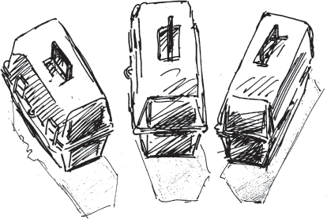

An effective technique to deal with overloads of the tangible variety is to QUEUE FOR RESOURCES (46). EQUITABLE RESOURCE ALLOCATION (45) discusses a way to divide up the tangible resources such as memory and peripheral equipment.

> 处理有形种类过载的一种有效方法是排队等待资源（46）。均衡资源分配（45）讨论了分配有形资源（如内存和外围设备）的方法。

A technique similar to QUEUING FOR RESOURCES (46) that works for CPU cycles which are intangible is to take on FRESH WORK BEFORE STALE (55). The capabilities to SHARE THE LOAD (51) with peers or to SHED LOAD (49) also help with CPU time.

> 一种类似于查询资源（46）的技术，适用于 CPU 周期，而 CPU 周期是无形的，即在停止前进行新的工作（55）。与对等方共享负载（51）或卸载负载（49）的功能也有助于 CPU 时间。

Knowing whether the system is in processor or resource overload requires some way of measuring the overload. The system should use EXISTING METRICS (20) to evaluate overloads.

> 了解系统是否处于处理器或资源过载状态需要某种方法来测量过载。系统应使用现有度量（20）来评估过载。

You should consider user/consumer/customer behavior when designing the system’s mechanisms to deal with an excess amount of work. Both FRESH WORK BEFORE STALE (55) and FINISH WORK IN PROGRESS (54) consider this behavior in their solutions.

> 在设计系统机制以处理多余工作量时，您应该考虑用户/消费者/客户的行为。停止前的新工作（55）和进行中的完成工作（54）都在其解决方案中考虑了这种行为。

In a network of peers, strategies can be designed to enable one peer to notify its neighbors that it is in overload and seek assistance in handling the traffic or in reducing the load from its peers. …

> 在对等体网络中，可以设计策略，使一个对等体能够通知其邻居其处于过载状态，并在处理流量或减少对等体的负载方面寻求帮助…

# 43. Deferrable Work

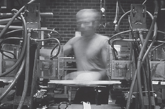

… More new work is arriving than the system can normally handle. The mitigation techniques are working and the system is stable.

> ……新的工作比系统通常能处理的还要多。缓解技术正在发挥作用，系统稳定。

The system schedules ROUTINE AUDITS (24) and other ROUTINE MAINTENANCE (22) tasks to keep the system working well. They are important to keep errors from occurring in the system. The workload is already presenting a performance error, or overload to the system, and the design of most systems enables them to tolerate only one error at a time.

> 系统安排例行审计（24）和其他例行维护（22）任务，以保持系统正常工作。它们对于防止系统中发生错误非常重要。工作负载已经给系统带来了性能错误或过载，大多数系统的设计使它们一次只能容忍一个错误。

The system is mitigating some of the effects of the excess application workload. This overload is keeping the system more than normally busy with its main application work. The EXPANSIVE AUTOMATIC CONTROLS (47) and PROTECTIVE AUTOMATIC CONTROLS (48) are working well and the system is able to process the workload, although it might be SHEDDING LOAD (49). The system is stable, which is to say that the overload is not causing non-performance related errors, workload is being processed at a very high level and the system will be able to ramp back down once the overload is over. In other words it isn’t broken.

> 该系统正在减轻应用程序工作负载过多的一些影响。这种过载使系统比通常更忙于其主要应用程序工作。扩展自动控制（47）和保护自动控制（48）运行良好，系统能够处理工作负载，尽管可能是卸载（49）。系统是稳定的，也就是说，过载不会导致与性能无关的错误，工作负载正在以非常高的级别处理，一旦过载结束，系统将能够缓降。换言之，它没有破碎。

**What work should the system shed when the choices are handling most of the new incoming work or the routine maintenance workload?**

> **当选择处理大部分新的输入工作或日常维护工作量时，系统应该放弃哪些工作**

The incoming workload can use all the resources that are being allocated to the preventive or ROUTINE MAINTENANCE (22). There are not enough resources to handle both the new work and to continue the routine work. This routine work keeps the system fault tolerant. The choice is to reduce the revenue producing work even more or to restrict some of the activities that prevent errors.

> 传入工作负载可以使用分配给预防性维护或例行维护（22）的所有资源。没有足够的资源来处理新工作和继续日常工作。这项例行工作保持了系统的容错性。选择是进一步减少创收工作，或者限制一些防止错误的活动。

The system has very stringent availability requirements, which is why a system of audits, defensive checks, and integrity monitors is in place. These parts of the system ensure that the system is working at its peak efficiency and is detecting errors to contain and correct them quickly.

> 该系统具有非常严格的可用性要求，这就是为什么要建立审计、防御检查和完整性监控系统的原因。系统的这些部分确保系统以其最高效率工作，并检测到错误，以快速控制和纠正错误。

But if the system is in overload and is stable, system resources are all being used to process the workload. Everything must be working well since the system is stable. It makes sense to defer the work that comes to play when the system is _not_ working properly, such as ROUTINE MAINTENANCE (22) and ROUTINE AUDITS (24). These deferrable items perform tasks that are not critical to processing the workload. If it is working at capacity or above and doing it well, do not check if it works: concentrate on the primary aspects of operation.

> 但是，如果系统过载且稳定，则系统资源将全部用于处理工作负载。既然系统稳定，一切都必须运转良好。当系统无法正常工作时，推迟即将开始的工作是有意义的，例如例行维护（22）和例行审计（24）。这些可延迟项执行的任务对处理工作负载并不重要。如果它在能力或以上的情况下工作，并且做得很好，不要检查它是否有效：集中精力于操作的主要方面。

Therefore,

> 因此

**Make the routine work deferrable. If the system is tending toward overload, chances are that the periphery and software are working, otherwise where would all that work be coming from?** Refer to <a href="#c07.htm#fig7.65" id="c07.htm#fig7.65a">Figure 65</a>. If the system is not broken and it is merely working hard, then it doesn’t need to be fixed.

> **使日常工作可推迟。如果系统趋向于过载，那么外围设备和软件很可能正在工作，否则所有的工作将从何而来？**请参阅图 65</a>。如果系统没有损坏，只是在努力工作，那么就不需要修复。

**[Figure 65](#c07.htm#fig7.65a)** Congestion squeezes maintenance

> **[图 65]（#c07.htm#fig7.65a）**拥塞挤压维护

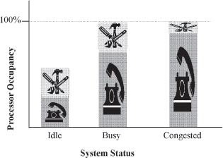

There is a chance that the system just _seems_ like it’s in overload, though it may be really reacting to errors. In that case, SOMEONE IN CHARGE (8) should employ REASSESS OVERLOAD DECISION (44). REASSESS OVERLOAD DECISION also addresses when this strategy is not providing enough relief and the system is not really stable.

> 虽然系统可能真的对错误做出了反应，但系统很可能会像过载一样对其进行处理。在这种情况下，负责人（8）应采用过载原因决策（44）。当该策略不能提供足够的缓解，并且系统不是真正稳定时，过载决策也会解决。

Everything that the system does is important to someone. But not everything is directly related to the primary purpose of the system. Tasks should not be deferred forever because that lowers the overall fault tolerance of the system. …

> 系统所做的一切对某人来说都很重要。但并非所有事情都与系统的主要目的直接相关。任务不应永远延迟，因为这会降低系统的整体容错能力…

# 44. Reassess Overload Decision

… The system is attempting to FINISH WORK IN PROGRESS (54) as well as to SHED LOAD (49).

> …系统试图完成正在进行的工作（54）以及卸载（49）。

The system is overloaded with work requests. The system is employing error mitigation techniques such as DEFERRABLE WORK (43) to reduce the impact of the overload. Decisions about what techniques to employ were based on FAULT CORRELATION (12).

> 系统工作请求过多。该系统采用了错误缓解技术，如可防御工作（43），以减少过载的影响。关于采用何种技术的决定基于故障相关性（12）。

**What should the system do when the workload mitigation techniques being used are not working to diminish the workload?**

> **当正在使用的工作量减轻技术无法减少工作量时，系统应该怎么做**

What happens if load keeps increasing in spite of all attempts to slow the system down?

> 如果负载不断增加，尽管试图降低系统速度，会发生什么？

The system is well engineered so that work shedding keeps the system from becoming saturated. The mechanisms such as to SHED LOAD (49) are working, yet the influx of new requests or the compounding of internal inefficiencies are not producing the desired reduction in workload. These mechanisms create a feedback loop that should keep load from getting out of hand.

> 该系统经过精心设计，以防止系统饱和。SHED LOAD（49）等机制正在发挥作用，但新请求的涌入或内部效率低下的加剧并没有产生预期的工作量减少。这些机制创建了一个反馈回路，可以防止负载失控。

Something is wrong if we have not processed any new requests for service in a long time. The system is designed to perform some work, such as to process web requests or telephone calls. If that work is deferred or skipped for too long a period, the system is unavailable.

> 如果我们长时间没有处理任何新的服务请求，就会出现问题。该系统设计用于执行一些工作，例如处理网络请求或电话呼叫。如果该工作延迟或跳过太长时间，则系统不可用。

A major goal of the error mitigation techniques is to preserve system integrity so the system can handle the routine level of traffic after the period of overload ends.

> 错误缓解技术的一个主要目标是保持系统的完整性，以便在过载周期结束后，系统能够处理常规级别的流量。

If the mitigation techniques are not enough to bring the system out of saturation, then the error may be coming from a source other than traffic overload.

> 如果缓解技术不足以使系统脱离饱和状态，那么错误可能来自交通过载以外的其他来源。

Therefore,

> 因此

**Provide the system with a feedback loop which provides information to enable the system to reexamine FAULT CORRELATION (12) decisions. This enables the system a chance to decide that it is not a timing related error but really an error execution and to attempt a different error processing strategy, see <a href="#c07.htm#fig7.66" id="c07.htm#fig7.66a">Figure 66</a>.**

> **为系统提供反馈回路，该回路提供信息，使系统能够重新检查故障相关性（12）决策。这使系统有机会确定这不是与时间相关的错误，而是真正的错误执行，并尝试不同的错误处理策略，请参见图 66</a>**

**[Figure 66](#c07.htm#fig7.66a)** Reexamining prior decisions

> **[图 66]（#c07.htm#fig7.66a）**重新审查先前的决定

Design the system to be able to ESCALATE (9) the error analysis to try different mitigation techniques or to enter the escalation chain for error recovery.

> 设计系统，使其能够升级（9）错误分析，以尝试不同的缓解技术或进入错误恢复升级链。

Feedback loops are an established mechanism in control theory.

> 反馈回路是控制理论中的一种既定机制。

The system can get further and further into trouble by following the wrong path unless reexamination is possible. SOMEONE IN CHARGE (8) should perform the analysis since they have a view of the overall system. …

> 除非可以重新检查，否则系统会因为走错了路而越来越麻烦。负责人（8）应该进行分析，因为他们对整个系统有看法…

# 45. Equitable Resource Allocation

… The system is trying to handle FRESH WORK BEFORE STALE (55) and yet it has many requests queued for resources. There are distinct types of resources that need to be allocated to requests such as database or network connections. The system is designed to institute error mitigation actions automatically, and there are no errors preventing them from being instituted.

> …系统正在尝试在停止前处理新鲜工作（55），但它有许多排队等待资源的请求。有不同类型的资源需要分配给请求，例如数据库或网络连接。该系统被设计为自动启动错误缓解措施，并且没有任何错误阻止它们被启动。

**How should requests for scarce resources be handled?**

> **应如何处理对稀缺资源的请求**

The arriving requests might all be the same, or they might arrive differently in either type or priority. For example, the requests might be for information from a company’s website. Many requests for queries into the database are received, and a few orders are placed; these are examples of two different types of requests. The system is designed to allow the company’s salesmen to access the system with higher priority than the ordinary user’s priority; an example of different priority levels.

> 到达的请求可能都是相同的，或者它们的类型或优先级可能不同。例如，请求可能是来自公司网站的信息。收到许多查询数据库的请求，并下了一些订单；这是两种不同类型请求的示例。该系统旨在允许公司的销售人员以比普通用户更高的优先级访问该系统；不同优先级的示例。

The system could strictly follow FRESH WORK BEFORE STALE (55) and only give the newest requests service. This will result in those requests that should have priority not receiving it because they are buried in the lower priority requests.

> 该系统可以严格遵循“暂停前刷新工作”（55），并且只提供最新的请求服务。这将导致那些应该具有优先级的请求无法接收，因为它们被隐藏在较低优先级的请求中。

If the different types of requests are routed to different parts of the system for processing, then the parts with the fewer arriving requests will be idle some of the time, since the handler for the more common requests is receiving more work. There might be a specific resource that is especially overloaded. If requests are allocated based only upon their newness, or other preferred position in the queue, they might end up blocking, and being prevented from accessing, this resource anyway.

> 如果将不同类型的请求路由到系统的不同部分进行处理，那么到达请求较少的部分将在某些时间处于空闲状态，因为更常见请求的处理程序正在接收更多的工作。可能有特定的资源特别过载。如果请求仅根据其新性或队列中的其他首选位置进行分配，那么它们最终可能会阻塞并被阻止访问该资源。

Another strategy would be to look at all the requests for service, both fresh and queued, and allocate resources equitably to all of them. While this requires additional bookkeeping to keep track of requests and their resource needs, work can be directed around extremely specific resource overloads. This helps ensure the greatest common good by providing service to as many requests as possible.

> 另一种策略是查看所有服务请求，包括新请求和排队请求，并将资源公平分配给所有请求。虽然这需要额外的簿记来跟踪请求及其资源需求，但工作可以围绕极其特定的资源过载进行。这有助于通过为尽可能多的请求提供服务来确保最大的共同利益。

Priority inversion is a problem that results when a task of a lower priority is preventing a task of higher priority from executing because the lower priority tasks hold a resource that is needed by the higher priority task. When sorting messages and distributing them to queues, it is important to avoid creating the priority inversion-like situation of the lower priority requests keeping higher priority tasks from executing. Ensure that the mechanism that is dividing requests into processing pools fairly processes all requests in order, or periodically pauses and processes the more important requests. Make certain that the resources needed by the lower priority, or higher volume, requests don’t prevent higher priority requests from being processed.

> 优先级反转是当较低优先级的任务阻止较高优先级的任务执行时产生的问题，因为较低优先级任务持有较高优先级任务所需的资源。在对消息进行排序并将其分发到队列时，重要的是要避免出现优先级较低的请求导致优先级较高的任务无法执行的类似优先级反转的情况。确保将请求划分为处理池的机制按顺序公平地处理所有请求，或者定期暂停并处理更重要的请求。确保低优先级或高容量请求所需的资源不会阻止处理高优先级请求。

Therefore,

> 因此

**Pool all similar requests and allocate resources to the pools based upon their availability and priority. This enables all types of work to be accomplished even if concentrated overloads from a certain category of type or priority exist.** <a href="#c07.htm#fig7.67" id="c07.htm#fig7.67a">Figure 67</a> shows balanced work requests coming out of the system even though different volumes of requests arrived.

> **汇集所有类似的请求，并根据其可用性和优先级将资源分配给这些池。这使所有类型的工作都能完成，即使存在来自特定类型或优先级类别的集中过载。**<a href=“#c07.htm#fig7.67”id=“c07.htm#fig7.67a”> 图 67</a>显示了即使到达不同数量的请求，来自系统的平衡工作请求。

**[Figure 67](#c07.htm#fig7.67a)** Balance resource allocation

> **[图 67]（#c07.htm#fig7.67a）**平衡资源分配

To group things and handle the pools, QUEUE FOR RESOURCES (46). When requests terminate abnormally, FINAL HANDLING (50) is required to efficiently release any held resources. …

> 要分组并处理池，请查询资源（46）。当请求异常终止时，需要 FINAL HANDLING（最终处理）（50）来有效释放任何保留的资源…

# 46. Queue for Resources

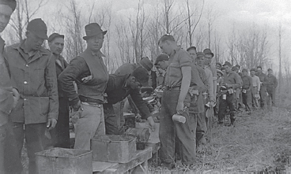

… The system is mitigating a workload spike, and is not otherwise in the midst of processing an error. Too many requests are being received.

> …该系统正在减轻工作负载峰值，而不是在处理错误的过程中。收到的请求太多。

**What should be done with requests for resources that cannot be handled immediately when they arrive?**

> **对于无法在资源到达时立即处理的资源请求，应如何处理**

The system is receiving more requests for work than it can process successfully as they arrive, but in general the system is able to gracefully handle the excess requests for service.

> 系统接收到的工作请求超过了它们到达时能够成功处理的数量，但总体而言，系统能够优雅地处理多余的服务请求。

An option for the system is to discard all requests that it can’t handle immediately as they arrive. This supports the pattern SHED LOAD (49). Only those requests that can be handled will be kept. This will have immediate effects on an overload. There will be little overhead associated with this because the only work that is done for the requests to be rejected is the rejection.

> 系统的一个选项是在请求到达时丢弃所有无法立即处理的请求。这支持模式 SHED LOAD（49）。只保留那些可以处理的请求。这将对过载产生直接影响。与此相关的开销很少，因为要拒绝的请求所做的唯一工作就是拒绝。

There are many flaws with this approach though. For one, a request that arrived as several individual requests might be prevented from completing, just as the last request needed to complete it arrives and is discarded. This is discussed in FINISH WORK IN PROGRESS (54). Another is that important single work items might be eliminated without any consideration. The pattern MAINTENANCE INTERFACE (7) discusses this within the context of maintenance messages being lost. And yet another flaw is that the overload might be momentary, and if the request were taken in and put in a queue then there may be resources available for it after a very short wait.

> 然而，这种方法有许多缺陷。例如，作为多个单独请求到达的请求可能无法完成，就像完成该请求所需的最后一个请求到达并被丢弃一样。这在“正在进行的饰面工程”（54）中进行了讨论。另一个问题是，重要的单个工作项可能会在没有任何考虑的情况下被删除。模式 MAINTENANCE INTERFACE（7）在维护消息丢失的上下文中讨论了这一点。还有一个缺陷是，过载可能是暂时的，如果请求被接收并放入队列，那么在很短的等待之后可能会有资源可供使用。

If the system can store the work in a queue for later processing then the work item might complete eventually. This still has risks; one is that the queue might become longer than can be effectively managed. Another is that even after a short period in a queue the resources needed for a request are still not available, requiring the request to be rejected at that point, or put back in the queue.

> 如果系统可以将工作存储在队列中以便稍后处理，那么工作项最终可能会完成。这仍然存在风险；一个是队列可能会变得比能够有效管理的更长。另一种情况是，即使在队列中的一段短时间后，请求所需的资源仍然不可用，要求此时拒绝请求，或将其放回队列中。

Managing the queue requires resources and introduces overhead. You must be careful to not make the situation worse by designing inefficient queue handling methods.

> 管理队列需要资源并引入开销。您必须小心，不要因为设计低效的队列处理方法而使情况变得更糟。

Therefore,

> 因此

**Store requests for service that cannot be handled immediately in a queue, <a href="#c07.htm#fig7.68" id="c07.htm#fig7.68a">Figure 68</a>. Give the queue a finite length to improve the likelihood that the request is still important when it reaches the head of the line.**

> **将无法立即处理的服务请求存储在队列中，<a href=“#c07.htm#fig7.68”id=“c07.htm#fig7.68a”> 图 68</a>。给队列一个有限的长度，以提高当请求到达队列开头时仍然重要的可能性**

**[Figure 68](#c07.htm#fig7.68a)** Queue requests

> **[图 68]（#c07.htm#fig7.68a）**队列请求

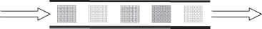

When the requests are computer generated and must be processed in order, a First In First Out (FIFO) queue should be used. When people are generating the requests, the queue should use a Last in First Out (LIFO, a.k.a. a stack) strategy (as in FRESH WORK BEFORE STALE (55)) to govern insertion and removal. This will help people receive good service. The request that was placed on the queue last will think that they received excellent service, and the person that placed the longest ago request on the queue probably gave up already.

> 当请求由计算机生成且必须按顺序处理时，应使用先进先出（FIFO）队列。当人们生成请求时，队列应该使用后进先出（LIFO，又称堆栈）策略（如 FRESH WORK BEFORE STALE（55））来控制插入和删除。这将帮助人们获得良好的服务。最后一个被放在队列中的请求会认为他们得到了很好的服务，而最早在队列中提出请求的人可能已经放弃了。

Allocation of resources under the guidance of EQUITABLE RESOURCE ALLOCATION (45) should recognize both the requests that have been queued and those that are fresh and have never been queued. …

> 在均衡资源分配（45）指导下的资源分配应识别已排队的请求和未排队的新请求…

# 47. Expansive Automatic Controls

… The system is capable of applying automatic controls when it becomes overloaded.

> …该系统能够在过载时应用自动控制。

The system is receiving an overload of work requests. It is able to process all of this offered load but it is almost saturated. The finite resources, such as memory blocks, threads, network ports, etc., that are needed to complete the requests are almost all used or occupied. As soon as a request completes, the resources that the completed request is releasing back into the system are being acquired for a new request. If the workload increases slightly then new requests will either need to QUEUE FOR RESOURCES (46) or they will have to be rejected (SHED LOAD (49)). When this point is reached then the system starts wasting time looking for resources to allocate and performing the overhead work of placing the new request on a queue.

> 系统正在接收超负荷的工作请求。它能够处理所有提供的负载，但几乎饱和。完成请求所需的有限资源，如内存块、线程、网络端口等，几乎全部被使用或占用。一旦请求完成，完成的请求释放回系统的资源将被获取用于新请求。如果工作负载稍微增加，那么新的请求要么需要排队等待资源（46），要么必须被拒绝（卸载（49））。当达到这一点时，系统开始浪费时间寻找要分配的资源，并执行将新请求放置在队列上的开销工作。

In this pattern the metric being watched is the number of work requests that are processed completely. This is a view of the error that focuses more on the incoming work than the view taken in PROTECTIVE AUTOMATIC CONTROLS (48) (which is system throughput).

> 在这种模式中，监视的度量是完全处理的工作请求的数量。这是一个错误视图，与保护自动控制（48）（即系统吞吐量）中的视图相比，该视图更关注输入工作。

**How can we avoid both the wasted effort processing the requests that can’t immediately be handled in an overload and at the same time increase overall request completions?**

> **我们如何避免处理无法在过载情况下立即处理的请求，同时增加总体请求完成率**

This seems impossible: not waste effort queuing or discarding excess requests and increase the number of requests that can be handled. The resource that is exhausted is finite. Unless it can be increased this seems impossible.

> 这似乎是不可能的：不要浪费精力排队或丢弃多余的请求，增加可以处理的请求数量。耗尽的资源是有限的。除非可以增加，否则这似乎是不可能的。

It is common to employ PROTECTIVE AUTOMATIC CONTROLS (48) to protect systems during overload. If PROTECTIVE AUTOMATIC CONTROLS are used solely when confronted with congestion, each system will shrink back upon itself and request completion rates will decrease. Many of the protections result in requests being discarded (SHED LOAD (49)). Effort is expended to SHED LOAD. SHED WORK AT PERIPHERY (52) helps reduce the effort in the core of the system by shedding it at the edge.

> 通常使用保护自动控制（48）在过载期间保护系统。如果仅在遇到拥塞时使用保护性自动控制，则每个系统都会自行收缩，请求完成率会降低。许多保护导致请求被丢弃（SHED LOAD（49））。用力卸载。外围棚工作（52）通过在边缘棚工作，有助于减少系统核心的工作量。

If some way to expand the range of possibilities available to a system were possible then more work can be done. Are there alternative ways that a system can deal with its workload? Ways that are normally not used? Can any of these ways be built in?

> 如果某种方法能够扩展系统可用的可能性范围，那么可以做更多的工作。系统是否有其他方法可以处理其工作负载？通常不使用的方法？这些方法中的任何一种都可以内置吗？

High performance systems are usually designed to operate at less than 100% processor occupancy during ordinary execution. The unallocated processor time is held in reserve to support occasional spikes or periodic tasks. It can also be released for general requests when the system is overloaded.

> 高性能系统通常设计为在正常执行期间以低于 100% 的处理器占用率运行。保留未分配的处理器时间，以支持偶尔的峰值或周期性任务。当系统过载时，也可以针对一般请求释放它。

Another example of expanding the resources available to a system to complete its work comes from the telephone network. There are many direct communication links between two telephone offices. Using links between the telephone offices and intermediate offices creates many multi-hop routes between the two telephone offices. A strategy used in the telephone network is that only the direct routes are used to service ordinary, non-overload requests to communicate between the telephone offices. When the systems become overloaded the non-direct, multi-hop routes are made available for use.

> 扩展系统可用资源以完成其工作的另一个例子来自电话网络。两个电话局之间有许多直接的通信联系。使用电话局和中间局之间的链路在两个电话局之间创建了许多多跳路由。在电话网络中使用的一种策略是，仅使用直接路由来服务普通的、非过载的请求，以在电话局之间进行通信。当系统过载时，可以使用非直接多跳路由。

Expanding the resources that the system may use provides immediate relief of the request overload. It is not a permanent solution. If the offered load continues to increase, the system will again be confronted with more traffic than it can handle. Other means of mitigating the overload should be used in conjunction with the expansion of resources to reduce the impacts of the continued overload, <a href="#c07.htm#fig7.69" id="c07.htm#fig7.69a">Figure 69</a>.

> 扩展系统可以使用的资源可以立即减轻请求过载。这不是一个永久的解决方案。如果提供的负载继续增加，系统将再次面临超出其处理能力的流量。缓解过载的其他方法应与资源扩展一起使用，以减少持续过载的影响，<a href=“#c07.htm#fig7.69”id=“c07.htm#fig7.69a”> 图 69</a>。

**[Figure 69](#c07.htm#fig7.69a)** Expansion helped but is needed again

> **[图 69]（#c07.htm#fig7.69a）**扩展有所帮助，但再次需要

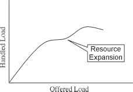

Therefore,

> 因此

**Design some resources into the system that will be used only in case of overload. Provide new ways for the system to do its work that either uses reserved resources or fewer resources.**

> **在系统中设计一些仅在过载情况下使用的资源。为系统提供使用保留资源或更少资源进行工作的新方法**

Impose automatic controls that provide new ways to do the same work. This enables taking on excess work and lessening the congestion. It is like providing an escape valve. <a href="#c07.htm#fig7.70" id="c07.htm#fig7.70a">Figure 70</a> shows extra channels for work requests.

> 实施自动控制，提供新的方式来完成相同的工作。这可以承担额外的工作，减少拥堵。这就像提供一个逃生阀 <a href=“#c07.htm#fig7.70”id=“c07.htm#fig7.70a”> 图 70</a>显示了工作请求的额外通道。

**[Figure 70](#c07.htm#fig7.70a)** Provide additional ways to process the workload

> **[图 70]（#c07.htm#fig7.70a）**提供处理工作量的其他方法

Expansive Automatic Controls provide new ways for the system to do its work.

> 扩展的自动控制为系统工作提供了新的方式。

Defer some ROUTINE MAINTENANCE (22) work during peak traffic times. This expands the amount of real-time that is available to perform revenue-generating work. Deferring maintenance work also enables this pattern to be applied to processor capacity. This was discussed in DEFERRABLE WORK (43).

> 在交通高峰时段推迟一些例行维护（22）工作。这扩大了可用于执行创收工作的实时量。延迟维护工作也使这种模式适用于处理器容量。这在《可防御工作》（43）中进行了讨论。

PROTECTIVE AUTOMATIC CONTROLS (48) deals with finitely bounded resources. This pattern deals with resources that can be expanded.

> 保护性自动控制（48）处理有限有限的资源。此模式处理可扩展的资源。

An example of an expansive control from highways is when the police direct traffic over side streets, possibly in violation of posted regulations, to avoid an accident scene. They have the authority to take this action but they seldom exercise it. Another example is using all lanes of a highway to carry traffic in one direction to allow a higher number of people to leave an area threatened by a natural disaster, such as a hurricane. …

> 一个来自高速公路的广泛控制的例子是，警察在支路上指挥交通，可能违反了张贴的规定，以避免事故现场。他们有权采取这一行动，但很少采取行动。另一个例子是，使用高速公路的所有车道向一个方向运送交通，以允许更多的人离开受到自然灾害威胁的地区，例如飓风…

# 48. Protective Automatic Controls

… The system is capable of processing errors automatically. The metric being watched is throughput – the number of requests that are successfully processed. Congestion is occurring because there are too many requests that need the finite resources available within the system. For example, internal messaging bandwidth is becoming fully utilized.

> …系统能够自动处理错误。所关注的指标是吞吐量——成功处理的请求数。由于有太多的请求需要系统内可用的有限资源，所以会发生拥塞。例如，内部消息传送带宽正在得到充分利用。

When resources are almost fully used, the overhead to find available resources increases. This extra overhead, coupled with the overload of work, poses a threat to the system. The threat is that the throughput will begin decreasing because the overhead is reducing the time available for processing the arriving workload. In poorly designed systems the overhead work can bring the system to a halt.

> 当资源几乎被完全使用时，查找可用资源的开销会增加。这种额外的开销，加上工作的过载，对系统构成了威胁。威胁是吞吐量将开始下降，因为开销正在减少处理到达的工作负载的可用时间。在设计不良的系统中，架空作业可能会使系统停止。

**What actions should an overloaded system take to avoid spending all of its time doing overhead work associated with new requests arriving?**

> **过载的系统应该采取什么措施来避免将所有时间花费在与新请求到达相关的开销工作上**

The system is in overload. More requests are arriving than the system can normally process. If the system takes on all the arriving work, requests will have to be QUEUED FOR RESOURCES (46) until the needed resources become available. Processing effort is required to enqueue and dequeue the requests for service. If the congestion continues then queue lengths will increase and delays will become unacceptable. The nature of the traffic also comes into play. If the traffic is being generated by people then some of the oldest requests that were put into the queue will be invalid because the people abandoned their request. Usually this takes the form of ignoring or stopping a current request and immediately resubmitting a request. The result is that the queue contains requests that are no longer valid, in addition to newer valid duplicated requests. FRESH WORK BEFORE STALE (55) discusses a mitigation technique for this.

> 系统过载。收到的请求比系统正常处理的要多。如果系统承担所有到达的工作，则请求将必须排队等待资源（46），直到所需资源可用。对服务请求进行排队和出队需要进行处理。如果拥堵持续，那么队列长度将增加，延迟将变得不可接受。交通的性质也发挥了作用。如果流量是由人生成的，那么放入队列的一些最早的请求将无效，因为这些人放弃了他们的请求。通常这采取忽略或停止当前请求并立即重新提交请求的形式。结果是，除了更新的有效重复请求之外，队列还包含不再有效的请求。失速前的新鲜工作（55）讨论了一种缓解技术。

The responses that a system can take when confronted with overload and too many requests for resources can be one of these three. The first is to shrink within itself, taking whatever actions are necessary to be protected from the onslaught of too much traffic. In extreme cases this means that the system will stop processing any requests.

> 系统在遇到过载和过多的资源请求时可以采取的响应可以是这三种之一。第一种是自我收缩，采取一切必要的行动，以保护自己免受过多流量的冲击。在极端情况下，这意味着系统将停止处理任何请求。

The second is to open itself up to the traffic, taking on as much as it can but shedding unnecessary internal work, DEFERRABLE WORK (43), and when it becomes necessary SHEDDING LOAD (49) in general and if possible (because it’s better) SHEDDING WORK AT THE PERIPHERY (52).

> 第二种是向交通开放，尽可能多地承担，但减少不必要的内部工作，即可防御的工作（43），当需要卸载时（49），以及如果可能（因为这样更好），在周边卸载工作（52）。

The third is to not do anything. This generally leads the system into instability as queue sizes keep increasing, and too much overhead work is required to accept requests and place them on the queue. Eventually the overhead work will overwhelm the system and it will stop performing useful work.

> 第三是什么都不做。这通常会导致系统不稳定，因为队列大小不断增加，接受请求并将其放置在队列中需要太多的开销工作。最终，开销工作将压倒系统，它将停止执行有用的工作。

A typical response to too much work is for the system to begin thrashing. The system takes on more than it can handle, response times increase and the problems just magnify. This causes throughput to decrease greatly. By protecting itself the system will have a lower throughput than it did before the automatic control started, but the drop off will not be as severe as if nothing had been done.

> 对过多工作的典型反应是系统开始抖动。该系统承担的工作量超出了它所能处理的范围，响应时间增加，问题也随之扩大。这导致吞吐量大大降低。通过自我保护，系统的吞吐量将低于自动控制启动前的吞吐量，但下降不会像什么都没做一样严重。

Therefore,

> 因此

**Automatically impose restrictions on how much work the system accepts to protect the system’s ability to function. The system has techniques to mitigate the effects of too many requests for service which should be invoked when the congestion is in elements that have finite limits and no unused capacity remains.**

> **自动限制系统接受的工作量，以保护系统的功能。该系统具有减轻过多服务请求的影响的技术，当拥塞发生在具有有限限制且没有剩余未使用容量的元素中时，应调用这些服务请求**

In <a href="#c07.htm#fig7.71" id="c07.htm#fig7.71a">Figure 71</a> the system’s ability to function is protected as though it were a golden treasure.

> 在 <a href=“#c07.htm#fig7.71”id=“c07.htm#fig7.71a”> 图 71</a>中，系统的功能受到保护，就像它是一个黄金宝藏一样。

**[Figure 71](#c07.htm#fig7.71a)** Protect the system

> **[图 71]（#c07.htm#fig7.71a）**保护系统

Without protection the system throughput will drop in an overload due to resource contention, <a href="#c07.htm#fig7.72" id="c07.htm#fig7.72a">Figure 72</a>.

> 如果没有保护，系统吞吐量将因资源争用而过载，<a href=“#c07.htm#fig7.72”id=“c07.htm#fig7.72a”> 图 72</a>。

**[Figure 72](#c07.htm#fig7.72a)** Throughput with resource contention

> **[图 72]（#c07.htm#fig7.72a）**资源争用吞吐量

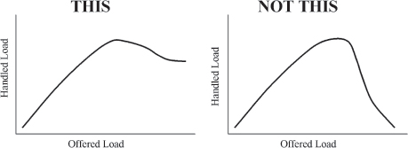

Metered freeway entrance ramps are examples of PROTECTIVE AUTOMATIC CONTROLS(48). When the finite resource of highway capacity becomes congested it is possible to automatically restrict the rate at which new traffic enters the highway by using stoplights at the top of the entrance ramp. At predetermined intervals the stoplight will turn green and allow one request for service (car) onto the freeway. This limits the amount of new work that is added to the system, at the risk of backing traffic up at the entrance ramp. In many cities these protective stoplights only restrict traffic during busy periods, i.e. rush hour.

> 计量高速公路入口匝道是保护性自动控制（48）的示例。当有限的公路通行能力资源变得拥挤时，可以通过使用入口匝道顶部的停车灯来自动限制新交通进入公路的速度。在预定的时间间隔内，停车灯将变为绿色，并允许在高速公路上请求服务（车辆）。这限制了添加到系统中的新工作量，从而有可能在入口匝道处阻碍交通。在许多城市，这些保护性红绿灯仅在繁忙时段（即高峰时段）限制交通。

Typically processor real-time is considered a finite resource and PROTECTIVE CONTROLS are needed to deal with congestion for it.

> 通常，处理器实时被认为是一种有限的资源，需要保护控制来处理其拥塞。

This pattern applies when the resource is finite. If there are ways of expanding the range of possibilities – of increasing the amount of the resource – then apply EXPANSIVE AUTOMATIC CONTROLS (47).…

> 当资源有限时，此模式适用。如果有扩大可能性范围的方法——增加资源量——那么应用扩展自动控制（47）。…

# 49. Shed Load

… More work is arriving than the system can handle.

> ……系统无法处理的工作越来越多。

Workload increases as requests are accepted for processing. If too many requests are accepted the system throughput can decrease to the point that no work is being completed. When this happens the system is unavailable, and this must be avoided.

> 随着接受处理请求，工作量增加。如果接受的请求太多，系统吞吐量可能会降低到没有工作完成的程度。发生这种情况时，系统不可用，必须避免这种情况。

**How can the system best handle too many requests and keep them from overwhelming the system?**

> **系统如何最好地处理过多的请求，并防止它们压倒系统**

Adding more software mechanisms to the system to handle the excess workload adds complexity, which can add faults. The overhead cost of the extra mechanisms can also exceed the amount of work that it saves.

> 向系统添加更多的软件机制来处理多余的工作负载会增加复杂性，从而增加故障。额外机制的开销成本也可能超过其节省的工作量。

The system can accept all of the incoming work, but as <a href="#c07.htm#fig7.73" id="c07.htm#fig7.73a">Figure 73</a> shows, the system throughput will decrease and become unacceptable.

> 系统可以接受所有传入的工作，但如图 73</a>所示，系统吞吐量将降低并变得不可接受。

**[Figure 73](#c07.htm#fig7.73a)** Unacceptable throughput

> **[图 73]（#c07.htm#fig7.73a）**不可接受的吞吐量

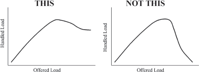

The system can shed some of the work, not accepting all of it, which will enable it to process the accepted workload well. The work should be shed as early as possible, before it consumes many system resources, see SHED WORK AT PERIPHERY (52).

> 系统可以放弃部分工作，而不是接受全部工作，这将使其能够很好地处理接受的工作量。在工作消耗大量系统资源之前，应尽早卸载工作，请参阅周边的卸载工作（52）。

Shedding some workload enables the system to stabilize. It can reduce the amount of processing capacity needed to handle unexpected surges in workload.

> 减少一些工作量可以使系统稳定下来。它可以减少处理意外激增的工作量所需的处理能力。

The mechanism to shed work should consider how the communicating system will behave when its work requests are rejected.

> 放弃工作的机制应该考虑当其工作请求被拒绝时通信系统的行为。

When the work is arriving in the form of messages, work can be shed by failing to acknowledge work request messages as they arrive. Many times the sender will retransmit the message. This is both good and bad. Good because when the retransmission arrives the system may be able to process it; the overload might be passed. But bad if the system is still overloaded because it is another request for service.

> 当工作以消息的形式到达时，工作可以通过在到达时不确认工作请求消息而被丢弃。发送者会多次重新发送消息。这有好有坏。很好，因为当重传到达时，系统可能能够处理它；过载可能被传递。但如果系统仍然过载，那就糟糕了，因为这是另一个服务请求。

How to handle work that arrives from people depends on the circumstances. For example, telephone calls and web clicks have different human behavior characteristics. The STRATEGY \[GHJ+95\] pattern is useful for encoding the needed variation between these scenarios.

> 如何处理来自人们的工作取决于环境。例如，电话和网络点击具有不同的人类行为特征。战略\[GHJ+95\]模式对于编码这些场景之间所需的差异非常有用。

Therefore,

> 因此

**Shed some requests so that the others may receive good service.**

> **提出一些要求，以便其他人得到良好的服务**

<a href="#c07.htm#fig7.74" id="c07.htm#fig7.74a">Figure 74</a> shows some requests being discarded.

**[Figure 74](#c07.htm#fig7.74a)** Discard some requests for the good of others

> **[图 74]（#c07.htm#fig7.74a）**为了他人的利益放弃一些请求

This is an example of PROTECTIVE AUTOMATIC CONTROLS (48). SLOW IT DOWN (53) describes a way to add escalating workload shedding filters. FINISH WORK IN PROGRESS (54) discusses a way to intelligently select the work requests that should be rejected. The pattern FRESH WORK BEFORE STALE (55) describes an effective way of acknowledging and responding well given human behavior when requests are shed or ignored.

> 这是保护自动控制（48）的示例。SLOW IT DOWN（53）描述了一种添加不断增加的工作负载削减过滤器的方法。FINISH WORK IN PROGRESS（54）讨论了一种智能选择应拒绝的工作请求的方法。模式 FRESH WORK BEFORE STALE（55）描述了在请求被丢弃或忽略时确认和响应给定人类行为的有效方式。

Whenever work is discarded, FINAL HANDLING (50) comes into play to release the resources used by the discarded work. …

> 每当工作被丢弃时，最终处理（50）开始发挥作用，以释放被丢弃的工作所使用的资源…

# 50. Final Handling

… When requests finish, the resources that they used are routinely released back to process other requests. Sometimes a request does not complete to the point at which resources are released. These abnormal terminated transactions and all the resources that they used need releasing.

> …当请求完成时，他们使用的资源会被常规释放，以处理其他请求。有时请求没有完成到释放资源的程度。这些异常终止的事务及其使用的所有资源都需要释放。

**Should there be a separate mechanism to support only the abnormally terminated request’s need to release resources?**

> **是否应该有单独的机制来支持异常终止的请求释放资源的需求**

The first resolution to consider is to not clean up abnormally terminated transactions. This will leave resources tied up and unavailable for other requests. This is like a memory leak. Eventually the system will run out of resources. The resources can be collected automatically by a garbage collection mechanism, but only recently have garbage collection mechanisms provided the deterministic performance needed by most fault tolerant systems.

> 首先要考虑的解决方案是不清理异常终止的事务。这将导致资源被占用，无法用于其他请求。这就像内存泄漏。最终，系统将耗尽资源。资源可以通过垃圾收集机制自动收集，但直到最近，垃圾收集机制才提供了大多数容错系统所需的确定性性能。

The easiest option at development time is to release the resources with a separate mechanism. This simplifies the design because the normal and abnormal control flows do not need to be interwoven. The control flows do not need to interact, which reduces complexity. Two (or more) mechanisms will be added to the system, one for the normal cases and another for the abnormal cases. Separate mechanisms can be kept simple. This presents a maintenance challenge though because now there are two (or more) different mechanisms that need to be maintained. If a design fault is later identified in one of the mechanisms, all of them need to be checked to make certain that they do not have the same fault. While the mechanisms are more simple because the normal and abnormal are considered separately, there is roughly an integer multiple of the amount of code needed for the normal resource release. With more code there will be more latent faults.

> 开发时最简单的选择是使用单独的机制释放资源。这简化了设计，因为正常和异常控制流不需要交织。控制流不需要交互，这降低了复杂性。系统将添加两个（或更多）机制，一个用于正常情况，另一个用于异常情况。单独的机制可以保持简单。这是一个维护挑战，因为现在有两个（或更多）不同的机制需要维护。如果后来在其中一个机制中发现了设计故障，则需要检查所有机制，以确保它们没有相同的故障。虽然机制更简单，因为正常和异常是分开考虑的，但正常资源释放所需的代码量大约是整数倍。代码越多，潜在故障就越多。

Another option is to design the system so that the normal and abnormal cases share the same resource release mechanism. This can result in a more complicated design since the normal and abnormal control paths must be coordinated. There might be special steps that need to be done for the abnormal case or different information that needs to be recorded in logs. This complexity opens the potential for faults in the design. But the amount of code present will be less than two times the amount of code needed for resource releasing in the normal case, <a href="#c07.htm#fig7.75" id="c07.htm#fig7.75a">Figure 75</a>. An advantage is that there is only one place to correct in case a fault is found.

> 另一种选择是设计系统，使正常和异常情况共享相同的资源释放机制。这会导致更复杂的设计，因为必须协调正常和异常控制路径。对于异常情况或需要记录在日志中的不同信息，可能需要执行特殊步骤。这种复杂性打开了设计中出现故障的可能性。但是，出现的代码量将少于正常情况下资源释放所需代码量的两倍，<a href=“#c07.htm#fig7.75”id=“c07.htm#fig7.75a”> 图 75</a>。一个优点是，如果发现故障，只有一个地方可以纠正。

**[Figure 75](#c07.htm#fig7.75a)** Less code when common

> **[图 75]（#c07.htm#fig7.75a）**常见时代码更少

Most fault tolerant systems are in use for a long time. As a result the costs to maintain the system must be considered in addition to the development costs, <a href="#c07.htm#fig7.76" id="c07.htm#fig7.76a">Figure 76</a>. Additional software needed to handle the separate release of resources adds to the maintenance costs.

> 大多数容错系统都使用了很长时间。因此，除了开发成本外，还必须考虑维护系统的成本，<a href=“#c07.htm#fig7.76”id=“c07.htm#fig7.76a”> 图 76</a>。处理单独释放资源所需的额外软件增加了维护成本。

Therefore,

> 因此

**[Figure 76](#c07.htm#fig7.76a)** Lower maintenance costs

> **[图 76]（#c07.htm#fig7.76a）**降低维护成本

**Integrate the release of resource for internally terminated transactions with the usual release of resources done by normal task termination. See <a href="#c07.htm#fig7.77" id="c07.htm#fig7.77a">Figure 77</a>.**

> **将内部终止事务的资源释放与正常任务终止完成的资源释放相集成。参见图 77</a>**

**[Figure 77](#c07.htm#fig7.77a)** Release through the normal means

> **[图 77]（#c07.htm#fig7.77a）**通过正常方式释放

In this way there are few possibilities of forgetting to release some part. This saves development and testing time because it needs to only be written once. It also saves memory space. In a system that is designed to be highly available, the benefits of single development and maintenance of only one code are great and support the principle of keeping it simple.

> 这样，几乎没有可能忘记释放某个部分。这节省了开发和测试时间，因为它只需要编写一次。它还节省了内存空间。在一个设计为高度可用的系统中，只开发和维护一个代码的好处很大，并且支持保持简单的原则。

Data should be collected when transactions are terminated abnormally. This data needs to be presented to human managers so that they can make changes to strategy or network topology.

> 当事务异常终止时，应收集数据。这些数据需要呈现给人力管理人员，以便他们能够对策略或网络拓扑进行更改。

As an example, consider that on some freeways there are emergency pull-off locations where it is safe to stop and report an accident or vehicle problem without obstructing the normal flow of traffic. After the problem is reported or corrected the normal lanes are used to resume the trip up to a normal exit. These emergency pull-offs do not provide special exit ramps. They provide the ability to perform some special actions and then the normal exit ramp is used. …

> 例如，考虑在一些高速公路上有紧急停车点，在那里停车并报告事故或车辆问题是安全的，而不会妨碍正常的交通流。报告或纠正问题后，使用正常车道恢复正常出口的行程。这些紧急出口不提供特殊的出口坡道。它们提供执行一些特殊动作的能力，然后使用正常的出口匝道…

# 51. Share the Load

… You are designing a system that should be able to handle excess workload when it is presented.

> ……您正在设计一个系统，该系统在呈现时应该能够处理多余的工作量。

The system might not have enough processing power to handle all of the requests for service. The system might have some parallel elements, either through clustering or multiple processing cores.

> 系统可能没有足够的处理能力来处理所有服务请求。系统可能有一些并行元素，通过集群或多个处理核心。

You have exhausted all other means of designing the system for the needed capacity.

> 您已经用尽了为所需容量设计系统的所有其他方法。

**How can you increase the available processing power?**

> **如何提高可用的处理能力**

Adding processors to the system increases complexity and makes it more difficult to ensure that it is fault tolerant. However, the increased complexity is traded against the addition to the system’s REDUNDANCY (3) which enables other mechanisms for error processing, such as FAILOVER (36) to be implemented.

> 向系统中添加处理器会增加复杂性，并使其更难确保容错。然而，增加的复杂性与增加的系统冗余（3）进行了权衡，这使得能够实现其他错误处理机制，例如 FAILOVER（36）。

When functions move from one processor to another, you must watch closely the partitioning to ensure that you are not adding to the overall workload. One way that workload will increase is by the need for shared data and the overhead needed to keep it synchronized between the processors. Careless choices can actually increase the workload on the system rather than decrease it. Unless the amount of processing that is shareable between processors is significant it might not help in the resolution of overload.

> 当函数从一个处理器移动到另一个处理器时，您必须密切关注分区，以确保不会增加整体工作负载。工作负载增加的一种方式是需要共享数据，以及在处理器之间保持数据同步所需的开销。粗心的选择实际上会增加系统的工作负载，而不是减少它。除非处理器之间可共享的处理量很大，否则这可能无助于解决过载问题。

Preprocessing work needed before the main processing of a request can be moved to another processor. Its functions can be an adjunct to the main processing and the results provided to the main part of the system. Some examples of preprocessing include firewall/virus/other security scanning, request characterization and intelligent routing to enable efficient load balancing, monitoring arriving traffic to support FRESH WORK BEFORE STALE (55) and SHED WORK AT PERIPHERY (52). This other processor can be anything from a specialized appliance to another processor chip or FPGA on a media card in a bladed architecture or different general purpose system. In general it doesn’t need to be identical to the main processor, although that option is valid also.

> 在主处理请求之前所需的预处理工作可以移动到另一个处理器。它的功能可以是主处理的附件，并将结果提供给系统的主要部分。预处理的一些示例包括防火墙/病毒/其他安全扫描、请求特征化和智能路由，以实现有效的负载平衡、监控到达的流量以支持停止前的刷新工作（55）和外围的搁置工作（52）。该其他处理器可以是从专用设备到刀片式架构或不同通用系统中的媒体卡上的另一处理器芯片或 FPGA 的任何东西。一般来说，它不需要与主处理器相同，尽管该选项也是有效的。

An EXPANSIVE AUTOMATIC CONTROL (47) is to make extra processing resources available during periods of overload. For example, free up other members of a processing cluster, or engaging resources in a different part of a corporate network.

> 扩展自动控制（47）用于在过载期间提供额外的处理资源。例如，释放处理集群的其他成员，或在公司网络的不同部分使用资源。

Therefore,

> 因此

**Move some of the work to other processors. Move work that does not require high levels of synchronization.** In <a href="#c07.htm#fig7.78" id="c07.htm#fig7.78a">Figure 78</a> the incoming work is divided up between two elements.

> **将部分工作转移到其他处理器。移动不需要高级别同步的工作。**在 <a href=“#c07.htm#fig7.78”id=“c07.htm#fig7.78a”> 图 78</a>中，传入的工作被分成两个元素。

**[Figure 78](#c07.htm#fig7.78a)** Share the work

> **[图 78]（#c07.htm#fig7.78a）**分享工作

The processor that receives off-loaded work need not be local. The network that shares the work can be larger and the off-load processor might be very far away. Some sort of message needs to be sent to the other processors to let them know that they should assume some of the work. Other components of the system will need to be told also to route traffic to the other elements.

> 接收卸载工作的处理器不需要是本地的。共享工作的网络可能更大，卸载处理器可能距离很远。需要向其他处理器发送某种消息，让他们知道应该承担一些工作。系统的其他组件也需要被告知将流量路由到其他元件。

If you design the capability for the workload to move from one processor to another you will need some way to synchronize them. If individual transactions take several requests, either you will have to design the capability to migrate all of the information related to a transaction, or you will have to design the ability to share transaction information (and state). …

> 如果您设计了工作负载从一个处理器移动到另一个处理器的能力，那么您需要一些方法来同步它们。如果单个事务需要多个请求，那么您必须设计迁移与事务相关的所有信息的能力，或者您必须设计共享事务信息（和状态）的能力…

# 52. Shed Work at Periphery

… Requests for service are arriving more quickly than the system can process them. The system can SHED LOAD (49).

> ……服务请求的到达速度比系统能够处理的速度更快。系统可以卸载（49）。

**How does the system SHED LOAD (49) that is beyond system capacity for the lowest additional effort?**

> **系统如何卸载超出系统容量的负载（49），以实现最低的额外工作量**

As work requests are processed by the system, the system has an ever increasing investment in its completion. As more and more effort is expended completing any particular request for service, the benefits to the system of shedding any particular request diminish. The least effort time to shed load is before it uses any efforts of the system, <a href="#c07.htm#fig7.79" id="c07.htm#fig7.79a">Figure 79</a>.

> 随着工作请求由系统处理，系统在完成工作方面的投资不断增加。随着完成任何特定的服务请求所花费的精力越来越多，放弃任何特定请求对系统的益处也越来越小。卸载所需的最少时间是在使用系统的任何努力之前，<a href=“#c07.htm#fig7.79”id=“c07.htm#fig7.79a”> 图 79</a>。

**[Figure 79](#c07.htm#fig7.79a)** Effort expended increases with completion percentage

> **[图 79]（#c07.htm#fig7.79a）**花费的工作量随着完成百分比的增加而增加

The system design provides mechanisms to shed requests that cannot be processed because of overload situations. The system might have mechanisms to characterize and intelligently shed the work requests. However, this processing might be in the heart of the system – in the most overloaded part. Fewer system resources will be expended if the request never makes it to the center of the system.

> 该系统设计提供了一些机制来丢弃由于过载情况而无法处理的请求。该系统可能具有描述和智能地处理工作请求的机制。然而，这种处理可能是系统的核心——在最过载的部分。如果请求从未到达系统中心，则将消耗更少的系统资源。

As an example, consider the design of a system that has processing elements that terminates many Ethernet connections. The Ethernet terminating element starts preprocessing the arriving requests, for example screening the requests with firewall functionality. After screening on this element, the request is passed to other parts of the system for further processing. The system, as a whole, will have spent the least time processing the request if it is shed at the Ethernet termination.

> 例如，考虑一个系统的设计，该系统具有终止许多以太网连接的处理元件。以太网端接元件开始对到达的请求进行预处理，例如使用防火墙功能筛选请求。在对该元素进行筛选之后，请求被传递到系统的其他部分以进行进一步处理。作为一个整体，如果请求在以太网终端处被丢弃，系统将花费最少的时间来处理请求。

Therefore,

> 因此

**Detect which work is eligible for shedding as close to the edges of the system as possible. <a href="#c07.htm#fig7.80" id="c07.htm#fig7.80a">Figure 80</a> shows it being discarded as soon as it arrives. Provide this detection mechanism with information about the processing capacity of the most limiting part of the system.**

> **尽可能靠近系统边缘检测哪些工件有资格脱落 <a href=“#c07.htm#fig7.80”id=“c07.htm#fig7.80a”> 图 80</a>显示它一到达就被丢弃。为该检测机制提供有关系统最限制部分的处理能力的信息**

**[Figure 80](#c07.htm#fig7.80a)** Shed work at entry to system

> **[图 80]（#c07.htm#fig7.80a）**进入系统时卸下工作

Work shedding done as soon as it hits the boundary of the system keeps the core of the system from seeing excess requests. If the core is the performance bottleneck then the system will be able to handle the accepted workload.

> 一旦工作到达系统边界，就立即进行工作削减，以防止系统核心看到多余的请求。如果核心是性能瓶颈，那么系统将能够处理可接受的工作负载。

The title of this pattern comes from the peripheral equipment needed to make a computer into a network element, such as a telephone switch. The peripheral equipment can be made intelligent and assist in the multiprocessing of requests to SHARE THE LOAD (51). Many mainframes also have peripheral and terminal controllers that also meet the requirements of this pattern’s resolution. …

> 这种模式的名称来自于将计算机变成网络元件所需的外围设备，例如电话交换机。外围设备可以是智能的，并协助多处理共享负载的请求（51）。许多大型机还具有外围和终端控制器，它们也满足这种模式分辨率的要求…

# 53. Slow it Down

… The system reacts to the work that is presented to it. If no limits exist to the arriving workload then the system could be overloaded to the point where nothing is getting done. There are upper thresholds beyond which the system cannot perform its desired function. Degradation of functionality is gradual below this threshold. The system can’t wait for a human to help resolve the situation so it is using MINIMIZE HUMAN INTERVENTION (5).

> …系统会对呈现给它的工作做出反应。如果对到达的工作量没有限制，那么系统可能会过载到什么都做不到的地步。系统无法执行其所需功能的上限。低于此阈值时，功能逐渐退化。系统无法等待人类帮助解决问题，因此使用了“最小化人类干预”（5）。

**What should the system do when it has more requests for service than it can possibly handle efficiently?**

> **当系统有更多的服务请求而无法有效处理时，该怎么办**

The system goal is to perform useful work. Shutting down does not do this and neither does becoming overwhelmed and ineffective due to the workload

> 系统目标是执行有用的工作。关闭并不能做到这一点，也不会因为工作量而变得不堪重负和效率低下

The system has routine tasks such as ROUTINE MAINTENANCE (22) and ROUTINE AUDITS (24) and a fault tolerance design to keep the system healthy. Otherwise it can never be sure whether an event is an error or excess workload. Maintenance and fault tolerance functions are DEFERRABLE WORK (43) and have less immediacy than application processing in a healthy system.

> 该系统具有常规任务，如例行维护（22）和例行审计（24），以及保持系统健康的容错设计。否则，它永远无法确定事件是错误还是工作量过大。维护和容错功能是可防御的工作（43），与健康系统中的应用程序处理相比，其即时性较差。

The system can trade off between fault tolerance and administrative tasks and application tasks to increase the application’s share of the processor, but there is still an upper limit beyond which the system cannot function.

> 系统可以在容错和管理任务与应用程序任务之间进行权衡，以增加应用程序在处理器中的份额，但仍有一个上限，超过该上限系统无法运行。

One approach to handling overload is to just ignore the fact that too many requests are happening. Eventually the system will stop working. This approach requires design of fault handlers for this eventuality. Possibly build in an overseeing agent (human or otherwise) to save the day and resume processing, MAXIMIZE HUMAN PARTICIPATION (6).

> 处理过载的一种方法是忽略发生了太多请求的事实。最终，系统将停止工作。这种方法需要为这种可能性设计故障处理程序。可能内置一个监督代理（人力或其他），以节省时间并恢复处理，最大限度地提高人力参与度（6）。

The system can gradually reduce the amount of work that is done to gracefully restrict the amount of effort expended on each request for service. This will smooth the performance curve leading to total lack of useful work. The point of saturation where no work is done will still exist, but it will not be reached as quickly.

> 系统可以逐渐减少所做的工作量，以适当地限制在每个服务请求上花费的工作量。这将使性能曲线变得平滑，导致完全缺少有用的工作。没有做功的饱和点仍然存在，但不会很快达到。

The nice(1) Unix™ command is an example mechanism to reduce the priority of certain tasks, such as the maintenance activities mentioned earlier. It can also be used to selectively reduce the priority of request handling tasks. For example, reducing the priority of the part of the system that admits new requests, but not reducing the priority of the parts of the system that complete requests will tend over time to reduce the number of tasks in the system.

> nice（1）Unix™ 命令是降低某些任务优先级的示例机制，例如前面提到的维护活动。它还可以用于选择性地降低请求处理任务的优先级。例如，降低系统中接受新请求的部分的优先级，但不降低系统中完成请求的部分优先级，会随着时间的推移而减少系统中的任务数量。

As an example, when centrally managing thread creation, slow down the creation of new threads whenever the number of threads becomes too large. \[Lea97\]

> 例如，当集中管理线程创建时，只要线程数量太大，就要减慢新线程的创建速度\[Lea97\]

For simplicity and ease of designer and maintainer understanding, discrete steps should be used rather than continuous adjustment. The added complexity and difficulty understanding any errors within the request slowing mechanism must be weighed with the benefits of continuous adjustment. Implementing discrete steps can build upon the ESCALATION (9) mechanisms already built into the system.

> 为了简化设计人员和维护人员的理解，应该使用离散步骤，而不是连续调整。理解请求减缓机制中的任何错误所增加的复杂性和困难必须与持续调整的好处相权衡。实施离散步骤可以建立在系统中已经建立的自动升级（9）机制的基础上。

Therefore,

> 因此

**Use an ESCALATION (9) strategy with several steps to restrict request processing. Each step’s restrictions are more severe than its predecessor. The goal is to slow things down until the system can catch up with load. The higher the number of requests for service, the harder the system puts on the brakes. This implements a feedback system that keeps processed workload from rising indefinitely.**

> **使用带有几个步骤的 ESCALATION（9）策略来限制请求处理。每一步的限制都比前一步更严格。目标是减慢速度，直到系统能够赶上负载。请求服务的次数越多，系统就越难踩下刹车。这实现了一个反馈系统，使处理的工作量不会无限增加**

This is an example of PROTECTIVE AUTOMATIC CONTROLS (48). <a href="#c07.htm#fig7.81" id="c07.htm#fig7.81a">Figure 81</a> shows the request streams handled getting more restricted.

> 这是保护自动控制（48）的示例 <a href=“#c07.htm#fig7.81”id=“c07.htm#fig7.81a”> 图 81</a>显示了处理的请求流越来越受限。

**[Figure 81](#c07.htm#fig7.81a)** Stepped restrictions

> **[图 81]（#c07.htm#fig7.81a）**阶梯式限制

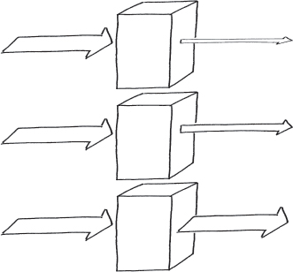

A hysterisis effect should be added to the controls to slow the system down. This will prevent oscillation between the steps, resulting in smoother response. <a href="#c07.htm#fig7.82" id="c07.htm#fig7.82a">Figure 82</a> shows an example of a hystersis loop. Different values are used as triggers to enter a new step of controls than to exit a level.

> 应在控件中添加滞后效应，以减慢系统速度。这将防止步骤之间的振荡，从而实现更平滑的响应 <a href=“#c07.htm#fig7.82”id=“c07.htm#fig7.82a”> 图 82</a>显示了一个歇斯底里循环的示例。使用不同的值作为触发器，以进入新的控制步骤，而不是退出级别。

**[Figure 82](#c07.htm#fig7.82a)** Typical hystersis curve

> **[图 82]（#c07.htm#fig7.82a）**典型的滞后曲线

This pattern slows down processing. After the system is caught up, it can release the restriction.

> 这种模式会减慢处理速度。系统被捕获后，它可以释放限制。

Once you have decided that the approach that should be taken is to SLOW IT DOWN, the actual levels and controls need to be decided upon.

> 一旦你决定了应该采取的方法是放慢速度，就需要决定实际的水平和控制。

For an example, consider the 4ESS™ Switch’s SLOW IT DOWN strategy. The 4ESS™ Switch has five levels of escalation, each of which allocates more real-time resources to call processing. The system uses EXISTING METRICS (20), using the length of the base level loop as the indicator of overload, which referred to as ’Real-Time Overload’.

> 例如，考虑 4ESS™ Switch 的慢 IT 策略。4ESS™ Switch 有五个升级级别，每个级别都为呼叫处理分配更多的实时资源。该系统使用现有度量（20），使用基准级回路的长度作为过载指示器，称为“实时过载”。

Normal system operation is referred to as real-time level zero. In this level all routine tasks (ROUTINE MAINTENANCE (22) and ROUTINE AUDITS (24)) are allowed at their normal levels. There are no restrictions placed on the work done by the system.

> 正常系统操作称为实时零级。在此级别中，所有例行任务（例行维护（22）和例行审计（24））都允许在其正常级别执行。对系统所做的工作没有任何限制。

The first level of slowing it down, called real-time level one, reduces maintenance processing by deferring some routine maintenance and audit tasks. At this level of real-time overload, routine tasks are still allowed to execute but are not allowed as much processing time as during level 0, normal operation.

> 减缓速度的第一个级别称为实时级别 1，通过推迟一些日常维护和审计任务来减少维护处理。在这种实时过载水平下，仍然允许执行例行任务，但不允许像在 0 级正常操作期间那样多的处理时间。

When level one is inadequate, additional routine tasks are restricted at level two. Resources are taken from maintenance processing and allocated more resources to call processing. This may avoid blocking calls. The switch is not yet SHEDDING LOAD (49).

> 当一级不足时，额外的例行任务限制在二级。从维护处理中获取资源，并为呼叫处理分配更多资源。这可以避免阻塞呼叫。开关尚未卸载（49）。

Real-time level two is considered inadequate for the overload when the main processor is running at 170% of engineered capacity. At this point, the system enters real-time level three and begins to SHED LOAD (49). The allocation of critical ‘call registers’ that are needed for any new request to be processed is restricted. This causes some requests for service to be ignored. As a result other switches sending the overloaded system new requests will time out or they may get a message saying that the system is busy. The other switches will route the call elsewhere. At level three, there are further reductions in routine tasks to allow even more time to be spent processing the calls that are accepted for processing.

> 当主处理器以设计容量的 170% 运行时，实时二级被认为不足以应对过载。此时，系统进入实时三级并开始卸载（49）。处理任何新请求所需的关键“呼叫寄存器”的分配受到限制。这会导致某些服务请求被忽略。因此，发送过载系统新请求的其他交换机将超时，或者他们可能会收到一条消息，表示系统正忙。其他交换机将把呼叫路由到其他地方。在第三级，进一步减少了例行任务，以允许花费更多的时间来处理接受处理的呼叫。

Real-time level four is entered if level three does not bring sufficient relief to the overloaded system. Level 4 restricts call register allocation even more, giving out only one third of normal. More requests are ignored. The system is processing less load each time through its scheduler cycles. This should stabilize the system before it reaches the next real-time threshold, which would trigger real-time level five.

> 如果第三级不能为过载系统带来足够的缓解，则进入实时第四级。第 4 级对调用寄存器分配的限制甚至更大，仅为正常值的三分之一。更多请求被忽略。系统在其调度程序周期中每次处理的负载较少。这将在系统达到下一个实时阈值之前稳定系统，这将触发实时级别 5。

If none of the other mechanisms are sufficient, level five stops accepting all new call requests by allocating no call registers. The workload that was admitted into the system is allowed to be processed, which drains the internal QUEUES FOR RESOURCES (46). The hystersis curve will eventually drop the overload to level four.

> 如果其他机制都不足够，则第五级通过不分配呼叫寄存器来停止接受所有新的呼叫请求。允许处理进入系统的工作负载，这会耗尽内部资源队列（46）。滞后曲线最终会将过载降至四级。

Throughout the progression from one overload level to the other, the system constantly REASSESES OVERLOAD DECISIONS (44) and implements an ESCALATION (9) technique to bring the system’s workload down. …

> 在从一个过载级别到另一个过载等级的整个过程中，系统不断地重新进行过载决策（44），并实施自动升级（9）技术以降低系统的工作负载…

# 54. Finish Work in Progress

… The work requests to the system are related to each other. Either each request builds upon earlier requests, or the requests might in some way alter the way in which some other request is handled.

> ……对系统的工作请求彼此相关。每个请求都建立在先前请求的基础上，或者请求可能以某种方式改变处理其他请求的方式。

More requests than can be handled are arriving; there is an overload situation. The system should maximize the number of requests that are handled to completion. Completion of both the processing of the individual requests and of the super-request of which the individuals are part of.

> 越来越多的请求无法处理；存在过载情况。系统应最大化处理到完成的请求数。完成个人请求的处理和个人所属的超级请求的处理。

The system has attempted to SLOW IT DOWN (53), but that has not proven to be enough to relieve the overload. The system needs to SHED LOAD (49) and stop processing some requests.

> 该系统已尝试使其减速（53），但这并不足以减轻过载。系统需要卸载（49）并停止处理一些请求。

**Which requests should the system accept for processing and which should it reject?**

> **系统应接受哪些请求进行处理，并应拒绝哪些请求**

The interrelationship between requests must be understood. You do not want the system to reject a request that is the last piece needed to complete some super-request task that has been processing for a long time. It also should not reject work that could negate other previously completed work, potentially resulting in locking resources that no longer have any hope of being used by any other process.

> 必须理解请求之间的相互关系。您不希望系统拒绝一个请求，该请求是完成某个已处理了很长时间的超级请求任务所需的最后一部分。它也不应该拒绝可能否定其他先前完成的工作的工作，这可能会导致锁定资源，不再有任何希望被任何其他进程使用。

If the system labels all requests as either new work or continuations of existing work it can choose which ones to be processed. If it rejects arriving requests that are continuations of previously started work then it is stopping forward progress on an existing request, potentially tying up the resources that the system can use to resolve the overload.

> 如果系统将所有请求标记为新工作或现有工作的延续，则可以选择要处理的请求。如果它拒绝作为先前启动工作的延续的到达请求，那么它将停止对现有请求的前进，这可能会占用系统可以用来解决过载的资源。

A strategy that the system can employ when it needs to SLOW IT DOWN (53) is to restrict the new requests that are processed and only accept and process requests that contribute to the completion of already existing requests. To do this effectively requires an inspection of incoming requests and the determination that the system is already processing other requests related to this new one. The previous requests must really be in progress, not merely QUEUED FOR RESOURCES (46).

> 当系统需要减慢 it 速度（53）时，系统可以采用的策略是限制处理的新请求，并且只接受和处理有助于完成现有请求的请求。要有效地做到这一点，需要检查传入的请求，并确定系统已经在处理与此新请求相关的其他请求。之前的请求必须确实在进行中，而不仅仅是等待资源（46）。

There is a case where this strategy results in the system oscillating between overloaded and idle. This occurs when admission of new tasks to the system is suspended for a period of time. When no more requests are admitted to the system, a drop in throughput occurs when the work in progress starts to complete because no work has been admitted to the system to replace the work that was removed. See <a href="#c07.htm#fig7.83" id="c07.htm#fig7.83a">Figure 83</a>. After the work in progress completes new work is admitted, which, if still an overloading amount, will cause the cycle to repeat. A solution to this problem is to enable a small amount of new work to start during periods of overload. This prevents the system from ever starving for new work. It won’t prevent a sudden dip in traffic, but will smooth the effects. The parameters associated with the system’s hysteresis curve (see SLOW IT DOWN (53)) will also influence this oscillation.

> 在这种情况下，这种策略会导致系统在过载和空闲之间振荡。当系统中的新任务被暂停一段时间时，就会出现这种情况。当没有更多的请求被允许进入系统时，当正在进行的工作开始完成时，吞吐量会下降，因为没有工作被允许进入到系统以替换已删除的工作。参见图 83</a>。在进行中的工作完成后，允许新的工作，如果仍然是过载量，将导致循环重复。解决这一问题的方法是在过载期间启动少量新工作。这防止了系统对新工作的渴求。这不会防止交通量突然下降，但会减缓影响。与系统滞后曲线相关的参数（参见“慢下来”（53））也会影响这种振荡。

**[Figure 83](#c07.htm#fig7.83a)** Potential oscillation with exclusive strategy

> **[图 83]（#c07.htm#fig7.83a）**具有排他性策略的潜在振荡

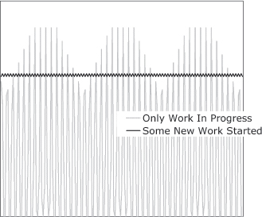

Therefore,

> 因此

**Process the requests that are continuations of work in progress. Ignore and reject the requests for new work.**

> **处理作为正在进行的工作的延续的请求。忽略并拒绝新工作的请求**

Use FINAL HANDLING (50) to cleanly release any resources needed for the requests that are cancelled. If arriving requests are related to work in progress it passes through, otherwise it is discarded, as shown in <a href="#c07.htm#fig7.84" id="c07.htm#fig7.84a">Figure 84</a>.

> 使用 FINAL HANDLING（50）彻底释放取消的请求所需的任何资源。如果到达的请求与它通过的正在进行的工作相关，否则它将被丢弃，如图 84</a>所示。

**[Figure 84](#c07.htm#fig7.84a)** Finish up work in overloading stream

> **[图 84]（#c07.htm#fig7.84a）**完成重载流中的工作

This pattern focuses on those super-requests that are groupings of requests received at independent times, offering a way to improve their throughput. FRESH WORK BEFORE STALE (55) addresses requests that arrive singly and are not related to other requests. It can also be layered on top of this pattern to choose which initial requests should be allowed to start processing.

> 这种模式侧重于那些在独立时间接收的请求分组的超级请求，提供了一种提高吞吐量的方法。暂停前刷新工作（55）处理单独到达且与其他请求无关的请求。它也可以在这个模式之上分层，以选择应该允许哪些初始请求开始处理。

Being able to identify and categorize arriving requests means that they can be sorted by other criteria as well, which can help SHED LOAD (49). …

> 能够识别和分类到达的请求意味着它们也可以根据其他标准进行排序，这可以帮助卸载（49）…

# 55. Fresh Work Before Stale

… More requests for service are arriving than the system can possibly handle. You are concerned about quality of service and want to maximize the overall quality of service.

> …到达的服务请求比系统可能处理的更多。您关注服务质量，希望最大限度地提高整体服务质量。

The requestors can abandon requests prior to completion by their requestors. This is common when the requests are made by people, for example web page requests or telephone calls. Another scenario where this is common is when the requester is timing the response from the system and finds that it is too long and abandons the previously sent request and sends a new copy of it. This pattern is not applicable if every request, once initiated, must be completed.

> 请求者可以在请求者完成之前放弃请求。这在人们提出请求时很常见，例如网页请求或电话呼叫。另一种常见的情况是，当请求者对来自系统的响应进行计时时，发现响应太长，放弃先前发送的请求并发送新的请求副本。如果每个请求一旦启动就必须完成，则此模式不适用。

The system has the ability to sort incoming requests into different categories, which enables it to FINISH WORK IN PROGRESS (54) and to intelligently SHED LOAD (49).

> 该系统能够将传入的请求分类为不同的类别，这使其能够完成正在进行的工作（54）和智能卸载（49）。

**How can you ensure that the maximum number of requests get good service?**

> **如何确保最大数量的请求得到良好的服务**

When requests take a very long time to process, the requestors may give up waiting. This makes more work for the system as it must then FINAL HANDLE (50) the request. If delays grow too long, the system will spend time initiating processing on already abandoned requests.

> 当处理请求需要很长时间时，请求者可能会放弃等待。这为系统带来了更多的工作，因为它必须最终处理（50）请求。如果延迟太长，系统将花费时间开始处理已经放弃的请求。

When the system is processing as many requests as it can, it will almost always need to queue requests before they can be served, QUEUE FOR RESOURCES(46). The most simple way to queue, or buffer, the requests is to use a buffer that acts like a First In First Out queue, as shown in <a href="#c07.htm#fig7.85" id="c07.htm#fig7.85a">Figure 85</a>. A problem with this is that requests that are in the queue might be abandoned by their requestor. This will only be discovered when the system begins processing the request and finds out that the requestor doesn’t reply or indicates that the request is outdated. The requests are all delayed the same amount by being in the queue.

> 当系统处理尽可能多的请求时，几乎总是需要在请求被服务之前对其进行排队，queue FOR RESOURCES（46）。对请求进行排队或缓冲的最简单方法是使用类似于先进先出队列的缓冲区，如图 85</a>所示。这样做的一个问题是，队列中的请求可能会被请求者放弃。只有当系统开始处理请求并发现请求者没有回复或指示请求已过时时，才会发现这一点。由于处于队列中，所有请求的延迟量都相同。

**[Figure 85](#c07.htm#fig7.85a)** First In First Out queue

> **[图 85]（#c07.htm#fig7.85a）**先进先出队列

Requests can be processed quickly when they are queued using a stack, also known as a Last In First Out queue, <a href="#c07.htm#fig7.86" id="c07.htm#fig7.86a">Figure 86</a>. Processing starting with the fresh requests will increase the likelihood that still-valid requests are processed. When the fresh requests have all been removed from the queue, the aging, possibly abandoned ones, will remain and be processed.

> 当使用堆栈（也称为后进先出队列）排队时，可以快速处理请求，<a href=“#c07.htm#fig7.86”id=“c07.htm#fig7.86a”> 图 86</a>。从新请求开始的处理将增加处理仍然有效的请求的可能性。当所有新请求都从队列中删除后，老化的请求（可能是被放弃的请求）将保留并被处理。

**[Figure 86](#c07.htm#fig7.86a)** Last In First Out queue

> **[图 86]（#c07.htm#fig7.86a）**后进先出队列

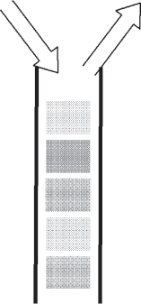

If the system knows how long requests wait for service before being abandoned it can intelligently choose which requests to continue by knowing how far down into the queue to extract requests from.

> 如果系统知道请求在被放弃之前等待服务的时间，它可以通过知道从队列中提取请求的距离来智能地选择要继续的请求。

However, keeping track of how long requests have been waiting is a difficult task. The timers need to be continually updated which adds overhead processing to the system. Extra overhead is contrary to the need during overload to reduce overload, so a simplified timing mechanism must be used.

> 然而，跟踪请求等待的时间是一项艰巨的任务。计时器需要不断更新，这增加了系统的开销处理。额外的开销与过载期间减少过载的需要相反，因此必须使用简化的定时机制。

To ensure that some requests receive service quickly, process a few requests as soon as they arrive without any buffering. This ensures that the quality of service for at least a few requests will be excellent.

> 为了确保某些请求能够快速接收服务，请在一些请求到达时立即处理，而无需任何缓冲。这确保了至少有几个请求的服务质量将非常好。

Therefore,

> 因此

**Use a Last In First Out queue and also serve some new requests immediately, <a href="#c07.htm#fig7.87" id="c07.htm#fig7.87a">Figure 87</a>. In that way, at least some requests will have a high quality of service.**

> **使用后进先出队列并立即处理一些新请求，<a href=“#c07.htm#fig7.87”id=“c07.htm#fig7.87a”> 图 87</a>。这样，至少一些请求将具有高质量的服务**

**[Figure 87](#c07.htm#fig7.87a)** Fresh work before stale

> **[图 87]（#c07.htm#fig7.87a）**陈化前的新鲜工作

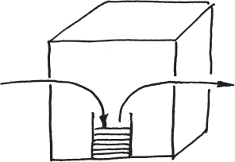

Some requests are receiving a high quality of service. Some other requests will receive a poor quality of service; however, they are the ones most likely to have been abandoned.

> 一些请求得到了高质量的服务。其他一些请求的服务质量较差；然而，它们是最有可能被遗弃的。

If requests are related to each other then FINISH WORK IN PROGRESS (54) should be used to continue processing the work that has already been started. …

> 如果请求彼此相关，则应使用 FINISH WORK IN PROGRESS（54）继续处理已开始的工作…

# 56. Marked Data

… The system has a way to detect errors in data that it uses. Once detected, an ERROR CONTAINMENT BARRIER (13) will initiate processing of the error.

> …该系统有一种方法来检测其使用的数据中的错误。一旦检测到，错误包含屏障（13）将启动错误处理。

The system detected erroneous data, either in a message that is passing through this part of the system, or in an element of data that was stored earlier and accessed by this part of the system. Alternatively, the error was detected as the result of an operation.

> 系统检测到错误的数据，无论是在通过系统这一部分的消息中，还是在先前存储并由系统这部分访问的数据元素中。或者，作为操作的结果检测到错误。

The system does not have enough information to be able to correct the erroneous data automatically. This can be because there is not any record or _a priori_ knowledge of what the correct value should be, or it does not contain sufficient information embedded within it to be corrected, e.g. it does not contain any ERROR CORRECTING CODES (57).

> 系统没有足够的信息来自动纠正错误数据。这可能是因为没有关于正确值应该是什么的任何记录或先验知识，或者它不包含嵌入其中的足够信息以进行校正，例如它不包含任何纠错码（57）。

The error that has been detected has a limited scope that does not require that the system state be greatly altered even though it can’t be immediately corrected. In other words, error mitigation is more appropriate than error recovery actions such as restoring from a CHECKPOINT (37), or conducting a ROLLBACK (32) and ROLL-FORWARD (33).

> 检测到的错误范围有限，即使无法立即纠正，也不需要对系统状态进行重大更改。换句话说，错误缓解比错误恢复动作更合适，例如从 CHECKPOINT（37）恢复，或执行 ROLLBACK（32）和 ROLL-FORWARD（33）。

**When the system finds uncorrectable erroneous data, how can the error be kept from spreading?**

> **当系统发现不可纠正的错误数据时，如何防止错误扩散**

Sometimes stored data contains an error, for example when it is something that was put away for later use into medium to longer-term storage. The part of the system that is going to contain the error might not have enough information to be able to determine if it was incorrect when first stored or if it was corrupted during storage. Using the invalid data will cause a failure; it must be contained to prevent this from happening. The corruption may have occurred in the past, but it remained unidentified until the data is about to be used. ROUTINE AUDITS (24) are used to detect corrupt data before the data is needed for processing. In many cases, CORRECTING AUDITS (2) correct these elements of faulty data. However, if the audits are not available, or the nature of the data prevents automatic correction, then the data won’t be correctable.

> 有时存储的数据包含错误，例如，当它是被保存以供以后使用的中长期存储时。系统中包含错误的部分可能没有足够的信息，无法确定它在首次存储时是否不正确，或者在存储过程中是否损坏。使用无效数据将导致故障；必须控制它，以防止这种情况发生。腐败可能发生在过去，但在数据即将被使用之前，它仍然是未知的。例行审计（24）用于在数据需要处理之前检测损坏的数据。在许多情况下，纠正审计（2）纠正这些错误数据元素。然而，如果审计不可用，或者数据的性质阻止自动更正，那么数据将无法更正。

The storage medium sometimes attempts to tolerate errors on its own. For example, the memory of the system contains ERROR CORRECTING CODES (57). These codes can only detect a certain number of bit errors in a given memory unit, but this will be sufficient for many error cases. This memory is common in systems designed from the hardware up to be fault tolerant, but these error correcting and detecting code memories add expense.

> 存储介质有时试图独自容忍错误。例如，系统的存储器包含纠错码（57）。这些代码只能在给定的存储单元中检测到一定数量的位错误，但这对于许多错误情况来说已经足够了。这种存储器在从硬件到容错设计的系统中很常见，但这些纠错和检测代码存储器增加了开销。

If the data cannot be corrected it must be QUARANTINED (28). In the short term, the entity that detects that it is erroneous should not use it. The system must discard the results of any actions taken with that data.

> 如果无法纠正数据，则必须进行检疫（28）。在短期内，检测到数据错误的实体不应使用它。系统必须丢弃对该数据采取的任何操作的结果。

We also do not want the data used by any other parts of the system. It can be marked in a way that other parts of the system do not have to spend much time detecting that it was erroneous, and can quietly contain the impact of the error. Rules must be defined for how to proceed when encountering any data items that have been marked.

> 我们也不希望系统的任何其他部分使用数据。它可以以这样的方式标记，即系统的其他部分不必花费太多时间来检测它是错误的，并且可以安静地控制错误的影响。当遇到任何已标记的数据项时，必须定义如何继续的规则。

In some cases merely marking the data as erroneous is insufficient and the system must undertake active error recovery steps in order to contain an error. For example, when there is no correct action possible because the erroneous data will control a branching of program execution.

> 在某些情况下，仅仅将数据标记为错误是不够的，并且系统必须采取有效的错误恢复步骤以包含错误。例如，当由于错误数据将控制程序执行的分支而无法进行正确操作时。

The IEEE ’Not a Number’ is an example for marking a value erroneous in a way that enables processing to continue. The IEEE standard 754-1985 defines standard representations for binary floating-point numbers. While defining the numerical representation they also define a special value ‘Not a Number’ or ‘NaN’. NaN is stored in place of a floating-point value as the result of certain illegal floating-point operations, for example division by zero. The standard defines rules for how subsequent computations should behave when one of the operands is NaN. \[IEEE754\]

> IEEE“非数字”是一个示例，用于标记一个错误的值，以使处理能够继续。IEEE 标准 754-1985 定义了二进制浮点数的标准表示。在定义数字表示时，它们还定义了一个特殊值“Not a Number”或“NaN”。NaN 存储在浮点值的位置，作为某些非法浮点操作的结果，例如除以零。该标准定义了当操作数之一为 NaN 时，后续计算的行为规则\[IEEE754\]

Rules for processing an operand that is marked by someone else as being erroneous should include two different types of information, which are both present in the NaN rules from the IEEE. The first type of information is how the operation should proceed. Possible rules include assuming a default value, skipping the operation and marking the result as erroneous, seeking the information from an alternate source, aborting execution or invoking an ERROR HANDLER (30), and so on. The second type of information that should be part of any rule is whether any notification to other parts of the system should be made when a previously marked erroneous value is encountered. The IEEE standard refers to this as signaled or quiet. This signaling is appropriate if some intermediate mechanism would have been expected to correct the error and so the current occurrence of the erroneous flag is totally unexpected.

> 处理被其他人标记为错误的操作数的规则应该包括两种不同类型的信息，这两种信息都存在于 IEEE 的 NaN 规则中。第一类信息是操作应该如何进行。可能的规则包括假定默认值、跳过操作并将结果标记为错误、从备用源查找信息、中止执行或调用 ERROR HANDLER（30）等。第二类信息应成为任何规则的一部分，即当遇到先前标记的错误值时，是否应向系统的其他部分发出任何通知。IEEE 标准将其称为信号或安静。如果期望某个中间机制纠正错误，并且因此错误标志的当前出现完全是意外的，则该信令是适当的。

Messages sometimes contain erroneous data elements. These must also be contained. In some cases, the system must discard the entire message. This is most effortless when the protocol supports retransmission because the message is unacknowledged.

> 消息有时包含错误的数据元素。这些也必须包含在内。在某些情况下，系统必须丢弃整个消息。当协议支持重传时，这是最容易的，因为消息未被确认。

Individual data elements within the message are sometimes identifiable as being erroneous. If only parts of a message are incorrect then a mechanism such as the IEEE NaN can be used to identify the erroneous part. This allows computing to continue while taking into account the erroneous elements.

> 消息中的单个数据元素有时可识别为错误。如果只有消息的部分不正确，则可以使用诸如 IEEE NaN 之类的机制来识别错误部分。这允许在考虑错误元素的同时继续计算。

When the results of a computation or processing are determined to be erroneous, the NaN approach of marking the data element can work as well. In some cases, the detection of an error at this level indicates that the part of the system that performed the computation is erroneous. The entire part of the system should be marked and avoided rather than just the result, but the IEEE NaN is too low level. One approach is to report to the FAULT OBSERVER (10) and rely on higher level system functions to contain and repair the faulty entity.

> 当计算或处理的结果被确定为错误时，标记数据元素的 NaN 方法也可以起作用。在某些情况下，在该级别检测到错误表明执行计算的系统部分是错误的。系统的整个部分都应该标记和避免，而不仅仅是结果，但 IEEE NaN 水平太低。一种方法是向故障观察者（10）报告，并依靠更高级别的系统功能来控制和修复故障实体。

Marking data or results so that they are not used is not free. In the case of IEEE NaN the mark is encoded in place of the value, but sometimes the error mark might require additional ‘meta-memory’. Resources are required to check for the erroneous mark and take appropriate actions.

> 标记数据或结果以使其不被使用不是免费的。在 IEEE NaN 的情况下，标记被编码以代替值，但有时错误标记可能需要额外的“元存储器”。需要资源来检查错误标记并采取适当的措施。

Therefore,

> 因此

**Mark erroneous data to indicate that it is unusable, <a href="#c07.htm#fig7.88" id="c07.htm#fig7.88a">Figure 88</a>. Define rules for processing these values when they are encountered.**

> **标记错误数据以表明其不可用，<a href=“#c07.htm#fig7.88”id=“c07.htm#fig7.88a”> 图 88</a>。定义遇到这些值时处理这些值的规则**

**[Figure 88](#c07.htm#fig7.88a)** Mark the erroneous data

> **[图 88]（#c07.htm#fig7.88a）**标记错误数据

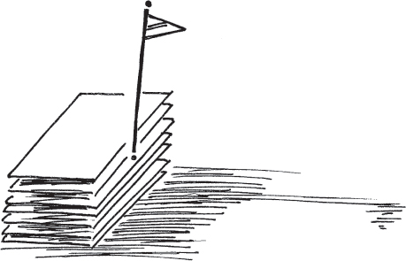

The periodic checking of data for correctness is a variant of this pattern. Instead of waiting for the data to be accessed in normal operations, the ROUTINE AUDIT (24) mechanism will periodically check for correctness and either mark or correct it.

> 定期检查数据的正确性是这种模式的一种变体。在正常操作中，ROUTINE AUDIT（24）机制将定期检查数据的正确性，并对其进行标记或纠正，而不是等待数据被访问。

Marking data can also be done to indicate that a data value is known to be correct, or that it is now eligible for use.

> 标记数据也可以用来表示已知数据值是正确的，或者它现在可以使用。

‘CHECKS’ by Ward Cunningham \[Cun95\] introduces the idea of an exceptional value as a computational result. This effectively contains the error to everywhere upstream from the point of detection. Failures are prevented because the system does not use the erroneous valve if it is flagged as exceptional. …

> Ward Cunningham 的“CHECKS”\[Cun95\]引入了作为计算结果的异常值的概念。这有效地包含了从检测点到上游任何地方的误差。如果系统被标记为异常，则系统不会使用错误的阀门，因此可以防止故障…

# 57. Error Correcting Code

… CHECKSUMS (25) can be used to detect whether data values (in memory or messages) are correct.

> …CHECKSUMS（25）可用于检测数据值（内存或消息中）是否正确。

**How can the system data paths and storage be made as error free as possible?**

> **如何使系统数据路径和存储尽可能无错误**

CHECKSUMS (25) work to detect that the item being protected is incorrect. They cannot correct the data.

> CHECKSUMS（25）用于检测受保护的项目是否不正确。他们无法更正数据。

To reduce errors you would like the data value corrected automatically. A number of techniques will correct erroneous data values automatically. These include ROUTINE AUDITS (24), DATA RESET (41) and even restoring from a CHECKPOINT (37). Maintaining a duplicate copy of the data eliminates the need to be able to correct an individual value. If the duplicate is stored in a location designed to be less prone to corruption, the problem of knowing which one is correct is eliminated.

> 为了减少错误，您希望自动更正数据值。许多技术将自动纠正错误的数据值。这些包括例行审计（24）、数据重置（41），甚至从检查点恢复（37）。维护数据的重复副本无需更正单个值。如果副本存储在设计为不易损坏的位置，那么就消除了知道哪一个是正确的问题。

These techniques all work by correcting the data to some known correct value.

> 这些技术都是通过将数据校正到某个已知的正确值来工作的。

An alternative is to undo the error, ignoring the value totally. In order to ignore the data value the system would need to know precisely what changed. Then the system can undo the change without knowing the value. The CHECKSUM (25) example of a parity bit will tell the system that a data value has changed, but it doesn’t provide enough information to be able to know what has changed.

> 另一种方法是撤消错误，完全忽略该值。为了忽略数据值，系统需要准确地知道发生了什么变化。然后系统可以在不知道值的情况下撤消更改。奇偶校验位的 CHECKSUM（25）示例将告诉系统数据值已更改，但它不能提供足够的信息来了解更改的内容。

However, if you introduce parity over smaller and smaller parts of the data you will eventually reach the point where the system can tell what has changed. For example, if one parity bit watches over one data bit the system can tell which data bit changed. This assumes that the parity bit does not change erroneously. In order to tell if the parity bit has changed, put another parity bit watching over it.

> 然而，如果你在越来越小的数据部分引入奇偶校验，你最终会达到系统可以知道发生了什么变化的程度。例如，如果一个奇偶校验位监视一个数据位，则系统可以判断哪个数据位发生了变化。这假设奇偶校验位不会错误地改变。为了判断奇偶校验位是否已更改，请放置另一个奇偶校验位对其进行监视。

Eventually you must stop adding bits to watch the watching (parity) bits. Making some design assumptions about the number of concurrent faults will help.

> 最终，您必须停止添加比特来观看观看（奇偶校验）比特。对并发故障的数量进行一些设计假设将有所帮助。

Error correcting codes are a very fast way of ensuring correct data. This is especially valuable when there is a high rate of transient errors changing the data.

> 纠错码是确保正确数据的一种非常快速的方法。当数据发生高速率的瞬时错误时，这一点尤为重要。

Error correcting codes are frequently applied to data streams to ensure that they are received correctly. Some examples include MPEG data streams and CDMA mobile telephony.

> 纠错码经常应用于数据流，以确保它们被正确接收。一些示例包括 MPEG 数据流和 CDMA 移动电话。

Therefore,

> 因此

**With each CHECKSUM (25) store enough information that will enable the system to automatically correct an erroneous data value when it is detected.** <a href="#c07.htm#fig7.89" id="c07.htm#fig7.89a">Figure 89</a> shows an example of a two bit code being sufficient to correct single bit errors and to detect double bit errors in four bits of data.

> **每个 CHECKSUM（25）存储足够的信息，使系统能够在检测到错误数据值时自动纠正错误数据值。**<a href=“#c07.htm#fig7.89”id=“c07.htm#fig7.89a”> 图 89</a>显示了两位代码足以纠正单位错误和检测四位数据中的双位错误的示例。

**[Figure 89](#c07.htm#fig7.89a)** Two extra bits protects four data bits

> **[图 89]（#c07.htm#fig7.89a）**两个额外的位保护四个数据位

Error correcting memories are in common use in many computers.

> 纠错存储器在许多计算机中普遍使用。

The particular design and implementation of a software error correcting code is very context specific. …

> 软件纠错码的具体设计和实现非常特定于上下文…
