**[Figure 63](#c07.htm#fig7.63a)** Error mitigation language map(错误缓解语言地图)
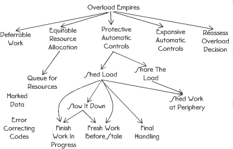

[Figure 63](#c07.htm#fig7.63) contains a language mapping for the patterns that address methods of mitigating errors.

> 图 63 包含了一个语言映射，用于解决减少错误的方法。

Many of the errors that can be mitigated are timing or overload related. They are characterized by too many requests for service, too few resources, or too little processor time. The first step to mitigate these errors is to recognize that different techniques are needed for each of these categories. OVERLOAD TOOLBOXES (42) discusses the need for different techniques for each type of timing error.

> **许多可以缓解的错误都与时序或负载有关。** 它们的特点是对服务的请求太多，资源太少或处理器时间太少。缓解这些错误的第一步是认识到**每种类别都需要不同的技术**。负载工具箱(42)讨论了每种时序错误都需要不同技术的需要。

> [!NOTE]
> 意思是这种可缓解的问题大多数都是和负载和时序相关

One of the key premises is that if the system is working hard processing requests then it must be working well, so don’t fix it, see DEFERRABLE WORK (43). In other words check how the system is performing and possibly reduce the ROUTINE MAINTENANCE (22) that is conducted to allow the resources to be used for real work. Another key premise is that the system should REASSESS OVERLOAD DECISION (44) periodically because overload and the error symptoms produced can vary rapidly, so the mitigation technique decided moments earlier may no longer be correct.

> 关键前提之一是，如果系统正在努力处理请求，则必须运行良好，因此请勿修复它，请参阅可延期工作（43）。换句话说，检查系统如何执行，并可能减少进行的常规维护（22），以允许资源用于实际工作。另一个关键前提是系统应定期重新评估超负荷决策（44），因为超负荷和产生的错误症状可能会迅速变化，因此缓解技术决定的瞬间可能不再正确。

When there are tangible resources that are in short supply the system should ensure an EQUITABLE RESOURCE ALLOCATION (45). This might mean that requests are QUEUED FOR RESOURCES (46).

> **当有实实在在的资源短缺时，系统应确保公平的资源分配(45)。这可能意味着要求资源进入队列(46)。**

> [!NOTE]
> 哦，当对资源进行分配操作的时候，就是 "排队"？

Automatic actions in the face of timing errors fall into two broad categories: expansive and protective. EXPANSIVE AUTOMATIC CONTROLS (47) are ones that expand the resources that the system has available, possibly allowing it to use extra memory, or new network connections. PROTECTIVE AUTOMATIC CONTROLS (48) take steps to protect the system from being crushed by the overhead that comes from the overload. Firewalls and workload barriers are used to protect the system from the excess workload.

> 自动控制在时间错误面前可分为两大类：扩张性和保护性。**扩张性自动控制(47)**是指可以扩大系统可用的资源，可能允许它使用额外的内存或新的网络连接。**保护性自动控制(48)**采取措施来保护系统免受来自负载超载的开销的压力。防火墙和工作负荷屏障用于保护系统免受过载的影响。

> [!NOTE]
> 前者就是可以借用分布式负载的能力，后者就是限制请求
> 这两个或许都可以通过 QoS 策略作为借口提供出来。

One of the most basic PROTECTIVE AUTOMATIC CONTROLS (48) is to SHED LOAD (49). When work is being shed there is usually some bookkeeping to be done to account for the particular requests that are discarded. FINAL HANDLING (50) says to reuse normal functions and methods during this process.

> 最基本的自动保护控制装置（48）之一是卸载（49）。当工作被丢弃时，通常需要做一些簿记来处理被丢弃的特定请求。FINAL HANDLING（50）表示在这个过程中要重用正常的功能和方法。

SHEDDING LOAD (49) is most effective if the work can be shed close to the periphery of the system. This is discussed in SHED WORK AT THE PERIPHERY (52). The ability to shed work close to the boundaries of the system is also a sign that the system is able to SHARE THE LOAD (51) between different parts of the system. SHARING THE LOAD is another useful PROTECTIVE AUTOMATIC CONTROL (48).

> **负载抛弃(49)**如果工作可以接近系统的边缘抛弃，效果最佳。这一点在边缘抛弃工作(52)中有讨论。在系统边界抛弃工作的能力也是系统能够在不同部分之间分享负载(51)的一个标志。**分享负载是另一种有用的自动保护控制(48)**。

A step towards SHEDDING LOAD (49) is to SLOW IT DOWN (53). This pattern describes how the system will fully process only the work that it can, and ESCALATE (9) the error mitigation if the techniques in use are not proving effective.

> 一步走向减轻负荷(49)是放慢它(53)。这种模式描述了系统将只处理它所能处理的工作，如果使用的技术不起作用，则升级(9)错误缓解。

When too much work is arriving at the system it must decide whether to continue work that is already in progress or to begin processing the new work. The pattern FINISH WORK IN PROGRESS (54) describes concentrating on the work that has been started rather than stopping work on it in favor of merely accepting new requests and putting them into a queue.

> 当系统收到太多工作时，它必须决定是继续已经开始的工作，还是开始处理新的工作。模式 FINISH WORK IN PROGRESS(54)描述的是集中精力完成已经开始的工作，而不是停止它，仅仅接受新的请求并将其放入队列中。

Queuing requests is an effective technique to buffer an arrival rate that is too high. Which queuing method depends on the nature of the incoming workload. The technique of FRESH WORK BEFORE STALE (55) is usually best when requests are generated by people, and also frequently best when requests are generated by other systems.

> **队列请求是缓冲过高到达率的有效技术。** 哪种排队方法取决于传入工作负载的性质。通常当请求由人产生时，FRESH WORK BEFORE STALE (55) 技术最佳，当请求由其他系统产生时，也常常是最佳的。

Data errors can be mitigated by marking the data so that it is not used by other parts of the system. This marking takes the form of a flag to indicate that other parts of the system should not use or trust the value. See the pattern MARKED DATA (56). Sometimes the data can be corrected if enough REDUNDANT (3) information is saved with it. This is described in ERROR CORRECTING CODES (57).

> **数据错误可以通过标记数据来减少，以便其他系统部分不使用它。** 这种标记形式是一个标志，表明其他系统部分不应该使用或信任该值。参见标记数据(56)模式。有时数据可以在储存足够的冗余信息的情况下得到修正。这在纠错码(57)中有所描述。

# 42. Overload Toolboxes

… FAULT CORRELATION (12) of the situation within the system is complete and the system decided that it is not an error caused by faulty hardware or software. It is an error from an excess of workload. Overload situations occur when the system loses the resources necessary to handle its workload efficiently. This might be due to internal problems, such as memory leaks or excessive maintenance work requests, or from too many requests coming from external sources. Internal problems are really faults within the system and should be handled through the fault recovery system. When external systems send too many requests for service too quickly the system must handle as many as possible and then degrade as smoothly and as little as possible.

> 系统内部情况的**故障相关性(12)**已经完成，**系统判断这不是由故障硬件或软件引起的错误。这是由过载引起的错误。** 当系统失去处理工作负荷所必须的资源时，就会发生过载情况。这可能是由于内部问题，如内存泄漏或过多的维护工作请求，或者是来自外部源的太多请求。内部问题实际上是系统内部的故障，应该通过故障恢复系统来处理。**当外部系统以太快的速度发出太多的服务请求时，系统必须尽可能多地处理，然后尽可能平稳和少地降级。**

**How should the system handle situations of overload?**

> **系统应该如何处理超负荷的情况？**

Too many requests for service can be taxing on a system in a number of ways:

> 过多的服务请求会给系统带来很多负担：

Memory: more memory might be required to store the requests than the system has available. New requests can’t receive the resources that they need to be processed.

> **内存**：存储请求可能需要更多的内存。新请求无法收到需要处理的资源。

Tangible resources: the requests might require the use of tangible peripheral resources that are already in use. The new requests must wait for the resources possibly causing further errors in the system.

> **切实资源**：这些请求可能需要使用已经使用的有形外围资源。新请求必须等待可能导致系统中更多错误的资源。

Processor CPU time: processing the requests might take more time than the system has. When the sum of all the request processing time and system overhead exceeds 100% then not everything will be done.

> **处理器 CPU 时间**：处理请求可能需要比系统更多的时间。当所有请求处理时间和系统开销的总和超过 100％时，并非所有内容都将完成。

There are a variety of techniques designed to address these resource overloads. Some techniques work best with only specific types of resources, and don’t help mitigate others. Some techniques will work for all three. Trying to manage one type of overload with a mechanism designed for another might have devastating results.

> 有各种技术旨在解决这些资源过载问题。有些技术只适用于特定类型的资源，无法帮助缓解其他资源。有些技术可以适用于所有三种资源。试图用专为另一种资源设计的机制来管理一种资源过载可能会造成灾难性的后果。

Therefore:

**Have multiple toolboxes with which to mitigate overloads. One toolbox is for managed resources like buffers or ports being controlled by the system, another for memory, and yet another for processor CPU time.** **Avoid grouping all of the possible techniques together, as they will only rarely work well for overloads in other categories. See <a href="#c07.htm#fig7.64" id="c07.htm#fig7.64a">Figure 64</a>.**

> 有多个工具箱可以缓解负荷过载。一个工具箱用于管理资源，如缓冲区或由系统控制的端口，另一个用于内存，另一个用于处理器 CPU 时间。避免将所有可能的技术分组在一起，因为它们很少能有效地处理其他类别的负荷过载。参见图 64。

**[Figure 64](#c07.htm#fig7.64a)** Different tools for different errors(不同的错误有不同的工具)
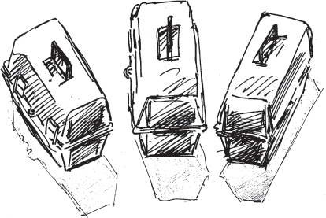

> [!NOTE]
> 对，所以第一件事就是要进行**对错误的分类**，这个还是很有必要的。

An effective technique to deal with overloads of the tangible variety is to QUEUE FOR RESOURCES (46). EQUITABLE RESOURCE ALLOCATION (45) discusses a way to divide up the tangible resources such as memory and peripheral equipment.

> 有效的技巧来**处理实物负载过载是排队获取资源(46)**。《公平资源分配》(45)讨论了一种分配实物资源(如内存和外围设备)的方法。

A technique similar to QUEUING FOR RESOURCES (46) that works for CPU cycles which are intangible is to take on FRESH WORK BEFORE STALE (55). The capabilities to SHARE THE LOAD (51) with peers or to SHED LOAD (49) also help with CPU time.

> 类似于**排队等候资源(46)的技术，适用于无形的 CPU 周期，是先做新的工作，然后再做旧的(55)**。与同伴共享负载(51)或减轻负载(49)的能力也有助于 CPU 时间。

Knowing whether the system is in processor or resource overload requires some way of measuring the overload. The system should use EXISTING METRICS (20) to evaluate overloads.

> 知道系统是否处于处理器或资源过载需要一些衡量过载的方法。系统应该**使用现有的指标(20)来评估过载**。

> [!NOTE]
> 前面章节提到过，本来就是负载不够，不能引入新的负载。

You should consider user/consumer/customer behavior when designing the system’s mechanisms to deal with an excess amount of work. Both FRESH WORK BEFORE STALE (55) and FINISH WORK IN PROGRESS (54) consider this behavior in their solutions.

> 你在设计系统来处理过量工作时应该考虑用户/消费者/客户的行为。FRESH WORK BEFORE STALE(55)和 FINISH WORK IN PROGRESS(54)都考虑了这种行为。

In a network of peers, strategies can be designed to enable one peer to notify its neighbors that it is in overload and seek assistance in handling the traffic or in reducing the load from its peers. …

> 在一个对等网络中，可以设计策略来使一个对等方通知它的邻居它正在超负荷，并寻求帮助处理流量或减轻它的邻居的负荷。

# 43. Deferrable Work

… More new work is arriving than the system can normally handle. The mitigation techniques are working and the system is stable.

> 比系统通常能处理的工作更多的新工作正在到达。**缓解技术正在起作用，系统稳定。**

> [!NOTE]
> 假如系统出现问题就是因为这个原因，比如港口车问题
> 这个时候如果只是单纯的进行冗余节点的切换，并不会有效果
> 我们应该考虑的是实现负载均衡，或者能够限制输入，或者（上一章的，没记住）
> 这个是主要的问题

The system schedules ROUTINE AUDITS (24) and other ROUTINE MAINTENANCE (22) tasks to keep the system working well. They are important to keep errors from occurring in the system. The workload is already presenting a performance error, or overload to the system, and the design of most systems enables them to tolerate only one error at a time.

> 系统安排例行审计(24)和其他例行维护(22)任务，以保持系统正常工作。它们很重要，可以避免系统出现错误。**工作量已经给系统带来了性能错误或超负荷，而大多数系统的设计只能容忍一个错误。**

The system is mitigating some of the effects of the excess application workload. This overload is keeping the system more than normally busy with its main application work. The EXPANSIVE AUTOMATIC CONTROLS (47) and PROTECTIVE AUTOMATIC CONTROLS (48) are working well and the system is able to process the workload, although it might be SHEDDING LOAD (49). The system is stable, which is to say that the overload is not causing non-performance related errors, workload is being processed at a very high level and the system will be able to ramp back down once the overload is over. In other words it isn’t broken.

> 系统正在缓解过度应用负载的部分影响。这种超负荷正在使系统比正常情况下更加忙碌地处理主要应用工作。扩展自动控制(47)和保护自动控制(48)正在良好地运行，系统能够处理负载，尽管可能会减轻负载(49)。系统稳定，也就是说**超负荷没有导致与性能无关的错误**，负载正在以非常高的水平处理，一旦超负荷结束，系统就能够恢复正常。**换句话说，它还没坏。**

**What work should the system shed when the choices are handling most of the new incoming work or the routine maintenance workload?**

> **在处理大部分新工作或者常规维护工作负载的情况下，系统应该放弃哪些工作？**

> [!NOTE]
> 这句话说得好，“**系统应该放弃哪些工作？**”

The incoming workload can use all the resources that are being allocated to the preventive or ROUTINE MAINTENANCE (22). There are not enough resources to handle both the new work and to continue the routine work. This routine work keeps the system fault tolerant. The choice is to reduce the revenue producing work even more or to restrict some of the activities that prevent errors.

> 新来的工作量可以使用所有分配给预防性或例行维护(22)的资源。**没有足够的资源来处理新工作和继续例行工作。** 这种例行工作可以使系统保持故障容错。选择是进一步减少收入产生的工作，或者限制一些防止错误的活动。

The system has very stringent availability requirements, which is why a system of audits, defensive checks, and integrity monitors is in place. These parts of the system ensure that the system is working at its peak efficiency and is detecting errors to contain and correct them quickly.

> 系统有非常严格的可用性要求，因此**采用了审计、防御性检查和完整性监视系统**。这些系统组件确保系统以最高效率运行，并能及时检测出错误，以便迅速控制和纠正。

> [!NOTE]
> 是的，在实现冗余切换的逻辑之前，应该有一套完整的监视系统！

But if the system is in overload and is stable, system resources are all being used to process the workload. Everything must be working well since the system is stable. It makes sense to defer the work that comes to play when the system is _not_ working properly, such as ROUTINE MAINTENANCE (22) and ROUTINE AUDITS (24). These deferrable items perform tasks that are not critical to processing the workload. If it is working at capacity or above and doing it well, do not check if it works: concentrate on the primary aspects of operation.

> 如果系统超负荷且稳定，系统资源全部用于处理工作负荷。由于系统稳定，一切都应该运行良好。有意义的是，当系统不正常运行时，推迟执行工作，如常规维护(22)和常规审计(24)。这些可推迟的项目执行的任务不是处理工作负荷的关键。如果它在容量或以上的情况下运行良好，不要检查它是否正常工作：专注于操作的主要方面。

Therefore,

**Make the routine work deferrable. If the system is tending toward overload, chances are that the periphery and software are working, otherwise where would all that work be coming from?** Refer to <a href="#c07.htm#fig7.65" id="c07.htm#fig7.65a">Figure 65</a>. If the system is not broken and it is merely working hard, then it doesn’t need to be fixed.

> 让例行工作可以延期。如果系统正在趋向过载，很有可能外围和软件正在工作，否则哪里来的工作量？参考<a href="#c07.htm#fig7.65" id="c07.htm#fig7.65a">图 65</a>。如果系统没有损坏，只是很努力地工作，那么就不需要修复它。

**[Figure 65](#c07.htm#fig7.65a)** Congestion squeezes maintenance(拥堵压缩维护)
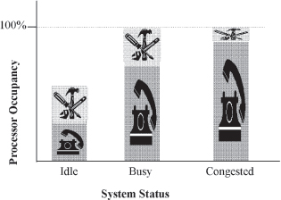

There is a chance that the system just _seems_ like it’s in overload, though it may be really reacting to errors. In that case, SOMEONE IN CHARGE (8) should employ REASSESS OVERLOAD DECISION (44). REASSESS OVERLOAD DECISION also addresses when this strategy is not providing enough relief and the system is not really stable.

> 有可能系统只是看起来像是超负荷，但它可能是真的反应到错误。在这种情况下，有责任的人应该重新评估超负荷决策。重新评估超负荷决策还解决了这种策略没有提供足够的缓解，而系统并不真正稳定的问题。

Everything that the system does is important to someone. But not everything is directly related to the primary purpose of the system. Tasks should not be deferred forever because that lowers the overall fault tolerance of the system. …

> 一切系统所做的事情对某人都很重要。但并不是每件事都与系统的主要目的有直接关系。**任务不应被无限期推迟，因为这会降低系统的整体容错能力。** …

# 44. Reassess Overload Decision

… The system is attempting to FINISH WORK IN PROGRESS (54) as well as to SHED LOAD (49).

> 系统正试图完成(54)正在进行中的工作，以及减轻(49)负荷。

The system is overloaded with work requests. The system is employing error mitigation techniques such as DEFERRABLE WORK (43) to reduce the impact of the overload. Decisions about what techniques to employ were based on FAULT CORRELATION (12).

> 系统负荷过重，因此采用了延迟工作(43)等错误缓解技术来减轻负荷。关于采用哪些技术的决定是基于故障相关(12)的。

**What should the system do when the workload mitigation techniques being used are not working to diminish the workload?**

> 当使用的负载减轻技术**无法减轻工作量时，系统该做什么？**

What happens if load keeps increasing in spite of all attempts to slow the system down?

> 如果尽管采取了所有措施仍然无法减缓系统的负载，会发生什么？

The system is well engineered so that work shedding keeps the system from becoming saturated. The mechanisms such as to SHED LOAD (49) are working, yet the influx of new requests or the compounding of internal inefficiencies are not producing the desired reduction in workload. These mechanisms create a feedback loop that should keep load from getting out of hand.

> 系统设计得很好，可以通过工作分配来防止系统饱和。例如 SHED LOAD(49)的机制正在起作用，但是新请求的涌入或内部效率不高没有产生预期的工作量减少。**这些机制形成了一个反馈回路，可以防止负荷超出控制。**

Something is wrong if we have not processed any new requests for service in a long time. The system is designed to perform some work, such as to process web requests or telephone calls. If that work is deferred or skipped for too long a period, the system is unavailable.

> 如果我们很长一段时间没有处理新的服务请求，就出了问题。该系统旨在执行一些工作，如处理网络请求或电话呼叫。如果这项工作被延迟或跳过太长时间，系统就不可用了。

A major goal of the error mitigation techniques is to preserve system integrity so the system can handle the routine level of traffic after the period of overload ends.

> 一个主要的**错误缓解技术的目标是保持系统完整性，以便系统在过载结束后能够处理日常的流量。**

If the mitigation techniques are not enough to bring the system out of saturation, then the error may be coming from a source other than traffic overload.

> 如果缓解技术不足以使系统摆脱饱和状态，那么错误可能来自于除了流量过载之外的其他来源。

Therefore,

**Provide the system with a feedback loop which provides information to enable the system to reexamine FAULT CORRELATION (12) decisions. This enables the system a chance to decide that it is not a timing related error but really an error execution and to attempt a different error processing strategy, see <a href="#c07.htm#fig7.66" id="c07.htm#fig7.66a">Figure 66</a>.**

> 为系统提供反馈回路，以提供信息，使系统能够重新审查故障相关(12)决定。**这使系统有机会判断它不是一个时序相关的错误，而是真正的错误执行，并尝试不同的错误处理策略**，请参见<a href="#c07.htm#fig7.66" id="c07.htm#fig7.66a">图 66</a>。

**[Figure 66](#c07.htm#fig7.66a)** Reexamining prior decisions(重新审视以往的决定)
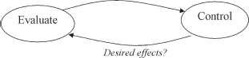

Design the system to be able to ESCALATE (9) the error analysis to try different mitigation techniques or to enter the escalation chain for error recovery.

> 设计系统能够升级(9)错误分析，尝试不同的缓解技术或进入升级链以恢复错误。

Feedback loops are an established mechanism in control theory.

> **反馈回路是控制理论中的一种已建立的机制。**

> [!NOTE]
> 好家伙，这里就直接说是控制理论了

The system can get further and further into trouble by following the wrong path unless reexamination is possible. SOMEONE IN CHARGE (8) should perform the analysis since they have a view of the overall system. …

> 系统如果沿着错误的路径越走越远，除非能够重新审查，否则会陷入更大的麻烦。应该由负责人(8)来进行分析，因为他们对整个系统有一个整体的视角。

# 45. Equitable Resource Allocation

… The system is trying to handle FRESH WORK BEFORE STALE (55) and yet it has many requests queued for resources. There are distinct types of resources that need to be allocated to requests such as database or network connections. The system is designed to institute error mitigation actions automatically, and there are no errors preventing them from being instituted.

> 系统正试图在旧工作之前处理新工作(55)，但它有许多请求排队等待资源。需要为请求分配不同类型的资源，如数据库或网络连接。系统被设计为自动实施错误消减措施，并且没有错误阻止它们被实施。

**How should requests for scarce resources be handled?**

> **应该如何处理稀缺资源的请求？**

The arriving requests might all be the same, or they might arrive differently in either type or priority. For example, the requests might be for information from a company’s website. Many requests for queries into the database are received, and a few orders are placed; these are examples of two different types of requests. The system is designed to allow the company’s salesmen to access the system with higher priority than the ordinary user’s priority; an example of different priority levels.

> **请求可能会完全相同，也可能以不同的类型或优先级到达。** 例如，请求可能是公司网站的信息。收到许多查询数据库的请求，并下达了几个订单；这些是两种不同类型请求的例子。该系统设计允许公司的销售人员以比普通用户优先级更高的优先级访问系统；这是不同优先级的一个例子。

The system could strictly follow FRESH WORK BEFORE STALE (55) and only give the newest requests service. This will result in those requests that should have priority not receiving it because they are buried in the lower priority requests.

> 系统可以严格按照 FRESH WORK BEFORE STALE(55)的规则，**只为最新的请求提供服务**。这将导致应该优先处理的请求无法得到优先处理，因为它们被埋在较低优先级的请求中。

If the different types of requests are routed to different parts of the system for processing, then the parts with the fewer arriving requests will be idle some of the time, since the handler for the more common requests is receiving more work. There might be a specific resource that is especially overloaded. If requests are allocated based only upon their newness, or other preferred position in the queue, they might end up blocking, and being prevented from accessing, this resource anyway.

> 如果不同类型的请求被路由到系统的不同部分进行处理，那么收到请求较少的部分有时会处于空闲状态，因为处理更常见请求的处理器正在接收更多的工作。可能会有一个特别负载过重的资源。如果只根据请求的新颖性或队列中的其他优先位置来分配请求，它们可能会遇到阻塞，无法访问该资源。

Another strategy would be to look at all the requests for service, both fresh and queued, and allocate resources equitably to all of them. While this requires additional bookkeeping to keep track of requests and their resource needs, work can be directed around extremely specific resource overloads. This helps ensure the greatest common good by providing service to as many requests as possible.

> **另一种策略是查看所有新的和排队的服务请求，并公平地分配资源给所有人。** 虽然需要额外的记账来跟踪请求及其资源需求，但可以围绕极端具体的资源过载来指挥工作。这有助于通过为尽可能多的请求提供服务来确保最大的公共利益。

Priority inversion is a problem that results when a task of a lower priority is preventing a task of higher priority from executing because the lower priority tasks hold a resource that is needed by the higher priority task. When sorting messages and distributing them to queues, it is important to avoid creating the priority inversion-like situation of the lower priority requests keeping higher priority tasks from executing. Ensure that the mechanism that is dividing requests into processing pools fairly processes all requests in order, or periodically pauses and processes the more important requests. Make certain that the resources needed by the lower priority, or higher volume, requests don’t prevent higher priority requests from being processed.

> **优先级反转是一个问题**，当较低优先级的任务阻止较高优先级的任务执行时，因为较低优先级的任务持有较高优先级任务所需的资源而导致的。在对消息进行排序并将其分发到队列时，重要的是避免创建类似于低优先级请求阻止高优先级任务执行的优先级反转状况。确保将请求公平地分配到处理池的机制有序地处理所有请求，或者定期暂停并处理更重要的请求。确保低优先级或较高量请求所需的资源不会阻止高优先级请求的处理。

Therefore,

**[Figure 67](#c07.htm#fig7.67a)** Balance resource allocation

> **[图 67](#c07.htm#fig7.67a)** 资源分配平衡
> 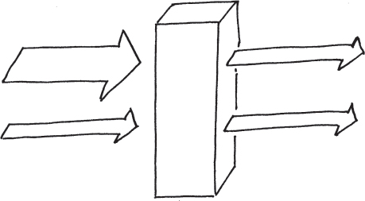

To group things and handle the pools, QUEUE FOR RESOURCES (46). When requests terminate abnormally, FINAL HANDLING (50) is required to efficiently release any held resources. …

> 将事物分组并处理池，请求资源(46)。当请求异常终止时，需要最终处理(50)以有效释放任何持有的资源。

> [!NOTE]
> 感觉这一节是和实时任务相关的，这个冗余一块不是特别重要？

# 46. Queue for Resources

… The system is mitigating a workload spike, and is not otherwise in the midst of processing an error. Too many requests are being received.

> 系统正在缓解工作负荷高峰，并且没有处理错误。收到的请求太多了。

**What should be done with requests for resources that cannot be handled immediately when they arrive?**

> **对于无法立即处理的资源请求应该怎么办？**

The system is receiving more requests for work than it can process successfully as they arrive, but in general the system is able to gracefully handle the excess requests for service.

> 系统收到的工作请求比它能够成功处理的多，但总的来说，**系统能够优雅地处理过量的服务请求。**

An option for the system is to discard all requests that it can’t handle immediately as they arrive. This supports the pattern SHED LOAD (49). Only those requests that can be handled will be kept. This will have immediate effects on an overload. There will be little overhead associated with this because the only work that is done for the requests to be rejected is the rejection.

> **一个系统的选择是丢弃所有它无法立即处理的请求。** 这支持 SHED LOAD(49)模式。只有那些可以处理的请求才会被保留。这将对过载产生立即影响。这将不会有太多开销，因为**唯一要做的就是拒绝请求。**

There are many flaws with this approach though. For one, a request that arrived as several individual requests might be prevented from completing, just as the last request needed to complete it arrives and is discarded. This is discussed in FINISH WORK IN PROGRESS (54). Another is that important single work items might be eliminated without any consideration. The pattern MAINTENANCE INTERFACE (7) discusses this within the context of maintenance messages being lost. And yet another flaw is that the overload might be momentary, and if the request were taken in and put in a queue then there may be resources available for it after a very short wait.

> 这种方法有很多缺陷。比如，作为几个单独请求到达的请求可能会被阻止完成，就像最后一个需要完成它的请求到达并被丢弃一样。这在 FINISH WORK IN PROGRESS(54)中有所讨论。**另一个是重要的单个工作项可能会被没有任何考虑地消除。** MAINTENANCE INTERFACE(7)模式在维护消息丢失的背景下讨论了这一点。另一个缺陷是负载可能是暂时的，如果**请求被接受并放入队列中，那么在很短的等待后可能有资源可用**。

If the system can store the work in a queue for later processing then the work item might complete eventually. This still has risks; one is that the queue might become longer than can be effectively managed. Another is that even after a short period in a queue the resources needed for a request are still not available, requiring the request to be rejected at that point, or put back in the queue.

> **如果系统能够将工作存储在队列中以便稍后处理，那么工作项最终可能会完成。** 这仍然存在风险；一个是**队列可能变得比可以有效管理的长**。另一个是即使在队列中短暂停留，所需的资源仍然不可用，需要在此时拒绝请求，或者将其放回队列中。

Managing the queue requires resources and introduces overhead. You must be careful to not make the situation worse by designing inefficient queue handling methods.

> 管理队列需要资源，并会带来额外开销。你必须小心，不要通过设计低效的队列处理方法使情况变得更糟。

Therefore,

**Store requests for service that cannot be handled immediately in a queue, <a href="#c07.htm#fig7.68" id="c07.htm#fig7.68a">Figure 68</a>. Give the queue a finite length to improve the likelihood that the request is still important when it reaches the head of the line.**

> 将无法立即处理的服务请求存储在队列中，<a href="#c07.htm#fig7.68" id="c07.htm#fig7.68a">图 68</a>。 为了提高请求仍然重要的可能性，给队列设定一个有限的长度。

**[Figure 68](#c07.htm#fig7.68a)** Queue requests(队列请求)
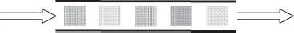

When the requests are computer generated and must be processed in order, a First In First Out (FIFO) queue should be used. When people are generating the requests, the queue should use a Last in First Out (LIFO, a.k.a. a stack) strategy (as in FRESH WORK BEFORE STALE (55)) to govern insertion and removal. This will help people receive good service. The request that was placed on the queue last will think that they received excellent service, and the person that placed the longest ago request on the queue probably gave up already.

> 当请求是由计算机生成的，并且**必须按顺序处理时，应该使用先进先出(FIFO)队列**。当人们生成请求时，队列应该使用后进先出(LIFO，又名堆栈)策略(如 FRESH WORK BEFORE STALE(55))来管理插入和移除。这将有助于人们获得良好的服务。放在队列最后的请求会认为他们得到了出色的服务，而最早放在队列上的请求可能已经放弃了。

Allocation of resources under the guidance of EQUITABLE RESOURCE ALLOCATION (45) should recognize both the requests that have been queued and those that are fresh and have never been queued. …

> 资源分配在公平资源分配(45)的指导下，应该既考虑已排队的请求，也要考虑新的从未排队的请求。

# 47. Expansive Automatic Controls

… The system is capable of applying automatic controls when it becomes overloaded.

> **系统能够在超负荷时自动施加控制。**

The system is receiving an overload of work requests. It is able to process all of this offered load but it is almost saturated. The finite resources, such as memory blocks, threads, network ports, etc., that are needed to complete the requests are almost all used or occupied. As soon as a request completes, the resources that the completed request is releasing back into the system are being acquired for a new request. If the workload increases slightly then new requests will either need to QUEUE FOR RESOURCES (46) or they will have to be rejected (SHED LOAD (49)). When this point is reached then the system starts wasting time looking for resources to allocate and performing the overhead work of placing the new request on a queue.

> 系统正在接收大量工作请求。它可以处理所有这些提供的负载，但它几乎已经饱和了。所需的有限资源，如内存块、线程、网络端口等，几乎都已用完或被占用。一旦请求完成，完成请求释放回系统的资源就会被用于新请求。如果负载稍微增加，新请求就需要排队等待资源(46)，或者被拒绝(抛弃负载(49))。**当达到这一点时，系统开始浪费时间寻找可分配的资源，并执行将新请求放入队列的开销工作。**

In this pattern the metric being watched is the number of work requests that are processed completely. This is a view of the error that focuses more on the incoming work than the view taken in PROTECTIVE AUTOMATIC CONTROLS (48) (which is system throughput).

> 在这种模式中，被监视的度量是完全处理的工作请求的数量。这是一个关于错误的视图，比起在保护性自动控制(48)中采取的视图(即系统吞吐量)，更多地关注于传入的工作。

---

**How can we avoid both the wasted effort processing the requests that can’t immediately be handled in an overload and at the same time increase overall request completions?**

> **我们怎样才能避免在过载情况下处理不及时的请求而浪费精力，同时又能提高整体请求完成率？**

This seems impossible: not waste effort queuing or discarding excess requests and increase the number of requests that can be handled. The resource that is exhausted is finite. Unless it can be increased this seems impossible.

> **这似乎不可能**：不浪费等待排队或丢弃多余的请求，并增加可以处理的请求数量。被耗尽的资源是有限的。除非可以增加，否则似乎不可能。

It is common to employ PROTECTIVE AUTOMATIC CONTROLS (48) to protect systems during overload. If PROTECTIVE AUTOMATIC CONTROLS are used solely when confronted with congestion, each system will shrink back upon itself and request completion rates will decrease. Many of the protections result in requests being discarded (SHED LOAD (49)). Effort is expended to SHED LOAD. SHED WORK AT PERIPHERY (52) helps reduce the effort in the core of the system by shedding it at the edge.

> **在过载时，使用保护性自动控制(48)来保护系统是很常见的。** 如果只在面对拥塞时使用保护性自动控制，每个系统都会收缩，完成率会降低。许多保护措施会导致请求被丢弃(SHED LOAD(49))。努力被用来丢弃负载。在边缘抛弃工作(52)有助于**通过在系统边缘抛弃来减少系统核心的工作量**。

If some way to expand the range of possibilities available to a system were possible then more work can be done. Are there alternative ways that a system can deal with its workload? Ways that are normally not used? Can any of these ways be built in?

> 如果有办法扩大系统可用的可能性范围，那么可以做更多的工作。系统有没有其他处理工作量的方法？通常不使用的方法？有没有可以建立的方法？

High performance systems are usually designed to operate at less than 100% processor occupancy during ordinary execution. The unallocated processor time is held in reserve to support occasional spikes or periodic tasks. It can also be released for general requests when the system is overloaded.

> **高性能系统通常被设计为在正常执行时处理器占用率低于 100％。** 未分配的处理器时间保留以支持偶尔的尖峰或周期性任务。当系统负载过重时，还可以释放用于一般请求。

> [!NOTE]
> 感觉这一章总的来说，需要对系统的负载，或者系统的状态进行一个监控
> 这里的 100% 有点像是之前在 WINDRIVER 听到的实时系统一般是 69% 的 CPU 占用

Another example of expanding the resources available to a system to complete its work comes from the telephone network. There are many direct communication links between two telephone offices. Using links between the telephone offices and intermediate offices creates many multi-hop routes between the two telephone offices. A strategy used in the telephone network is that only the direct routes are used to service ordinary, non-overload requests to communicate between the telephone offices. When the systems become overloaded the non-direct, multi-hop routes are made available for use.

> 另一个扩大系统可用资源以完成其工作的例子来自电话网络。两个电话办公室之间有许多直接的通信链路。使用电话办公室和中间办公室之间的链路在两个电话办公室之间创建了许多多跳路线。电话网络中使用的策略是，只使用直接路线来服务普通的、非超载的请求，以在电话办公室之间进行通信。**当系统超载时，可以使用非直接、多跳路线。**

Expanding the resources that the system may use provides immediate relief of the request overload. It is not a permanent solution. If the offered load continues to increase, the system will again be confronted with more traffic than it can handle. Other means of mitigating the overload should be used in conjunction with the expansion of resources to reduce the impacts of the continued overload, <a href="#c07.htm#fig7.69" id="c07.htm#fig7.69a">Figure 69</a>.

> 扩大系统可以使用的资源可以立即缓解请求负载。这不是一个永久的解决方案。如果提供的负载继续增加，系统将再次面临超出它所能处理的流量。应该与资源扩大相结合，以减少持续负载的影响，见图 69。

**[Figure 69](#c07.htm#fig7.69a)** Expansion helped but is needed again(回拓有所帮助，但仍然需要再次回拓)
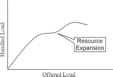

Therefore,

**Design some resources into the system that will be used only in case of overload. Provide new ways for the system to do its work that either uses reserved resources or fewer resources.**

> 设计一些仅在负载过重时使用的资源。提供新的方式，让系统使用预留资源或更少的资源来完成工作。

**[Figure 70](#c07.htm#fig7.70a)** Provide additional ways to process the workload

> **[图 70](#c07.htm#fig7.70a)** 提供额外的方法来处理工作量

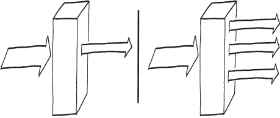

Expansive Automatic Controls provide new ways for the system to do its work.

> 自动扩展控制提供了新的方式来完成系统的工作。

Defer some ROUTINE MAINTENANCE (22) work during peak traffic times. This expands the amount of real-time that is available to perform revenue-generating work. Deferring maintenance work also enables this pattern to be applied to processor capacity. This was discussed in DEFERRABLE WORK (43).

> 把一些例行维护(22)工作推迟到高峰时段。这增加了可用于执行盈利工作的实时时间。推迟维护工作还可以将此模式应用于处理器容量。这在可延期工作(43)中进行了讨论。

PROTECTIVE AUTOMATIC CONTROLS (48) deals with finitely bounded resources. This pattern deals with resources that can be expanded.

> 保护性自动控制(48)处理有限边界的资源。 这种模式处理可以扩展的资源。

An example of an expansive control from highways is when the police direct traffic over side streets, possibly in violation of posted regulations, to avoid an accident scene. They have the authority to take this action but they seldom exercise it. Another example is using all lanes of a highway to carry traffic in one direction to allow a higher number of people to leave an area threatened by a natural disaster, such as a hurricane. …

> 一个关于公路的扩大控制的例子是，警察可能违反规定，指挥车辆绕行侧路，以避免发生事故。他们有权采取这一行动，但很少实施。另一个例子是，使用公路的所有车道，将车辆指向一个方向，以便让更多的人离开受到自然灾害(如飓风)威胁的地区。

# 48. Protective Automatic Controls

… The system is capable of processing errors automatically. The metric being watched is throughput – the number of requests that are successfully processed. Congestion is occurring because there are too many requests that need the finite resources available within the system. For example, internal messaging bandwidth is becoming fully utilized.

> **系统能够自动处理错误。** 正在监视的指标是吞吐量 - 成功处理的请求的数量。拥塞发生是因为有太多的请求需要系统中有限的资源。例如，内部消息带宽已经完全使用。

> [!NOTE] > **系统能够自动处理错误。**
> 我们正在的事情，概括来说也可以这么表达

When resources are almost fully used, the overhead to find available resources increases. This extra overhead, coupled with the overload of work, poses a threat to the system. The threat is that the throughput will begin decreasing because the overhead is reducing the time available for processing the arriving workload. In poorly designed systems the overhead work can bring the system to a halt.

> 当资源几乎被完全使用时，**寻找可用资源的开销增加。这种额外的开销加上工作负荷，对系统构成了威胁。** 威胁是吞吐量将开始下降，因为开销正在减少处理到达工作负荷的时间。在设计不良的系统中，开销工作可能会使系统陷入停滞。

---

**What actions should an overloaded system take to avoid spending all of its time doing overhead work associated with new requests arriving?**

> 系统负载过高时，应该采取哪些措施来避免花费所有时间处理新请求带来的开销工作？

The system is in overload. More requests are arriving than the system can normally process. If the system takes on all the arriving work, requests will have to be QUEUED FOR RESOURCES (46) until the needed resources become available. Processing effort is required to enqueue and dequeue the requests for service. If the congestion continues then queue lengths will increase and delays will become unacceptable. The nature of the traffic also comes into play. If the traffic is being generated by people then some of the oldest requests that were put into the queue will be invalid because the people abandoned their request. Usually this takes the form of ignoring or stopping a current request and immediately resubmitting a request. The result is that the queue contains requests that are no longer valid, in addition to newer valid duplicated requests. FRESH WORK BEFORE STALE (55) discusses a mitigation technique for this.

> **系统超负荷。** 比系统正常处理能力更多的请求正在到达。如果系统接受所有到达的工作，请求将必须排队等待资源(46)，直到所需的资源可用。处理工作需要入队和出队请求服务。如果拥塞继续，队列长度将增加，延迟将变得不可接受。流量的性质也会发挥作用。如果流量是由人们产生的，那么一些最早放入队列的请求将是无效的，因为人们放弃了他们的请求。通常这里采用忽略或停止当前请求并立即重新提交请求的形式。结果是，队列中既包含无效的请求，也包含更新的有效重复请求。“新鲜工作优先于旧工作”(55)讨论了解决这个问题的技术措施。

The responses that a system can take when confronted with overload and too many requests for resources can be one of these three. The first is to shrink within itself, taking whatever actions are necessary to be protected from the onslaught of too much traffic. In extreme cases this means that the system will stop processing any requests.

> 系统在面对负载过载和过多的资源请求时所采取的反应可能是以下三种之一。**第一种是自我缩小**，采取必要的行动来保护自己免受过多流量的冲击。在极端情况下，这意味着系统将停止处理任何请求。

The second is to open itself up to the traffic, taking on as much as it can but shedding unnecessary internal work, DEFERRABLE WORK (43), and when it becomes necessary SHEDDING LOAD (49) in general and if possible (because it’s better) SHEDDING WORK AT THE PERIPHERY (52).

> 第二是要向流量开放，尽可能多地接受，但抛弃不必要的内部工作，可推迟的工作(43)，而当有必要时，**一般要进行负载抛弃(49)**，如果可能的话(因为更好)，在边缘抛弃工作(52)。

The third is to not do anything. This generally leads the system into instability as queue sizes keep increasing, and too much overhead work is required to accept requests and place them on the queue. Eventually the overhead work will overwhelm the system and it will stop performing useful work.

> 第三种是什么也不做。这通常会导致系统失去稳定性，因为队列大小会不断增加，而接受请求并将它们放入队列所需的开销工作也会增加。最终，这些开销工作会压垮系统，使其无法执行有用的工作。

A typical response to too much work is for the system to begin thrashing. The system takes on more than it can handle, response times increase and the problems just magnify. This causes throughput to decrease greatly. By protecting itself the system will have a lower throughput than it did before the automatic control started, but the drop off will not be as severe as if nothing had been done.

> 当工作量太多时，典型的反应是系统开始抖动。系统承担的负担超出了它所能承受的范围，响应时间增加，问题就会放大。这导致吞吐量大大降低。通过保护自身，系统的吞吐量会比自动控制开始之前低，但下降幅度不会像什么都没做的时候那么严重。

Therefore,

**Automatically impose restrictions on how much work the system accepts to protect the system’s ability to function. The system has techniques to mitigate the effects of too many requests for service which should be invoked when the congestion is in elements that have finite limits and no unused capacity remains.**

> 在系统接受工作的数量上自动施加限制，以保护系统的功能。当拥塞发生在具有有限限制且没有剩余容量的元素上时，系统有技术可以减轻过多服务请求的影响，应该调用这些技术。

**[Figure 71](#c07.htm#fig7.71a)** Protect the system(保护系统)

Without protection the system throughput will drop in an overload due to resource contention, <a href="#c07.htm#fig7.72" id="c07.htm#fig7.72a">Figure 72</a>.

> 没有保护，**由于资源争用，系统吞吐量在过载情况下会降低**，<a href="#c07.htm#fig7.72" id="c07.htm#fig7.72a">图 72</a>。

**[Figure 72](#c07.htm#fig7.72a)** Throughput with resource contention

> **[图 72](#c07.htm#fig7.72a)** 带有资源争用的吞吐量

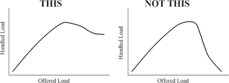

Metered freeway entrance ramps are examples of PROTECTIVE AUTOMATIC CONTROLS(48). When the finite resource of highway capacity becomes congested it is possible to automatically restrict the rate at which new traffic enters the highway by using stoplights at the top of the entrance ramp. At predetermined intervals the stoplight will turn green and allow one request for service (car) onto the freeway. This limits the amount of new work that is added to the system, at the risk of backing traffic up at the entrance ramp. In many cities these protective stoplights only restrict traffic during busy periods, i.e. rush hour.

> **计量公路入口坡道是保护性自动控制的示例(48)。** 当高速公路能力的有限资源变得拥挤时，可以通过在入口坡道顶部使用红绿灯自动限制新交通进入高速公路的速度。**在预定的间隔时间内，红绿灯会变绿，允许一个服务请求(汽车)进入高速公路。这限制了系统中新增工作的数量，但也冒着在入口坡道备背交通的风险。** 在许多城市，这种保护红绿灯**只在繁忙时期(即高峰时间)限制交通**。

Typically processor real-time is considered a finite resource and PROTECTIVE CONTROLS are needed to deal with congestion for it.

> 一般来说，处理器实时被视为有限资源，**需要采取保护控制来处理拥塞问题**。

This pattern applies when the resource is finite. If there are ways of expanding the range of possibilities – of increasing the amount of the resource – then apply EXPANSIVE AUTOMATIC CONTROLS (47).…

> 这种模式**适用于资源有限**的情况。如果有扩大可能性范围的方法——增加资源数量——那么应该使用扩张式自动控制(47)。

# 49. Shed Load

… More work is arriving than the system can handle.

> 比系统能处理的更多的工作正在到来。

Workload increases as requests are accepted for processing. If too many requests are accepted the system throughput can decrease to the point that no work is being completed. When this happens the system is unavailable, and this must be avoided.

> 工作量随着接受处理的请求而增加。如果接受的请求太多，系统吞吐量会降低到完成不了任何工作的程度。当这种情况发生时，系统就不可用了，这必须避免。

---

**How can the system best handle too many requests and keep them from overwhelming the system?**

> **如何最好地处理过多的请求并防止它们压垮系统？**

Adding more software mechanisms to the system to handle the excess workload adds complexity, which can add faults. The overhead cost of the extra mechanisms can also exceed the amount of work that it saves.

> 在系统中添加更多的软件机制来处理过量的工作量会增加复杂性，这可能会带来故障。额外机制的开销也可能超过它所节省的工作量。

**[Figure 73](#c07.htm#fig7.73a)** Unacceptable throughput

> **[图 73](#c07.htm#fig7.73a)** 不可接受的吞吐量

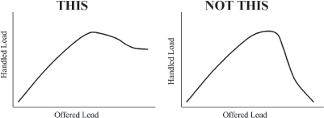

The system can shed some of the work, not accepting all of it, which will enable it to process the accepted workload well. The work should be shed as early as possible, before it consumes many system resources, see SHED WORK AT PERIPHERY (52).

> 系统可以放弃一些工作，而不是接受全部工作，这将使其能够很好地处理接受的工作负载。应尽早放弃工作，以免消耗大量系统资源，请参阅 SHED WORK AT PERIPHERY(52)。

Shedding some workload enables the system to stabilize. It can reduce the amount of processing capacity needed to handle unexpected surges in workload.

> 裁减一些工作量可以使系统稳定下来。这可以减少处理意外工作量所需的处理能力。

The mechanism to shed work should consider how the communicating system will behave when its work requests are rejected.

> 有关放弃工作的机制应该考虑当工作请求被拒绝时，通信系统的行为如何。

When the work is arriving in the form of messages, work can be shed by failing to acknowledge work request messages as they arrive. Many times the sender will retransmit the message. This is both good and bad. Good because when the retransmission arrives the system may be able to process it; the overload might be passed. But bad if the system is still overloaded because it is another request for service.

> 当工作以消息的形式到达时，如果不及时回复工作请求消息，就可能会带来负担。很多时候发件人会重新发送消息。这既有好处也有坏处。好处是，当重新发送的消息到达时，系统可能能够处理它，可以减轻负担。但是，**如果系统仍然超负荷，因为它是另一个服务请求，这就是坏处了。**

How to handle work that arrives from people depends on the circumstances. For example, telephone calls and web clicks have different human behavior characteristics. The STRATEGY \[GHJ+95\] pattern is useful for encoding the needed variation between these scenarios.

> 处理来自人们的工作取决于情况。例如，电话和网络点击有不同的人类行为特征。STRATEGY \[GHJ+95\] 模式可用于编码这些场景之间所需的变化。

Therefore,

**Shed some requests so that the others may receive good service.**

> 请提出一些要求，以便其他人能够得到良好的服务。

**[Figure 74](#c07.htm#fig7.74a)** Discard some requests for the good of others

> **[图 74](#c07.htm#fig7.74a)** 为了他人的利益而放弃一些请求。

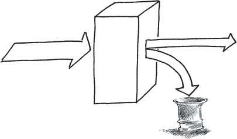

This is an example of PROTECTIVE AUTOMATIC CONTROLS (48). SLOW IT DOWN (53) describes a way to add escalating workload shedding filters. FINISH WORK IN PROGRESS (54) discusses a way to intelligently select the work requests that should be rejected. The pattern FRESH WORK BEFORE STALE (55) describes an effective way of acknowledging and responding well given human behavior when requests are shed or ignored.

> 这是一个保护性自动控制(48)的例子。慢下来(53)描述了一种添加不断增加的工作负荷滤波器的方法。完成正在进行的工作(54)讨论了一种智能选择应该拒绝的工作请求的方法。模式新鲜工作在变质之前(55)描述了一种有效地承认和良好地回应请求被抛弃或忽略时人类行为的方法。

Whenever work is discarded, FINAL HANDLING (50) comes into play to release the resources used by the discarded work. …

> 每当工作被抛弃时，最终处理(50)就会起作用，释放被抛弃工作使用的资源。

# 50. Final Handling

… When requests finish, the resources that they used are routinely released back to process other requests. Sometimes a request does not complete to the point at which resources are released. These abnormal terminated transactions and all the resources that they used need releasing.

> 当请求完成时，它们使用的资源会被例行释放回去处理其他请求。有时，请求不会完成到资源被释放的那一点。这些异常终止的交易及其所使用的所有资源都需要释放。

**Should there be a separate mechanism to support only the abnormally terminated request’s need to release resources?**

> **是否应该有一种单独的机制来支持只有异常终止请求才需要释放资源？**

The first resolution to consider is to not clean up abnormally terminated transactions. This will leave resources tied up and unavailable for other requests. This is like a memory leak. Eventually the system will run out of resources. The resources can be collected automatically by a garbage collection mechanism, but only recently have garbage collection mechanisms provided the deterministic performance needed by most fault tolerant systems.

> 首先要考虑的决议是不要清理异常终止的交易。这将使资源被占用而无法提供给其他请求。这就像内存泄漏一样。最终系统会耗尽资源。资源可以通过垃圾回收机制自动收集，但直到最近，垃圾回收机制才提供了大多数容错系统所需的确定性性能。

The easiest option at development time is to release the resources with a separate mechanism. This simplifies the design because the normal and abnormal control flows do not need to be interwoven. The control flows do not need to interact, which reduces complexity. Two (or more) mechanisms will be added to the system, one for the normal cases and another for the abnormal cases. Separate mechanisms can be kept simple. This presents a maintenance challenge though because now there are two (or more) different mechanisms that need to be maintained. If a design fault is later identified in one of the mechanisms, all of them need to be checked to make certain that they do not have the same fault. While the mechanisms are more simple because the normal and abnormal are considered separately, there is roughly an integer multiple of the amount of code needed for the normal resource release. With more code there will be more latent faults.

> 最简单的开发时间选项是用**单独的机制释放资源**。这简化了设计，因为正常和异常的控制流不需要交织在一起。控制流不需要交互，这降低了复杂性。系统中将添加两个(或多个)机制，**一个用于正常情况，另一个用于异常情况**。可以保持单独的机制简单。但这也带来了维护挑战，因为现在有两个(或多个)不同的机制需要维护。如果稍后在其中一个机制中发现设计故障，则需要检查所有机制，以确保它们没有相同的故障。虽然机制更简单，因为正常和异常分开考虑，但正常资源释放所需的代码量大约是整数倍。有更多的代码就会有更多的潜在故障。

Another option is to design the system so that the normal and abnormal cases share the same resource release mechanism. This can result in a more complicated design since the normal and abnormal control paths must be coordinated. There might be special steps that need to be done for the abnormal case or different information that needs to be recorded in logs. This complexity opens the potential for faults in the design. But the amount of code present will be less than two times the amount of code needed for resource releasing in the normal case, <a href="#c07.htm#fig7.75" id="c07.htm#fig7.75a">Figure 75</a>. An advantage is that there is only one place to correct in case a fault is found.

> 另一个选择是设计系统，使正常和异常情况共享相同的资源释放机制。这可能会导致更复杂的设计，因为正常和异常控制路径必须协调。可能需要为异常情况执行特殊步骤，或者需要在日志中记录不同的信息。这种复杂性增加了设计错误的可能性。但是，与正常情况下资源释放所需的代码数量相比，代码数量将少于两倍，如图 75 所示。一个优点是，如果发现故障，只有一个地方需要纠正。

**[Figure 75](#c07.htm#fig7.75a)** Less code when common

> **[图 75](#c07.htm#fig7.75a)** 代码更少，常见情况下

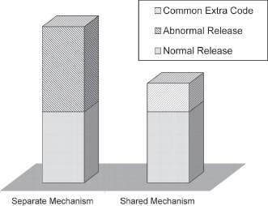

Most fault tolerant systems are in use for a long time. As a result the costs to maintain the system must be considered in addition to the development costs, <a href="#c07.htm#fig7.76" id="c07.htm#fig7.76a">Figure 76</a>. Additional software needed to handle the separate release of resources adds to the maintenance costs.

> 最高容错系统长期使用。因此，除了开发成本外，还必须考虑系统维护成本，<a href="#c07.htm#fig7.76" id="c07.htm#fig7.76a">图 76</a>。需要额外的软件来处理资源的单独释放，增加了维护成本。

Therefore,

**[Figure 76](#c07.htm#fig7.76a)** Lower maintenance costs

> **[图 76](#c07.htm#fig7.76a)** 更低的维护成本

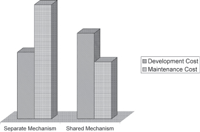

**Integrate the release of resource for internally terminated transactions with the usual release of resources done by normal task termination. See <a href="#c07.htm#fig7.77" id="c07.htm#fig7.77a">Figure 77</a>.**

> 集成内部终止交易的资源释放，与正常任务终止时通常做的资源释放。参见<a href="#c07.htm#fig7.77" id="c07.htm#fig7.77a">图 77</a>。

**[Figure 77](#c07.htm#fig7.77a)** Release through the normal means

> **[图 77](#c07.htm#fig7.77a)** 通过正常手段释放

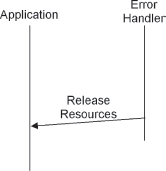

In this way there are few possibilities of forgetting to release some part. This saves development and testing time because it needs to only be written once. It also saves memory space. In a system that is designed to be highly available, the benefits of single development and maintenance of only one code are great and support the principle of keeping it simple.

> 在这种方式下，遗忘释放某些部分的可能性很小。这样可以节省开发和测试时间，因为只需要写一次。它还节省了内存空间。在一个设计为高可用的系统中，只开发和维护一个代码的好处是巨大的，并支持保持简单的原则。

Data should be collected when transactions are terminated abnormally. This data needs to be presented to human managers so that they can make changes to strategy or network topology.

> **数据应该在交易异常终止时收集。** 这些数据需要呈现给人类管理者，以便他们可以对策略或网络拓扑做出更改。

> [!NOTE]
> 这个点给出很好，系统出现问题了，需要先保存现场，再宕机（切换）

As an example, consider that on some freeways there are emergency pull-off locations where it is safe to stop and report an accident or vehicle problem without obstructing the normal flow of traffic. After the problem is reported or corrected the normal lanes are used to resume the trip up to a normal exit. These emergency pull-offs do not provide special exit ramps. They provide the ability to perform some special actions and then the normal exit ramp is used. …

> 例如，在一些高速公路上有紧急停车位，可以在不妨碍正常交通流量的情况下安全停车报告事故或车辆故障。报告或纠正问题后，使用正常车道恢复行程到正常出口。这些紧急停车位不提供特殊出口坡道。它们提供执行一些特殊操作的能力，然后使用正常出口坡道。 ...

# 51. Share the Load

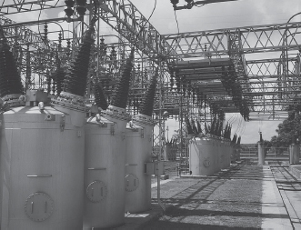

… You are designing a system that should be able to handle excess workload when it is presented.

> 你正在设计一个系统，它应该能够在出现过量工作负荷时得到处理。

The system might not have enough processing power to handle all of the requests for service. The system might have some parallel elements, either through clustering or multiple processing cores.

> 系统可能没有足够的处理能力来处理所有服务请求。系统可能具有一些并行元素，通过集群或多个处理内核。

You have exhausted all other means of designing the system for the needed capacity.

> 你已经尝试了其他所有方法来设计系统以达到所需的容量。

---

**How can you increase the available processing power?**

> 你怎么增加可用的处理能力？

Adding processors to the system increases complexity and makes it more difficult to ensure that it is fault tolerant. However, the increased complexity is traded against the addition to the system’s REDUNDANCY (3) which enables other mechanisms for error processing, such as FAILOVER (36) to be implemented.

> 加入处理器到系统会增加复杂性，并使得确保它是故障容错变得更加困难。但是，**增加的复杂性可以换取系统的冗余(3)**，从而使得其他错误处理机制，比如故障转移(36)得以实现。

> [!NOTE]
> 这句话，说的好，增加系统的冗余就会增加系统的复杂性
> 那么需要保证的事情就是增加的安全性应该能够大于对系统增加的复杂性

When functions move from one processor to another, you must watch closely the partitioning to ensure that you are not adding to the overall workload. One way that workload will increase is by the need for shared data and the overhead needed to keep it synchronized between the processors. Careless choices can actually increase the workload on the system rather than decrease it. Unless the amount of processing that is shareable between processors is significant it might not help in the resolution of overload.

> 当函数从一个处理器移动到另一个处理器时，您必须仔细观察划分，以确保您不会增加整体工作负荷。增加工作负荷的一种方式是需要共享数据以及在处理器之间保持同步所需的开销。粗心的选择实际上可能会增加系统的工作负荷，而不是减少它。除非可在处理器之间共享的处理量足够大，否则可能无助于解决负荷过载。

Preprocessing work needed before the main processing of a request can be moved to another processor. Its functions can be an adjunct to the main processing and the results provided to the main part of the system. Some examples of preprocessing include firewall/virus/other security scanning, request characterization and intelligent routing to enable efficient load balancing, monitoring arriving traffic to support FRESH WORK BEFORE STALE (55) and SHED WORK AT PERIPHERY (52). This other processor can be anything from a specialized appliance to another processor chip or FPGA on a media card in a bladed architecture or different general purpose system. In general it doesn’t need to be identical to the main processor, although that option is valid also.

> **在主处理请求之前需要进行预处理工作。** 它的功能可以作为主处理的附属部分，并将结果提供给系统的主要部分。预处理的一些示例包括防火墙/病毒/其他安全扫描、请求特征化和智能路由，以实现高效的负载平衡、监控到达的流量以支持 FRESH WORK BEFORE STALE (55)和 SHED WORK AT PERIPHERY (52)。这个其他处理器可以是任何从专用设备到另一个处理器芯片或 FPGA 在刀片式架构或不同的通用系统上的媒体卡上的东西。一般来说，它不需要与主处理器相同，尽管这个选项也是有效的。

> [!NOTE]
> 这个思路很好，需要先进行一些预处理的工作，比如之前想到的暖启动等等

An EXPANSIVE AUTOMATIC CONTROL (47) is to make extra processing resources available during periods of overload. For example, free up other members of a processing cluster, or engaging resources in a different part of a corporate network.

> 一个扩展的自动控制(47)是**在过载期间提供额外的处理资源**。例如，释放处理集群的其他成员，或者在公司网络的不同部分激活资源。

> [!NOTE]
> 这个是新世界，如果系统已经过载了，而不是错误（这就要对系统的故障进行判断的意义了）
> 那么，这个时候是否可以支持结束冗余备份的节点，等待系统恢复过来之后
> 这个就和负载均衡的方式相互协调了，这种情况可能是在一个板子上进行的部署的多个节点
> 所以对于单个板子来说，没法做到负载均衡，对于单个功能来说可能是负载均衡的

Therefore,

**[Figure 78](#c07.htm#fig7.78a)** Share the work(分担工作)
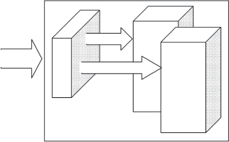

The processor that receives off-loaded work need not be local. The network that shares the work can be larger and the off-load processor might be very far away. Some sort of message needs to be sent to the other processors to let them know that they should assume some of the work. Other components of the system will need to be told also to route traffic to the other elements.

> **处理接收负载工作的处理器不一定要本地的。** 共享工作的网络可以更大，而负载处理器可能会非常遥远。需要发送某种消息给其他处理器，让他们知道他们应该承担一些工作。系统的其他组件也需要被告知，以便将**流量路由到其他元素**。

> [!NOTE]
> 将流量路由到其他元素！
> 这个说法就很专业！

If you design the capability for the workload to move from one processor to another you will need some way to synchronize them. If individual transactions take several requests, either you will have to design the capability to migrate all of the information related to a transaction, or you will have to design the ability to share transaction information (and state). …

> 如果你设计让工作负载从一个处理器移动到另一个处理器的能力，你需要一些方法来同步它们。如果单个交易需要几个请求，你要么设计一种能力来迁移与交易相关的所有信息，要么设计一种能力来共享交易信息(和状态)。…

# 52. Shed Work at Periphery

… Requests for service are arriving more quickly than the system can process them. The system can SHED LOAD (49).

> 要求的服务比系统能够处理的速度更快。系统可以减轻负载(49)。

---

**How does the system SHED LOAD (49) that is beyond system capacity for the lowest additional effort?**

> **系统如何以最低的额外努力来处理超出系统容量的负载(49)？**

As work requests are processed by the system, the system has an ever increasing investment in its completion. As more and more effort is expended completing any particular request for service, the benefits to the system of shedding any particular request diminish. The least effort time to shed load is before it uses any efforts of the system, <a href="#c07.htm#fig7.79" id="c07.htm#fig7.79a">Figure 79</a>.

> 随着工作请求被系统处理，系统在完成过程中投入越来越多的投资。随着越来越多的努力完成任何特定的服务请求，系统摆脱任何特定请求的好处减少了。摆脱负载的最少努力时间是在它使用系统的任何努力之前，<a href="#c07.htm#fig7.79" id="c07.htm#fig7.79a">图 79</a>。

**[Figure 79](#c07.htm#fig7.79a)** Effort expended increases with completion percentage

> **[图 79](#c07.htm#fig7.79a)** 所花费的努力随着完成百分比的增加而增加

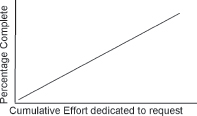

The system design provides mechanisms to shed requests that cannot be processed because of overload situations. The system might have mechanisms to characterize and intelligently shed the work requests. However, this processing might be in the heart of the system – in the most overloaded part. Fewer system resources will be expended if the request never makes it to the center of the system.

> 系统设计提供机制来抛弃因负载情况而无法处理的请求。系统可能具有机制来表征和智能地抛弃工作请求。然而，这种处理可能在系统的核心部分——最繁忙的部分。如果请求从未到达系统的中心，将会节省更多的系统资源。

As an example, consider the design of a system that has processing elements that terminates many Ethernet connections. The Ethernet terminating element starts preprocessing the arriving requests, for example screening the requests with firewall functionality. After screening on this element, the request is passed to other parts of the system for further processing. The system, as a whole, will have spent the least time processing the request if it is shed at the Ethernet termination.

> 例如，考虑一个系统的设计，它具有终止许多以太网连接的处理元素。以太网终止元素开始对到达的请求进行预处理，例如使用防火墙功能筛选请求。在这个元素上筛选后，请求将被传递到系统的其他部分进行进一步处理。如果在以太网终止处处理请求，整个系统将花费最少的时间处理请求。

Therefore,

**[Figure 80](#c07.htm#fig7.80a)** Shed work at entry to system

> **[图 80](#c07.htm#fig7.80a)** 系统入口处的棚屋工作

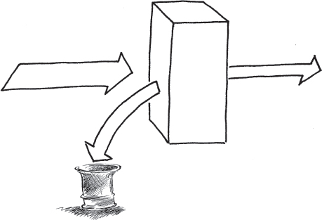

Work shedding done as soon as it hits the boundary of the system keeps the core of the system from seeing excess requests. If the core is the performance bottleneck then the system will be able to handle the accepted workload.

> 工作削减一旦达到系统的边界就会马上进行，以防止系统核心部分受到过多的请求。如果核心是性能瓶颈，那么系统就能够处理被接受的工作量。

The title of this pattern comes from the peripheral equipment needed to make a computer into a network element, such as a telephone switch. The peripheral equipment can be made intelligent and assist in the multiprocessing of requests to SHARE THE LOAD (51). Many mainframes also have peripheral and terminal controllers that also meet the requirements of this pattern’s resolution. …

> 这个模式的标题来自于将计算机变成网络元素所需的外围设备，比如电话交换机。外围设备可以被智能化，并协助多处理请求来分担负担(51)。许多大型机也具有符合本模式解决方案要求的外围和终端控制器。

# 53. Slow it Down

… The system reacts to the work that is presented to it. If no limits exist to the arriving workload then the system could be overloaded to the point where nothing is getting done. There are upper thresholds beyond which the system cannot perform its desired function. Degradation of functionality is gradual below this threshold. The system can’t wait for a human to help resolve the situation so it is using MINIMIZE HUMAN INTERVENTION (5).

> 系统对提交给它的工作做出反应。如果没有对到达的工作负荷的限制，那么系统可能会被超负荷到什么都做不了的地步。**有一个上限，超过这个上限系统就无法完成其预期功能。在这个阈值以下，功能逐渐降低。系统不能等待人类来帮助解决问题，因此它正在使用最小化人工干预(5)。**

---

**What should the system do when it has more requests for service than it can possibly handle efficiently?**

> 当系统收到的服务请求**超出了它能够高效处理的范围时，它应该做什么？**

The system goal is to perform useful work. Shutting down does not do this and neither does becoming overwhelmed and ineffective due to the workload

> **系统的目标是执行有用的工作。** 关闭不会做到这一点，由于工作量过大而变得不知所措和无效也不行。

The system has routine tasks such as ROUTINE MAINTENANCE (22) and ROUTINE AUDITS (24) and a fault tolerance design to keep the system healthy. Otherwise it can never be sure whether an event is an error or excess workload. Maintenance and fault tolerance functions are DEFERRABLE WORK (43) and have less immediacy than application processing in a healthy system.

> 系统**有例行任务**，如例行维护(22)和例行审计(24)以及容错设计，以**保持系统健康**。否则，它永远无法确定事件是错误还是超负荷工作。维护和容错功能是可延迟的工作(43)，在健康的系统中，其优先级低于应用程序处理。

The system can trade off between fault tolerance and administrative tasks and application tasks to increase the application’s share of the processor, but there is still an upper limit beyond which the system cannot function.

> 系统可以在容错性和管理任务以及应用任务之间进行权衡，以增加应用程序在处理器上的份额，但是仍然有一个上限，超过此上限系统将无法正常运行。

One approach to handling overload is to just ignore the fact that too many requests are happening. Eventually the system will stop working. This approach requires design of fault handlers for this eventuality. Possibly build in an overseeing agent (human or otherwise) to save the day and resume processing, MAXIMIZE HUMAN PARTICIPATION (6).

> 一种**处理超载的方法是忽略过多请求发生的事实**。**最终系统将停止工作。** 这种方法需要为这种最终情况设计故障处理程序。可能建立一个监督代理(人或其他)来拯救局面并恢复处理，最大限度地参与人的参与(6)。

The system can gradually reduce the amount of work that is done to gracefully restrict the amount of effort expended on each request for service. This will smooth the performance curve leading to total lack of useful work. The point of saturation where no work is done will still exist, but it will not be reached as quickly.

> **系统可以逐渐减少完成每个服务请求所耗费的工作量，以优雅地限制工作强度。** 这将使性能曲线变得平滑，导致没有有效工作。极限点仍然存在，但不会被达到得那么快。

As an example, when centrally managing thread creation, slow down the creation of new threads whenever the number of threads becomes too large. \[Lea97\]

> **当集中管理线程创建时，当线程数量变得太大时，就要减缓新线程的创建。[Lea97]**

> [!NOTE]
> 管理系统进程的创建

For simplicity and ease of designer and maintainer understanding, discrete steps should be used rather than continuous adjustment. The added complexity and difficulty understanding any errors within the request slowing mechanism must be weighed with the benefits of continuous adjustment. Implementing discrete steps can build upon the ESCALATION (9) mechanisms already built into the system.

> 为了简化设计师和维护者的理解，应该采用离散步骤而不是连续调整。增加的复杂性和难以理解请求减慢机制中的任何错误必须与连续调整的好处相抵消。实施离散步骤可以建立在系统中已经构建的 ESCALATION(9)机制之上。

Therefore,

**Use an ESCALATION (9) strategy with several steps to restrict request processing. Each step’s restrictions are more severe than its predecessor. The goal is to slow things down until the system can catch up with load. The higher the number of requests for service, the harder the system puts on the brakes. This implements a feedback system that keeps processed workload from rising indefinitely.**

> 使用一系列步骤来采取升级(9)策略来限制请求处理。**每一步的限制比前一步更严格。目标是减缓速度，直到系统能够跟上负载。** 请求服务的数量越多，系统就会越重地刹车。这实施了一个反馈系统，使处理的工作量不会无限地上升。

**[Figure 81](#c07.htm#fig7.81a)** Stepped restrictions
**阶梯式限制**

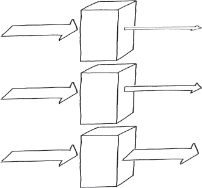

**[Figure 82](#c07.htm#fig7.82a)** Typical hystersis curve

> **[图 82](#c07.htm#fig7.82a)** 典型的滞环曲线

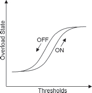

> [!NOTE]
> 这个阶梯降级的想法很好

This pattern slows down processing. After the system is caught up, it can release the restriction.

> 这种模式会减缓处理速度。系统处理完后，可以解除限制。

Once you have decided that the approach that should be taken is to SLOW IT DOWN, the actual levels and controls need to be decided upon.

> 一旦你决定采取的方法是**放慢速度，就需要确定具体的水平和控制。**

For an example, consider the 4ESS™ Switch’s SLOW IT DOWN strategy. The 4ESS™ Switch has five levels of escalation, each of which allocates more real-time resources to call processing. The system uses EXISTING METRICS (20), using the length of the base level loop as the indicator of overload, which referred to as ’Real-Time Overload’.

> 例如，考虑 4ESS™ 交换机的“放慢速度”策略。 4ESS™ **交换机有五个升级层次**，每个层次都分配更多的实时资源来处理呼叫。 该系统使用现有指标(20)，**使用基本层循环的长度作为过载的指示，称为“实时过载”。**

> [!NOTE]
> 这个“实时过载”的概念很好！

Normal system operation is referred to as real-time level zero. In this level all routine tasks (ROUTINE MAINTENANCE (22) and ROUTINE AUDITS (24)) are allowed at their normal levels. There are no restrictions placed on the work done by the system.

> **正常系统操作被称为实时等级零。** 在此等级中，所有常规任务(常规维护(22)和常规审计(24))均按其正常水平进行。系统所做的工作没有任何限制。

The first level of slowing it down, called real-time level one, reduces maintenance processing by deferring some routine maintenance and audit tasks. At this level of real-time overload, routine tasks are still allowed to execute but are not allowed as much processing time as during level 0, normal operation.

> **第一级减缓，称为实时级别一，通过推迟一些常规维护和审计任务来减少维护处理。** 在这个实时负载级别，例行任务仍然允许执行，但不允许像级别 0 正常运行时那样多的处理时间。

When level one is inadequate, additional routine tasks are restricted at level two. Resources are taken from maintenance processing and allocated more resources to call processing. This may avoid blocking calls. The switch is not yet SHEDDING LOAD (49).

> **当一级不足时，二级限制了额外的例行任务。** 资源从维护处理中获取，并分配更多的资源给呼叫处理。这可能避免阻塞呼叫。**交换机尚未开始减载(49)。**

Real-time level two is considered inadequate for the overload when the main processor is running at 170% of engineered capacity. At this point, the system enters real-time level three and begins to SHED LOAD (49). The allocation of critical ‘call registers’ that are needed for any new request to be processed is restricted. This causes some requests for service to be ignored. As a result other switches sending the overloaded system new requests will time out or they may get a message saying that the system is busy. The other switches will route the call elsewhere. At level three, there are further reductions in routine tasks to allow even more time to be spent processing the calls that are accepted for processing.

> **实时第二级别在主处理器运行在 170% 的设计能力时被认为不足以应付过载。** 此时，系统进入实时第三级并开始分担负载(49)。必须为任何新请求处理而需要的关键“呼叫注册”的分配受到限制。这导致一些服务请求被忽略。因此，其他向超负荷系统发送新请求的交换机将超时或者可能会收到一条系统繁忙的消息。其他交换机将把呼叫转移到其他地方。在第三级，进一步减少常规任务，以便更多的时间用于处理被接受处理的呼叫。

Real-time level four is entered if level three does not bring sufficient relief to the overloaded system. Level 4 restricts call register allocation even more, giving out only one third of normal. More requests are ignored. The system is processing less load each time through its scheduler cycles. This should stabilize the system before it reaches the next real-time threshold, which would trigger real-time level five.

> **如果第三级别没有给超负荷系统带来足够的缓解，就会进入实时第四级。第四级更加严格地限制呼叫注册分配，只分配三分之一的正常量。** 更多的请求被忽略。系统每次通过其调度器周期处理的负载量较少。在达到下一个实时阈值之前，这应该使系统稳定，这将触发实时第五级。

If none of the other mechanisms are sufficient, level five stops accepting all new call requests by allocating no call registers. The workload that was admitted into the system is allowed to be processed, which drains the internal QUEUES FOR RESOURCES (46). The hystersis curve will eventually drop the overload to level four.

> 如果其他机制都不足以支持，**第五级将通过不分配任何呼叫注册来停止接受所有新的呼叫请求**。被允许进入系统的工作负荷将被处理，从而排空内部资源队列(46)。惰性曲线最终会将超载降低到第四级。

Throughout the progression from one overload level to the other, the system constantly REASSESES OVERLOAD DECISIONS (44) and implements an ESCALATION (9) technique to bring the system’s workload down. …

> 随着从一个负载水平到另一个负载水平的进展，**系统不断重新评估负载决策(44)**，并实施升级(9)技术来降低系统的工作量。...

# 54. Finish Work in Progress

… The work requests to the system are related to each other. Either each request builds upon earlier requests, or the requests might in some way alter the way in which some other request is handled.

> 所有对系统的工作请求都是相关联的。每个请求都建立在之前的请求之上，或者请求可能会以某种方式改变处理其他请求的方式。

More requests than can be handled are arriving; there is an overload situation. The system should maximize the number of requests that are handled to completion. Completion of both the processing of the individual requests and of the super-request of which the individuals are part of.

> 来的请求比能处理的多；出现了超负荷的情况。系统应尽可能多地处理这些请求，以完成单个请求的处理和由这些请求组成的超请求的完成。

The system has attempted to SLOW IT DOWN (53), but that has not proven to be enough to relieve the overload. The system needs to SHED LOAD (49) and stop processing some requests.

> 系统已经尝试减缓它(53)，但这还不足以缓解过载。系统需要减轻负荷(49)并停止处理一些请求。

> [!NOTE]
> 前面这段话是啥意思，和上面的 53 点不是一样的吗？

**Which requests should the system accept for processing and which should it reject?**

> 系统应该接受哪些请求进行处理，哪些应该拒绝？

The interrelationship between requests must be understood. You do not want the system to reject a request that is the last piece needed to complete some super-request task that has been processing for a long time. It also should not reject work that could negate other previously completed work, potentially resulting in locking resources that no longer have any hope of being used by any other process.

> 需要理解请求之间的关系。你不希望系统拒绝一个请求，因为它是完成一个长时间处理的超级请求任务所需的最后一块拼图。它也不应该拒绝可能抵消先前完成的其他工作的工作，可能导致锁定没有任何希望被其他进程使用的资源。

If the system labels all requests as either new work or continuations of existing work it can choose which ones to be processed. If it rejects arriving requests that are continuations of previously started work then it is stopping forward progress on an existing request, potentially tying up the resources that the system can use to resolve the overload.

> 如果系统将所有请求标记为新工作或现有工作的延续，它就可以选择哪些请求来处理。如果拒绝到达的请求，这些请求是先前开始的工作的延续，那么它就会阻止现有请求的前进，可能会占用系统用于解决过载的资源。

A strategy that the system can employ when it needs to SLOW IT DOWN (53) is to restrict the new requests that are processed and only accept and process requests that contribute to the completion of already existing requests. To do this effectively requires an inspection of incoming requests and the determination that the system is already processing other requests related to this new one. The previous requests must really be in progress, not merely QUEUED FOR RESOURCES (46).

> 当系统需要放慢速度时，可以采用的策略是限制处理新请求的数量，只接受和处理有助于完成现有请求的请求。要有效地实现这一点，需要检查传入的请求，并确定系统已经正在处理与此新请求相关的其他请求。这些先前的请求必须真正处于进行中，而不仅仅是排队等待资源。

There is a case where this strategy results in the system oscillating between overloaded and idle. This occurs when admission of new tasks to the system is suspended for a period of time. When no more requests are admitted to the system, a drop in throughput occurs when the work in progress starts to complete because no work has been admitted to the system to replace the work that was removed. See <a href="#c07.htm#fig7.83" id="c07.htm#fig7.83a">Figure 83</a>. After the work in progress completes new work is admitted, which, if still an overloading amount, will cause the cycle to repeat. A solution to this problem is to enable a small amount of new work to start during periods of overload. This prevents the system from ever starving for new work. It won’t prevent a sudden dip in traffic, but will smooth the effects. The parameters associated with the system’s hysteresis curve (see SLOW IT DOWN (53)) will also influence this oscillation.

> 在这种策略的情况下，系统会在超负荷和空闲之间产生振荡。这是因为在一段时间内暂停向系统接受新任务。当系统不再接受新请求时，正在进行的工作开始完成，由于没有新的工作可以替代已经完成的工作，因此吞吐量会下降(参见<a href="#c07.htm#fig7.83" id="c07.htm#fig7.83a">图 83</a>)。当正在进行的工作完成后，新的工作会被接受，如果仍然是超载量，就会导致循环重复。解决这个问题的办法是在超负荷期间允许少量新工作开始。这样就不会让系统饥饿，虽然不能阻止突然降低的流量，但可以缓解这种效果。系统滞环曲线(参见慢下来(53))相关的参数也会影响这种振荡。

**[Figure 83](#c07.htm#fig7.83a)** Potential oscillation with exclusive strategy

> **[图 83](#c07.htm#fig7.83a)** 使用独家策略的潜在振荡

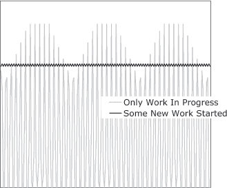

Therefore,

**Process the requests that are continuations of work in progress. Ignore and reject the requests for new work.**

> **处理正在进行中的工作的续订请求。忽略并拒绝新工作的请求。**

Use FINAL HANDLING (50) to cleanly release any resources needed for the requests that are cancelled. If arriving requests are related to work in progress it passes through, otherwise it is discarded, as shown in <a href="#c07.htm#fig7.84" id="c07.htm#fig7.84a">Figure 84</a>.

> 使用最终处理(50)来清洁地释放取消请求所需的任何资源。如果到达的请求与正在进行的工作有关，则它会通过，否则会被丢弃，如<a href="#c07.htm#fig7.84" id="c07.htm#fig7.84a">图 84</a>所示。

**[Figure 84](#c07.htm#fig7.84a)** Finish up work in overloading stream

> 完成超载流中的工作

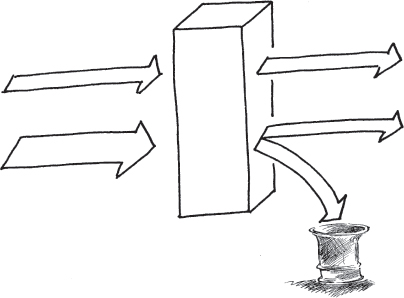

This pattern focuses on those super-requests that are groupings of requests received at independent times, offering a way to improve their throughput. FRESH WORK BEFORE STALE (55) addresses requests that arrive singly and are not related to other requests. It can also be layered on top of this pattern to choose which initial requests should be allowed to start processing.

> 这种模式侧重于那些由独立时间接收的请求组合而成的超级请求，提供了一种提高其吞吐量的方法。FRESH WORK BEFORE STALE(55)处理单独到达的、与其他请求无关的请求。它还可以层迭在这种模式之上，以选择哪些初始请求应该允许开始处理。

Being able to identify and categorize arriving requests means that they can be sorted by other criteria as well, which can help SHED LOAD (49). …

> 能够识别和分类到达的请求意味着它们也可以按其他标准进行排序，这有助于减轻负担(49)。

# 55. Fresh Work Before Stale

… More requests for service are arriving than the system can possibly handle. You are concerned about quality of service and want to maximize the overall quality of service.

> 比系统可能处理的请求更多的服务请求正在到达。**您担心服务质量，并想要最大限度地提高整体服务质量。**

The requestors can abandon requests prior to completion by their requestors. This is common when the requests are made by people, for example web page requests or telephone calls. Another scenario where this is common is when the requester is timing the response from the system and finds that it is too long and abandons the previously sent request and sends a new copy of it. This pattern is not applicable if every request, once initiated, must be completed.

> 请求方可以在完成之前**放弃请求**。当请求由人发出时，这很常见，例如网页请求或电话呼叫。另一种情况下，这种情况很常见的是，当请求方计时系统的响应时发现响应时间太长，放弃先前发送的请求并发送新的请求。**如果每个请求一旦发起就必须完成，则此模式不适用。**

The system has the ability to sort incoming requests into different categories, which enables it to FINISH WORK IN PROGRESS (54) and to intelligently SHED LOAD (49).

> 系统具有将传入请求分类的能力，这使其能够完成正在进行的工作(54)并且能够智能地减轻负荷(49)。

**How can you ensure that the maximum number of requests get good service?**

> **你怎样确保尽可能多的请求得到良好的服务？**

When requests take a very long time to process, the requestors may give up waiting. This makes more work for the system as it must then FINAL HANDLE (50) the request. If delays grow too long, the system will spend time initiating processing on already abandoned requests.

> 如果请求处理时间过长，**请求者可能会放弃等待**。这会给系统带来更多的工作，因为它必须最终处理该请求(50)。如果延迟时间太长，系统将花费时间启动已经放弃的请求的处理。

> [!NOTE]
> 从这点来看，好像真没有看到过有 “请求者可以会放弃等待” 的设计机制
> 靠，这个就是超时机制
> 那么从这两个角度来考虑，框架需要能把握

When the system is processing as many requests as it can, it will almost always need to queue requests before they can be served, QUEUE FOR RESOURCES(46). The most simple way to queue, or buffer, the requests is to use a buffer that acts like a First In First Out queue, as shown in <a href="#c07.htm#fig7.85" id="c07.htm#fig7.85a">Figure 85</a>. A problem with this is that requests that are in the queue might be abandoned by their requestor. This will only be discovered when the system begins processing the request and finds out that the requestor doesn’t reply or indicates that the request is outdated. The requests are all delayed the same amount by being in the queue.

> 当系统正在**处理尽可能多的请求时，它几乎总是需要在提供服务之前对请求进行排队，资源排队(46)**。最简单的排队(或缓冲)请求的方法是使用一个先进先出队列的缓冲器，如<a href="#c07.htm#fig7.85" id="c07.htm#fig7.85a">图 85</a>所示。这样的问题是，队列中的请求可能会被请求者放弃。只有在系统开始处理请求并发现请求者没有回复或指示请求已过时时，才会发现这一点。所有请求都会因排队而延迟相同的时间。

**[Figure 85](#c07.htm#fig7.85a)** First In First Out queue
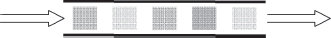

Requests can be processed quickly when they are queued using a stack, also known as a Last In First Out queue, <a href="#c07.htm#fig7.86" id="c07.htm#fig7.86a">Figure 86</a>. Processing starting with the fresh requests will increase the likelihood that still-valid requests are processed. When the fresh requests have all been removed from the queue, the aging, possibly abandoned ones, will remain and be processed.

> 请求可以使用堆栈(也称为后进先出队列)进行快速处理，参见<a href="#c07.htm#fig7.86" id="c07.htm#fig7.86a">图 86</a>。从新请求开始处理将增加仍有效的请求被处理的可能性。当新请求全部从队列中移除后，老化的、可能被遗弃的请求将留在队列中并被处理。

**[Figure 86](#c07.htm#fig7.86a)** Last In First Out queue
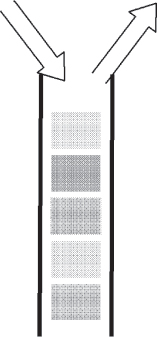

If the system knows how long requests wait for service before being abandoned it can intelligently choose which requests to continue by knowing how far down into the queue to extract requests from.

> 如果系统知道请求在被放弃之前等待多长时间，它就可以通过知道从队列中提取请求的位置来智能地选择哪些请求继续处理。

However, keeping track of how long requests have been waiting is a difficult task. The timers need to be continually updated which adds overhead processing to the system. Extra overhead is contrary to the need during overload to reduce overload, so a simplified timing mechanism must be used.

> 然而，**跟踪请求等待多长时间是一项艰巨的任务。计时器需要不断更新，这会给系统增加额外的处理开销。** 过多的开销与在过载时减少负载的需求相悖，因此必须使用简化的计时机制。

To ensure that some requests receive service quickly, process a few requests as soon as they arrive without any buffering. This ensures that the quality of service for at least a few requests will be excellent.

> 为了确保一些请求能够得到快速的服务，在没有任何缓冲的情况下，一旦请求到达就处理几个请求。这确保至少有几个请求的服务质量会很好。

Therefore,

**Use a Last In First Out queue and also serve some new requests immediately, <a href="#c07.htm#fig7.87" id="c07.htm#fig7.87a">Figure 87</a>. In that way, at least some requests will have a high quality of service.**

> 使用先进先出队列，并立即处理一些新的请求，参见<a href="#c07.htm#fig7.87" id="c07.htm#fig7.87a">图 87</a>。通过这种方式，至少有一些请求将具有较高的服务质量。

**[Figure 87](#c07.htm#fig7.87a)** Fresh work before stale
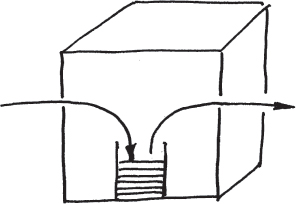

Some requests are receiving a high quality of service. Some other requests will receive a poor quality of service; however, they are the ones most likely to have been abandoned.

> 有些请求得到了高质量的服务。其他一些请求将收到较差的服务，但它们很可能已经被抛弃了。

If requests are related to each other then FINISH WORK IN PROGRESS (54) should be used to continue processing the work that has already been started. …

> 如果请求彼此相关，那么应该使用完成工作进度(54)来继续处理已经开始的工作。

# 56. Marked Data

… The system has a way to detect errors in data that it uses. Once detected, an ERROR CONTAINMENT BARRIER (13) will initiate processing of the error.

> **系统有一种检测数据错误的方法。一旦发现错误，将会启动错误控制屏障(13)处理错误。**

The system detected erroneous data, either in a message that is passing through this part of the system, or in an element of data that was stored earlier and accessed by this part of the system. Alternatively, the error was detected as the result of an operation.

> 系统检测到错误的数据，可能是通过这部分系统传送的消息中的错误数据，或者是之前存储的数据元素中的错误数据，被这部分系统访问时发现的错误。另外，也可能是操作过程中发现的错误。

The system does not have enough information to be able to correct the erroneous data automatically. This can be because there is not any record or _a priori_ knowledge of what the correct value should be, or it does not contain sufficient information embedded within it to be corrected, e.g. it does not contain any ERROR CORRECTING CODES (57).

> **系统没有足够的信息来自动纠正错误的数据。** 这可能是因为没有任何记录或先验知识，也没有足够的信息嵌入其中以进行纠正，例如它不包含任何错误纠正码(57)。

The error that has been detected has a limited scope that does not require that the system state be greatly altered even though it can’t be immediately corrected. In other words, error mitigation is more appropriate than error recovery actions such as restoring from a CHECKPOINT (37), or conducting a ROLLBACK (32) and ROLL-FORWARD (33).

> 检测到的错误范围有限，即使无法立即纠正，也不需要大幅度改变系统状态。换句话说，比起恢复检查点(37)或者执行回滚(32)和前进(33)等纠错恢复操作，更适合采取纠错缓解措施。

---

**When the system finds uncorrectable erroneous data, how can the error be kept from spreading?**

> 当系统发现**不可纠正的错误数据时，如何防止错误传播？**

Sometimes stored data contains an error, for example when it is something that was put away for later use into medium to longer-term storage. The part of the system that is going to contain the error might not have enough information to be able to determine if it was incorrect when first stored or if it was corrupted during storage. Using the invalid data will cause a failure; it must be contained to prevent this from happening. The corruption may have occurred in the past, but it remained unidentified until the data is about to be used. ROUTINE AUDITS (24) are used to detect corrupt data before the data is needed for processing. In many cases, CORRECTING AUDITS (2) correct these elements of faulty data. However, if the audits are not available, or the nature of the data prevents automatic correction, then the data won’t be correctable.

> **有时存储的数据包含错误，例如当它被放入用于中期到长期存储的介质时。** 系统的一部分可能没有足够的信息来确定它在存储时是否有误。使用无效的数据会导致失败；必须阻止它发生。**损坏可能发生在过去，但直到数据即将使用时才被发现。** 常规审计(24)用于在需要数据处理之前检测损坏的数据。在许多情况下，校正审计(2)可以纠正这些有缺陷的数据。但是，如果审计不可用，或者数据的性质不允许自动校正，那么数据将无法纠正。

The storage medium sometimes attempts to tolerate errors on its own. For example, the memory of the system contains ERROR CORRECTING CODES (57). These codes can only detect a certain number of bit errors in a given memory unit, but this will be sufficient for many error cases. This memory is common in systems designed from the hardware up to be fault tolerant, but these error correcting and detecting code memories add expense.

> 存储介质有时会尝试自行容忍错误。例如，系统的**内存包含错误纠正码(57)。这些码只能检测给定内存单元中的某些位错误，但这对许多错误情况来说就足够了。** 这种内存通常用于从**硬件开始**设计的容错系统，但这些错误纠正和检测码内存会增加费用。

If the data cannot be corrected it must be QUARANTINED (28). In the short term, the entity that detects that it is erroneous should not use it. The system must discard the results of any actions taken with that data.

> 如果数据无法纠正，则必须隔离(28)。短期内，检测到该数据有误的实体不应使用它。系统必须丢弃使用该数据所采取的任何行动的结果。

We also do not want the data used by any other parts of the system. It can be marked in a way that other parts of the system do not have to spend much time detecting that it was erroneous, and can quietly contain the impact of the error. Rules must be defined for how to proceed when encountering any data items that have been marked.

> 我们也不希望系统的其他部分使用这些数据。可以以一种方式**标记，让系统的其他部分不必花费太多时间检测它是否有错**，可以安静地包含误差的影响。必须定义规则，以便在遇到任何被标记的数据项时如何继续。

In some cases merely marking the data as erroneous is insufficient and the system must undertake active error recovery steps in order to contain an error. For example, when there is no correct action possible because the erroneous data will control a branching of program execution.

> 在某些情况下，仅将数据标记为错误是不够的，系统必须采取积极的错误恢复步骤来控制错误。例如，当错误数据将控制程序执行的分支，而没有正确的操作可能时。

The IEEE ’Not a Number’ is an example for marking a value erroneous in a way that enables processing to continue. The IEEE standard 754-1985 defines standard representations for binary floating-point numbers. While defining the numerical representation they also define a special value ‘Not a Number’ or ‘NaN’. NaN is stored in place of a floating-point value as the result of certain illegal floating-point operations, for example division by zero. The standard defines rules for how subsequent computations should behave when one of the operands is NaN. \[IEEE754\]

> IEEE 的“NaN”是一个标记值错误的例子，以便可以继续处理。IEEE 标准 754-1985 定义了二进制浮点数的标准表示形式。在定义数值表示的同时，他们还定义了一个**特殊值“非数字”或“NaN”**。NaN 存储在浮点值的位置上，作为某些非法浮点操作的结果，例如除以零。标准定义了当其中一个操作数为 NaN 时，随后的计算应该如何表现的规则。[IEEE754]

> [!NOTE]
> 通过 NaN 来标记错误

Rules for processing an operand that is marked by someone else as being erroneous should include two different types of information, which are both present in the NaN rules from the IEEE. The first type of information is how the operation should proceed. Possible rules include assuming a default value, skipping the operation and marking the result as erroneous, seeking the information from an alternate source, aborting execution or invoking an ERROR HANDLER (30), and so on. The second type of information that should be part of any rule is whether any notification to other parts of the system should be made when a previously marked erroneous value is encountered. The IEEE standard refers to this as signaled or quiet. This signaling is appropriate if some intermediate mechanism would have been expected to correct the error and so the current occurrence of the erroneous flag is totally unexpected.

> 处理被他人标记为错误的操作数的规则应该包括 IEEE 标准中的 NaN 规则所涉及的两种不同类型的信息。
>
> - 第一种信息是**操作应该如何进行**。可能的规则包括假定默认值，跳过操作并标记结果为错误，从其他源获取信息，中止执行或调用错误处理程序(30)等等。
> - 任何规则的第二种信息应该是，当遇到先前标记为错误的值时，是否应向系统的其他部分**发出通知**。IEEE 标准将其称为发出信号或静默。如果某些中间机制本来应该纠正错误，因此当前发现的错误标志是完全意外的，则发出信号是合适的。

Messages sometimes contain erroneous data elements. These must also be contained. In some cases, the system must discard the entire message. This is most effortless when the protocol supports retransmission because the message is unacknowledged.

> 有时消息中会包含错误的数据元素，这些也必须被包含进去。**在某些情况下，系统必须丢弃整个消息。** 当协议支持重传时，这是最轻松的，因为消息未被确认。

> [!NOTE]
> 这个时候可以使用 DDS 中的 QoS 机制吧

Individual data elements within the message are sometimes identifiable as being erroneous. If only parts of a message are incorrect then a mechanism such as the IEEE NaN can be used to identify the erroneous part. This allows computing to continue while taking into account the erroneous elements.

> 单个消息中的数据元素有时可以识别出是错误的。如果只有消息的一部分不正确，那么可以使用 IEEE NaN 等机制来识别错误的部分。这样可以在考虑到错误元素的情况下继续计算。

When the results of a computation or processing are determined to be erroneous, the NaN approach of marking the data element can work as well. In some cases, the detection of an error at this level indicates that the part of the system that performed the computation is erroneous. The entire part of the system should be marked and avoided rather than just the result, but the IEEE NaN is too low level. One approach is to report to the FAULT OBSERVER (10) and rely on higher level system functions to contain and repair the faulty entity.

> **当计算或处理的结果被确定为错误时，使用 NaN 标记数据元素也可以。** 在某些情况下，这一层级上检测到的错误表明，执行计算的系统部分有误。应该标记并避免整个系统部分，而不仅仅是结果，**但 IEEE NaN 太低级了。一种方法是向故障观察器(10)报告，依靠更高级别的系统功能来包含和修复有故障的实体。**

> [!NOTE]
> 要是这个 NaN 的方式太低级，这个“故障观测器”，靠，是不是有点复杂

Marking data or results so that they are not used is not free. In the case of IEEE NaN the mark is encoded in place of the value, but sometimes the error mark might require additional ‘meta-memory’. Resources are required to check for the erroneous mark and take appropriate actions.

> 标记数据或结果不是免费的。在 IEEE NaN 的情况下，标记被编码在值的位置，但有时错误标记可能需要额外的“元记忆”。**检查错误标记并采取适当措施需要资源。**

Therefore,

**Mark erroneous data to indicate that it is unusable, <a href="#c07.htm#fig7.88" id="c07.htm#fig7.88a">Figure 88</a>. Define rules for processing these values when they are encountered.**

> 标记错误数据以指示其不可用，<a href="#c07.htm#fig7.88" id="c07.htm#fig7.88a">图 88</a>。为遇到这些值时处理它们定义规则。

**[Figure 88](#c07.htm#fig7.88a)** Mark the erroneous data
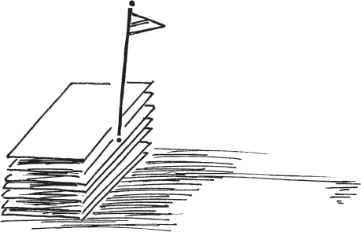

The periodic checking of data for correctness is a variant of this pattern. Instead of waiting for the data to be accessed in normal operations, the ROUTINE AUDIT (24) mechanism will periodically check for correctness and either mark or correct it.

> 周期性地检查数据的正确性是这种模式的一种变体。不是等待数据在正常操作中被访问，而是定期使用**例行审计(24)机制**检查正确性，并**标记或纠正它**。

Marking data can also be done to indicate that a data value is known to be correct, or that it is now eligible for use.

> 标记数据也可以用来表明一个数据值是已知正确的，或者它现在可以使用了。

‘CHECKS’ by Ward Cunningham \[Cun95\] introduces the idea of an exceptional value as a computational result. This effectively contains the error to everywhere upstream from the point of detection. Failures are prevented because the system does not use the erroneous valve if it is flagged as exceptional. …

> 《CHECKS》，由 Ward Cunningham [Cun95]提出，**引入了异常值作为计算结果**的想法。这有效地将错误限制在检测点之上的所有位置。**如果错误值被标记为异常，系统不会使用它，从而防止失败。...**

> [!NOTE]
> 这里的异常和 NaN 不一样吗

# 57. Error Correcting Code

… CHECKSUMS (25) can be used to detect whether data values (in memory or messages) are correct.

> 检验和(25)可用于检测内存或消息中的数据值**是否正确**。

**How can the system data paths and storage be made as error free as possible?**

> **如何让系统数据路径和存储尽可能无误？**

CHECKSUMS (25) work to detect that the item being protected is incorrect. They cannot correct the data.

> 校验和(25)用于检测所保护的项目**是否不正确。它们无法纠正数据。**

To reduce errors you would like the data value corrected automatically. A number of techniques will correct erroneous data values automatically. These include ROUTINE AUDITS (24), DATA RESET (41) and even restoring from a CHECKPOINT (37). Maintaining a duplicate copy of the data eliminates the need to be able to correct an individual value. If the duplicate is stored in a location designed to be less prone to corruption, the problem of knowing which one is correct is eliminated.

> 为了减少错误，**您希望数据值自动纠正**。**有许多技术可以自动纠正错误的数据值。这些包括例行审计(24)，数据重置(41)，甚至从检查点(37)恢复。保持数据的副本可以消除纠正单个值的需求。** 如果副本存储在一个被设计为不容易受损的位置，则知道哪个是正确的问题就消失了。

These techniques all work by correcting the data to some known correct value.

> 这些技术都是通过将数据纠正到某个**已知正确值**来实现的。

An alternative is to undo the error, ignoring the value totally. In order to ignore the data value the system would need to know precisely what changed. Then the system can undo the change without knowing the value. The CHECKSUM (25) example of a parity bit will tell the system that a data value has changed, but it doesn’t provide enough information to be able to know what has changed.

> **一种替代方案是撤销错误，完全忽略该值。** 为了忽略数据值，系统需要精确地知道发生了什么变化。然后，系统可以在不知道值的情况下撤销更改。校验和(25)的示例(奇偶校验位)会告诉系统数据值已更改，但它不提供足够的信息来知道发生了什么变化。

> [!NOTE]
> 感觉是这样的，这种错误纠正的情况需要已经知道正确的数值，比如存在备份
> 大部分情况应该都是不知道，这时候可以考虑使用自己的那个专利技术
> 通过**估计**，这个才是更能解决实际问题的

However, if you introduce parity over smaller and smaller parts of the data you will eventually reach the point where the system can tell what has changed. For example, if one parity bit watches over one data bit the system can tell which data bit changed. This assumes that the parity bit does not change erroneously. In order to tell if the parity bit has changed, put another parity bit watching over it.

> 然而，如果你在数据的较小部分上**引入奇偶校验**，你最终会达到系统能够识别发生了什么变化的点。例如，**如果一个奇偶校验位监视一个数据位，系统就可以知道哪个数据位发生了变化。** 这假设奇偶校验位不会出错地发生变化。为了判断奇偶校验位是否发生了变化，可以在它上面**再加一个奇偶校验位**。

> [!NOTE]
> 这种套娃的机制可还行？
> 或者可以作为一种基础的机制吧

Eventually you must stop adding bits to watch the watching (parity) bits. Making some design assumptions about the number of concurrent faults will help.

> 最终你必须停止添加比特来观察观察(奇偶校验)位。做出一些关于并发故障数量的设计假设将有所帮助。

Error correcting codes are a very fast way of ensuring correct data. This is especially valuable when there is a high rate of transient errors changing the data.

> **错误纠正码是确保正确数据的一种非常快速的方式。当存在高比率的瞬时错误改变数据时，这尤其有价值。**

Error correcting codes are frequently applied to data streams to ensure that they are received correctly. Some examples include MPEG data streams and CDMA mobile telephony.

> 错误纠正码经常被应用于数据流以确保它们被正确接收。一些例子包括 MPEG 数据流和 CDMA 移动电话。

Therefore,

**[Figure 89](#c07.htm#fig7.89a)** Two extra bits protects four data bits

> **[图 89](#c07.htm#fig7.89a)** 两个额外的比特保护了四个数据位

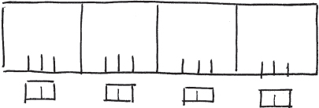

Error correcting memories are in common use in many computers.

> 错误纠正存储器在许多计算机中广泛使用。

The particular design and implementation of a software error correcting code is very context specific. …

> 特定的软件错误纠正码的设计和实现是非常上下文特定的。

> [!NOTE]
> 将错误纠正码作为一个框架的能力，开放出来 API 提供给用户，让用户在需要的地方，对指定的数据进行校验
> 这个想法应该还挺好的！作为框架结构
> 感觉这个应该还挺有必要的，就是冗余的元素可以通过这个校验机制来纠正？！
> 要实现这个，应该考虑一些具体的应用场景才行。
