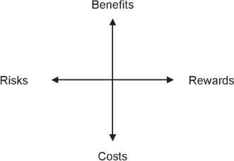
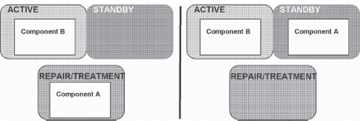
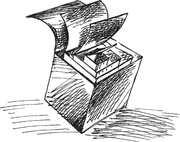
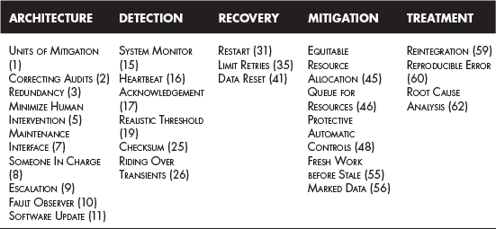

---
tip: translate by openai@2023-04-11 10:30:58
...

# CHAPTER 8

# Fault Treatment Patterns

After an error is processed, fault treatment prevents the error from reoccurring. This includes repairing the fault. This can mean patching the system, which is installing a new fault-free version of the software or the data. It can also mean correcting a procedure so that a person won’t cause the same error again.

> 当错误处理完后，故障处理可以防止错误再次发生。这包括修复故障。这可以意味着安装新的无故障版本的软件或数据补丁系统。它也可以意味着纠正程序，以便一个人不会再次引起相同的错误。

Sometimes error detection will immediately precede fault treatment without the execution of an error recovery phase.

> 有时，在不执行错误恢复阶段的情况下，错误检测会立即在故障处理之前进行。

The steps of fault removal are: verification, diagnosis and correction. Verification is done to determine if the system behavior conforms to its specifications. This is done to check whether the fault is still present in the system. The aim of diagnosis is to determine the cause, both in terms of location of the fault and the nature of the fault. Correction is the step in which the fault is made passive. After correction, verification is needed again to see that the system behavior is restored to conformance with its specification. Fault removal is an example of _corrective maintenance._

> 正确移除故障的步骤是：验证、诊断和纠正。验证是为了确定系统行为是否符合其规格。这是为了检查系统中是否仍然存在故障。诊断的目的是确定故障的原因，既是故障位置，也是故障性质。纠正是使故障变得消极的步骤。纠正后，再次进行验证，以确保系统行为恢复到符合其规格的状态。故障移除是纠正性维护的一个例子。

Not all maintenance tasks are corrective. Preventive maintenance corrects a fault before it is activated. ROUTINE AUDITS (24), in Chapter 5, is an example of something that is both an error detection technique and a preventive maintenance task.

> 不是所有的维护任务都是纠正性的。预防性维护可以在故障发生前进行纠正。第 5 章中的例行审计（24）既是一种错误检测技术，又是一项预防性维护任务。

<a href="#c08.htm#tab8.1" id="c08.htm#tab8.1a">Table 8.1</a> lists all of the patterns in this chapter. Their order is that of the language shown in <a href="#c08.htm#fig8.90" id="c08.htm#fig8.90a">Figure 90</a> and also the order that the patterns appear within this chapter.

[**Table 8.1**](#c08.htm#tab8.1a) Fault treatment patterns

> [表 8.1](#c08.htm#tab8.1a) 故障处理模式

```
    ---

    **PATTERN** **PATTERN INTENT** **VERIFICATION, DIAGNOSIS, CORRECTION**

    LET SLEEPING DOGS LIE (58) Consider the true benefits to the system of correcting the faults versus leaving the fault present. Correction

    REINTEGRATION (59) After making the faults passive, return the repaired component to service. Correction

    REPRODUCIBLE ERROR (60) Activate a fault while monitoring its behavior to determine clues to its nature and potential corrective treatments Verification

    SMALL PATCHES (61) Surgically correct an erroneous program part. Correction

    ROOT CAUSE ANALYSIS (62) Identify the first fault in a sequence as the target of treatment actions. Diagnosis

    REVISE PROCEDURE (63) After a failure in which people contributed to downtime instead of minimized it, revise the procedures that they followed to avoid the problem in the future. Correction

    ---
```

**[Figure 90](#c08.htm#fig8.90a)** Fault treatment pattern language map

> **[图 90](#c08.htm#fig8.90a)** 故障处理模式语言图


[Figure 90](#c08.htm#fig8.90) shows a possible language mapping for the patterns in this chapter.

> 图 90（#c08.htm#fig8.90）显示了本章模式的可能语言映射。

People are more involved in the patterns of this chapter than they were in the patterns of the other chapters. Deciding whether the benefits of correcting a fault outweigh the risks of introducing other faults can only be done by people. This is discussed in LET SLEEPING DOGS LIE (58). In some of the earlier patterns the operating personnel were mentioned. Several of the patterns in this chapter, specifically REVISE PROCEDURE (63) and REINTEGRATION (59), discuss procedures and methods of operations intended for these operating personnel. System architects and developers are the main actors in ROOT CAUSE ANALYSIS (62), REVISE PROCEDURE and SMALL PATCHES (61). REPRODUCIBLE ERROR (60) describes a practice that any of the operating personnel, architects, and designers employ to verify that the system still does not behave as specified; in other words that a fault is still present, and that correcting the fault eliminates the failure.

> 人们比以前更多地参与到本章的模式中。只有人才能决定纠正错误的好处是否超过引入其他错误的风险。这在《安睡狗》（58）中有所讨论。在一些早期的模式中，提到了操作人员。本章中的几个模式，特别是“修订程序”（63）和“重新整合”（59），讨论了针对这些操作人员的程序和操作方法。根本原因分析（62）、修订程序和小补丁（61）的主要参与者是系统架构师和开发人员。可重复错误（60）描述了任何操作人员、架构师和设计师都可以采用的实践，以验证系统仍然不符合指定的行为；换句话说，故障仍然存在，纠正故障可以消除故障。

# 58. Let Sleeping Dogs Lie


… The system detected and corrected an error or failure. Now you are correcting the fault that caused them.

> 系统检测并更正了一个错误或故障。现在您正在纠正导致这些故障的故障。


**Should you correct all faults that the system and the maintainers find?**

> 你应该纠正系统和维护人员发现的所有故障吗？

Correcting faults in real systems is like surgery and in surgery there is always the risk of complications. When correcting a fault the patient is your software, and the risk of complications is real.

> 纠正真实系统中的故障就像手术一样，手术中总会有并发症的风险。当纠正故障时，患者是您的软件，并发症的风险是真实的。

Whenever a change is made, for example via SMALL PATCHES (61) or a SOFTWARE UPDATE (11), faults can unintentionally be injected into the system. This is common. Patches to correct faults add complexity to the system, which adds ‘scar tissue’ to the software, making it more difficult to read and maintain. Faults are added to the system within this complexity.

> 每当进行更改时，例如通过小补丁（61）或软件更新（11），会意外地将错误注入系统中。这很常见。用于修复错误的补丁会增加系统的复杂性，这会给软件增加“瘢痕”，使其更难阅读和维护。在这种复杂性中会添加错误到系统中。

You must weigh the benefits of correcting the known fault and the errors that it causes with the potential unknown faults and errors you might accidentally introduce. With the known fault you have an idea what the risk of future unavailability is in the case that the fault activates again.

> 你必须权衡纠正已知故障和其导致的错误所带来的好处，以及可能会意外引入的潜在未知故障和错误。对于已知故障，你可以对未来可能出现的不可用性的风险有一定的了解。

Every latent fault that you identify and are able to fix presents a risk that exists in the system. You should consider what the likelihood of the fault reactivating is. What is the risk to the system if the fault activates again and causes an error? What is the size and complexity of the correction? What is the probability you can construct the correction without new faults and then install it without introducing other faults? You need to consider all these risks when deciding whether to fix the fault. <a href="#c08.htm#fig8.91" id="c08.htm#fig8.91a">Figure 91</a> shows the balance required.

> 每一个你能够发现并且能够修复的潜在的错误都会给系统带来风险。你应该考虑错误重新激活的可能性有多大。如果错误再次激活并导致错误发生，系统会面临什么样的风险？改正的大小和复杂程度是什么？你能够在不引入新错误的情况下构建并安装改正的可能性有多大？在决定是否修复错误时，你需要考虑所有这些风险。<a href="#c08.htm#fig8.91" id="c08.htm#fig8.91a">图 91</a>展示了所需要的平衡。

**[Figure 91](#c08.htm#fig8.91a)** Balancing known versus potential faults

> **[图 91](#c08.htm#fig8.91a)** 平衡已知和潜在故障


You must also consider the costs associated with correcting the fault. There are the costs associated with recreating it in the test system, costs associated with making the change and verifying that it is correct, and also costs associated with distributing the change to the production systems. As pointed out above, new faults can be introduced at any of these times, which will add their own costs to be considered. Costs to goodwill with the system’s owners must also be considered. How will they react to their need to correct the system, which might require downtime?

> 你还必须考虑纠正故障所带来的成本。这些成本包括在测试系统中重新创建它的成本，改变并验证其正确性的成本，以及将更改分发到生产系统的成本。正如上面指出的，在这些时候可能会引入新的错误，这将增加自己要考虑的成本。还必须考虑与系统所有者的商誉成本。他们如何应对修正系统的需要，这可能需要停机？

What are the benefits associated with correcting a fault? It won’t reoccur, a known source of error will be eliminated, reducing the error probability, which will increase the availability. When making the correction you have an opportunity to correct other faults. Proactive correction of faults can increase goodwill with the system’s owners. <a href="#c08.htm#fig8.92" id="c08.htm#fig8.92a">Figure 92</a> shows the dimensions to consider when deciding whether to correct a fault.

> 对故障进行纠正有什么好处？它不会再发生，已知的错误源将被消除，错误概率将降低，可用性将提高。在纠正时，您有机会纠正其他故障。主动纠正故障可以增加系统所有者的信誉。<a href="#c08.htm#fig8.92" id="c08.htm#fig8.92a"> 图 92</a>显示了在决定是否纠正故障时要考虑的维度。

**[Figure 92](#c08.htm#fig8.92a)** Trade offs to consider

> 考虑的权衡因素（参见图 92）



Every fault that is considered will balance the trade offs in [Figure 92](#c08.htm#fig8.92) differently. If the fault is causing system instability and failures that result in total unavailability, the balance should result in its being corrected. If, on the other hand, the fault produces errors that have a simple workaround or are very unlikely to reoccur, then the best choice might be to leave the fault uncorrected. For example if the failure occurs during time of day exchange between two processors in a small distributed system, but the failure only occurs when daylight savings time is invoked, then in many environments it will not be fixed.

> 每一个被认为是错误的都会以不同的方式来平衡[图 92](#c08.htm#fig8.92)中的权衡。如果错误导致系统不稳定和失败，从而导致完全无法使用，那么最好的选择就是纠正错误。但是，如果错误产生的错误可以有一个简单的解决方案，或者很少发生，那么最好的选择可能是不纠正错误。例如，如果发生在小型分布式系统中两个处理器之间的时间交换期间发生故障，但是只有在夏令时被激活时才会发生故障，那么在许多环境中，它不会被修复。

Therefore,

> 因此

**Weigh the risks and costs with the benefits and rewards associated with the correction. Sometimes it will be best to LET SLEEPING DOGS LIE** and not make the correction. Deciding whether to correct a fault is like wondering if there is a wolf just outside the window, <a href="#c08.htm#fig8.93" id="c08.htm#fig8.93a">Figure 93</a>.

> 要衡量纠正所带来的风险和成本以及好处和回报。有时最好不要去碰“睡着的狗”，而是不做纠正。决定是否纠正一个错误就像是想知道窗外是否有一只狼，<a href="#c08.htm#fig8.93" id="c08.htm#fig8.93a">图 93</a>。

**[Figure 93](#c08.htm#fig8.93a)** Picking the known or the unknown

> **[图 93](#c08.htm#fig8.93a)** 选择已知的还是未知的


You are deciding whether you should correct all of the faults that you know about. You are correcting the ones with the highest risk of reoccurring or the highest potential for damage if they do reoccur. You are not correcting the ones with a lower risk to avoid introducing new faults. …

> 你正在决定是否应该纠正你所知道的所有错误。你正在纠正那些具有最高重复风险或最高潜在损害的错误。为了避免引入新的错误，你不纠正那些风险较低的错误。...

# 59. Reintegration

… You have corrected a fault but the previously faulty element is not doing useful work yet. The faulty element was either REDUNDANT (3) and the application is still available, or it wasn’t REDUNDANT and the application is unavailable.

> 你已经修正了一个故障，但之前有故障的元件还没有做出有用的工作。有故障的元件要么是备份的（3），应用程序仍然可用，要么不是备份的，应用程序不可用。

Error Treatment might have been achieved through the use of a mitigation technique from Chapter 7, or SOFTWARE UPDATE (11) was used to apply a SMALL PATCH(61).

> 错误处理可以通过使用第 7 章的一种缓解技术，或者使用软件更新(11)来应用小补丁(61)来实现。


**What should you do with a component that you have fixed?**

> 你修复了一个组件后应该怎么做？

There are a number of steps that need to be done in order to guarantee that the treated component can be returned to service effectively and quickly. If any of the steps are not done then the same or a different error might occur and cause further error processing steps to be taken. This will reduce availability.

> 有一些步骤需要完成，以确保处理过的部件能够有效快速地返回服务。如果任何步骤没有完成，那么相同或不同的错误可能会发生，导致进一步的错误处理步骤被采取。这将降低可用性。

The treated component might still be in lists of errors that RIDING OVER TRANSIENTS(26) is monitoring. There might also be lists of faulty components that were used to isolate and locate the fault. It should be removed from these lists since it is now treated.

> 处理过的部件可能仍然在 RIDING OVER TRANSIENTS(26)监视的错误列表中。也可能有一些用于隔离和定位故障的有故障部件的列表。现在已经处理过了，应该从这些列表中移除。

The fault may not have been corrected. The treated component should be watched for a short while to ensure that the error that you think you corrected does not reappear. By watching it you will also be checking that new faults have not been inserted into the system with the SOFTWARE UPDATE(11) that you applied. This process of watching the component is called soaking, hardening or trialing. RECOVERY BLOCK(4) mechanisms can be used to automatically return to the unchanged software if the change should fail.

> 可能没有纠正错误。应该观察被处理的组件一段时间，以确保您认为已经纠正的错误不会再次出现。通过观察，您还可以检查是否在您应用的软件更新（11）中插入了新的故障。这种观察组件的过程称为浸泡、硬化或试用。如果更改失败，可以使用恢复块（4）机制自动返回到未更改的软件。

The previously faulty component should be reintegrated into the system. If the component is part of a load sharing group, allow it to start handling load again.

> 之前有故障的组件应该重新整合到系统中。如果组件是负载共享组的一部分，请允许它再次处理负载。

The restoration procedure has a number of things to do to make sure that all of the other parts of the system know that the corrected component is available. Capture these instructions in a reusable procedure.

> 恢复程序有许多事情要做，以确保系统的其他部分知道纠正的组件可用。将这些指令捕获到可重复使用的程序中。

When the component that you are returning to service is a redundant copy of another element, you have to decide whether the returning component should become the active or the standby. If the redundancy is set up in a load sharing arrangement, then this choice is not relevant. Most often, the system makes the active/standby decision within the context of the overall architecture of the system. What is the normal mode of operation? Does the system architecture call for the now active standby to be active only when the usually active component is processing an error? This might be the case in an N+M redundancy scheme, or when the standby is not a fully functional unit, but is only able to act as the active for a short time. If the standby is a fully functional component, then the general decision should be to leave the current active unit active, <a href="#c08.htm#fig8.94" id="c08.htm#fig8.94a">Figure 94</a>. This uses ROUTINE EXERCISES(23) in verifying the full functionality of the currently active (formerly standby) component. It also reduces the unavailability due to the time it takes to apply the correction via SOFTWARE UPDATE (36) and to make the returning component active.

> 当您要返修的部件是另一个元件的冗余副本时，您必须决定返修部件是应成为活动部件还是待机部件。如果冗余设置在负载共享模式下，则此选择就无关紧要了。通常，系统在整个系统体系结构的上下文中做出活动/待机决定。正常工作模式是什么？系统体系结构是否要求现在处于待机状态的部件仅在通常处于活动状态的部件处理错误时才处于活动状态？这可能是 N + M 冗余方案的情况，或者当待机部件不是完全功能单元时，只能暂时作为活动部件。如果待机部件是完全功能单元，那么一般决定应该是保持当前活动单元处于活动状态，<a href="#c08.htm#fig8.94" id="c08.htm#fig8.94a">图 94</a>。这使用常规练习（23）来验证当前活动（原待机）部件的完全功能。它还减少了由于采用软件更新（36）并使返回部件处于活动状态所需的时间而导致的不可用性。

**[Figure 94](#c08.htm#fig8.94a)** Keeping the repaired component as the standby

> **[图 94](#c08.htm#fig8.94a)** 保持修复的部件作为备用。



As the previous discussion shows, there are many steps that need to be done. Failing to perform them can result in errors and further unavailability. You can execute each step in an ad hoc manner or you can follow a predefined procedure. With a procedure you will not forget anything, the actions that you take will be appropriate to the situation, and all the parts of the system will know what steps are involved in restoration. A clear procedure definition enables an evolution to automatically restore the treated component. Automatic restoration and automatic actions, MINIMIZE HUMAN INTERVENTION (5), will speed error processing and reduce unavailability.

> 随着先前的讨论，有许多步骤需要完成。未能执行这些步骤可能会导致错误和进一步的不可用性。您可以以临时方式执行每个步骤，也可以遵循预定义的程序。使用程序，您不会忘记任何内容，您所采取的行动将适合情况，系统的所有部分都将知道恢复所涉及的步骤。明确的程序定义可以使演变自动恢复受处理的组件。自动恢复和自动操作，最大限度地减少人工干预（5），将加快错误处理并减少不可用性。

Therefore,

> 因此

**Follow a predetermined procedure to reintegrate a corrected component into the system, <a href="#c08.htm#fig8.95" id="c08.htm#fig8.95a">Figure 95</a>.**

> **按照预定的程序重新将纠正后的部件重新集成到系统中，参见<a href="#c08.htm#fig8.95" id="c08.htm#fig8.95a">图 95</a>。**

**[Figure 95](#c08.htm#fig8.95a)** Follow a process to reintegrate a task

> **[图 95](#c08.htm#fig8.95a)** 遵循一个流程来重新整合任务


The system is now more operational than it was before. You have corrected the fault and restored all of the system’s components to operation.

> 系统现在比以前更加运行良好了。你已经修正了故障，并将系统的所有组件恢复到正常运行状态。

ROUTINE MAINTENANCE (22) and ROUTINE EXERCISES (23) are used to protect the system and keep it ready for future errors and failures. …

> 例行维护(22)和例行演练(23)用于保护系统，并使其准备好应对未来的错误和故障。

# 60. Reproducible Error


… The system detected an error or failure and the error was processed. You are now interested in correcting it.

> 系统检测到一个错误或失败，错误已经处理完毕。现在您有兴趣纠正它。

You are not just staring at a blank page wondering what to correct because the system captured information about the nature of the error and failure. You identified (or think that you have identified) the stimuli that triggers the fault to activate.

> 你不是只是盯着一张空白页面不知道该改什么，因为系统捕获了有关错误和故障的信息。你已经确定（或认为你已经确定）触发故障活动的刺激。


**You want to correct a real fault, not waste time on something only imagined to be the fault.**

> 你要纠正真正的错误，而不是浪费时间去想象可能是错误的事情。

When the error was detected, techniques such as RIDING OVER TRANSIENTS (26) were used to ensure that a real, persistent error has been found. The system has not been static in the time between when the error processing completed and you begin treating the fault. Faults are sometimes corrected and removed from the system as a side effect of some other fault treatment or SOFTWARE UPDATE (11).

> 当发现错误时，使用 RIDING OVER TRANSIENTS（26）等技术来确保发现了一个真实持久的错误。在错误处理完成后到您开始处理故障之间，系统并不是静态的。有时会因为其他故障处理或软件更新（11）而纠正和从系统中移除故障。

Unless you very clearly identified the fault that caused the previously detected error, you cannot be certain that it is still present unless it causes the error again. You need to be sure that it is really broken before you can fix it. You also need to be sure that you are fixing the fault that causes the error or failure of interest.

> 除非你非常清楚地识别出导致先前检测到的错误的故障，否则除非它再次引起错误，你无法确定它仍然存在。在修复它之前，你需要确信它真的坏了。你还需要确保你正在修复导致感兴趣的错误或故障的故障。

The system can be designed to automatically reapply the stimuli in some cases. Automatically reapplying stimuli that has caused an error is not usually done because of the complexity that gets added to the system to perform this functionality. This complexity provides ample opportunity for other faults to be latent in the system.

> 系统可以被设计为在某些情况下自动重新应用刺激。由于为实现此功能而增加的复杂性，通常不会自动重新应用导致错误的刺激。这种复杂性为系统中潜在的其他故障提供了充足的机会。

Automatic stimulation to detect latent faults, or to verify that known faults are no longer present, is done in some systems as a form of system diagnostics. A QUARANTINE(28) zone is established and sequences of stimuli are introduced to see if the system behaves according to specification. These diagnostic tests are very effective if run in conjunction with ROUTINE EXERCISES (23).

> 自动刺激来检测潜在故障或验证已知故障不再存在的情况，在某些系统中作为一种系统诊断的形式被使用。建立一个隔离（28）区域，引入序列刺激，看看系统是否按照规范运行。如果与常规练习（23）一起运行，这些诊断测试非常有效。

The operating personnel can introduce stimuli into the system to verify that the system is performing according to its specification. This same test method will report if the fault under investigation is still present in the system.

> 操作人员可以向系统引入刺激，以验证系统是否按照其规格正常运行。同样的测试方法也可以报告调查的故障是否仍然存在于系统中。

There is always a risk when a fault activates that the recovery will be unsuccessful and a failure will result. The benefits of correcting the fault must be weighed with the benefits of leaving the fault alone (LET SLEEPING DOGS LIE (58)). If the fault is not corrected you should consider providing better error processing for this particular fault (or class of faults) in a future SOFTWARE UPDATE (11).

> 总是有一定风险，当故障发生时，恢复可能会失败，导致失败。必须权衡纠正故障的好处与让故障原封不动的好处（不要惹麻烦）。如果不纠正故障，应该考虑为这个特定的故障（或类别的故障）提供更好的错误处理，以便在未来的软件更新中进行。

Consider an example scenario of controlled execution for systems that are highly dependant on incoming messages. In these systems some of the messages might be killer messages. One way of mitigating the effects of killer messages is to isolate the killer messages in a safe queue or holding area, where they won’t be of further risk. When the fault that the killer message activates is isolated, the killer message is reintroduced into the system in a controlled way. The QUARANTINE (28) zone required for this must prevent the fault’s activation from causing work disrupting errors in other parts of the system.

> 考虑一个针对高度依赖于接收消息的系统的受控执行的示例场景。在这些系统中，有些消息可能是致命消息。缓解致命消息的影响的一种方法是将致命消息隔离在一个安全的队列或暂存区中，这样它们就不会带来进一步的风险。当被致命消息激活的故障被隔离后，致命消息以受控的方式重新引入系统中。为此，所需的隔离（28）区域必须防止故障的激活导致系统其他部分出现工作中断错误。

Therefore,

> 因此，

**Stimulate the fault in a controlled manner to verify that the fault did indeed cause the observed error and that the fault is still present in the system, <a href="#c08.htm#fig8.96" id="c08.htm#fig8.96a">Figure 96</a>. To know that a fault exists, compare the results of applying the stimuli to the behavior described in the system specification.**

> 控制方式刺激故障，以验证故障确实导致观察到的错误，并且该故障仍然存在于系统中，<a href="#c08.htm#fig8.96" id="c08.htm#fig8.96a">图 96</a>。要知道故障是否存在，比较将刺激应用到系统规范中描述的行为的结果。

**[Figure 96](#c08.htm#fig8.96a)** Observe the error

> 观察错误（图 96）


This controlled failure testing is a kind of regression testing.

> 这种受控失败测试是一种回归测试。

You now know that the fault still exists and what an error that the fault causes looks like. You can now proceed to make the changes needed to correct the fault, such as SMALL PATCHES (61) or SOFTWARE UPDATE (11). …

> 你现在知道故障仍然存在，以及故障所造成的错误看起来是什么样子。现在你可以继续做出所需的更改来纠正故障，比如小补丁（61）或软件更新（11）。...

# 61. Small Patches


… You know how to correct the fault that caused a detected error or failure. You have weighed the options of LETTING SLEEPING DOGS LIE (58), and you now want to deploy the correction. You want to deploy it with minimal risk of downtime due to either the installation of the correction or latent faults in the correction.

> 你知道如何纠正导致检测到的错误或故障的故障。你已经权衡了让睡狗躺着不动（58）的选项，现在你想部署纠正措施。你想尽量减少因安装纠正措施或纠正措施中的潜在故障而导致的停机时间。


**What kind of SOFTWARE UPDATE (11) will have the least chance of introducing extraneous faults or bringing in extra capabilities that are not needed?**

> **什么软件更新（11）最不可能引入多余的错误或带来不需要的额外功能？**

Coding faults can be as simple as a misplaced comma. They are easy to introduce and hard to detect even with the fault prevention efforts you employ.

> 编码错误可能只是一个错误放置的逗号。它们很容易引入，即使你采取了故障预防措施，也很难发现。

The likelihood of a fault in the SOFTWARE UPDATE (11) you prepare to remove a fault increases as the size of the update increases. With more code, there are more places for the fault to hide and more complexity to understand and test. Extra effort is needed to correctly develop and test the correction.

> 随着更新的大小增加，准备移除故障的软件更新（11）出现故障的可能性也会增加。有更多的代码，就有更多可以藏身的地方，并且需要更多的复杂性来理解和测试。需要额外的努力来正确开发和测试修正。

There are a wide variety of techniques and tools available to correct computer programs. They range from very low level to high level.

> 有各种各样的技术和工具可以用来纠正计算机程序，从低级到高级。

Some tools allow you to create byte level difference records to apply to an old version to produce a new version. This enables deployment of minimal updates. Examine these differences to determine if anything unexpected has changed, which is a clue that there are other faults within the update. You might not be able to examine individual bits and determine if they are correct, but you should be able to identify whether the differences are located in appropriate or inappropriate locations. An example is when you expect two to four bytes to be changed but instead the tools inform you that 3000 bytes changed.

> 一些工具允许您创建字节级别的差异记录，以应用于旧版本以生成新版本。这使得部署最小的更新成为可能。检查这些差异，以确定是否有任何意外的变化，这是暗示更新中存在其他故障的线索。您可能无法检查单个位，以确定它们是否正确，但您应该能够确定差异是位于适当还是不适当的位置。一个例子是，当您期望更改两到四个字节，但工具却告诉您 3000 个字节更改时。

The tools to install small, possibly bit or byte level, corrections in a system could be prohibitively complicated. Typically they will require a portion be a permanent part of the system. Application of the correction might be quick, from an application downtime viewpoint, but the overall time that the system spends managing the correction can be significant.

> 小型的、可能是位或字节级别的系统修正工具的安装可能复杂得令人无法接受。通常情况下，它们需要一部分永久性地成为系统的一部分。从应用程序停机视角来看，修正的应用可能很快，但整个系统花费管理修正的时间可能很长。

In many cases the only way to correct a faulty computer program is to stop its execution, install the new version and restart it. In addition to a long period of unavailability, this results in the entire program being moved around to convey the correction. Reinstalling the complete program or even updating to a new version of the complete program is time–consuming, as just noted. It also opens the system to corruption or installation of faults in other parts of the system that didn’t need to be corrected. Care must be taken to ensure that the entire program update includes only the desired correction and doesn’t include untested or partially implemented capabilities in some unaffected part of the system.

> .

在许多情况下，纠正错误的计算机程序的唯一方法是停止其执行，安装新版本并重新启动它。除了长时间不可用之外，这还导致整个程序被转移以传达纠正。重新安装整个程序或升级到新版本的整个程序耗时，正如刚才提到的。它还会使系统面临破坏或在没有需要纠正的其他部分安装缺陷的风险。必须确保整个程序更新仅包括所需的纠正，而不包括未经测试或部分实施的系统中的某些不受影响的部分的功能。

So much depends on your tools. If they support the application of byte level updates then that method becomes an option. If the smallest change that you can make is to change an executable file, that defines the minimal size of the update.

> 这取决于你的工具。如果它们支持字节级更新，那么这种方法就成为一种选择。如果你能做的最小的改变是更改可执行文件，那么这就定义了更新的最小大小。

Tool limitations can occur from both the tools that develop the update and from the tools that apply the update to the system. The size and nature of the updates should be considered when the SOFTWARE UPDATE (11) functionality is being designed and built.

> 工具的局限性可能来自开发更新的工具和应用更新到系统的工具。在设计和构建软件更新（11）功能时，应该考虑更新的大小和性质。

Therefore,

> 因此

**Create as small an update as your tools and what needs to be patched allow.**

> 尽可能利用您手头的工具和需要修补的内容来创建最小的更新。

<a href="#c08.htm#fig8.97" id="c08.htm#fig8.97a">Figure 97</a> shows that patches can be large or small.

**[Figure 97](#c08.htm#fig8.97a)** Various size patches

> **[图 97](#c08.htm#fig8.97a)** 不同大小的补丁


By reducing the size of changes to the system, you have reduced the risk of introducing new faults into the system. …

> 通过减少对系统的更改大小，您已经降低了将新错误引入系统的风险。

# 62. Root Cause Analysis


… An error or a failure occurred. The error has been processed or mitigated and the system returned to service. Now it is time to correct the fault that caused the error that caused the failure.

> 出现了错误或失败。错误已经处理或缓解，系统恢复服务。现在是时候修复导致错误的故障了。


**What fault should you fix?**

> 你应该修复什么故障？

The detected failure (or error) might be the result of a long sequence of fault → error → failure, where one failure acts as the fault to cause a different error, see <a href="#c08.htm#fig8.98" id="c08.htm#fig8.98a">Figure 98</a>. Which fault should you correct?

> 检测到的故障（或错误）可能是一系列故障 → 错误 → 失败的结果，其中一次失败作为故障引起不同的错误，请参见<a href="#c08.htm#fig8.98" id="c08.htm#fig8.98a">图 98</a>。应该纠正哪个故障？

**[Figure 98](#c08.htm#fig8.98a)** Failure sequences

> **[图 98](#c08.htm#fig8.98a)** 失败序列


The detected errors or failures were either Error C or Failure C in the below diagram. If A or B had been detected then they would have been processed and Failure C would have been prevented from occurring. Correcting Fault C will prevent its activation from causing Error C and Failure C. However, the whole sequence of fault activations, errors and failures really began much earlier in time. What you would like to correct is the primary or ‘′root cause’ and not just a symptom.

> 检测到的错误或故障要么是下图中的错误 C 要么是故障 C。如果检测到 A 或 B，就会处理它们，从而防止故障 C 发生。纠正故障 C 将防止它的激活导致错误 C 和故障 C。但是，故障激活、错误和故障的整个序列实际上要早得多。您想要纠正的是主要或“根本原因”，而不仅仅是一种症状。

Remember from Chapter 1 that there are different classifications of faults. The cause of a fault might be a design or coding oversight. Or the fault might have been an incorrect procedure for a human to follow, or even an incorrect action taken by a human operator. The kinds of faults are many and varied.

> 记住从第 1 章开始，故障有不同的分类。故障的原因可能是设计或编码疏忽。或者故障可能是人类遵循的不正确程序，甚至是人类操作员采取的不正确行动。故障的种类是多种多样的。

Correcting the symptoms such as releasing the inaccessible memory is useful, but it doesn’t prevent the error from occurring again. To prevent the error from reoccurring identify and correct the underlying fault rather than just correcting the symptom.

> 纠正症状，如释放无法访问的内存是有用的，但这并不能防止错误再次发生。为了防止错误再次发生，要找出并改正潜在的故障，而不仅仅是纠正症状。

Employing the Fault Tolerant Mindset to corrective maintenance entails asking _why?_ an error happened and _why?_ a fault is present in the system. Asking _why?_ repeatedly is one way at getting to the root cause of the situation.

> 采用容错心态进行纠正性维护意味着要问出错误发生的原因以及系统中出现故障的原因。反复地问“为什么？”是找出情况根源的一种方法。

An example of looking at a failure and asking why:

> 一个看待失败并询问原因的例子：

**Why** was the data record lost?

> 为什么数据记录丢失了？

Because the transaction failed in the middle.

> 因为交易在中途失败了。

**Why** did the transaction fail in the middle?

> 为什么交易中途失败了？

Because it ran out of memory.

> 因为内存用完了。

**Why** did it run out of memory?

> 为什么它内存耗尽了？

Because there was no more memory available for allocation.

> 由于没有更多的可用内存可供分配。

**Why** was there no more memory available for allocation?

> 为什么没有更多的内存可供分配？

Because the memory was inaccessible.

> 因为内存无法访问。

**Why** was the memory inaccessible?

> 为什么内存无法访问？

Because its owning task had terminated without releasing it.

> 因为其拥有的任务已经终止而未释放。

Reaching the end produces a fault that can be corrected, namely that of tasks terminating without releasing memory.

> 到达最终会产生一个可以纠正的错误，即任务在终止时没有释放内存。

There might be more than one root cause of an error. For example, the root causes might be found to be that there was a mistake in a procedure, and also that the operating personnel deviated from the procedure.

> 可能会有多个错误的根本原因。例如，可能会发现根本原因是程序中出现了错误，而操作人员也偏离了程序。

Along the way to identifying the root cause of a problem other faults will be encountered. Record these and fix them also, don’t ignore them because they are just along the way to the root cause.

> 在确定问题根源的过程中，会遇到其他故障。记录下这些，并修复它们，不要忽略它们，因为它们只是通往根本原因的路上。

Therefore,

> 因此

**Fix the root cause of the error and any faults that you find while determining the root cause. A useful technique is to ask** **_why?_** **five times when determining the root cause of the error or failure that you are treating. Correct the faults found at this depth of the analysis.** Keep peeling back the layers to look inside the system to isolate the root cause as shown in <a href="#c08.htm#fig8.99" id="c08.htm#fig8.99a">Figure 99</a>.

> 解决错误的根本原因和在确定根本原因时发现的任何故障。有用的技术是在确定出错误或故障的根本原因时问“为什么？”五次。纠正在此分析深度找到的故障。继续剥开层次，深入系统，以隔离根本原因，如<a href="#c08.htm#fig8.99" id="c08.htm#fig8.99a">图 99</a>所示。

**[Figure 99](#c08.htm#fig8.99a)** Keep looking inside

> **[图 99](#c08.htm#fig8.99a)** 继续往里看




Five is a suggested number of question iterations, but five is not special. Asking the question a different number of times is still useful, the objective is to be satisfied that the investigation has not stopped at the superficial level, but has gone to one of the real causes of the fault. There might still be faults at deeper levels, but you have done a good job identifying and correcting the source of the problem.

> 五次是建议的问题迭代次数，但五并不特别。不同次数的问题仍然有用，目的是确保调查没有停留在表面层面，而是深入到故障的真正原因。可能还有更深层次的故障，但您已经做了很好的工作，识别和纠正了问题的根源。

‘5 Whys’ is a quality technique employed by Six Sigmas and other quality methodologies. For other techniques to determine the root cause, turn to the software and process quality literature. …

> “五个为什么”是六西格玛和其他质量方法学采用的一种质量技术。要查找其他确定根本原因的技术，可以参考软件和流程质量文献。…

# 63. Revise Procedure


… The system has had a failure. You have corrected any faults that you identified via ROOT CAUSE ANALYSIS (62) using SOFTWARE UPDATE (11).

> 系统出现故障，您已经通过根本原因分析（62）使用软件更新（11）纠正了所有发现的故障。

Your ROOT CAUSE ANALYSIS (62) identified some faults that were related to the way that the operating personnel of the system behaved. The system design might have been incomplete in its implementation of MINIMIZE HUMAN INTERVENTION (5) or the personnel might have thought incorrectly that people knew best.

> 您的根本原因分析（62）发现了一些与系统操作人员行为有关的故障。系统设计可能在实施最小化人工干预（5）时不完整，或者人员可能错误地认为人类最懂。

Systems that are designed to be highly available or highly reliable frequently are maintained and operate in environments where there are human operators that surround them, in computing centers, telecom central offices, etc. In these situations, it is prudent to develop detailed operating procedures so that these operators know how to care for the system.

> 系统设计为具有高可用性或高可靠性的系统通常会在有人类操作员的环境中进行维护和操作，如计算中心、电信中心等。在这种情况下，最好制定详细的操作程序，以便这些操作员知道如何照顾该系统。


**How can a repetition of errors caused by the operating personnel be avoided?**

> 如何避免操作人员造成的重复错误？

True experts know what to do, so when they intervene they rarely cause a failure to become more severe. Their intervention aids error processing and reduces unavailability. They know what to do because they know the system very well; for example, they might have been the system’s designers. MAXIMIZE HUMAN PARTICIPATION (6) provides the means to intervene.

> 真正的专家知道该做什么，所以当他们介入时，很少会导致失败变得更加严重。他们的介入有助于错误处理，减少不可用性。他们知道该做什么，是因为他们非常了解系统；例如，他们可能是系统的设计者。最大化人类参与（6）提供了介入的手段。

Many of the people who are maintaining your system are not true experts in its operation. They may not know how to correctly interpret the error messages. When confronted with ambiguous, misleading, or poorly worded instructions they might just start typing/clicking anything in an attempt to correct the error. They are truly dangerous and will cause many failures. The procedures for them to follow must be very clear and painstakingly researched.

> 许多维护你的系统的人并不是真正的专家，他们可能不知道如何正确解释错误消息。当面对模糊、误导或措辞不当的指令时，他们可能会试图随意点击/输入任何东西来修正错误。他们真的很危险，会导致许多失败。他们应该遵循的程序必须非常清晰，并经过细致的研究。

Some of the people who are not experts will read the procedures that you have developed to explain how to manage the system. In some cases, errors can still occur, because the procedures that the people followed were not correct, were not complete, or were unclear.

> 一些不是专家的人会阅读你开发的程序来解释如何管理系统。在某些情况下，仍会出错，因为人们遵循的程序不正确、不完整或不清楚。

REINTEGRATION (59) relies on a predetermined procedure to ensure that recovered and treated components are correctly returned to service. Other operational scenarios, such as SOFTWARE UPDATE (11), system configuration changes, and system backups are executed frequently and also benefit from predetermined procedures. Availability suffers when the procedures cannot be followed by the operating personnel.

> 重新整合（59）依赖于预定的程序来确保恢复和处理过的组件能正确地返回服务。其他操作场景，如软件更新（11）、系统配置更改和系统备份也经常执行，也受益于预定的程序。当操作人员无法按照程序操作时，可用性会受到影响。

Therefore,

> 因此

**When operating personnel following the system’s predetermined procedures contribute to failure durations, revise the procedures to avoid repeating the same sequence of errors.**

> 当操作人员按照系统预定的程序导致失败持续时间时，修改这些程序以避免重复相同的错误序列。

Mark up the procedures, <a href="#c08.htm#fig8.100" id="c08.htm#fig8.100a">Figure 100</a>, to make them better for the next time they are needed.

> 标记过程，<a href="#c08.htm#fig8.100" id="c08.htm#fig8.100a">图 100</a>，以便下次使用时更好地使用它们。

**[Figure 100](#c08.htm#fig8.100a)** Correct the procedure

> **[图 100](#c08.htm#fig8.100a)** 校正程序


If you can show the group of human operators that just blindly types to correct the problem that the procedures you have written lead to successful recovery, they might be enticed to use them in the next error situation.

> 如果你能向一群人类操作者展示，只要盲目地按照你所编写的程序就能解决问题，他们可能会在下一次出现错误时尝试使用它们。


Your system and the environment in which it operates will be more robust with higher availability. There will be fewer human caused errors and failures. …

> 你的系统及其运行环境将更加强大，可用性更高。人为错误和故障将会减少。

<span id="bm.htm"></span>

**Conclusion**

> **结论**

The previous five chapters contain patterns that can help make your software designs more fault tolerant. Chapter 4 contained architectural principles that you should use to structure your overall solution. Chapter 5 presented patterns to help detect the presence of errors and faults before failures occur. Chapters 6 and 7 gave ways to process errors. Sometimes the processing results in the system execution state changing, and sometimes the errors and faults can be processed in a way that doesn’t change the execution flow. Chapter 8 contained patterns to help treat the faults and return the erroneous component to availability. This chapter shows the complete pattern language and gives an example of how the patterns can work together.

> 前五章包含了可以帮助你的软件设计更加容错的模式。第四章包含了你可以用来结构你的整体解决方案的架构原则。第五章提出了一些模式来帮助在发生故障之前检测错误和故障的存在。第六章和第七章给出了处理错误的方法。有时候处理结果会导致系统执行状态发生变化，有时候错误和故障可以以不改变执行流的方式处理。第八章包含了一些模式来帮助处理故障并让有问题的组件重新可用。本章节展示了完整的模式语言并给出了模式如何协同工作的例子。

# _A Pattern Language for Fault Tolerant Software_

Each chapter began with a description of the patterns and how they related to each other and how they worked together to make a system more fault tolerant. Linkages between the patterns in different chapters were not highlighted, except in the individual pattern descriptions. See back of book for a map of all of the patterns. Within this overall pattern map you can see some of the linkages between the patterns of the individual phases.

> 每一章都以描述模式及其相互间的关系和如何协同工作以使系统更具容错性开始。除了在单独的模式描述中，各章之间的联系并未被突出。请参阅本书背面的模式地图以查看所有模式的地图。在整体模式地图中，您可以看到各个阶段模式之间的一些联系。

This figure represents only one possible combination of these patterns into a usable language. Others are possible, because the choice of patterns to apply to a given design problem depends on the context and the nature of the system, as illustrated through the example in the next section.

> 这个图表只代表了将这些模式组合成一种可用语言的一种可能性。其他可能性也是存在的，因为对于给定的设计问题，选择要应用的模式取决于上下文和系统的性质，如下一节中的例子所示。

The key connections between the patterns in the different chapters, as well as within the chapters, are shown. Not every possible connection that you might make when combining these patterns into a project specific language are shown. Neither is every reference made in the pattern text shown.

> 在不同章节中模式之间以及章节内的关键关联已经展示出来。当把这些模式结合到特定项目的语言中时，不是每一个可能产生的关联都展示出来。模式文本中的每一个引用也不一定展示出来。

There are four main entry points (top level patterns) into this language map. These are UNITS OF MITIGATION (1), CORRECTING AUDITS (2), MINIMIZE HUMAN INTERVENTION (5) and SOFTWARE UPDATE(11). These four architectural patterns from Chapter 4 start many of the pattern sequences through the language.

> 本语言图有四个主要入口点（顶级模式）。这些是减灾单元（1）、审计纠正（2）、最小化人工干预（5）和软件更新（11）。这四个第 4 章的架构模式开启了语言中的许多模式序列。

The interconnections and flow of patterns beginning with UNITS OF MITIGATION (1) proceeds to REDUNDANCY (3) and to the active error processing patterns of ESCALATION (9) and QUARANTINE (28). These patterns form the basis for most of the patterns of error detection and error processing. This includes the recovery related patterns of RESTART (31), ROLLBACK(32), ROLL-FORWARD (33), and RETURN TO REFERENCE POINT (34) in addition to the patterns related to CHECKPOINTING (37). The SYSTEM MONITOR (15) and related patterns, HEARTBEAT (16), ACKNOWLEDGEMENTS (17), and WATCHDOG (18) are also reached through the starting point of UNITS OF MITIGATION. The error mitigation patterns found in Chapter 7 are reached through FAULT CORRELATION (12), which is one of the central patterns in the language and is reached from the UNITS OF MITIGATION starting point as well.

> 从缓解单元（1）开始的互连和模式流动，继而到冗余（3），然后到升级（9）和隔离（28）的主动错误处理模式。这些模式构成了大多数错误检测和错误处理模式的基础。这还包括恢复相关的重启（31）、回滚（32）、滚动前进（33）和返回参考点（34）模式，以及与检查点（37）相关的模式。系统监视器（15）和相关模式，如心跳（16）、确认（17）和看门狗（18）也可以通过缓解单元的起点达到。第 7 章中发现的错误缓解模式可以通过故障相关（12），这是语言中的一个中心模式，从缓解单元的起点达到。

CORRECTING AUDITS (2) starts the paths through the language that contain the data related patterns, such as CHECKSUM (25), ERROR CORRECTING CODES(57) and MARKED DATA (56). These patterns, and the others shown, provide the primary means to deal with faults in data or data storage.

> 正确审计（2）开启了包含数据相关模式的语言之路，如校验和（25）、纠错码（57）和标记数据（56）。这些模式以及其他显示的模式提供了处理数据或数据存储故障的主要方法。

MINIMIZE HUMAN INTERVENTION (5) starts the language paths related to information getting out of the system and to the people that are interested in the system’s operation. These include MAXIMIZE HUMAN PARTICIPATION (6), FAULT OBSERVER (10), the MINIMIZE MAINTENANCE INTERFACE (7), and the fault treatment pattern of REVISE PROCEDURE (63).

> 最小化人工干預（5）開始了與信息從系統出去，以及對系統運行感興趣的人們相關的語言路徑。這些包括最大化人類參與（6），故障觀察器（10），最小化維護介面（7）和故障處理模式修改程序（63）。

The paths and flows that begin at SOFTWARE UPDATE (11) are also closely related to people. Many of the fault treatment (Chapter 8) patterns flow out of SOFTWARE UPDATE because they either assist in the process of updating the system’s software, or because they are related to the human processes that require or facilitate updating the system.

> 起始于软件更新（11）的路径和流程也与人有紧密的联系。许多故障处理（第 8 章）模式都源自软件更新，因为它们要么帮助更新系统的软件，要么与需要或促进更新系统的人类过程有关。

To make use of the patterns presented in this book you need to think about which ones will be most relevant and useful to the problem at hand. Most projects will not include all of these patterns. The next part of this chapter shows an example of selecting the patterns that are relevant and creating a design based upon them.

> 要利用本书中提出的模式，你需要思考哪些模式对当前问题最相关和有用。大多数项目不会包括所有这些模式。本章的下一部分展示了一个选择相关模式并基于它们创建设计的示例。

# _A Presence Server Example_

In this section an example system will be discussed, that of a Presence Server. The requirements and main functions of a Presence Server are introduced and then the section proceeds through the six step methodology to develop a fault tolerant Presence Server. At the appropriate stage of the method the patterns from the earlier chapters of this book will be assembled into a pattern language to design a fault tolerant system. There are many, many architecture and design issues involved with a system such as this. Only those directly related to fault tolerance and the patterns in this book will be mentioned.

> 在本节中，将讨论一个示例系统，即 Presence Server。介绍了 Presence Server 的要求和主要功能，然后本节通过六步方法来开发一个容错的 Presence Server。在方法的适当阶段，本书前面章节中的模式将被组装成一个模式语言来设计一个容错系统。这样的系统涉及到许多架构和设计问题。只有与容错和本书中的模式直接相关的问题才会提及。

A Presence Server collects, stores, and distributes information about an entity’s availability and willingness to communicate. A model for Presence Servers is described in RFC 2278 \[DRS00\]. This entity of interest is referred to as the _presentity_. The Presence Server receives notification events from the presentity’s agent, combines the events with other events related to the presentity, and makes their presence information available to interested watchers.

> 一个存在服务器收集、存储和分发有关实体可用性和愿意沟通的信息。 RFC 2278 \[DRS00\]描述了一个存在服务器的模型。这个感兴趣的实体被称为*presentity*。存在服务器从 presentity 的代理接收通知事件，将这些事件与与 presentity 相关的其他事件相结合，并将其存在信息提供给感兴趣的观察者。

Watchers are either _fetchers_ or _subscribers_. Fetchers actively poll the Presence Server for information about the presentities that they are interested in. Subscribers register their interest in advance and then the Presence Server publishes presence information to them.

> 监视者要么是抓取者，要么是订阅者。抓取者主动轮询存在服务器以获取有关他们感兴趣的存在者的信息。订阅者提前注册他们的兴趣，然后存在服务器向他们发布存在信息。

Presence information consists of _presence tuples_ that contain presence status, a communication address, and potentially other information related to the presentity. The communication address field consists of a communication means and an address. Updates to the presence information are received from the presentity’s user agents. The presence information is always available to fetchers. Changes to presence information are published by the Presence Server to the subscribers.

> 信息存在由*存在元组*组成，其中包含存在状态、通信地址以及与存在者相关的其他信息。通信地址字段由通信方式和地址组成。更新信息存在的来源是存在者的用户代理。信息存在总是可以被获取者访问。存在信息的变化由存在服务器发布给订阅者。

## Non-functional Requirements

The section above presents a general overview of the functions that a Presence Server must perform. Other requirements on the Presence Server define and constrain the non-functional requirements related to performance, reliability, and maintainability.

> 以上部分概述了 Presence 服务器必须执行的功能。其他关于性能、可靠性和可维护性的非功能性要求定义和限制了 Presence 服务器。

The Presence Server should be scalable to handle presence information for a large number of presentities. The requirements define how quickly presence information is made available to the watchers. The Presence Server should also be reliable, with as high availability as possible. For this discussion the actual performance and capacity requirement numbers are not needed.

> 服务器应该可扩展以处理大量存在信息。要求定义了观察者可以获取存在信息的速度。服务器也应该可靠，尽可能提供高可用性。在此讨论中，不需要实际的性能和容量要求数字。

Some commercial processors and operating systems require periodic reboots as preventive maintenance. Rebooting the Presence Server once per week seems like an acceptable alternative. If the reboot is done during a period of low activity, and if the data is saved over reboot, will that be sufficient to meet the requirements? Assume that the reboot takes one minute. One minute times 52 weeks equals 52 minutes per year. This is very close to 99.99%, or four nines, availability. In some usage scenarios four nines will be sufficient. For the purposes of this chapter, assume that this is acceptable. Higher than 99.99% availability will be needed if Presence Server will be used by a network provider as a service to many customers. They will have thousands and thousands of presentities that do not share a common one minute per week in which the server can be rebooted.

> 一些商业处理器和操作系统需要定期重启以进行预防性维护。每周重启一次 Presence Server 似乎是一个可接受的替代方案。如果重启是在活动量较低的时期进行的，并且如果数据被保存在重启之后，这样是否足以满足要求？假设重启需要一分钟。一分钟乘以 52 周等于 52 分钟每年。这与 99.99％，或四个九，可用性非常接近。在某些使用场景中，四个九的可用性足够了。在本章的目的，假设这是可接受的。如果 Presence Server 将被网络提供商用作为服务提供给许多客户，则需要更高于 99.99％的可用性。他们将拥有成千上万的 presentities，它们不会共享一分钟的时间，在这一分钟内可以重新启动服务器。

The Presence Server should operate unattended without constant human oversight.

> 服务器应该可以在没有持续人工监督的情况下自动运行。

## Implementation Choices

For the purposes of this example, consider that the architects of the Presence Server have decided a few things. These will help shape the discussion of use of patterns later. The architects want to be able to add processors in a clustering arrangement to support growth and reliability. These processors will be active-active and load balancing. In the initial and smallest configuration there will be only two processors. Additional processors will be added as they are needed. <a href="#bm.htm#fig1.101" id="bm.htm#fig1.101a">Figure 101</a> shows a view of the hardware building blocks. Load balancing of incoming presence information is done by one of the two processors which shares the workload by passing some of the incoming information to the other processors for service.

> 为了本例的目的，考虑到 Presence Server 的建筑师已经做出了一些决定。这些将有助于形成后面关于模式使用的讨论。建筑师希望能够以群集排列的方式添加处理器，以支持增长和可靠性。这些处理器将是主动-主动的，并进行负载平衡。在最初和最小的配置中，只有两个处理器。随着需要，将添加其他处理器。<a href="#bm.htm#fig1.101" id="bm.htm#fig1.101a">图 101</a>显示了硬件构建块的视图。通过共享工作负载，其中一个处理器将传入的存在信息进行负载平衡，并将一些传入信息传递给其他处理器以提供服务。

**[Figure 101](#bm.htm#fig1.101a)** System building blocks

> **[图 101](#bm.htm#fig1.101a)** 系统构建模块


The presence information will be stored on disks local to the cluster. The overhead of a database management system outweighs the benefits of the system, so the Presence Server will not use an off the shelf database.

> 信息将存储在集群本地的磁盘上。数据库管理系统的开销超过了系统的好处，因此 Presence Server 不会使用现成的数据库。

# _Designing for Fault Tolerance_

In Chapter 2 a six step method for designing for fault tolerance was introduced. The main benefit of this method is that it provides a structure to employ the Fault Tolerant Mindset and examine the system’s potential failures and risks and to mitigate them through the application of patterns. The six steps are:

> 在第二章中，引入了一种设计容错的六步法。该方法的主要好处是它提供了一个结构，以采用容错的心态，检查系统的潜在故障和风险，并通过应用模式来减轻它们。六个步骤是：

**1.** Determine the things that can go wrong with the system.

> **1.** 确定系统可能出现的问题。

**2.** Define the strategies needed to mitigate the risks

> **2.** 定义需要缓解风险的策略

**3.** Identifying the primary system dividing points and modes of redundancy.

> **3.** 确定主要的系统划分点和冗余模式。

**4.** Make the architectural and major design decisions.

> **4.** 做出建筑和主要设计决定。

**5.** Design in the capabilities for the system to implement the risk mitigation strategies identified in step 2.

> **5.** 设计系统，以实施第 2 步中确定的风险缓解策略。

**6.** Designing human computer interactions and modes of management are important and must be done sensibly to ensure that failures won’t be initiated by the people who are trying to administer the system.

> **6.** 设计人机交互和管理模式是重要的，必须明智地处理，以确保不会由试图管理系统的人员发起失败。

## Step 1: Assess the Things that can go Wrong

The first step is to begin by determining what can go wrong. Define what is a failure for the presence server. Well written specifications will clearly identify the failures as situations to be avoided.

> 首先，要开始的第一步是确定可能出现的问题。定义服务器故障是什么。编写良好的规范将清楚地把故障定义为要避免的情况。

For the Presence Server there are three main failure types: incorrect information, untimely information, and Presence Server unavailability.

> 对于 Presence 服务器，有三种主要故障类型：信息不正确、信息不及时以及 Presence 服务器不可用。

 Incorrect presence information failures: Incorrect, either incomplete or not current, presence information given to subscribers. Incorrect, either incomplete or not current, presence information made available to the fetchers. All presence information that arrives at the system should be processed, even though some of it will be invalid, for example data that has been superceded because the presentity’s state has changed.

 Untimely presence information failures: Presence information is not available within the time window defined in the specifications.

 Presence server unavailability failures: When the Presence Server is not able to receive presentity notifications, the Presence Server is unable to send presence information and the Presence Server is not able to process requests for information from the fetching watchers.

Once the failures are identified, what are the faults that can lead to them? <a href="#bm.htm#tab1" id="bm.htm#tab1a">Table 1</a> lists some of the possible faults for each of these potential failures.

> 一旦发现失败，可能导致它们的故障是什么？<a href="#bm.htm#tab1" id="bm.htm#tab1a">表 1</a>列出了每个潜在失败的一些可能故障。

[**Table 1**](#bm.htm#tab1a) Potential failures

> [表 1](#bm.htm#tab1a) 潜在的失败

```
    <table class="bodytable">
    <colgroup>
    <col style="width: 50%" />
    <col style="width: 50%" />
    </colgroup>
    <tbody>
    <tr class="odd" data-valign="top">
    <td class="bodycell" style="border-bottom: 1px solid black; border-top: 1px solid black; background-color: black; color: white"><strong>FAILURE</strong></td>
    <td class="bodycell" style="border-bottom: 1px solid black; border-top: 1px solid black; background-color: black; color: white"><strong>POSSIBLE FAULTS</strong></td>
    </tr>
    <tr class="even" data-valign="top">
    <td class="bodycell" style="border-bottom: 1px solid black">Incorrect presence information</td>
    <td class="bodycell" style="border-bottom: 1px solid black">Incorrect notification from presentity<br />

    Presentity notification received incorrectly<br />

    Presentity update combined incorrectly with stored presence information<br />

    Presence information saved incorrectly internally<br />

    Presentity identification incorrect so misplaced data</td>

    </tr>
    <tr class="odd" data-valign="top">
    <td class="bodycell" style="border-bottom: 1px solid black">Untimely information</td>
    <td class="bodycell" style="border-bottom: 1px solid black">Message buffered for too long<br />

    Presentity updates coming at higher rate than the system can handle<br />

    Publication not occurring frequently enough<br />

    Publication not happening<br />

    Fetches ignored<br />

    Fetches buffered for too long<br />

    Fetches coming at a higher rate than specified in requirements</td>

    </tr>
    <tr class="even" data-valign="top">
    <td class="bodycell" style="border-bottom: 1px solid black">Presence Server unavailability</td>
    <td class="bodycell" style="border-bottom: 1px solid black">Presence server in an infinite loop<br />

    Presence server network interfaces faulty<br />

    Application failed to restart<br />

    Operating system fault keeps it from executing<br />

    Presence Server application stopped</td>

    </tr>
    </tbody>
    </table>
```

## Step 2: Decide how to Mitigate the Risks

Step 2 is where the patterns in this book come in. Identify the patterns that help mitigate the failures described in the previous step. While you are getting started designing fault tolerant systems with the patterns in this book and other sources, explicitly noting the ones that are useful to the situation will be helpful, as shown in <a href="#bm.htm#tab2" id="bm.htm#tab2a">Table 2</a>. Diagramming them helps to understand and remember how they interrelate and build upon each other (Please see <a href="#bm.htm#fig1.102" id="bm.htm#fig1.102a">Figure 102</a>).

> 步骤 2 是本书中模式的地方。识别有助于缓解上一步中描述的失败的模式。在您开始使用本书中的模式和其他来源设计容错系统时，明确注明对该情况有用的模式将是有帮助的，如<a href="#bm.htm#tab2" id="bm.htm#tab2a">表 2</a>所示。对它们进行图表分析有助于理解和记住它们如何相互关联并相互建立（请参见<a href="#bm.htm#fig1.102" id="bm.htm#fig1.102a">图 102</a>）。

[**Table 2**](#bm.htm#tab2a) Presence Server pattern language

> [表 2](#bm.htm#tab2a) 存在服务器模式语言



**[Figure 102](#bm.htm#fig1.102a)** Presence Server pattern language map

> **[图 102](#bm.htm#fig1.102a)** 存在服务器模式语言图


### _Applying the Language_

To apply the patterns in this book to the solution of the example problem, first build a working pattern language for the project. The language will contain those elements of the fault tolerant vocabulary presented here that will be useful in the design of the system. Patterns are not included if they will clearly not be needed or useful.

> 要将本书中的模式应用于示例问题的解决方案，首先为该项目构建一种工作模式语言。该语言将包含本文介绍的错误容错词汇中那些对系统设计有用的元素。如果模式明显不需要或不可用，则不包括模式。

[Table 2](#bm.htm#tab2) lists the patterns in our pattern language.

> 表 2（#bm.htm#tab2）列出了我们模式语言中的模式。

Why these patterns? These are the ones that will be the most useful in our system. The specification for the Presence Server indicates that it must be scalable in size and availability. This has resulted in REDUNDANCY (3) being added to the system. RECOVERY BLOCKS (4), a means of implementing software redundancy, is not added to the pattern language because the systems’ requirements are not stringent enough to warrant the extra work required to implement the recovery blocks. In order to support REDUNDANCY a system of HEARTBEATS (16) monitored by a SYSTEM MONITOR(15) will be used.

> 为什么这些模式？这些是在我们的系统中最有用的。Presence Server 的规范表明它必须具有可伸缩的大小和可用性。这导致系统中添加了冗余（3）。恢复块（4），一种实现软件冗余的方法，没有添加到模式语言中，因为系统的要求不够严格，不需要实现恢复块所需的额外工作。为了支持冗余，将使用由系统监视器（15）监视的心跳（16）系统。

A number of patterns were eliminated because the Presence Server is only a four nines system. For example, an occasional reboot is okay, so the patterns that restart processing more quickly than a RESTART (31), such as ROLLBACK (32) and ROLL-FORWARD (33) are not included. Automatic correction of data like that provided by ERROR CORRECTING CODES(57) is similarly not needed and so is not included in our pattern language.

> 一些模式被淘汰，因为 Presence Server 只是一个四九系统。例如，偶尔重启是可以的，因此比 RESTART（31）更快地重新启动处理的模式，如 ROLLBACK（32）和 ROLL-FORWARD（33）不包括在内。像错误纠正码（57）提供的自动纠正数据也不需要，因此不包括在我们的模式语言中。

CHECKPOINT (37) and related patterns also do not appear in our pattern language because of the nature of the presence related transactions. The notification events can be processed quickly. This means that they are short lived and CHECKPOINTS are most useful when the system has a considerable investment in completing long lived transactions.

> 检查点（37）和相关模式也不会出现在我们的模式语言中，因为存在相关交易的性质。通知事件可以快速处理。这意味着它们是短暂的，而检查点在系统投入大量资源完成长期交易时最有用。

A number of the patterns listed above will appear in almost all fault tolerant project’s languages. Every system will need SOFTWARE UPDATE(11) capabilities. Almost all can make good use of a MAINTENANCE INTERFACE(7). Determining the UNITS OF MITIGATION(1) is a basic activity of the designer, so that pattern is included. The number of nines in the system’s availability goes down rapidly if every error requires a person to act upon it, so MINIMIZE HUMAN INTERVENTION(5) is included. It is also included because of the requirement for unattended operation.

> 许多上述列出的模式几乎都会出现在所有容错项目的语言中。每个系统都需要软件更新(11)功能。几乎所有系统都可以充分利用维护界面(7)。确定缓解单位(1)是设计师的基本活动，因此包括该模式。如果每个错误都需要人来处理，系统的可用性的九的数量会迅速下降，因此包括最小化人工干预(5)。也是因为无人值守操作的要求而包括它。

The choice of mitigation techniques is also guided by the overall availability need of the system. With a four nines or better goal, failure does not require that extra unused capabilities that can be activated as EXPANSIVE AUTOMATIC CONTROLS(47) be added to the system. Since the requirement of the system is to present presence information in a timely and correct fashion, all requests are important. The load shedding patterns are not included. QUEUE FOR RESOURCES(46) is added to the language because we anticipate the need to queue presence information during periods of overload to handle it when there is time. FRESH WORK BEFORE STALE(55) is in the language because by adding arrival time information to the presence information stored, the system will have the ability to discard some presentity updates if more recent ones have already been processed.

> 选择缓解技术的方式也受系统的整体可用性需求的指导。对于达到四个 9 或更高的目标，失败不需要添加额外的未使用的功能，作为扩展自动控制(47)。由于系统的要求是及时准确地提供存在信息，所有的请求都是重要的。负载削减模式不包括在内。为了预计在负载过载期间需要对存在信息进行排队处理，添加了资源队列(46)到语言中。新工作在旧工作之前(55)被包含在语言中，因为通过将到达时间信息添加到存储的存在信息中，系统将具有丢弃一些存在更新的能力，如果已经处理了更新的信息。

Since the system will not use a database to store the presence information, CORRECTING AUDITS (2) will be used to keep the data correct. CHECKSUM (25) will be used for detection by CORRECTING AUDITS and also to detect errors in messages. MARKED DATA (56) will be used in conjunction with DATA RESET (41) to process errors in the data.

> 由于系统不使用数据库来存储存在信息，因此将使用校正审计（2）来保持数据的正确性。校验和（25）将用于校正审计检测，并用于检测消息中的错误。标记数据（56）将与数据重置（41）一起用于处理数据中的错误。

You want the system to get better over time, so you will fix problems as they are detected and also correct deficiencies in the system. This plan introduces SOFTWARE UPDATE (11), REPRODUCIBLE ERROR (60), REINTEGRATION (59) and ROOT CAUSE ANALYSIS (62) into the project pattern language.

> 你希望系统能够随着时间的推移而得到改善，因此你将会在发现问题时修复它们，并纠正系统中的不足。这个计划将软件更新（11）、可重现错误（60）、重新整合（59）和根本原因分析（62）引入项目模式语言中。

Putting all these patterns together and drawing the language and relationship between these patterns results in [Figure 102](#bm.htm#fig1.102).

> 将所有这些模式放在一起，绘制这些模式之间的语言和关系，结果如[图 102](#bm.htm#fig1.102)所示。

## Step 3: Identifying Redundancy

Redundancy is a basic property of fault tolerant systems. In this step the redundancy of the system is assessed by comparing the architecture elements such as the chosen processor architecture and the system specification with the availability requirements.

> 冗余是容错系统的基本特性。在这一步中，通过比较所选的处理器体系结构和系统规范与可用性要求来评估系统的冗余性。

The UNITS OF MITIGATION (1) and the boundaries needed for REDUNDANCY (3) are led by the system requirements. A system with four nines availability requirements does not need high levels of redundancy, in either the hardware or the software. However it will be built in a cluster that can grow. In the case of the Presence Server, the system should be designed to support the migration of key functions from one processor to another as the system size and scope increases. Single processors will be the basic unit of hardware and system redundancy.

> 单元缓解（1）和为冗余（3）所需的边界由系统要求领导。具有四个九号可用性要求的系统不需要在硬件或软件上高度冗余。但是它将被构建成一个可以扩展的集群。在 Presence Server 的情况下，系统应该被设计为支持在系统规模和范围增加时，将关键功能从一个处理器迁移到另一个处理器。单处理器将是硬件和系统冗余的基本单元。

Depending on the type of disk and its inherent failure rate redundant disks, and the volume of presence information expected, a disk redundancy method such as RAID-1 or RAID-2 should be used to mitigate the disk error rates.

> 根据磁盘类型及其固有的失效率、冗余磁盘以及预期的存在信息量，应该使用 RAID-1 或 RAID-2 等磁盘冗余方法来减轻磁盘错误率。

The ability to monitor the active Presence Server processors is needed. A FAULT OBSERVER (10) interface to an external monitor is one option. Since the system includes multiple processors they should watch each other through heartbeating mechanisms such as HEARTBEAT (16).

> 需要监控活动的 Presence Server 处理器的能力。将外部监视器连接到一个故障观察器（10）接口是一种选择。由于系统包括多个处理器，它们应该通过心跳机制（如心跳（16））彼此监视。

## Step 4: Architectural Design Decisions

During this step the aspects of the system that have impact across the whole system will be added. This is done by deciding how the architectural patterns in our language will be implemented.

> 在这一步中，会添加对整个系统有影响的系统方面。这是通过决定我们语言中的架构模式如何实现来完成的。

The previous steps have identified the basic UNITS OF MITIGATION (1) and REDUNDANCY (3). The system specification states that the system should not require active human intervention, so MINIMIZE HUMAN INTERVENTION (5) will be used. A FAULT OBSERVER (10) interface is needed to report the status to monitoring systems. This is a capability that might not be needed in the initial release, but will be required when the system grows to more processors eventually.

> 上一步已经确定了基本的减灾单元(1)和冗余(3)。系统规范指出，系统不应该要求主动的人工干预，因此将使用最小化人工干预(5)。需要一个故障观察者(10)接口来向监控系统报告状态。这可能不是初始版本所需要的功能，但是当系统最终增加到更多处理器时将是必需的。

Load sharing will be accomplished by having all the network traffic delivered to the two lowest numbered processors in the system. Number refers to whatever identification system is used for the cluster members. The processor with the lowest number is always the master that receives the presence tuples and fetcher requests and distributes them evenly across all the processors in the cluster. A HEARTBEAT (16) is established between these two processors. If the lowest numbered processor should fail and stop heartbeating then the next lowest numbered processor will assume the responsibility for load distribution to the active processors in the cluster. After the lowest number has recovered, it will resume heartbeats with the other processor and again assume the load distribution responsibility.

> 负载分担将通过将所有网络流量传送到系统中两个编号最低的处理器来实现。编号指的是用于群集成员的任何标识系统。编号最低的处理器始终是主处理器，它接收存在元组和抓取器请求并将它们均匀地分布到群集中的所有处理器。在这两个处理器之间建立一个心跳（16）。如果编号最低的处理器失败并停止心跳，则编号次低的处理器将承担负责向活动处理器分发负载的责任。编号最低的处理器恢复后，它将与另一个处理器重新建立心跳，并再次承担负载分配责任。

If there are enough processors in the cluster then the task of publishing presence information to subscribers will be assigned to a pair of processors that aren’t doing the incoming load balancing, e.g. the third and fourth processors in the cluster. These two processors will watch each other (via a HEARTBEAT (16)) to ensure that one of them is always active and publishing presence information to the subscribers.

> 如果集群中有足够的处理器，那么将将任务分配给不执行传入负载平衡的一对处理器，例如集群中的第三和第四个处理器。这两个处理器将互相监视（通过心跳（16）），以确保其中一个始终处于活动状态，并向订阅者发布存在信息。

HEARTBEATS (16) will be instituted between the two processors with the lowest numbers and all the other processors in the cluster. This will enable the two processors that are balancing the load to maintain a list of active processors to which work can be distributed.

> 在集群中，两个数字最小的处理器之间将建立心跳（16），其他所有处理器也将加入其中。这将使得平衡负载的这两个处理器能够保持一个活动处理器的列表，以便可以将工作分发给它们。

All of the system’s HEARTBEATS (16) will be subject to REALISTIC THRESHOLDS (19). RIDING OVER TRANSIENTS (26) will be used to provide appropriate system response to short duration processor problems.

> 所有系统的心跳（16）将受到现实的阈值（19）的约束。跨越瞬变（26）将用于提供适当的系统响应以应对短暂的处理器问题。

All presence information arriving at the system will be given a timestamp and QUEUED FOR RESOURCES (46) and processed within a FRESH WORK BEFORE STALE (55) Last In First Out queue. If a presence tuple with a later timestamp has already been processed then the earlier one can be discarded without being processed. This ensures that both the recent change in status and the old requests are processed eventually, and will maximize the correctness of the presence information.

> 所有到达系统的存在信息都将被赋予时间戳，并被排队等待资源（46），并在新工作之前进行旧工作（55）的先进先出队列中处理。如果已经处理了具有较新时间戳的存在元组，则可以丢弃较早的存在元组而不必处理。这可以确保最终处理最近的状态变化和旧请求，并最大限度地提高存在信息的正确性。

CORRECTING AUDITS (2) are used to ensure that data is correctly stored. Some example audits include: Verification that queue pointers are correct and there are no isolated elements in the queues. Verification that the presence tuple data stored on disk is correctly organized. All arriving presence information should be verified with CHECKSUMS (25) to determine if it was received correctly.

> 检查审计（2）用于确保数据正确存储。一些示例审计包括：验证队列指针是否正确，队列中是否有孤立元素。验证存储在磁盘上的存在元组数据是否正确组织。所有到达的存在信息都应使用 CHECKSUMS（25）进行验证，以确定其是否正确接收。

The ability to correct faults and add new capabilities is always required so the provisions for SOFTWARE UPDATE (11) are included at this point.

> 能够纠正错误并增加新功能总是必需的，因此在此处包括了软件更新(11)的规定。

## Step 5: Risk Mitigation Capabilities

Step 5 is concerned with the strategies needed to mitigate the risks mentioned in the earlier sections. The list of risks discussed in the previous section is shown with the patterns that can be used to mitigate them in <a href="#bm.htm#tab3" id="bm.htm#tab3a">Table 3</a>. This step serves as a check to see if the risks and failure causes identified in Step 1 have been mitigated.

> 步骤 5 涉及到需要用来减轻前面部分提到的风险的策略。前一节中讨论的风险列表在<a href="#bm.htm#tab3" id="bm.htm#tab3a">表 3</a>中显示了可用于减轻它们的模式。此步骤作为检查，以查看步骤 1 中确定的风险和故障原因是否已经得到缓解。

[**Table 3**](#bm.htm#tab3a) Risk mitigations

> [表 3](#bm.htm#tab3a) 风险减轻

```
    ---

    **RISK** **PATTERNS TO MITIGATE RISK**

    Incorrect notification from presentity CHECKSUM (25)

    Presentity notification received incorrectly CHECKSUM (25), FRESH WORK BEFORE STALE (55)

    Presentity update combined incorrectly with stored presence information CHECKSUM (25), CORRECTING AUDITS (2)

    Presence information saved incorrectly internally CHECKSUM (25), CORRECTING AUDITS (2)

    Presentity identification incorrect so misplaced data CHECKSUM (25), CORRECTING AUDITS (2)

    Message buffered for too long FRESH WORK BEFORE STALE (55)

    Presentity updates coming at higher rate than specified in requirements QUEUE FOR RESOURCES (46), FRESH WORK BEFORE STALE (55)

    Publication not occurring frequently enough FRESH WORK BEFORE STALE (55), SYSTEM MONITOR (15)

    Publication not happening ACKNOWLEDGEMENT (17), HEARTBEAT (16), SYSTEM MONITOR (15)

    Fetches ignored ACKNOWLEDGEMENT (17), SYSTEM MONITOR (15)

    Fetches buffered for too long FRESH WORK BEFORE STALE (55), SYSTEM MONITOR (15)

    Fetches coming at a higher rate than specified in requirements QUEUE FOR RESOURCES (46), FRESH WORK BEFORE STALE (55)

    Presence server in an infinite loop ACKNOWLEDGEMENT (17), SYSTEM MONITOR (15)

    Presence server network interfaces faulty ACKNOWLEDGEMENT (18), CHECKSUM (25), HEARTBEAT (16), FAULT OBSERVER (10)

    Application failed to restart SYSTEM MONITOR (15), HEARTBEAT (16), FAULT OBSERVER (10)

    Operating system fault keeps it from executing HEARTBEAT (16), SYSTEM MONITOR (15), FAULT OBSERVER (10)

    Presence server application stopped HEARTBEAT (16), SYSTEM MONITOR (16), FAULT OBSERVER (10)

    ---
```

## Step 6: Human Computer Interactions

In this last step the style and means of human interaction with the system is defined. The Presence Server will have primarily a maintenance interaction with humans, which can effectively be implemented through a simple web form interface style.

> 在最后一步，定义了人类与系统交互的方式和手段。Presence Server 主要与人类进行维护交互，可以通过简单的 Web 表单界面风格有效地实现。

# _Software Structure_

<a href="#bm.htm#fig1.103" id="bm.htm#fig1.103a">Figure 103</a> shows a possible block diagram of the major software components in the system. Note that the application that writes to the presence information store is a gray box that has had little done to it to support the system’s reliability.

**[Figure 103](#bm.htm#fig1.103a)** Presence Server Software Architecture

> **[图 103](#bm.htm#fig1.103a)** 存在服务器软件架构


This design includes several primary components with responsibility for other parts. These components were identified partly for clarity of the example in this chapter. Their functions follow the recommendations offered within the patterns. When the system is actually being implemented further combination of the functions is possible. For examples, the Maintenance Interface and the Fault Observer can be combined, as can the System Monitor and the Overload Monitor.

> 这个设计包括几个主要组件，负责其他部分。这些组件部分是为了清晰地说明本章的示例而识别出来的。它们的功能遵循模式提出的建议。当系统实际实施时，进一步组合功能是可能的。例如，维护接口和故障观察器可以组合在一起，系统监视器和负载监视器也可以组合在一起。

While the design is being implemented its reliability and availability should be assessed through testing and reliability engineering.

> 在实施设计时，应通过测试和可靠性工程来评估其可靠性和可用性。
