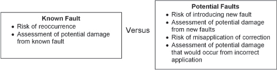
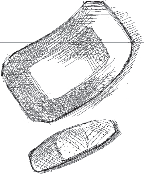

# CHAPTER 8

# Fault Treatment Patterns

After an error is processed, fault treatment prevents the error from reoccurring. This includes repairing the fault. This can mean patching the system, which is installing a new fault-free version of the software or the data. It can also mean correcting a procedure so that a person won’t cause the same error again.

> 处理错误后，故障处理可防止错误再次发生。这包括修复故障。这可能意味着对系统进行修补，即安装新的无故障版本的软件或数据。这也意味着要纠正一个程序，这样一个人就不会再犯同样的错误了。

Sometimes error detection will immediately precede fault treatment without the execution of an error recovery phase.

> 有时，错误检测将立即先于故障处理，而不执行错误恢复阶段。

The steps of fault removal are: verification, diagnosis and correction. Verification is done to determine if the system behavior conforms to its specifications. This is done to check whether the fault is still present in the system. The aim of diagnosis is to determine the cause, both in terms of location of the fault and the nature of the fault. Correction is the step in which the fault is made passive. After correction, verification is needed again to see that the system behavior is restored to conformance with its specification. Fault removal is an example of _corrective maintenance._

> 故障排除的步骤是：验证、诊断和纠正。进行验证以确定系统行为是否符合其规范。这样做是为了检查系统中是否仍然存在故障。诊断的目的是根据故障位置和故障性质确定原因。纠正是使故障被动的步骤。纠正后，需要再次进行验证，以确保系统行为恢复到符合其规范。故障排除是正确维护的一个示例_

Not all maintenance tasks are corrective. Preventive maintenance corrects a fault before it is activated. ROUTINE AUDITS (24), in Chapter 5, is an example of something that is both an error detection technique and a preventive maintenance task.

> 并非所有维护任务都是正确的。预防性维护在激活故障之前纠正故障。第 5 章中的例行审计（24）是一个错误检测技术和预防性维护任务的例子。

<a href="#c08.htm#tab8.1" id="c08.htm#tab8.1a">Table 8.1</a> lists all of the patterns in this chapter. Their order is that of the language shown in <a href="#c08.htm#fig8.90" id="c08.htm#fig8.90a">Figure 90</a> and also the order that the patterns appear within this chapter.

[**Table 8.1**](#c08.htm#tab8.1a) Fault treatment patterns

> [**表 8.1**]（#c08.htm#tab8.1a）断层处理模式

---

> ---

**PATTERN** **PATTERN INTENT** **VERIFICATION, DIAGNOSIS, CORRECTION**

> **模式***模式意图***验证、诊断、纠正**

LET SLEEPING DOGS LIE (58) Consider the true benefits to the system of correcting the faults versus leaving the fault present. Correction

> 让睡觉的狗躺下来（58）考虑纠正故障与保留故障对系统的真正好处。校正

REINTEGRATION (59) After making the faults passive, return the repaired component to service. Correction

> 重新整合（59）使故障失效后，将维修后的部件重新投入使用。校正

REPRODUCIBLE ERROR (60) Activate a fault while monitoring its behavior to determine clues to its nature and potential corrective treatments Verification

> 可再现错误（60）在监测故障行为的同时激活故障，以确定其性质和潜在纠正措施的线索验证

SMALL PATCHES (61) Surgically correct an erroneous program part. Correction

> 小补丁（61）手术纠正错误的程序部分。校正

ROOT CAUSE ANALYSIS (62) Identify the first fault in a sequence as the target of treatment actions. Diagnosis

> 根本原因分析（62）将序列中的第一个故障确定为治疗措施的目标。诊断

REVISE PROCEDURE (63) After a failure in which people contributed to downtime instead of minimized it, revise the procedures that they followed to avoid the problem in the future. Correction

> 修订程序（63）在发生故障后，人们导致停机而不是将停机时间最小化，请修订他们遵循的程序，以避免将来出现问题。校正

---

> ---

**[Figure 90](#c08.htm#fig8.90a)** Fault treatment pattern language map

> **[图 90]（#c08.htm#fig8.90a）**故障处理模式语言图

[Figure 90](#c08.htm#fig8.90) shows a possible language mapping for the patterns in this chapter.

> [图 90]（#c08.htm#fig8.90）显示了本章中模式的可能语言映射。

People are more involved in the patterns of this chapter than they were in the patterns of the other chapters. Deciding whether the benefits of correcting a fault outweigh the risks of introducing other faults can only be done by people. This is discussed in LET SLEEPING DOGS LIE (58). In some of the earlier patterns the operating personnel were mentioned. Several of the patterns in this chapter, specifically REVISE PROCEDURE (63) and REINTEGRATION (59), discuss procedures and methods of operations intended for these operating personnel. System architects and developers are the main actors in ROOT CAUSE ANALYSIS (62), REVISE PROCEDURE and SMALL PATCHES (61). REPRODUCIBLE ERROR (60) describes a practice that any of the operating personnel, architects, and designers employ to verify that the system still does not behave as specified; in other words that a fault is still present, and that correcting the fault eliminates the failure.

> 与其他章节的模式相比，人们更关注本章的模式。决定纠正错误的益处是否大于引入其他错误的风险只能由人来完成。这在《让睡觉的狗躺起来》（58）中进行了讨论。在早期的一些模式中，提到了操作人员。本章中的几个模式，特别是修订程序（63）和重新整合（59），讨论了针对这些操作人员的操作程序和方法。系统架构师和开发人员是根本原因分析（62）、修订程序和小补丁（61）的主要参与者。可复制错误（60）描述了任何操作人员、建筑师和设计师用于验证系统仍不按规定运行的实践；换句话说，故障仍然存在，并且纠正故障消除了故障。

# 58. Let Sleeping Dogs Lie

… The system detected and corrected an error or failure. Now you are correcting the fault that caused them.

> …系统检测到并纠正了错误或故障。现在你正在纠正导致他们的错误。

**Should you correct all faults that the system and the maintainers find?**

> **您应该纠正系统和维护人员发现的所有故障吗**

Correcting faults in real systems is like surgery and in surgery there is always the risk of complications. When correcting a fault the patient is your software, and the risk of complications is real.

> 在现实系统中纠正错误就像手术，而在手术中总是有并发症的风险。当纠正错误时，患者是您的软件，并发症的风险是真实的。

Whenever a change is made, for example via SMALL PATCHES (61) or a SOFTWARE UPDATE (11), faults can unintentionally be injected into the system. This is common. Patches to correct faults add complexity to the system, which adds ‘scar tissue’ to the software, making it more difficult to read and maintain. Faults are added to the system within this complexity.

> 每当进行更改时，例如通过小补丁（61）或软件更新（11），故障可能会无意中注入系统。这很常见。修正错误的补丁增加了系统的复杂性，这给软件增加了“疤痕组织”，使其更难读取和维护。在这种复杂性范围内，故障被添加到系统中。

You must weigh the benefits of correcting the known fault and the errors that it causes with the potential unknown faults and errors you might accidentally introduce. With the known fault you have an idea what the risk of future unavailability is in the case that the fault activates again.

> 您必须权衡纠正已知故障及其导致的错误的益处，以及可能意外引入的潜在未知故障和错误。通过已知故障，您可以知道在故障再次激活的情况下，未来不可用的风险是什么。

Every latent fault that you identify and are able to fix presents a risk that exists in the system. You should consider what the likelihood of the fault reactivating is. What is the risk to the system if the fault activates again and causes an error? What is the size and complexity of the correction? What is the probability you can construct the correction without new faults and then install it without introducing other faults? You need to consider all these risks when deciding whether to fix the fault. <a href="#c08.htm#fig8.91" id="c08.htm#fig8.91a">Figure 91</a> shows the balance required.

> 您识别并能够修复的每个潜在故障都会带来系统中存在的风险。您应该考虑故障重新激活的可能性。如果故障再次激活并导致错误，系统的风险是什么？纠正的规模和复杂性是多少？您可以在没有新故障的情况下构建纠正，然后在没有引入其他故障的情况下装设纠正的概率是多少？在决定是否修复故障时，您需要考虑所有这些风险 <a href=“#c08.htm#fig8.91”id=“c08.htm#fig8.91a”> 图 91</a>显示了所需的余额。

**[Figure 91](#c08.htm#fig8.91a)** Balancing known versus potential faults

> **[图 91]（#c08.htm#fig8.91a）**平衡已知故障与潜在故障

You must also consider the costs associated with correcting the fault. There are the costs associated with recreating it in the test system, costs associated with making the change and verifying that it is correct, and also costs associated with distributing the change to the production systems. As pointed out above, new faults can be introduced at any of these times, which will add their own costs to be considered. Costs to goodwill with the system’s owners must also be considered. How will they react to their need to correct the system, which might require downtime?

> 您还必须考虑与纠正故障相关的成本。有与在测试系统中重新创建更改相关的成本，与进行更改和验证更改是否正确相关的成本以及与将更改分发到生产系统相关的成本。如上所述，任何时候都可能出现新的故障，这将增加需要考虑的成本。还必须考虑与系统所有者的商誉成本。他们将如何应对可能需要停机的系统纠正需求？

What are the benefits associated with correcting a fault? It won’t reoccur, a known source of error will be eliminated, reducing the error probability, which will increase the availability. When making the correction you have an opportunity to correct other faults. Proactive correction of faults can increase goodwill with the system’s owners. <a href="#c08.htm#fig8.92" id="c08.htm#fig8.92a">Figure 92</a> shows the dimensions to consider when deciding whether to correct a fault.

> 纠正故障有什么好处？它不会再次出现，已知的错误源将被消除，从而降低错误概率，从而提高可用性。进行纠正时，您有机会纠正其他错误。主动纠正故障可以增加与系统所有者的友好关系 <a href=“#c08.htm#fig8.92”id=“c08.htm#fig8.92a”> 图 92</a>显示了决定是否纠正故障时需要考虑的维度。

**[Figure 92](#c08.htm#fig8.92a)** Trade offs to consider

> **[图 92]（#c08.htm#fig8.92a）**需要考虑的权衡

Every fault that is considered will balance the trade offs in [Figure 92](#c08.htm#fig8.92) differently. If the fault is causing system instability and failures that result in total unavailability, the balance should result in its being corrected. If, on the other hand, the fault produces errors that have a simple workaround or are very unlikely to reoccur, then the best choice might be to leave the fault uncorrected. For example if the failure occurs during time of day exchange between two processors in a small distributed system, but the failure only occurs when daylight savings time is invoked, then in many environments it will not be fixed.

> 所考虑的每一个故障都将以不同的方式平衡[图 92]（#c08.htm#fig8.92）中的权衡。如果故障导致系统不稳定和导致完全不可用的故障，则应纠正其平衡。另一方面，如果故障产生的错误具有简单的解决方法或不太可能再次发生，那么最好的选择可能是不纠正故障。例如，如果故障发生在小型分布式系统中两个处理器之间的一天中的时间交换期间，但故障仅在调用夏时制时发生，那么在许多环境中，故障将无法修复。

Therefore,

> 因此

**Weigh the risks and costs with the benefits and rewards associated with the correction. Sometimes it will be best to LET SLEEPING DOGS LIE** and not make the correction. Deciding whether to correct a fault is like wondering if there is a wolf just outside the window, <a href="#c08.htm#fig8.93" id="c08.htm#fig8.93a">Figure 93</a>.

> **权衡风险和成本以及与纠正相关的收益和回报。有时，最好让睡觉的狗撒谎，而不要纠正。决定是否纠正错误就像想知道窗外是否有狼，<a href=“#c08.htm#fig8.93”id=“c08.htm#fig8.93a”> 图 93</a>。

**[Figure 93](#c08.htm#fig8.93a)** Picking the known or the unknown

> **[图 93]（#c08.htm#fig8.93a）**选择已知或未知

You are deciding whether you should correct all of the faults that you know about. You are correcting the ones with the highest risk of reoccurring or the highest potential for damage if they do reoccur. You are not correcting the ones with a lower risk to avoid introducing new faults. …

> 你正在决定是否应该纠正你所知道的所有错误。您正在纠正那些再次发生风险最高或如果再次发生可能造成损害的问题。您没有纠正风险较低的故障，以避免引入新的故障…

# 59. Reintegration

… You have corrected a fault but the previously faulty element is not doing useful work yet. The faulty element was either REDUNDANT (3) and the application is still available, or it wasn’t REDUNDANT and the application is unavailable.

> …您已经纠正了一个故障，但先前的故障元件尚未发挥作用。故障元素要么是冗余（3）且应用程序仍然可用，要么不是冗余且应用程序不可用。

Error Treatment might have been achieved through the use of a mitigation technique from Chapter 7, or SOFTWARE UPDATE (11) was used to apply a SMALL PATCH(61).

> 错误处理可能通过使用第 7 章中的缓解技术实现，或使用软件更新（11）应用小补丁（61）。

**What should you do with a component that you have fixed?**

> **您应该如何处理已修复的组件**

There are a number of steps that need to be done in order to guarantee that the treated component can be returned to service effectively and quickly. If any of the steps are not done then the same or a different error might occur and cause further error processing steps to be taken. This will reduce availability.

> 为了确保处理过的组件能够有效、快速地恢复使用，需要执行许多步骤。如果没有执行任何步骤，则可能发生相同或不同的错误，并导致采取进一步的错误处理步骤。这将降低可用性。

The treated component might still be in lists of errors that RIDING OVER TRANSIENTS(26) is monitoring. There might also be lists of faulty components that were used to isolate and locate the fault. It should be removed from these lists since it is now treated.

> 被处理的组件可能仍在 RIDING OVER TRANSIENTS（26）正在监视的错误列表中。也可能有用于隔离和定位故障的故障部件列表。应该从这些列表中删除它，因为它现在已被处理。

The fault may not have been corrected. The treated component should be watched for a short while to ensure that the error that you think you corrected does not reappear. By watching it you will also be checking that new faults have not been inserted into the system with the SOFTWARE UPDATE(11) that you applied. This process of watching the component is called soaking, hardening or trialing. RECOVERY BLOCK(4) mechanisms can be used to automatically return to the unchanged software if the change should fail.

> 故障可能尚未排除。应对处理过的组件进行短暂的观察，以确保您认为已纠正的错误不会再次出现。通过观察它，您还将检查新的故障是否未通过应用的软件更新（11）插入系统。这种观察部件的过程称为浸泡、硬化或试验。如果更改失败，可以使用 RECOVERY BLOCK（4）机制自动返回到未更改的软件。

The previously faulty component should be reintegrated into the system. If the component is part of a load sharing group, allow it to start handling load again.

> 先前出现故障的部件应重新整合到系统中。如果组件是负载共享组的一部分，请允许它再次开始处理负载。

The restoration procedure has a number of things to do to make sure that all of the other parts of the system know that the corrected component is available. Capture these instructions in a reusable procedure.

> 恢复程序有许多事情要做，以确保系统的所有其他部分都知道正确的组件可用。在可重复使用的过程中获取这些指令。

When the component that you are returning to service is a redundant copy of another element, you have to decide whether the returning component should become the active or the standby. If the redundancy is set up in a load sharing arrangement, then this choice is not relevant. Most often, the system makes the active/standby decision within the context of the overall architecture of the system. What is the normal mode of operation? Does the system architecture call for the now active standby to be active only when the usually active component is processing an error? This might be the case in an N+M redundancy scheme, or when the standby is not a fully functional unit, but is only able to act as the active for a short time. If the standby is a fully functional component, then the general decision should be to leave the current active unit active, <a href="#c08.htm#fig8.94" id="c08.htm#fig8.94a">Figure 94</a>. This uses ROUTINE EXERCISES(23) in verifying the full functionality of the currently active (formerly standby) component. It also reduces the unavailability due to the time it takes to apply the correction via SOFTWARE UPDATE (36) and to make the returning component active.

> 当您要返回服务的组件是另一个元素的冗余副本时，您必须决定返回的组件应该成为活动组件还是备用组件。如果在负载共享安排中设置冗余，则此选择不相关。最常见的情况是，系统在系统总体架构的上下文中做出活动/备用决策。正常操作模式是什么？系统架构是否仅在通常活动的组件正在处理错误时才要求现在活动的备用设备处于活动状态？这可能是 N+M 冗余方案中的情况，或者当备用单元不是一个功能齐全的单元，但只能在短时间内充当活动单元时。如果备用设备是一个功能齐全的组件，那么一般的决定应该是保持当前活动单元处于活动状态，<a href=“#c08.htm#fig8.94”id=“c08.htm#fig8.94a”> 图 94</a>。这使用常规练习（23）来验证当前活动（以前是备用）组件的全部功能。它还减少了由于通过软件更新（36）应用校正和激活返回组件所需的时间而导致的不可用性。

**[Figure 94](#c08.htm#fig8.94a)** Keeping the repaired component as the standby

> **[图 94]（#c08.htm#fig8.94a）**将修复后的组件作为备用组件

As the previous discussion shows, there are many steps that need to be done. Failing to perform them can result in errors and further unavailability. You can execute each step in an ad hoc manner or you can follow a predefined procedure. With a procedure you will not forget anything, the actions that you take will be appropriate to the situation, and all the parts of the system will know what steps are involved in restoration. A clear procedure definition enables an evolution to automatically restore the treated component. Automatic restoration and automatic actions, MINIMIZE HUMAN INTERVENTION (5), will speed error processing and reduce unavailability.

> 正如前面的讨论所显示的，有许多步骤需要完成。如果不执行这些操作，可能会导致错误和进一步的不可用性。您可以以特殊方式执行每个步骤，也可以遵循预定义的过程。通过一个程序，你不会忘记任何事情，你所采取的行动将适合于情况，系统的所有部分都将知道恢复过程中涉及哪些步骤。清晰的程序定义使进化能够自动恢复处理过的组件。自动恢复和自动操作，最小化人为干预（5），将加快错误处理并减少不可用性。

Therefore,

> 因此

**Follow a predetermined procedure to reintegrate a corrected component into the system, <a href="#c08.htm#fig8.95" id="c08.htm#fig8.95a">Figure 95</a>.**

> **按照预定程序将校正后的组件重新集成到系统中，<a href=“#c08.htm#fig8.95”id=“c08.htm#fig8.95a”> 图 95</a>**

**[Figure 95](#c08.htm#fig8.95a)** Follow a process to reintegrate a task

> **[图 95]（#c08.htm#fig8.95a）**遵循流程重新整合任务

The system is now more operational than it was before. You have corrected the fault and restored all of the system’s components to operation.

> 该系统现在比以前更具操作性。您已排除故障并恢复系统所有组件的运行。

ROUTINE MAINTENANCE (22) and ROUTINE EXERCISES (23) are used to protect the system and keep it ready for future errors and failures. …

> 日常维护（22）和日常锻炼（23）用于保护系统，并使其为将来的错误和故障做好准备…

# 60. Reproducible Error

… The system detected an error or failure and the error was processed. You are now interested in correcting it.

> …系统检测到错误或故障，并已处理该错误。你现在有兴趣纠正它。

You are not just staring at a blank page wondering what to correct because the system captured information about the nature of the error and failure. You identified (or think that you have identified) the stimuli that triggers the fault to activate.

> 您不只是盯着空白页面不知道该纠正什么，因为系统捕获了有关错误和故障性质的信息。您确定（或认为您已经确定）触发故障激活的刺激。

**You want to correct a real fault, not waste time on something only imagined to be the fault.**

> **你想纠正一个真正的错误，而不是把时间浪费在只被认为是错误的事情上**

When the error was detected, techniques such as RIDING OVER TRANSIENTS (26) were used to ensure that a real, persistent error has been found. The system has not been static in the time between when the error processing completed and you begin treating the fault. Faults are sometimes corrected and removed from the system as a side effect of some other fault treatment or SOFTWARE UPDATE (11).

> 当检测到错误时，使用了诸如 RIDING OVER TRANSIENTS（26）之类的技术来确保发现了真正的、持久的错误。在错误处理完成和您开始处理故障之间，系统不是静态的。故障有时会被纠正并从系统中删除，这是其他故障处理或软件更新的副作用（11）。

Unless you very clearly identified the fault that caused the previously detected error, you cannot be certain that it is still present unless it causes the error again. You need to be sure that it is really broken before you can fix it. You also need to be sure that you are fixing the fault that causes the error or failure of interest.

> 除非您非常清楚地识别出导致先前检测到的错误的故障，否则无法确定它是否仍然存在，除非它再次导致错误。在修复之前，您需要确保它确实已损坏。您还需要确保您正在修复导致错误或故障的故障。

The system can be designed to automatically reapply the stimuli in some cases. Automatically reapplying stimuli that has caused an error is not usually done because of the complexity that gets added to the system to perform this functionality. This complexity provides ample opportunity for other faults to be latent in the system.

> 该系统可以设计成在某些情况下自动重新施加刺激。通常不会自动重新应用导致错误的刺激，因为执行此功能会增加系统的复杂性。这种复杂性为系统中潜在的其他故障提供了充足的机会。

Automatic stimulation to detect latent faults, or to verify that known faults are no longer present, is done in some systems as a form of system diagnostics. A QUARANTINE(28) zone is established and sequences of stimuli are introduced to see if the system behaves according to specification. These diagnostic tests are very effective if run in conjunction with ROUTINE EXERCISES (23).

> 在某些系统中，作为系统诊断的一种形式，进行自动激励以检测潜在故障，或验证已知故障不再存在。建立 QUARANTINE（28）区并引入刺激序列，以查看系统是否按照规范运行。如果与常规锻炼（23）结合使用，这些诊断测试非常有效。

The operating personnel can introduce stimuli into the system to verify that the system is performing according to its specification. This same test method will report if the fault under investigation is still present in the system.

> 操作人员可以将刺激引入系统，以验证系统是否按照其规范运行。如果正在调查的故障仍然存在于系统中，则采用相同的测试方法进行报告。

There is always a risk when a fault activates that the recovery will be unsuccessful and a failure will result. The benefits of correcting the fault must be weighed with the benefits of leaving the fault alone (LET SLEEPING DOGS LIE (58)). If the fault is not corrected you should consider providing better error processing for this particular fault (or class of faults) in a future SOFTWARE UPDATE (11).

> 当故障激活时，始终存在恢复失败并导致故障的风险。必须将纠正故障的益处与排除故障的益处进行权衡（LET SLEEPING DOGS LIE（58））。如果故障未得到纠正，则应考虑在未来的软件更新（11）中为该特定故障（或故障类别）提供更好的错误处理。

Consider an example scenario of controlled execution for systems that are highly dependant on incoming messages. In these systems some of the messages might be killer messages. One way of mitigating the effects of killer messages is to isolate the killer messages in a safe queue or holding area, where they won’t be of further risk. When the fault that the killer message activates is isolated, the killer message is reintroduced into the system in a controlled way. The QUARANTINE (28) zone required for this must prevent the fault’s activation from causing work disrupting errors in other parts of the system.

> 考虑高度依赖传入消息的系统的受控执行的示例场景。在这些系统中，一些消息可能是致命消息。减轻致命消息影响的一种方法是将致命消息隔离在安全队列或等待区，在那里它们不会有进一步的风险。当杀手消息激活的故障被隔离时，杀手消息以受控方式重新引入系统。为此所需的检疫区（28）必须防止故障激活导致系统其他部分的工作中断错误。

Therefore,

> 因此

**Stimulate the fault in a controlled manner to verify that the fault did indeed cause the observed error and that the fault is still present in the system, <a href="#c08.htm#fig8.96" id="c08.htm#fig8.96a">Figure 96</a>. To know that a fault exists, compare the results of applying the stimuli to the behavior described in the system specification.**

> **以受控方式模拟故障，以验证故障确实导致了观察到的错误，并且故障仍然存在于系统中，<a href=“#c08.htm#fig8.96”id=“c08.htm#fig8.96a”> 图 96</a>。要知道存在故障，请比较将刺激应用于系统规范中描述的行为的结果**

**[Figure 96](#c08.htm#fig8.96a)** Observe the error

> **[图 96]（#c08.htm#fig8.96a）**观察错误

This controlled failure testing is a kind of regression testing.

> 这种受控失效测试是一种回归测试。

You now know that the fault still exists and what an error that the fault causes looks like. You can now proceed to make the changes needed to correct the fault, such as SMALL PATCHES (61) or SOFTWARE UPDATE (11). …

> 现在您知道故障仍然存在，并且故障导致的错误看起来是什么样子。现在，您可以继续进行纠正故障所需的更改，例如小补丁（61）或软件更新（11）…

# 61. Small Patches

… You know how to correct the fault that caused a detected error or failure. You have weighed the options of LETTING SLEEPING DOGS LIE (58), and you now want to deploy the correction. You want to deploy it with minimal risk of downtime due to either the installation of the correction or latent faults in the correction.

> …您知道如何纠正导致检测到的错误或故障的故障。你已经权衡了让睡觉的狗躺（58 岁）的选项，现在你想展开修正。您希望以最小的停机风险部署它，因为安装了修正或修正中存在潜在故障。

**What kind of SOFTWARE UPDATE (11) will have the least chance of introducing extraneous faults or bringing in extra capabilities that are not needed?**

> **什么样的软件更新（11）引入外部故障或引入不需要的额外功能的可能性最小**

Coding faults can be as simple as a misplaced comma. They are easy to introduce and hard to detect even with the fault prevention efforts you employ.

> 编码错误可以像一个错置的逗号一样简单。即使您采取了故障预防措施，它们也很容易引入，也很难检测到。

The likelihood of a fault in the SOFTWARE UPDATE (11) you prepare to remove a fault increases as the size of the update increases. With more code, there are more places for the fault to hide and more complexity to understand and test. Extra effort is needed to correctly develop and test the correction.

> 准备删除故障的软件更新（11）中出现故障的可能性随着更新大小的增加而增加。代码越多，故障隐藏的地方就越多，理解和测试的复杂性就越高。需要额外的努力来正确开发和测试更正。

There are a wide variety of techniques and tools available to correct computer programs. They range from very low level to high level.

> 有多种技术和工具可用于纠正计算机程序。它们的级别从很低到很高。

Some tools allow you to create byte level difference records to apply to an old version to produce a new version. This enables deployment of minimal updates. Examine these differences to determine if anything unexpected has changed, which is a clue that there are other faults within the update. You might not be able to examine individual bits and determine if they are correct, but you should be able to identify whether the differences are located in appropriate or inappropriate locations. An example is when you expect two to four bytes to be changed but instead the tools inform you that 3000 bytes changed.

> 一些工具允许您创建字节级差异记录，以应用于旧版本以生成新版本。这允许部署最少的更新。检查这些差异以确定是否发生了任何意外变化，这是更新中存在其他错误的线索。您可能无法检查各个位并确定它们是否正确，但您应该能够确定差异是否位于适当或不适当的位置。例如，您希望更改两到四个字节，但工具却通知您更改了 3000 个字节。

The tools to install small, possibly bit or byte level, corrections in a system could be prohibitively complicated. Typically they will require a portion be a permanent part of the system. Application of the correction might be quick, from an application downtime viewpoint, but the overall time that the system spends managing the correction can be significant.

> 在系统中安装小的，可能是位或字节级的校正的工具可能非常复杂。通常，他们需要一部分是系统的永久部分。从应用程序停机的角度来看，纠正的应用可能很快，但系统管理纠正所花费的总时间可能很长。

In many cases the only way to correct a faulty computer program is to stop its execution, install the new version and restart it. In addition to a long period of unavailability, this results in the entire program being moved around to convey the correction. Reinstalling the complete program or even updating to a new version of the complete program is time–consuming, as just noted. It also opens the system to corruption or installation of faults in other parts of the system that didn’t need to be corrected. Care must be taken to ensure that the entire program update includes only the desired correction and doesn’t include untested or partially implemented capabilities in some unaffected part of the system.

> 在许多情况下，纠正错误的计算机程序的唯一方法是停止执行、安装新版本并重新启动。除了长时间不可用外，这还会导致整个程序被移动以传达纠正。如前所述，重新安装完整程序或甚至更新到完整程序的新版本都很耗时。这也会导致系统损坏或在系统的其他部分安装不需要纠正的故障。必须注意确保整个程序更新仅包括所需的修正，而不包括系统某些未受影响部分中未经测试或部分实现的功能。

So much depends on your tools. If they support the application of byte level updates then that method becomes an option. If the smallest change that you can make is to change an executable file, that defines the minimal size of the update.

> 这很大程度上取决于你的工具。如果它们支持应用字节级更新，则该方法成为一个选项。如果您可以进行的最小更改是更改可执行文件，则定义了更新的最小大小。

Tool limitations can occur from both the tools that develop the update and from the tools that apply the update to the system. The size and nature of the updates should be considered when the SOFTWARE UPDATE (11) functionality is being designed and built.

> 开发更新的工具和将更新应用于系统的工具都可能存在工具限制。在设计和构建软件更新（11）功能时，应考虑更新的大小和性质。

Therefore,

> 因此

**Create as small an update as your tools and what needs to be patched allow.**

> **创建尽可能小的更新，只要您的工具和需要修补的内容允许**

<a href="#c08.htm#fig8.97" id="c08.htm#fig8.97a">Figure 97</a> shows that patches can be large or small.

**[Figure 97](#c08.htm#fig8.97a)** Various size patches

> **[图 97]（#c08.htm#fig8.97a）**各种尺寸的补丁

By reducing the size of changes to the system, you have reduced the risk of introducing new faults into the system. …

> 通过减少系统更改的大小，您已经降低了将新故障引入系统的风险…

# 62. Root Cause Analysis

… An error or a failure occurred. The error has been processed or mitigated and the system returned to service. Now it is time to correct the fault that caused the error that caused the failure.

> …发生错误或故障。错误已被处理或减轻，系统已恢复使用。现在是纠正导致故障的错误的时候了。

**What fault should you fix?**

> **你应该修复什么故障**

The detected failure (or error) might be the result of a long sequence of fault → error → failure, where one failure acts as the fault to cause a different error, see <a href="#c08.htm#fig8.98" id="c08.htm#fig8.98a">Figure 98</a>. Which fault should you correct?

> 检测到的故障（或错误）可能是长时间故障的结果 → 错误 → 故障，其中一个故障作为故障导致不同的错误，请参见图 98</a>。你应该纠正哪个错误？

**[Figure 98](#c08.htm#fig8.98a)** Failure sequences

> **[图 98]（#c08.htm#fig8.98a）**故障顺序

The detected errors or failures were either Error C or Failure C in the below diagram. If A or B had been detected then they would have been processed and Failure C would have been prevented from occurring. Correcting Fault C will prevent its activation from causing Error C and Failure C. However, the whole sequence of fault activations, errors and failures really began much earlier in time. What you would like to correct is the primary or ‘′root cause’ and not just a symptom.

> 检测到的错误或故障是下图中的错误 C 或故障 C。如果检测到 A 或 B，则它们将被处理，故障 C 将被防止发生。纠正故障 C 将防止其激活导致错误 C 和故障 C。然而，故障激活、错误和故障的整个过程确实开始得更早。你想纠正的是主要或“根本原因”，而不仅仅是症状。

Remember from Chapter 1 that there are different classifications of faults. The cause of a fault might be a design or coding oversight. Or the fault might have been an incorrect procedure for a human to follow, or even an incorrect action taken by a human operator. The kinds of faults are many and varied.

> 从第 1 章中记住，故障有不同的分类。故障的原因可能是设计或编码疏忽。或者，故障可能是人类要遵循的错误程序，甚至是人类操作员采取的错误操作。断层的种类繁多。

Correcting the symptoms such as releasing the inaccessible memory is useful, but it doesn’t prevent the error from occurring again. To prevent the error from reoccurring identify and correct the underlying fault rather than just correcting the symptom.

> 纠正诸如释放不可访问内存之类的症状是有用的，但这并不能防止错误再次发生。为了防止错误再次出现，请识别并纠正潜在故障，而不仅仅是纠正症状。

Employing the Fault Tolerant Mindset to corrective maintenance entails asking _why?_ an error happened and _why?_ a fault is present in the system. Asking _why?_ repeatedly is one way at getting to the root cause of the situation.

> 使用容错心态进行纠正性维护需要问为什么发生了一个错误，为什么系统中存在故障。问为什么反复是找到问题根源的一种方法。

An example of looking at a failure and asking why:

> 查看失败并询问原因的示例：

**Why** was the data record lost?

> **为什么**数据记录丢失？

Because the transaction failed in the middle.

> 因为交易在在中间失败了。

**Why** did the transaction fail in the middle?

> **为什么事务在中间失败了？

Because it ran out of memory.

> 因为它耗尽了内存。

**Why** did it run out of memory?

> **为什么**内存不足？

Because there was no more memory available for allocation.

> 因为没有更多的内存可供分配。

**Why** was there no more memory available for allocation?

> **为什么**没有更多的内存可供分配？

Because the memory was inaccessible.

> 因为内存不可访问。

**Why** was the memory inaccessible?

> **为什么**无法访问内存？

Because its owning task had terminated without releasing it.

> 因为它所拥有的任务已经终止而没有释放它。

Reaching the end produces a fault that can be corrected, namely that of tasks terminating without releasing memory.

> 到达终点会产生一个可以纠正的错误，即任务终止而不释放内存。

There might be more than one root cause of an error. For example, the root causes might be found to be that there was a mistake in a procedure, and also that the operating personnel deviated from the procedure.

> 错误的根本原因可能不止一个。例如，根本原因可能是程序中存在错误，以及操作人员偏离了程序。

Along the way to identifying the root cause of a problem other faults will be encountered. Record these and fix them also, don’t ignore them because they are just along the way to the root cause.

> 在确定问题根源的过程中，还会遇到其他故障。记录并修复这些问题，不要忽略它们，因为它们正是根本原因。

Therefore,

> 因此

**Fix the root cause of the error and any faults that you find while determining the root cause. A useful technique is to ask** **_why?_** **five times when determining the root cause of the error or failure that you are treating. Correct the faults found at this depth of the analysis.** Keep peeling back the layers to look inside the system to isolate the root cause as shown in <a href="#c08.htm#fig8.99" id="c08.htm#fig8.99a">Figure 99</a>.

> **修复错误的根本原因以及在确定根本原因时发现的任何故障。一个有用的技巧是问***为什么？_****在确定您正在处理的错误或失败的根本原因时，重复五次。纠正在此分析深度发现的故障。**继续剥离层以查看系统内部，以隔离根本原因，如图 99</a>所示。

**[Figure 99](#c08.htm#fig8.99a)** Keep looking inside

> **[图 99]（#c08.htm#fig8.99a）**继续往里看

Five is a suggested number of question iterations, but five is not special. Asking the question a different number of times is still useful, the objective is to be satisfied that the investigation has not stopped at the superficial level, but has gone to one of the real causes of the fault. There might still be faults at deeper levels, but you have done a good job identifying and correcting the source of the problem.

> 五次是建议的问题迭代次数，但五次并不特别。提出不同次数的问题仍然是有用的，目的是确保调查没有停留在表面层面，而是找到了故障的真正原因之一。在更深层次上可能仍然存在错误，但您已经很好地识别和纠正了问题的根源。

‘5 Whys’ is a quality technique employed by Six Sigmas and other quality methodologies. For other techniques to determine the root cause, turn to the software and process quality literature. …

> “5 个为什么”是 Six Sigma 和其他质量方法所采用的质量技术。对于确定根本原因的其他技术，请参考软件和过程质量文献…

# 63. Revise Procedure

… The system has had a failure. You have corrected any faults that you identified via ROOT CAUSE ANALYSIS (62) using SOFTWARE UPDATE (11).

> …系统出现故障。您已使用软件更新（11）纠正了通过根本原因分析（62）确定的任何故障。

Your ROOT CAUSE ANALYSIS (62) identified some faults that were related to the way that the operating personnel of the system behaved. The system design might have been incomplete in its implementation of MINIMIZE HUMAN INTERVENTION (5) or the personnel might have thought incorrectly that people knew best.

> 根本原因分析（62）确定了一些与系统操作人员行为方式相关的故障。系统设计可能在实施“最小化人为干预”（5）时不完整，或者工作人员可能错误地认为人们最了解。

Systems that are designed to be highly available or highly reliable frequently are maintained and operate in environments where there are human operators that surround them, in computing centers, telecom central offices, etc. In these situations, it is prudent to develop detailed operating procedures so that these operators know how to care for the system.

> 设计为高可用性或高可靠性的系统经常在有人为操作员的环境中维护和运行，如计算中心、电信中心办公室等。在这些情况下，谨慎地制定详细的操作程序，以便这些操作员知道如何维护系统。

**How can a repetition of errors caused by the operating personnel be avoided?**

> **如何避免操作人员造成的重复错误**

True experts know what to do, so when they intervene they rarely cause a failure to become more severe. Their intervention aids error processing and reduces unavailability. They know what to do because they know the system very well; for example, they might have been the system’s designers. MAXIMIZE HUMAN PARTICIPATION (6) provides the means to intervene.

> 真正的专家知道该怎么做，所以当他们进行干预时，很少会导致失败变得更严重。他们的干预有助于错误处理并减少不可用性。他们知道该做什么，因为他们非常了解系统；例如，他们可能是系统的设计者。最大化人类参与（6）提供了干预手段。

Many of the people who are maintaining your system are not true experts in its operation. They may not know how to correctly interpret the error messages. When confronted with ambiguous, misleading, or poorly worded instructions they might just start typing/clicking anything in an attempt to correct the error. They are truly dangerous and will cause many failures. The procedures for them to follow must be very clear and painstakingly researched.

> 许多维护您的系统的人都不是系统运行方面的真正专家。他们可能不知道如何正确解释错误消息。当遇到模棱两可、误导性或措辞不当的指令时，他们可能会开始键入/单击任何内容，试图纠正错误。它们确实很危险，会导致许多失败。他们要遵循的程序必须非常明确，并经过仔细研究。

Some of the people who are not experts will read the procedures that you have developed to explain how to manage the system. In some cases, errors can still occur, because the procedures that the people followed were not correct, were not complete, or were unclear.

> 一些不是专家的人将阅读您开发的程序，以解释如何管理系统。在某些情况下，错误仍然可能发生，因为人们遵循的程序不正确、不完整或不清楚。

REINTEGRATION (59) relies on a predetermined procedure to ensure that recovered and treated components are correctly returned to service. Other operational scenarios, such as SOFTWARE UPDATE (11), system configuration changes, and system backups are executed frequently and also benefit from predetermined procedures. Availability suffers when the procedures cannot be followed by the operating personnel.

> 重新整合（59）依赖于预先确定的程序，以确保回收和处理的部件正确返回使用。其他操作场景，如软件更新（11）、系统配置更改和系统备份，都会频繁执行，并从预定的过程中受益。当操作人员无法遵守程序时，可用性受到影响。

Therefore,

> 因此

**When operating personnel following the system’s predetermined procedures contribute to failure durations, revise the procedures to avoid repeating the same sequence of errors.**

> **当操作人员遵循系统的预定程序导致故障持续时间时，修改程序以避免重复相同的错误序列**

Mark up the procedures, <a href="#c08.htm#fig8.100" id="c08.htm#fig8.100a">Figure 100</a>, to make them better for the next time they are needed.

> 标记步骤，<a href=“#c08.htm#fig8.100”id=“c08.htm#fig8.100a”> 图 100</a>，以便下次需要时更好地使用。

**[Figure 100](#c08.htm#fig8.100a)** Correct the procedure

> **[图 100]（#c08.htm#fig8.100a）**纠正步骤

If you can show the group of human operators that just blindly types to correct the problem that the procedures you have written lead to successful recovery, they might be enticed to use them in the next error situation.

> 如果您可以向一组操作员展示，他们只是盲目地键入以纠正您编写的程序导致成功恢复的问题，那么他们可能会被引诱在下一个错误情况下使用它们。

Your system and the environment in which it operates will be more robust with higher availability. There will be fewer human caused errors and failures. …

> 您的系统及其运行环境将更加强健，具有更高的可用性。将减少人为错误和故障…

**Conclusion**

> **结论**

The previous five chapters contain patterns that can help make your software designs more fault tolerant. Chapter 4 contained architectural principles that you should use to structure your overall solution. Chapter 5 presented patterns to help detect the presence of errors and faults before failures occur. Chapters 6 and 7 gave ways to process errors. Sometimes the processing results in the system execution state changing, and sometimes the errors and faults can be processed in a way that doesn’t change the execution flow. Chapter 8 contained patterns to help treat the faults and return the erroneous component to availability. This chapter shows the complete pattern language and gives an example of how the patterns can work together.

> 前五章包含的模式可以帮助您的软件设计更加容错。第 4 章包含了构建整体解决方案时应使用的架构原则。第 5 章介绍了有助于在故障发生之前检测错误和故障的模式。第 6 章和第 7 章给出了处理错误的方法。有时处理会导致系统执行状态发生变化，有时错误和故障可以以不改变执行流程的方式进行处理。第 8 章包含了帮助处理故障并使错误组件恢复可用性的模式。本章展示了完整的模式语言，并给出了模式如何协同工作的示例。

# _A Pattern Language for Fault Tolerant Software_

Each chapter began with a description of the patterns and how they related to each other and how they worked together to make a system more fault tolerant. Linkages between the patterns in different chapters were not highlighted, except in the individual pattern descriptions. See back of book for a map of all of the patterns. Within this overall pattern map you can see some of the linkages between the patterns of the individual phases.

> 每一章都以描述模式以及它们之间的相互关系以及它们如何协同工作以使系统更具容错性开始。除个别模式描述外，不同章节中模式之间的联系没有突出显示。关于所有模式的地图，请参见书的背面。在这个总体模式图中，您可以看到各个阶段的模式之间的一些联系。

This figure represents only one possible combination of these patterns into a usable language. Others are possible, because the choice of patterns to apply to a given design problem depends on the context and the nature of the system, as illustrated through the example in the next section.

> 此图仅表示这些模式在可用语言中的一种可能组合。其他模式也是可能的，因为应用于给定设计问题的模式选择取决于系统的上下文和性质，如下一节中的示例所示。

The key connections between the patterns in the different chapters, as well as within the chapters, are shown. Not every possible connection that you might make when combining these patterns into a project specific language are shown. Neither is every reference made in the pattern text shown.

> 显示了不同章节中以及章节中模式之间的关键联系。在将这些模式组合成特定于项目的语言时，并没有显示所有可能的连接。所示模式文本中的每个引用也不相同。

There are four main entry points (top level patterns) into this language map. These are UNITS OF MITIGATION (1), CORRECTING AUDITS (2), MINIMIZE HUMAN INTERVENTION (5) and SOFTWARE UPDATE(11). These four architectural patterns from Chapter 4 start many of the pattern sequences through the language.

> 该语言地图有四个主要入口点（顶级模式）。这些是缓解单元（1）、纠正审计单元（2）、最小化人为干预单元（5）和软件更新单元（11）。第 4 章中的这四个架构模式通过语言开始了许多模式序列。

The interconnections and flow of patterns beginning with UNITS OF MITIGATION (1) proceeds to REDUNDANCY (3) and to the active error processing patterns of ESCALATION (9) and QUARANTINE (28). These patterns form the basis for most of the patterns of error detection and error processing. This includes the recovery related patterns of RESTART (31), ROLLBACK(32), ROLL-FORWARD (33), and RETURN TO REFERENCE POINT (34) in addition to the patterns related to CHECKPOINTING (37). The SYSTEM MONITOR (15) and related patterns, HEARTBEAT (16), ACKNOWLEDGEMENTS (17), and WATCHDOG (18) are also reached through the starting point of UNITS OF MITIGATION. The error mitigation patterns found in Chapter 7 are reached through FAULT CORRELATION (12), which is one of the central patterns in the language and is reached from the UNITS OF MITIGATION starting point as well.

> 从缓解单元（1）开始的模式的互连和流进行到冗余（3）和升级（9）和 QUARANTINE（28）的活动错误处理模式。这些模式构成了大多数错误检测和错误处理模式的基础。除了与检查点（37）相关的模式之外，这还包括恢复相关的模式：重启（31）、回滚（32）、向前滚动（33）和返回参考点（34）。系统监视器（15）和相关模式、心跳（16）、确认（17）和看门狗（18）也通过缓解单元的起点到达。第 7 章中发现的错误缓解模式是通过故障相关（12）实现的，这是语言中的中心模式之一，也是从缓解单元的起点实现的。

CORRECTING AUDITS (2) starts the paths through the language that contain the data related patterns, such as CHECKSUM (25), ERROR CORRECTING CODES(57) and MARKED DATA (56). These patterns, and the others shown, provide the primary means to deal with faults in data or data storage.

> 纠正审计（2）启动包含数据相关模式的语言的路径，如校验和（25）、错误纠正代码（57）和标记数据（56）。这些模式和所示的其他模式提供了处理数据或数据存储故障的主要方法。

MINIMIZE HUMAN INTERVENTION (5) starts the language paths related to information getting out of the system and to the people that are interested in the system’s operation. These include MAXIMIZE HUMAN PARTICIPATION (6), FAULT OBSERVER (10), the MINIMIZE MAINTENANCE INTERFACE (7), and the fault treatment pattern of REVISE PROCEDURE (63).

> 最小化人为干预（5）启动与系统外信息和对系统运行感兴趣的人相关的语言路径。其中包括最大限度的人员参与（6）、故障观察器（10）、最小限度的维护界面（7）和修订程序的故障处理模式（63）。

The paths and flows that begin at SOFTWARE UPDATE (11) are also closely related to people. Many of the fault treatment (Chapter 8) patterns flow out of SOFTWARE UPDATE because they either assist in the process of updating the system’s software, or because they are related to the human processes that require or facilitate updating the system.

> 从软件更新（11）开始的路径和流程也与人密切相关。许多故障处理（第 8 章）模式都来自软件更新，因为它们要么有助于更新系统软件的过程，要么与需要或有助于系统更新的人工过程相关。

To make use of the patterns presented in this book you need to think about which ones will be most relevant and useful to the problem at hand. Most projects will not include all of these patterns. The next part of this chapter shows an example of selecting the patterns that are relevant and creating a design based upon them.

> 要使用本书中介绍的模式，您需要考虑哪些模式与当前问题最相关和最有用。大多数项目不会包含所有这些模式。本章的下一部分展示了一个选择相关模式并基于它们创建设计的示例。

# _A Presence Server Example_

In this section an example system will be discussed, that of a Presence Server. The requirements and main functions of a Presence Server are introduced and then the section proceeds through the six step methodology to develop a fault tolerant Presence Server. At the appropriate stage of the method the patterns from the earlier chapters of this book will be assembled into a pattern language to design a fault tolerant system. There are many, many architecture and design issues involved with a system such as this. Only those directly related to fault tolerance and the patterns in this book will be mentioned.

> 在本节中，将讨论一个示例系统，即状态服务器。介绍了 Presence 服务器的要求和主要功能，然后本节将介绍六步方法，以开发容错 Presence 服务器。在该方法的适当阶段，本书前面章节中的模式将被组装成模式语言，以设计容错系统。像这样的系统涉及很多很多架构和设计问题。只有与容错和本书中的模式直接相关的内容才会被提及。

A Presence Server collects, stores, and distributes information about an entity’s availability and willingness to communicate. A model for Presence Servers is described in RFC 2278 \[DRS00\]. This entity of interest is referred to as the _presentity_. The Presence Server receives notification events from the presentity’s agent, combines the events with other events related to the presentity, and makes their presence information available to interested watchers.

> 状态服务器收集、存储和分发有关实体的可用性和通信意愿的信息。RFC 2278\[DRS00\]中描述了存在服务器的模型。这个感兴趣的实体被称为_ presentity_。呈现服务器从呈现实体的代理接收通知事件，将事件与与呈现实体相关的其他事件相结合，并使感兴趣的观察者可以获得其呈现信息。

Watchers are either _fetchers_ or _subscribers_. Fetchers actively poll the Presence Server for information about the presentities that they are interested in. Subscribers register their interest in advance and then the Presence Server publishes presence information to them.

> 观察者是_蚀刻者_或_订阅者_。获取者主动向呈现服务器轮询他们感兴趣的呈现实体的信息。订户提前注册他们的兴趣，然后呈现服务器向他们发布呈现信息。

Presence information consists of _presence tuples_ that contain presence status, a communication address, and potentially other information related to the presentity. The communication address field consists of a communication means and an address. Updates to the presence information are received from the presentity’s user agents. The presence information is always available to fetchers. Changes to presence information are published by the Presence Server to the subscribers.

> 存在信息由包含存在状态、通信地址和可能与存在实体相关的其他信息的存在元组组成。通信地址字段由通信装置和地址组成。从呈现实体的用户代理接收对呈现信息的更新。提取器始终可以获得状态信息。对状态信息的更改由状态服务器发布给订户。

## Non-functional Requirements

The section above presents a general overview of the functions that a Presence Server must perform. Other requirements on the Presence Server define and constrain the non-functional requirements related to performance, reliability, and maintainability.

> 上一节概述了 Presence Server 必须执行的功能。Presence Server 的其他要求定义并约束与性能、可靠性和可维护性相关的非功能性要求。

The Presence Server should be scalable to handle presence information for a large number of presentities. The requirements define how quickly presence information is made available to the watchers. The Presence Server should also be reliable, with as high availability as possible. For this discussion the actual performance and capacity requirement numbers are not needed.

> 呈现服务器应该是可扩展的，以处理大量呈现实体的呈现信息。这些要求定义了观察者可以获得状态信息的速度。状态服务器也应可靠，具有尽可能高的可用性。在此讨论中，不需要实际性能和容量需求数字。

Some commercial processors and operating systems require periodic reboots as preventive maintenance. Rebooting the Presence Server once per week seems like an acceptable alternative. If the reboot is done during a period of low activity, and if the data is saved over reboot, will that be sufficient to meet the requirements? Assume that the reboot takes one minute. One minute times 52 weeks equals 52 minutes per year. This is very close to 99.99%, or four nines, availability. In some usage scenarios four nines will be sufficient. For the purposes of this chapter, assume that this is acceptable. Higher than 99.99% availability will be needed if Presence Server will be used by a network provider as a service to many customers. They will have thousands and thousands of presentities that do not share a common one minute per week in which the server can be rebooted.

> 一些商用处理器和操作系统需要定期重新启动，作为预防性维护。每周重新启动一次 Presence Server 似乎是一个可以接受的替代方案。如果重新启动是在低活动期间完成的，并且数据是在重新启动期间保存的，那么这是否足以满足要求？假设重新启动需要一分钟。一分钟乘以 52 周等于每年 52 分钟。这非常接近 99.99% 或 4 个 9 的可用性。在某些使用场景中，四个 9 就足够了。在本章中，假设这是可以接受的。如果网络提供商将 Presence Server 用作许多客户的服务，则需要 99.99% 以上的可用性。他们将有成千上万的在线实体，它们每周不共享一分钟的公共时间，在这一时间内服务器可以重新启动。

The Presence Server should operate unattended without constant human oversight.

> Presence Server 应在无人值守的情况下运行，无需持续的人工监督。

## Implementation Choices

For the purposes of this example, consider that the architects of the Presence Server have decided a few things. These will help shape the discussion of use of patterns later. The architects want to be able to add processors in a clustering arrangement to support growth and reliability. These processors will be active-active and load balancing. In the initial and smallest configuration there will be only two processors. Additional processors will be added as they are needed. <a href="#bm.htm#fig1.101" id="bm.htm#fig1.101a">Figure 101</a> shows a view of the hardware building blocks. Load balancing of incoming presence information is done by one of the two processors which shares the workload by passing some of the incoming information to the other processors for service.

> 出于本示例的目的，请考虑 Presence Server 的架构师已经决定了一些事情。这些将有助于形成稍后对模式使用的讨论。架构师希望能够在集群安排中添加处理器，以支持增长和可靠性。这些处理器将是主动-主动和负载平衡的。在初始和最小配置中，只有两个处理器。将根据需要添加其他处理器 <a href=“#bm.htm#fig1.101”id=“bm.htm#fig1.101a”> 图 101</a>显示了硬件构建块的视图。传入状态信息的负载平衡由两个处理器中的一个处理器完成，这两个处理器通过将一些传入信息传递给其他处理器进行服务来共享工作负载。

**[Figure 101](#bm.htm#fig1.101a)** System building blocks

> **[图 101]（#bm.htm#fig1.101a）**系统构建块

The presence information will be stored on disks local to the cluster. The overhead of a database management system outweighs the benefits of the system, so the Presence Server will not use an off the shelf database.

> 状态信息将存储在群集的本地磁盘上。数据库管理系统的开销超过了系统的优势，因此 Presence Server 不会使用现成的数据库。

# _Designing for Fault Tolerance_

In Chapter 2 a six step method for designing for fault tolerance was introduced. The main benefit of this method is that it provides a structure to employ the Fault Tolerant Mindset and examine the system’s potential failures and risks and to mitigate them through the application of patterns. The six steps are:

> 第二章介绍了容错设计的六步方法。这种方法的主要优点是它提供了一种结构，可以使用容错思维，检查系统的潜在故障和风险，并通过应用模式来缓解这些故障和风险。六个步骤是：

**1.** Determine the things that can go wrong with the system.

> **1.**确定系统可能出现的问题。

**2.** Define the strategies needed to mitigate the risks

> **2.**确定缓解风险所需的策略

**3.** Identifying the primary system dividing points and modes of redundancy.

> **3.**确定主要系统分界点和冗余模式。

**4.** Make the architectural and major design decisions.

> **4.**做出建筑和主要设计决策。

**5.** Design in the capabilities for the system to implement the risk mitigation strategies identified in step 2.

> **5.**设计系统实施步骤 2 中确定的风险缓解策略的能力。

**6.** Designing human computer interactions and modes of management are important and must be done sensibly to ensure that failures won’t be initiated by the people who are trying to administer the system.

> **6.**设计人机交互和管理模式非常重要，必须明智地进行，以确保故障不会由试图管理系统的人员引发。

## Step 1: Assess the Things that can go Wrong

The first step is to begin by determining what can go wrong. Define what is a failure for the presence server. Well written specifications will clearly identify the failures as situations to be avoided.

> 第一步是从确定什么可能出错开始。定义状态服务器的故障。写得好的规范将清楚地将故障识别为需要避免的情况。

For the Presence Server there are three main failure types: incorrect information, untimely information, and Presence Server unavailability.

> 对于 Presence Server，有三种主要故障类型：信息错误、信息不及时和 Presence Server 不可用。

 Incorrect presence information failures: Incorrect, either incomplete or not current, presence information given to subscribers. Incorrect, either incomplete or not current, presence information made available to the fetchers. All presence information that arrives at the system should be processed, even though some of it will be invalid, for example data that has been superceded because the presentity’s state has changed.

 Untimely presence information failures: Presence information is not available within the time window defined in the specifications.

 Presence server unavailability failures: When the Presence Server is not able to receive presentity notifications, the Presence Server is unable to send presence information and the Presence Server is not able to process requests for information from the fetching watchers.

Once the failures are identified, what are the faults that can lead to them? <a href="#bm.htm#tab1" id="bm.htm#tab1a">Table 1</a> lists some of the possible faults for each of these potential failures.

> 一旦识别出故障，会导致故障的故障是什么 <a href=“#bm.htm#tab1”id=“bm.htm#tab1a”> 表 1</a>列出了每个潜在故障的一些可能故障。

[**Table 1**](#bm.htm#tab1a) Potential failures

> [**表 1**]（#bm.htm#tab1a）潜在故障

<table class="bodytable">
<colgroup>
<col style="width: 50%" />
<col style="width: 50%" />
</colgroup>
<tbody>
<tr class="odd" data-valign="top">
<td class="bodycell" style="border-bottom: 1px solid black; border-top: 1px solid black; background-color: black; color: white"><strong>FAILURE</strong></td>
<td class="bodycell" style="border-bottom: 1px solid black; border-top: 1px solid black; background-color: black; color: white"><strong>POSSIBLE FAULTS</strong></td>
</tr>
<tr class="even" data-valign="top">
<td class="bodycell" style="border-bottom: 1px solid black">Incorrect presence information</td>
<td class="bodycell" style="border-bottom: 1px solid black">Incorrect notification from presentity 

Presentity notification received incorrectly 

> 存在通知接收错误 

Presentity update combined incorrectly with stored presence information 

> 状态更新与存储的状态信息组合不正确 

Presence information saved incorrectly internally 

> 状态信息内部保存不正确 

Presentity identification incorrect so misplaced data</td>

> 存在标识不正确，数据错位</td>

</tr>
<tr class="odd" data-valign="top">
<td class="bodycell" style="border-bottom: 1px solid black">Untimely information</td>
<td class="bodycell" style="border-bottom: 1px solid black">Message buffered for too long 

Presentity updates coming at higher rate than the system can handle 

> 当前更新的速度高于系统处理的速度 

Publication not occurring frequently enough 

> 发布频率不够 

Publication not happening 

> 未发布 

Fetches ignored 

> 已忽略提取 

Fetches buffered for too long 

> 缓冲提取时间过长 

Fetches coming at a higher rate than specified in requirements</td>

> 提取率高于要求中的规定</td>

</tr>
<tr class="even" data-valign="top">
<td class="bodycell" style="border-bottom: 1px solid black">Presence Server unavailability</td>
<td class="bodycell" style="border-bottom: 1px solid black">Presence server in an infinite loop 

Presence server network interfaces faulty 

> 状态服务器网络接口故障 

Application failed to restart 

> 应用程序无法重新启动 

Operating system fault keeps it from executing 

> 操作系统故障使其无法执行 

Presence Server application stopped</td>

> 状态服务器应用程序已停止</td>

</tr>
</tbody>
</table>

## Step 2: Decide how to Mitigate the Risks

Step 2 is where the patterns in this book come in. Identify the patterns that help mitigate the failures described in the previous step. While you are getting started designing fault tolerant systems with the patterns in this book and other sources, explicitly noting the ones that are useful to the situation will be helpful, as shown in <a href="#bm.htm#tab2" id="bm.htm#tab2a">Table 2</a>. Diagramming them helps to understand and remember how they interrelate and build upon each other (Please see <a href="#bm.htm#fig1.102" id="bm.htm#fig1.102a">Figure 102</a>).

> 第 2 步是本书中的模式所在。确定有助于缓解上一步中描述的失败的模式。当您开始使用本书和其他来源中的模式设计容错系统时，明确指出对这种情况有用的模式将非常有用，如表 2</a>所示。对它们进行图示有助于理解和记住它们是如何相互关联和建立的（请参见图 102</a>）。

[**Table 2**](#bm.htm#tab2a) Presence Server pattern language

> [**表 2**]（#bm.htm#tab2a）Presence Server 模式语言

**[Figure 102](#bm.htm#fig1.102a)** Presence Server pattern language map

> **[图 102]（#bm.htm#fig1.102a）**Presence Server 模式语言映射

### _Applying the Language_

To apply the patterns in this book to the solution of the example problem, first build a working pattern language for the project. The language will contain those elements of the fault tolerant vocabulary presented here that will be useful in the design of the system. Patterns are not included if they will clearly not be needed or useful.

> 要将本书中的模式应用于示例问题的解决方案，首先为项目构建一种工作模式语言。该语言将包含此处介绍的容错词汇表中对系统设计有用的元素。如果模式显然不需要或不有用，则不包括这些模式。

[Table 2](#bm.htm#tab2) lists the patterns in our pattern language.

> [表 2]（#bm.htm#tab2）列出了模式语言中的模式。

Why these patterns? These are the ones that will be the most useful in our system. The specification for the Presence Server indicates that it must be scalable in size and availability. This has resulted in REDUNDANCY (3) being added to the system. RECOVERY BLOCKS (4), a means of implementing software redundancy, is not added to the pattern language because the systems’ requirements are not stringent enough to warrant the extra work required to implement the recovery blocks. In order to support REDUNDANCY a system of HEARTBEATS (16) monitored by a SYSTEM MONITOR(15) will be used.

> 为什么是这些模式？这些是我们系统中最有用的。Presence Server 的规范表明，它的大小和可用性必须可扩展。这导致系统增加了冗余（3）。RECOVERY BLOCKS（4）是一种实现软件冗余的方法，没有添加到模式语言中，因为系统的要求不够严格，无法保证实现恢复块所需的额外工作。为了支持冗余，将使用由系统监视器（15）监控的心跳系统（16）。

A number of patterns were eliminated because the Presence Server is only a four nines system. For example, an occasional reboot is okay, so the patterns that restart processing more quickly than a RESTART (31), such as ROLLBACK (32) and ROLL-FORWARD (33) are not included. Automatic correction of data like that provided by ERROR CORRECTING CODES(57) is similarly not needed and so is not included in our pattern language.

> 由于 Presence Server 只是一个四个 9 的系统，因此消除了许多模式。例如，偶尔重新启动是可以的，因此不包括重新启动处理比 restart（31）更快的模式，例如 ROLLBACK（32）和 ROLL-FORWARD（33）。类似于错误纠正代码（57）提供的数据的自动纠正同样不需要，因此不包括在我们的模式语言中。

CHECKPOINT (37) and related patterns also do not appear in our pattern language because of the nature of the presence related transactions. The notification events can be processed quickly. This means that they are short lived and CHECKPOINTS are most useful when the system has a considerable investment in completing long lived transactions.

> CHECKPOINT（37）和相关模式也不会出现在我们的模式语言中，因为存在相关事务的性质。可以快速处理通知事件。这意味着它们是短期的，当系统在完成长期交易方面有大量投资时，检查点最有用。

A number of the patterns listed above will appear in almost all fault tolerant project’s languages. Every system will need SOFTWARE UPDATE(11) capabilities. Almost all can make good use of a MAINTENANCE INTERFACE(7). Determining the UNITS OF MITIGATION(1) is a basic activity of the designer, so that pattern is included. The number of nines in the system’s availability goes down rapidly if every error requires a person to act upon it, so MINIMIZE HUMAN INTERVENTION(5) is included. It is also included because of the requirement for unattended operation.

> 上面列出的许多模式将出现在几乎所有容错项目的语言中。每个系统都需要软件更新（11）功能。几乎所有人都能很好地使用维护界面（7）。确定缓解单元（1）是设计师的一项基本活动，因此包括模式。如果每一个错误都需要一个人采取行动，系统可用性中的 9 的数量就会迅速下降，因此包括了“最小化人为干预”（5）。由于无人值守操作的要求，它也包含在内。

The choice of mitigation techniques is also guided by the overall availability need of the system. With a four nines or better goal, failure does not require that extra unused capabilities that can be activated as EXPANSIVE AUTOMATIC CONTROLS(47) be added to the system. Since the requirement of the system is to present presence information in a timely and correct fashion, all requests are important. The load shedding patterns are not included. QUEUE FOR RESOURCES(46) is added to the language because we anticipate the need to queue presence information during periods of overload to handle it when there is time. FRESH WORK BEFORE STALE(55) is in the language because by adding arrival time information to the presence information stored, the system will have the ability to discard some presentity updates if more recent ones have already been processed.

> 缓解技术的选择也取决于系统的总体可用性需求。对于四个 9 或更好的目标，故障不需要向系统添加额外的未使用功能，这些功能可以作为扩展自动控制（47）激活。由于系统的要求是以及时和正确的方式呈现呈现信息，所以所有请求都很重要。不包括减载模式。QUEUEFORRESOURCES（46）被添加到该语言中，因为我们预计需要在过载期间对存在信息进行排队，以便在有时间时对其进行处理。在停止之前刷新工作（55）是在该语言中，因为通过将到达时间信息添加到存储的呈现信息，如果已经处理了更新的呈现实体更新，则系统将能够丢弃一些呈现实体更新。

Since the system will not use a database to store the presence information, CORRECTING AUDITS (2) will be used to keep the data correct. CHECKSUM (25) will be used for detection by CORRECTING AUDITS and also to detect errors in messages. MARKED DATA (56) will be used in conjunction with DATA RESET (41) to process errors in the data.

> 由于系统不会使用数据库来存储状态信息，因此将使用 CORRECTING AUDITS（2）来保持数据正确。CHECKSUM（25）将用于纠正审计的检测，也用于检测消息中的错误。标记数据（56）将与数据复位（41）一起使用，以处理数据中的错误。

You want the system to get better over time, so you will fix problems as they are detected and also correct deficiencies in the system. This plan introduces SOFTWARE UPDATE (11), REPRODUCIBLE ERROR (60), REINTEGRATION (59) and ROOT CAUSE ANALYSIS (62) into the project pattern language.

> 您希望系统随着时间的推移变得更好，因此您将在检测到问题时修复问题，并纠正系统中的缺陷。该计划将软件更新（11）、可复制错误（60）、重新整合（59）和根本原因分析（62）引入到项目模式语言中。

Putting all these patterns together and drawing the language and relationship between these patterns results in [Figure 102](#bm.htm#fig1.102).

> 将所有这些模式放在一起，并绘制这些模式之间的语言和关系，结果是[图 102]（#bm.htm#fig1.102）。

## Step 3: Identifying Redundancy

Redundancy is a basic property of fault tolerant systems. In this step the redundancy of the system is assessed by comparing the architecture elements such as the chosen processor architecture and the system specification with the availability requirements.

> 冗余是容错系统的基本特性。在该步骤中，通过将诸如所选处理器架构和系统规范之类的架构元素与可用性需求进行比较来评估系统的冗余性。

The UNITS OF MITIGATION (1) and the boundaries needed for REDUNDANCY (3) are led by the system requirements. A system with four nines availability requirements does not need high levels of redundancy, in either the hardware or the software. However it will be built in a cluster that can grow. In the case of the Presence Server, the system should be designed to support the migration of key functions from one processor to another as the system size and scope increases. Single processors will be the basic unit of hardware and system redundancy.

> 缓解单位（1）和冗余所需的边界（3）由系统需求决定。具有“四个 9”可用性要求的系统不需要硬件或软件的高冗余度。然而，它将构建在一个可以增长的集群中。对于 Presence Server，系统的设计应支持随着系统大小和范围的增加，关键功能从一个处理器迁移到另一个处理器。单处理器将是硬件和系统冗余的基本单元。

Depending on the type of disk and its inherent failure rate redundant disks, and the volume of presence information expected, a disk redundancy method such as RAID-1 or RAID-2 should be used to mitigate the disk error rates.

> 根据磁盘类型及其固有的故障率冗余磁盘以及预期的存在信息量，应使用磁盘冗余方法（如 RAID-1 或 RAID-2）来降低磁盘错误率。

The ability to monitor the active Presence Server processors is needed. A FAULT OBSERVER (10) interface to an external monitor is one option. Since the system includes multiple processors they should watch each other through heartbeating mechanisms such as HEARTBEAT (16).

> 需要监控活动状态服务器处理器的能力。故障观察仪（10）与外部监视器的接口是一种选择。由于系统包括多个处理器，它们应该通过心跳机制（如 HEARTBEAT（16））相互监视。

## Step 4: Architectural Design Decisions

During this step the aspects of the system that have impact across the whole system will be added. This is done by deciding how the architectural patterns in our language will be implemented.

> 在此步骤中，将添加对整个系统有影响的系统方面。这是通过决定如何实现我们语言中的架构模式来完成的。

The previous steps have identified the basic UNITS OF MITIGATION (1) and REDUNDANCY (3). The system specification states that the system should not require active human intervention, so MINIMIZE HUMAN INTERVENTION (5) will be used. A FAULT OBSERVER (10) interface is needed to report the status to monitoring systems. This is a capability that might not be needed in the initial release, but will be required when the system grows to more processors eventually.

> 前面的步骤确定了基本的缓解单位（1）和冗余单位（3）。系统规范规定，系统不需要主动的人为干预，因此将使用“最小化人为干预”（5）。需要故障观察者（10）接口向监控系统报告状态。这是一种在初始版本中可能不需要的功能，但当系统最终发展到更多处理器时将需要这种功能。

Load sharing will be accomplished by having all the network traffic delivered to the two lowest numbered processors in the system. Number refers to whatever identification system is used for the cluster members. The processor with the lowest number is always the master that receives the presence tuples and fetcher requests and distributes them evenly across all the processors in the cluster. A HEARTBEAT (16) is established between these two processors. If the lowest numbered processor should fail and stop heartbeating then the next lowest numbered processor will assume the responsibility for load distribution to the active processors in the cluster. After the lowest number has recovered, it will resume heartbeats with the other processor and again assume the load distribution responsibility.

> 负载共享将通过将所有网络流量传送到系统中编号最低的两个处理器来实现。编号是指集群成员使用的任何标识系统。数量最少的处理器始终是接收存在元组和取数器请求并将其均匀分布在集群中所有处理器上的主处理器。在这两个处理器之间建立心跳（16）。如果编号最低的处理器发生故障并停止心跳，则编号最低的下一个处理器将负责向集群中的活动处理器分配负载。在最低数量恢复后，它将恢复与其他处理器的心跳，并再次承担负载分配责任。

If there are enough processors in the cluster then the task of publishing presence information to subscribers will be assigned to a pair of processors that aren’t doing the incoming load balancing, e.g. the third and fourth processors in the cluster. These two processors will watch each other (via a HEARTBEAT (16)) to ensure that one of them is always active and publishing presence information to the subscribers.

> 如果集群中有足够的处理器，则向订户发布状态信息的任务将被分配给一对不进行传入负载平衡的处理器，例如集群中的第三和第四处理器。这两个处理器将相互监视（通过 HEARTBEAT（16）），以确保其中一个处理器始终处于活动状态，并向订户发布状态信息。

HEARTBEATS (16) will be instituted between the two processors with the lowest numbers and all the other processors in the cluster. This will enable the two processors that are balancing the load to maintain a list of active processors to which work can be distributed.

> HEARTBEATS（16）将在具有最低数量的两个处理器和集群中的所有其他处理器之间建立。这将使正在平衡负载的两个处理器能够维护一个可以分配工作的活动处理器列表。

All of the system’s HEARTBEATS (16) will be subject to REALISTIC THRESHOLDS (19). RIDING OVER TRANSIENTS (26) will be used to provide appropriate system response to short duration processor problems.

> 系统的所有心跳（16）将受到真实阈值（19）的限制。跨越瞬态（26）将用于为短时处理器问题提供适当的系统响应。

All presence information arriving at the system will be given a timestamp and QUEUED FOR RESOURCES (46) and processed within a FRESH WORK BEFORE STALE (55) Last In First Out queue. If a presence tuple with a later timestamp has already been processed then the earlier one can be discarded without being processed. This ensures that both the recent change in status and the old requests are processed eventually, and will maximize the correctness of the presence information.

> 到达系统的所有存在信息将被赋予时间戳和资源排队（46），并在暂停前的新工作（55）后进先出队列中处理。如果已经处理了具有较后时间戳的存在元组，则可以丢弃较早的存在元组而不进行处理。这确保了状态的最近变化和旧请求最终都得到处理，并将最大限度地提高状态信息的正确性。

CORRECTING AUDITS (2) are used to ensure that data is correctly stored. Some example audits include: Verification that queue pointers are correct and there are no isolated elements in the queues. Verification that the presence tuple data stored on disk is correctly organized. All arriving presence information should be verified with CHECKSUMS (25) to determine if it was received correctly.

> 纠正审计（2）用于确保数据正确存储。一些示例审计包括：验证队列指针是否正确，队列中没有孤立的元素。验证存储在磁盘上的状态元组数据是否正确组织。应使用 CHECKSUMS（25）验证所有到达的状态信息，以确定其是否正确接收。

The ability to correct faults and add new capabilities is always required so the provisions for SOFTWARE UPDATE (11) are included at this point.

> 纠正故障和添加新功能的能力始终是必需的，因此此时包括软件更新（11）的规定。

## Step 5: Risk Mitigation Capabilities

Step 5 is concerned with the strategies needed to mitigate the risks mentioned in the earlier sections. The list of risks discussed in the previous section is shown with the patterns that can be used to mitigate them in <a href="#bm.htm#tab3" id="bm.htm#tab3a">Table 3</a>. This step serves as a check to see if the risks and failure causes identified in Step 1 have been mitigated.

> 第 5 步涉及缓解前面章节中提到的风险所需的策略。上一节中讨论的风险列表与可用于缓解风险的模式一起显示在表 3</a>中。该步骤用于检查步骤 1 中确定的风险和故障原因是否得到缓解。

[**Table 3**](#bm.htm#tab3a) Risk mitigations

> [**表 3**]（#bm.htm#tab3a）风险缓解措施

---

> ---

**RISK** **PATTERNS TO MITIGATE RISK**

> **降低风险的风险***模式**

Incorrect notification from presentity CHECKSUM (25)

> 存在实体 CHECKSUM 的错误通知（25）

Presentity notification received incorrectly CHECKSUM (25), FRESH WORK BEFORE STALE (55)

> 当前通知接收错误 CHECKSUM（25），暂停前的新工作（55）

Presentity update combined incorrectly with stored presence information CHECKSUM (25), CORRECTING AUDITS (2)

> 呈现更新与存储的呈现信息 CHECKSUM（25）、CORRECTING AUDITS（2）错误组合

Presence information saved incorrectly internally CHECKSUM (25), CORRECTING AUDITS (2)

> 内部错误保存状态信息 CHECKSUM（25），纠正审计（2）

Presentity identification incorrect so misplaced data CHECKSUM (25), CORRECTING AUDITS (2)

> 存在标识不正确，因此数据错位 CHECKSUM（25），纠正审计（2）

Message buffered for too long FRESH WORK BEFORE STALE (55)

> 暂停前的新鲜工作缓冲消息太长（55）

Presentity updates coming at higher rate than specified in requirements QUEUE FOR RESOURCES (46), FRESH WORK BEFORE STALE (55)

> 当前更新的速度高于要求“资源排队”（46）、“暂停前的新工作”（55）中规定的速度

Publication not occurring frequently enough FRESH WORK BEFORE STALE (55), SYSTEM MONITOR (15)

> 出版物出现频率不够高，在停止前新鲜工作（55），系统监视器（15）

Publication not happening ACKNOWLEDGEMENT (17), HEARTBEAT (16), SYSTEM MONITOR (15)

> 未发布确认（17）、心跳（16）、系统监控（15）

Fetches ignored ACKNOWLEDGEMENT (17), SYSTEM MONITOR (15)

> 获取忽略确认（17），系统监视器（15）

Fetches buffered for too long FRESH WORK BEFORE STALE (55), SYSTEM MONITOR (15)

> 在停止前缓存太长的新鲜工作（55），系统监视器（15）

Fetches coming at a higher rate than specified in requirements QUEUE FOR RESOURCES (46), FRESH WORK BEFORE STALE (55)

> 以高于要求“资源排队”（46）、“暂停前的新鲜工作”（55）中规定的速度获取

Presence server in an infinite loop ACKNOWLEDGEMENT (17), SYSTEM MONITOR (15)

> 无限循环中的状态服务器确认（17），系统监视器（15）

Presence server network interfaces faulty ACKNOWLEDGEMENT (18), CHECKSUM (25), HEARTBEAT (16), FAULT OBSERVER (10)

> 状态服务器网络接口故障确认（18）、校验和（25）、心跳（16）、故障观察者（10）

Application failed to restart SYSTEM MONITOR (15), HEARTBEAT (16), FAULT OBSERVER (10)

> 应用程序无法重新启动 SYSTEM MONITOR（15）、HEARTBEAT（16）、FAULT OBSERVER（10）

Operating system fault keeps it from executing HEARTBEAT (16), SYSTEM MONITOR (15), FAULT OBSERVER (10)

> 操作系统故障使其无法执行 HEARTBEAT（16）、system MONITOR（15）、fault OBSERVER（10）

Presence server application stopped HEARTBEAT (16), SYSTEM MONITOR (16), FAULT OBSERVER (10)

> 状态服务器应用程序已停止 HEARTBEAT（16）、SYSTEM MONITOR（16）和 FAULT OBSERVER（10）

---

> ---

## Step 6: Human Computer Interactions

In this last step the style and means of human interaction with the system is defined. The Presence Server will have primarily a maintenance interaction with humans, which can effectively be implemented through a simple web form interface style.

> 在最后一步中，定义了人类与系统交互的方式和方法。Presence Server 将主要与人类进行维护交互，这可以通过简单的 web 表单界面样式有效实现。

# _Software Structure_

<a href="#bm.htm#fig1.103" id="bm.htm#fig1.103a">Figure 103</a> shows a possible block diagram of the major software components in the system. Note that the application that writes to the presence information store is a gray box that has had little done to it to support the system’s reliability.

**[Figure 103](#bm.htm#fig1.103a)** Presence Server Software Architecture

> **[图 103]（#bm.htm#fig1.103a）**Presence 服务器软件架构

This design includes several primary components with responsibility for other parts. These components were identified partly for clarity of the example in this chapter. Their functions follow the recommendations offered within the patterns. When the system is actually being implemented further combination of the functions is possible. For examples, the Maintenance Interface and the Fault Observer can be combined, as can the System Monitor and the Overload Monitor.

> 该设计包括几个主要部件，负责其他部件。在本章中，为了清楚示例，对这些组件进行了部分识别。它们的功能遵循模式中提供的建议。当系统实际被实施时，功能的进一步组合是可能的。例如，可以组合维护界面和故障观察仪，也可以组合系统监视器和过载监视器。

While the design is being implemented its reliability and availability should be assessed through testing and reliability engineering.

> 在设计实施过程中，应通过测试和可靠性工程评估其可靠性和可用性。
