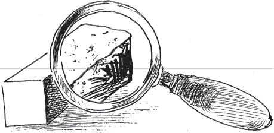
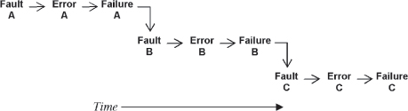

```

**[Figure 90](#c08.htm#fig8.90a)** Fault treatment pattern language map


[Figure 90](#c08.htm#fig8.90) shows a possible language mapping for the patterns in this chapter.

> 图 90(#c08.htm#fig8.90)显示了本章模式的可能语言映射。

People are more involved in the patterns of this chapter than they were in the patterns of the other chapters. Deciding whether the benefits of correcting a fault outweigh the risks of introducing other faults can only be done by people. This is discussed in LET SLEEPING DOGS LIE (58). In some of the earlier patterns the operating personnel were mentioned. Several of the patterns in this chapter, specifically REVISE PROCEDURE (63) and REINTEGRATION (59), discuss procedures and methods of operations intended for these operating personnel. System architects and developers are the main actors in ROOT CAUSE ANALYSIS (62), REVISE PROCEDURE and SMALL PATCHES (61). REPRODUCIBLE ERROR (60) describes a practice that any of the operating personnel, architects, and designers employ to verify that the system still does not behave as specified; in other words that a fault is still present, and that correcting the fault eliminates the failure.

> 人们比以前更多地参与到本章的模式中。**只有人才能决定纠正错误的好处是否超过引入其他错误的风险。** 这在 `Let Sleeping Dogs Lie`(58)中有所讨论。在一些早期的模式中，提到了操作人员。本章中的几个模式，特别是“修订程序”(63)和“重新整合”(59)，讨论了针对这些操作人员的程序和操作方法。根本原因分析(62)、修订程序和小补丁(61)的主要参与者是系统架构师和开发人员。可重复错误(60)描述了任何操作人员、架构师和设计师都可以采用的实践，以验证系统仍然不符合指定的行为；换句话说，故障仍然存在，纠正故障可以消除故障。

# 58. Let Sleeping Dogs Lie

… The system detected and corrected an error or failure. Now you are correcting the fault that caused them.

> 系统检测并更正了一个错误或故障。现在您正在纠正导致这些故障的故障。

**Should you correct all faults that the system and the maintainers find?**

> 你应该纠正系统和维护人员发现的所有故障吗？

Correcting faults in real systems is like surgery and in surgery there is always the risk of complications. When correcting a fault the patient is your software, and the risk of complications is real.

> 纠正真实系统中的故障就像手术一样，手术中总会有并发症的风险。当纠正故障时，患者是您的软件，**并发症的风险是真实的。**

Whenever a change is made, for example via SMALL PATCHES (61) or a SOFTWARE UPDATE (11), faults can unintentionally be injected into the system. This is common. Patches to correct faults add complexity to the system, which adds ‘scar tissue’ to the software, making it more difficult to read and maintain. Faults are added to the system within this complexity.

> 每当进行更改时，例如通过小补丁(61)或软件更新(11)，会意外地将错误注入系统中。这很常见。用于修复错误的补丁会增加系统的复杂性，这会给软件增加“瘢痕”，使其更难阅读和维护。在这种复杂性中会添加错误到系统中。

You must weigh the benefits of correcting the known fault and the errors that it causes with the potential unknown faults and errors you might accidentally introduce. With the known fault you have an idea what the risk of future unavailability is in the case that the fault activates again.

> 你**必须权衡纠正已知故障和其导致的错误所带来的好处**，以及可能会意外引入的潜在未知故障和错误。对于已知故障，你可以对未来可能出现的不可用性的风险有一定的了解。

> [!NOTE]
> 这句话很到位，在进行冗余节点切换的时候，应该很好的衡量，这个切换带来的开销
> 这个应该是事前已经经过充分设计的！
> 也是很有必要进行设计的

Every latent fault that you identify and are able to fix presents a risk that exists in the system. You should consider what the likelihood of the fault reactivating is. What is the risk to the system if the fault activates again and causes an error? What is the size and complexity of the correction? What is the probability you can construct the correction without new faults and then install it without introducing other faults? You need to consider all these risks when deciding whether to fix the fault. <a href="#c08.htm#fig8.91" id="c08.htm#fig8.91a">Figure 91</a> shows the balance required.

> 每一个你能够发现并且能够修复的潜在的错误都会给系统带来风险。**你应该考虑错误重新激活的可能性有多大。**
> 如果错误再次激活并导致错误发生，系统会面临什么样的风险？
> 改正的大小和复杂程度是什么？
> 你能够在不引入新错误的情况下构建并安装改正的可能性有多大？
> 在决定是否修复错误时，你需要考虑所有这些风险。<a href="#c08.htm#fig8.91" id="c08.htm#fig8.91a">图 91</a>展示了所需要的平衡。

**[Figure 91](#c08.htm#fig8.91a)** Balancing known versus potential faults
**平衡已知和潜在故障**


You must also consider the costs associated with correcting the fault. There are the costs associated with recreating it in the test system, costs associated with making the change and verifying that it is correct, and also costs associated with distributing the change to the production systems. As pointed out above, new faults can be introduced at any of these times, which will add their own costs to be considered. Costs to goodwill with the system’s owners must also be considered. How will they react to their need to correct the system, which might require downtime?

> 你还必须考虑纠正故障所带来的成本。这些成本包括在测试系统中**重新创建它的成本**，**改变并验证其正确性的成本**，以及**将更改分发到生产系统的成本**。正如上面指出的，在这些时候**可能会引入新的错误**，这将增加自己要考虑的成本。还必须考虑与系统所有者的商誉成本。他们如何应对修正系统的需要，这可能需要停机？

> [!NOTE]
> 这些成本的考量很好！

What are the benefits associated with correcting a fault? It won’t reoccur, a known source of error will be eliminated, reducing the error probability, which will increase the availability. When making the correction you have an opportunity to correct other faults. Proactive correction of faults can increase goodwill with the system’s owners. <a href="#c08.htm#fig8.92" id="c08.htm#fig8.92a">Figure 92</a> shows the dimensions to consider when deciding whether to correct a fault.

> 对故障进行纠正有什么好处？它不会再发生，**已知的错误源将被消除，错误概率将降低，可用性将提高**。在纠正时，您有机会纠正其他故障。主动纠正故障可以增加系统所有者的信誉。<a href="#c08.htm#fig8.92" id="c08.htm#fig8.92a"> 图 92</a>显示了在决定是否纠正故障时要考虑的维度。

> [!NOTE]
> 是的，可用性增加，这个才是比较重要的
> 不是为了切换节点
> 所以前期做的检测，错误类型分类是很有必要的

**[Figure 92](#c08.htm#fig8.92a)** Trade offs to consider

> 考虑的权衡因素(参见图 92)


Every fault that is considered will balance the trade offs in [Figure 92](#c08.htm#fig8.92) differently. If the fault is causing system instability and failures that result in total unavailability, the balance should result in its being corrected. If, on the other hand, the fault produces errors that have a simple workaround or are very unlikely to reoccur, then the best choice might be to leave the fault uncorrected. For example if the failure occurs during time of day exchange between two processors in a small distributed system, but the failure only occurs when daylight savings time is invoked, then in many environments it will not be fixed.

> 每一个被认为是错误的都会以不同的方式来平衡[图 92](#c08.htm#fig8.92)中的权衡。如果错误导致系统不稳定和失败，从而导致完全无法使用，那么最好的选择就是纠正错误。但是，如果错误产生的错误可以有一个简单的解决方案，或者很少发生，那么最好的选择可能是不纠正错误。例如，如果发生在小型分布式系统中两个处理器之间的时间交换期间发生故障，但是只有在夏令时被激活时才会发生故障，那么在许多环境中，它不会被修复。

Therefore,

**Weigh the risks and costs with the benefits and rewards associated with the correction. Sometimes it will be best to LET SLEEPING DOGS LIE** and not make the correction. Deciding whether to correct a fault is like wondering if there is a wolf just outside the window, <a href="#c08.htm#fig8.93" id="c08.htm#fig8.93a">Figure 93</a>.

> 要衡量纠正所带来的风险和成本以及好处和回报。**有时最好不要去碰“睡着的狗”，而是不做纠正。** 决定是否纠正一个错误就像是想知道窗外是否有一只狼，<a href="#c08.htm#fig8.93" id="c08.htm#fig8.93a">图 93</a>。

**[Figure 93](#c08.htm#fig8.93a)** Picking the known or the unknown

> **[图 93](#c08.htm#fig8.93a)** 选择已知的还是未知的


You are deciding whether you should correct all of the faults that you know about. You are correcting the ones with the highest risk of reoccurring or the highest potential for damage if they do reoccur. You are not correcting the ones with a lower risk to avoid introducing new faults. …

> 你正在决定是否应该纠正你所知道的所有错误。你正在纠正那些具有最高重复风险或最高潜在损害的错误。**为了避免引入新的错误，你不纠正那些风险较低的错误。...**

> [!NOTE]
> 对错误也是有一个准确的划分
> 分类、分级，然后才去相应的措施

# 59. Reintegration(重新融合)

… You have corrected a fault but the previously faulty element is not doing useful work yet. The faulty element was either REDUNDANT (3) and the application is still available, or it wasn’t REDUNDANT and the application is unavailable.

> 你已经修正了一个故障，但之前**有故障的元件还没有做出有用的工作**。有故障的元件要么是备份的(3)，应用程序仍然可用，要么不是备份的，应用程序不可用。

Error Treatment might have been achieved through the use of a mitigation technique from Chapter 7, or SOFTWARE UPDATE (11) was used to apply a SMALL PATCH(61).

> 错误处理可以通过使用第 7 章的一种缓解技术，或者使用软件更新(11)来应用小补丁(61)来实现。

---

**What should you do with a component that you have fixed?**

> 你修复了一个组件后应该怎么做？

There are a number of steps that need to be done in order to guarantee that the treated component can be returned to service effectively and quickly. If any of the steps are not done then the same or a different error might occur and cause further error processing steps to be taken. This will reduce availability.

> 有一些步骤需要完成，以**确保处理过的部件能够有效快速地返回服务**。如果**任何步骤没有完成，那么相同或不同的错误可能会发生，导致进一步的错误处理步骤被采取。这将降低可用性。**

The treated component might still be in lists of errors that RIDING OVER TRANSIENTS(26) is monitoring. There might also be lists of faulty components that were used to isolate and locate the fault. It should be removed from these lists since it is now treated.

> 处理过的部件可能仍然在 RIDING OVER TRANSIENTS(26)监视的错误列表中。也可能有一些用于隔离和定位故障的有故障部件的列表。现在已经处理过了，应该从这些列表中移除。

The fault may not have been corrected. The treated component should be watched for a short while to ensure that the error that you think you corrected does not reappear. By watching it you will also be checking that new faults have not been inserted into the system with the SOFTWARE UPDATE(11) that you applied. This process of watching the component is called soaking, hardening or trialing. RECOVERY BLOCK(4) mechanisms can be used to automatically return to the unchanged software if the change should fail.

> **可能没有纠正错误。应该观察被处理的组件一段时间**，以确保您认为已经纠正的错误不会再次出现。通过观察，您还可以检查是否在您应用的软件更新(11)中插入了新的故障。这种观察组件的过程称为浸泡、硬化或试用。如果更改失败，可以使用恢复块(4)机制自动返回到未更改的软件。

> [!NOTE]
> 这点挺好，事前有准备，事后有反馈
> 这个在冗余上也是

The previously faulty component should be reintegrated into the system. If the component is part of a load sharing group, allow it to start handling load again.

> **之前有故障的组件应该重新整合到系统中。如果组件是负载共享组的一部分，请允许它再次处理负载。**

The restoration procedure has a number of things to do to make sure that all of the other parts of the system know that the corrected component is available. Capture these instructions in a reusable procedure.

> 恢复程序有许多事情要做，以确保系统的其他部分知道纠正的组件可用。将这些指令捕获到可重复使用的程序中。

When the component that you are returning to service is a redundant copy of another element, you have to decide whether the returning component should become the active or the standby. If the redundancy is set up in a load sharing arrangement, then this choice is not relevant. Most often, the system makes the active/standby decision within the context of the overall architecture of the system. What is the normal mode of operation? Does the system architecture call for the now active standby to be active only when the usually active component is processing an error? This might be the case in an N+M redundancy scheme, or when the standby is not a fully functional unit, but is only able to act as the active for a short time. If the standby is a fully functional component, then the general decision should be to leave the current active unit active, <a href="#c08.htm#fig8.94" id="c08.htm#fig8.94a">Figure 94</a>. This uses ROUTINE EXERCISES(23) in verifying the full functionality of the currently active (formerly standby) component. It also reduces the unavailability due to the time it takes to apply the correction via SOFTWARE UPDATE (36) and to make the returning component active.

> 当您要**返修的部件是另一个元件的冗余副本时，您必须决定返修部件是应成为活动部件还是待机部件**。
>
> - 如果冗余设置在**负载共享**模式下，则此选择就无关紧要了。通常，系统在整个系统体系结构的上下文中做出活动/待机决定。
> - 正常工作模式是什么？
> - 系统体系结构是否要求现在处于待机状态的部件仅在通常处于活动状态的部件处理错误时才处于活动状态？这可能是 N + M 冗余方案的情况，或者当待机部件不是完全功能单元时，只能暂时作为活动部件。
> - 如果待机部件是完全功能单元，那么一般决定应该是保持当前活动单元处于活动状态，<a href="#c08.htm#fig8.94" id="c08.htm#fig8.94a">图 94</a>。这使用常规练习(23)来验证当前活动(原待机)部件的完全功能。它还减少了由于采用软件更新(36)并使返回部件处于活动状态所需的时间而导致的不可用性。

**[Figure 94](#c08.htm#fig8.94a)** Keeping the repaired component as the standby

> **[图 94](#c08.htm#fig8.94a)** 保持修复的部件作为备用。
> 

As the previous discussion shows, there are many steps that need to be done. Failing to perform them can result in errors and further unavailability. You can execute each step in an ad hoc manner or you can follow a predefined procedure. With a procedure you will not forget anything, the actions that you take will be appropriate to the situation, and all the parts of the system will know what steps are involved in restoration. A clear procedure definition enables an evolution to automatically restore the treated component. Automatic restoration and automatic actions, MINIMIZE HUMAN INTERVENTION (5), will speed error processing and reduce unavailability.

> 随着先前的讨论，有许多步骤需要完成。未能执行这些步骤可能会导致错误和进一步的不可用性。您可以以临时方式执行每个步骤，也可以遵循预定义的程序。使用程序，您不会忘记任何内容，您所采取的行动将适合情况，系统的所有部分都将知道恢复所涉及的步骤。明确的程序定义可以使演变自动恢复受处理的组件。自动恢复和自动操作，最大限度地减少人工干预(5)，将加快错误处理并减少不可用性。

Therefore,

**Follow a predetermined procedure to reintegrate a corrected component into the system, <a href="#c08.htm#fig8.95" id="c08.htm#fig8.95a">Figure 95</a>.**

> **按照预定的程序重新将纠正后的部件重新集成到系统中，参见<a href="#c08.htm#fig8.95" id="c08.htm#fig8.95a">图 95</a>。**

**[Figure 95](#c08.htm#fig8.95a)** Follow a process to reintegrate a task
**遵循一个流程来重新整合任务**


The system is now more operational than it was before. You have corrected the fault and restored all of the system’s components to operation.

> 系统现在比以前更加运行良好了。你已经修正了故障，并将系统的所有组件恢复到正常运行状态。

ROUTINE MAINTENANCE (22) and ROUTINE EXERCISES (23) are used to protect the system and keep it ready for future errors and failures. …

> 例行维护(22)和例行演练(23)用于保护系统，并使其准备好应对未来的错误和故障。

> [!NOTE]
> 遵循一定的程序来将修复的节点重新接入

# 60. Reproducible Error


… The system detected an error or failure and the error was processed. You are now interested in correcting it.

> 系统检测到一个错误或失败，错误已经处理完毕。现在您有兴趣纠正它。

You are not just staring at a blank page wondering what to correct because the system captured information about the nature of the error and failure. You identified (or think that you have identified) the stimuli that triggers the fault to activate.

> 你不是只是盯着一张空白页面不知道该改什么，因为系统捕获了有关错误和故障的信息。你已经确定(或认为你已经确定)触发故障活动的刺激。

**You want to correct a real fault, not waste time on something only imagined to be the fault.**

> 你要纠正真正的错误，而不是浪费时间去想象可能是错误的事情。

When the error was detected, techniques such as RIDING OVER TRANSIENTS (26) were used to ensure that a real, persistent error has been found. The system has not been static in the time between when the error processing completed and you begin treating the fault. Faults are sometimes corrected and removed from the system as a side effect of some other fault treatment or SOFTWARE UPDATE (11).

> 当发现错误时，使用 RIDING OVER TRANSIENTS(26)等技术来确保发现了一个真实持久的错误。在错误处理完成后到您开始**处理故障之间，系统并不是静态的。有时会因为其他故障处理或软件更新(11)而纠正和从系统中移除故障。**

Unless you very clearly identified the fault that caused the previously detected error, you cannot be certain that it is still present unless it causes the error again. You need to be sure that it is really broken before you can fix it. You also need to be sure that you are fixing the fault that causes the error or failure of interest.

> - 除非你非常清楚地识别出导致先前检测到的错误的故障，否则除非它再次引起错误，你无法确定它仍然存在。
> - 在修复它之前，你需要确信它真的坏了。
> - 你还需要确保你正在修复导致感兴趣的错误或故障的故障。

> [!NOTE]
> 这是更为概括的逻辑

The system can be designed to automatically reapply the stimuli in some cases. Automatically reapplying stimuli that has caused an error is not usually done because of the complexity that gets added to the system to perform this functionality. This complexity provides ample opportunity for other faults to be latent in the system.

> 系统可以被设计为在某些情况下自动重新应用刺激。由于为实现此功能而增加的复杂性，通常不会自动重新应用导致错误的刺激。这种复杂性为系统中潜在的其他故障提供了充足的机会。

Automatic stimulation to detect latent faults, or to verify that known faults are no longer present, is done in some systems as a form of system diagnostics. A QUARANTINE(28) zone is established and sequences of stimuli are introduced to see if the system behaves according to specification. These diagnostic tests are very effective if run in conjunction with ROUTINE EXERCISES (23).

> 自动刺激来检测潜在故障或验证已知故障不再存在的情况，在某些系统中作为一种系统诊断的形式被使用。建立一个隔离(28)区域，引入序列刺激，看看系统是否按照规范运行。如果与常规练习(23)一起运行，这些诊断测试非常有效。

The operating personnel can introduce stimuli into the system to verify that the system is performing according to its specification. This same test method will report if the fault under investigation is still present in the system.

> 操作人员可以向系统引入刺激，以验证系统是否按照其规格正常运行。同样的测试方法也可以报告调查的故障是否仍然存在于系统中。

There is always a risk when a fault activates that the recovery will be unsuccessful and a failure will result. The benefits of correcting the fault must be weighed with the benefits of leaving the fault alone (LET SLEEPING DOGS LIE (58)). If the fault is not corrected you should consider providing better error processing for this particular fault (or class of faults) in a future SOFTWARE UPDATE (11).

> 总是有一定风险，当故障发生时，恢复可能会失败，导致失败。**必须权衡纠正故障的好处与让故障原封不动的好处(不要惹麻烦)**。如果不纠正故障，应该考虑为这个特定的故障(或类别的故障)提供更好的错误处理，以便在未来的软件更新中进行。

Consider an example scenario of controlled execution for systems that are highly dependant on incoming messages. In these systems some of the messages might be killer messages. One way of mitigating the effects of killer messages is to isolate the killer messages in a safe queue or holding area, where they won’t be of further risk. When the fault that the killer message activates is isolated, the killer message is reintroduced into the system in a controlled way. The QUARANTINE (28) zone required for this must prevent the fault’s activation from causing work disrupting errors in other parts of the system.

> 考虑一个针对高度依赖于接收消息的系统的受控执行的示例场景。在这些系统中，有些消息可能是致命消息。缓解致命消息的影响的一种方法是将致命消息隔离在一个安全的队列或暂存区中，这样它们就不会带来进一步的风险。当被致命消息激活的故障被隔离后，致命消息以受控的方式重新引入系统中。为此，所需的隔离(28)区域必须防止故障的激活导致系统其他部分出现工作中断错误。

Therefore,

**Stimulate the fault in a controlled manner to verify that the fault did indeed cause the observed error and that the fault is still present in the system, <a href="#c08.htm#fig8.96" id="c08.htm#fig8.96a">Figure 96</a>. To know that a fault exists, compare the results of applying the stimuli to the behavior described in the system specification.**

> 控制方式刺激故障，以验证故障确实导致观察到的错误，并且该故障仍然存在于系统中，<a href="#c08.htm#fig8.96" id="c08.htm#fig8.96a">图 96</a>。要知道故障是否存在，比较将刺激应用到系统规范中描述的行为的结果。

**[Figure 96](#c08.htm#fig8.96a)** Observe the error

> **观察错误**(图 96)
> 

This controlled failure testing is a kind of regression testing.

> 这种受控失败测试是一种回归测试。

You now know that the fault still exists and what an error that the fault causes looks like. You can now proceed to make the changes needed to correct the fault, such as SMALL PATCHES (61) or SOFTWARE UPDATE (11). …

> 你现在知道故障仍然存在，以及故障所造成的错误看起来是什么样子。现在你可以继续做出所需的更改来纠正故障，比如小补丁(61)或软件更新(11)。...

# 61. Small Patches

… You know how to correct the fault that caused a detected error or failure. You have weighed the options of LETTING SLEEPING DOGS LIE (58), and you now want to deploy the correction. You want to deploy it with minimal risk of downtime due to either the installation of the correction or latent faults in the correction.

> 你知道如何纠正导致检测到的错误或故障的故障。你已经权衡了让睡狗躺着不动(58)的选项，现在你想部署纠正措施。你想尽量减少因安装纠正措施或纠正措施中的潜在故障而导致的停机时间。

**What kind of SOFTWARE UPDATE (11) will have the least chance of introducing extraneous faults or bringing in extra capabilities that are not needed?**

> **什么软件更新(11)最不可能引入多余的错误或带来不需要的额外功能？**

Coding faults can be as simple as a misplaced comma. They are easy to introduce and hard to detect even with the fault prevention efforts you employ.

> 编码错误可能只是一个错误放置的逗号。它们很容易引入，即使你采取了故障预防措施，也很难发现。

The likelihood of a fault in the SOFTWARE UPDATE (11) you prepare to remove a fault increases as the size of the update increases. With more code, there are more places for the fault to hide and more complexity to understand and test. Extra effort is needed to correctly develop and test the correction.

> 随着更新的大小增加，准备移除故障的软件更新(11)出现故障的可能性也会增加。有更多的代码，就有更多可以藏身的地方，并且需要更多的复杂性来理解和测试。需要额外的努力来正确开发和测试修正。

There are a wide variety of techniques and tools available to correct computer programs. They range from very low level to high level.

> 有各种各样的技术和工具可以用来纠正计算机程序，从低级到高级。

Some tools allow you to create byte level difference records to apply to an old version to produce a new version. This enables deployment of minimal updates. Examine these differences to determine if anything unexpected has changed, which is a clue that there are other faults within the update. You might not be able to examine individual bits and determine if they are correct, but you should be able to identify whether the differences are located in appropriate or inappropriate locations. An example is when you expect two to four bytes to be changed but instead the tools inform you that 3000 bytes changed.

> **一些工具允许您创建字节级别的差异记录，以应用于旧版本以生成新版本。** 这使得部署最小的更新成为可能。检查这些差异，以确定是否有任何意外的变化，这是暗示更新中存在其他故障的线索。您可能无法检查单个位，以确定它们是否正确，但您应该能够确定差异是位于适当还是不适当的位置。一个例子是，当您期望更改两到四个字节，但工具却告诉您 3000 个字节更改时。

The tools to install small, possibly bit or byte level, corrections in a system could be prohibitively complicated. Typically they will require a portion be a permanent part of the system. Application of the correction might be quick, from an application downtime viewpoint, but the overall time that the system spends managing the correction can be significant.

> 小型的、可能是位或字节级别的系统修正工具的安装可能复杂得令人无法接受。通常情况下，它们需要一部分永久性地成为系统的一部分。从应用程序停机视角来看，**修正的应用可能很快，但整个系统花费管理修正的时间可能很长。**

In many cases the only way to correct a faulty computer program is to stop its execution, install the new version and restart it. In addition to a long period of unavailability, this results in the entire program being moved around to convey the correction. Reinstalling the complete program or even updating to a new version of the complete program is time–consuming, as just noted. It also opens the system to corruption or installation of faults in other parts of the system that didn’t need to be corrected. Care must be taken to ensure that the entire program update includes only the desired correction and doesn’t include untested or partially implemented capabilities in some unaffected part of the system.

> 在许多情况下，纠正错误的计算机程序的唯一方法是**停止其执行，安装新版本并重新启动它**。除了长时间不可用之外，这还导致整个程序被转移以传达纠正。重新安装整个程序或升级到新版本的整个程序耗时，正如刚才提到的。它还会使系统面临破坏或在没有需要纠正的其他部分安装缺陷的风险。必须确保整个程序更新仅包括所需的纠正，而不包括未经测试或部分实施的系统中的某些不受影响的部分的功能。

So much depends on your tools. If they support the application of byte level updates then that method becomes an option. If the smallest change that you can make is to change an executable file, that defines the minimal size of the update.

> 这取决于你的工具。如果它们支持字节级更新，那么这种方法就成为一种选择。如果你能做的最小的改变是更改可执行文件，那么这就定义了更新的最小大小。

Tool limitations can occur from both the tools that develop the update and from the tools that apply the update to the system. The size and nature of the updates should be considered when the SOFTWARE UPDATE (11) functionality is being designed and built.

> 工具的局限性可能来自开发更新的工具和应用更新到系统的工具。在设计和构建软件更新(11)功能时，应该考虑更新的大小和性质。

Therefore,

**Create as small an update as your tools and what needs to be patched allow.**

> 尽可能利用您手头的工具和需要修补的内容来**创建最小的更新**。

<a href="#c08.htm#fig8.97" id="c08.htm#fig8.97a">Figure 97</a> shows that patches can be large or small.

**[Figure 97](#c08.htm#fig8.97a)** Various size patches

> **不同大小的补丁**


By reducing the size of changes to the system, you have reduced the risk of introducing new faults into the system. …

> 通过**减少对系统的更改大小，您已经降低了将新错误引入系统的风险**。

# 62. Root Cause Analysis

… An error or a failure occurred. The error has been processed or mitigated and the system returned to service. Now it is time to correct the fault that caused the error that caused the failure.

> 出现了错误或失败。错误已经处理或缓解，系统恢复服务。现在是时候修复导致错误的故障了。

**What fault should you fix?**

> 你应该修复什么故障？

The detected failure (or error) might be the result of a long sequence of fault → error → failure, where one failure acts as the fault to cause a different error, see <a href="#c08.htm#fig8.98" id="c08.htm#fig8.98a">Figure 98</a>. Which fault should you correct?

> 检测到的故障(或错误)可能是一系列**故障 → 错误 → 失败**的结果，其中一次失败作为故障引起不同的错误，请参见<a href="#c08.htm#fig8.98" id="c08.htm#fig8.98a">图 98</a>。应该纠正哪个故障？

**[Figure 98](#c08.htm#fig8.98a)** Failure sequences

> **失败序列**
> 

The detected errors or failures were either Error C or Failure C in the below diagram. If A or B had been detected then they would have been processed and Failure C would have been prevented from occurring. Correcting Fault C will prevent its activation from causing Error C and Failure C. However, the whole sequence of fault activations, errors and failures really began much earlier in time. What you would like to correct is the primary or ‘′root cause’ and not just a symptom.

> 检测到的错误或故障要么是下图中的错误 C 要么是故障 C。如果检测到 A 或 B，就会处理它们，从而防止故障 C 发生。纠正故障 C 将防止它的激活导致错误 C 和故障 C。但是，故障激活、错误和故障的整个序列实际上要早得多。您想要纠正的是主要或“根本原因”，而不仅仅是一种症状。

Remember from Chapter 1 that there are different classifications of faults. The cause of a fault might be a design or coding oversight. Or the fault might have been an incorrect procedure for a human to follow, or even an incorrect action taken by a human operator. The kinds of faults are many and varied.

> 记住从第 1 章开始，**故障有不同的分类**。故障的原因可能是设计或编码疏忽。或者故障可能是人类遵循的不正确程序，甚至是人类操作员采取的不正确行动。故障的种类是多种多样的。

Correcting the symptoms such as releasing the inaccessible memory is useful, but it doesn’t prevent the error from occurring again. To prevent the error from reoccurring identify and correct the underlying fault rather than just correcting the symptom.

> 纠正症状，如释放无法访问的内存是有用的，但这并不能防止错误再次发生。为了防止错误再次发生，要找出并改正潜在的故障，而不仅仅是纠正症状。

Employing the Fault Tolerant Mindset to corrective maintenance entails asking _why?_ an error happened and _why?_ a fault is present in the system. Asking _why?_ repeatedly is one way at getting to the root cause of the situation.

> 采用容错心态进行纠正性维护意味着要问出错误发生的原因以及系统中出现故障的原因。反复地问“为什么？”是找出情况根源的一种方法。

An example of looking at a failure and asking why:

> 一个看待失败并询问原因的例子：

- **Why** was the data record lost?
- Because the transaction failed in the middle.
- **Why** did the transaction fail in the middle?
- Because it ran out of memory.
- **Why** did it run out of memory?
- Because there was no more memory available for allocation.
- **Why** was there no more memory available for allocation?
- Because the memory was inaccessible.
- **Why** was the memory inaccessible?
- Because its owning task had terminated without releasing it.

> 为什么数据记录丢失了？
> 因为交易在中途失败了。
> 为什么交易中途失败了？
> 因为内存用完了。
> 为什么它内存耗尽了？
> 由于没有更多的可用内存可供分配。
> 为什么没有更多的内存可供分配？
> 因为内存无法访问。
> 为什么内存无法访问？
> 因为其拥有的任务已经终止而未释放。

Reaching the end produces a fault that can be corrected, namely that of tasks terminating without releasing memory.

> 到达最终会产生一个可以纠正的错误，即任务在终止时没有释放内存。

There might be more than one root cause of an error. For example, the root causes might be found to be that there was a mistake in a procedure, and also that the operating personnel deviated from the procedure.

> 可能会有多个错误的根本原因。例如，可能会发现根本原因是程序中出现了错误，而操作人员也偏离了程序。

Along the way to identifying the root cause of a problem other faults will be encountered. Record these and fix them also, don’t ignore them because they are just along the way to the root cause.

> 在确定问题根源的过程中，会遇到其他故障。记录下这些，并修复它们，不要忽略它们，因为它们只**是通往根本原因的路上**。

> [!NOTE]
> 感觉所说的对应的情景，应该就是像在这里给出的例子，给出一系列的流程！！

Therefore,

**Fix the root cause of the error and any faults that you find while determining the root cause. A useful technique is to ask** **_why?_** **five times when determining the root cause of the error or failure that you are treating. Correct the faults found at this depth of the analysis.** Keep peeling back the layers to look inside the system to isolate the root cause as shown in <a href="#c08.htm#fig8.99" id="c08.htm#fig8.99a">Figure 99</a>.

> **解决错误的根本原因和在确定根本原因时发现的任何故障。** 有用的技术是在确定出错误或故障的根本原因时问“为什么？”五次。纠正在此分析深度找到的故障。继续剥开层次，深入系统，以隔离根本原因，如<a href="#c08.htm#fig8.99" id="c08.htm#fig8.99a">图 99</a>所示。

**[Figure 99](#c08.htm#fig8.99a)** Keep looking inside

> **继续往里看**


Five is a suggested number of question iterations, but five is not special. Asking the question a different number of times is still useful, the objective is to be satisfied that the investigation has not stopped at the superficial level, but has gone to one of the real causes of the fault. There might still be faults at deeper levels, but you have done a good job identifying and correcting the source of the problem.

> **五次是建议**的问题迭代次数，但五并不特别。不同次数的问题仍然有用，目的是**确保调查没有停留在表面层面**，而是深入到故障的真正原因。可能还有更深层次的故障，但您已经做了很好的工作，识别和纠正了问题的根源。

> [!NOTE]
> 冗余服务不是真的冗余服务，而是在于深入故障的原因！
> 这个才是冗余的更深的意义

‘5 Whys’ is a quality technique employed by Six Sigmas and other quality methodologies. For other techniques to determine the root cause, turn to the software and process quality literature. …

> **“五个为什么”是六西格玛和其他质量方法学采用的一种质量技术。** 要查找其他确定根本原因的技术，可以参考软件和流程质量文献。…

# 63. Revise Procedure

… The system has had a failure. You have corrected any faults that you identified via ROOT CAUSE ANALYSIS (62) using SOFTWARE UPDATE (11).

> 系统出现故障，您已经通过根本原因分析(62)使用软件更新(11)纠正了所有发现的故障。

Your ROOT CAUSE ANALYSIS (62) identified some faults that were related to the way that the operating personnel of the system behaved. The system design might have been incomplete in its implementation of MINIMIZE HUMAN INTERVENTION (5) or the personnel might have thought incorrectly that people knew best.

> 您的根本原因分析(62)发现了一些与系统操作人员行为有关的故障。系统设计可能在实施最小化人工干预(5)时不完整，或者人员可能错误地认为人类最懂。

Systems that are designed to be highly available or highly reliable frequently are maintained and operate in environments where there are human operators that surround them, in computing centers, telecom central offices, etc. In these situations, it is prudent to develop detailed operating procedures so that these operators know how to care for the system.

> 系统设计为具有高可用性或高可靠性的系统通常会在有人类操作员的环境中进行维护和操作，如计算中心、电信中心等。在这种情况下，最好制定详细的操作程序，以便这些操作员知道如何照顾该系统。

---

**How can a repetition of errors caused by the operating personnel be avoided?**

> 如何避免操作人员造成的重复错误？

True experts know what to do, so when they intervene they rarely cause a failure to become more severe. Their intervention aids error processing and reduces unavailability. They know what to do because they know the system very well; for example, they might have been the system’s designers. MAXIMIZE HUMAN PARTICIPATION (6) provides the means to intervene.

> 真正的专家知道该做什么，所以当他们介入时，很少会导致失败变得更加严重。他们的介入有助于错误处理，减少不可用性。他们知道该做什么，是因为他们非常了解系统；例如，他们可能是系统的设计者。最大化人类参与(6)提供了介入的手段。

Many of the people who are maintaining your system are not true experts in its operation. They may not know how to correctly interpret the error messages. When confronted with ambiguous, misleading, or poorly worded instructions they might just start typing/clicking anything in an attempt to correct the error. They are truly dangerous and will cause many failures. The procedures for them to follow must be very clear and painstakingly researched.

> 许多维护你的系统的人并**不是真正的专家**，他们可能不知道如何正确解释错误消息。当面对模糊、误导或措辞不当的指令时，他们可能会试图随意点击/输入任何东西来修正错误。他们真的很危险，**会导致许多失败**。他们应该遵循的程序必须非常清晰，并经过细致的研究。

Some of the people who are not experts will read the procedures that you have developed to explain how to manage the system. In some cases, errors can still occur, because the procedures that the people followed were not correct, were not complete, or were unclear.

> 一些不是专家的人会阅读你开发的程序来解释如何管理系统。在某些情况下，仍会出错，因为人们遵循的程序不正确、不完整或不清楚。

REINTEGRATION (59) relies on a predetermined procedure to ensure that recovered and treated components are correctly returned to service. Other operational scenarios, such as SOFTWARE UPDATE (11), system configuration changes, and system backups are executed frequently and also benefit from predetermined procedures. Availability suffers when the procedures cannot be followed by the operating personnel.

> 重新整合(59)依赖于预定的程序来确保恢复和处理过的组件能正确地返回服务。其他操作场景，如软件更新(11)、系统配置更改和系统备份也经常执行，也受益于预定的程序。当操作人员无法按照程序操作时，可用性会受到影响。

Therefore,

**When operating personnel following the system’s predetermined procedures contribute to failure durations, revise the procedures to avoid repeating the same sequence of errors.**

> 当操作人员按照系统预定的程序导致失败持续时间时，修改这些程序以避免重复相同的错误序列。

Mark up the procedures, <a href="#c08.htm#fig8.100" id="c08.htm#fig8.100a">Figure 100</a>, to make them better for the next time they are needed.

> 标记过程，<a href="#c08.htm#fig8.100" id="c08.htm#fig8.100a">图 100</a>，以便下次使用时更好地使用它们。

**[Figure 100](#c08.htm#fig8.100a)** Correct the procedure(校正程序)


If you can show the group of human operators that just blindly types to correct the problem that the procedures you have written lead to successful recovery, they might be enticed to use them in the next error situation.

> 如果你能向一群人类操作者展示，只要盲目地按照你所编写的程序就能解决问题，他们可能会在下一次出现错误时尝试使用它们。

Your system and the environment in which it operates will be more robust with higher availability. There will be fewer human caused errors and failures. …

> 你的系统及其运行环境将更加强大，可用性更高。人为错误和故障将会减少。

