

**Contents**

[**Cover**](cvi.htm)

[**Half Title page**](#htp.htm)

[**Title page**](#tp.htm)

[**Copyright page**](#cop.htm)

[**Dedication**](#ded.htm)

[**Preface**](#prf.htm)

[Who this Book is For](#prf.htm#prf-s1)

[How to Use this Book](#prf.htm#prf-s2)

[Patterns](#prf.htm#prf-s3)

[A Pattern Language for Fault Tolerance](#prf.htm#prf-s4)

[A Word about Examples](#prf.htm#prf-s5)

[**Acknowledgments**](#ack.htm)

[Pattern Origins and Earlier Versions](#ack.htm#ack-s1)

[**Introduction**](#itr.htm)

[An Imperfect World](#itr.htm#itr-s1)

[**Chapter 1: Introduction to Fault Tolerance**](#c01.htm)

[Fault -&gt; Error -&gt; Failure](#c01.htm#c01-s1)

[Failure Perception \[Lap91\]\[Kop97\]](#c01.htm#c01-s2)

[Single Faults](#c01.htm#c01-s3)

[Examples of How Vocabulary Makes a Difference](#c01.htm#c01-s4)

[Coverage](#c01.htm#c01-s5)

[Reliability](#c01.htm#c01-s6)

[Availability](#c01.htm#c01-s7)

[Dependability](#c01.htm#c01-s8)

[Hardware Reliability](#c01.htm#c01-s9)

[Reliability Engineering and Analysis](#c01.htm#c01-s10)

[Performance](#c01.htm#c01-s11)

[**Chapter 2: Fault Tolerant Mindset**](#c02.htm)

[Fault Tolerant Mindset](#c02.htm#c02-s1)

[Design Tradeoffs](#c02.htm#c02-s2)

[Quality v. Fault Tolerance](#c02.htm#c02-s3)

[Keep It Simple](#c02.htm#c02-s4)

[Incremental Additions of Reliability](#c02.htm#c02-s5)

[Defensive Programming Techniques](#c02.htm#c02-s6)

[The Role of Verification](#c02.htm#c02-s7)

[Fault Insertion Testing](#c02.htm#c02-s8)

[Fault Tolerant Design Methodology](#c02.htm#c02-s9)

[**Chapter 3: Introduction to the Patterns**](#c03.htm)

[Shared Context for These Patterns](#c03.htm#c03-s1)

[Terminology](#c03.htm#c03-s2)

[**Chapter 4: Architectural Patterns**](#c04.htm)

[1. Units of Mitigation](#c04.htm#c04-s1)

[2. Correcting Audits](#c04.htm#c04-s2)

[3. Redundancy](#c04.htm#c04-s3)

[4. Recovery Blocks](#c04.htm#c04-s4)

[5. Minimize Human Intervention](#c04.htm#c04-s5)

[6. Maximize Human Participation](#c04.htm#c04-s6)

[7. Maintenance Interface](#c04.htm#c04-s7)

[8. Someone in Charge](#c04.htm#c04-s8)

[9. Escalation](#c04.htm#c04-s9)

[10. Fault Observer](#c04.htm#c04-s10)

[11. Software Update](#c04.htm#c04-s11)

[**Chapter 5: Detection Patterns**](#c05.htm)

[12. Fault Correlation](#c05.htm#c05-s1)

[13. Error Containment Barrier](#c05.htm#c05-s2)

[14. Complete Parameter Checking](#c05.htm#c05-s3)

[15. System Monitor](#c05.htm#c05-s4)

[16. Heartbeat](#c05.htm#c05-s5)

[17. Acknowledgement](#c05.htm#c05-s6)

[18. Watchdog](#c05.htm#c05-s7)

[19. Realistic Threshold](#c05.htm#c05-s8)

[20. Existing Metrics](#c05.htm#c05-s9)

[21. Voting](#c05.htm#c05-s10)

[22. Routine Maintenance](#c05.htm#c05-s11)

[23. Routine Exercises](#c05.htm#c05-s12)

[24. Routine Audits](#c05.htm#c05-s13)

[25. Checksum](#c05.htm#c05-s14)

[26. Riding Over Transients](#c05.htm#c05-s15)

[27. Leaky Bucket Counter](#c05.htm#c05-s16)

[**Chapter 6: Error Recovery Patterns**](#c06.htm)

[28. Quarantine](#c06.htm#c06-s1)

[29. Concentrated Recovery](#c06.htm#c06-s2)

[30. Error Handler](#c06.htm#c06-s3)

[31. Restart](#c06.htm#c06-s4)

[32. Rollback](#c06.htm#c06-s5)

[33. Roll-Forward](#c06.htm#c06-s6)

[34. Return to Reference Point](#c06.htm#c06-s7)

[35. Limit Retries](#c06.htm#c06-s8)

[36. Failover](#c06.htm#c06-s9)

[37. Checkpoint](#c06.htm#c06-s10)

[38. What to Save](#c06.htm#c06-s11)

[39. Remote Storage](#c06.htm#c06-s12)

[40. Individuals Decide Timing](#c06.htm#c06-s13)

[41. Data Reset](#c06.htm#c06-s14)

[**Chapter 7: Error Mitigation Patterns**](#c07.htm)

[42. Overload Toolboxes](#c07.htm#c07-s1)

[43. Deferrable Work](#c07.htm#c07-s2)

[44. Reassess Overload Decision](#c07.htm#c07-s3)

[45. Equitable Resource Allocation](#c07.htm#c07-s4)

[46. Queue for Resources](#c07.htm#c07-s5)

[47. Expansive Automatic Controls](#c07.htm#c07-s6)

[48. Protective Automatic Controls](#c07.htm#c07-s7)

[49. Shed Load](#c07.htm#c07-s8)

[50. Final Handling](#c07.htm#c07-s9)

[51. Share the Load](#c07.htm#c07-s10)

[52. Shed Work at Periphery](#c07.htm#c07-s11)

[53. Slow it Down](#c07.htm#c07-s12)

[54. Finish Work in Progress](#c07.htm#c07-s13)

[55. Fresh Work Before Stale](#c07.htm#c07-s14)

[56. Marked Data](#c07.htm#c07-s15)

[57. Error Correcting Code](#c07.htm#c07-s16)

[**Chapter 8: Fault Treatment Patterns**](#c08.htm)

[58. Let Sleeping Dogs Lie](#c08.htm#c08-s1)

[59. Reintegration](#c08.htm#c08-s2)

[60. Reproducible Error](#c08.htm#c08-s3)

[61. Small Patches](#c08.htm#c08-s4)

[62. Root Cause Analysis](#c08.htm#c08-s5)

[63. Revise Procedure](#c08.htm#c08-s6)

[**Conclusion**](#bm.htm)

[A Pattern Language for Fault Tolerant Software](#bm.htm#con-s1)

[A Presence Server Example](#bm.htm#con-s2)

[Designing for Fault Tolerance](#bm.htm#con-s3)

[Software Structure](#bm.htm#con-s4)

[**References and Bibliography**](#ref.htm)

[**Appendices**](#app.htm)

[Patterns for Fault Tolerant Software Thumbnails](#app.htm#app-s1)

[External Pattern Thumbnails](#app.htm#app-s2)

[**Index**](#ind1.htm)

[**Pattern Index**](#ind2.htm)

**Patterns for Fault Tolerant Software**

Copyright © 2007 Alcatel-Lucent. All Rights Reserved.

Published by John Wiley & Sons Ltd, The Atrium, Southern Gate, Chichester, West Sussex PO19 8SQ, England Telephone (+44) 1243 779777

Email (for orders and customer service enquiries): <cs-books@wiley.co.uk>

Visit our Home Page on [www.wiley.com](http://www.wiley.com)

All Rights Reserved. No part of this publication may be reproduced, stored in a retrieval system or transmitted in any form or by any means, electronic, mechanical, photocopying, recording, scanning or otherwise, except under the terms of the Copyright, Designs and Patents Act 1988 or under the terms of a licence issued by the Copyright Licensing Agency Ltd, 90 Tottenham Court Road, London W1T 4LP, UK, without the permission in writing of the Publisher. Requests to the Publisher should be addressed to the Permissions Department, John Wiley & Sons Ltd, The Atrium, Southern Gate, Chichester, West Sussex PO19 8SQ, England, or emailed to <permreq@wiley.co.uk>, or faxed to (+44) 1243 770620.

Designations used by companies to distinguish their products are often claimed as trademarks. All brand names and product names used in this book are trade names, service marks, trademarks or registered trademarks of their respective owners. The Publisher is not associated with any product or vendor mentioned in this book.

This publication is designed to provide accurate and authoritative information in regard to the subject matter covered. It is sold on the understanding that the Publisher is not engaged in rendering professional services. If professional advice or other expert assistance is required, the services of a competent professional should be sought.

***Other Wiley Editorial Offices***

John Wiley & Sons Inc., 111 River Street, Hoboken, NJ 07030, USA

Jossey-Bass, 989 Market Street, San Francisco, CA 94103-1741, USA

Wiley-VCH Verlag GmbH, Boschstr. 12, D-69469 Weinheim, Germany

John Wiley & Sons Australia Ltd, 42 McDougall Street, Milton, Queensland 4064, Australia

John Wiley & Sons (Asia) Pte Ltd, 2 Clementi Loop \#02-01, Jin Xing Distripark, Singapore 129809

John Wily & Sons Canada Ltd, 22 Worcester Road, Etobicoke, Ontario, Canada, M9W 1LI

Wiley also publishes its books in a variety of electronic formats. Some content that appears in print may not be available in electronic books.

Anniversary Logo Design: Richard J. Pacifico

***Library of Congress Cataloging-in-Publication Data***

Hanmer, Robert S.
   Patterns for fault tolerant systems / Robert S. Hanmer.
         p. cm.
   Includes bibliographical references and index.
   ISBN 978-0-470-31979-6 (cloth : alk. paper)

1. Fault-tolerant computing. I. Title.
      QA76.9.F38H35 2007
      004.2–dc22                                                   2007029096

***British Library Cataloguing in Publication Data***
A catalogue record for this book is available from the British Library

ISBN-13: 978-0-470-31979-6

*For my best friends, Karen and Bud*

**Preface**

# *Who this Book is For*

This book is for both the novice at fault tolerant programming as well as the experienced practitioner. Both will find it useful to explain the key tradeoffs involved in a number of fault tolerant programming and system design techniques.

Most other books on the subject of reliable or fault tolerant software are concerned with aspects of Software Quality or Software Reliability Engineering. Those works are about fault prevention or the modeling and analysis of systems to predict reliability. This book’s goal is to provide proven techniques, in the form of patterns, that can make programs less failure prone when executing.

With this book you will be able to understand key fault tolerance techniques and how to include them into your designs.

# *How to Use this Book*

This book can be used in several ways. Beginners can read Chapters 1 and 2 to get an understanding of the principles and key processes involved in designing fault tolerant systems and then skim the remainder of the book

Fault tolerance practitioners can use this book as a reference, referring to the patterns in Chapters 4 through 8 for refreshers on the key principles involved as they are confronting familiar problems. To gain an overview you can just read the chapter introductions and skim the patterns. Skimming Chapters 1 through 3 would be useful to grasp the way some of the key words are used in this book. Turning to the Appendices first will provide a quick reference to the patterns with their intents all collected together in once place.

# *Patterns*

Patterns are the medium used here to convey what you need to make your software tolerate errors and continue processing. Software patterns are an effective way to capture proven design information and to communicate this information to the reader. Capturing the reasons for a particular design allows the design to be reused, eliminating the need to reinvent it. Unlike other forms of documentation, a pattern explains to you the reasons why the solution is an appropriate choice.

## Pattern History

Software patterns have been discussed since the 1990s. A number of luminaries in the Object Oriented (OO) design community started talking about the work of Christopher Alexander and his catalog of patterns for the built world, *A Pattern Language*. \[AIS+77\]. In that book, Alexander and his colleagues describe 253 different techniques for making the physical world in which mankind lives more livable, and in specific more full of the Quality Without a Name (QWAN). In an accompanying book, *The Timeless Way of Building* \[Ale79\], Alexander describes QWAN and the nature of the pattern form.

The OO community started talking about patterns as a way to document and facilitate reuse of the techniques that they were seeing that reoccurred across the OO design space. The most famous pattern book is *Design Patterns Elements of Reusable Object Oriented Design* by Erich Gamma, Richard Helm, Ralph Johnson, and John Vlissides, the so-called *Gang of Four* \[GHJ+95\]. Many other books have followed, covering topics ranging from business process analysis to real-time programming to programming language specific techniques.

This book adds to this literature the patterns of systems that keep working even though software fails.

## What is a Pattern?

Problems that you face when designing don’t exist in a vacuum. There are some things that can be changed and some that cannot. Examples of things that cannot be changed within a given project are programming language, programming paradigm, hardware platform, interface specifications, memory limitations, real-time deadline requirements, and so on. These things that you can’t change will vary from one problem to another and from one project to another and are referred to as the *context* of the problem.

The best solution to a design problem must take into account the things that can’t be changed and must also consider the various aspects over which you do have choice. These are the things that you can tradeoff against each other to achieve the best resolution. Examples of things that you might be able to change and hence find the best tradeoff include: memory consumption, processing time, subsystem boundaries, data design, etc. These things that can be traded off against each other are called the *forces*, which is a reference to the forces such as gravity that act on the buildings that Alexander was designing. Continuing the analogy to building architecture, we talk about a good pattern *resolving* the forces. We haven’t solved a problem but rather we’ve balanced the forces to achieve the best resolution possible given the context and forces.

The best solution is the one that introduces the most QWAN into the design. This is something that you, the designer, need to decide. In one context a particular solution will present the best possible resolution of the forces. And in another similar context the same solution might produce unfavorable results. For example, consider two Voice over IP ‘phones’. One is a soft phone that exists inside a general purpose computer with ample memory and processor power. The other is a stand-alone desk telephone. The designers of the soft telephone appliance for the general computer don’t need to worry about memory or processor speed because the user has already purchased more than enough for their application. In the second case the designers must carefully consider all the tradeoffs because the customer will be paying explicitly for all these capabilities, so the designer will be trying to keep costs to the minimum and hence won’t have the unlimited memory. Intelligence and good taste are required to determine if a particular resolution is right for your problem, context, and forces.

By now you’ve probably noticed the references to *you*. Patterns, and this book, are written to allow designers to resolve their problems. Patterns give the reader insight into the problem that they are facing that they might not have had in other ways. They aren’t meant to be used blindly or automatically. They require you, the reader, to understand and apply the principles to your problem. Since they reflect knowledge that is needed in the midst of your design problems, they make reference to *you*.

## Reading a Pattern

There are many different forms, or styles, that patterns are written in. Some are very informal, such as those in *Advanced C*++ *Programming Styles and Idioms* \[Cop92\], and some use well defined sections for the various parts of the patterns. Examples of this style can be found in the *Pattern Oriented Software Architecture* series beginning with \[BMR+96\] and then there is the Gang of Four (or GOF) style found in \[GHJ+95\].

The patterns in this book are written in the Alexanderian style, which is the style used in *A Pattern Language*. This style does not have enumerated sections, but once you understand the flow of the patterns you will know where to look for the different kinds of information that is enumerated in the other pattern forms mentioned above.

Pattern names, when you encounter them in the text, will be in SMALL CAPS to set them off from the rest of the text. Pattern names will also be followed by a number in parentheses. For example CHECKPOINT (37), FAILOVER (36) and DEFERRABLE WORK (43) are all patterns. The number is a sequential reference number to help you find a pattern in this book. If a pattern name is followed by square brackets, e.g. FACADE \[GHJ+95\], it is a pattern that is not in this book, but a thumbnail explanation of it appears in the Appendices and the reference can be found in the References section.

# *A Pattern Language for Fault Tolerance*

Individual patterns are very useful for resolving individual design problems. The true power of patterns comes when several patterns are combined. A *pattern language* is a collection of patterns that is designed to work together \[HK04\].

As discussed above, patterns resolve problems within a certain context, and after resolution they leave the system in a new context. In the new context there are new problems to be resolved. Patterns generally adhere to the model of small nuggets of information that work together rather than trying to ‘Resolve the World’ in one pattern, so the solution of one pattern flows into the problem of the next.

The patterns in this book are divided into different groupings reflecting four main phases of fault tolerance. These are Error Detection (Chapter 5), Error Recovery (Chapter 6) and Error Mitigation (Chapter 7) which combined deal with Error Processing, and Fault Treatment (Chapter 8). Chapter 3 will explain these phases in more detail. In addition to these phases, Chapter 4 contains architectural patterns that cut across all aspects of the system, and have wider scope than the patterns in Chapters 5 through 8. Chapter 3 contains an introduction to the pattern chapters and defines the common context and terminology that will be used in the actual patterns. Chapters 1 and 2 discuss fault tolerance in general but do not contain patterns.

Within each of these pattern chapters, the patterns work together to address the problems related to data and execution time faults, errors and failures. Within the larger context of this book, all of the patterns in all the chapters work together with other patterns to help you create systems of software that will tolerate faults and errors, and as a result have fewer failures.

Using a pattern language consists of four steps:

**1.** First you should be familiar with all of the patterns in the target design space. This familiarity is to the level of ‘I remember seeing something about that in that particular reference’, you don’t need to remember all the details, but you need to be able to find the pattern.

**2.** You should then consider the scope of the design problems that you are confronting. This helps you better understand your problem space.

**3.** Then look through all of the patterns that you remember that you think can help with your problem space and collect them in one place. It is sufficient for you to know where they are and how to find them.

**4.** The final step is to perform your normal design steps using the collection of patterns that you assembled in step 3 to guide your decision-making process.

A pattern language is complete and suitable for use in a design process if it meets two properties. *Functional* completeness says that the language contains patterns to resolve any new problems that result from applying a pattern in the language. The language is *morphologically* complete if the language covers the design space by building a complete solution to the systemic design problem without leaving any gaps.

When applying patterns to a design problem it is common to resolve one problem but have some new problem become exposed. Generally the new problem is ‘smaller’ and easier to resolve. If the solutions to all of the new problems that are introduced by the application of a pattern are contained in the language then the language can be said to be functionally complete. The pattern CHECKPOINT (37) provides an illustration of this principle. Once you have decided to add CHECKPOINTS to your system, new problems arise: What do you save in a CHECKPOINT? And how often should CHECKPOINTS be taken? Both of these new problems are addressed by subsequent patterns in the language.

A pattern language is morphologically complete if the solution space that it describes has no gaps that are not addressed. If this book contained only patterns for fault and error detection and did not cover the topic of error processing it would not be morphologically complete because there would be a major gap in its coverage.

The patterns in this book represent a complete pattern language. You will, however, find references to other patterns outside this book because they might address some element of the design space that isn’t directly involved with fault tolerance. An appendix contains the intent and a reference for each of these external patterns.

<a href="#prf.htm#prf1" id="prf.htm#prf1a">Figure 1</a> is an example of the style used to represent a pattern language. The pattern’s representation is a directed acyclic graph that shows the relationship between the patterns. From this diagram the arrow pointing from MINIMIZE HUMAN INTERVENTION (5) to MAXIMIZE HUMAN PARTICIPATION (6) indicates that MAXIMIZE HUMAN PARTICIPATION resolves some problem that MINIMIZE HUMAN INTERVENTION introduces, for example the problem of ‘how do we make sure that the outside world knows how the system is performing?’

**[Figure 1](#prf.htm#prf1a)** Example language map

In the pattern chapters, language maps such as this one are presented to show a meaningful progression through the patterns. A language map of the whole language is found at the back of the book.

# *A Word about Examples*

This book draws many examples from telecommunications or space programs. These environments have stringent reliability and availability requirements. The next few paragraphs provide background on these examples.

## Telecommunications Systems

Telephone switching systems, such as the 4ESS™ Switch and the 5ESS® Switch from Alcatel-Lucent (formerly Lucent Technologies and AT&T), provide the automatic routing and connection of telephone calls. The 4ESS Switch is a long distance, or toll, switch that first entered service in 1976. Its availability requirements are that it is allowed to have no more than three minutes of unplanned downtime per system per year. The 4ESS Switch consists of a pair of proprietary central processors that operate in lock-step, providing a high level of redundancy. Surrounding the central control processors are many other computers of varying power performing general functions such as maintaining billing information, providing interfaces to external data protocols, or providing control for the electronics required to make the telephone connections.

The 5ESS Switch is a local and toll switch also from Alcatel-Lucent. The 5ESS Switch has a different set of features from the 4ESS Switch, which allow it to be used as the first switch in the network that can connect to analog phone lines. The 5ESS Switch has a record of achieving an average of only one-half minute of per system downtime per year during the early 2000s. The 5ESS Switch is a distributed complex of processors that are assigned to specific processing roles. The system employs a high level of redundancy that allows it to achieve its high level of availability.

## Space Programs

The world’s space programs provide many examples of fault tolerant software design. Examples will be drawn from several of them. They have a number of common attributes that make them interesting examples. The first one is the harsh environment in which they operate. The systems must be self contained and able to withstand a wide range of complications. Their missions are long-lived, frequently measured in years rather than days or hours, and some of the spacecraft have greatly exceeded their designers’ expectations. For example, the Mars Expeditionary Rovers, Spirit and Opportunity, were hoped to survive and continue operating 90 Martian days. They each operated successfully for more than 1000 Martian days.

Once their mission has begun, changing the system software becomes either impossible or very difficult. The software must be designed and built correctly initially and any changes that are made must be carefully designed and built to ensure that they do not cause the mission to fail.

The type and design of software used in spacecrafts have evolved over time also. Early spacecraft had very short programs hardcoded into their memory stores. Programs grew, but still recognizing the principle of Keep It Simple by being designed small and concise. Modern techniques for redundancy management were employed by the Space Shuttle. The European Space Agency’s Ariane launch vehicle reused software from one model to another.

**Acknowledgements**

There are many people who helped make this book and the patterns, not the least of who is Karen Hanmer who supported the effort and assisted greatly with the photographs. Henry Maron drew many of the solution illustrations. The ChiliPLoP 2007 Hot Topic group to review this book consisted of Paul Adamczyk, Richard P. Gabriel, and Ricardo Lopez. Their insightful and thought provoking comments were instrumental to the final shape of this book.

The University of Illinois – Urbana Champaign Software Architecture Group under the leadership of Professor Ralph Johnson reviewed the manuscript and offered very useful comments and suggestions.

Veena Mendiratta, John Letourneau, Doug Kimber, Eric Bauer, Phil Scarff, Shawa Tam, Amir Raveh, Amr Elssamadisy, and Lee Ayres all contributed useful comments to help this book take shape.

Lucent and Alcatel-Lucent managers have supported this project from the beginning, including John McManus, Doug Wittig, Jan Fertig, Michael Massetti, Shawa Tam, Jon Heard, Joe Carson and Thierry Paul-Dauphin. A special thank you goes to Alicja Kawecki, who has always been very helpful with publication clearance.

Thank you to the people at John Wiley & Sons, Rosie Kemp, Sally Tickner, Drew Kennerley and Hannah Clement, for patiently answering all the questions that go along with a first book.

# *Pattern Origins and Earlier Versions*

LEAKY BUCKET COUNTERS (27) was originally by Robert Gamoke, original version edited by James O. Coplien published in \[ACG+96\]. Very similar to Leaky Bucket of Credit by Gerard Meszaros published in \[Mes 96\]. Leaky Bucket of Credit describes using this same concept as a resource allocation mechanism. The Leaky Bucket Counter strategy was alluded to in p. 2003–4 of *Bell System Technical Journal*, Volume XLIII 5(10), Sept. 1964.

COMPLETE PARAMETER CHECKING (14) was suggested by Kopetz in \[Kop79\], pp 75–76.

REASSESS OVERLOAD DECISION (44) was alluded to in \[GHH+77\], p. 1177.

DEFERRABLE WORK (43) was alluded to in \[GHH+77\], p. 1177.

QUEUE FOR RESOURCES (46) is related to \[WWF96\].

EXISTING METRICS (20) was alluded to in \[CCR+77\], p. 1116.

Earlier versions of the patterns FINISH WORK IN PROGRESS (54), FRESH WORK BEFORE STALE (55), SHARE THE LOAD (51), SHED LOAD (49) and SHED WORK AT PERIPHERY (52) were written by Gerard Meszaros and published in \[Mes96\].

Earlier versions of EQUITABLE RESOURCE ALLOCATION (45), DEFERRABLE WORK (43) (If It’s Working Hard Don’t Fix It), EXISTING METRICS (20) (Overload Elastics), OVERLOAD TOOLBOXES (42), QUEUE FOR RESOURCES (46), and REASSESS OVERLOAD DECISION (44) appear in \[Han06a\] in \[MVN06\].

Mike Adams was a co-author on previous versions of EQUITABLE RESOURCE ALLOCATION (45), OVERLOAD TOOLBOXES (42), and SLOW IT DOWN (53).

Titos Saridakis in \[Sar02\] has versions of ACKNOWLEDGEMENT (17), HEARTBEAT (16), ROLLBACK (32) and ROLL-FORWARD (33).

Michael Wu was co-author on previous versions of EXPANSIVE AUTOMATIC CONTROLS (47), PROTECTIVE AUTOMATIC CONTROLS (48), and FINAL HANDLING (50).

MINIMIZE HUMAN INTERVENTION (5) was originally written by James O. Coplien and Mike Adams.

An earlier version of RIDING OVER TRANSIENTS (26) was written by James O. Coplien.

**Thank you to my PLoP shepherds for these patterns:**

 Our PLoP 95 Shepherd was Gerard Meszaros, who worked with lead author of \[ACG+96\] James Coplien on the pre-conference drafts.

 Michael Pont offered many valuable comments and suggestions as shepherd that significantly improved the organization of WATCHDOG (18), HEARTBEAT (16), SYSTEM MONITOR (15), ACKNOWLEDGEMENT (17), and REALISTIC THRESHOLD (19). Mark Bradac and Lars Grunske also reviewed drafts.

 Ward Cunningham was PLoP 2000 shepherd for the patterns that also appeared in \[Han06a\].

 For the patterns CHECKPOINT (37), CONCENTRATED RECOVERY (29), INDIVIDUALS DECIDE TIMING (40), LIMIT RETRIES (35), REMOTE STORAGE (39), and WHAT TO SAVE (38), thanks to Titos Saridakis, Tim Parks for insight on Killer Messages, Mark Bradac, and to shepherd Toni Marinucci.

 David DeLano provided many useful comments on EXPANSIVE AUTOMATIC CONTROLS (47), PROTECTIVE AUTOMATIC CONTROLS (48), and FINAL HANDLING (50).

 Thanks to Dirk Riehle who shepherded ERROR CONTAINMENT BARRIER (13) and MARKED DATA (56) through many changes of direction for PLoP 2006 \[Han06b\]. Ralph Johnson provided valuable feedback on the patterns.

**Thank you to all of my Writers’ Workshops at PLoP conferences:**

PloP2K Writers’ Workshop group for their valuable comments. Bill Opdyke, Carlos O’Ryan, Brian Foote, Rossana Andrade, Todd Coram, Brian Marick, Juha Pärssinen and Terunobu Fujino were members of this group, entitled ‘Network of Learning’ 2003 DRE workshop group.

The PLoP 2004 Writers’ Workshop group of Bob Blakey, Craig Heath, Eduardo Fernandez, Weerasak Witthawaskul, Paul Adamczyk, Crutcher Dunnavant, Joel Jones, Manawar Hafiz, Nelly Delessy-Gassant, and Halina Kaminski offered many valuable suggestions.

The PLoP 2006 *Intimacy Gradient* workshop group that reviewed \[Han06b\] included Mirko Raner, Erol Thompson, Anders Janmyr, Philipp Bachmann, Daniel Vainsencher, Maurice Rabb, Andrew Black, Sachin Bammi, Kanwardeep Singh Ahluwalia, Ward Cunningham, Brian Foote, Ademar Aguiar, and Ricardo Lopez.

And to all those unnamed members of my other PLoP Writers’ Workshop groups.

**Introduction**

# *An Imperfect World*

We live in an imperfect world. The things we make break when we least expect them to. This includes computer programs and the systems that we build from computers. Even the things that we think of as being the most reliable are occasionally unavailable because they’ve broken. This book is about how to make these systems of software (and hardware) work even though they might break occasionally.

Consider the United States’ manned space flight program: Apollo 13 had a dramatic failure that almost killed the three person crew as they were heading toward the moon. Think also of the failures that are detected during space shuttle assembly that delay the launch for a period of days. These space systems, which are highly complicated systems of hardware and software components, were designed to operate flawlessly, and yet failures happened.

Consider also the WYSIWYG document editing program that just won’t let you number the first page of a document, such as this book manuscript, page one. Page numbering is a feature that is expected by the program’s creators and users to work flawlessly.

Or consider systems such as telephone switching equipment or web-based e-commerce systems or automatic teller machines (ATMs). These are expected to work flawlessly and continuously. They are built of combinations of hardware and software components that work together to provide the desired service.

This book is about what to design into software to make these complicated systems of software (and hardware) tolerate an occasional error in the software so that they can provide service without failures being perceived.

# CHAPTER 1

# Introduction to Fault Tolerance

Like any subject of study, there is a specialized language associated with fault tolerance. This chapter introduces these terms.

The focus of this book is on ‘Fault Tolerance’ in general and in particular on things that can be done during the design of software to support fault tolerant operation. A system of software or hardware and software that is fault tolerant is able to operate even though some part is no longer performing correctly. Thus the focus of this book is on the software structures and mechanisms that can be designed into a system to enable its continued operation, even though a different part isn’t working correctly. This book describes practices to improve the reliability and availability of software systems. These practices are currently in use in a variety of software application domains.

The next few sections define the vocabulary needed to discuss fault tolerance.

# *Fault -&gt; Error -&gt; Failure*

The terms *fault, error* and *failure* have very specific meanings.

A system **failure** occurs when the delivered service no longer complies with the **specification**, the latter being an agreed description of the system’s expected function and/or service. An **error** is that part of the system state that is liable to lead to subsequent failure; an error affecting the service is an indication that a failure occurs or has occurred. The adjudged or hypothesized cause of an error is a **fault**. \[Lap91, p. 4\]

Every fault tolerant system composed of software and hardware must have a specification that describes what it means for that system to operate without failure. The system’s specification defines its expected behavior, such as available 99.999% of the time. When the system doesn’t behave in the manner specified in its requirements, it has failed. The term *failure* refers to system behavior that does not conform to the systems specification.

These are examples of failures: The system crashes to a stop when it shouldn’t, the system computes an incorrect result, the system is not available for service, the system is unable to respond to user interaction. Whenever the system does the wrong thing it has failed.

Failures are detected by the observer and users of the system.

Failures are dependant upon the requirements and the definition of agreed-upon correct operation of the system. If there is not a specification of what the system should do, there cannot be a failure.

Failures are caused by *errors*.

An *error* is the incorrect system behavior from which a failure may occur. Errors can be categorized into two types, timing or value. Errors that manifest as value errors might be incorrect discrete values or incorrect system state. Timing errors can include total non-performance (the time was infinite).

Some common examples of errors include:

 Timing or Race conditions: communicating processes get out of synchronization and a race for resources occurs.

 Infinite Loops: continuous execution of a tight loop without pausing and without acknowledging the requests of others for shared resources.

 Protocol Error: errors in the messaging stream because of non-conformance with the protocol in use. Unexpected messages sent to other parts of the system, messages sent at inappropriate times, or out of sequence.

 Data inconsistency: Data may be different between two locations, for example memory and disk, or between different elements in a network.

 Failure to Handle Overload conditions: the system is unable to handle the workload.

 Wild Transfer or Wild Write: Data written to an incorrect location of memory or a transfer to an incorrect location occurs if there is a fault in the system.

Any of these example errors could be failures if they deviate from the system’s specification.

Errors are important when talking about fault tolerant systems because errors can be detected before they become failures. Errors are the manifestation of *faults*, and errors are the way that we can look into the system to discover if faults are present.

A *fault* is the defect that is present in the system that can cause an error. It is the actual deviation from correctness. In a computer program it is the misplaced comma or period, or the missing break statement in a C++ switch statement. Colloquially the fault is often called a ‘bug’, but that word will not appear elsewhere in this book.

The fault might be a latent software defect, or it might be a garbled message received on a communications channel, or a variety of other things. In general, neither the software nor the observers are aware of the presence of a fault until an *error* occurs.

A number of causes lead to the introduction of a fault into software. These include:

 Incorrect Requirement Specification: Sometimes the software designers and coders were told to build the wrong thing.

 Incorrect Designs: Translating system requirements into a working software design is a complicated process that sometimes results in incorrect designs. The design might not be workable from a pure software standpoint, or it might not be an accurate translation of the requirements. In either case it is faulty.

 Coding Errors: Translating the design into working code can also introduce faults into the system. The compiler/interpreter/code examination tool can catch some faults or a fault can produce syntactically correct code that just does not perform the specified task.

Faults are present in every system. When a fault is lying dormant and not causing any mischief it is said to be *latent*. When the circumstances arise that the latent fault causes something incorrect to happen it is said to become *active*. A fault’s activation results in an error.

## Examples of Fault -&gt; Error -&gt; Failure

To help make these very important definitions clear, here are a few examples.

A misrouted telephone call is an example of a failure. Telephone system requirements specify that calls should be delivered to the correct recipient. When a faulty system prevents them from being delivered correctly, the system has failed. In this case the fault might have been an incorrect call routing data being stored in the system. The error occurs when the incorrect data is accessed and an incorrect network path is computed with that incorrect data.

A robotic arm used to drill a part in a manufacturing environment provides another example. Consider the fault of a misplaced decimal point in a data constant that is used in the computation of the rotation of the robot’s arm. The data constant might be the number of steps required to rotate the robotic arm one degree. The error might be that it rotates in the wrong direction because of the erroneous computation made with the faulty decimal point. The arm fails by lowering its drill at the wrong location

The preparation of an incorrect bill for service is another example of a failure. The system requirements specify that the customer will be accurately charged for service received. A faulty identification received in a message by a billing system can result in the charges being erroneously applied to the wrong account. The fault in this case might have been in the communications channel (a garbled message), or in the system component that prepares the message for transmission. The error was applying the charges to the wrong account. The fact that the customer receives an incorrect charge is the failure, since they agreed with the carrier to pay for the service that they used and not for unused service.

Consider a spacecraft that is given an updated set of program instructions by the Earth station controlling it. An error occurs because someone designing the update incorrectly computed the memory range to be updated. The new program was updated to this incorrect range, which corrupted another part of the programming. The corrupted instructions caused the spacecraft’s antenna to point away from Earth, breaking off communications between Earth and the spacecraft, which led to the mission being considered a failure. The initial fault was the computation of the incorrect memory range.

Banking systems fail when they do not safeguard funds. An example of failure is when a bank’s automatic teller machine (ATM) dispenses too much cash to a customer. Several errors might lead to this failure. One error is that the machine counted out more bills than it should have. In this case the fault might be an incorrect computation module, or a faulty currency sorting mechanism. A different error that can result in the same failure is that the bills were loaded incorrectly into the ATM. The fault was that the courier that loaded the machine put money in the wrong dispensaries, i.e. $20 bills were placed in the $5 storage location and vice versa.

The last example illustrates how the same failure might result from different faults as shown in <a href="#c01.htm#fig1.2" id="c01.htm#fig1.2a">Figure 2</a>.

**[Figure 2](#c01.htm#fig1.2a)** Multiple faults create the same error

Another example is the failure of the first Ariane 5 rocket from the European Space Agency. Flight 501 veered off its intended course, broke up and exploded shortly into the flight. The inertial reference system for the Ariane 5 was reused from the Ariane 4. The initial period of the flight the Ariane 5’s flight path took was different enough than Ariane 4 for the inertial reference system to encounter errors in the horizontal velocity calculations. These errors resulted in the failure of the backup inertial reference system, followed by a failure of the active inertial reference system. The loss of inertial reference systems resulted in a large deviation from the desired flight path, which resulted in a mechanical failure that triggered self-destruct circuitry. The fault in this case can be traced to a change in the requirements between Ariane 4 and Ariane 5 that enables for a more rapid buildup of horizontal velocities in Ariane 5. The error that resulted from the horizontal velocity increasing too rapidly resulted in the failure. \[ESA96\]

# *Failure Perception \[Lap91\]\[Kop97\]*

A *fail-silent* failure is one in which the failing unit either presents the correct result or no result at all. A *crash failure* is one where the unit stops after the first fail-silent failure. When a crash failure is visible to the rest of the system, it is called a *fail-stop* failure.

A set-top entertainment system computer fails quietly, without announcing to the world that it has failed. When it fails it just stops providing service. The computer in the Voyager spacecraft fails in a crash failure mode after it detects its first failure, which is detected by the backup computer, which assumes primary control. \[Tom88\]

Failures can be categorized as either consistent or inconsistent. Consistency refers to whether the failure appears the same each time it is observed. Examining the failure occurs from the viewpoint of the user, the person or other system that is determining that the failing system did not conform to its specifications. Consistent failures are seen as the same kind of failure by all users or observers of a system. An example of failing consistently is reporting ‘1’ in response to all questions that the system is asked.

Inconsistent failures are ones that appear different to different observers. These are sometimes called two-faced failures, malicious failures or Byzantine failures. These are the most difficult to isolate and correct because the failure is presenting multiple faces to the error detection, processing, and fault treatment phases of recovery.

An example of an inconsistent failure is to respond with ‘1’ to questions asked by one peer and ‘2’ to questions from all other peers. Another example is when the failing system misroutes all network traffic to a certain network address, and not to other network addresses. The observers of the system, the network peers, see one of two behaviors: either they see a complete absence of network traffic, or they see a flood of network traffic of which most of it is incorrect and should not have been received. This failure is inconsistent because the perception of whether the system is sending traffic or not sending traffic depends on which peer is the observer.

Inconsistent failures are very hard to detect and to correct because they appear different to each observer. In particular they might appear correct to the part that would detect a failure and incorrect to all other parts of the system. To counter the risk of the failure appearing differently to different observers, fault tolerant design attempts to turn the potentially inconsistent failures into consistent failures. This is accomplished by creating boundaries around failing functionalities, and transforming all failures into fail-silent failures.

Fail-silent failures are the easiest type of failures to be tolerated because the observed failure is that the failing unit has stopped working. The reason for the failure is unclear, but the failing element is identified and the failure is contained and is not spreading throughout the system.

# *Single Faults*

Much of the fault tolerant design over the years has been created to handle only one error at a time. The assumption is that only one error will occur at a time and recovery from it has completed before another error occurs. A further assumption is that errors are independent of each other.

While this is a common design principle in real life, many failures have occurred when this assumption has been invalid.

To understand why this is a valuable assumption, consider <a href="#c01.htm#tab1.1" id="c01.htm#tab1.1a">Table 1.1</a>. It shows the theoretical results that indicate how many redundant units are required to tolerate independent faults of three kinds: fail-silent, consistent and malicious (inconsistent). The type of failures tolerated influences the number of components required to tolerate failures. From this table, most designers will see that the most desirable situation is to have the failing unit fail silently, because that requires only two units to tolerate the failures.

[**Table 1.1**](#c01.htm#tab1.1a) Minimum number of components to tolerate failures \[Kop97, p. 121\]

---

**MINIMUM NUMBER OF COMPONENTS TO TOLERATE FAILURES**   **TYPE OF FAILURE**
n + 1                                                   *Fail-silent* failures
2n + 1                                                  *Consistent* failures
3n + 1                                                  *Malicious* failures

---

To gain perspective of the ramifications in [Table 1.1](#c01.htm#tab1.1), the computer control system in the Space Shuttle is designed to tolerate two simultaneous failures which must be consistent but need not be silent and, as a result, it has five general purpose computers. \[Skl76\] A typical telephone switching system is designed to tolerate single failures. Many components are duplicated because two units are all that are required to tolerate single failures.

# *Examples of How Vocabulary Makes a Difference*

When debugging failures it is very useful to determine what is the fault, what is the error and what is the failure. Here are a few examples. These also show that the terms, while specific, depend on the viewpoint and the depth of examination.

Consider the robotic arm failure presented above. Was the fault that the arm software rotated in the wrong direction, or was it the incorrect data that drove the state change? Knowing which the fault was helps us know what to fix.

As another example, consider the Ariane 5 failure mentioned earlier. Was the fault that the specification didn’t reflect the expected flight path? Or was the fault that the reused component was insufficiently tested to detect the fault? Was the error that the incorrect specification was used, or was the error that the flight path deviated from the Ariane 4 flight path? Identifying and correctly labeling faults and errors simplifies the fault treatment.

# *Coverage*

The coverage factor is an important metric of a system’s fault tolerance. Highly reliable and highly available systems strive for high coverage factors, 95% or higher.

The *coverage* is the conditional probability that the system will recover automatically within the required time interval given that an error has occurred.

In the Space Shuttle avionics nearly perfect coverage is attained in a complex of four off-the-shelf processors by comparing the output of simultaneous computations in each of the processors. Each Shuttle processor is equipped with a small amount of redundancy management hardware to manage the receipt of the values to be compared. Through the use of this hardware the processor can identify with certainty which of its peers computed an incorrect value. The coverage was increased to 100% through the additional technique of placing a timer on the buses used to communicate between the processors. \[Skl76\]

Coverage can be computed from the probability associated with detection and recovery.

Obtaining the probabilities used to compute the coverage factor is difficult. Extensive stability testing and fault insertion testing are required to obtain these values.

# *Reliability*

A system’s *reliability* is the probability that it will perform without deviations from agreed-upon behavior for a specific period of time. In other words, that there will be no failures during a specified time.

The parameters used to describe reliability are Mean Time To Failure (MTTF) and Mean Time to Repair (MTTR). The Mean Time To Failure is the average time from start of operation until the time when the first failure occurs. The Mean Time to Repair is a measure of the average time required to restore a failing component to operation. In the case of hardware this means the time to replace the faulty hardware component in addition to the time to travel to the site to be able to perform the repair actions. The Mean Time Between Failures, or MTBF, is similar to MTTF but reflects the time from the start of operation until the component is restored to operation after repair. MTBF is the sum of MTTF and MTTR. MTBF is used in situations where the system is repairable, and MTTF is used when it cannot be repaired. The start of operations for both MTTF and MTBF refers to when normal operations are resumed, either after initial startup or after recovery has completed. The reliability can be computed with the following equation.

Failure rate is the inverse of MTTF. A commonly used measurement of failure rate is FITs, or Failures in Time. FITs are the number of failures in 1 × 109 hours.

## Reliability Examples

### *Mars Landers*

The Mars Exploratory Rovers, Spirit and Opportunity, had a design duration of 90 days. The reliability of these two Mars explorers has been so good that they lasted more than 1000 days. However, note that this refers only to complete system failures. There have been partial failures requiring workarounds or fault treatment, such as finding a way to keep the Mars Rover Sprit operating on only five of its six wheels. \[NASA04\]\[NASA06\].

### *Airplane Navigation System*

Many modern airplanes rely extensively on computers to control critical systems. While the aircraft is in the air, the navigational computers must operate failure-free. On a flight from Chicago to Los Angeles, the navigation system must be failure-free for between four and five hours. The MTTF during the operational phase of the system must be greater than five hours; if it were less the flight crew could expect at least one failure on their flight. If the navigational system fails while the airplane is at the gate on the ground, repairs can return it to operational status before its next flight. Before or after a flight it is still a failure, but it might not be considered into the system’s reliability computations. The MTTR must be low because airlines require their planes to be highly available in order to maximize their return on investment.

## Measuring Reliability

There are two primary methods of determining the reliability of a system. The first is to watch the system for a long time and calculate the probability of failure at the end of the time. The other is to predict the number of faults and from that number to predict the probability of failures (both numbers of failures and durations). Software Reliability Engineering focuses on measuring and predicting reliability.

# *Availability*

A system’s availability is the percentage of time that it is able to perform its designed function. *Uptime* is when the system is available, *downtime* is when it is not. A common way to express availability is in terms of a number of nines, as indicated in <a href="#c01.htm#tab1.2" id="c01.htm#tab1.2a">Table 1.2</a>.

[**Table 1.2**](#c01.htm#tab1.2a) Availability as a number of nines

---

**EXPRESSION**               **MINUTES PER YEAR OF DOWNTIME**
100%       0
Three 9s          99.9%      525.6
Four 9s           99.99%     52.56
Four 9s and a 5   99.995%    26.28
Five 9s           99.999%    5.256
Six 9s            99.9999%   0.5256
100%       0

---

Availability is computed as:

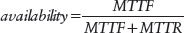

Availability and Reliability are two concepts that are easy to get confused. Availability is concerned with what percentage of time the system can perform its function. Reliability is concerned with the probability that the system will perform failure-free for a specified period of time.

## Availability Examples

The 4ESS™ Switch from Alcatel-Lucent had an explicit requirement when it was designed in the 1970s of two hours of downtime every 40 years. This equates to an unavailability of three minutes per year, which is slightly better than five 9s. The 5ESS® Switch from Alcatel-Lucent has achieved six 9’s of availability for a number of years.

# *Dependability*

*Dependability* is a measure of a system’s trustworthiness to be relied upon to perform the desired function. The attributes of dependability are reliability, availability, safety and security. *Safety* refers to the non-occurrence of catastrophic failures, whose consequences are much greater than the potential benefit. *Security* refers to the unauthorized access or unauthorized handling of information. Since dependability includes both reliability and availability, the correctness of the result is important. \[Lap91\]

# *Hardware Reliability*

Unlike software, hardware faults can be analyzed statistically based upon behavior and occurrence and also the physics of materials. The reliability of hardware has been studied for a long time, and covered in great depth. Hardware reliability includes the study of the physics and the materials, as well as the way things wear out. There is an array of technical conferences and journals that address this topic, such as the International Reliability Physics Symposium and the Electronic Components Technology Conference and IEEE journals *Device and Materials Reliability, Advanced Packaging and Solid State Circuits*.

# *Reliability Engineering and Analysis*

Software Reliability Engineering is the practice of monitoring and managing the reliability of a system. By collecting fault, error, and failure statistics during development, testing, and field operation, monitoring and managing the parameters of reliability and availability is possible. The *Handbook of Software Reliability Engineering* \[Lyu96\] contains a number of articles on topics related to Software Reliability Engineering.

A widely used technique is Reliability Growth Modeling, which graphs the cumulative number of faults corrected versus time. Prediction methods calculate the cumulative number of faults expected, which enables comparison with the measured results. This, in turn, enables the determination of the number of faults remaining in the system.

Markov modeling of systems (including software components) is another technique useful for predicting the reliability of a system. These models enable analysis of redundancy techniques and prediction of MTTF.

Markov models are constructed by defining the possible system states. Transitions between the states are defined and are assigned a probability factor. The probability indicates the likelihood that the transition will occur. An important aspect of the model is that the probability of a state transition depends only on the current state; history is not considered. <a href="#c01.htm#fig1.3" id="c01.htm#fig1.3a">Figure 3</a> shows a simple Markov model for a duplex system in which either system may fail with probability λ and be restored to service with probability µ and a coverage factor c. The failure rate, (λ), is the inverse of the MTTF, and the repair rate (µ) is the inverse of MTTR.

**[Figure 3](#c01.htm#fig1.3a)** Simple duplex system Markov model

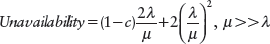

# *Performance*

Performance and reliability are two closely related concepts. Is the system’s reliability a performance requirement, or is the performance of a system a reliability requirement? An example of a performance requirement is that the application performs failure-free for three days. An example of a requirement for reliability is that the system supports 300 000 transactions per hour with a graceful degradation above this level of traffic, see <a href="#c01.htm#fig1.4" id="c01.htm#fig1.4a">Figure 4</a>. If a working system does not meet these requirements it has failed.

**[Figure 4](#c01.htm#fig1.4a)** Performance or reliability requirements?

The last requirement mentioned, that the system support 300 000 transactions per hour with a graceful degradation above this level, is an example of a requirement to deal with the situation that the workload exceeds the design requirements. For example, how will the system behave if the workload is more than the 300 000 transactions per hour for which it was designed, for instance 500 000 transactions per hour? The system’s architects and designers must be prepared for these situations as well.

Failures of either of these example requirements are performance failures. The failures can be complete, meaning that the system has totally failed, and is therefore totally unavailable. Performance failures can also be partial. The system might not gracefully degrade when the workload is greater than 300 000 transactions per hour. Alternatively, the system might not be fully available for service because it is working to recover from a failure. When the fault tolerance elements are working to detect and process errors and failures, the system may not be operating at the desired level of performance.

Clear performance requirements must be specified. The requirements must state how the system is to behave when too many requests for service are received. When the arriving requests for service exceed the amount that the system can handle it is said to be *overloaded* or *in overload*.

Some example failures related to system performance are these:

 Too many requests for service arriving at the system can lead to failures when the system does not handle the requests in a way that conforms to the specification. For example, the overloaded system might stop working, or become saturated with reduced throughput, or might not return to acceptable levels after the load returns to normal levels. See the three examples in <a href="#c01.htm#fig1.5" id="c01.htm#fig1.5a">Figure 5</a>.

**[Figure 5](#c01.htm#fig1.5a)** Possible system behaviors

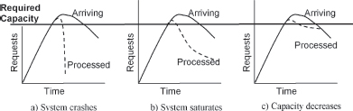

 The system might not be able to handle the expected volume of service requests, which is clearly a failure to achieve the specifications, <a href="#c01.htm#fig1.6" id="c01.htm#fig1.6a">Figure 6</a>.

**[Figure 6](#c01.htm#fig1.6a)** Failing to meet requirements

The capacity of a system represents a tradeoff between the system’s cost and its dependability under load. In a study of the US public switched telephone network, although overload, or performance errors, accounted for only six per cent of the outages, they comprised nearly fifty per cent of the lost customer access to the network \[Kuh 97\].

Since failures are the result of faults, a well designed fault tolerant system will be able to both process the required level of requests and gracefully handle excess workload. We can think of the fault as either the system not including the techniques required to handle the arriving workload or the excess number of arriving requests. The former is avoided by clear specifications of desired behavior and designing and building to meet those specifications. The fault of an excess number of arriving requests manifests itself as an error that must be handled by the system. Techniques to gracefully handle these situations are found in Chapter 7, Error Mitigation Patterns. Some example situations from the telephone network that can cause extreme load to be offered to the system include: mass call-ins, such as for concert tickets or voting on shows such as American Idol. The arriving load can also easily exceed the design specifications during periods of natural disasters when people are calling to check on friends and family in the affected areas.

Long experience in the telephone network has shown the characteristic curve of system response seen in <a href="#c01.htm#fig1.7" id="c01.htm#fig1.7a">Figure 7</a>. As the offered load increases, the system performance follows it to a point beyond which the system runs into internal congestion issues and can no longer handle the offered load. The total handled load begins to fall at this point. The internal delays arise primarily from the time spent finding idle resources, queuing and dequeuing requests. A fault tolerant system should be able to ride through this workload saturation without failing. As the workload decreases the system should follow its same performance curve and continue to process the workload, without any periods of unavailability.

**[Figure 7](#c01.htm#fig1.7a)** Idealized versus measured load

# CHAPTER 2

# Fault Tolerant Mindset

The previous chapter defined the basic vocabulary and the four phases of fault tolerance. This chapter will look at techniques to design for fault tolerance and enhanced reliability and availability.

# *Fault Tolerant Mindset*

What can go wrong in any given situation? That is a key question to anyone trying to develop fault tolerant software. Thinking to ask the question and define the solution is called having a *Fault Tolerant Mindset*. In almost any situation something can go wrong. A fault tolerant program is prepared for these errors. Asking what-if questions and planning during design for the errors that *might* happen during execution are the hallmarks of the Fault Tolerant Mindset. What if the stack pointer becomes negative? What if the wrong subclass is instantiated? What if the message arrives out of order?

Applying a Fault Tolerant Mindset to all stages of software development is beneficial. This includes both during requirements definition and test development as well as the traditional phases of software creation (architecture, design, coding).

# *Design Tradeoffs*

‘Every problem in computer science boils down to tradeoffs’ – Professor L. J. Henschen.

Mean Time To Failure (MTTF) and Mean Time to Repair (MTTR) determine the reliability and availability of a system. These two parameters can be traded off against each other. In some contexts, MTTR is the more important attribute, especially if the system is striving for high availability. Examples include telecommunications systems.

In other cases the repair time, MTTR, can be long but the MTTF must also be very long. An example is the Space Shuttle, which must perform without failure for the mission duration but once it is on the ground the repair can take more than an instant.

Other systems, such as an ATM banking system, must be failure-free but also highly available. This requires a thorough analysis during the design of the hardware and software components to ensure both high MTTF and low MTTR.

# *Quality v. Fault Tolerance*

A common misconception is that good quality processes guarantee fault tolerance. This is not necessarily the case. The two ideas are related, but they are distinct from each other.

Fault tolerance is the ability of the system to execute properly even though there are faults present. Fault tolerance happens at execution time. Saying that a system is fault tolerant says that it was designed in such a way that the system can still behave correctly and not have a failure, even if errors occur during the execution of the system. It also says that a failure will do limited harm

Quality, on the other hand, refers to how fault-free the system is. Quality techniques address ‘how’ the software/system is created. Were code inspections done? Was it fully tested?

A high quality system will have fewer faults than a lower quality system, which in turn results in fewer errors occurring during execution in the higher quality system and hence fewer failures. Reduction in the number of faults present in the system doesn’t imply that the results of the faults are less severe. The system must take steps to reduce the impact of the errors and failures. These steps provide the system with the ability to tolerate the effects of errors.

Quality is aimed at preventing faults from entering the system. Reducing the number of faults per line of code (or other unit of measuring a program) is the goal because that will reduce the number of faults that can cause errors. Fault Prevention techniques aim to prevent the addition of faults to the system. Fault Prevention is sometimes considered one of the phases of fault tolerance.

# *Keep It Simple*

A well known principle of fault tolerant design is that of ‘KIS’, which means ‘Keep It Simple’. Complexity in the system makes it more difficult to ensure correct operation through the design and test processes. Additional complexity requires writing additional software, which for a given density of faults means that there will be more faults present.

In many cases fault tolerant software is ‘good enough’ because to provide the thorough solution would mean adding too much extra code with too much risk of additional faults.

One common goal of the Keep It Simple principle is to reduce the number of lines of code dedicated to a task. Fewer lines of code mean fewer latent faults. Instead of designing an elaborate mechanism worthy of a graduate research project, build the simple mechanism that will be easier to maintain, easier to debug, and less likely to contain hidden faults.

An important aspect of Keep It Simple is to build the right system. Build the system that the specifications call for and don’t add extra features or bells and whistles. The extra code will contain unnecessary faults.

# *Incremental Additions of Reliability*

Many projects add fault tolerance incrementally. Through continual refinement many small enhancements will have large impacts in fault tolerance. A policy of studying every failure and implementing any design changes that are suggested by analysis is a certain way to improve the system’s fault tolerance.

For example the 4ESS™ Switch project had a policy to correct every fault that was identified. Every failure that was reported in the field was investigated and tracked back to a fault that could be identified and corrected in the next annual release of software, or sooner if necessary. This effort resulted in a highly reliable system that has been functioning in the US telephone network for over 30 years.

# *Defensive Programming Techniques*

After the basics of the programming language have been mastered, *defensive programming* techniques should be learned to produce fault tolerant code. Defensive programming builds on the Fault Tolerant Mindset to produce code that defends itself against the potential problems that arise. Programming defensively is done constantly, in every situation, by asking ‘what can go wrong here?’, ‘what errors can occur?’, ‘how might this fail?’, and ‘how can this code be protected from errors in other parts?’.

## Faults in Fault Tolerance Code

Even the software written to perform only fault tolerant related activities can have faults. Given any constant density of faults per line of code, when there are more lines of code there will be more faults. Adding complexity to error handling code increases the risk of adding faults to the software. Keep it Simple!

A related problem is that of accidentally adding faults to a system when trying to repair faults that have caused errors. This complicates the ultimate correction because now the system requires a ‘fix on fix’.

An example: a particular piece of software mysteriously stopped and restarted itself approximately every 24 days. After investigation the problem was determined to be that a counter that was incremented every millisecond became invalid (less than or equal to zero) after this time period and that error triggered the restart. The counter was stored in a 32 bit signed integer. A correction was made and a patch issued to resolve this problem. The system made it past the 24th day without incident. It restarted on the 49th day. The problem resurfaced. The solution to the previous problem was to make the counter a 32 bit unsigned integer which became invalid (zero) after twice as long. This newly patched software needed a patch. Another lesson from this example is to determine the root cause of the error and to fix it rather than fixing only the symptoms.

Faults in the special software added to ensure fault tolerance might prevent error recovery or mitigation from ever completing successfully.

## Memory Corruption

You should not assume that data storage is always correct. There are many potential errors, from stray writes to bad memory chips to transient errors like alpha particles. Information retrieved from memory should be checked before it is used. This applies whether the memory is long term storage such as a disk or database, or short term such as a message queue. This is especially important when using the information to determine program execution paths.

For example, a protocol standard defines a message type field in its messages with five valid message types defined in the standard. A three bit field is used to store the message type. A common way to process the message is to use a switch or case statement to branch to the appropriate section of the program. The software designers must ensure that the invalid message types are handled correctly, either by reporting them as an error, taking a default action or discarding the message. There are many reasons why the message might contain an invalid type field: message corruption from a communications line, the memory elements that made up the queue in which the messages was stored might have been faulty, a fault in the software that received and placed the message in the queue might have changed the messages type, etc.

Memory leakage is a common potential fault. A common scenario for this is a task acquiring a block of memory which is accessed by a pointer. Then the task terminates without releasing the block of memory that it was allocated. Since the only way to access that block of memory was via the pointer that was local to the task that has terminated, the only pointer to the memory is gone. The memory is unavailable for use. Even if the task that acquired the memory does not terminate holding the only copy of the pointer, subsequent faults might result in the pointer being deleted without the memory being freed for other usage.

Pointers are dangerous because they enable access directly to memory and memory structures without many safeguards. Through the use of pointers, regions of memory can be accessed in ways that they weren’t designed for. This allows great power in the hands of a skilled expert, but also presents the risk of security breaches or mistakes.

Another potential problem with pointers is pointers and the regions of memory to which they point are allocated and deallocated independently. Pointers can still be maintained and used, even after the region of memory has been deallocated and possibly reallocated to another task, enabling access to the new task’s memory.

Whenever using pointers, consider how they can be misused or accidentally create problems. Design the use of pointers in the safest possible way.

## Data Structure Design

Data structures should be designed so that they can be *audited*, or checked, for correctness. Audits should check both for correct values and to ensure that the data structure integrity is intact. For example, the check will ensure that impossible data is not stored in a linked list structure and that the list elements are correctly linked.

Data structure design should also support correction of the data. An example of a design for data correction is to include both forward and backward links in important linked lists. This provides redundant connection information and enables a check to ensure that both ends of a link know that they are in fact linked. It also provides enough information to allow the linkage to be reconstructed, if necessary.

## Design for Maintainability

Fault tolerant systems last a long time. Design them in a way that will make the life of the maintainer easier, because they might not be the initial designer. Use short modules, methods and functions. Make the code readable through the use of white space and comments. Keep the control flow simple because that will be easier to understand and to change if that becomes necessary.

## Coding Standards

Coding standards are another way of improving the quality of software as it is written. Many of the defensive coding techniques just mentioned are best implemented as coding standards. Projects adopt a number of principles that they then use to guide development and to judge the quality of the final code. A principle to remember when dealing with coding standards is this: people cannot remember a large number of things. If a project has 100 standards, it is unlikely that the project members can effectively remember and follow each of them. Having a small number that can be followed and verified will result in higher quality software. And higher quality software means that fewer errors will need to be handled at execution time to ensure fault tolerance.

## Redundancy

Redundancy is one of the cornerstones of fault tolerance. It will be discussed in the pattern REDUNDANCY (3) in Chapter 4. Redundancy refers to duplicate capabilities in a system which enables for more rapid error recovery and fault treatment. When added to a system to support fault tolerance, redundancy is meant to improve operational quality, not to improve the functionality of the system.

You can think about redundancy in both time and space dimensions. Time based redundancy can be the sequential execution of different versions of a program followed by a selection, or VOTING (21), of which result to use. Other time based redundancy includes recalculating parameters that don’t change frequently (or ever) to ensure that the parameter value in use is always correct. Space based redundancy is usually implemented by executing a program on different computers. The programs might be identical, or they might be different versions. The different computers are typically located within a cluster, and can be geographically dispersed also.

## Static Analysis Tools

Tools such as lint(1) are useful to remove many simple faults during development. Static analysis of program and data structures can detect many problems that would be difficult to detect during development.

## N-Version Programming

With N-Version Programming, NVP, independent development teams use the same specification to generate multiple implementations. During development the design teams are kept separate and do not share their designs, nor do they discuss the specification’s meaning with each other. The design teams should use different algorithms and different programming languages to produce multiple versions that all contain different faults.

NVP employs redundancy at all levels from design/development to execution. NVP enables parallel execution of computational blocks. A technique discussed in Chapter 4, RECOVERY BLOCKS (4), provides for sequential computation of computational blocks. Serial execution of this parallelism is possible on a uniprocessor as long as there is separation between versions.

The fundamental principle of NVP is that there are multiple implementations done by different development teams. The same developer cannot make multiple implementations with multiple understandings of the same specification. The assumption is that when a latent fault activates in one version then the other versions of the system do not contain the same fault. Research by Knight and Leveson \[KL86\]\[KL90\] has shown that the assumption of independence between the faults produced by the different design teams does not hold. Research into NVP continues for example in work by Cai, Lyu and Vouk \[CLV05\].

Because of the need for multiple design teams, NVP is not something that an individual or small team can decide on their own to undertake. For this reason, this book does not discuss NVP.

## Redundant Disks \[PGK88\]\[MS00\]

RAID, or ‘redundant array of inexpensive disks’, is a technology for grouping disks together to make a complex that provides redundancy and hence fault tolerance that is unavailable on a single disk. There are five levels of RAID that increase the level of disk redundancy, RAID-1 through RAID-5. An additional level, RAID-0, is an alternate method of writing data to a disk, which does not increase redundancy.

RAID works by combining groups of disk drives into a single element. The data is spread over the disks in one of several ways. Disk striping, used by RAID-0, stores consecutive chunks of data spread over a number of disks. This enables parallelism in reading and writing and hence faster access. Disk striping alone does not increase reliability, but it increases performance.

Disk mirroring is used by RAID-1. The same data is written to multiple disks simultaneously. It is synchronized between the disks, so that if any of the disks fail there are redundant, identical copies of the data. This increases the reliability of the data with only a small performance increase.

RAID-2 through RAID-5 all use some form of Hamming or parity encoding to ensure that the stored data can be reconstructed if a disk fails. The differences between these RAID levels is determined by where the data and parity encoding is stored and whether it is striped or mirrored. <a href="#c02.htm#tab2.1" id="c02.htm#tab2.1a">Table 2.1</a> shows how these levels are implemented.

[**Table 2.1**](#c02.htm#tab2.1a) RAID levels

<table class="bodytable">
<colgroup>
<col style="width: 33%" />
<col style="width: 33%" />
<col style="width: 33%" />
</colgroup>
<tbody>
<tr class="odd" data-valign="top">
<td class="bodycell" style="border-bottom: 1px solid black; border-top: 1px solid black; background-color: black; color: white"><strong>RAID LEVEL</strong></td>
<td class="bodycell" style="border-bottom: 1px solid black; border-top: 1px solid black; background-color: black; color: white"><strong>MECHANISM</strong></td>
<td class="bodycell" style="border-bottom: 1px solid black; border-top: 1px solid black; background-color: black; color: white"><strong>REDUNDANCY EFFECT</strong></td>
</tr>
<tr class="even" data-valign="top">
<td class="bodycell" style="border-bottom: 1px solid black; width: 20%">RAID-0</td>
<td class="bodycell" style="border-bottom: 1px solid black">Disk striping: data is spread over multiple disks</td>
<td class="bodycell" style="border-bottom: 1px solid black">No redundancy improvement, primarily a performance enhancement</td>
</tr>
<tr class="odd" data-valign="top">
<td class="bodycell" style="border-bottom: 1px solid black">RAID-1</td>
<td class="bodycell" style="border-bottom: 1px solid black">Disk Mirroring. The same data is kept synchronized on a second disk</td>
<td class="bodycell" style="border-bottom: 1px solid black">Slight performance increase because one disk can be writing while the other is reading. 
Second copy available immediately if a disk fails</td>
</tr>
<tr class="even" data-valign="top">
<td class="bodycell" style="border-bottom: 1px solid black">RAID-2</td>
<td class="bodycell" style="border-bottom: 1px solid black">Hamming Encoding. Encode data on the disk with an error correcting code</td>
<td class="bodycell" style="border-bottom: 1px solid black">Data on a single disk is correctable should an error be detected</td>
</tr>
<tr class="odd" data-valign="top">
<td class="bodycell" style="border-bottom: 1px solid black">RAID-3</td>
<td class="bodycell" style="border-bottom: 1px solid black">Virtual Disk Blocks, data stored striped across disks with a separate disk for parity information</td>
<td class="bodycell" style="border-bottom: 1px solid black">Data can be reconstructed based on parity</td>
</tr>
<tr class="even" data-valign="top">
<td class="bodycell" style="border-bottom: 1px solid black">RAID-4</td>
<td class="bodycell" style="border-bottom: 1px solid black">Dedicated Parity Disk. Parity for all data is stored on a separate disk</td>
<td class="bodycell" style="border-bottom: 1px solid black">Data can be reconstructed based on parity for data</td>
</tr>
<tr class="odd" data-valign="top">
<td class="bodycell" style="border-bottom: 1px solid black">RAID-5</td>
<td class="bodycell" style="border-bottom: 1px solid black">Striped Parity Disk. Parity is stored striped across all the disks</td>
<td class="bodycell" style="border-bottom: 1px solid black">Data can be reconstructed based on parity information</td>
</tr>
</tbody>
</table>

RAID technology is common and is included in many commercial products today. For more information about RAID, refer to product literature or Marcus and Stern \[MS00\].

# *The Role of Verification*

Testing and verification are essential to the creation of fault tolerant computing systems because they ensure that fault prevention and quality efforts are successful. Testing and verification also provide the data needed by a project’s software reliability engineers to compute the expected reliability of a system.

A useful kind of testing for fault tolerant systems is operational profile testing. An operational profile describes the usage of the system in quantitative terms and the most typical scenarios that the system will process. This information helps define the most appropriate tests to be run, and how to focus testing efforts. Operational profiles are the scenarios that are used in design, development, and test. To test the reliability and performance of the system the operational profile adds quantitative information to the descriptions of typical scenarios. For more information on operational profiles, refer to Musa et al. \[MFI+96\]

*The Handbook of Software Reliability Engineering* \[Lyu96\] contains more detailed information about testing and verification for reliability.

# *Fault Insertion Testing*

A technique that is used during the testing and verification phase of a project is fault insertion testing. Testers insert known faults into the system and the system’s behavior is monitored. This testing serves the dual purpose of identifying faults in the system’s error handling processes and of providing data for the computation of coverage factors.

Fault insertion testing is the only way that a system’s coverage factor can be determined. Known faults are introduced into the system, which is then observed to see if the system was able to handle the faults automatically. The coverage is computed as the percentage of cases in which recovery was successful.

Software fault insertion testing is done by providing erroneous inputs to the system. One way is to alter the normal input to determine the system’s behavior to incorrect values. This is commonly called boundary testing. The next level beyond this is to place ‘hooks’ into the software, or use a debugging tool, to enable internal values and state to be altered.

# *Fault Tolerant Design Methodology*

This chapter has discussed a number of aspects of the Fault Tolerant Mindset and has offered some guidelines for creating fault tolerant systems. The following six-step methodology is useful to build upon the Fault Tolerant Mindset and produce a highly available system.

**1.** The first step is to assess the things that can go wrong with the system. What can go wrong? What are the failures? The technique of *fault trees* can be useful at this stage. \[Dug95\]

**2.** After the risks have been identified, strategies must be defined to mitigate the risks. For each of the potential failures that were identified, how could they be identified and detected before becoming an actual failure? What things could be done in the system to prevent the failures from occurring, and the faults from activating? The project specific pattern language that will be used during design is identified in step 2.

**3.** Create a mental model of your system identifying the primary system dividing points and modes of redundancy.

**4.** At this point the architectural and major design decisions can be made. These are the ones that influence the whole system. Chapter 4 contains patterns for these high level decisions.

**5.** Design in the capabilities for the system to implement the risk mitigation strategies identified in step 2. There are a wide variety of techniques that are presented in Chapters 5 through 8, organized by the four phases of fault tolerance.

**6.** Almost all systems, no matter how fault tolerant they are, require some provisions that enable them to be managed and administered by people. Some of these provisions are done inside the design and some aspects relate to the user’s environment and your assumptions about that environment. Designing these human computer interactions and modes of management are important and must be done sensibly to ensure that failures won’t be caused by the people who are trying to administer the system. The techniques for this are not covered in this work. For more information you can look at *Designing Interfaces* by Tidwell \[Tid05\] or ‘An Input and Output Pattern Language’ \[HS00\].

This methodology is adapted from one in *Secure Coding*, Graff and van Wyk \[GvW03\]. It has been put in terms of fault tolerance and the Fault Tolerant Mindset.

This methodology will be used in an example problem, to design a fault tolerant Presence Server in the Conclusion.

The benefit of this methodology is that it will get you thinking about what can go wrong with the system. The Fault Tolerant Mindset begins in step 1 where you identify the failures and the risks factors that can cause them. Step 5 comes back to the risks and failures to see if mitigation techniques have been added to the design to cover the risks. Step 2 gives you a chance to think about the risks and the patterns and other techniques that will be useful to mitigate the risks. The pattern language for your project is created in this step. Steps 3 and 4 are where the fault tolerant design starts to take shape. Any elements of redundancy present in the system that can be leveraged to mitigate risks are studied and enhanced in step 3. Step 4 continues the design of the error detection and error processing capabilities of the system. People will interact with the system being designed both as users and as operating personnel. Step 6 considers how the human computer interface can be made more robust and more error-free.

# CHAPTER 3

# Introduction to the Patterns

This chapter builds on the definitions of Chapter 1 and the Fault Tolerant Mindset of Chapter 2 to provide an introduction to the patterns. This includes information about the context that is assumed by, and is shared by, the patterns found in the later chapters.

Four phases of fault tolerance describe the execution time lifecycle of a fault: ***error detection, error recovery, error mitigation*** and ***fault treatment***. These are shown in <a href="#c03.htm#fig3.8" id="c03.htm#fig3.8a">Figure 8</a>. To be fault tolerant, the first thing that must happen when a fault activates and an error occurs is error detection. This can happen through a routine means such as an audit (checksum) check, or through special components that are designed to detect when an error has happened.

**[Figure 8](#c03.htm#fig3.8a)** Four phases of fault tolerance

Once detected the error must be processed, which is the focus of the next two phases. These phases are executed in real time and will affect the unavailability of the system. Error recovery works to substitute an error-free system state for the erroneous system state that was detected.

In some cases the error can be removed, or mitigated, without transitioning to a different system state. For example when an erroneous data value can be corrected and processing can continue, as opposed to returning the system to the state from which it could attempt to recompute the data value correctly.

Fault treatment is done last, and is the step in which the fault is removed from the system through software update or patching mechanisms. \[Lap91, pp 23–25\] Restoration of normal operation usually resumes before fault treatment begins.

Chapters 5 through 8 focus on the four phases of fault tolerance. Chapter 5 addresses detection techniques. Chapters 6 and 7 cover error processing: Chapter 6 discusses error recovery techniques. Error mitigation is covered in Chapter 7 and Chapter 8 discusses fault treatment techniques. Chapter 5 also contains error processing patterns that provide a foundation for those in Chapters 6 and 7. Chapter 4 focuses on architectural attributes of the system, those things that cut across the entire system.

The patterns that follow discuss fault tolerance both to protect data from the effects of faults and to protect execution flows from faults. The choice of which technique is appropriate for any given design problem is based on the context of the problem and the system’s specifications.

# *Shared Context for These Patterns*

The shared context for these patterns includes the following attributes. Most of the patterns focus narrowly on the fault tolerance issue so that they are small enough and discrete enough that an individual developer or a small team can use them.

## Real-Time

The patterns apply to both soft and hard real-time systems. Soft real-time refers to systems that do not have functions that absolutely must occur at certain times or with specified frequency. Soft real-time systems have deadlines, but failure to satisfy a system deadline does not result in a catastrophic failure. The limits of acceptable variation due to system workload are described in the system’s requirements. An example of a soft real-time system is a web server. Responses are desired very quickly, but if a request should take longer than specified it won’t result in a system failure. On the other hand in a hard real-time system, such as an aircraft flight control system, there can be catastrophic consequences if a deadline is missed. Late results can have just as catastrophic an impact as a totally missed deadline. Hard real-time systems have much more stringent constraints that soft real-time systems. The fault tolerance techniques that should be employed in hard real-time systems are a superset of the ones in this book.

## High Reliability

The system will have stringent availability and correctness requirements.

### *High Availability*

The systems should be available for service as much as possible. The system’s requirements will state the expectations of the customer for what percentage of the time the system will be available.

### *Failure Rate Requirements*

The system has requirements for acceptable failure rates, such as ‘only 1 in 100 000 transactions may be dropped or otherwise mishandled’. These requirements define the needed accuracy of the results and when taken together with the unavailability requirements define the dependability requirements of the system. In some cases the requirements will be very stringent to avoid catastrophic failures, for example the failure of the navigational control system in an aircraft is a serious matter that must be avoided. In some cases, the requirements for accuracy will not be as stringent.

## State or Stateless

The *state* of the system is the combination of local variables, execution location (i.e. the program counter), and workload status that describes what the system is doing at any specific instance. A system’s state information may be stored internally, in memory or externally, in a file system or database. Systems that have only small amounts of state information have different needs for recovery techniques than do systems that keep large amounts of state information.

Web servers provide an example of stateless systems. Requests arrive at the server, are processed and then they are no longer part of the system. An individual operating system command that starts and completes in a short time is another example of a stateless command.

The public switched telephone network provides an example of a stateful system, one with a large amount of state information. Call requests arrive over time, require information to be exchanged with other systems, and some state must be preserved for the duration of the telephone call. Systems with operations that take considerable time are usually stateful. A computer’s operating system is an example of a stateful system because it manages information on behalf of its applications. When a stateful system loses state it loses its ability to continue its processing.

There are patterns in this book that address the needs of both stateless or stateful systems. Some patterns, such as CHECKPOINT (37) are more appropriate to systems with state information. Other patterns such as FRESH WORK BEFORE STALE (55) are well suited to systems with only a little state information. Other patterns apply in either case.

## External Observers

Fault tolerant systems have observers and monitors, either operating personnel or other computer systems that watch the systems for errors and failures. Information about all detected errors and failures and any actions taken to compensate for them is a basic requirement on the system. Sometimes DECORATORS \[GHJ+95\] and FACADES \[GHJ+95\] are used to wrap entities that do not and cannot be made to report. Some system’s observers are interested in real-time data, for example spacecraft launch telemetry. Some system’s observers are only interested in obtaining reports periodically, such as when an automobile’s control computer is checked at the repair shop.

## Integrated Fault Tolerance

The system capabilities discussed in these patterns sit on top of the application-required functionality and are orthogonal in many ways to the primary functioning of the system. For example, the parts that control recovery from errors could be used for many different applications, and similarly the application could work with many recovery processes and methods.

Talking about the fault tolerance concepts as though they are separate parts of the system simplifies the discussion, but in practice they are integrated with the application. Some programming paradigms, such as Aspect Oriented Programming, recognize the fact that the fault tolerance capabilities are orthogonal to the main application functionality. These support adding fault tolerant capabilities to the system in the form of cross-cutting aspects. In traditional programming paradigms the fault tolerance activities are merged with other capabilities. The patterns in this book do not presuppose or require either of these paradigms.

## Fault Tolerance is Not Free

Achieving fault tolerance and maintaining a state of readiness to handle errors and failures when they occur is not free. You should expect to be using more development resources than you would use for a non-fault tolerant project. At execution time, some resources will be dedicated to keeping the system fault tolerant. In some systems, processor time will be used to monitor the system. In other situations, extra memory will be required to store duplicate copies of data. The system’s requirements and operational profiles will help the system’s engineers to determine what extra resources are required.

## Long Lived Systems

Systems that are designed and built to be fault tolerant have a longer life than other systems. For one reason, they don’t fail in ways that prompt their replacement. Another reason is that they are costlier to build. This extra expense causes their owners to want to protect their investment by keeping the system for a long time.

# *Terminology*

You are building a *system* that consists of hardware and software *components*. Implementation of these components might use *modules*, or some other mechanism, such as *classes.* The system is being built to provide some *application* functionality. Some functions not directly related to the application functionality, for example fault tolerance, will also be present in the system.

In addition to using the application functionality, people interact with the system by executing *procedures*. Procedures are sequences of human-computer interaction steps.

Within a software component, there are *tasks* that are executing on a *unit* of some kind. The unit might refer to hardware or software entities, or it might mean a small logical corner of the system. The term ‘task’ is used here to denote an element of computation that could be the single program in a microcontroller, or a process or a thread or any other way of grouping execution time into specific application functionality.

When the software component and all of its tasks are executing the application that the system was designed to perform, and there are no errors changing the execution and no special fault tolerance code is executing, the component is said to be engaged in its *normal* processing.

The correctness of *computational results* is examined to determine if errors are present. These results might be either the numerical results of a computation or the side effects of such a computation or even the results of some action triggered by the system.

The system you are building is in a community of some kind with other elements that are its peers. The community might be a large scale *network* such as the internet, where the individual systems are widely distributed geographically and may not be homogeneous. At the other end the system that employs these techniques might be different processor cores in the same silicon package.

# CHAPTER 4

# Architectural Patterns

This chapter and the patterns it contains reflect architectural lessons from highly available systems of all sizes. The overall system architecture greatly influences how tolerant of faults the system will be. This chapter’s techniques contain architectural considerations that cut across all parts of the system. They do not fit neatly into the categories of error detection, error recovery, error mitigation, and fault treatment. They do not focus solely on a particular class or module; they influence the design of the whole system.

These patterns are also among the first patterns applied to a new design project that needs to support fault tolerant operation. This is another reason for placing them here, in a separate chapter, rather that sorting them into the chapters of specific techniques.

For example, the pattern MINIMIZE HUMAN INTERVENTION (5), which is found in this chapter, acknowledges that in order for a system to be highly available it must recover as quickly as possible. People are slow when compared with a computer. Asking a person to intervene in an error situation slows down recovery, which in turn reduces availability. A highly available system should not need to ask for human intervention. To reduce recovery times, the design of every part of the system must include the capabilities for the system to resolve the problems by itself. This need for a global usage of the principles results in the pattern being architectural. Every part of the system must support and implement the architecture established by this pattern, or its benefits will be blocked. For example, wherever one module fails to use MINIMIZE HUMAN INTERVENTION and pauses to wait for operating control the system availability is greatly reduced.

<a href="#c04.htm#tab4.1" id="c04.htm#tab4.1a">Table 4.1</a> lists all of the patterns in this chapter. Their order is that of the language shown in <a href="#c04.htm#fig4.9" id="c04.htm#fig4.9a">Figure 9</a> and also the order that the patterns appear within this chapter.

[**Table 4.1**](#c04.htm#tab4.1a) Architectural patterns

---

**PATTERN**                        **PATTERN INTENT**
UNITS OF MITIGATION (1)            Decide what the units of fault tolerance will be during the architecture phase.
CORRECTING AUDITS (2)              Design data to be checked and check data for errors. If errors are found, correct both the erroneous data and look for errors in related data.
REDUNDANCY (3)                     Maximize availability by having alternate hardware or software that can perform the same function.
RECOVERY BLOCKS (4)                Increase the probability of successfully meeting acceptance tests by providing sequential execution of alternate computations.
MINIMIZE HUMAN INTERVENTION (5)    People make mistakes and are slow; to minimize downtime the system should take care of itself, without human intervention.
MAXIMIZE HUMAN PARTICIPATION (6)   Provide the capability for knowledgeable people to guide the system’s error processing.
MAINTENANCE INTERFACE (7)          Establish an interface to the system separate from the application’s interface to facilitate maintenance interactions.
SOMEONE IN CHARGE (8)              Every fault tolerance action undertaken by the system should have a clearly identified entity controlling and monitoring the action.
ESCALATION (9)                     When error processing steps are not producing the desired effect on the system, try a more all-encompassing means.
FAULT OBSERVER (10)                Coordinate reporting to all observers that a fault is present, reported, and recovery actions escalated.
SOFTWARE UPDATE (11)               Design the system to allow the installation of new versions of the software.

---

**[Figure 9](#c04.htm#fig4.9a)** Architectural pattern language map

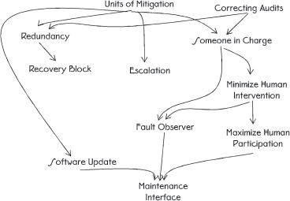

[Figure 9](#c04.htm#fig4.9) contains one possible pattern language map from the patterns in Chapter 4.

The UNITS OF MITIGATION (1) are the building blocks of a fault tolerant system. They define the elements that may be repaired and restarted as needed to process errors. The UNITS OF MITIGATION guide the decisions about how REDUNDANCY (3) will be implemented in the system. The units of mitigation and redundant units are an intersecting set of the parts of the ultimate system design. These should be defined first to provide guidance for the remainder of the system’s design. Few techniques for creating redundant software exist; RECOVERY BLOCKS (4) discusses one practical method.

CORRECTING AUDITS (2) are checks of all the system’s important data to ensure both the data’s correct value and that the structure of the data is not corrupted. Data must be well designed and must be designed to be checked, or *audited*. When erroneous data is detected it should be corrected immediately, if possible.

To ensure that the system is always doing useful work, either application or fault tolerance related, every error processing action should have SOMEONE IN CHARGE (8). In some cases this will be the operating personnel through MAXIMIZE HUMAN PARTICIPATION (6).

Sometimes error processing can’t immediately correct the problem, due to poor isolation or other reasons. In these cases ESCALATION (9) guides the selection of possible alternative actions for the system.

The fault tolerance actions of the system should not rely on operating personnel to resolve problems because people can easily make matters worse, so the system should be designed to MINIMIZE HUMAN INTERVENTION (5). Experienced personnel, for example the system designers, can make valuable contributions, so the system should enable this through MAXIMIZE HUMAN PARTICIPATION (6). To ensure that operating personnel can always access the system when necessary, and to ensure that maintenance requests are not lost or discarded by the application, a separate MAINTENANCE INTERFACE (7) is used. This interface will provide a direct avenue to the maintenance functionality, not risking or relying on the maintenance requests to be separated properly from the application data stream.

Fault tolerant systems usually operate in an environment where there are other systems or personnel watching how the system is performing at any given time. The FAULT OBSERVER (10) interface provides that oversight capability into the system.

Most fault tolerant systems will require some update of software version to either correct faults or to introduce new functionality, and this is discussed in SOFTWARE UPDATE (11).

# 1. Units of Mitigation

… You are designing a fault tolerant system. You are using good programming methods and have set up the appropriate quality methodologies and project standards. You are at the early design stages where the system design is still malleable.

You know that there will be faults in the system. When they activate they cause errors and a fail-stop or fail-safe design makes some part (or all) of the system unavailable. The risk is that the failing part is the whole system. You want to reduce, or mitigate, this risk of a complete shutdown.

**How can you keep the whole system from being unavailable when an error occurs?**

In the simplest designs, there is one module that performs all of the work. When this monolith has an error, no work will be done. Choosing to consider the entire system as a whole limits the kinds of recoveries that are possible without the system being unavailable. Having only one module means that the entire system must stop to recover an error.

The amount of overhead increases as the size of the components decreases because bookkeeping needs increase. Overhead increases both statically, e.g. memory used, and dynamically, e.g. in terms of execution time. As the size of the units decreases more and more, other options to recover and mitigate errors become possible, because the system can now treat errors in one unit while the others continue operation. Some of the techniques possible include FAILOVER (36), retaining state via CHECKPOINTS (37), redirecting operations through ROLLBACK (32) or ROLL-FORWARD (33) and many others described later in this book.

Interfaces between the units of mitigation must be well defined and clear. It is along these interfaces that the mitigation actions take place to recover from errors or reduce the impact of errors. When there are more units in the system, there are more interfaces.

If there are smaller parts of a system that make well defined units, with clear interfaces, use these as the basic unit of mitigation. With finer granularity, it is more economical to replicate the units as described in REDUNDANCY (3). Load sharing is possible with multiple copies when they are not actively involved in error mitigation. The units of mitigation should contain atomic actions that do not rely heavily on communication with other units of mitigation to accomplish their task.

The dividing line between different parts of the system must be clearly discernable. And the boundary must be respected, dividing the system into discrete parts. The clear separation between parts of the system is important to keep errors contained, which is the primary reason for dividing the system at all.

No two design problems are identical. Therefore, there is no one right answer to the question about what the basic units should be. In some cases, the answer is building a monolithic structure. In other systems, the units of mitigation are quite small.

The architectural style in use, such as a three-tiered architecture, can provide units of mitigation that are similar from situation to situation. But even in that case you need to determine if there are other units present in the architecture.

The units of mitigation can be duplicated to provide for REDUNDANCY (3), which will allow multiple copies of the functionality to perform simultaneously. Adding additional redundant units helps with both performance enhancements by supporting load sharing, and with error processing. The system can redirect the workload to a different unit if one needs to be removed from service temporarily to support error processing.

This pattern describes a design level activity. The results of applying this pattern during design will be identifiable within the architecture of the system, even though they are not providing the structure of the application. The units of mitigation are run time entities because error handling is done during execution.

The architecture might show natural lines of cleavage, such as cluster architectures, terminal/protocol handlers, tasks dedicated to a certain processor or processor core, etc. The units of mitigation do not need to be symmetric, or of identical size. The units of mitigation that support the primary functionality (the application) can be larger than the units for the support functionality. This is because the failures in the support functions typically have less stringent availability requirements than the primary application.

Portions of the system that perform different functions, such as interfacing to users or handling a database, are good units of mitigation. When there are separate processors in a distributed system, these make good units of mitigation.

When there are groupings of similar functionalities, the entities that are grouped are good units of mitigation. For example threads in a threadpool make good units of mitigation. Another example is in a system that involves inherent redundancy or duplication, such as the example ‘objects for characters’ used in explaining the FLYWEIGHT pattern. \[GHJ+95\]

The units of mitigation should conform to the boundaries of memory spectrum or processor assignment. Units of mitigation should not share more than one processor unless there is shared memory, or more than one region of non-distributed memory. Error detection and processing techniques work best with clear boundaries of memory.

The division of the system into units of mitigation should also consider the recovery and mitigation techniques available to it. If the only change in process state is at the level of the whole system, then the whole system should be the unit of mitigation; in practice it will be. When recovery actions such as RESTART (31) can be done at a fine-grained level, pick the units of mitigation correspondingly small. For example, if restart of individual Java containers will be possible in an application server system, pick the containers as the units of mitigation. \[CBF+04\]

The units of mitigation should be able to conduct self checks to detect when they are not operating correctly. The units of mitigation should fail silently in a deterministic way. If the units are so small that any errors that occur cannot be recovered or mitigated, the unit is too small. For example, picking individual statements in a function or method is impractical because most languages will only be able to correct the results of the function or method, not the intermediate calculations. Both internal data and execution errors should be detected.

The units of mitigation must be barriers to errors. The boundaries and implementation of the units of mitigation must prevent errors from being communicated outside the boundary. The unit of mitigation must detect internal errors quickly. The only acceptable indication to other parts of the system should be the single indication that an error has occurred. It is desirable for units of mitigation to fail silently and to isolate failures from other parts of the system.

The units of mitigation must be recognizable elements of the system. Choosing to have only portions of the smallest nameable entity in the system as a basic unit of mitigation means that either the naming or the unit of mitigation selection was wrong. Error reports and actions will be addressed to the unit, so it must be nameable.

Therefore,

**Divide the system into parts that will contain both any errors and the error recovery. Choose the divisions that make sense for your system, <a href="#c04.htm#fig4.10" id="c04.htm#fig4.10a">Figure 10</a>. Design the rest of the system around these parts that represent the basic units of error mitigation.**

**[Figure 10](#c04.htm#fig4.10a)** Different UNITS OF MITIGATION

The actual resolution of this problem will vary with the situation and will result in analysis of the various tradeoffs/forces: Overhead and complexity, natural divisions in the architecture and architectural style basic concepts.

This pattern represents an essential step to identify the units of error detection and error processing.

Ignoring the divisions between units of mitigation will not produce an optimal solution to system availability. It leads to too much of the system being unavailable or of recovery attempts failing because the failure is slightly out of scope for the unit of mitigation.

Within UNITS OF MITIGATION the system should focus resources on error processing, in other words, perform a CONCENTRATED RECOVERY (29). This will reduce the unavailability time and make it more predictable.

The patterns REDUNDANCY (3), FAILOVER (36), WHAT TO SAVE (38) and REMOTE STORAGE (39) offer considerations that can help you decide what the UNITS OF MITIGATION should be.

This pattern describes hardware and software units and major parts. ERROR HANDLERS (30) and RECOVERY BLOCKS (4) describe recovery for software algorithms and smaller parts of the system.

Example: Consider a three-tiered architecture (User interface, functional process and data access layers). We are adding fault tolerance into it and want it to be able to seamlessly recover when it detects any faults or errors. The system should be able to mitigate the error quickly and efficiently through one of the mechanisms described later with minimal disruption to service, i.e. minimal downtime.

At first you think of making the whole system the unit of recovery. This is a common approach; one that many systems have historically taken. The problem with this approach is that when something fails the entire system needs to participate in the mitigation, making it unavailable.

After consideration, you think that there should be some smaller units of mitigation than the entire system. The next obvious solution is to make the basic unit be one of the tiers. There are already clean interfaces between the tiers, so that if one of the tiers needs to participate in mitigation the neighboring tiers already know how to communicate with it.

However, unless there are redundant tiers (which can exist in a large scale system) then any tier level error processing actually takes the whole system out of service. The effects of this can be reduced by queuing requests from the other tiers while waiting for the mitigation to complete. The still available tiers will still process requests and queue requests awaiting the recovery to end.

A common solution is to mitigate at the tier level with either redundant tiers or queues and other request buffering. It is based on the benefits that having multiples of the tier-level entities can provide, in addition to the mitigation of errors. Whenever a single tier contains a detected error the system can redistribute the workload around the unit with the error until it can be safely brought back to correct operation (mitigated). …

# 2. Correcting Audits

… Data errors can and do occur.

Data can be thought of as being static or dynamic. Static data doesn’t change very often during normal operations. Configuration data is static data that might change infrequently, for example only when a SOFTWARE UPDATE (11) is made. Applications also have data that doesn’t change, for example telephone area (region) codes change very infrequently.

Dynamic data changes frequently during normal execution. Per transaction memory, scratch memory, request-handling data structures are all examples. In a financial application system the currency exchange rate or the current prices for a stock are dynamic data. In a scientific application the intermediate results are dynamic data.

Data errors occur because something corrupted the data element. The corruption might come from low level hardware, such as memory chips, or they might be other application functions that store incorrect values into a data element. Random and transient events also occur, such as alpha rays emitted from integrated circuit packaging.

**Faulty data causes errors.**

Errors from faulty data easily propagate throughout the system. When the period of time between detection and recovery is long, there is a larger chance of another task using the erroneous data and making an erroneous (and possibly failing) decision with it.

In real-time and transaction oriented systems the dynamic data is always changing. The values that were installed during initialization or DATA RESET (41) will change for valid reasons. But sometimes they will be changed to erroneous values.

The context of the data must be considered. For example the number ‘1974’ is valid as a year, but not valid as an age. The context should be used to help define the allowable data checks.

Errors in data can cause several different types of errors. Future computations might be incorrect, for example if the currency exchange rate is incorrect then all conversions from one currency to another that use the erroneous rate will be incorrect. Execution can transfer incorrectly; consider an erroneous value used in a selection statement (like a C-language switch statement) can result in the wrong conditional code to be executed. Another error that is possible is that erroneous data can cause errors in other data that is unrelated, for example when a pointer is incorrect and starts overwriting a part of memory that is unrelated to the faulty pointer. A classic example of this last situation is writing into very low memory addresses because the pointer value was zero. Another category of error caused by bad data is that of resources that are orphaned because the data referencing them is no longer present.

Checking, or ‘auditing’, data for errors is accomplished by using other information that is known about the data to determine its correctness. Checks are done by using the structural properties of the data structures, or by using information known in advance about the data’s values. The first kind of checks looks to the structure of the data, for example that a linked list’s pointers are correct or that a queue or list has an allowable number of entries. Redundant information can be stored along with the data to report if the data is incorrect. CHECKSUMS (25) is an example of this detection method. Knowing at design time that only certain values of a piece of data are legal enables checking the data at execution time for correctness.

Some of the ways that data can be checked:

 **Check structural properties**: Check that linked lists are correctly linked, stack and queue pointers are within bounds, pointers and counters related to the data structures match the data structures (e.g. the number of items on a linked list is the actual number of items).

 **Known correlations**: The same or related data is stored in multiple locations, known conversion factors between data values (e.g. centigrade to Fahrenheit temperatures), cross linkages between different data structures, for example one linked list coupled to another linked list exists, software data meant to mimic hardware status is correct.

 **Sanity checks**: Values are within the range of expected values, CHECKSUMS (25) are correct.

 **Direct Comparison**: Duplicate copies of data are stored to serve as checks to each other. This technique is primarily useful for static data, although in some cases important dynamic control information should be saved in two different places as well.

COMPLETE PARAMETER CHECKING (14) discusses error detection when entering and leaving methods and functions. These checks provide a way to use the mechanisms above to detect errors in dynamic data close to where it became erroneous.

You must design the system’s data to be easily audited. Use two way linked lists because then linkages are redundant and enable easy checking. Use redundant locations in other parts of the system for data to enable easy checking. Use non-trivial values for static configuration values because then simple errors will be very obvious.

Many data errors can be corrected automatically. When they can be corrected automatically the time from detection to error-free operation is reduced, which enhances system availability.

Depending upon the nature of the detected data errors the correction mechanisms vary. If the linked list is incorrect the linkages can be rebuilt. If orphaned resources are found they can be released for other uses. If correlated data is inconsistent it can be made consistent. If values are out of a normally expected range perform a DATA RESET (41). The data fault might be correctable by either its CHECKSUM (25) or by an ERROR CORRECTING CODE (57). If it is not correctable the effects of the fault can be mitigated by using the MARKED DATA (56) technique. If it can’t be corrected, and can’t be mitigated, then an error recovery action will be necessary.

When a data error cannot be corrected automatically, other recovery steps should be taken. These can include unwinding the execution from an ERROR HANDLER (30) or restoring the erroneous data from a CHECKPOINT (37) and ROLLING BACK (32).

If the detection of the erroneous data was accomplished through a COMPLETE PARAMETER CHECK (14) or a ROUTINE AUDIT(24), or otherwise corrected by an ERROR HANDLER(30), then execution can resume at the point of detection. This emphasizes the need to put the detection mechanism as close to the point of first access as possible. Frequently some code re-execution will be required to undo the most recent action that involved the erroneous data. ROLLBACK (32) might be required to move the system to a state where this re-execution can occur. If it is impossible to return to that point then a RETURN TO REFERENCE POINT(34) should occur to return the system to a known state from which processing can continue.

Where there’s one data error there might be others. When a data error is detected a prudent step is to consider what other data might be erroneous. The detected error might be the result of a number of computations that should all be considered suspicious and checked for errors.

Automatic correction mechanisms must ensure that after correction the related data items are consistent. In the 4ESS™ Switch, each kind of data has an associated Audit Implicator Index (AII). The AII is used to link the audits together by pointing from the faulty data to other data that is somehow related. The specific audit components for the linked data can be executed to determine if the known faulty data has corrupted any other data. For example, a data error in the Auxiliary Call Register data structure implicates the Call Register data structure. AIIs are used to tell the auditing programs about relationships between different data structures that might not be easy to discern during execution time examination.

All the data that is important to the system’s operation should be checked. For each data structure in the system you should consider what would happen if it became corrupted and erroneous. During this analysis you will probably find some items, such as temporary variables, that don’t have enough significance to the system to cause them to be checked. You will also find some data, for example a list of busy and idle resources, that is extremely significant and must be kept correct at all times.

During design and test phases tests such as these audits might be used to ensure correct system operation. Leaving the tests in and handling the errors that they report as errors rather than diagnostic messages to the testers will increase system reliability.

In order to detect the fault that is causing the erroneous data to appear, the data error needs to be recorded and tracked. Repeated occurrences of events in the reports of data errors is useful to identify the fault. Any detection of data errors should be logged to enable for causal analysis. Notify the FAULT OBSERVER (10) to achieve this.

There are three tasks that should occur when data errors are detected: 1. correction, 2. logging, and 3. resume execution at the point of detection with the corrected data value.

This can be accomplished by three different tasks, or it can be accomplished by a part of the system designed to perform these three tasks as quickly as possible in support of CONCENTRATED RECOVERY (29).

Therefore,

**Detect and correct data errors as soon as possible, <a href="#c04.htm#fig4.11" id="c04.htm#fig4.11a">Figure 11</a>. Check related data for errors, correct and record the occurrence of the error.**

**[Figure 11](#c04.htm#fig4.11a)** Errors are corrected

The system can have more than one ‘audit’. The system should have a common auditing infrastructure that enables individual audits to be created for different tasks. The 4ESS™ Switch has a common framework into which more than 100 different audits connect. Some are related to each other and reuse common components, such as linked list linkage checking, and many have unique functionality.

The reliability of the system will be improved because the probability of faulty data causing errors is reduced.

Other parts of the system, such as COMPLETE PARAMETER CHECKING (14) sometimes detect data errors. In systems with many different kinds of data they should direct the error reports to CORRECTING AUDITS (2). These parts of the system responsible for data integrity will be able to perform data FAULT CORRELATION (12).

The latent data fault should be reported to the FAULT OBSERVER (10) so that patterns and trends can be identified and corrected. If the data errors are numerous, or have the potential to cause a serious failure, then SOMEONE IN CHARGE (8) can trigger the ESCALATION (9) of data correction efforts. ESCALATION describes an example of this mechanism. …

# 3. Redundancy

… You are designing a system that should tolerate faults and have the maximum possible uptime. The amount of downtime between an error occurring (even before a failure happens) and resuming normal operation should be as small as possible.

Multiple software and hardware components are combined to make up a system. The availability of all of these, software, hardware and systems, are important.

There are two main ways that errors are processed. In some cases they can be masked and mitigated without changing the system state. The other way involves error recovery to place the system in a failure-free state.

**How can we reduce the amount of time between error detection and the resumption of normal operation after error recovery?**

Availability refers to the percentage of time that the system is performing failure-free. See Chapter 1. During the period from when an error is detected until normal system processing is resumed after processing of the error the system is not performing its normal work. It is not available. Minimizing this time period increases availability.

Error processing cannot begin until the error is detected. Some aspects of detection are routine events and don’t count into unavailability. This includes the normal time to schedule an error detection check and to execute it in the error-free case. When the system detects an error it must focus on processing the error and that usually stops the normal execution.

Minimizing unavailability when the error is being mitigated requires that the mitigation steps, such as marking the data as erroneous (see MARKED DATA (56)) be done as quickly as possible. A way to speed up mitigation activities is to perform just enough work during the error processing time to mask the error and defer as much as possible until after the resumption of normal execution. Notification about the error to the interested parties by the FAULT OBSERVER (10) can be deferred until normal operations are resumed. Mitigation needs fast techniques to minimize unavailability.

Error recovery returns the system to a failure-free state. There are many techniques discussed in Chapter 6 that require large amounts of time to recover. For example CHECKPOINT (37) and ROLLBACK (32) require the time to copy large amounts of memory and then to reset system state to the point of rollback. In any recovery effort the effects of the error must be undone and the new error-free state instantiated. Minimizing these steps lead to minimizing unavailability.

Reduction in the time to complete either of these parts of recovery reduces the time spent processing the errors.

What if execution can be resumed before the bad effects of the error are undone? This would reduce the period of unavailability. Resuming execution in an element that is identical to the one with the error, but without the error achieves this. Having another way of accomplishing the same work, different software, different hardware or different systems is ‘redundancy’. What if the instantiation of the error-free state took almost no time? This reduces the period of unavailability. This can be accomplished by having a redundant unit, without the error, that can begin normal operations quickly.

Consider three types of redundancy: spatial, temporal, and informational. Spatial redundancy is present when the system has multiple copies (in different places) that are redundant, which provides alternatives that may be selected with minimal unavailability. Temporal redundancy refers to redundancy that occurs over time, which helps achieve correct results but lengthens the time of unavailability. When information is repeated it can be used to aid detection and correction, this is informational redundancy. \[ACM+00\]

It is easy to understand and visualize spatial redundancy in terms of hardware: multiple copies of the hardware platform. Redundancy doesn’t have to mean identical functionality. All that is required is that some other part of the system can perform the work of the failing part. This might be a duplicate, identical module, or it might be another component that has extra programming that enables it to also perform some computations when the primary component cannot function correctly.

Five general purpose computers are used in the Space Shuttle. One is used to perform non-critical computations and the remaining four are used for critical functions. A system of redundant communications buses is used to connect these four critical computers with the various sensors and actuators throughout the spacecraft. In normal, failure-free operation each of the four computers are performing the same function and sending instructions to the peripheral device. The devices that act on these instructions compare the results (i.e. VOTING (21)) from the four computers to detect if one of the computers (and the instructions it provided) is incorrect. The four computers can also watch each other by monitoring the other’s instructions sent to peripherals as well as self testing comparison functions. \[Skl76\]

Telephone switching systems such as the 4ESS™ Switch used two duplicated processors for their main computations. Processors that interface to the outside world use a different redundancy scheme.

You must be careful with software redundancy. Unless you have consciously done something to cause multiple instances of software to be diverse, or different, they will be identical. Diversity is a great asset in the avoidance of error propagation. Since software is deterministic, multiple instances of identical software will all fail when presented with the same stimuli, although the identical stimuli might never reoccur.

RECOVERY BLOCKS (4) \[AK76\] \[LA90\] provide a way to include temporal software redundancy. A program with RECOVERY BLOCKS consists of a primary block and secondary blocks. If the result of the primary block fails its acceptance test then the secondary blocks are executed in sequence until a result is obtained that passes the acceptance test. If no acceptable result is found then ERROR HANDLING (30) is triggered. N-Version Programming gives software a way of providing spatial redundancy.

Some avionics systems execute the same software on multiple processors with VOTING (21) to determine the correct value. In these systems a way of providing software redundancy is to provide for transition periods where some of the multiple processors are executing on the new versions of software, and other processors are still executing the prior version. This will prevent a new fault from causing an error in all of the processors simultaneously. After a time of trialing the new versions and observing that they are error-free, the processors executing the prior version of the software will be upgraded to the new version. \[Lop06\]

Informational redundancy is provided by having multiple versions of the same data available to the system. The multiple versions can be stored in different places on different types of storage, for example disk and flash memory. This enables ready access to alternate versions of the data that CORRECTING AUDITS (2) can use to quickly make a correction. Information can also be stored in several different representations. For example, if the distance between two points is needed it can be stored as both the distance and the location of the endpoints which can be used to recompute the distance quickly.

Redundancy as discussed here helps the system to be more available. Redundancy is sometimes introduced to improve performance. In this case there are multiple copies that are used in parallel, for example in a cluster of computers, or multiple instances of the same process. In either case a mechanism to distribute work between the copies is needed. In a redundancy-for-performance environment the availability enhancing effects are supplied by providing excess capacity. For example, availability is enhanced when a cluster of redundant systems provide an idle extra processor to assume the workload of a failing processor. Web servers are frequently combined in a cluster arrangement with a load balancer that distributes requests to the most idle server. Should one of the servers become unavailable, the other servers in the cluster will assume the failing server’s share of the work.

Redundancy is not free. There are the capital costs of extra resources such as memory or processing. There are also inherent risks and costs associated with maintaining the redundant elements.

Therefore,

**Provide redundant capabilities that support quick activation to enable error processing to continue in parallel with normal execution. See <a href="#c04.htm#fig4.12" id="c04.htm#fig4.12a">Figure 12</a>.**

**[Figure 12](#c04.htm#fig4.12a)** Redundancy

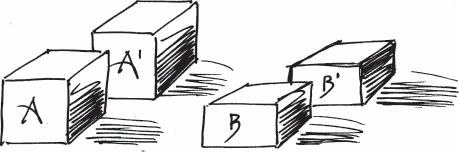

There are many ways to provide this redundancy. Spatial redundancy methods include Active-Active, Active-Passive, N+1 (generally N+M) redundancy, etc. Both Saridakis \[Sar02\] and Ahluwalia and Jain \[AJ06\] have described these different methods of providing redundancy as patterns. These have various tradeoffs in costs v. recovery time as can be seen in <a href="#c04.htm#fig4.13" id="c04.htm#fig4.13a">Figure 13</a>.

**[Figure 13](#c04.htm#fig4.13a)** Cost v. recovery time tradeoffs

Active-Active provides a totally redundant UNITS OF MITIGATION (1) for the critical functionality. At any given time, both of the elements are active and load sharing. However, either of the elements is capable of processing the entire load. Active-active provides the fastest recovery, but it also has a high cost because there is much more capability in the system than is needed for the ordinary workload. Active-Active implies a pairing between the two active units. In an Active-Standby situation, the standby is again paired with an Active element. But in Active-Standby the standby element is not performing useful work. This means that the same amount of resources is needed as in the Active-Active case but during periods of normal operation the standby is idle. It is merely ready to assume actions. There is a one to one relationship between the active element and the standby. Variants of both Active-Active and Active-Standby exist related to how often the active and redundant elements share state. The more often they share state the quicker the recovery, but also the more expensive in terms of execution overhead and reduced communications bandwidth.

In situations where a one to one relationship, such as described by the previous two methods, is too expensive, N+M Redundancy is a useful technique. In this configuration there are N active elements processing the workload of the system. There are also M redundant, standby elements in the system, ready to assume control when a failure occurs in any of the N. This requires that there be some way to redirect traffic from any of the N active units to one of the redundant sets. Frequently there are not dedicated pools of spare or standby units, instead any of the elements might at any given time be performing as one of the active elements or as one of the standby elements. Multiple and different redundancy schemes may be used simultaneously. For example multiple software versions may be executing on redundant hardware.

Redundancy comes to play when the error tolerance is exceeded. RIDING OVER TRANSIENTS (26) is a technique to determine if errors are permanent and exceed the tolerance limit. ESCALATION (9) guides the choices of alternate error processing techniques.

The system will use FAILOVER (36) to perform the transition between the formerly active element and the redundant part.

In any system of redundancy a concern is whether the redundant elements are themselves failure-free and ready for service. The redundant element might have a latent fault that will activate when they are asked to begin execution. In some cases ROUTINE EXERCISES (23) can be used to exercise the redundant units to give them time processing actual work so that any errors can be detected.

One use of Redundancy is as a way to quickly resume execution (ROLLBACK (32)) using saved state restored from a CHECKPOINT (37). REMOTE STORAGE (39) can help you decide whether REDUNDANCY should be used in conjunction with Checkpoints.

Redundancy is used to protect the system from the effects of different modes of failure. [Table 1.2](#c01.htm#tab1.2) in Chapter 1 shows that to recover from a fail-silent failure requires n+1 redundant elements. To recover from malicious failures requires 3n+1 redundant elements. A VOTING (21) mechanism is needed is needed to arbitrate the results from the redundant components. …

# 4. Recovery Blocks

… Latent faults exist in software. When the software with the fault is in the same state and it encounters the same input needed to activate the fault, it will always respond the same way: it will activate.

**How can we make sure that processing results in an error-free value, when executing the same code repeatedly will produce the same error?**

Alternate solutions need different implementations. At the system level, or large component level, N-Version Programming provides multiple implementations that satisfy the same specification requiring multiple independent development teams. At the scale of one development team they can produce multiple versions of individual modules or algorithms. A goal of this design team is to make the alternatives resistant to the same fault stimuli. The discussion will continue with these lower-level alternatives.

When there are multiple REDUNDANT (3) implementations the system can execute them simultaneously and pick the best answer using a combination of REDUNDANCY and VOTING (21). Another way of using multiple implementations is to execute them sequentially. Overhead is limited because alternative implementations only execute when the system detects errors. If the first alternative completes successfully, and the system is satisfied with the results, then the alternatives are not executed. Each of these alternatives is a ‘recovery block’.

A program with recovery blocks consists of a primary block and secondary blocks. If the result of the primary block fails its acceptance test then secondary blocks execute in sequence until the acceptance test passes. If no acceptable result is found then an ERROR HANDLER (30) is invoked. \[AK76\]\[LA90\] The acceptance test is specific to the application context of the recovery block. \[Tor00\]

The general structure of a program with recovery blocks appears in <a href="#c04.htm#fig4.14" id="c04.htm#fig4.14a">Figure 14</a>.

**[Figure 14](#c04.htm#fig4.14a)** Recovery Block structure

A common approach with recovery blocks is to make each successive block more simple than its predecessor. Each has a higher probability of satisfying the acceptance test because it is more simple. Some information is lost at each successive block because it is not performing all of the actions that were initially to be done by the primary block.

CHECKPOINTS (37) must be saved at the start of execution of the primary block. This is needed to enable resumption of execution with secondary blocks with the same state as at the beginning of primary block execution.

There is no requirement that separate teams come up with the alternatives. However, it is human nature to reuse design and code, so you need to try extra hard to ensure that the alternates are indeed different.

The recovery blocks are UNITS OF MITIGATION (1). They both contain errors and are the basic units of REDUNDANCY (3) in which error processing is possible. Error processing in the case of recovery blocks is to retry with a different secondary block.

The recovery block structure is useful to watch large operations in the system as well as small ones. Two examples are monitoring that SOFTWARE UPDATES (11) are applied correctly and that the actions people make are correct (and providing *undo* if they are not).

Therefore,

**Provide a diversity of REDUNDANCY (3) implementations, either different designs or different coding. Execute them within a framework that checks for acceptable results from the execution of one and try the next secondary block, if the results were unacceptable. Refer to the execution diagram in <a href="#c04.htm#fig4.15" id="c04.htm#fig4.15a">Figure 15</a>.**

**[Figure 15](#c04.htm#fig4.15a)** Recovery Block execution

As an example, consider a case where a section of the program to sort is considered a UNIT OF MITIGATION (1). Different sorting algorithms are the RECOVERY BLOCKS. The try/throw/catch mechanism of languages such as C++ and Java give one way to implement RECOVERY BLOCKS. <a href="#c04.htm#fig4.16" id="c04.htm#fig4.16a">Figure 16</a> shows a short example of using try/catch blocks to reliably sort.

**[Figure 16](#c04.htm#fig4.16a)** Sorting recovery block example

ESCALATION (9) is used when none of the primary or secondary blocks meet the acceptance test.

You must avoid the temptation to produce many, many secondary blocks. Project needs and reliability predictions drive the number of alternatives. The time spent processing the same information in successive secondary blocks is time that the system is unavailable for other work. Balance the need to have the result, or the ability to try different methods, with the overall system availability specification. You want to come up with an acceptable answer. \[Rin03\]. You want to LIMIT RETRIES (35) to keep the system from getting ‘stuck’ processing one portion of is program.

Secondary blocks have the option of trying the same function but using less desirable techniques. This can provide partial functionality to the system. For example, consider this example for reliably writing data to a disk from Lee and Anderson \[LA90\] p. 212 shown in <a href="#c04.htm#fig4.17" id="c04.htm#fig4.17a">Figure 17</a>.

**[Figure 17](#c04.htm#fig4.17a)** Disk writing recovery blocks

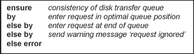

Added system complexity due to the acceptance test and the lack of alternative algorithms are two drawbacks of recovery blocks. Shared, global data also reduces the effectiveness of recovery blocks.

Failure of a recovery block should not be used as an indication of a permanent fault in the system. The block may be reusable with different input or initial state. \[Tor00\]

RECOVERY BLOCKS offer primarily temporal redundancy, since they execute sequentially. Parallelism is possible through Distributed Recovery Blocks. For more information, see Kim \[Kim95\]. …

# 5. Minimize Human Intervention

… People are the cause of many failures in long-running systems through the inappropriate actions they sometimes take. In a study of the US telephone network, human errors accounted for almost one half of the failures that were under the control of the telephone companies. Hardware and software errors evenly split the remainder \[Kuh97\].

The system is malleable. Either you are writing the components to specifications or if they are standard components then modification is possible.

**How can we prevent people from doing the wrong things and causing errors?**

There are three categories of errors in highly available systems. These are hardware, software and procedural. Hardware errors are those that occur in the computers and related elements, such as networks, that provide a platform for the system. Software errors are discussed in Chapters 1 and 2 and result from any design or implementation faults in the software base. Procedural errors are the result of mistakes made by operating personnel. Procedural errors cover the whole spectrum from actions not taken when they should have been to actions that should not have been performed. The system must be designed to minimize the ability for operating personnel to cause procedural errors.

People do worse than computers in situations where there are long series of steps needed to accomplish a task. People skip steps, either accidentally or on purpose. Computer systems will do them in the same order each time.

Human operators become bored and inattentive with routine, monotonous tasks. If routine operations are failure-free then there is a chance that the operators will not be looking at the display of something that they need to take action on.

Many iterations of an automatic reaction to a situation can occur while a person is still deciding what to do. Computers are fast and can react while people are still considering what to do. Events, normal processing or failures, are happening so quickly that inclusion of the human operator is infeasible. Design the system to detect and process errors automatically. This will be the fastest way to return to system availability. The specific actions that the system should be designed to do to achieve this goal of automatic processing are dependant on the system’s specification and operating context. The patterns in later chapters of this book offer fundamental techniques for automatic detection and processing.

One of the things that people do better than machines is drawing meaning from sequences of events that seem unrelated. Experienced people can solve problems swiftly because of this ability. The system should give these experienced people enough information to help automatic actions. The system must also provide the mechanisms to enable them to intervene when necessary, this is described in MAXIMIZE HUMAN PARTICIPATION (6).

As a group, the human operating personnel have slow response times, slower than the computer in general and especially if their attention is elsewhere. They might not be looking to the system to notice that they should do something. Design the system to present status information to the operators as quickly as possible and in a way that they notice. Sounding an AUDIBLE ALARM \[HS00\] is one way to get their attention quickly.

There is an old saying among programmers and testers: ‘A quiet system is a dead system.’ Many capabilities have been added to many systems over the years to let the monitors know that the system is still alive. The spinning hourglass or spinning wheel icons of popular operating systems give the user an indication that the system is performing actual work and has not died. The system must give the operating personnel enough information to be comfortable that the system is performing adequately, and has not stopped working. If the operators are not comfortable that the system is operating, they will do something; and what they do might make the situation worse.

Therefore,

**Design the system in a way that it is able to process and resolve errors automatically, before they become failures. This speeds error recovery and reduces the risk of procedural errors contributing to system unavailability.** The system should provide the operating personnel with enough information for them to follow the progress of error detection and processing progress, but the operating personnel shouldn’t be required for the resolution of errors.

Avoid <a href="#c04.htm#fig4.18" id="c04.htm#fig4.18a">Figure 18</a>.

**[Figure 18](#c04.htm#fig4.18a)** Error reporting to avoid

How do you implement this?

**1.** Make sure that errors are reported to the FAULT OBSERVER (10) which will ensure that all the appropriate monitoring systems will be notified.

**2.** Make sure that individual components do not send messages to the outside world. Concentrate input and output using patterns from ‘An Input and Output Pattern Language’ \[HS00\].

**3.** Design the strategies and techniques into the system that enable it to detect, process, and ultimately treat the faults, errors, and failures without human assistance.

The system will recover more quickly and will not rely on the skill or attention of the human operators. But when there are skillful operators available, the system should be able to MAXIMIZE HUMAN PARTICIPATION (6) to more quickly resolve errors.

Procedural errors will be reduced if the operating personnel have access to predefined practices and procedures to follow to aid in their recovery. This is discussed in REINTEGRATION (59). Procedures should be written to guide even the experts to ensure that they do not accidentally skip an important step as they are assisting the system. If the procedures prove to be incorrect, correct them (REVISE PROCEDURE (63)).

ERROR HANDLERS (30) and RECOVERY BLOCKS (4) are two ways to manage large blocks of processing without involving people.

‘An Input and Output Pattern Language’ \[HS00\] provides many patterns for effective communication with people. Patterns are included to manage the flow of information by providing separate MAINTENANCE INTERFACES (7) for different groups of people, providing AUDIBLE ALARMS and prioritizing output messages by performing IO TRIAGE. …

# 6. Maximize Human Participation

…Faults exist in the system.

The system is MINIMIZING HUMAN INTERVENTION (5) to reduce the risk of unavailability due to procedural errors.

People built the system. You are designing it now. The designers of the system understand how it works, and how it should work. Experienced operators know how it does operate. The expertise of these people can help to resolve problems quickly.

**Should the system ignore people totally? That will reduce procedural errors.**

Procedural errors contribute to system unavailability. The actions of human operators must be moderated by what is in the best interest of the system, and as described in MINIMIZE HUMAN INTERVENTION (5), the involvement of people should be limited.

The system should provide ways for experts to contribute to the resolution of errors. There are different kinds of experts: some helped build the system, and some are very skilled at its maintenance and operation. Commands and directives to the system to steer its recovery let the operators eliminate false attempts and focus recovery down productive paths. For example, if the system is attempting a ROLLBACK recovery with state restored from a CHECKPOINT (37) but the storage containing the checkpoint data is known to the operator to be faulty, an operator that is aware of the disk problem can cause the system to RESTART (31) rather than ROLLBACK (32).

External observers, people in the present case, tend to have a broader view of the situation that the system will be able to have. They can make up for gaps in the programming that keeps the system from a clear view, and they can know about physical problems, for example that the system backups are a long distance away. But the people can also make spur of the moment decisions that might be incorrect.

Information about a critical situation, for example all the telephone lines going out of service, or a critical piece of the system hardware failing, needs to be reported as soon as it is detected to enable the operators to repair it. Defer reporting information about trivial things to display until after reporting the important information. Display the most important information first, followed by less important information. Use a timestamp or message sequence tag to facilitate a complete understanding of the system state. Output messages reporting errors are called ‘Action Messages’ because they require some action on the part of the local workforce. ‘An Input and Output Pattern Language’ \[HS00\] contains many patterns for prioritizing this information and presenting it in the most useful way.

There is no one always-correct kind of involvement. For some systems, such as safety-critical systems like avionics, the ability of the operator to override or alter error processing is essential and absolute. In other systems, such as networking systems that don’t have safety ramifications, human involvement aids error processing but is not essential. In some systems, such as home appliances, the operator standing in front of the microwave oven attempting to warm their tea will be unable to guide the oven’s error processing at all and should not be enabled to for a different kind of safety reason than the avionics example.

The system can enter a ‘safe mode’ and perform no further automatic actions while waiting for the human participation. This is the correct thing to do in situations where the risk of incorrect action is very high, for example safety-critical systems. Another example is spacecraft that will enter a lower power mode and wait for human analysis of complicated error. \[Mor05\]

Therefore,

**Know the user and their ability. Design the system to enable knowledgeable operating personnel to participate in a positive way, <a href="#c04.htm#fig4.19" id="c04.htm#fig4.19a">Figure 19</a>, toward error detection and error processing. Provide appropriate MAINTENANCE INTERFACES (7) and FAULT OBSERVER (10) capabilities to give the operators the information that they need to be able to contribute constructively.**

**[Figure 19](#c04.htm#fig4.19a)** Enable people to unlock error detection and processing

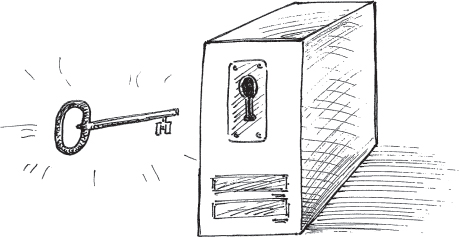

Use the MAINTENANCE INTERFACE (7) to get information into and out of the system quickly and without the risk of loss due to difficulties processing regular workload on the usual input channels. The FAULT OBSERVER (10) is one way to get information and reports out to the operating personnel so that they can constructively assist in error detection and error processing.

Procedural errors will be reduced if the operating personnel have access to predefined practices and procedures to follow to aid in their recovery. This is discussed in REINTEGRATION (59). Procedures should be written to guide even the experts to ensure that they do not accidentally skip an important step as they are assisting the system. If the procedures prove to be incorrect you should correct them (REVISE PROCEDURE (63)).

If the system is designed to allow skilled people to participate in recovery, and that participation repeatedly fails, change the system to prevent future failures. REVISE PROCEDURE (63) for engaging people. Make the changes to the system via SOFTWARE UPDATE (11) to MINIMIZE HUMAN INTERVENTION (5).

Sometimes it is possible to undo erroneous actions made by people. For example, you can build a RECOVERY BLOCK (4) like system to check if a REINTEGRATION (59) or SOFTWARE UPDATE (11) has been performed successfully. If not, allow for the undoing of the actions.

After errors have been resolved, a ROOT CAUSE ANALYSIS (62) should be done to determine if the human participation in the recovery aided or hindered recovery. Improving the automatic detection and processing should also be considered. What actions did the expert operating personnel take that can be made automatic next time? …

# 7. Maintenance Interface

… You are designing a system that should have maximum availability. In addition to the primary application, some tasks are maintenance related. Making the maintenance tasks visible to the outside world makes the system design more robust.

**Should maintenance and application requests be intermingled on the application input and output channels?**

Many highly available devices have maintenance commands to perform configuration, logging or health and status checking actions. These are in addition to the messages or other form of input to the system that are used for its application processing. These workload related inputs will greatly outnumber the maintenance messages in most applications.

If the system provides only one interface then the inputs meant for the application and for maintenance will be intermixed. The inputs need to be separated inside the system. This message processing inside the system will use system processing resources.

This is a problem because when it is most important to enter maintenance commands might be when the system is overloaded with application inputs or in the midst of error processing. Because of the low volume of maintenance messages, any efforts to SHED LOAD (49) can result in losing the important maintenance inputs.

Another problem is that intermixing maintenance inputs and application inputs can open the system up for security breaches. A malicious person with legitimate access to the application can attempt to breach the security of the system by submitting a maintenance command instead of an application-related one.

A solution to both of these problems is to have a separate maintenance interface. Processing of inputs over this maintenance interface can be given a priority level that ensures that the inputs are received in and made available in a timely manner. It also prevents the malicious people with legitimate application access from having the ability to submit maintenance inputs that might breach the system.

In the midst of failure-induced crisis situations, having a separate interface into the system just for maintenance communication saves time and reduces unavailability. It gives operating personnel the information they need to make decisions more quickly than if this critical information is only available on the one interface. It also reduces errors by directing the human operators down the right path.

The maintenance interface should be visible to those personnel and other systems that need access. It should also be well secured. Malicious people will attempt to gain access and control of the system through it, so access security measures should be employed on it.

This pattern is not advocating hidden trap doors which would enable secret access to developers or maintainers, or malicious people. The maintenance interface should be used for all the maintenance actions and should be a regular part of the system.

The maintenance interface can be shared among maintenance and maintenance-like functions. For example, accessing logging information may not be directly maintenance related, but would be an acceptable use of the maintenance interface. When defining the list of permitted uses of the maintenance channel, take a broad view, enabling many uses. Weigh this against the ability to get important information out quickly, as described in MIND YOUR OWN BUSINESS in ‘An Input and Output Pattern Language’ \[HS00\]. However, do not enable application-related workload to use it.

Therefore,

**Provide a separate interface to the system for the exclusive or almost exclusive use of maintenance interactions. Refer to <a href="#c04.htm#fig4.20" id="c04.htm#fig4.20a">Figure 20</a>.**

**[Figure 20](#c04.htm#fig4.20a)** A separate interface for maintenance activities

This will free up the normal application level interfaces for application workload.

Many routers and hubs sold for home and small office use provide an example of a Maintenance Interface. The primary application interface is via their Ethernet ports. The Maintenance Interface is a special web based interface made available on an Ethernet port that does not need to be active for the device to perform its primary functions.

Refer to ‘An Input and Output Pattern Language’ \[HS00\] for patterns discussing how the maintenance interface can be effectively managed and used. …

# 8. Someone in Charge

… You are designing a fault tolerant system. There are multiple parts which provide the system with several UNITS OF MITIGATION (1) and REDUNDANCY (3). The system design enables it to process errors automatically, MINIMIZE HUMAN INTERVENTION (5).

Error processing actions are not trivial which means that they require time to complete.

**Anything can go wrong, even during error processing. When this happens the system might stop doing the error processing in addition to not doing the normal processing.**

Detection is hard; recovery is also hard. Within the world of fault tolerance, there are two kinds of detection. The first kind is to detect an actual error that has occurred. The second is to detect that part of the system has stopped processing by failing silently. The second is easier.

If part of the system knows what should be happening then the system is more robust. That part can detect if something does not work and then they can fix it or at least report to the FAULT OBSERVER (10). This is like a hiker leaving a plan with the ranger station that specifies their route and expected duration so that the ranger can send help if the hiker is overdue.

If something does not work there must be part of the system that can restart processing actions to resolve the situation.

If this part of the system knows what is going on with the recovery, it can oversee the system behavior, reducing propagation. The FAULT OBSERVER (10) and SYSTEM MONITOR (15) both sometimes perform this kind of function, although both have different primary functions; the FAULT OBSERVER collects and distributes reports to interested parties and the SYSTEM MONITOR detects errors.

In many forms of REDUNDANCY (3) there is one element that is marked as ‘active’. When there is a single active element, label the others either standby or spare. The active element is the one that is in charge of error processing on the other elements. If the system has multiple active elements, as can happen when they share the workload, develop some heuristic that will identify which is in charge during error processing.

A problem with having a single component in charge of fault tolerance activities is that it provides a single point of failure. This pattern does not say that the system must have a single entity that has global responsibility. For any individual fault tolerance related action there must be a clearly identified or identifiable responsible entity. This responsibility can be distributed across the system so that there are a series of responsible entities close to where error processing activities are needed and need supervision.

The module that performs the management can get complicated if it has to administer many different kinds of activities. This is another argument against having a large module centrally administer the fault tolerance activities. When there is more code in a module there is more possibility for faults to be added to the system.

If you can design in some component responsible for the management of errors, the system is more robust. Error processing frequently requires coordination to determine the correct actions or to orchestrate ESCALATION (9).

Some examples of components responsible for the various actions: the caller of a method or function is in charge of that relationship. Systems frequently have a module charged with proper initialization and startup. Clusters of systems can have a management node that monitors the individual system to determine if they are operational and to initiate restarts if they are not.

Therefore,

**All fault tolerant related activities have some component of the system (‘someone’) that is clearly in charge and that has the ability to determine correct completion and the responsibility to take action if it does not complete correctly. If a failure occurs, this component will be sure that the new failure doesn’t stop the system.**

The component in charge must be able to monitor the progression of actions taken to process the error and if they become stalled it must be able to initiate alternative actions, possibly ESCALATION (9) to more drastic measures. See <a href="#c04.htm#fig4.21" id="c04.htm#fig4.21a">Figure 21</a>.

**[Figure 21](#c04.htm#fig4.21a)** Responsibility list

Failures even during error processing will not result in the system silently disappearing. Some component of the system will know if it fails silently and if error processing is not successful. There is also a component that can stimulate ESCALATION (9) if attempted error processing does not succeed.

Sometimes the FAULT OBSERVER (10) or the SYSTEM MONITOR (15) perform dual rolls and serve as the elements in charge in addition to their other responsibilities.

The general techniques of SYSTEM MONITOR (15), including HEARTBEATS (16) and ACKNOWLEDGEMENTS (17), can be used to ensure that the system has not silently failed. The problem of ‘dual masters’ arises when more than one element claims to be SOMEONE IN CHARGE. A similar problem arises in VOTING (21). The system must have an automatic way of resolving this situation. Two simple techniques to resolve the issue are to use a lower address or an earlier processor start time to decide which should be considered to be in charge. …

# 9. Escalation

… The system has tried many options to process or mitigate an error or failure in a component. Error processing has stalled without completing. Error processing must succeed to enable the system to resume normal operation.

CORRECTING AUDITS (2) were unsuccessful. Attempts to ROLLBACK (32) or ROLL-FORWARD (33) have not worked. The system is still suffering from the effects of the error.

The system is built around the principles of MINIMIZE HUMAN INTERVENTION (5) and attempts to take care of itself. There are assigned components to serve as SOMEONE IN CHARGE (8).

**What does the system do when its attempt to process an error in a component is not achieving the correct effect?**

Nothing so far has worked. What next?

The error just gets stuck sometimes. Like a dirty music recording (vinyl or CD) that repeats. Knocking the system out of the error state that it is in requires something drastic.

Sometimes the system can repeat the attempts to recover the component endlessly. This is the correct option if the attempts do not cause damage and if they might have a chance to work, particularly if the problem is actually a transient. Transients might be the result of a flood of erroneous messages sent by a peer, or a hardware fault stimulating the transient error. Transients also result from a software element that does something incorrectly (erroneously) but then starts doing it correctly without any error processing. RIDING OVER TRANSIENTS (26) should be incorporated to avoid trying to recover from true transients.

In most cases, though, simply repeating the same techniques is not the right thing to do. Blindly repeating the same techniques result in the system being stuck in a loop. The system should LIMIT RETRIES (35) to prevent this from happening. In some circumstances, such as when the recovery attempt deletes data in case it was the data element that caused the error, it is not safe to repeat the recovery or mitigation steps.

More drastic alternatives include making the error processing less local. In the example just mentioned, more and more processes, farther and farther from the faulty one, become involved in the recovery. More drastic alternatives also include actions that become progressively more intrusive into the operation of the component. For example, a first attempt might be to correct an input and retry an action. If that doesn’t achieve success then the task that processes the input is restored to a pre-error state through a CHECKPOINT (37) and ROLLBACK (32). If that does not succeed then the task is RESTARTED (31). And if that doesn’t succeed then the task undergoes a FAILOVER (36) to a redundant processor.

For example, the system might attempt to restart a component process in an attempt to process an error. If that fails the system can restart a group of processors. The next step, in case restarting a group of processes fails, is to restart an entire processor. For every corrective action, there is a more drastic alternative.

CORRECTING AUDITS (2) in the 4ESS™ Switch provides an example of escalation. When a data or data structure error is detected the system corrects it but keeps a count of how often it occurs, using a LEAKY BUCKET COUNTER (27). When the same data is erroneous too many times in too short a time period the lowest level of system-wide recovery is initiated. This recovery, called a ‘Phase 1’, reinitializes software data structures. If the audit continues to find incorrect data, up to three Phase 1s will be attempted. If the error is still not corrected then the system’s SOMEONE IN CHARGE (8) escalates the recovery to the next most drastic level, ‘Phase 2’. If the Phase 2 is unsuccessful in correcting the problem then a ‘Phase 3’ is initiated. Phase 3 is the highest level of initiation that the system can begin automatically. It corrects software and hardware states using almost every means possible. If the error persists after three Phase 3s then the most drastic action possible automatically is done, which is a Phase 3 that returns all dynamic data to its initial values, performing a large-scale DATA RESET (41). \[MRY77\]

Therefore,

**When recovery or mitigation is failing, escalate the action to the next more drastic action. See <a href="#c04.htm#fig4.22" id="c04.htm#fig4.22a">Figure 22</a>.**

**[Figure 22](#c04.htm#fig4.22a)** Escalating to more drastic measures

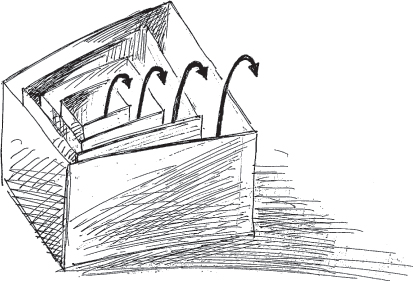

Escalation should report to SOMEONE IN CHARGE (8) for it to trigger some new action. Depending on the nature of the errors and failures, it might request that there be human intervention. You should ensure that people can override system behavior when absolutely necessary.

A predefined list of recovery steps that a human operator can use should be available, when they are part of the escalation sequence. The list should start with those things that have a high probability of recovering, but are fast and have a minimal impact on other aspects of system operation. If those things do not succeed, follow with other actions that are increasingly disruptive and slower.

Generic escalation steps cannot be created because the context of each application of this pattern will be different.

Identifying the steps to escalate through is part of the art of designing a fault tolerant system. Methods like keeping track of the number of actions tried and using a LEAKY BUCKET COUNTER (27) to decide when too many attempts have occurred within a certain time are useful. Understanding the likely causes of errors and the failure modes of the system is essential. This understanding comes from the Fault Tolerant Mindset.

At the end of the chain of ESCALATIONS, sometimes the best thing is to resume partial operation. Isolate the functionality that has the errors and allow the rest of the system to proceed as best as it can. People will almost always have to step in and correct the situation, or at least tell the system to retry the error correction. Graceful, partial degradation of service is an option when the faulty components are easily confined or when there are workarounds. For example Weir and Noble in \[NW01\] use the example of using an approximate value when the detailed calculation fails.

In extreme cases the system might forget where it is in the ESCALATION step, perhaps because of memory corruption or some other reason. When this situation is detected they will declare that their current ESCALATION step is in the middle of the range and proceed from there. As they determine the correct status of the system they can then adjust up or down in the ESCALATION strategy to the most appropriate value. Many systems use an odd number of ESCALATION steps so that there is a step ‘in the middle’.

When a more drastic action is attempted, there is a better chance that the system will break out of the error state.

SLOW IT DOWN (53) has another example of an ESCALATION strategy in use. …

# 10. Fault Observer

… You are designing a system that is meant to be fault tolerant. You know that errors might happen and you want to be prepared for them. No system exists totally in isolation; it always has someone (people or computers) that watches over it. For example, the human operating personnel are watching. Even a microprocessor-controlled refrigerator has a person that is interested in how it is working. The person might not want to receive reports that the refrigerator is working correctly, but will want an indication of some kind when it fails.

The system is built around the principle of MINIMIZE HUMAN INTERVENTION (5) and so is designed to detect and process errors automatically.

People are interested in what faults were found and what errors were corrected, both to help the system during error recovery (MAXIMIZE HUMAN PARTICIPATION (6)) and to be able to perform SOFTWARE UPDATES (11), REINTEGRATION (59) and REVISE PROCEDURES (63).

**The system does not stop when errors are detected, it automatically corrects them. How will people know what faults and errors have been detected and processed, both currently and in the past?**

Everyone wants to know what’s going on. There might be external systems monitoring the actions of the system that you are designing. The monitoring system wants to know when things are going wrong so that it can repair broken hardware or request software changes via a SMALL PATCH (61) or SOFTWARE UPDATE (11).

The system’s design enables it to gracefully detect, contain, and mitigate faults and errors. But it needs a way to tell everyone that is interested what is happening. The PUBLISHER-SUBSCRIBER \[BMR+96\] pattern describes an effective way of distributing this fault information. The observers, both people and other systems, register their interest in the information by subscribing for it. When new information arrives, such as a report that an error has been detected, it is published to all of the subscribers.

The Forestry Department of the US Department of Agriculture maintains a collection of fire towers to monitor the forests of the United States for fires. When a fire occurs the forest rangers staffing the towers notify the concerned parties, who range from crews who will fight the fire to residents that might be affected by the fire. These towers serve the role of observer of the faults of a forest (which are fires). In practice there are enough towers to provide FAULT CORRELATION (12) and triangulation, but even a single observer can report the fault to all of the interested parties.

All the parts that identify and process errors need to be able to publish it. Publishing the information from every part that detects errors is inefficient. It results in duplicate code, which is both a maintenance headache and a good place for other faults to hide. It can also result in confusion among the observers because errors might be reported multiple times by different components of the system. Multiple occurrences of redundant information confuse human operators, increasing the likelihood of procedural errors and reducing the impact of MAXIMIZING HUMAN PARTICIPATION (6). It is better to have the publication concentrated.

The FAULT OBSERVER publishes information about the presence of a fault to the operating personnel over the MAINTENANCE INTERFACE (7). Intermixing fault information and reports in with regular communications can result in valuable information being lost. The FAULT OBSERVER controls, or at least is able to report, any hardware status indicators such as lamps or LEDs.

You can build one or more fault observers into the system. The observers can assist in the collection, correlation, and publication of fault information to all the subscribing monitors. As faults are detected they will be reported to the fault observer, see <a href="#c04.htm#fig4.23" id="c04.htm#fig4.23a">Figure 23</a>.

**[Figure 23](#c04.htm#fig4.23a)** Collecting and publishing fault reports

If multiple fault observers are built into a system they should either provide redundancy for each other or be dedicated to different types and collections of faults.

The system is built to detect errors. From errors, faults may be inferred. The interested parties are usually interested in both faults and errors. Since a single error can be produced by any of multiple faults, refer to [Figure 2](#c01.htm#fig1.2), page 6, knowing which fault. Knowing which fault has been correlated with the error helps the observing, interested parties know how to provide the most assistance to the systems’ fault tolerance goals.

The Fault Observer does not need to be an internal part of the system, it can be an external entity that receives reports and passes them along to other parties that are interested, see <a href="#c04.htm#fig4.24" id="c04.htm#fig4.24a">Figure 24</a>. Some fire towers are placed in the midst of the forest and others around the edges. Parts of the system could provide this information directly but then there would need to be the subscription and publication mechanisms built into many places, again a maintenance burden.

**[Figure 24](#c04.htm#fig4.24a)** Potential system boundaries

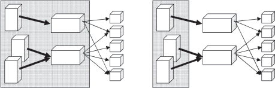

All other interested system components, other systems and the operating personnel subscribe with the FAULT OBSERVER. Some examples are the components that perform FAULT CORRELATION (12) and serve as SOMEONE IN CHARGE (8) within the system that will use the published information to guide fault tolerance activities. Other systems that are interested include administrative and cooperating systems like load balancers, maintenance systems, and personnel paging systems. The people responsible for maintaining the system will subscribe as well to receive the reports that can guide their actions.

Observing faults and reporting them to interested parties is not the same as FAULT CORRELATION (12). The two mechanisms work side by side to provide complete information to the error processing components, to SOMEONE IN CHARGE (8) and to all the subscribing parties.

Fault treatment techniques such as those in Chapter 8 rely on published information about the faults that have occurred to decide how to apply a SMALL PATCH (61) and REINTEGRATE (59). An effective way to present the historical information that they need is through a logging mechanism, which should subscribe to receive notifications from the FAULT OBSERVER.

Therefore,

**Report all errors to the FAULT OBSERVER. The fault observer will ensure that all interested parties receive information about the errors that are occurring, <a href="#c04.htm#fig4.25" id="c04.htm#fig4.25a">Figure 25</a>.**

**[Figure 25](#c04.htm#fig4.25a)** A FAULT OBSERVER receives and publishes information

Since the FAULT OBSERVER gets information about all errors, it makes sense to have it perform some other fault tolerance functions as well. For example, it can serve as SOMEONE IN CHARGE (8) and also perform FAULT CORRELATION (12). However, all of the responsibilities of these three important functionalities must be mapped into the resulting component; leave nothing out, even though they are combined.

A note about log files: Ensure that the system has a strategy to handle the situation when log files fill up. Many real systems have had additional failures because a log file filled totally with error reports when the system could not gracefully handle the log full condition. Two possible alternatives are to use a circular log or a set of logs that are cycled between.

The FAULT OBSERVER receives reports for distribution to interested parties, without micro-managing the actions of the objects discussed in these patterns. …

# 11. Software Update

… You are designing the architecture of the system and identifying major areas of responsibility. Even with extremely good fault prevention through software quality methods, there will be faults in the software.

The system or application that you are deploying will need to change at some point in the future. Most systems evolve with time, requiring that new features be added. The change might be because you want to add functionality, or it might be to treat a fault. The changes that are needed might be in the application, or the software that supports the application (i.e. the middleware), or it might be in the operating system or even in firmware deeply embedded within the system’s hardware.

The system is unavailable while it is being stopped and restarted to install new software. This is downtime. It might be ‘planned downtime’, but it is downtime nevertheless.

Availability is an important attribute of fault tolerant systems. Downtime must be minimized. Stopping and restarting to install new software is unacceptable.

**The system and its applications must not stop operating, not even to install new software.**

The time spent building the changed version of the software is irrelevant to the availability of the running system. It is done ‘off-line’, in a special environment for development.

This pattern is about the mechanisms a system needs before it is deployed the first time to minimize the time spent installing new software because that time is unavailable for application processing. This unavailability must be minimal.

Eventually you will need to determine how to make changes to the system. After deploying the system the first time, how will you get the hooks you need to update the system into the system. You will need the capability to make changes in order to add the capability to make changes. Some systems require that they be updated remotely and automatically.

At the extreme of longest period of unavailability is the installation of a revised version of the software as a totally new application that accesses the same infrastructure components. Because it shares the infrastructure components, both the new and the old applications cannot both be running at the same time without special precautions built into the system beforehand.

A slightly better situation is that the new software can overlap with the old software version and be ready for work as soon as removal of the old one occurs. This is essentially a FAILOVER (36) from the old version to the new version. If done well this has minimal downtime. Adding automated acceptance tests to detect if the new version fails and triggering a return to the old software version is a form of RECOVERY BLOCKS (4).

Consider a software update on the AT&T 3B20D processor, which runs a variant of the UNIX™ operating system. A new version of software is installed and begins running with a duplicate call stack. All new requests are directed to the new version of the software. When the old version completes all of the work assigned to it, it is terminated, leaving only the new version running. This technique results in an update of software from an old version to a new version with zero downtime.

Sometimes you can replace only specific parts of an application. For example, you might be able to apply a SMALL PATCH (61) to a small part (a function or even a bit). Typically, these methods require extensive infrastructure in place to facilitate the change.

In any of these scenarios, the trade offs are the duration of unavailability due to making the transition and the infrastructure required within the system to facilitate the change.

Changes to different levels of the system may result in needing different capabilities to support the updates. For example special mechanisms might be needed to download and install updates to firmware. The support tools for firmware updates will not be the same tools to update the application. You must consider the need for support tools for each kind of software in the system. Kinds of software include firmware, flash memory based, disk based and memory resident. Over the life of a long-lived system all of these will be updated at some point.

The Mars Exploratory Rovers have received a number of software updates during their missions. As the mission passed the 90-day design goal, other interesting experiments could be conducted. Some required that updates to the Rover software be made to implement the experiment. Navigational system improvements have allowed the Rovers to become more autonomous than they were originally. And occasional component failures have required workarounds, such as to teach Spirit to ‘favor’ or not use extensively a balky wheel. \[NASA04\]

New capabilities added to a system sometimes means changed interfaces. Not every part of a complex system that might have several subsystems can be updated simultaneously. You must consider whether the new system should be backward compatible to support interactions with other systems that have not been updated. Backward compatibility is achieved by defining a version indicator and rules for the new software for how to process the request and how to cope with missing or changed attributes. Sometimes forward compatibility can be added, especially if a long term system upgrade path can be defined. Forward compatibility usually means treating the next version’s special attributes as no-ops and ignoring them. The pattern on ‘MESSAGE VERSIONING’ \[PT02\] talks about two ways to implement forward and backward compatibility for messages.

You are employing the Fault Tolerant Mindset as you are designing all the parts of the system. What can go wrong when you update the system? What are the failures? You need to be able to update the system without encountering any of these failures.

Updating a running system benefits from MAXIMIZING HUMAN PARTICIPATION (6). Operating personnel have to create the software update and are required usually to initiate the application of the update. This may need to be done remotely. But software update also benefits from MINIMIZE HUMAN INTERVENTION (5) because the steps required to initiate the update easily become tedious and repetitive to the operators and prone to errors. When procedural errors occur you should learn from the mistakes and REVISE PROCEDURES (63) to reduce the likelihood that they will reoccur in the future.

Changes will be required to the software after every release, including the first one. The capabilities to support software update must be built into the system from the very beginning or else there is no way to update the system to add the software update capabilities.

Therefore,

**Design the ability to change your software into its** ***first*** **release. See <a href="#c04.htm#fig4.26" id="c04.htm#fig4.26a">Figure 26</a>. Enhance this capability as becomes necessary in every subsequent release. Do not assume that software update will be an easy problem that you can solve after deployment.**

**[Figure 26](#c04.htm#fig4.26a)** Replacing part of the program

You can now start to think about what mechanism is the best for your environment. The options range from changing things at very low levels with patches or to replace the entire system and restart the application.

Sometimes system specifications can be written to allow the time for regular (annual, semi-annual, etc.) software updates to not be counted as downtime against the overall system availability targets. This special update time is called ‘planned downtime’ and isn’t used in reliability computations. …

# CHAPTER 5

# Detection Patterns

The first phase of fault tolerance is detection. Faults and the errors that they cause must be detected. Detection must occur before any recovery or mitigating actions can be taken to tolerate their presence in the system. Waiting and letting unknown latent faults activate and cause that result in failures is not fault tolerant.

The patterns in this chapter help detect the presence of errors or failures and the faults that caused them. They provide a number of mechanisms to monitor the system and to detect if it is behaving erroneously. Two pairs of concepts drive detection at execution time. These are errors versus failures and *a priori* knowledge versus comparison of redundant elements, see <a href="#c05.htm#fig5.27" id="c05.htm#fig5.27a">Figure 27</a>.

**[Figure 27](#c05.htm#fig5.27a)** The dimensions of detection

*A priori* detection uses constraints that are known in advance about the system to determine if some deviation from the normal situation of correctness exists. The range of results to be considered includes system states, results, and any side effects. If nothing is known about the range of results this method will obviously not work.

Much of the fault tolerant programming literature has focused on the second method, that of comparing redundant results. REDUNDANCY (3) in Chapter 4 discussed introducing redundant elements into the system. Many purpose-built systems with custom hardware use redundant hardware to execute the same program and the results. The comparison might be done in real time by hardware matchers that look at internal, partial computation results, or the comparison might be done at a system level with the complete computational results.

When comparisons are done there must be enough information present, either in the values to be compared or the context to enable the identification of the faulty component. Just determining that one is incorrect is helpful, but insufficient to fix the fault and prevent a failure from occurring.

Another aspect of detection is added by techniques that help a system to learn about correct system behavior. The system can keep a record of errors and faults that are detected and apply Bayesian learning techniques to learn to automatically detect errors and failures.

The system must be able to detect both errors and failures. It is more desirable to detect an error than to detect a failure. This is because errors have not yet become visible to the observers of the system as a deviation from the specification.

The most desirable means of failure handling in a computing system is when the error is detected automatically and corrected before it becomes a failure. If this is not possible, and a failure occurs, then the next most favorable options are the ‘fail-silent’ and then the crash failure mode, described in Chapter 1. When failing silently the erroneous element immediately stops processing without corrupting any of its peers. To ensure peers do not corrupt other peers through the error propagating, the failing element stops without informing them that it is stopping. The problem of detecting that an element has stopped functioning is a totally different and easier problem than the problem of determining if an element has stopped operating correctly.

Two mechanisms for detecting errors are in common use. The first is to test function return codes to determine if the function has returned reporting an error condition. The second is to use the exception or try/catch capabilities built into many languages, such as C++, Java, and Ada. These mechanisms are used to detect that error conditions exist. They supplement the capabilities discussed by the patterns in this chapter.

The patterns in this chapter address detection from both the *a priori* and redundant scenarios. Practical fault tolerant systems must begin error processing as soon as errors are detected, and so patterns related to the initial stages of error processing are also included in this chapter.

<a href="#c05.htm#tab5.1" id="c05.htm#tab5.1a">Table 5.1</a> lists all of the patterns in this chapter. Their order is that of the language shown in <a href="#c05.htm#fig5.28" id="c05.htm#fig5.28a">Figure 28</a> and also the order that the patterns appear within this chapter.

[**Table 5.1**](#c05.htm#tab5.1a) Detection pattern thumbnails

---

**PATTERN**                        **PATTERN INTENT**
FAULT CORRELATION (12)             Analyze multiple error indications to identify the actual active fault.
ERROR CONTAINMENT BARRIER (13)     Isolate errors so that they do not spread.
COMPLETE PARAMETER CHECKING (14)   Check all the inputs and parameters rigorously to prevent bad results from causing errors during execution.
SYSTEM MONITOR (15)                Some errors will only manifest themselves at a system level. Check for them at this level.
HEARTBEAT (16)                     Send a status report at regular intervals to let other parts of the system know their status.
ACKNOWLEDGEMENT (17)               Send a reply message to let a communicating party know that the sender is alive.
WATCHDOG (18)                      Build a special entity to watch over another to make sure that it is still operating well.
REALISTIC THRESHOLD (19)           Thresholds for detection of problems should be set realistically. This applies to communications (HEARTBEAT (16), ACKNOWLEDGEMENTS (17)) as well as anything counted (LEAKY BUCKET COUNTERS (27)).
EXISTING METRICS (20)              Monitor metrics that are already included in the system and won’t take precious computing time to compute.
VOTING (21)                        When more than one result is available for a computational result or question or task, vote to pick the correct one.
ROUTINE MAINTENANCE (22)           Periodically and automatically perform routine, preventive maintenance to prevent faults from silently accumulating.
ROUTINE EXERCISES (23)             Run ROUTINE EXERCISES to know that REDUNDANT (3) hardware is available for use when needed.
ROUTINE AUDITS (24)                Check data by a background task to make sure that it is correct.
CHECKSUM (25)                      Add information to data or messages to verify that they are correct.
RIDING OVER TRANSIENTS (26)        Sometimes the prudent thing to do is to ignore an error if it is something that might be due to a transient situation.
LEAKY BUCKET COUNTER (27)          Implement a method to RIDE OVER TRANSIENTS (26) by keeping a counter that is automatically decremented and incremented by errors.

---

**[Figure 28](#c05.htm#fig5.28a)** Detection patterns language map

[Figure 28](#c05.htm#fig5.28) contains one possible language mapping for the patterns found in this chapter.

The patterns in this chapter aid the detection of errors and failures. When errors are detected they must be isolated and kept from spreading. The capability to isolate errors to specific units is possible once the UNITS OF MITIGATION (1) have been defined. FAULT CORRELATION (12) pinpoints and identifies the location of the fault by grouping and associating errors. ERROR CONTAINMENT BARRIER (13) discusses the detection and containment of errors. COMPLETE PARAMETER CHECKING (14) describes the most thorough way of preventing errors from passing through the boundaries between entities in the software design. This pattern advocates completely checking every value exchanged by the system, both internally and externally. If any are found to be outside the expected boundaries, or outside the boundaries of what is known in advance about the system, then an error is inferred.

The next collection of patterns is used to detect whether elements of execution (processes, tasks, threads, processors) have stopped working, Watchdogs have been used for many years in microcontroller-based systems. These systems have a processing element that acts strictly as the Watchdog element. This Watchdog will initiate a system reset to restart the microcontroller if it detects an anomaly. In systems built of parts larger than microcontrollers, Watchdog elements are enhanced by software components that oversee the monitoring. The Watchdog becomes one of the tools at the disposal of the monitor. The basic principle of a Watchdog, which is to have one element monitor the behavior of another, is found in several of the patterns in this chapter. SYSTEM MONITOR (15) talks about adding a task to the system that is in charge of monitoring whether the other parts are working. HEARTBEATS (16) is a key mechanism employed for this purpose. Information that a task is functioning normally can be sent as part of the ACKNOWLEDGEMENT (17) of routine communications. In some cases the best way to check that tasks are functioning is to implement a WATCHDOG (18), which is a monitor that watches to see that a task is alive by the kind of interaction that it has with its peers.

Many detection techniques rely on some sort of threshold to detect an error. It is important to set a REALISTIC THRESHOLD (19) to avoid falsely reporting errors.

Impending failures of the system’s performance must also be detected. Many different metrics are available within systems that are usable to detect this. EXISTING METRICS (20) discusses not adding new metrics but instead using ones that already exist.

When the system has REDUNDANT (3) elements, sometimes it is necessary to perform VOTING (21) to determine which is producing the correct result.

Fault tolerant systems are made more reliable through ROUTINE MAINTENANCE (22) functions. By periodically identifying errors and correcting faults the system’s fault tolerance will be increased. When there are REDUNDANT (3) elements the technique of ROUTINE EXERCISES (23) to alternate which of the redundant elements is active and which is standby is very effective.

To ensure that data that is used by the system is correct, ROUTINE AUDITS (24) are performed. The audits will correct any data that they find erroneous. CHECKSUMS (25) are a useful technique to detect data errors.

Two of the patterns, RIDING OVER TRANSIENTS (26) and LEAKY BUCKET COUNTER (27) discuss creating a threshold for an allowable number of errors. If the errors are permanent the threshold will be very low, probably one. If the errors are transients then a larger number may be tolerated before the system decides that recovery actions are needed.

# 12. Fault Correlation

… An error or a failure has been detected. There are a number of potential causes for it.

In order to be more fault tolerant the system has been designed to fail silently when it fails. As a result, all that is known when the failure is first detected is that it has failed. In order to process an error or failure the system needs to identify the error, and what fault caused the error.

**What fault is activating?**

Errors can be caused by any of several faults. Particular errors keep occurring. The system has been RIDING OVER TRANSIENTS (26) but the system needs to make certain that the current error is the one that it is interested in ignoring. If it is a different error then the system should initiate error processing.

What has the error done? Has execution stopped? If so, what capabilities are no longer available? What was the size of the stack at the time of the error? Were logs collected? What data is incorrect? Is it frequently changing data or is it a constant?

The system should correct the actual fault that has caused the problem. Too large a recovery will impact too much of the system. Identification of the fault allows targeted recovery actions to be taken. \[CBF+04\]

Fault tolerance is about handling the unanticipated and undetectable errors that occur during execution. But as faults are being removed from the system during design and test, different common errors will have been uncovered, isolated, and corrected. The clues to error types, or their ‘signatures’, learned during these activities help you know what kinds of errors are likely to occur during normal execution.

For example, if a large and complex system has a large number of off-by-one errors uncovered during test, the error signature found is that loops are traversed one too many times. This identifies a flaw in the execution limits of ranges or conditional checks. Since a large number of different occurrences were found during testing, there is a high probability that not all of them were uncovered during test and that some will be present in the production system. The system should be prepared through the addition of detection mechanisms that will find this kind of error. And the system should be programmed to correctly process off-by-one errors when they occur. In order to do this the system must be able to detect the errors, and determine that they are of the type ‘off-by-one’.

The error must be masked so that the fault is tolerated. Identifying precisely what fault created the error is needed for treatment, but not for error processing. Similar errors can be given similar error processing treatment.

For example, normal execution should resume after a failure in a REDUNDANT (3) unit. After the error is detected and identified to be a failing component, the fastest method of recovery is to FAILOVER (36) to the redundant unit. Treating the fault that produced the failure can be deferred until after application execution has been resumed on the standby unit.

Errors can occur in clumps. One fault triggers an error that in turn triggers other errors. Failure can be prevented ideally by processing the initial fault that started the chain of errors. Some errors will come in groups by their nature affecting multiple instances of a resource close together. Again it is better to process the error through a correcting, recovery technique rather than mitigating each of the many instances.

When several errors occur close together in time, they might be related. In deciding what faults the system has, the multiple errors should be used to triangulate the location of the error.

When data errors are detected the correlation involves the identification of related data that also needs to be checked. The CORRECTING AUDITS (2) can assist with the association through Audit Implicator Indices that link related structures together as well as correct the data.

Consider two examples: is missing a HEARTBEAT (16) message the result of a failed monitored task or is it because the communications link did not correctly convey the message? For an internet example, is the failure of the web page request due to a network failure or a failure of the web server? Whenever errors are suspected in peers that are at the other end of a communications link from the detection point, communications failures must be added to the list of potential errors.

The system can be designed to grow its ability to detect and process errors through Bayesian learning techniques. The system can maintain information about the errors that are detected and the successful processing steps and learn how to recognize and process errors that were not covered in the initial design.

Therefore,

**Look at the unique signature of the error to sort it into the fault category for which error processing steps are known, <a href="#c05.htm#fig5.29" id="c05.htm#fig5.29a">Figure 29</a>.**

**[Figure 29](#c05.htm#fig5.29a)** Sorting errors into related groups

Once an error has been characterized by its signature an ERROR CONTAINMENT BARRIER (13) can be established to prevent it from spreading.

The system will know the most effective means to handle the error because it has been grouped into a set for which the best actions are known. The patterns in Chapter 6 and Chapter 7 describe techniques for error processing, ranging from MARKED DATA (56) for data errors to altering execution sequence through ROLLBACK (32) and RESTART (31). When the correlation identifies the error as being related to overload, OVERLOAD TOOLBOXES (42) will help the system determine the correct actions to take.

The correlations and supporting data should be shared via the FAULT OBSERVER (10). This allows people, through MAXIMIZE HUMAN PARTICIPATION (6), to take preventive actions or to schedule ROUTINE MAINTENANCE (22) to correct the fault. …

# 13. Error Containment Barrier

… The system is designed to perform as well as it can in the presence of faults. The necessary fault tolerance framework elements are in place. The software knows that it is supposed to be within a highly available system. The mechanisms for detection of faults have been designed into the system. The system is designed as a collection of UNITS OF MITIGATION (1).

Errors in one part of the system, or in one computation, can spread and cause errors or failures at other places in the system. Errors spread through several mechanisms: erroneous messages, corrupted (incorrect) pooled memory or actions based on the results of other incorrect actions.

**What is the first thing that the system must do when it detects an error?**

Unless something is done the error will continue through the system forever or until it eventually causes a failure that results in termination. This is the nature of errors.

The effects of an error cannot always be predicted in advance. Nor can all the potential errors be predicted. Software reliability modeling, verification techniques, fault prevention techniques, and software quality efforts reduce the number of faults present in the system. The system must be adaptable and able to handle unanticipated errors. This capability must be put in place during the design phase. The capabilities require conscious preparation. This is the Fault Tolerant Mindset.

Fault tolerance is living with faults. The system must find a way to ignore or mask the faults in order to tolerate them. But some ways of masking errors result in their still being propagated throughout the system. If the system does not just ‘ignore’ errors, what can it do? One option is to cry ‘HELP’ and terminate. But this does not fit into the framework of fault tolerance within the system (see MINIMIZE HUMAN INTERVENTION (5)). Sometimes terminating is the only practical option, for example when an error is detected that makes the system unsafe.

Another option is to take steps to mitigate the error. This is not always possible though; it depends on the nature of the error and the fault. Some errors, particularly data errors, can be mitigated by means such as CORRECTING AUDITS (2).

An effective way of mitigation for some errors is to mark them for all other parts of the system to know that they are erroneous. This eliminates the need for the other parts of the system to detect the errors; they can concentrate on taking the steps appropriate for them to mitigate them. This is discussed in MARKED DATA (56).

Sometimes the errors cannot be corrected automatically, but since you chose to MINIMIZE HUMAN INTERVENTION (5) the system will try automatic recovery. In these cases error recovery steps must be taken to move the system to an error free state.

Errors move, or propagate, from component to component in the system unless something is done to stop them. In software the barrier is the boundary of the UNIT OF MITIGATION (1) that contains the fail-silent component. Failing silently implies that any error that is detected within a UNIT OF MITIGATION presents a silent interface to other parts of the system. The actual internal errors are masked to provide only an indication of silent failure. When this is detected the signs and symptoms of the detected error are sent to FAULT CORRELATION (12) which analyzes the error providing guidance to the techniques most useful to process the error.

Therefore,

**The system should isolate the error to a UNIT OF MITIGATION (1). Stop the flow of errors from one part to another with a barrier impervious to errors, QUARANTINE (28), and initiate either error recovery or error mitigation, see <a href="#c05.htm#fig5.30" id="c05.htm#fig5.30a">Figure 30</a>.** Invoke appropriate notification, logging, mitigation, and recovery functions. Do not leave the error unprocessed.

**[Figure 30](#c05.htm#fig5.30a)** Take actions when an error is encountered

In order to be able to contain errors the system must be able to detect them. Additionally it must have the ability to decide what course of action is the safest given the circumstances of the error. Detection as close to the fault in either structural proximity or time is the best case scenario.

The error should be isolated and contained by techniques discussed in Chapter 6 and Chapter 7 that recover from an error or mitigate the effects of the error. COMPLETE PARAMETER CHECKING (14) provides a means to detect that an error has not been contained.

Faulty hardware components can be isolated by activity bits that indicate whether a particular component is in service, or in error processing, or in some other state. When isolating faulty hardware it is very important to prevent the faulty component from spreading malicious information across the system, the so-called babbling problem. A way to address this is to isolate network connections (or other communication links) to the faulty component. MARKED DATA (56) describes a method of marking erroneous information to contain its future use. ERROR CORRECTING CODES (57) and CORRECTING AUDITS (2) discuss ways of correcting erroneous information. The collection of patterns that includes ROLLBACK (32), ROLL-FORWARD (33) as well as RETURN TO REFERENCE POINT (34) and RESTART (31) discuss ways of transitioning to an error free state.

When the error is related to an overload of work requests, OVERLOAD TOOLBOXES (42) should be used to identify which mitigation technique will be the most appropriate to contain and mitigate the effects of the overload. …

# 14. Complete Parameter Checking

… You want to detect errors before they cause a problem. Faults and errors result in the system being unavailable. They also cause the system’s functions to be erroneous, making the system undependable.

Errors in one part of the system propagate to other parts of the system. If the errors are incorrect computational results, then errors can compound as they move through the system. If the errors are incorrect actions, they can trigger further erroneous actions.

The system’s requirements are exacting. The dependability of the system is important. Not only must the system be available, it must also be correct. The system is performing an application that has a high cost associated with failure, for example the system is safety-critical. Another example is in critical functions of the system that are instrumental to all other functions completing correctly, such as a task scheduler in a real-time system. In this last context the individual tasks that are scheduled can fail without adverse system consequences, but all of the tasks must be given an opportunity to execute which requires the scheduler to be operational.

The other patterns in this book are ensuring that the dependable components are executing through the use of a SYSTEM MONITOR (15), possibly with HEARTBEATS (16) or a WATCHDOG (18) function. CORRECTING AUDITS (2) and CHECKSUMS (25) are used to ensure that data stored in memory is correct.

It takes time to detect an error. The further from the point of error, when a fault activates, that detection occurs, the larger window in which it could fail, or could propagate to other parts of the system.

**How can the time from fault activation to error detection be minimized?**

The fastest option is to check for error at every operation that the system conducts. An example is an active-active REDUNDANT (3) pair of processors that are operating in lock-step and comparing results on every basic operation, and reporting an error when there is a mismatch. This is how the central processors in the 4ESS™ Switch interact. This tight coupling and rapid detection works best for hardware failures, and not as well for software failures because the two processors are executing the same program and will both compute an erroneous result from the same incorrect input; and since the results matched in each processor the error will not be detected.

Other systems, such as the Space Shuttle computers, compute results simultaneously but only compare their end results \[Skl76\], frequently by VOTING (21). This relaxation of timing allows different, REDUNDANT (3) software implementations to be used to compute the results. Detection is still fast, but it is slower than lock step.

Both of these examples, the 4ESS™ Switch and the Space Shuttle, rely both on REDUNDANCY (3) and the frequent checks and comparisons of low-level results. When REDUNDANCY is not present in the system the comparisons can still occur.

There can be many things that can be checked even without redundant results to compare. You know at design time the acceptable ranges of values for function/method arguments and also for basic computations. The system can use these attributes to detect errors. An example is to check whether the index to an entry being removed from a buffer is within the acceptable range of buffer indices.

Any checking that is done results in increased reliability. Arguments passed into a function or method, the results returned from functions and methods, and the results of computations can all be checked.

The time between fault activation and their detection decreases with the frequency of checks, as the checks get closer together temporally and spatially. The trade off is that it reduces performance, since all the extra checks take time. Determining the correct checks to add takes development time that could be spent on other things, and these add to the maintenance requirements of the system.

The checks can be put inline with the actual processing that uses the data being checked, but that can lead to confusion. In many cases the checks can be reused among a number of operations (in this example, for the other arithmetic computations). Putting the checks in a separate place, possibly a library, can make maintenance easier. Since it is the elementary operations that are being checked, a separate function or method for each elementary operation can be used to perform all the necessary checks.

Basic operations of the system, even as simple as division, can be checked to ensure that it was performed correctly. Consider:

Partial input validation would check that B and C are within the general ranges that are appropriate for the operation. That A is a valid receiver of the information is also checked. Strict typing, either by coding standard or by language support, can help to make sure that operations are on appropriate types of data.

To completely check the input in this case will require this additional check be made so that overflow and underflow won’t result. (The IEEE Not A Number standard is discussed in MARKED DATA (56). This is not meant as a pattern language linkage between these patterns.) In this example, the absolute value of C is checked to ensure correct operation by both the common two’s compliment and the more rare one’s compliment processors.

Base the decision to include a check on these considerations: What is the probability of error within the entity that is checked? How critical are any errors that occur within that entity? If errors are likely or errors are critical perform a check.

Some computations that a system performs are very expensive. When a less costly approximation is available, it can be used to check that the result of the expensive computation is reasonable.

Every method or function has assumptions about results of the operations it invokes. A check to validate that the assumptions are correct detects errors before they can spread.

Programming by contract is a variation of the checking everything proposed by this pattern. A method or function has a ‘contract’ that specifies its interface and the obligations and benefits to both caller and called methods or functions. The obligations specify the preconditions that the caller must guarantee when making the call. This benefits the called function or method by ensuring that it receives correct, or at least not erroneous, inputs. The called function or method then guarantees that it will provide a result to its caller that is not erroneous. These contracts are implemented by using checks before and after the processing to ensure that both the input and the output of the method/function meet the contracted specification.

Therefore,

**Perform frequent checks on data and operations to detect errors quickly and prevent errors from propagating to the rest of the system, <a href="#c05.htm#fig5.31" id="c05.htm#fig5.31a">Figure 31</a>.**

**[Figure 31](#c05.htm#fig5.31a)** Check responses for correctness

When errors are detected, error processing should be initiated. The error should be reported to the FAULT OBSERVER (10).

These checks can be used in addition to REDUNDANCY (3) to increase dependability.

Violations of any of the elementary operations indicate errors and error processing should begin.

When data errors are detected the error should be reported to CORRECTING AUDITS (2) which will perform FAULT CORRELATION(12) to find, check, and correct related data. Many systems, such as the 5ESS® Switch, report on the output channel any violations of the basic checks. In this and other systems, these are called asserts. Asserts are frequently used during testing, but are useful during normal execution in moderation. In keeping with MINIMIZE HUMAN INTERVENTION (5) important information should not be lost in a flood of asserts.

A variation to detecting errors as described here and passing them to the error processing mechanisms is to mask the detected error into an acceptable result. For all the results generated by the system an ‘acceptability envelope’ is constructed. Layers of components surrounding the core modules will mask any errors coming out of the core by changing the error into something that is within the acceptability envelope. This technique can be used as a wrapper around already existing code that needs to be made more fault tolerant, or it can be used with a less well written code to mask its faults. \[Rin03\]. …

# 15. System Monitor

… The system that you are designing must be available continuously. The design of the system is for it to exhibit crash failures, where it silently stops working. When part of it stops working, the system needs to find out quickly so that recovery techniques can be applied. A FAULT OBSERVER (10) is in use to coordinate information flow.

You know the characteristics of the interprocessor and intraprocessor communications systems, such as paths and performance characteristics. You can add additional messages without harming system behavior by saturating the system.

You are designing a computing system and the architecture contains a critical component that must always be operating.

**How does one part of the system keep track that another part is alive and functioning?**

The silent cessation of operations in a fail-silent mode or crash failure mode is the best for ensuring the system’s continued operation because it minimizes error propagation. However, when a part of the system just stops, silently, the other parts might not realize, and they might not take the steps needed to keep the overall application working correctly. There must be some way of finding out if a needed part of the system is still working.

If the part of the system that has a failure can safely inform the rest of the system about its state then error recovery can begin more quickly. However, stopping silently is preferred to the situation where the failing component is aggressive about telling the world that it has a problem. Blindly reporting the problem to everyone uses up networking bandwidth and processing power, especially since not all of the other parts of the system need to know.

An alternative is that the failing component just keeps ‘looking’ like it is working: Performing actions but not performing them correctly. This is a significant problem because it can fool everyone into thinking that the failing component is working correctly. This is a malicious failure and is very hard to detect.

You could rely on ACKNOWLEDGEMENT (17) messages. These are sent from one component to another in response to something happening. They work well when the system can’t afford any messaging bandwidth or processing time to proactively monitor them. A problem is that acknowledgements require that there be an ordinary exchange of information that can stimulate the acknowledgements. If this routine exchange does not exist then acknowledgements will not solve the problem.

Another solution is to create a mechanism that will actively monitor whether part of the system has stopped working. It could be in the same processor or in a different processor. Choosing a location for this monitor is highly sensitive to the context. If the system is a simple one that must execute on a single processor and hardware support is unavailable, it must be located as a separate task on the same processor. If the system is a custom development with the option of adding a separate monitor hardware component, and the system’s reliability requirements are stringent, then separate hardware is the correct choice.

The monitoring capability can be distributed throughout the system in the most efficient way. Their activities must be coordinated and their responsibilities clearly defined to avoid gaps in coverage.

An important part of the monitoring task’s purpose is to watch for failures in parts of the system and report a problem if they stop working. The monitor can monitor one component of the system, or it could monitor several important components, taking the correct actions when one of them stops. WATCHDOGS (18) are useful to implement this.

Therefore,

**Create a Monitor to study system behavior, or the behavior of specific parts of the system to make sure that they continue operating correctly, <a href="#c05.htm#fig5.32" id="c05.htm#fig5.32a">Figure 32</a>. When the watched components stop, the monitor should report the occurrence to the FAULT OBSERVER (10) and initiate corrective action.**

**[Figure 32](#c05.htm#fig5.32a)** A monitoring task

Any thresholds set should be REALISTIC THRESHOLDS (19).

The task might be implemented as part of either the FAULT OBSERVER (10) or SOMEONE IN CHARGE (8). Alternatively it might be built as a separate element that is in close communication with them.

Once you’ve decided to include a SYSTEM MONITOR you must decide how long it should wait before sounding an alarm. REALISTIC THRESHOLD (19) discusses appropriate threshold times. RIDING OVER TRANSIENTS (26) and LEAKY BUCKET COUNTERS (27) discuss ways of making sure that the anomalous behavior that the system is seeing is an actual problem rather than a transient or intermittent problem.

The SYSTEM MONITOR can operate in several ways. If additional resources (processing and messaging both) can be spared for the monitoring tasks, HEARTBEAT (16) messages received from the monitored tasks are useful. If software and communications resources cannot be spared, perhaps specialized hardware can be added to the task from afar, just keeping track that it is behaving correctly. This is a WATCHDOG (18).

Now that you’ve created a way to find out if a watched task is still functioning, what should the system do when it is not? At the most basic level, the SYSTEM MONITOR should inform the FAULT OBSERVER (10). Refer to patterns about recovery and mitigation presented in Chapters 6 and 7 for other suggestions of actions to take if the SYSTEM MONITOR detects an error. If there is a FAULT OBSERVER present in the system then the detected error, and the planned error processing, should be reported to it. In systems with extreme fault tolerance requirements the FAULT OBSERVER is frequently the entity that takes a global view of the situation and decides on the best processing steps to take, taking on the role of SOMEONE IN CHARGE (8).

The correct choice of action to recover the component depends on the system’s context and requirements. In a situation such as a financial application, where numeric correctness is required, shutting down the system so it no longer processes transactions is sometimes the desirable option. This is an example of CONCENTRATED RECOVERY (29). For example, it would be better for an Automatic Teller Machine to stop taking customer requests than to erroneously dispense money while it is processing an error. In a situation where high availability is required, but where correctness is not as important, there are three other error processing options that could be employed: Switching to a standby process/task via REDUNDANCY (3), restarting the faulty task with RESTART (31) or just noting the situation and leaving the remedy to a human through MAXIMIZE HUMAN PARTICIPATION (6). …

# 16. Heartbeat

… Both silent and crash failures are possible. They must be detected as quickly as possible to minimize the Mean Time To Repair attribute of availability.

Communications paths have known and finite communications latency. You know in advance how long messages will take to go between the SYSTEM MONITOR (15) and the monitored task.

**How does the SYSTEM MONITOR know that a particular monitored task is still working?**

If the SYSTEM MONITOR (15) does not have any indication that a task is still functioning (still alive) it will be assumed to have failed and error processing action should be taken as described in SYSTEM MONITOR. Unnecessary error processing wastes system resources.

If the activity level is low then the monitored task might look dead when it is only idle. The monitored task must do something to let the monitors know that it is working. This could be to change a flag value occasionally, send a message to the monitor reporting health, execute a special system call, etc.

The health reports, or heartbeats, should occur at regular intervals. The timing enables the SYSTEM MONITOR (15) to detect that the monitored task has fallen behind or missed a report. REALISTIC THRESHOLD (19) provides guidance for setting appropriate intervals.

Sometimes the task being monitored does not realize that it is being watched. This occurs when an existing application is being integrated into a highly available environment. When the existing application gains its new responsibilities, sometimes it cannot be altered, so it can’t assume a more active part of the monitoring relationship. The monitored task might have such an important place in the system that it does not care that others know it is alive; it assumes that it always will be. This kind of task frequently arises when people unfamiliar with fault tolerance principles design without considering the possibility of faults, errors and failures. In these cases the SYSTEM MONITOR (15) should initiate a request for a status report or ‘heartbeat’.

You must weigh the time overhead associated with adding messages or other fault tolerance related actions with the benefit of the coverage that they provide. During idle periods the overhead will be negligible. During busy periods the REALISTIC THRESHOLD (19) is very important to reduce the unnecessary overhead that is draining processing and messaging bandwidth from real work. When the system is busy heartbeat messages can lead to extra messages that aren’t necessary because the stream of ACKNOWLEDGEMENTS (17) is giving sufficient status information. In these cases you can use the correct processing of a sequence of requests as a sign of life. See DEFERRABLE WORK (43) and WATCHDOG (18). Building the intelligence to vary the thresholds (REALISTIC THRESHOLD) based upon workload level adds complexity and introduces faults.

The heartbeat from the monitored task to the monitor can be a message periodically if the monitored and monitoring tasks are separated by a message passing interface.

A ‘ping like’ message is a very simple way for the SYSTEM MONITOR (15) to ask if the monitored task is still processing. The message will stimulate an ACKNOWLEDGEMENT (17) response. However, too many of these messages, both in frequency between any pair, and related to the number of monitored tasks, can saturate the messaging system and should only be done when the system can add additional messages without harming system behavior.

Another way for the monitored task to report that it is still processing is for it to regularly execute a system call that was created for heartbeating purposes. Failure to execute the system call at a predetermined interval indicates a failure.

Care must be taken that the heartbeats do not have unintended side effects. For example, switching to a part of the program to send a heartbeat interrupts normal processing and if done improperly the system state might not be restored correctly after the heartbeat is sent.

Therefore,

**The SYSTEM MONITOR (15) should see a periodic heartbeat from the monitored task, <a href="#c05.htm#fig5.33" id="c05.htm#fig5.33a">Figure 33</a>. If the monitored task does not supply a heartbeat response within the required time then recovery action should be taken.**

**[Figure 33](#c05.htm#fig5.33a)** Regularly scheduled HEARTBEATS

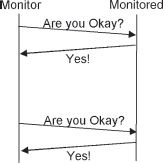

There are two variants to this solution: In the first one the monitored task sends a periodic, autonomous report to the SYSTEM MONITOR (15) to show that it is alive. In the second the SYSTEM MONITOR requests the monitored task give it a report. Choosing a variant depends on factors such as the complexity that will be built into the SYSTEM MONITOR, whether the monitored task can be enhanced with the automatic capability.

REALISTIC THRESHOLD (19) offers guidance on the frequency of the heartbeats.

WATCHDOG (18) describes a way of monitoring a task by watching its interactions with the rest of the system. WATCHDOG requires that the monitored task do something that can be watched.

If the heartbeats arrive, but do not look quite right, the SYSTEM MONITOR (15) must decide if it was a fault in the communications system, or if the monitored system is alive – but not well. Heartbeats can also be enhanced to check correctness of functioning.

Failures of the communications paths will appear as though the monitored system is not functioning because it didn’t respond to HEARTBEAT messages. FAULT CORRELATION (12) is needed to ensure that communication failures are detected.

The amount of time that a heartbeat message takes to go from monitored task to monitoring task, or round trip from the monitor, is also an indication of messaging delays. When the delays become too long error mitigation actions can be taken to improve system performance. Detection of message delays is input to the selection of the correct OVERLOAD TOOLBOX (42) of mitigation techniques that should be employed.

Heartbeats are useful when the monitor is a person. The IBM TSS operating system had a command called ‘BLEEP’ that added one dot to the display every few seconds. This gave an indication that something was actually happening. Today’s operating systems provide spinning disks or spinning hourglasses to reassure the human System Monitors that the monitored task is still working. …

# 17. Acknowledgement

… The monitored task is in regular communications with the SYSTEM MONITOR (15) or with a third party that the SYSTEM MONITOR can reliably share information with, for example the FAULT OBSERVER (10).

Information that a task has failed is only needed when the task is in use. If the task is unneeded the failure may remain latent and wait for some other mechanism to detect and correct it later. Detection does not always need to occur immediately, although faster detection leads to faster resolution. For example, in some cases the system only needs to know if a crash failure has occurred when it tries to use the crashed, monitored task, for example a daily report writing task.

Normal operations consist of a request (a query or instruction) from one task to another. It may or may not have a reply (an answer or a completion report). The target of the request (the task that will perform the action and possibly reply) is the system to be monitored. This could be either a client-server system or a system that requires peer to peer communication. In these systems there is a message flow that creates a two way dialog between the tasks.

Messages have overhead associated with them. Adding extra messages to the system increases the bandwidth requirements and has the potential to delay more important information.

**When there is a dialog between two tasks, what’s the easiest way for one task to determine that the other task is alive and functioning?**

You could add extra overhead by adding in separate mechanisms to report a failure, such as HEARTBEAT (16) messages but they add complexity and hence the potential for faults.

You could add the hardware or software elements to act as a WATCHDOG (18) but that also adds complexity.

An easy way is to add acknowledging information to a reply that is (or will be) sent. This is referred to as piggybacking. \[Tan81\]. This results in some additional complexity in both parties. The logic will be required in the requestor that looks for valid information in the acknowledgement. The monitored system might be asked to add some special information if it is aware that it is being monitored. If the monitored system is not aware that it is being watched then there might be no extra complexity required on its side.

A disadvantage of using the reply is that if there aren’t requests then there aren’t replies that can report a status. Even though information about a failure is only needed when a task is needed, if the system has the information earlier the failing task can be restored before it is needed.

If the request will take a long time then the requestor might think that the request has died. In these cases an interim acknowledgement that merely acknowledges receipt of the request can help. A response to the reply will be sent later, when the request completes.

If the communication protocol does not require a reply then this mechanism does not work, as there is no routine communication to which the acknowledgement can be added.

Therefore,

**Send an acknowledgement for all requests, <a href="#c05.htm#fig5.34" id="c05.htm#fig5.34a">Figure 34</a>. All requests should require a reply to acknowledge receipt and to indicate that the monitored system is alive and able to adhere to the protocol. If the acknowledgement reply is not received then a failure should be reported to the FAULT OBSERVER (10) and error processing should be initiated.**

**[Figure 34](#c05.htm#fig5.34a)** Requests are acknowledged

Missing an acknowledgement message does not always need to lead to reporting a failure. A REALISTIC THRESHOLD (19) can be set which can lead to better performance and a reduced number of false alarms. The system can be designed to RIDE OVER TRANSIENTS (26).

Refer to SYSTEM MONITOR (15) for a discussion of actions that might be taken if the Acknowledgement is not received.

This pattern does not address the situation where the target task is responding to requests with acknowledgements, but is not sane and is not processing the requests. Some other mechanisms such as CHECKSUMS (25), WATCHDOG (18) or COMPLETE PARAMETER CHECKING (14) are needed.

Refer to protocol literature to indicate how important acknowledgement of all messages is. …

# 18. Watchdog

… You are implementing a SYSTEM MONITOR (15). You are worried about adding complex software to the system because that can reduce the reliability.

There are a number of different contexts in which this pattern will apply. They represent different dimensions in your architecture; not all of them need to be met for this to be the correct pattern: You can’t spare messaging or processing cycles to add new, piggybacked messages that you’d have to add if you implemented HEARTBEATS (16), or you might have the ability to add special hardware to implement the monitoring functionality.

**How can the system ensure a task is alive with a simple mechanism and you can’t or don’t want to add to messaging or processing overhead?**

The first thought is to have the monitored function report its status. The patterns HEARTBEAT (16) and ACKNOWLEDGEMENT (17) add extra messages, or at least extra information to existing messages to report that the monitored task is actually working. But in many circumstances the messaging bandwidth has already been designed too small for the application and you just can’t add in any new messages. And if something is faulty it may not report its state correctly. Status reporting capability adds complexity, and hence the chance for additional faults.

If you can’t add messages to the system, you can add checks on the validity of the monitored tasks operations. One way discussed in other patterns is the redundancy based detection of errors. Perhaps the system can verify the results with another copy in parallel through N-Version Programming or sequentially through RECOVERY BLOCKS (4). However these techniques are very expensive, in terms of both processing resources and complexity.

One way of monitoring the system without increasing the complexity is to watch activities that happen routinely. For example, the monitoring task can watch to ensure that the communications are happening as expected. The monitor can ride on the coat tails of the monitored activities. Are messages going both ways? Are they frequent enough? The monitor doesn’t become part of the message stream, it watches from afar.

Another technique that adds only a little to the complexity of the system is to set a hardware time before a critical operation is started. At the end of the operation the timer is checked to determine if the timing was within acceptable limits. The timer can also be checked while the critical operation is proceeding to detect that it has not completed within acceptable limits.

Sometimes you can add new hardware to the design. A simple hardware component that will watch the monitored task’s execution can be built. It might monitor the control leads of a microcontroller, or it might watch a word in memory that the task is known to use, or it could be a passive observer watching an exchange of messages.

Even if new hardware cannot be added the monitor can watch some kinds of things from another process on the same processor or even from another general purpose processor (as contrasted with dedicated watching hardware).

Therefore,

**Add in the capability for the monitor to observe the monitored task’s activities, much as a Watchdog tends the flock. This Watchdog can be either a hardware or a software component depending on the system requirements, but in either case it will watch visible effects of the monitored task. The monitored task will not be modified, <a href="#c05.htm#fig5.35" id="c05.htm#fig5.35a">Figure 35</a>. The Watchdog should take some actions to get the monitored task back into the flock if it strays too far from expected and desired behavior.**

**[Figure 35](#c05.htm#fig5.35a)** A Watchdog interposes itself on message traffic

One way of implementing this is via peepholes or hardware test points to enable the Watchdog to look inside the tasks. \[RH03\]

This pattern is very similar to SYSTEM MONITOR (15). A key difference is that a SYSTEM MONITOR watches a number of tasks, whereas a WATCHDOG is assigned to monitor only one. Typically a WATCHDOG will report to a System Monitor and to a FAULT OBSERVER (10) when the WATCHDOG detects a failure.

SYSTEM MONITOR (15) describes the kinds of things that a WATCHDOG can do if it detects that the monitored task is not behaving properly.

Refer to *Patterns for Time-Triggered Embedded Systems* \[Pon01\] and related papers \[PO02\] for much more information about using WATCHDOGS in the microcontroller domain. The Space Shuttle avionics use WATCHDOGS to detect a failure in one of two operational general purpose computers. \[Skl76\]

EXISTING METRICS (20) contains an example of watching existing indicators. …

# 19. Realistic Threshold

… You are implementing a SYSTEM MONITOR (15) or related techniques to monitor critical functionality. The SYSTEM MONITOR takes action when something takes an unexpectedly long time.

**How much time should elapse before the SYSTEM MONITOR takes action when an error is detected?**

The elapsed time is a hard real-time constraint on the system execution \[Pfi98\]. The deadlines must be chosen with care.

Two different times are of interest, detection latency and messaging latency, see <a href="#c05.htm#fig5.36" id="c05.htm#fig5.36a">Figure 36</a>. Both require some care in choosing their values. *Detection latency* refers to how long the monitor, e.g. the SYSTEM MONITOR (15), should wait for a response before taking action. *Messaging latency* refers to the time between queries to determine the status of the monitored task. Detection latency values are typically expressed as an integer multiple of the Messaging latency. For example, the detection latency might be N missed messages and each of these N messages is sent ‘messaging latency’ apart.

**[Figure 36](#c05.htm#fig5.36a)** Latency terminology

Poorly chosen values of either detection latency or messaging latency will result in poor system performance. If either the messaging latency or the detection latency is too short the monitor is hypersensitive to minor interruptions. If they are too long the effectiveness of the monitor is diminished, because too many errors can occur before any error is detected. <a href="#c05.htm#fig5.37" id="c05.htm#fig5.37a">Figure 37</a> shows these possibilities.

**[Figure 37](#c05.htm#fig5.37a)** Problems with incorrect thresholds

For example, consider a system with the following parameters. The best case message round trip time from the monitoring task to the monitored task is 50 microseconds, and the worst case is 100 microseconds. The time is the same in both directions, so each message takes either 25 or 50 microseconds respectively. The monitoring task takes 20 microseconds to prepare a HEARTBEAT (16) message and 15 microseconds to process the reply message. It takes the monitored task 15 microseconds to process the HEARTBEAT and to reply to the monitor. For simplicity of the example assume that missing one message will result in the detection of a failure, and so the detection latency is set to one missed message.

With the example numbers above, if the messaging latency is set to 50 microseconds then failures will always be reported because this only accounts for the best case message passing time. It does not include the time required to process the messages, which totals to 50 microseconds. If the messaging latency is set to 1000 microseconds then even with the worst case message round trip time, the message will have been returned and allowance for processing time has been made. But in this case, with a 1000 microsecond messaging latency time, the monitored task might have failed up to 1940 microseconds before detection. This is because failure might have occurred immediately after sending a reply to a heartbeat message, at time 60 microseconds, but it will be the next heartbeat, sent at time 1020 microseconds, that won’t be returned and even that won’t be detected until the next heartbeat is about to be sent at time 2000 microseconds. <a href="#c05.htm#tab5.2" id="c05.htm#tab5.2a">Table 5.2</a> illustrates the timing for this case.

[**Table 5.2**](#c05.htm#tab5.2a) Example heartbeat failure

---

**TIME (***µ***S)**   **NORMAL SCENARIO**                                         **FAILURE SCENARIO**
0                     Monitor starts preparing first heartbeat                    Monitor starts preparing first heartbeat
20                    Heartbeat sent to monitored task                            Heartbeat sent to monitored task
45                    Best case message arrives at monitored task                 Best case message arrives at monitored task
60                    Monitored task replies to heartbeat                         Monitored task replies to heartbeat
60+                   Message in progress                                         **Monitored task fails**
80                    Heartbeat received by monitor with best case transmission
95                    Monitor completes processing heartbeat
1000                  Monitor starts preparing second heartbeat                   Monitor starts preparing second heartbeat
1020                  Heartbeat sent to monitored task                            Heartbeat sent to monitored task
1045                  Best case message arrives at monitored task                 Best case message arrives at monitored task
1060                  Monitored task replies to heartbeat
1061                  Message in progress
1080                  Heartbeat received by monitor with best case transmission
1095                  Monitor completes processing heartbeat
2000                  Monitor starts preparing third heartbeat                    Monitor starts preparing third heartbeat; the fact that the second heartbeat has not arrived is noticed and **failure is reported**.

---

There are several key relationships that must be considered when setting the thresholds:

 length of time of the recovering action, e.g. of the RESTART (31);

 communications round trip time;

 and the severity of errors that go undetected.

Look to your availability requirements for the guidance to solve this problem. For critical tasks, without an active load sharing companion, the monitor cannot afford to wait so long that one failure + the detection latency time + the time to restart the task exceeds the availability requirement.

If the task being monitored has parallel instances that can share the load while it is not working, especially with automatic load distribution by some other entity, then the detection latency time can be longer because load sharing mechanisms will adapt automatically to a failed instance.

The messaging latency in this pattern is almost always slightly greater than the communications round trip time. One reason is that having an excessive number of status messages in the system is considered a drain on resources, so generally the system should wait for a message to return or time out before sending the next message.

A minimal messaging latency is:

The worst-case communications round trip time;

+ the processing time at the component being monitored;
+ the processing time at the monitor.

This requires the monitor to be waiting for and processing only one status message at a time. If the monitor is not able to process the message immediately then you should also factor its delay to start processing.

A minimal detection latency value is one messaging latency interval. Setting detection latency to be equal to one messaging latency interval makes a very unforgiving system. Any errors at all will trigger an error report. Unexpected communications messaging latencies as well as slow target processing can result in errors being reported when the target has not failed.

Typically, however, the detection latency is set to be a small number of messaging latency times. For example, an error might be reported when three status messages have been missed.

Therefore,

**Set the** ***messaging*** **latency based upon the worst case communications time combined with the time required to process one HEARTBEAT (16) message.**

**Set the** ***detection*** **latency based upon the criticality of the functionality. Make it a multiple of the messaging latency. Use a smaller multiple for extremely critical or unique tasks, larger for REDUNDANT (3) tasks.**

**Set the latencies so that the monitor will be informed in a timely enough manner to meet the availability requirement, and yet is the maximum possible so that false triggers don’t occur.**

Max. unavailability &gt; message latency + detection latency + restart time

The best choices for the thresholds will maximize both latencies while minimizing unavailability, <a href="#c05.htm#fig5.38" id="c05.htm#fig5.38a">Figure 38</a>.

**[Figure 38](#c05.htm#fig5.38a)** Threshold maximization

The system can be built in a manner so that it will learn what to choose as realistic thresholds. When excessive amounts of missed or false triggers are triggered the system can automatically adjust the thresholds accordingly.

Refer to SYSTEM MONITOR (15) for a discussion of what steps it can take when the error is detected.

Techniques such as RIDING OVER TRANSIENTS (26) and LEAKY BUCKET COUNTERS (27) can help smooth responses and make even too short a detection latency work well.

The system can also be programmed to automatically and dynamically adjust the threshold values based on workload and feedback from the various system parts.

Here are some examples of real thresholds. The attitude computer on the Voyager spacecraft sends a heartbeat to the command computer every two seconds which detects a failure when one heartbeat is skipped. The frequency of checking was determined based upon an overload condition detected in tests using one second heartbeats. During the time between heartbeats the attitude control computer performs self checks. If any checks fail it does not send a heartbeat to the command computer. \[Tom88\]

Within the 4ESS™ Switch there is a heartbeat between the main call processing processor, the ‘1B’, and the Direct Link Node or DLN, a processor that interfaces to an attached token ring network that is used for external signaling. Since the heartbeat messages checked both that the DLN was still functioning, as well as measuring the congestion, a complicated heartbeat system was created. The message round trip time was determined to be about 100 milliseconds in the best case, with messages being sent every 120 milliseconds. The detection latency was set to be three missed messages. Since the heartbeat was also measuring congestion on the message path, the length of time that the messages took from the 1B to the DLN and back to the 1B was also used to trigger various error mitigation (overload) controls in an example of EXISTING METRICS (20) \[GHJ98\]. …

# 20. Existing Metrics

… The problem appears to be that more resources are needed than are available to process the workload. Depending on the system design the appearance of an overload can take different forms.

**How should we judge the severity of too many resource requests? Is there any way that the system might measure how the severity of an overload without contributing to the overload?**

Indicators can be created to measure the severity of the overload. Adding them to the system can give extremely accurate measures of the resource requests and of the availability of resources. But computing the indicators introduces additional overhead into the system. The system is already overloaded so this is a bad time to add overhead work.

You want to let the system process the arriving workload as best as it can. The system shouldn’t waste time on work that is unnecessary. This is discussed more in DEFERRABLE WORK (43).

When the system is working and processing the maximum workload that it can is also a bad time for an error to occur. Adding special software that will work primarily when the system is overloaded is risky because there might be latent faults within the section of code that is only executed during overload.

The operating system and other infrastructure parts have a variety of measurements built in. The system can use already existing indicators. Some indicators such as per cent CPU idle time can be used. This does not increase overhead, since the data is already available. The CPU idle time or alternately the processor occupancy is a metric that system designers include as a measure of workload and its variability.

These already existing indicators might not contain precisely the information that is needed to control the system’s overload. Instead of basing control decisions on the measure of average time spent to handle each request that succeeds, the percentage CPU occupancy can be used. It doesn’t directly report the time per request; it instead offers only an indication of the total system workload. But the time per request requires the collection of request duration and arithmetic on it to determine the metric. Processor occupancy is readily available within the system.

HEARTBEAT (16) and ACKNOWLEDGEMENT (17) messages are regular messages that can be expected in a system that employs those techniques. The amount of time that they take to travel across the system can serve as an indicator of messaging path congestion. This mechanism is used in the 4ESS™ Switch over a circuitous message path between two processors that goes through another processor along the way. When the time becomes excessive, overload controlling error mitigation is initiated.

Therefore:

**Use pre-existing indicators already tied to the resource as an indicator of the system’s overload condition, <a href="#c05.htm#fig5.39" id="c05.htm#fig5.39a">Figure 39</a>.**

**[Figure 39](#c05.htm#fig5.39a)** Use metrics already in place

The system will have data to allow it to assess the severity of an overload and to perform FAULT CORRELATION (12) on the system.

It is important to periodically REASSESS THE OVERLOAD DECISION (44) by checking the overload indicators. …

# 21. Voting

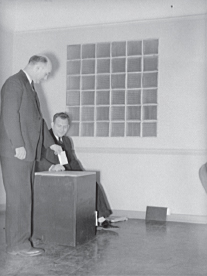

… REDUNDANCY (3) exists in the system. Not just any redundancy, but some sort of redundancy that provides multiple answers. This could be multiple hardware units working on the same problem and computing the answers separately. It might also apply to having multiple copies of a software element, all computing the same result in parallel.

The initial reason that you installed REDUNDANCY (3) is because you are afraid that the redundant element might have latent faults that prevent it from behaving error-free.

**The system has multiple answers. How does it know what answer should be used?**

With multiple versions of an answer how does the system know which one is correct? Refer to [Table 1.2](#c01.htm#tab1.2) in Chapter 1 which shows how many elements are needed to support certain numbers of faults/errors, for example 3n+1 to survive malicious failures. Deciding which of the responses is correct is a difficult problem.

Deciding a granularity level of redundant results to choose the answer is sometimes decided during the architectural design phase based upon the UNITS OF MITIGATION (1), but it is generally decided during design time. Smaller granularity provides simpler results, and the choices of acceptable alternatives will be smaller. Computing multiple versions of a result for comparison will use less processing resources because the computations are small. Comparisons at a higher level of abstraction are more likely to result in multiple correct results, but if there is variation in the computations the results are less likely to be identical. \[Tor00\]

You could make an assumption about which would be correct, for example that the ‘active’ element is the one that should be trusted. When there’s a disagreement this rule identifies that the ‘standby’ or secondary active element is the one with the fault. In order for this to work methods such as ROUTINE EXERCISES (23) are required to periodically check that the ‘active’ is working correctly. If the system does not, it can get into the situation where the ‘active’ is the one with the fault, but the “’standby’ is constantly being told that it’s at fault, and is isolated from service to enable its (non-existent) faults to be treated.

In some cases the ‘answers’ that need to be compared are quite large. This can pose a problem in network bandwidth, storage space, or timing to receive and compare. In cases like this a CHECKSUM (25) can be used to reduce the quantity of resources needed to decide. The Space Shuttle flight controls use checksums on the outputs of the four computers generating their commands to assess validity. \[Skl76\]

In some cases the answers that resulted from the various sources can be expected to be identical, for example integers or characters. In some cases however the results may deviate in ways that prevent direct comparison. The deviations can occur either due to inexact hardware representations, for example slight differences in floating point numbers, or the deviation can result from inadequate design or algorithm implementation. Chen and Avizienis \[CA78\] describe two ways of handling the cases where inexact voting is required. Adaptive voting schemes predict the results based upon past experience. These mechanisms work by predicting what the correct value should be and then taking the computational result that is closest to the predicted value. \[Tor00\] In one method, a weighted sum of the results is computed: \[CA78\]

Where the results to be compared are the Ri variables and the Wi’s are weights that are computed in a way to minimize the impact of erroneous Ri’s. The Wi’s are all positive and they sum to one. This requires a computation to arrive at the result, which can be quite slow. If the computed result, R, is used in further computations the system needs to ensure that the errors present in the results do not accumulate.

In non-adaptive voting an allowable discrepancy between the results to be compared is used to arrive at the correct result. Non-adaptive voting can be implemented by comparing the maximums or minimums of the differences between values with a threshold. If the results to be voted upon are all close to each other then any of the results can be used for continued processing. If the results diverge wildly, even if only a minority of them diverges, then the comparison will report the diverging value and some form of recovery or recalculation can begin. Choosing to use maximum or minimum is based on the context of the situation and the most likely types of deviations expected to be seen:

Where Dij is the absolute value of the difference between Ri and Rj.

There are cases where neither of these equations will ever succeed in finding a result. In order to use these you must know something about the data sensitivity of the algorithms in use, the capabilities and limitations of the computational hardware, and allowable thresholds.

Care must be taken to prevent any communications message latency from affecting the results of the voting. For example if the responses to be compared must travel some distance over a network before the comparison, appropriate waits and latches must be used to ensure that correct pairs of information are compared.

If there are more than two elements performing the calculation, for example in a system with triple modular redundancy, then a simple strategy is to conduct a majority vote to determine which computation is correct. These work with any number of elements greater than two, but beware of the scenario where there is no majority and the vote is evenly split. Four units can get into this situation where two can vote on each of the possible answers.

Other methods for selection in cases of multiple elements are generalized median voting, formalized plurality voting, and the weighted average technique discussed above. Generalized median voting selects the result that is the median of the computations by iteratively removing from consideration the extreme values. Formalized plurality voting divides the calculations into partitions based upon their value. An element is chosen at random from the partition that has the largest number of members. \[LCE89\]

Care must be taken if the voting is between results that are different yet correct. For example if the result is a grouping of data without a specified order then there can be more than one correct solution. A means of choosing one of the results must be designed.

Computer programs are generally deterministic, unless there are faults active. In the case of the redundancy presented at the beginning of this pattern any disagreement in the computation is the sign of an error. This is based on two assumptions. The first is that the redundant elements were given the same inputs. The second is that the elements were designed to produce the same results when given the same inputs. If these assumptions are true then any disagreement must be a sign of error.

Voting mechanisms of necessity cannot check for specific correct answers. They must instead check for whether the results are acceptable or consistent. \[Tor00\]

Therefore,

**Devise a voting strategy to select from the available solutions. If there is any disagreement with the vote, treat the element that loses the vote as erroneous and begin error processing on it. See <a href="#c05.htm#fig5.40" id="c05.htm#fig5.40a">Figure 40</a>.**

**[Figure 40](#c05.htm#fig5.40a)** Which one to pick?

With any voting scheme the design must mitigate the effects of malicious failures. These can split the vote or otherwise make it very difficult to determine which of the responses is correct.

The voting should be administered by SOMEONE IN CHARGE (8). With any voting method you must also make sure that you can trust the entity taking the vote. Is the voting circuit actually the element in the complex that contains the fault? This can prevent your vote from being correct. …

# 22. Routine Maintenance

… You are building a system that should tolerate faults and continue operation. Your requirements specify that the system should run failure-free for long periods of time.

Well designed systems avoid whole classes of errors that can be anticipated. Sometimes the errors result from faults that are very difficult to isolate and correct.

**How can we keep preventable errors from occurring?**

Data stored in memory might become corrupted by task errors, procedural mistakes or even electromagnetic radiation. Checking memory for errors can prevent the errors from spreading.

Memory leaks are a type of fault that occur in many systems. In general terms a memory leak is a loss of finite resources due to faults. When these faults are detected early, the system can prevent errors and failures by not allowing the fault to activate. The leak might occur because of a design or coding fault, or it might result from a failure to adequately FINAL HANDLE (50) requests. Unchecked memory leaks usually lead to failures. Periodic checks of memory usage and memory loss allow the system to return the resources to the available pool preventing errors.

Many systems perform Garbage Collection, generally depending on the nature of the programming language in use. Garbage Collection works in much the same way as the memory leak cleanup mentioned earlier.

CORRECTING AUDITS (2) are used to keep the system’s data error-free. The audits can be invoked on a routine basis to continually check the data, ROUTINE AUDITS (24).

Data and memory allocations are just two of the resources that can be checked and maintained periodically. Any other finite resource can also be checked and corrected if any errors are found; examples of checkable resources include network ports, network connections, and database connections.

Therefore,

**Perform routine, preventive maintenance on the system. See <a href="#c05.htm#fig5.41" id="c05.htm#fig5.41a">Figure 41</a>.**

**[Figure 41](#c05.htm#fig5.41a)** Set aside time for Maintenance

A little preventive maintenance avoids many common and easily preventable errors. Audits can be executed on a routine basis as can hardware exercises, ROUTINE AUDITS (24) and ROUTINE EXERCISES (23).

The preventive maintenance can be initiated either through an operator (or support system) request through the MAINTENANCE INTERFACE (7) or it can be built into the system to happen automatically.

Many operating systems and scheduling regimes make use of a system idle process to ‘eat up’ time not used by the actual process work. Low priority tasks can be run during this time to perform preventive maintenance on the system. One way of scheduling a routine task is to use a low priority in a multi-priority scheduler. The system can access the data and determine its correctness (i.e. whether it is fault-free). If it is not fault-free then either correct it or report the error and initiate error processing. If these audits are done in a low priority maintenance task, when the application gets busy, defer the work. This is discussed in DEFERRABLE WORK (43).

ROUTINE AUDITS (24) are a good technique to check through the data to determine if it is correct, and has not been corrupted. The audits look at the values and sometimes the meaning of the data to determine if it is correct. This is a form of ROUTINE MAINTENANCE. …

# 23. Routine Exercises

… You are building a fault tolerant system where some components are sitting idle waiting to replace a failing component.

This applies to the Active-Standby and N + M REDUNDANCY (3) schemes.

**How do you know that REDUNDANT (3) elements that will be called into service by a FAILOVER (36) in case of an error or failure will actually work?**

Failure-free operations do not exercise all of the hardware or all of the software in a system. Some of the hardware and software are intended for operation only when there has been a failure. Without periodic usage these components do not have the opportunity to report problems with their use.

You can blindly assume that the standby will be perfectly functional but that does not conform to the Fault Tolerant Mindset. Or you can assume that they might be broken and will not work. In that case, you should fix them before they are required to perform.

No tests are infallible. So even the best designed test might not identify latent faults. And since you can’t stop the system to check everything for latent faults you can’t perform very invasive tests.

Checking for latent faults can be accomplished by using the standby element to execute the application. Make the standby become the active unit. If it is fault-free then it should safely handle the whole load. If it has latent errors then it will fail. But then you know that it has a fault and shouldn’t be trusted. Perform a FAILOVER (36) and go back to the previous state.

An effective way to detect hardware transient faults is to perform the same execution at different times. \[Kop97\]

When an error occurs and a fault is identified in a component, the newly active unit should be removed from service to enable the service personnel to correct the fault. This leaves the system vulnerable to failures in the active components in a duplicated system that now has no standby REDUNDANCY (3). This problem is addressed by running ROUTINE EXERCISES during periods of relatively light workload.

When FAILOVER (36) to the standby is made to perform its routine exercises it should be monitored for a short period to see if it will fail. If no error occurs, allow the previous active, now the standby, unit to execute any of its built in tests or other diagnostic tests. This ROUTINE MAINTENANCE (22) will help it to be more trustworthy when it is made active again.

Therefore,

**Routinely exercise, or execute, the system components that will be required in an error situation. This will identify those components that have latent faults. The faults can then be corrected before a failure occurs that requires the faulty component to be used for real operation. See <a href="#c05.htm#fig5.42" id="c05.htm#fig5.42a">Figure 42</a>.**

**[Figure 42](#c05.htm#fig5.42a)** Alternate active unit to exercise them all

Generally this pattern applies to hardware units, although standby software modules can be exercised also.

After ROUTINE EXERCISES have been done the system can merely diagnose the units and leave them on standby, or it can diagnose then and make them active again.

Most hardware has some sort of check that is done when power is turned on. If there are not formal diagnostic tests, these can be used to check hardware.

When ROUTINE EXERCISES are performed, errors can occur. This is the goal of the routine exercise, but it is better to have a REPRODUCIBLE ERROR (60) uncover the error and the existence of a fault than to have the error occur when you can’t be certain that the standby itself will be fault-free. Sometimes the system owner will complain about errors being unearthed. The response to this complaint is to point out that the alternative would be much more severe, namely a failure during normal operation, perhaps during a busy period. In general, execute the ROUTINE EXERCISES during periods of low activity.

In some circumstances, the system administrator might want to defer ROUTINE EXERCISES to avoid further degrading their system.

Using the ROUTINE EXERCISES technique must be decided on an individual basis. Not every component in the system is important enough to operation that it needs exercising. …

# 24. Routine Audits

… The system has some idle time during which it can perform ROUTINE MAINTENANCE (22). Even though it might have real-time deadlines, there is some idle time that can be allocated.

The system employs CORRECTING AUDITS (2) to detect and correct erroneous data.

**Faulty data can exist in the system for a long time before it causes errors.**

Bad data is faulty. It causes errors in the system, for example incorrect computations, incorrect actions. Faulty data easily propagates throughout the system.

When the period of time between detection and recovery is long, there is a larger chance of another task using the erroneous data and making an erroneous (and possibly failing) decision with it.

It is much more desirable to find data faults and errors in a controlled way than to encounter them in normal operations. This is the data equivalent of a fail-silent failure. If found unexpectedly then the data might propagate to other parts of the system and cause other failures.

Checking all the data in a system for faults takes time. The system can penalize each data access by checking for errors at that point, which is similar to COMPLETE PARAMETER CHECKING (14). Or the checking can be done at a time when normal processing won’t be effected. This might be in an idle time slot, or it might be during the execution of a maintenance task. Good performance engineering recommends that processors not be scheduled for full processor occupancy, so there is some capacity available for ROUTINE MAINTENANCE (22).

Many operating systems and scheduling regimes make use of a system idle process to ‘eat up’ time not used by the actual process work. Low priority tasks can be run during this time to perform ROUTINE MAINTENANCE (22) on the system. One way of scheduling a routine task is to use a low priority in a multi priority scheduler. The system can access the data and determine its correctness (i.e. whether it is fault-free). If it is not fault-free then either correct it or report the error and initiate error processing. If these audits are done in a low priority maintenance task, when the application gets busy, defer the work. This is discussed in DEFERRABLE WORK (43).

Where there’s one error in data there might be others. When a data error is detected a prudent step is to consider what other data might be erroneous. The detected error might be the result of a number of computations that should all be considered suspicious and checked for errors.

Any detection of data errors should be logged to allow for causal analysis, so the occurrences should be reported to the FAULT OBSERVER (10).

Therefore,

**Routinely check data to find latent faults, <a href="#c05.htm#fig5.43" id="c05.htm#fig5.43a">Figure 43</a>. This checking should be done during idle times. If faults are found invoke CORRECTING AUDITS (2) to correct and report the fault.**

**[Figure 43](#c05.htm#fig5.43a)** Periodic audits in parallel with the application

The reliability of the system will be improved because the probability of faulty data causing errors is reduced.

The latent data fault should be reported to the FAULT OBSERVER (10) so that patterns and trends can be identified and corrected. If the data errors are numerous, or have the potential to cause a serious failure, then SOMEONE IN CHARGE (8) can trigger the ESCALATION (9) of data correction efforts. …

# 25. Checksum

… The system is fault tolerant so it detects and processes data errors. CORRECTING AUDITS (2) is the usual mechanism. The data might come from memory, or from the receipt of a message. Erroneous data needs detection.

*Data* in this pattern can be a structure or an aggregation; it does not need to refer to a single value.

One of the ways to detect incorrect data values is to store redundant information along with the value to be monitored.

**How can we detect that a data value is incorrect?**

The structure and contents of the data that needs to be correct in order to be fault tolerant spans a wide continuum of size from individual bits to large blocks of memory.

Maintaining a redundant copy of a data element in some place or manner that it can’t be changed enables detection of an incorrect data value. When a question of correctness is asked the value can be compared to the unchangeable copy; if they do not match one is in error. But that is impractical in many cases. Depending on the application algorithm you might not know in advance what data to save unchangeable copies for. A more practical reason to not save unchangeable copies is the amount of memory that would be consumed to store a duplicate of everything. Maintaining a few duplicate values for comparison is feasible if the algorithm enables it.

Another way of storing redundant information is to compute some aggregate value based on the data being checked. For example, in a structure that contains a number of integers the system can sum them. This is the mechanism employed in the Space Shuttle avionics to determine if command signals sent from multiple processors are correct. \[Skl76\] This works if the ordering of the values within the structure is insignificant. But if the ordering of the values has meaning then summing the elements won’t work, since addition is commutative. They might sum to the same value even though the addends (the data being checked) has changed.

A more sophisticated kind of redundant data is a checksum which is computed in a way that avoids the problem just mentioned. For it to be useful, it should be computed in a way that data values can be uniquely checked. The purpose of the checksum is to increase confidence that the data is being checked. Going backwards from the checksum to the original data is not required.

A simple example of a checksum to detect errors is the use of parity. The parity bit serves as a flag that the data it is watching has changed. Parity only detects the error. The concept is extended in ERROR CORRECTING CODES (57) by adding additional information that will enable the erroneous data to be corrected.

Hashing algorithms such as SHA, MD5 and others are used in many places to compute a checksum over a block of information to identify whether it altered either accidentally or maliciously. Hashing functions can be used to enhance fault tolerance by checking data that is received over transmission lines, or data that is stored on the system.

As an example, the 4ESS™ Switch uses hashing algorithms to serve as checksums on memory images stored on disk. Additional hash based checksums are used to ensure that the stored hash values are themselves stored correctly. Periodic ROUTINE AUDITS (24) compute the checksum of system memory. If the checksum does not match the stored value the region of memory is reloaded from disk storage.

Message checksums, such as the IPv4 header checksum, only help the system know if the message was transmitted correctly. It does not indicate whether the data that was initially sent was correct.

Therefore,

**Add a checksum to the data value, or over the block of data, <a href="#c05.htm#fig5.44" id="c05.htm#fig5.44a">Figure 44</a>. The CHECKSUM’S value is an indicator of whether the data is correct or not.**

**[Figure 44](#c05.htm#fig5.44a)** Compute a Checksum

When the data watched by a checksum is altered during normal operation it is important to recompute the checksum. Periodically recomputing CHECKSUMS for static data serves both as a validity audit and removes errors that might have been introduced into the checksum itself.

CHECKSUMS are solely for the purposes of detection. CHECKSUMS can be enhanced to become ERROR CORRECTING CODES (57) if enough information is present to enable the correct data value to be reconstructed. …

# 26. Riding Over Transients

… The system is in an environment where there are many potential errors that can occur and faults that might activate. Not all of them cause permanent failures. Transient faults and errors will disappear autonomously over time. Imagine a stretch of road where there are many bumps; each bump affects your vehicle for only a moment and then is gone. Lightning striking power or telephone poles can send a transient surge of electricity over the lines that all connected systems need to ride through, but the surge will disappear.

Error processing may ESCALATE (9) through successively more dramatic recovery strategies until it finds the right one, the one that masks or corrects the error.

**How can the system avoid wasting resources processing transient errors that won’t have a long term effect on the system?**

Many times the first signs of an error are not the true signatures of the error. The first appearances of a situation might appear like something different.

‘Patience is a virtue’ to allow the true signature of an error to show itself.

You want the system to be able to detect errors and failures as quickly as possible so that processing can begin. Premature error processing can result in taking incorrect actions.

You need to consider the possibility of transient errors during the design phase. The classic example of errors working themselves out is a lightning strike or a static electric discharge. A static electric discharge might cause a momentary error, but then its effects can totally disappear. Some other examples of transient errors are the noise on a signal bus or an alpha particle that toggles a bit.

The system should not waste time processing transient errors. There are more useful tasks to be completed. If a disk read returns with a parity error, repeating the read operation will succeed if the cause of the parity error was transient.

Errors have signatures that can be identified by FAULT CORRELATION (12). Combinations of effects seen when the error occurs enables them to be categorized. Signatures for errors that result from transient faults can be determined in advance and then used to determine if the error should be tolerated briefly because it is a transient, or if immediate action should be taken.

The length of time that an error or failure should be tolerated before error processing is initiated depends on the context. In situations where the error might easily propagate to other parts of the system, for example by corrupting data, the number of errors that are tolerated should be low. In other situations, such as web requests, many faults should be tolerated before error processing is initiated because the nature of the request is unreliable.

Therefore,

**Monitor the system and conduct FAULT CORRELATION (12) when errors occur. The system should begin error processing immediately if the error or failure is not one of those identified in advance as being transient. If the correlation indicates that it might be from a transient fault, monitor the frequency of occurrence but take no other action unless it is occurring more than expected, <a href="#c05.htm#fig5.45" id="c05.htm#fig5.45a">Figure 45</a>.**

**[Figure 45](#c05.htm#fig5.45a)** Transients pass through, other errors do not

If many messages are arriving that all exhibit the characteristics of faulty messages, the threshold for RIDING OVER TRANSIENTS must be very short to avoid filling buffers completely full of faulty messages. The risk of propagation during the threshold delay must be weighed against the effort to process a transient error that might not be present by the time the processing logic tries to isolate it.

Note that there are three cases identified here. Some errors and failures that are detected are clearly not transient and error processing should begin immediately. Of the errors and failures that might be the result of a transient fault, if they are occurring with a low frequency, error processing should wait until either another non-transient error occurs or the frequency of the errors or failures increases to unacceptable levels. The third case is where the frequency of a transient occurring exceeds a limit.

Error processing is only done for non-transient errors and failures. This is more efficient in terms of system resources and supports higher availability.

As an example, RIDING OVER TRANSIENTS can be lazily implemented by not checking the return code from disk writes. The assumption is that disks are inherently reliable. If the disk is operating correctly, the return code will identify it as such. If the disk has a permanent, non-transient error, then it has probably failed already and error processing will have prevented the attempt to write the disk at all. If the disk has a transient error, the code could be either success or failure; by not checking the code the system will ride over the transient.

At the other end of the spectrum web requests are inherently unreliable and so people do not wait very long to re-request a web page. If the request times out and they retry, they are riding over the transient network error, in this case ignoring that the error occurred. If every web page requested generates an error then permanent faults, such as DNS servers or proxies being out of service, are suspected. In these cases if the user has permission they will initiate error recovery or error mitigation to enable future requests to complete.

RIDING OVER TRANSIENTS is a combination of error detection and error processing. It is deciding that an error should not receive further, more intensive, processing. But regardless of whether the error in this case is determined to be a transient, it should be reported to the FAULT OBSERVER (10). Another part of the system with more information about system state might decide that this error that looks like a transient is not really a transient in this particular case and begin full blown error processing.

The pattern LEAKY BUCKET COUNTERS (27) describes a very useful mechanism for monitoring a situation and only reacting when it has been determined to be non-transitory. You should set the leaky bucket’s drain threshold to the time interval within which the errors, if non-transient, will reoccur. You should set the overflow threshold to a number that indicates that you are sure that if the error/failure were transient they would not reoccur that many times. When overflow occurs, the system should initiate error processing immediately. If the bucket drains completely you know that it was a transient. …

# 27. Leaky Bucket Counter

… You are designing a system that is intended to recognize and correct errors automatically. In this environment the system needs to know if a problem is something that comes and goes intermittently, or only happens once, i.e. is ‘transient’, or is a repeating permanent fault that needs to be corrected, RIDING OVER TRANSIENTS (26).

Not all errors are so critical that the first occurrence of them stimulates error processing.

This pattern is ideal for systems that deal with transactions where it is acceptable to ignore, process incorrectly or even discard individual transactions. The flow of transactions might bring multiple errors that could be either transient or permanent. The system wants to smooth the error triggering process.

**How does the system know if an error is transient or intermittent?**

Not all faults are permanent. Sometimes transient faults occur that cause errors which can lead to failures. By their transitory nature they are difficult or impossible to isolate and correct. Examples of transient faults include signal crosstalk, static electric discharges, lightning strikes or intermittently broken keys on a keyboard. The component that reports the error might be an innocent victim of the transient. It shouldn’t be punished.

In many cases you are willing to allow a certain number of errors if they aren’t too close together. If they come too close together you want the system to trigger some sort of error processing action.

Therefore,

**Each UNIT OF MITIGATION (1) that is to be watched has a LEAKY BUCKET COUNTER. The counter receives a predetermined value when the system is first initialized. Whenever an error is detected the counter is incremented. Periodically the counter is decremented, but never beyond its initial value.**

**Exceeding a predetermined upper threshold means that the errors are occurring faster than acceptable and the errors should be considered to be permanent and not transient.**

**Unless and until this happens the errors should be considered transient. See <a href="#c05.htm#fig5.46" id="c05.htm#fig5.46a">Figure 46</a>.**

**[Figure 46](#c05.htm#fig5.46a)** A leaky bucket

A counter incrementing past a predetermined threshold value indicates that the rate of error or fault events exceeds the allowable rate (as defined by the empty or leak rate, the rate of errors and the threshold value).

Applying this solution produces a system that can determine if an error is transient or permanent and react appropriately.

You must design the rate of emptying to a value that achieves the desired behavior. If the inflow of errors exactly equals the normal emptying then the system will reach a steady state and errors will not be reported. The steady state just mentioned indicates that the maximum number of allowable transients is being encountered. This maximum can be set (by changing the emptying rate) at design time, through configuration parameters or even through the system learning what a tolerable level of occurrence is.

If the empty rate is too high then the system will never identify non-transient errors.

Utas in \[Utas05\] provides an example implementation of a LEAKY BUCKET COUNTER.

In the 4ESS™ Switch the usual use of a Leaky Bucket is to trigger error recovery when the number of occurrences is more than three. The LEAKY BUCKET COUNTER is decremented by one every 30 seconds.

LEAKY BUCKET COUNTERS is a way of implementing RIDING OVER TRANSIENTS (26). Refer there for a discussion of what steps should be taken when faults are identified. …

# CHAPTER 6

# Error Recovery Patterns

Error detection, discussed in the previous chapter, does not ‘fix’ the error. The error is still present in the system and can still cause a failure. The patterns in this chapter address error recovery, one of the two means of processing the error and resuming error-free operation. Error recovery continues execution even with a detected error by placing the system in a state that does not contain the error. This means resuming execution at a known place, allowing it to continue processing at least as well as it did before the error was detected. The other means of error processing is error mitigation to mask the error. The next chapter discusses error mitigation.

Error recovery consists of two main parts. The first part involves undoing the bad effects of the error. The second part involves creating an error free state in the system that can resume execution. Both of these must use a minimum amount of time in order to maximize availability. REDUNDANCY (3) is used when possible to produce the fastest possible recovery.

Many of these patterns involve preserving system state through checkpoints. A CHECKPOINT (37) is an incrementally saved state that facilitates rapidly restoring processing to a point at which the state was saved. Restoring from the saved state decreases the time required to return to the same state that existed at the time of the error. Instead of having to replay the entire sequence of events from the beginning, processing can resume quickly from an intermediate state. This decrease in recovery time increases the amount of time that the system is available for service, which is its availability.

However, restoring a saved checkpoint is only part of error recovery. Many of these patterns correct errors by changing the system state to one where the error does not exist, for example by resuming execution at the point before the fault activated.

<a href="#c06.htm#tab6.1" id="c06.htm#tab6.1a">Table 6.1</a> lists all of the patterns in this chapter. Their order is that of the language shown in <a href="#c06.htm#fig6.47" id="c06.htm#fig6.47a">Figure 47</a> and also the order that the patterns appear within this chapter.

[**Table 6.1**](#c06.htm#tab6.1a) Error recovery patterns

---

**PATTERN**                      **PATTERN INTENT**
QUARANTINE (28)                  Take steps to isolate and confine a sick element to keep it from corrupting the rest of the system.
CONCENTRATED RECOVERY (29)       The system should have as few distractions as possible during error recovery.
ERROR HANDLER (30)               Provide a controlled manner for handling errors.
RESTART (31)                     Resume execution by restarting the program from the beginning.
ROLLBACK (32)                    Resume normal execution by moving to a state in the execution path but before the error occurred.
ROLL-FORWARD (33)                Resume normal execution by advancing to a future state that would have been reached if the error had not occurred.
RETURN TO REFERENCE POINT (34)   Resume execution by returning to a specific known state. That place might not have been in the execution path that led to the error, but it is known to be safe.
LIMIT RETRIES (35)               Do not return to the scene of an error without changing something, because the error might reoccur.
FAILOVER (36)                    Recover by switching to a redundant unit.
CHECKPOINT (37)                  Save state periodically so that it does not need to be regenerated from the beginning of execution.
WHAT TO SAVE (38)                Checkpoints should save information of global interest to long-duration processes.
REMOTE STORAGE (39)              Consider REDUNDANCY (3) and other recovery factors when deciding where to place checkpoints.
INDIVIDUALS DECIDE TIMING (40)   Let each process decide when to take a checkpoint based on their knowledge of their own needs.
DATA RESET (41)                  Restore some data to its initial (or a predetermined) value when it is found incorrect.

---

**[Figure 47](#c06.htm#fig6.47a)** Error recovery pattern language map

[Figure 47](#c06.htm#fig6.47) contains a language mapping of the patterns found in chapter 6.

When an error is detected it must be isolated and prevented from spreading. During detection, steps can be taken as described in ERROR CONTAINMENT BARRIER (13). When recovery begins it should QUARANTINE (28) the erroneous part to prevent spreading. Error recovery done with the least loss of availability is done in a single-minded manner, CONCENTRATED RECOVERY (29).

ERROR HANDLERS (30) are a common way to handle errors that occur during execution. They enable the collection of common error handling code in easy to maintain centralized locations. Many computer languages provide support for error handling mechanisms.

Error recovery returns the system to normal operation. After any active recovery, SOMEONE IN CHARGE (8) must decide from which point to continue execution. There are four basic places from which the execution can resume. The case that requires the longest to complete is to RESTART (31) the system and resume with a totally clean slate. In other cases execution can resume from a state close to the state that had the error. If the chance of repeating the error is low then a ROLLBACK (32) can be used. If the chances of repeating the error are high then ROLL-FORWARD (33) will be the most effective technique. In cases where the error was not in the primary application functions, for example when it is within the fault tolerance code, a RETURN TO REFERENCE POINT (34) is an effective technique.

The possibility exists with most of these techniques that the system will become stuck in a loop of error/error recovery/continued execution/error … It is important to build in the mechanism to LIMIT RETRIES (35) to break this cycle.

When the system has REDUNDANT (3) elements a common form of error recovery is to FAILOVER (36) to the backup elements. Resumption of normal operations after a FAILOVER involves both deciding where to begin processing within the new active unit and also the restoration of internal saved state from CHECKPOINTS (37).

Either the occurrence of an error, or the error recovery, frequently results in the loss of data. CHECKPOINTS (37) of system data help by enabling the return of data and system state to something between the time of the error and the initial state of the system. CHECKPOINTS are an effective technique, but lead to the need to decide WHAT TO SAVE (38); where to store it, REMOTE STORAGE (39); and when CHECKPOINTS should be taken, INDIVIDUALS DECIDE TIMING (40).

When it is the data that is faulty, a DATA RESET (41) might be initiated if the fault cannot be corrected.

# 28. Quarantine

… The system has errors. The system element with the errors has been identified. It might be a particular software module that is continually producing errors, or it might be a hardware element that is incorrect.

Every time the system is asked (or allowed) to perform work it responds with an error.

The presence of an error poses the risk that the error will propagate, i.e. that the error will be the fault that stimulates an error in a different element.

The system consists of UNITS OF MITIGATION (1) that encapsulate the functionality of the system.

**How can the system prevent errors from spreading?**

Information is passed between parts of the system through interfaces. When the information is erroneous it might activate a latent fault in the receiving part of the system. Even if it doesn’t activate a latent fault in the receiver, the receiving element might make incorrect decisions based on the error.

A Babbling Idiot is an element that sends messages at the wrong time. A Babbling Idiot starts talking to its peers consistently and erroneously. These babbling elements must be isolated and kept from spreading incorrect information throughout the system. \[Kop97\]

The information interface might be a software interface between elements/methods/procedures. Or if the element is hardware then there is some sort of interface between it and the other parts.

A common technique when designing the interface between potentially unreliable components is to place a parameter that gives an indication about whether the result should be ignored. If this indicator parameter is set to an unsafe value then the result should not be believed. This is similar to MARKED DATA (56)

In the best case the faulty nodes which might be UNITS OF MITIGATION (1) can be isolated from the rest of the system and totally removed from all application processing. If it is not doing anything it can’t create errors that can spread. Well designed UNITS OF MITIGATION will fail silently, making the isolation simple.

The software or hardware element might *have* to be included in the main application and therefore the system can’t isolate it. If the failing element must be involved in the computation, even though it has been deemed unreliable and as a consequence its result will not be used, you must then be concerned about side effects. What side effects might have happened when the element was performing its work? Did it send a message to another system? Did it alter memory? Did it change the system state? Side effects are difficult to undo.

The barrier around the faulty element must be impermeable so that not even side effects are permitted. Spacecraft will enter a ‘safe mode’ and wait for the involvement of ground personnel in situations where the on-board error processing mechanisms cannot handle the system. When in this mode they are quarantining the entire system to reduce the error propagation. This leaves the system in a known state for future ground-based corrective actions. \[Mor05\]

Therefore,

**Establish a barrier around the element that prevents it from both contributing to the useful work and also prevents it from propagating its error into other parts of the system, see <a href="#c06.htm#fig6.48" id="c06.htm#fig6.48a">Figure 48</a>.**

**[Figure 48](#c06.htm#fig6.48a)** Build a fence around the error

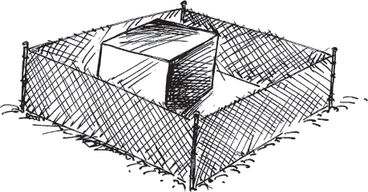

Parts of the system might be isolated in a Quarantine zone, meaning that the application is not totally available. Errors from a known-faulty UNITS OF MITIGATION (1) will not be propagated through the system. …

# 29. Concentrated Recovery

… An error has been detected. Now is the time for the system to process the error. System state has been saved through a series of CHECKPOINTS (37).

The system is required to be highly available. Minimizing recovery time increases availability.

The system has a number of techniques that can recover the system and its applications. These include saving system state periodically through CHECKPOINTS (37) and restoring it in conjunction with a ROLLBACK (32), ROLL-FORWARD (33), and RETURN TO REFERENCE POINT (34). Mitigation tasks such as MARKED DATA (56) are also related.

**When processing an error, how should the system minimize unavailability?**

The system should make the recovery as fast as possible. ‘Fast’ is in terms of the duration of the recovery. Time spent recovering is time that the applications are unavailable and is part of the application or system’s Mean Time To Repair.

With well chosen UNITS OF MITIGATION (1), part of the system can be recovering from an error while other Units continue execution. When the UNIT OF MITIGATION is in something of which there is only one, the whole unit must participate in the recovery.

Within a UNIT OF MITIGATION (1) the erroneous part that needs recovery or mitigation might not be the whole. This allows the possibility of the unit performing some non-recovery tasks during the error processing. Performing other work simultaneously with error processing introduces a number of risks.

These are some of the risks. The application state will be subtly changing even while the system is recovering. For example, new requests will be arriving or common resources will be used by another task. Contention for resources will make the recovery take longer. The amount of time required for the recovery will vary, making prediction and analysis more difficult.

To shorten the time of recovery the system should make its own recovery its primary task. If other tasks are unaffected by the error, lower their priority while recovery is underway to reduce the elapsed time for recovery.

The trade off here is between the speed of recovery and the handled workload. Speed of recovery is measured in unavailability while the handled workload is measured in terms of system throughput and revenue.

Deferring work that is arriving will require that it be dropped and ignored totally, or that it be buffered for future processing. The length of time for the recovery action defines which of these is needed. In most systems both capabilities will be implemented. Dropping the arriving work is a way to SHED LOAD (49). Several patterns including FRESH WORK BEFORE STALE (55) and QUEUE FOR RESOURCES (46) describe how the queued requests should be handled.

If the system is concentrating on recovery it might appear dead to its observers. Be certain to periodically let the connected systems know that recovery is underway and that requests will either be queued for later processing or discarded. The FAULT OBSERVER (10) can perform the notification.

Therefore,

**Focus all necessary resources on the recovery task so that the recovery time can be minimized. See <a href="#c06.htm#fig6.49" id="c06.htm#fig6.49a">Figure 49</a>.**

**[Figure 49](#c06.htm#fig6.49a)** Restrict other work during recovery

There should be SOMEONE IN CHARGE (8) making sure that the CONCENTRATED RECOVERY succeeds and doesn’t cause other failures. A QUARANTINE (28) around the recovering task should be created.

Extra work that can prevent error propagation (LIMIT RETRIES (35)) *should* be done during restoration. For example, incrementing error counters, notifying the FAULT OBSERVER (10) and supporting the actions of SOMEONE IN CHARGE (8) should be done. …

# 30. Error Handler

… The system has detected an error in execution. This error affects the overall control flow, and normal processing cannot continue unless some actions are taken.

**Developing and maintaining application code is complicated by the need to process errors.**

Error handling is non-productive work done by the system. It counts as time during which the application is unavailable. CONCENTRATED RECOVERY (29) might be fast, but it adds up and reduces overall availability.

When handling an error the system should stop error propagation, correct or mitigate the effects of the error, and report to the FAULT OBSERVER (10). This is all possible within the main application flow through the use of conditional branches. Since there are common actions that need to be taken for all errors it makes sense to set the common actions aside in a separate place.

When the same error can occur at multiple places in the same program, separating and reusing the handler minimizes overall code size. It also reduces the risk of updating only some of the local error handling blocks of code if a global change becomes necessary. The need to make the same change in multiple locations requires a significant maintenance effort and can easily introduce fault into the software.

Separating out the error handling logic into separate parts introduces the problem of correctly treating the context of each place that detects the error and invokes the handler. Each will be slightly different from the other places. The error handler must be able to correctly perform all the ‘clean-up’ tasks for all of the places from which it might be called. This requires careful planning to avoid coupling the error handler too tightly with the programs that invoke it.

The time spent processing errors is time not spent on the main functionality. Not every error that your program detects should be sent to an error handler. If something can easily be corrected in place locally and normal processing resumed, do that. Use an error handler when normal processing cannot be resumed for some reason.

Many languages support the concept of exceptions and error handling. When an error is detected an exception is raised. This exception marks the fact that normal processing cannot continue and that something special must be done to correct the situation. The special processing is done by the error handler. Similarly, RECOVERY BLOCKS (4) generally provide a final choice when none of the blocks completes successfully. The final choice when the others all fail is the error handler.

When handling of the error completes, pass control back to the application, which must be able to resume execution. The invocation of the error handler occurs as soon as error detection occurs, or should it be deferred and started later? This issue depends very heavily on the situation and the source of the error. Reducing the risk of error propagation should be foremost in your mind as you design the mechanism.

Sometimes the error detection mechanisms will detect errors that are trivial within the context where they were found. For example, an error from a file reading function might be an error or it might just be a signal that reading is completed. The interpretation depends on the context. In situations where the error is not really an error, the error handler should be able to distinguish this fact and allow execution to resume with only minimal action. In these trivial cases the error should not be reported to the FAULT OBSERVER (10) and the overhead of a separate error handler is not required. Cases of trivial or inconsequential errors should be handled by the detecting program inline and should not invoke the error handler.

Therefore,

**Separate error processing code in special handling blocks for easier maintenance and to facilitate new handlers being added in the future, <a href="#c06.htm#fig6.50" id="c06.htm#fig6.50a">Figure 50</a>.**

**[Figure 50](#c06.htm#fig6.50a)** Handle the error in an error handler

An error handler can process errors from across different parts of the system, centralizing its handling.

Some languages, such as C++ and Java, have predefined language constructs to support exceptions. Even if language support is not available, the system can mimic this behavior. Do not ignore exceptions that happen. Design the system to process them.

The error has been contained. Execution must continue from somewhere. In many cases it can resume at or near the point of error. Errors processed by a catch block are examples of this. Sometimes execution should return to a place right before the error occurred to retry the action that produced the error, being careful to LIMIT RETRIES (35). For example, for some of the errors possible from a database transaction retrying is the correct next step. Return to a point before the error occurred through a ROLLBACK (32) and the restoration of a CHECKPOINT (37). Resuming execution with minimal disruption is more likely if the error processing code resides within the same module as the point of detection.

Some errors that have affected major parts of the system make the choice of where to return to for normal execution unclear. For example, where should execution continue after an error involving a missing method or function is encountered? The system could immediately skip to some safe place, using a technique such as ROLL-FORWARD (33), or RETURN TO REFERENCE POINT (34). This would stop the control flow and prevent the error from propagating down the normal control path.

If there are resources that need to be ‘cleaned up’ and released from the task that has had an error, use FINAL HANDLING (50). …

# 31. Restart

… The error is really bad. None of the other mechanisms to recover from the error are appropriate.

ESCALATION (9) has resulted after the other possible ways of recovery are tried but have failed to recover the system.

**How can execution resume when recovery from the error is not possible?**

Some errors require very drastic action. The SOMEONE IN CHARGE (8) might have overseen a series of ESCALATION (9) steps, but none of the steps resolved the error. This is a truly persistent fault.

Restarting the application can resolve the error if the fault is in the application. If the fault is in the underlying hardware or operating system/middleware layers then the application restart will not help.

Many techniques such as ROLLBACK (32) and ROLL-FORWARD (33) recover the application by moving it to an error free state along the normal execution path. In some cases a RETURN TO REFERENCE POINT (34) is the appropriate state transition because it breaks (or usually breaks) from the error’s execution path to a pre-determined safe place. The point of initialization is a pre-determined safe place for most applications and systems. ESCALATION (9) needs additional actions to try when these techniques don’t work.

The system must return to service quickly after the recovery actions, so restarts shouldn’t be performed frequently if they take long periods of time. Different levels of recovery can be implemented that take different amounts of time. A ‘cold’ restart level will initialize everything as though it were the initial power-on of the system after a potentially unclean shutdown. Extra checks to ensure that the file system is in the proper state might be required as part of a cold restart. A ‘warm’ restart can restore the system to an initial value but skip certain lengthy steps. This relies on the assumption that the skipped steps are not needed based upon system state, for example that the file system is intact and does not need to be checked.

Sometimes the restarts can be done at a very fine level, targeting specific tasks or portions of tasks, for example, restarting only small groups of Java containers in an application server environment. This technique is very effective against transient errors. If the restart does not succeed in recovering then ESCALATION (9) to restarts of larger groups is possible. In order for this to be successful the error detection mechanisms must be able to isolate the fault to a very small part of the system. \[CBF+04\]

Therefore,

**Restart the system. Suffer the loss of time and state to reinitialize and restart the application from the beginning, <a href="#c06.htm#fig6.51" id="c06.htm#fig6.51a">Figure 51</a>.**

**[Figure 51](#c06.htm#fig6.51a)** Restart from the beginning

The decision to take this action is something that should be done by SOMEONE IN CHARGE (8) as a CONCENTRATED RECOVERY (29). The actions should be reported to the FAULT OBSERVER (10) so that the outside world can be informed that the action is happening. A SYSTEM MONITOR (15) can watch the recovery action to make sure that it starts and finishes as planned.

Restarting execution is frequently needed in conjunction with a FAILOVER (36) to redundant units.

CHECKPOINTS (37) enable state to be advanced rapidly to one that is close to the time of the error. A system RESTART followed by restoring from a saved CHECKPOINT quickly gets the system close to the state at the time of an error.

Sometimes it is useful to have different levels of RESTART. Each level takes a differing amount of time, which enables the most appropriate one to be used to minimize recovery time. These can correspond to different states. Typically the different levels will take differing amounts of time and be more and more drastic. The different levels are sometimes given names such as warm, cold, reload and reboot to indicate their severity. \[Utas05\] This gives ESCALATION (9) the opportunity to try less dramatic and shorter RESTARTS first.

An example of varying severity RESTARTS from the 4ESS™ Switch is shown in <a href="#c06.htm#tab6.2" id="c06.htm#tab6.2a">Table 6.2</a>. …

[**Table 6.2**](#c06.htm#tab6.2a) 4ESS™ Switch restart levels \[CCR+77, pp 1117–1118\]

---

**RECOVERY ACTIONS**   **ACTIONS TAKEN**
Phase 1                Software initialization only. Initialize many system variables and RETURN TO REFERENCE POINT (34) (The post recovery processing). No application (Call Processing) impact.
Phase 2                Hardware initialization only. Restart certain key (and problematic) hardware components. Perform only minor software initialization. Call Processing saves work in progress.
Phase 3                Hardware and software initialization. Call processing saves work in progress.
Phase 4                Only initiated manually. Hardware and software initialization. All application state is lost.

---

# 32. Rollback

… An error has occurred and recovery is now complete. The ERROR HANDLER (30) has completed execution, if there is one in the system. The system is in a context where accuracy is very important, and no bit of incoming information can be ignored. For example no request, incoming message, transaction or sensor input should be ignored.

Requests that were begun or that arrived between when the error occurred and recovery is completed should have an attempt to be thoroughly processed.

**Where should processing resume after error recovery?**

In some kinds of systems that are receiving incoming requests, the requests cannot afford to be missed. They might contain critical bits of telemetry data, or financial information that cannot be lost.

The system will need to be returned to a known place in its execution where the components are synchronized. The point where a new work request is begun is an example of a synchronization point where the system is ready to work on the new request.

If a CHECKPOINT (37) is available then the system state can be restored to the one that it was in at the point to which the rollback will proceed. The timing of the CHECKPOINT defines the rollback points. If there are no checkpoints then the rollback should take processing back to right before the last requests were started. Requests should be saved until completed so that if a rollback occurs the requests still exist and can be processed again.

When the system state is rolled back some work will be done twice, once before the error and once afterwards. Care must be taken to ensure that side effects of this repeated work does not cause new problems. Redoing some of the work prevents rolling back from being a useful solution in some hard real-time applications, where deadlines might be missed when work is redone.

The assessment of what will be lost by skipping requests can be ignored if a rollback is performed. This is unlike the case of a ROLL-FORWARD (33).

Depending upon what system state will be restored during the ROLLBACK there is the chance that the error will reoccur. LIMIT RETRIES (35) discusses the problem of preventing repeating a cycle of errors and error recovery.

Therefore,

**Return to a point where processing can be synchronized that is before the point of error, <a href="#c06.htm#fig6.52" id="c06.htm#fig6.52a">Figure 52</a>. Tread carefully to LIMIT RETRIES (35).**

**[Figure 52](#c06.htm#fig6.52a)** Return to an earlier time

The decision to take this action is something that should be done by SOMEONE IN CHARGE (8) as a CONCENTRATED RECOVERY (29). The actions should be reported to the FAULT OBSERVER (10) so that the outside world can be informed that the action is happening. A SYSTEM MONITOR (15) can watch the recovery action to make sure that it starts and finishes as planned.

If ROLLBACKS aren’t succeeding in returning the system to normal operation, be careful to not get stuck trying, see LIMIT RETRIES (35). If a ROLLBACK does not succeed, ROLL-FORWARD (33) is a step that ESCALATION (9) can take.

Sometimes so much has happened that the system can’t tell where to ROLLBACK to, but ROLL-FORWARD (33) is not appropriate either. In these cases the system should have REFERENCE POINTS that it can RETURN TO (34).

There are some things that the system can do to restart the transaction. It might need to restore from a CHECKPOINTED (37) state to achieve the state before the error occurred. What the stable points are that should be rolled back to help define when to actually take a CHECKPOINT, as discussed in INDIVIDUALS DECIDE TIMING (40) …

# 33. Roll-Forward

… An error has occurred. The ERROR HANDLER (30), if employed, has now completed execution; error recovery has been completed.

Ignoring or mishandling a few requests that arrive between the time of error and the time of restarting is acceptable. The message stream might include killer messages that need to be avoided and not processed.

**Where should processing resume after error recovery?**

The system can return to the point of the error after error recovery. But the processing context was interrupted by the error and its processing. If CHECKPOINTS (37) are being made, there will be one closest to the time of the error, but it will not be precisely at the time of the error. The risk of starting a cycle of errors and error processing is great unless something has changed in the context. Eliminating a killer message from a buffer or setting an execution flag to indicate there has already been an error in this section are two changes to the context that can be made.

In some cases returning to the point of error will be appropriate. For example, if the point of error processed a sensor reading that arrives periodically, it will be safe to return to that point and wait for the next reading to arrive. Similarly, if the design of the system prevents any killer messages in the input stream from still being present, returning to the site of the error will be safe.

Not all system designs provide for low risk of repeating the error when returning to the place of the error. And even with careful placement of the error reporting and handling mechanisms sometimes returning is not the right thing to do.

Returning to the point of the error, or to a ROLLBACK (32) point before the error can result in work being done twice or incompletely. Advancing to a point where all of the related application and system tasks can be resynchronized and where they can all proceed forward from is desirable. This can be accomplished faster than a ROLLBACK (32) that involves redoing some work. This in turn makes rolling forward appropriate for hard real-time systems.

Many fault tolerant systems are event driven. This means that they are responding to external stimuli, such as incoming web service requests or transaction requests. In these cases a safe thing to do is to advance to the point where the next stimulus is to be received. In other words totally ignore the transactions that were being processed when the error was detected. Of course this does not work if the transaction cannot be ignored. For example if it was crediting a bank account then obviously the transaction cannot be merely ignored. In this case ROLLBACK (32) is appropriate.

Before a roll-forward can be made, the damage caused by the error must be assessed to be certain that the point being advanced to will be valid. Only if the damage has been mitigated, or will be obviated by the jumping forward, can moving to a forward state be safely done. This is to prevent propagation and the repeating of the error, LIMIT RETRIES (35).

The ERROR HANDLER (30) is a useful way to manage rolling forward.

Therefore,

**Advance to the next point where the processing across the system can be synchronized. Do not resume execution from the point of error; continue as though the erroneous actions did not complete (or did complete successfully), <a href="#c06.htm#fig6.53" id="c06.htm#fig6.53a">Figure 53</a>.**

**[Figure 53](#c06.htm#fig6.53a)** Move past the error

In an event driven system rolling forward causes the system to ignore the rest of the current stimuli, discarding it, and jumping to the point in execution where the next stimuli is received to be processed.

The decision to take this action is something that should be done by SOMEONE IN CHARGE (8) as a CONCENTRATED RECOVERY (29). The actions should be reported to the FAULT OBSERVER (10) so that the outside world can be informed that the action is happening. A SYSTEM MONITOR (15) can watch the recovery action to make sure that it starts and finishes as planned.

The system’s state is a future state that would have been encountered eventually if the error had not occurred. The effects of the error have been mitigated and masked so that the error state is not visible. …

# 34. Return to Reference Point

… Something very wrong has happened. The system wants to recover from the error, but it is unclear where it should resume.

It frequently occurs when an error is detected in an execution flow that is not part of application processing. For example this occurs when an error occurs during support processing such as maintenance or error processing. In these cases a ROLLBACK (32) to a point in the execution flow is not helpful because that is not the main application flow. A ROUTINE AUDIT (24) is an example of processing outside the normal application that could encounter latent faults.

Some errors are so bad that neither ROLLBACK (32) nor ROLL-FORWARD(33) are the appropriate actions, but not quite so bad that RESTART (31) is needed. The error is insidious but can be contained so that it does not jeopardize future actions or result in error propagation. The system is designed to LIMIT RETRIES (35).

**Where can execution resume when an error occurs that can be recovered but for which the recovery does not provide appropriate ROLLBACK (32) or ROLL-FORWARD(33) places?**

Sometimes, as in the example of a ROUTINE AUDIT (24), ROLLBACK (32) does not help because the application does not need the audit code to be rerun at the point rolled back to. The application will benefit from returning directly to application processing. Similarly ROLL-FORWARD (33) to the end of the audit code helps execution of the audit code continue, not the application. In some cases though simply rolling forward does not take the system to an appropriate place.

A RESTART (31) can solve the problem well but errors in support processing don’t mean that the application needs to be restarted from the beginning. However, a RESTART takes time and affects the whole system. The error can be mitigated and execution resumed without incurring the penalty of time and state that a RESTART incurs.

Reference points are not the same as ROLLBACK (32) points. The places that execution might return in a ROLLBACK scenario are places from which execution can continue because they contain completely coherent states without the error, for example the point at which the most recent CHECKPOINT (37) was saved. ROLLBACK points are dynamic, that is they are created during execution such as when state is saved, and they change with time. Because they are dynamic, determining to which ROLLBACK point execution should continue is determined when the ROLLBACK is needed.

Reference points, on the other hand, are static and are always available as recovery points. They are created at design time. One or more reference points are created for any given module. Most tasks will have some point relative to their own execution that is a safe place. In many cases this is the place where the task is just about to enter its own initialization stage, or is just exiting its own initialization stage. These make good reference points. Another potential reference point is at the point where the support task is about to return to the main application.

Therefore,

**Resume execution at a point that is known to be safe, and from which normal execution can resume, <a href="#c06.htm#fig6.54" id="c06.htm#fig6.54a">Figure 54</a>.**

**[Figure 54](#c06.htm#fig6.54a)** Move to a specific place in the code

The decision to take this action is something that should be done by SOMEONE IN CHARGE (8) as a CONCENTRATED RECOVERY(29). The actions should be reported to the FAULT OBSERVER(10) so that the outside world can be informed that the action is happening. A SYSTEM MONITOR(15) can watch the recovery action to make sure that it starts and finishes as planned.

Execution has resumed at a place from which the application knows how to proceed.

In the C language longjmp provides the mechanism to RETURN TO A REFERENCE POINT. …

# 35. Limit Retries

… When deterministic software executes it produces the same results whenever given the same stimuli. Faults are usually deterministic also: whenever they receive the same stimuli they will cause an error in the same way. A software error will occur when the faulty software encounters the same event with the same data and the same state.

The reason for CHECKPOINTING (37) is to preserve the consistent state and starting data. In some systems the incoming events to be processed will also be captured and reapplied. This might take the form of a log of the events, or merely the retransmission by the far end of the messages that the target system has not acknowledged. If the stimulus needed to cause activation of a latent fault is present in the saved state, or in the message when that stimulus is given to the fault, the fault will reactive and the error will reoccur.

**Faults are deterministic; when a latent fault is given the same stimuli it will activate in the same way. Reprocessing stimuli from before an error can result in the error reoccurring. The primary objective is to preserve overall system operation, which might only be possible at the expense of individual transactions.**

When error processing chooses to return execution to a point encountered earlier in time, there is a risk that the same stimuli will be present and will cause the error to reoccur. A common place for error causing stimuli to lurk is in killer messages that are saved and marked as unprocessed. Another common location for error causing stimuli to exist is within the saved data in a checkpoint.

If the events to be processed are being delivered to a distributed system with a series of computers in, for example, an N+M REDUNDANCY (3) arrangement then the failure will march through the entire system, failing one processor after another.

A bad or ‘killer’ message can cause the error to reoccur repeatedly unless handled carefully. When the message is buffered inside the system, the system can delete killer messages from the buffer before a restored system attempts to reprocess the killer message. The system is especially susceptible to the killer message being distributed to each processor that is restarting after error processing – and causing each to fail in turn. If this is a possibility, and the general system availability is more important than the processing of each individual message, then the internal message buffer should be flushed.

One way to dispose of only the killer messages is to keep track of which message is currently being processed and delete it from the queue when either it is processed successfully or when it has been found to be killer. When every message contains important information and can’t be deleted, a separate queue of suspicious messages can be used to hold them until they can be processed later within a QUARANTINE (28) zone.

When messages are buffered, buffer overflow is possible. This is something to be aware of, especially if the message buffer is being added to by a processor or part of the system that is not reacting to the killer message. Strategies to stop buffering new requests must be put in place to prevent buffer overflows.

If messages are not buffered internally then we have less control over the submission of messages. The sender of the killer message can retransmit it when the failed processor does not send an acknowledgement. In this case a logging mechanism to enable the system to preserve recent enough state to be on the lookout for the arrival of such a killer message is needed. Limiting the number of retransmissions in the messaging protocol as well as a panic message from the failed or restarted system both help in this case.

Repeated killer messages might be a sign of a denial of service attack on the system. Typically network firewalls or router/switch capabilities are used to detect and isolate malicious traffic. Killer messages should be logged and the log available for either automatic or manual examination to determine if a malicious attack is occurring.

If the killer event is the result of some internal action then the system should implement a scheme to ROLL-FORWARD to avoid the event being regenerated. Sometimes it is best to skip some work rather than to recreate an error that takes part of the distributed system down. In this case an internal firewall is an effective technique to judge whether the event might be harmful and, if so, eliminate the event.

Failures that are related to the presence of certain data and that cause resumption from a checkpoint are reduced through safeguarding the data through audits and other common error detection and correction methods.

Therefore,

**Strategies to handle the reoccurrence of errors in execution and data should be implemented to prevent repeated cycles of errors. See <a href="#c06.htm#fig6.55" id="c06.htm#fig6.55a">Figure 55</a>.**

**[Figure 55](#c06.htm#fig6.55a)** Don’t retry if errors are likely

In [Figure 55](#c06.htm#fig6.55), the fault recovery tasks should not return to execute Task B when the fault might still be present. Instead transition to Task C should occur.

When appropriate safeguards are implemented the system should stop the propagation of errors within itself. This will lead to a more available system and one that handles a dangerous environment in a more fault tolerant method.

Techniques such as RETURN TO REFERENCE POINT (34), RESTART (31), and ROLL-FORWARD (33) all take the system to states that might not immediately reencounter the fault. …

# 36. Failover

… The system has REDUNDANCY (3). The system has detected an error in one of the redundant elements (hardware or software). Unfortunately it is the active element that has the error or has failed.

None of the recovery or mitigation techniques have worked. The system has ESCALATED (9) through state changes, which haven’t masked the error. Techniques such as ROLLBACK (32), ROLL-FORWARD (33), and RETURN TO REFERENCE POINT (34) were tried and did not succeed in restoring error-free execution. In addition, none of the mitigation techniques such as SLOW IT DOWN (53) resolves the error either.

**The active part of a group of redundant elements has a fault; how can error-free execution continue?**

REDUNDANT (3) elements are added to the system so that when an active element fails or needs error processing, execution can continue on the redundant element. This is exactly the situation presented in this problem and context.

The switching from the active to the standby must occur in an orderly way. Switching must occur quickly to minimize the downtime associated with the error detection or failure. Ideally, to continue execution the non-active unit should be placed in the same state as the active unit at the time when the error occurs.

Data that is used by the failing active unit must be persistent in some way so that the redundant unit that takes over can have access to it. REMOTE STORAGE (39) discusses storing the data in a place that doesn’t fail with the active unit.

The system must have SOMEONE IN CHARGE (8) of the transition from the failing active unit to a redundant one. This entity must ensure that the redundant unit is ready to accept control. The controller must also manage the transition to ensure that it happens quickly and without further errors. It must make certain that the element placed in control after the switch doesn’t succumb to the same error, and if it does it must administer further error processing steps.

The choice of redundancy regime has great effect on the speed with which the switching can occur. If the redundant elements are considered to be ‘hot’ standbys the switchover can occur very quickly with minimal outage of the main application. If the standby is only ‘warm’ then it will require time to return to the same application state. CHECKPOINTS (37) help to get there more quickly. When the standby is ‘cold’, it must be started from an inactive state, which adds time. After it has been started it can be treated as a warm standby.

When the redundant elements are sharing the workload of tasks a true failover cannot be used. This is the situation where the redundancy has been established in an Active-Active manner and the workload is being shared among multiple elements. Because the redundant element is already processing workload, the load balancing algorithm should move load from the failing element to the unfailed element. Minimal unavailability will result, although the overall throughput of the system will suffer because now there is one fewer element processing the load.

Generally the state cannot be magically installed on the non-active element and instead a controlled transition is required that employs ROLLBACK (32), ROLL-FORWARD (33), or RETURN TO REFERENCE POINT (34), possibly with a restoration of CHECKPOINT (37) data. This complicates the transition and requires that the transition from (failed) active to (new) active unit be proactively managed by SOMEONE IN CHARGE (8) to make sure that everything happens correctly.

A problem that can occur when a new element becomes the active one is that the current active element does not relinquish control. This presents the problem of a dual master. Dual masters must be detected and corrected as quickly as possible. A difficulty in implementing an algorithm to detect and correct a dual master situation is that the element that was originally the active one has an error, which is why it is being removed from service, and so may not be sane enough to relinquish control.

SOMEONE IN CHARGE (8) can instruct other parts of the system to send workload to the new active and starve the formerly active element, either by changing the load balancing or changing IP address mappings. Another way of stopping a dual master is to have the two elements compare certain data created for this situation and select the element to continue operation that meets a criteria such as most recently started, lowest count of errors encountered, lowest work processed, etc. These examples will select the unit that has just been restarted instead of the one that has been executing longer but has an error.

Therefore,

**Switch system execution from the current active element to a redundant element, <a href="#c06.htm#fig6.56" id="c06.htm#fig6.56a">Figure 56</a>.**

**[Figure 56](#c06.htm#fig6.56a)** Failover to a redundant unit

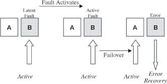

In cases where the detected error is very severe or wide-ranging, FAILOVER should be the first thing tried. ESCALATION (9) covers this case.

Whichever choice of standby state is made for the system, some assurance that the standby element will be able to perform the work is needed. ROUTINE EXERCISES (23) describes a way to check if this will be the case.

The system’s execution can continue on the new element. Use the fault treatment techniques (Chapter 8) to identify, isolate, and correct the fault in the formerly active unit. …

# 37. Checkpoint

… You are building a system that should be fault tolerant. This pattern applies both when the system needs high availability (continuous operation, e.g. telecom), as well as when correctness is required (e.g. banking).

The work that arrives at the system for processing cannot be completed instantaneously. Sometimes a fault activates and causes an error during that instant. This might be something hardware related – a power problem or a chip failing, or it might result from a software error in a different part of the system, or it might result from a fault within the UNIT OF MITIGATION (1) processing the work request.

**Work in progress might be lost during the recovery from the error.**

When either hardware or software errors are detected they must be isolated and processed quickly. Many actions that might be taken to isolate or remediate an error will involve rolling the system back to a known place through a ROLLBACK (32), or back to a system startup state, RESTART (31). All the work that has been performed since this state was last executed will be lost. This might amount to a significant amount of work, especially if the system has been operating for a long time. The *state* of the system is the combination of local variables, execution location (i.e. the program counter), and workload status that defines what the system is doing at any specific instance.

In most systems the tasks will not have existed for a long period leading up to the time of error. Proper selection of the synchronization point to ROLLBACK (32) reduces the amount of work that is lost from those tasks that have been running since startup without pausing to save their work. One extreme is to RESTART (31) the system.

Going to the other extreme will force each process/task to continually save information so that it can determine all the internal state needed to resume the task that it was performing. Tasks can be designed to be able to resume operations from saved task variables and state information.

A compromise is to save a complete checkpoint and then save incremental changes to the state. These incremental changes can be actual changes or they can be the requests and transactions that can be ‘replayed’ to return to the current state.

It takes time to save state. If the failure rate is low this is wasted work. If, however, the failure rate is quite high then lots of time can be saved, and it can pay off to save state frequently. Similarly saving large amounts of data takes time that, depending on the failure rate, will end up as overhead. But if the checkpointed data is even used once then recovery can be much faster.

There are many examples of checkpoints. Checkpoints are saved by long-duration computations executing on massively parallel processor systems where the thousands of processors, taken together, have a short MTTF. The checkpoint allows resumption on a different processor making good use of REDUNDANCY (3). Database systems create a checkpoint periodically and then store incremental transactions that can return the system to the point of the error. Unmanned spacecraft make the equivalent of a checkpoint before they download data to earth stations. This provides a backup in case of communications failure. \[Tom88\] Computer users make a backup copy of data and programs periodically to all restoration to a previous saved state. ‘Backup’ usually refers to times measured in days rather than the short time scales needed to minimize unavailability.

Therefore,

**Save state periodically, <a href="#c06.htm#fig6.57" id="c06.htm#fig6.57a">Figure 57</a>. Build in the capability to restore the system to the same state that was saved, without having to recreate the entire execution from startup to the point of the saved state.**

**[Figure 57](#c06.htm#fig6.57a)** Periodically saving state information

Multiple different processes or tasks saving states frequently consume large amounts of storage. Saving it infrequently reduces memory requirements. However, the point is ongoing continuous (and accurate) execution, not the ability to recreate all of the intermediate states. Stored states may be deleted shortly after either a new state is stored or a restoration from a stored state is conducted.

Checkpointing usually occurs in conjunction with a ROLLBACK (32). The point at which the checkpoint is taken becomes the synchronization point that processing returns to.

Several trade offs exist here. Saving state too often results in excessive storage. Saving it infrequently increases the delay in achieving the actual state at the time of interruption. See INDIVIDUALS DECIDE TIMING (40).

Where will the system save the state information? It must be rapidly accessible but not somewhere in the same UNITS OF MITIGATION (1) because it may be unavailable for use depending on the nature of the error. REMOTE STORAGE (39) discusses this in the context of REDUNDANCY (3) and FAILOVER (36).

Recurring, permanent software errors are another problem. The system must LIMIT RETRIES (35) because when the software encounters a software fault and stops, and execution is restored from a stored state and retries the code with the fault, the error will reoccur. The saved state will not help. Some other mechanism must prevent infinite looping from saved state, LIMIT RETRIES.

The consistency of saved state is very important. If INDIVIDUALS DECIDE TIMING (40) then it is possible that not every task in the system saved state is at the same time. In order to resume execution at a state from which all tasks can proceed, care must be taken when designing when to create the checkpoints. This is discussed in INDIVIDUALS DECIDE TIMING as well as in articles by Elnozahy et al. \[EAW+98\] and Saridakis \[Sar03\] who discuss algorithms to create consistent sets of states to which we can restore. …

# 38. What to Save

… The system is going to save state in a CHECKPOINT (37) occasionally. This will enable it to return to the saved state in case of failure. The computing system/environment has many different processes that are all important to someone. Some deal with the main application of the system. Some are purely administrative in nature.

**What state information should a saved checkpoint contain?**

Many of the system processes are stateless. For example, those processes that purely respond to requests, such as requests from management systems. Saving state does not make any sense for these processes. The *state* of the system is the combination of local variables, execution location (i.e. the program counter), and workload status.

Some processes have long lives and depend greatly on saved state. These can benefit from saving state because then it will not have to recreate the entire processing chain to resume execution at the current location.

Most systems have some global information. All parts of the system need to know what the global values are, and they will influence execution, independent of state. The global data values are attributes of each processes’ state. The global information might not be used as global information by all the parts of the system. It might be used by the operating system, for example, to maintain overall system state but be inaccessible directly to the application.

It takes time to save state. If the failure rate is low, this is wasted work. If, however, the failure rate is quite high then saving state frequently pays off in the amount of time spent recovering. Similarly saving lots of data takes time that depending on the failure rate will end up as overhead. However, higher availability will result from using the checkpointed data even once.

Saved state must be consistent. Consistency is a major concern when determining when to create checkpoints. INDIVIDUALS DECIDE TIMING (40) discusses the issue of consistency with respect to the timing of the checkpoint. When deciding what information to save in a checkpoint, include the information necessary to ensure that a set of stored state data from various checkpointing tasks is consistent. This includes common pointers and identifiers that can be compared.

Therefore,

**Save information that is of interest to all processes (the global information). Also, save information about the long-duration processes that depend on a long progression of state. See <a href="#c06.htm#fig6.58" id="c06.htm#fig6.58a">Figure 58</a>. This information realizes the most benefit.**

**[Figure 58](#c06.htm#fig6.58a)** What information should be saved?

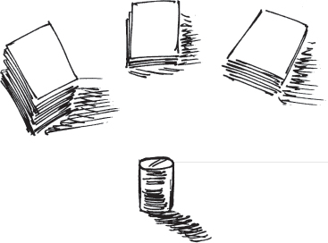

Sometimes good choices for what to checkpoint can help with LIMIT RETRIES (35) to prevent error propagation. For example information that can help SOMEONE IN CHARGE (8) know that a restoration from a CHECKPOINT (37) and ROLLBACK (32) have already occurred.

INDIVIDUALS DECIDE TIMING (40) discusses when the checkpoints should be made. …

# 39. Remote Storage

… The system uses REDUNDANCY (3) for its processing elements through either an Active-Standby or load-balancing scheme.

The system will not save a copy of the entire system state when a CHECKPOINT (37) is taken, only a part of it, WHAT TO SAVE (38). You want it to be in a safe, reliable location so that you can count on its being there if a ROLLBACK (32) or RESTART (31) is required. The goal of the checkpoint is to provide the most available system, which requires that the recovery be quick.

**What storage location should be used for CHECKPOINTS (37) to reduce the time before execution can be resumed after error recovery?**

CHECKPOINTS can be stored in a number of locations: Local memory, local disk space, remote processor, and remote disk.

Restarting the failing processor from a checkpoint saved locally has advantages such as reduced hardware, since the system does not need additional backup processors; the checkpointed state information can contain processor specific information; and, the processors may be tailored to their function and do not need to be generic to the lowest common denominator. However, restoring a checkpoint on a system requires that the system be operational. If a certain checkpoint can only be restored on a certain processor it must wait for the processor to be restarted and stable before the checkpoint can be restarted. This will lengthen the period of unavailability.

Migration of the failed processes to a separate processor can help the restoration from checkpoint to occur more quickly. If the failed processor requires a complete restart, the checkpointed processes will have to wait for the system to reach a level of basic processing before execution begins. This lengthens the restarting process. The new target processor can be up and running at the time of the error, ready to begin restoring from a checkpointed state immediately, which will minimize the time of no service. This is a standby mode.

If there is no REDUNDANCY (3) in the system then obviously the checkpointed data must be restored to the failing processing element.

It is important to be mindful to not create a single point of failure in the form of the global storage or the checkpoint storage system. This device must also employ appropriate backup and recovery mechanisms.

The checkpointed data storage must be in a place that the new processing element can access it if a processing element other than the one that saved the checkpoint will use it to restart.

Therefore,

**Store the saved checkpoints in a centrally accessible location. This enables a new processor to access the saved checkpoint which minimizes the period of unavailability.** <a href="#c06.htm#fig6.59" id="c06.htm#fig6.59a">Figure 59</a> shows checkpoint data being stored in an external, common place. It might be stored on a shared, globally accessible data storage medium, or it might be stored in an external processor with sole responsibility for the management of checkpoints.

**[Figure 59](#c06.htm#fig6.59a)** Store checkpoints externally

This pattern can help you decide whether and how much REDUNDANCY (3) you should design into the system. If checkpoints save the important state information, and you want to restore from a checkpoint quickly, then adding redundant elements can help.

The system should not always save everything forever. This will take too much storage – and if really forever it will not release memory. WHAT TO SAVE (38) and INDIVIDUALS DECIDE TIMING (40) discuss the kinds of information to save and the timing of checkpoints. …

# 40. Individuals Decide Timing

… The system is making CHECKPOINTS (37). Some critical information that is saved (WHAT TO SAVE (38)) is part of the infrastructure. Some is part of the application. Some infrastructure processes are state sensitive and checkpointing the data is beneficial.

**A checkpoint contains information from across the infrastructure or kernel or operating system and application boundaries. Who should decide when to save a checkpoint?**

The operating system can create a snapshot of state. Each process must have a flag to tell the operating system that its state is ready for checkpointing. If there are many processes to be included in a snapshot taken at one time then the time to make the snapshot can be long unless special mechanisms are in place to speed it up. When the checkpoints are coordinated, processes might also have to be paused to wait for other processes to become ready for a checkpoint. For many tasks, the time of a common checkpoint will not be ideal, because it results in wasted time.

If the system has no faults, and hence never encounters an error that causes a restoration from a saved checkpoint, there is a high time overhead associated with creating checkpoints. All processes will have overhead associated with the checkpoint preparation, even though they won’t benefit from it.

The state of a process might change during the snapshot creation. Is any other work being done while the snapshot is being created? If there is then the state that is being snapshotted might not be the actual state. State should change between when snapshots creations; otherwise why save the new state?

An alternative is for each process to create a snapshot when it needs to. The problems with this arise after an error when the state is being recreated. Not everything will have taken a snapshot at the same time. Some effort reconciling and rolling back to a consistent checkpoint state will be required. These are so-called ‘independent checkpoints’. They are also ‘dynamic’ checkpoints since they are created as they are needed or become valuable, unlike ‘static’ checkpoints which are only taken at the start of an execution sequence.

Specific triggers can be used to create an independent checkpoint. For example, triggers can be when a particular message is received, or when the process knows it is a good point for a checkpoint. Communication induced checkpoints occur after the processes exchange information to rendezvous on the correct time to take a consistent checkpoint. \[Sar03\] Using a trigger to stimulate the creation of a checkpoint has the appearance of being random to an outside observer. Other times that a checkpoint can be created include at regular time intervals with respect to the overall processing time. These are ‘equidistant’ checkpoints. A ‘modular’ checkpoint is taken when control passes from one module to another. \[Nic95\]

If the system has failed and has to restore from a saved checkpointed state the resulting system state must be consistent. Consistency is a major concern when determining when to create checkpoints. <a href="#c06.htm#fig6.60" id="c06.htm#fig6.60a">Figure 60</a> illustrates the problem. If processes A and B are exchanging a message, there are two places in time where the checkpoint may be taken. These are indicated as ‘Checkpoint 1’ and ‘Checkpoint 2’. In the case of Checkpoint 1, A has a record that the message has been sent to B, but B has not yet received the message. Checkpoint 1 is inconsistent because A and B do not share the same view of the message. Checkpoint 2 is considered consistent because both A and B have a record that the message was sent from A to B.

**[Figure 60](#c06.htm#fig6.60a)** Checkpoint consistency

System resources must be balanced between those required to create a checkpoint and those required to recreate state from checkpointed data. If system state will be restored frequently from checkpoints then use the needed resources during creation to ensure that consistent states are saved. Use a mechanism such as coordinated checkpoints where all state is saved simultaneously. If system state is restored from saved checkpoints infrequently then enable each task to independently determine when to take a checkpoint.

Another solution is to create a big state checkpoint periodically and store only incremental updates/logs to it. This is most appropriate when WHAT TO SAVE (38) is very large or if the state that is being stored is very transactional, resulting in discrete entries that can be saved. Database systems employ this technique to take a checkpoint and then record individual transactions in the form of journal entries. The sum of the checkpoint and its journal entries is equivalent to the next checkpoint that will be taken.

When there is infrequent interaction between the parts of a system storing information globally in the CHECKPOINTS (37), common CHECKPOINTS are better. If the system has hard real-time requirements then local checkpointing decisions are best because they reflect the local state and its deadlines more accurately.

Therefore,

**Each process should take a checkpoint at the best time for it to do it. The effort to recreate a consistent processor view will usually be less than the time to create very large checkpoints such as those created by some global entity such as the infrastructure or kernel or operating system.** Checkpoints will be occurring at various times, <a href="#c06.htm#fig6.61" id="c06.htm#fig6.61a">Figure 61</a>.

**[Figure 61](#c06.htm#fig6.61a)** Make CHECKPOINTS at best time for each task

LIMIT RETRIES (35) discusses factors to consider when scheduling checkpoints to keep from propagating errors.

CONCENTRATED RECOVERY (29) discusses the effort and resource that should be applied to restoration after an error necessitates the use of a saved state.

The consistency of saved state is very important. If INDIVIDUALS DECIDE TIMING (40) then it is possible that not every task in the system saved state at the same time. In order to resume execution at a state from which all tasks can proceed, care must be taken when designing when to create the checkpoints. For further information about algorithms to create consistent sets of states to which the system can restore, consult Elnozahy et al. \[EAW+98\] and Saridakis \[Sar03\]. …

# 41. Data Reset

… Data has been found to be faulty. There are no CHECKPOINTS (37) of the data so previous version cannot be restored. The system employs CORRECTING AUDIT (2) to detect and correct data errors. There is not enough information for the data to be reconstructed or resurrected.

It is data for which the initial value is known or the first value can be recomputed.

**What can we do to recover from an unreconstructable, uncorrectable data error?**

There are normally two ways of correcting an erroneous data element: to correct it by an audit or to restore it from a checkpoint. Neither of these is possible in the case considered here.

It is possible that the system will be in a state where the correct value of an erroneous data element cannot be corrected by a CORRECTING AUDIT (2). This can be because of errors in the system or propagation of this error.

The identification of WHAT TO SAVE (38) did not identify the erroneous data element, so the data has not been saved in a CHECKPOINT (37).

What’s left when neither of these options is available? The only option is to set the erroneous data element to a particular value. The easiest, and most effective, value to set the data element to is the value that it was initialized with.

When the data has no initial value or starting point to which it can be returned the next steps that the system takes depend on the criticality of the data. If it is relatively insignificant then some approximate value can be set, for example the middle value if the data has a well defined range. From this starting point the system can adjust the value through normal operations to a more correct value. If the data is significant to correct operation, then a return to a previously saved CHECKPOINT (37) even if the value in question is not saved as part of it and resumption from a different point where the data is known, such as through a ROLLBACK (32) or ROLL-FORWARD (33) is the appropriate course of action. If there is no such point, the place to return might be the system’s initial state, through a RESTART (31).

Therefore,

**Reset the data value to its initial value, <a href="#c06.htm#fig6.62" id="c06.htm#fig6.62a">Figure 62</a>.**

**[Figure 62](#c06.htm#fig6.62a)** Reset to the initial value

The initial value is one that was once valid. It may or may not be valid later.

In the 4ESS™ Switch, the most severe recovery action that the system can initiate automatically sets all dynamic data to their initial values.

In many cases, when one data element is reset, others will also need resetting. When this happens, the system must move into a new state where the initial values represent a coherent state. For example if the erroneous data element is a count of the number of elements in a set and it is reset to zero indicating that the set is empty. If the set is not empty then the system state is inconsistent and corrective actions are needed to correct it. This might mean transitioning to a system state where the number of elements in the set can be recomputed, or it might mean emptying the set so that the count is correct. Resetting values to their initial value is very similar and might behave like a RETURN TO A REFERENCE POINT (34) or a RESTART (31).

The data error has been corrected, but the system state might be inconsistent, as noted above. The system will be ready to proceed as though the error had not happened, but it might not be doing precisely the same work as it was before the error was detected. …

# CHAPTER 7

# Error Mitigation Patterns

The patterns in the previous chapter discuss error recovery methods in which the state of the executing system is changed to permit the system to continue. The patterns in this chapter describe ways to mitigate the effects of the error without changing the application or system state. The mitigation techniques mask errors and compensate for their effects.

Errors are manifest as either an incorrect value or system state; or as a missed timing requirement or constraint. These patterns describe ways to mitigate the effects of both of these types of errors. When the error is of a value or state kind, the mechanisms described in these patterns correct or change the erroneous value and state, or the underlying fault, so that processing can continue from the point at which the error was detected. This differs from the patterns presented in the previous chapter that are concerned with taking the system to a new state from which execution can continue without the error.

When the error is missed timing or other issues as the result of an excess of workload, the patterns in this chapter present proven techniques to mitigate the effects by giving the system the means to gracefully survive the excess. The underlying faults may not be directly addressed because they might not be local to the overloaded system. For example, the performance error might be the result of an excess of work arriving at the system from outside. The patterns instead design mechanisms into the system to make it possible to continue operation even with the excessive arriving workload. Eventually the arriving load will diminish, at which point the system should return to normal operations. The patterns in this chapter offer alternatives to enable the system to survive the excess and return to normal operation, without causing other errors and failures that persist after the overloading workload returns to normal levels.

In Chapter 1 the fact that most fault tolerant systems are designed to handle only a single fault was discussed. The mitigation techniques in this chapter enable multiple faults to exist in the system and be contained. Multiple data faults can be marked and isolated through the MARKED DATA (56) pattern. Many of the patterns in this chapter address system performance problems, or overload, through many mitigation techniques that enable the system to continue working without failing. These performance related mitigation techniques do not block other error detection and processing activity from occurring. Thus if another, non-performance error is detected it can be processed concurrently to the mitigation of the performance error. However error processing activities can be very disruptive to the normal flow of processing through CONCENTRATED RECOVERY (29), and many requests for service can be QUEUED FOR RESOURCES (46), waiting until after the recovery is completed.

The various RAID standards for disk play a role in mitigating data errors. For more information about RAID, please see Chapter 2.

<a href="#c07.htm#tab7.1" id="c07.htm#tab7.1a">Table 7.1</a> lists all of the patterns in this chapter. Their order is that of the language shown in <a href="#c07.htm#fig7.63" id="c07.htm#fig7.63a">Figure 63</a> and also the order that the patterns appear within this chapter.

[**Table 7.1**](#c07.htm#tab7.1a) Error mitigation patterns

---

**PATTERN**                          **PATTERN INTENT**
OVERLOAD TOOLBOXES (42)              Have separate collections of techniques for dealing with different kinds of overloads.
DEFERRABLE WORK (43)                 A system that is performing well in an overload situation does not need to be fixed by ROUTINE MAINTENANCE (22).
REASSESS OVERLOAD DECISION (44)      Periodically check that the error detection and correlation was correct.
EQUITABLE RESOURCE ALLOCATION (45)   Divide the resources up equitably between all the requestors.
QUEUE FOR RESOURCES (46)             Queue requests for resources in a way that will protect the system.
EXPANSIVE AUTOMATIC CONTROLS (47)    Protect the system from too much work/traffic by providing new ways to do the work.
PROTECTIVE AUTOMATIC CONTROLS (48)   Protect the system from too much work by restricting what work is allowed into the system.
SHED LOAD (49)                       Discard some requests for service to offer better service to other requests.
FINAL HANDLING (50)                  Gracefully remove resource allocations using the same means that normal processing does to save effort and reduce faults.
SHARE THE LOAD (51)                  Move some processing to another processor. When deciding what to move, look for things that are clearly separable because this will reduce the amount of synchronization that is required.
SHED WORK AT PERIPHERY (52)          As work proceeds further into the system, more effort is expended on it. To minimize the wasted effort on work that will be shed, discard it where it first enters the system.
SLOW IT DOWN (53)                    Sometimes the best thing to do when many errors are occurring is to slow down. Transients might clear and the permanent errors will become evident.
FINISH WORK IN PROGRESS (54)         Categorize arriving work as either new work or related to something that is already in progress. Give priority to work that continues work that is already in progress work.
FRESH WORK BEFORE STALE (55)         Giving better service to recent requests enables at least some of the requests to get good service. If all requests wait in a QUEUE FOR RESOURCES (46) then none of them receives good service.
MARKED DATA (56)                     Mark erroneous data so that others are not corrupted by it.
ERROR CORRECTING CODES (57)          Add redundant information to data so that errors can be detected as in CHECKSUM (25) and also automatically corrected.

---

**[Figure 63](#c07.htm#fig7.63a)** Error mitigation language map

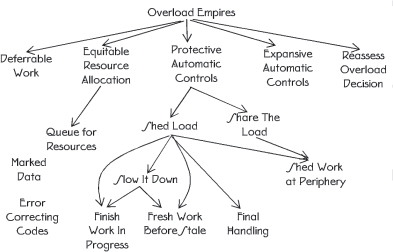

[Figure 63](#c07.htm#fig7.63) contains a language mapping for the patterns that address methods of mitigating errors.

Many of the errors that can be mitigated are timing or overload related. They are characterized by too many requests for service, too few resources, or too little processor time. The first step to mitigate these errors is to recognize that different techniques are needed for each of these categories. OVERLOAD TOOLBOXES (42) discusses the need for different techniques for each type of timing error.

One of the key premises is that if the system is working hard processing requests then it must be working well, so don’t fix it, see DEFERRABLE WORK (43). In other words check how the system is performing and possibly reduce the ROUTINE MAINTENANCE (22) that is conducted to allow the resources to be used for real work. Another key premise is that the system should REASSESS OVERLOAD DECISION (44) periodically because overload and the error symptoms produced can vary rapidly, so the mitigation technique decided moments earlier may no longer be correct.

When there are tangible resources that are in short supply the system should ensure an EQUITABLE RESOURCE ALLOCATION (45). This might mean that requests are QUEUED FOR RESOURCES (46).

Automatic actions in the face of timing errors fall into two broad categories: expansive and protective. EXPANSIVE AUTOMATIC CONTROLS (47) are ones that expand the resources that the system has available, possibly allowing it to use extra memory, or new network connections. PROTECTIVE AUTOMATIC CONTROLS (48) take steps to protect the system from being crushed by the overhead that comes from the overload. Firewalls and workload barriers are used to protect the system from the excess workload.

One of the most basic PROTECTIVE AUTOMATIC CONTROLS (48) is to SHED LOAD (49). When work is being shed there is usually some bookkeeping to be done to account for the particular requests that are discarded. FINAL HANDLING (50) says to reuse normal functions and methods during this process.

SHEDDING LOAD (49) is most effective if the work can be shed close to the periphery of the system. This is discussed in SHED WORK AT THE PERIPHERY (52). The ability to shed work close to the boundaries of the system is also a sign that the system is able to SHARE THE LOAD (51) between different parts of the system. SHARING THE LOAD is another useful PROTECTIVE AUTOMATIC CONTROL (48).

A step towards SHEDDING LOAD (49) is to SLOW IT DOWN (53). This pattern describes how the system will fully process only the work that it can, and ESCALATE (9) the error mitigation if the techniques in use are not proving effective.

When too much work is arriving at the system it must decide whether to continue work that is already in progress or to begin processing the new work. The pattern FINISH WORK IN PROGRESS (54) describes concentrating on the work that has been started rather than stopping work on it in favor of merely accepting new requests and putting them into a queue.

Queuing requests is an effective technique to buffer an arrival rate that is too high. Which queuing method depends on the nature of the incoming workload. The technique of FRESH WORK BEFORE STALE (55) is usually best when requests are generated by people, and also frequently best when requests are generated by other systems.

Data errors can be mitigated by marking the data so that it is not used by other parts of the system. This marking takes the form of a flag to indicate that other parts of the system should not use or trust the value. See the pattern MARKED DATA (56). Sometimes the data can be corrected if enough REDUNDANT (3) information is saved with it. This is described in ERROR CORRECTING CODES (57).

# 42. Overload Toolboxes

… FAULT CORRELATION (12) of the situation within the system is complete and the system decided that it is not an error caused by faulty hardware or software. It is an error from an excess of workload. Overload situations occur when the system loses the resources necessary to handle its workload efficiently. This might be due to internal problems, such as memory leaks or excessive maintenance work requests, or from too many requests coming from external sources. Internal problems are really faults within the system and should be handled through the fault recovery system. When external systems send too many requests for service too quickly the system must handle as many as possible and then degrade as smoothly and as little as possible.

**How should the system handle situations of overload?**

Too many requests for service can be taxing on a system in a number of ways:

 Memory: more memory might be required to store the requests than the system has available. New requests can’t receive the resources that they need to be processed.

 Tangible resources: the requests might require the use of tangible peripheral resources that are already in use. The new requests must wait for the resources possibly causing further errors in the system.

 Processor CPU time: processing the requests might take more time than the system has. When the sum of all the request processing time and system overhead exceeds 100% then not everything will be done.

There are a variety of techniques designed to address these resource overloads. Some techniques work best with only specific types of resources, and don’t help mitigate others. Some techniques will work for all three. Trying to manage one type of overload with a mechanism designed for another might have devastating results.

Therefore:

**Have multiple toolboxes with which to mitigate overloads. One toolbox is for managed resources like buffers or ports being controlled by the system, another for memory, and yet another for processor CPU time.** **Avoid grouping all of the possible techniques together, as they will only rarely work well for overloads in other categories. See <a href="#c07.htm#fig7.64" id="c07.htm#fig7.64a">Figure 64</a>.**

**[Figure 64](#c07.htm#fig7.64a)** Different tools for different errors

An effective technique to deal with overloads of the tangible variety is to QUEUE FOR RESOURCES (46). EQUITABLE RESOURCE ALLOCATION (45) discusses a way to divide up the tangible resources such as memory and peripheral equipment.

A technique similar to QUEUING FOR RESOURCES (46) that works for CPU cycles which are intangible is to take on FRESH WORK BEFORE STALE (55). The capabilities to SHARE THE LOAD (51) with peers or to SHED LOAD (49) also help with CPU time.

Knowing whether the system is in processor or resource overload requires some way of measuring the overload. The system should use EXISTING METRICS (20) to evaluate overloads.

You should consider user/consumer/customer behavior when designing the system’s mechanisms to deal with an excess amount of work. Both FRESH WORK BEFORE STALE (55) and FINISH WORK IN PROGRESS (54) consider this behavior in their solutions.

In a network of peers, strategies can be designed to enable one peer to notify its neighbors that it is in overload and seek assistance in handling the traffic or in reducing the load from its peers. …

# 43. Deferrable Work

… More new work is arriving than the system can normally handle. The mitigation techniques are working and the system is stable.

The system schedules ROUTINE AUDITS (24) and other ROUTINE MAINTENANCE (22) tasks to keep the system working well. They are important to keep errors from occurring in the system. The workload is already presenting a performance error, or overload to the system, and the design of most systems enables them to tolerate only one error at a time.

The system is mitigating some of the effects of the excess application workload. This overload is keeping the system more than normally busy with its main application work. The EXPANSIVE AUTOMATIC CONTROLS (47) and PROTECTIVE AUTOMATIC CONTROLS (48) are working well and the system is able to process the workload, although it might be SHEDDING LOAD (49). The system is stable, which is to say that the overload is not causing non-performance related errors, workload is being processed at a very high level and the system will be able to ramp back down once the overload is over. In other words it isn’t broken.

**What work should the system shed when the choices are handling most of the new incoming work or the routine maintenance workload?**

The incoming workload can use all the resources that are being allocated to the preventive or ROUTINE MAINTENANCE (22). There are not enough resources to handle both the new work and to continue the routine work. This routine work keeps the system fault tolerant. The choice is to reduce the revenue producing work even more or to restrict some of the activities that prevent errors.

The system has very stringent availability requirements, which is why a system of audits, defensive checks, and integrity monitors is in place. These parts of the system ensure that the system is working at its peak efficiency and is detecting errors to contain and correct them quickly.

But if the system is in overload and is stable, system resources are all being used to process the workload. Everything must be working well since the system is stable. It makes sense to defer the work that comes to play when the system is *not* working properly, such as ROUTINE MAINTENANCE (22) and ROUTINE AUDITS (24). These deferrable items perform tasks that are not critical to processing the workload. If it is working at capacity or above and doing it well, do not check if it works: concentrate on the primary aspects of operation.

Therefore,

**Make the routine work deferrable. If the system is tending toward overload, chances are that the periphery and software are working, otherwise where would all that work be coming from?** Refer to <a href="#c07.htm#fig7.65" id="c07.htm#fig7.65a">Figure 65</a>. If the system is not broken and it is merely working hard, then it doesn’t need to be fixed.

**[Figure 65](#c07.htm#fig7.65a)** Congestion squeezes maintenance

There is a chance that the system just *seems* like it’s in overload, though it may be really reacting to errors. In that case, SOMEONE IN CHARGE (8) should employ REASSESS OVERLOAD DECISION (44). REASSESS OVERLOAD DECISION also addresses when this strategy is not providing enough relief and the system is not really stable.

Everything that the system does is important to someone. But not everything is directly related to the primary purpose of the system. Tasks should not be deferred forever because that lowers the overall fault tolerance of the system. …

# 44. Reassess Overload Decision

… The system is attempting to FINISH WORK IN PROGRESS (54) as well as to SHED LOAD (49).

The system is overloaded with work requests. The system is employing error mitigation techniques such as DEFERRABLE WORK (43) to reduce the impact of the overload. Decisions about what techniques to employ were based on FAULT CORRELATION (12).

**What should the system do when the workload mitigation techniques being used are not working to diminish the workload?**

What happens if load keeps increasing in spite of all attempts to slow the system down?

The system is well engineered so that work shedding keeps the system from becoming saturated. The mechanisms such as to SHED LOAD (49) are working, yet the influx of new requests or the compounding of internal inefficiencies are not producing the desired reduction in workload. These mechanisms create a feedback loop that should keep load from getting out of hand.

Something is wrong if we have not processed any new requests for service in a long time. The system is designed to perform some work, such as to process web requests or telephone calls. If that work is deferred or skipped for too long a period, the system is unavailable.

A major goal of the error mitigation techniques is to preserve system integrity so the system can handle the routine level of traffic after the period of overload ends.

If the mitigation techniques are not enough to bring the system out of saturation, then the error may be coming from a source other than traffic overload.

Therefore,

**Provide the system with a feedback loop which provides information to enable the system to reexamine FAULT CORRELATION (12) decisions. This enables the system a chance to decide that it is not a timing related error but really an error execution and to attempt a different error processing strategy, see <a href="#c07.htm#fig7.66" id="c07.htm#fig7.66a">Figure 66</a>.**

**[Figure 66](#c07.htm#fig7.66a)** Reexamining prior decisions

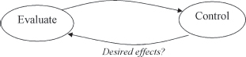

Design the system to be able to ESCALATE (9) the error analysis to try different mitigation techniques or to enter the escalation chain for error recovery.

Feedback loops are an established mechanism in control theory.

The system can get further and further into trouble by following the wrong path unless reexamination is possible. SOMEONE IN CHARGE (8) should perform the analysis since they have a view of the overall system. …

# 45. Equitable Resource Allocation

… The system is trying to handle FRESH WORK BEFORE STALE (55) and yet it has many requests queued for resources. There are distinct types of resources that need to be allocated to requests such as database or network connections. The system is designed to institute error mitigation actions automatically, and there are no errors preventing them from being instituted.

**How should requests for scarce resources be handled?**

The arriving requests might all be the same, or they might arrive differently in either type or priority. For example, the requests might be for information from a company’s website. Many requests for queries into the database are received, and a few orders are placed; these are examples of two different types of requests. The system is designed to allow the company’s salesmen to access the system with higher priority than the ordinary user’s priority; an example of different priority levels.

The system could strictly follow FRESH WORK BEFORE STALE (55) and only give the newest requests service. This will result in those requests that should have priority not receiving it because they are buried in the lower priority requests.

If the different types of requests are routed to different parts of the system for processing, then the parts with the fewer arriving requests will be idle some of the time, since the handler for the more common requests is receiving more work. There might be a specific resource that is especially overloaded. If requests are allocated based only upon their newness, or other preferred position in the queue, they might end up blocking, and being prevented from accessing, this resource anyway.

Another strategy would be to look at all the requests for service, both fresh and queued, and allocate resources equitably to all of them. While this requires additional bookkeeping to keep track of requests and their resource needs, work can be directed around extremely specific resource overloads. This helps ensure the greatest common good by providing service to as many requests as possible.

Priority inversion is a problem that results when a task of a lower priority is preventing a task of higher priority from executing because the lower priority tasks hold a resource that is needed by the higher priority task. When sorting messages and distributing them to queues, it is important to avoid creating the priority inversion-like situation of the lower priority requests keeping higher priority tasks from executing. Ensure that the mechanism that is dividing requests into processing pools fairly processes all requests in order, or periodically pauses and processes the more important requests. Make certain that the resources needed by the lower priority, or higher volume, requests don’t prevent higher priority requests from being processed.

Therefore,

**Pool all similar requests and allocate resources to the pools based upon their availability and priority. This enables all types of work to be accomplished even if concentrated overloads from a certain category of type or priority exist.** <a href="#c07.htm#fig7.67" id="c07.htm#fig7.67a">Figure 67</a> shows balanced work requests coming out of the system even though different volumes of requests arrived.

**[Figure 67](#c07.htm#fig7.67a)** Balance resource allocation

To group things and handle the pools, QUEUE FOR RESOURCES (46). When requests terminate abnormally, FINAL HANDLING (50) is required to efficiently release any held resources. …

# 46. Queue for Resources

… The system is mitigating a workload spike, and is not otherwise in the midst of processing an error. Too many requests are being received.

**What should be done with requests for resources that cannot be handled immediately when they arrive?**

The system is receiving more requests for work than it can process successfully as they arrive, but in general the system is able to gracefully handle the excess requests for service.

An option for the system is to discard all requests that it can’t handle immediately as they arrive. This supports the pattern SHED LOAD (49). Only those requests that can be handled will be kept. This will have immediate effects on an overload. There will be little overhead associated with this because the only work that is done for the requests to be rejected is the rejection.

There are many flaws with this approach though. For one, a request that arrived as several individual requests might be prevented from completing, just as the last request needed to complete it arrives and is discarded. This is discussed in FINISH WORK IN PROGRESS (54). Another is that important single work items might be eliminated without any consideration. The pattern MAINTENANCE INTERFACE (7) discusses this within the context of maintenance messages being lost. And yet another flaw is that the overload might be momentary, and if the request were taken in and put in a queue then there may be resources available for it after a very short wait.

If the system can store the work in a queue for later processing then the work item might complete eventually. This still has risks; one is that the queue might become longer than can be effectively managed. Another is that even after a short period in a queue the resources needed for a request are still not available, requiring the request to be rejected at that point, or put back in the queue.

Managing the queue requires resources and introduces overhead. You must be careful to not make the situation worse by designing inefficient queue handling methods.

Therefore,

**Store requests for service that cannot be handled immediately in a queue, <a href="#c07.htm#fig7.68" id="c07.htm#fig7.68a">Figure 68</a>. Give the queue a finite length to improve the likelihood that the request is still important when it reaches the head of the line.**

**[Figure 68](#c07.htm#fig7.68a)** Queue requests

When the requests are computer generated and must be processed in order, a First In First Out (FIFO) queue should be used. When people are generating the requests, the queue should use a Last in First Out (LIFO, a.k.a. a stack) strategy (as in FRESH WORK BEFORE STALE (55)) to govern insertion and removal. This will help people receive good service. The request that was placed on the queue last will think that they received excellent service, and the person that placed the longest ago request on the queue probably gave up already.

Allocation of resources under the guidance of EQUITABLE RESOURCE ALLOCATION (45) should recognize both the requests that have been queued and those that are fresh and have never been queued. …

# 47. Expansive Automatic Controls

… The system is capable of applying automatic controls when it becomes overloaded.

The system is receiving an overload of work requests. It is able to process all of this offered load but it is almost saturated. The finite resources, such as memory blocks, threads, network ports, etc., that are needed to complete the requests are almost all used or occupied. As soon as a request completes, the resources that the completed request is releasing back into the system are being acquired for a new request. If the workload increases slightly then new requests will either need to QUEUE FOR RESOURCES (46) or they will have to be rejected (SHED LOAD (49)). When this point is reached then the system starts wasting time looking for resources to allocate and performing the overhead work of placing the new request on a queue.

In this pattern the metric being watched is the number of work requests that are processed completely. This is a view of the error that focuses more on the incoming work than the view taken in PROTECTIVE AUTOMATIC CONTROLS (48) (which is system throughput).

**How can we avoid both the wasted effort processing the requests that can’t immediately be handled in an overload and at the same time increase overall request completions?**

This seems impossible: not waste effort queuing or discarding excess requests and increase the number of requests that can be handled. The resource that is exhausted is finite. Unless it can be increased this seems impossible.

It is common to employ PROTECTIVE AUTOMATIC CONTROLS (48) to protect systems during overload. If PROTECTIVE AUTOMATIC CONTROLS are used solely when confronted with congestion, each system will shrink back upon itself and request completion rates will decrease. Many of the protections result in requests being discarded (SHED LOAD (49)). Effort is expended to SHED LOAD. SHED WORK AT PERIPHERY (52) helps reduce the effort in the core of the system by shedding it at the edge.

If some way to expand the range of possibilities available to a system were possible then more work can be done. Are there alternative ways that a system can deal with its workload? Ways that are normally not used? Can any of these ways be built in?

High performance systems are usually designed to operate at less than 100% processor occupancy during ordinary execution. The unallocated processor time is held in reserve to support occasional spikes or periodic tasks. It can also be released for general requests when the system is overloaded.

Another example of expanding the resources available to a system to complete its work comes from the telephone network. There are many direct communication links between two telephone offices. Using links between the telephone offices and intermediate offices creates many multi-hop routes between the two telephone offices. A strategy used in the telephone network is that only the direct routes are used to service ordinary, non-overload requests to communicate between the telephone offices. When the systems become overloaded the non-direct, multi-hop routes are made available for use.

Expanding the resources that the system may use provides immediate relief of the request overload. It is not a permanent solution. If the offered load continues to increase, the system will again be confronted with more traffic than it can handle. Other means of mitigating the overload should be used in conjunction with the expansion of resources to reduce the impacts of the continued overload, <a href="#c07.htm#fig7.69" id="c07.htm#fig7.69a">Figure 69</a>.

**[Figure 69](#c07.htm#fig7.69a)** Expansion helped but is needed again

Therefore,

**Design some resources into the system that will be used only in case of overload. Provide new ways for the system to do its work that either uses reserved resources or fewer resources.**

Impose automatic controls that provide new ways to do the same work. This enables taking on excess work and lessening the congestion. It is like providing an escape valve. <a href="#c07.htm#fig7.70" id="c07.htm#fig7.70a">Figure 70</a> shows extra channels for work requests.

**[Figure 70](#c07.htm#fig7.70a)** Provide additional ways to process the workload

Expansive Automatic Controls provide new ways for the system to do its work.

Defer some ROUTINE MAINTENANCE (22) work during peak traffic times. This expands the amount of real-time that is available to perform revenue-generating work. Deferring maintenance work also enables this pattern to be applied to processor capacity. This was discussed in DEFERRABLE WORK (43).

PROTECTIVE AUTOMATIC CONTROLS (48) deals with finitely bounded resources. This pattern deals with resources that can be expanded.

An example of an expansive control from highways is when the police direct traffic over side streets, possibly in violation of posted regulations, to avoid an accident scene. They have the authority to take this action but they seldom exercise it. Another example is using all lanes of a highway to carry traffic in one direction to allow a higher number of people to leave an area threatened by a natural disaster, such as a hurricane. …

# 48. Protective Automatic Controls

… The system is capable of processing errors automatically. The metric being watched is throughput – the number of requests that are successfully processed. Congestion is occurring because there are too many requests that need the finite resources available within the system. For example, internal messaging bandwidth is becoming fully utilized.

When resources are almost fully used, the overhead to find available resources increases. This extra overhead, coupled with the overload of work, poses a threat to the system. The threat is that the throughput will begin decreasing because the overhead is reducing the time available for processing the arriving workload. In poorly designed systems the overhead work can bring the system to a halt.

**What actions should an overloaded system take to avoid spending all of its time doing overhead work associated with new requests arriving?**

The system is in overload. More requests are arriving than the system can normally process. If the system takes on all the arriving work, requests will have to be QUEUED FOR RESOURCES (46) until the needed resources become available. Processing effort is required to enqueue and dequeue the requests for service. If the congestion continues then queue lengths will increase and delays will become unacceptable. The nature of the traffic also comes into play. If the traffic is being generated by people then some of the oldest requests that were put into the queue will be invalid because the people abandoned their request. Usually this takes the form of ignoring or stopping a current request and immediately resubmitting a request. The result is that the queue contains requests that are no longer valid, in addition to newer valid duplicated requests. FRESH WORK BEFORE STALE (55) discusses a mitigation technique for this.

The responses that a system can take when confronted with overload and too many requests for resources can be one of these three. The first is to shrink within itself, taking whatever actions are necessary to be protected from the onslaught of too much traffic. In extreme cases this means that the system will stop processing any requests.

The second is to open itself up to the traffic, taking on as much as it can but shedding unnecessary internal work, DEFERRABLE WORK (43), and when it becomes necessary SHEDDING LOAD (49) in general and if possible (because it’s better) SHEDDING WORK AT THE PERIPHERY (52).

The third is to not do anything. This generally leads the system into instability as queue sizes keep increasing, and too much overhead work is required to accept requests and place them on the queue. Eventually the overhead work will overwhelm the system and it will stop performing useful work.

A typical response to too much work is for the system to begin thrashing. The system takes on more than it can handle, response times increase and the problems just magnify. This causes throughput to decrease greatly. By protecting itself the system will have a lower throughput than it did before the automatic control started, but the drop off will not be as severe as if nothing had been done.

Therefore,

**Automatically impose restrictions on how much work the system accepts to protect the system’s ability to function. The system has techniques to mitigate the effects of too many requests for service which should be invoked when the congestion is in elements that have finite limits and no unused capacity remains.**

In <a href="#c07.htm#fig7.71" id="c07.htm#fig7.71a">Figure 71</a> the system’s ability to function is protected as though it were a golden treasure.

**[Figure 71](#c07.htm#fig7.71a)** Protect the system

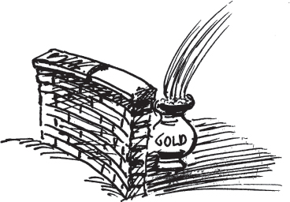

Without protection the system throughput will drop in an overload due to resource contention, <a href="#c07.htm#fig7.72" id="c07.htm#fig7.72a">Figure 72</a>.

**[Figure 72](#c07.htm#fig7.72a)** Throughput with resource contention

Metered freeway entrance ramps are examples of PROTECTIVE AUTOMATIC CONTROLS(48). When the finite resource of highway capacity becomes congested it is possible to automatically restrict the rate at which new traffic enters the highway by using stoplights at the top of the entrance ramp. At predetermined intervals the stoplight will turn green and allow one request for service (car) onto the freeway. This limits the amount of new work that is added to the system, at the risk of backing traffic up at the entrance ramp. In many cities these protective stoplights only restrict traffic during busy periods, i.e. rush hour.

Typically processor real-time is considered a finite resource and PROTECTIVE CONTROLS are needed to deal with congestion for it.

This pattern applies when the resource is finite. If there are ways of expanding the range of possibilities – of increasing the amount of the resource – then apply EXPANSIVE AUTOMATIC CONTROLS (47).…

# 49. Shed Load

… More work is arriving than the system can handle.

Workload increases as requests are accepted for processing. If too many requests are accepted the system throughput can decrease to the point that no work is being completed. When this happens the system is unavailable, and this must be avoided.

**How can the system best handle too many requests and keep them from overwhelming the system?**

Adding more software mechanisms to the system to handle the excess workload adds complexity, which can add faults. The overhead cost of the extra mechanisms can also exceed the amount of work that it saves.

The system can accept all of the incoming work, but as <a href="#c07.htm#fig7.73" id="c07.htm#fig7.73a">Figure 73</a> shows, the system throughput will decrease and become unacceptable.

**[Figure 73](#c07.htm#fig7.73a)** Unacceptable throughput

The system can shed some of the work, not accepting all of it, which will enable it to process the accepted workload well. The work should be shed as early as possible, before it consumes many system resources, see SHED WORK AT PERIPHERY (52).

Shedding some workload enables the system to stabilize. It can reduce the amount of processing capacity needed to handle unexpected surges in workload.

The mechanism to shed work should consider how the communicating system will behave when its work requests are rejected.

When the work is arriving in the form of messages, work can be shed by failing to acknowledge work request messages as they arrive. Many times the sender will retransmit the message. This is both good and bad. Good because when the retransmission arrives the system may be able to process it; the overload might be passed. But bad if the system is still overloaded because it is another request for service.

How to handle work that arrives from people depends on the circumstances. For example, telephone calls and web clicks have different human behavior characteristics. The STRATEGY \[GHJ+95\] pattern is useful for encoding the needed variation between these scenarios.

Therefore,

**Shed some requests so that the others may receive good service.**

<a href="#c07.htm#fig7.74" id="c07.htm#fig7.74a">Figure 74</a> shows some requests being discarded.

**[Figure 74](#c07.htm#fig7.74a)** Discard some requests for the good of others

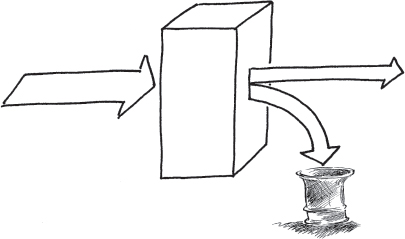

This is an example of PROTECTIVE AUTOMATIC CONTROLS (48). SLOW IT DOWN (53) describes a way to add escalating workload shedding filters. FINISH WORK IN PROGRESS (54) discusses a way to intelligently select the work requests that should be rejected. The pattern FRESH WORK BEFORE STALE (55) describes an effective way of acknowledging and responding well given human behavior when requests are shed or ignored.

Whenever work is discarded, FINAL HANDLING (50) comes into play to release the resources used by the discarded work. …

# 50. Final Handling

… When requests finish, the resources that they used are routinely released back to process other requests. Sometimes a request does not complete to the point at which resources are released. These abnormal terminated transactions and all the resources that they used need releasing.

**Should there be a separate mechanism to support only the abnormally terminated request’s need to release resources?**

The first resolution to consider is to not clean up abnormally terminated transactions. This will leave resources tied up and unavailable for other requests. This is like a memory leak. Eventually the system will run out of resources. The resources can be collected automatically by a garbage collection mechanism, but only recently have garbage collection mechanisms provided the deterministic performance needed by most fault tolerant systems.

The easiest option at development time is to release the resources with a separate mechanism. This simplifies the design because the normal and abnormal control flows do not need to be interwoven. The control flows do not need to interact, which reduces complexity. Two (or more) mechanisms will be added to the system, one for the normal cases and another for the abnormal cases. Separate mechanisms can be kept simple. This presents a maintenance challenge though because now there are two (or more) different mechanisms that need to be maintained. If a design fault is later identified in one of the mechanisms, all of them need to be checked to make certain that they do not have the same fault. While the mechanisms are more simple because the normal and abnormal are considered separately, there is roughly an integer multiple of the amount of code needed for the normal resource release. With more code there will be more latent faults.

Another option is to design the system so that the normal and abnormal cases share the same resource release mechanism. This can result in a more complicated design since the normal and abnormal control paths must be coordinated. There might be special steps that need to be done for the abnormal case or different information that needs to be recorded in logs. This complexity opens the potential for faults in the design. But the amount of code present will be less than two times the amount of code needed for resource releasing in the normal case, <a href="#c07.htm#fig7.75" id="c07.htm#fig7.75a">Figure 75</a>. An advantage is that there is only one place to correct in case a fault is found.

**[Figure 75](#c07.htm#fig7.75a)** Less code when common

Most fault tolerant systems are in use for a long time. As a result the costs to maintain the system must be considered in addition to the development costs, <a href="#c07.htm#fig7.76" id="c07.htm#fig7.76a">Figure 76</a>. Additional software needed to handle the separate release of resources adds to the maintenance costs.

Therefore,

**[Figure 76](#c07.htm#fig7.76a)** Lower maintenance costs

**Integrate the release of resource for internally terminated transactions with the usual release of resources done by normal task termination. See <a href="#c07.htm#fig7.77" id="c07.htm#fig7.77a">Figure 77</a>.**

**[Figure 77](#c07.htm#fig7.77a)** Release through the normal means

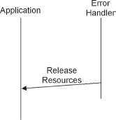

In this way there are few possibilities of forgetting to release some part. This saves development and testing time because it needs to only be written once. It also saves memory space. In a system that is designed to be highly available, the benefits of single development and maintenance of only one code are great and support the principle of keeping it simple.

Data should be collected when transactions are terminated abnormally. This data needs to be presented to human managers so that they can make changes to strategy or network topology.

As an example, consider that on some freeways there are emergency pull-off locations where it is safe to stop and report an accident or vehicle problem without obstructing the normal flow of traffic. After the problem is reported or corrected the normal lanes are used to resume the trip up to a normal exit. These emergency pull-offs do not provide special exit ramps. They provide the ability to perform some special actions and then the normal exit ramp is used. …

# 51. Share the Load

… You are designing a system that should be able to handle excess workload when it is presented.

The system might not have enough processing power to handle all of the requests for service. The system might have some parallel elements, either through clustering or multiple processing cores.

You have exhausted all other means of designing the system for the needed capacity.

**How can you increase the available processing power?**

Adding processors to the system increases complexity and makes it more difficult to ensure that it is fault tolerant. However, the increased complexity is traded against the addition to the system’s REDUNDANCY (3) which enables other mechanisms for error processing, such as FAILOVER (36) to be implemented.

When functions move from one processor to another, you must watch closely the partitioning to ensure that you are not adding to the overall workload. One way that workload will increase is by the need for shared data and the overhead needed to keep it synchronized between the processors. Careless choices can actually increase the workload on the system rather than decrease it. Unless the amount of processing that is shareable between processors is significant it might not help in the resolution of overload.

Preprocessing work needed before the main processing of a request can be moved to another processor. Its functions can be an adjunct to the main processing and the results provided to the main part of the system. Some examples of preprocessing include firewall/virus/other security scanning, request characterization and intelligent routing to enable efficient load balancing, monitoring arriving traffic to support FRESH WORK BEFORE STALE (55) and SHED WORK AT PERIPHERY (52). This other processor can be anything from a specialized appliance to another processor chip or FPGA on a media card in a bladed architecture or different general purpose system. In general it doesn’t need to be identical to the main processor, although that option is valid also.

An EXPANSIVE AUTOMATIC CONTROL (47) is to make extra processing resources available during periods of overload. For example, free up other members of a processing cluster, or engaging resources in a different part of a corporate network.

Therefore,

**Move some of the work to other processors. Move work that does not require high levels of synchronization.** In <a href="#c07.htm#fig7.78" id="c07.htm#fig7.78a">Figure 78</a> the incoming work is divided up between two elements.

**[Figure 78](#c07.htm#fig7.78a)** Share the work

The processor that receives off-loaded work need not be local. The network that shares the work can be larger and the off-load processor might be very far away. Some sort of message needs to be sent to the other processors to let them know that they should assume some of the work. Other components of the system will need to be told also to route traffic to the other elements.

If you design the capability for the workload to move from one processor to another you will need some way to synchronize them. If individual transactions take several requests, either you will have to design the capability to migrate all of the information related to a transaction, or you will have to design the ability to share transaction information (and state). …

# 52. Shed Work at Periphery

… Requests for service are arriving more quickly than the system can process them. The system can SHED LOAD (49).

**How does the system SHED LOAD (49) that is beyond system capacity for the lowest additional effort?**

As work requests are processed by the system, the system has an ever increasing investment in its completion. As more and more effort is expended completing any particular request for service, the benefits to the system of shedding any particular request diminish. The least effort time to shed load is before it uses any efforts of the system, <a href="#c07.htm#fig7.79" id="c07.htm#fig7.79a">Figure 79</a>.

**[Figure 79](#c07.htm#fig7.79a)** Effort expended increases with completion percentage

The system design provides mechanisms to shed requests that cannot be processed because of overload situations. The system might have mechanisms to characterize and intelligently shed the work requests. However, this processing might be in the heart of the system – in the most overloaded part. Fewer system resources will be expended if the request never makes it to the center of the system.

As an example, consider the design of a system that has processing elements that terminates many Ethernet connections. The Ethernet terminating element starts preprocessing the arriving requests, for example screening the requests with firewall functionality. After screening on this element, the request is passed to other parts of the system for further processing. The system, as a whole, will have spent the least time processing the request if it is shed at the Ethernet termination.

Therefore,

**Detect which work is eligible for shedding as close to the edges of the system as possible. <a href="#c07.htm#fig7.80" id="c07.htm#fig7.80a">Figure 80</a> shows it being discarded as soon as it arrives. Provide this detection mechanism with information about the processing capacity of the most limiting part of the system.**

**[Figure 80](#c07.htm#fig7.80a)** Shed work at entry to system

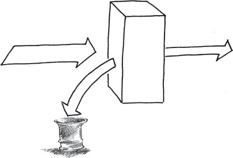

Work shedding done as soon as it hits the boundary of the system keeps the core of the system from seeing excess requests. If the core is the performance bottleneck then the system will be able to handle the accepted workload.

The title of this pattern comes from the peripheral equipment needed to make a computer into a network element, such as a telephone switch. The peripheral equipment can be made intelligent and assist in the multiprocessing of requests to SHARE THE LOAD (51). Many mainframes also have peripheral and terminal controllers that also meet the requirements of this pattern’s resolution. …

# 53. Slow it Down

… The system reacts to the work that is presented to it. If no limits exist to the arriving workload then the system could be overloaded to the point where nothing is getting done. There are upper thresholds beyond which the system cannot perform its desired function. Degradation of functionality is gradual below this threshold. The system can’t wait for a human to help resolve the situation so it is using MINIMIZE HUMAN INTERVENTION (5).

**What should the system do when it has more requests for service than it can possibly handle efficiently?**

The system goal is to perform useful work. Shutting down does not do this and neither does becoming overwhelmed and ineffective due to the workload

The system has routine tasks such as ROUTINE MAINTENANCE (22) and ROUTINE AUDITS (24) and a fault tolerance design to keep the system healthy. Otherwise it can never be sure whether an event is an error or excess workload. Maintenance and fault tolerance functions are DEFERRABLE WORK (43) and have less immediacy than application processing in a healthy system.

The system can trade off between fault tolerance and administrative tasks and application tasks to increase the application’s share of the processor, but there is still an upper limit beyond which the system cannot function.

One approach to handling overload is to just ignore the fact that too many requests are happening. Eventually the system will stop working. This approach requires design of fault handlers for this eventuality. Possibly build in an overseeing agent (human or otherwise) to save the day and resume processing, MAXIMIZE HUMAN PARTICIPATION (6).

The system can gradually reduce the amount of work that is done to gracefully restrict the amount of effort expended on each request for service. This will smooth the performance curve leading to total lack of useful work. The point of saturation where no work is done will still exist, but it will not be reached as quickly.

The nice(1) Unix™ command is an example mechanism to reduce the priority of certain tasks, such as the maintenance activities mentioned earlier. It can also be used to selectively reduce the priority of request handling tasks. For example, reducing the priority of the part of the system that admits new requests, but not reducing the priority of the parts of the system that complete requests will tend over time to reduce the number of tasks in the system.

As an example, when centrally managing thread creation, slow down the creation of new threads whenever the number of threads becomes too large. \[Lea97\]

For simplicity and ease of designer and maintainer understanding, discrete steps should be used rather than continuous adjustment. The added complexity and difficulty understanding any errors within the request slowing mechanism must be weighed with the benefits of continuous adjustment. Implementing discrete steps can build upon the ESCALATION (9) mechanisms already built into the system.

Therefore,

**Use an ESCALATION (9) strategy with several steps to restrict request processing. Each step’s restrictions are more severe than its predecessor. The goal is to slow things down until the system can catch up with load. The higher the number of requests for service, the harder the system puts on the brakes. This implements a feedback system that keeps processed workload from rising indefinitely.**

This is an example of PROTECTIVE AUTOMATIC CONTROLS (48). <a href="#c07.htm#fig7.81" id="c07.htm#fig7.81a">Figure 81</a> shows the request streams handled getting more restricted.

**[Figure 81](#c07.htm#fig7.81a)** Stepped restrictions

A hysterisis effect should be added to the controls to slow the system down. This will prevent oscillation between the steps, resulting in smoother response. <a href="#c07.htm#fig7.82" id="c07.htm#fig7.82a">Figure 82</a> shows an example of a hystersis loop. Different values are used as triggers to enter a new step of controls than to exit a level.

**[Figure 82](#c07.htm#fig7.82a)** Typical hystersis curve

This pattern slows down processing. After the system is caught up, it can release the restriction.

Once you have decided that the approach that should be taken is to SLOW IT DOWN, the actual levels and controls need to be decided upon.

For an example, consider the 4ESS™ Switch’s SLOW IT DOWN strategy. The 4ESS™ Switch has five levels of escalation, each of which allocates more real-time resources to call processing. The system uses EXISTING METRICS (20), using the length of the base level loop as the indicator of overload, which referred to as ’Real-Time Overload’.

Normal system operation is referred to as real-time level zero. In this level all routine tasks (ROUTINE MAINTENANCE (22) and ROUTINE AUDITS (24)) are allowed at their normal levels. There are no restrictions placed on the work done by the system.

The first level of slowing it down, called real-time level one, reduces maintenance processing by deferring some routine maintenance and audit tasks. At this level of real-time overload, routine tasks are still allowed to execute but are not allowed as much processing time as during level 0, normal operation.

When level one is inadequate, additional routine tasks are restricted at level two. Resources are taken from maintenance processing and allocated more resources to call processing. This may avoid blocking calls. The switch is not yet SHEDDING LOAD (49).

Real-time level two is considered inadequate for the overload when the main processor is running at 170% of engineered capacity. At this point, the system enters real-time level three and begins to SHED LOAD (49). The allocation of critical ‘call registers’ that are needed for any new request to be processed is restricted. This causes some requests for service to be ignored. As a result other switches sending the overloaded system new requests will time out or they may get a message saying that the system is busy. The other switches will route the call elsewhere. At level three, there are further reductions in routine tasks to allow even more time to be spent processing the calls that are accepted for processing.

Real-time level four is entered if level three does not bring sufficient relief to the overloaded system. Level 4 restricts call register allocation even more, giving out only one third of normal. More requests are ignored. The system is processing less load each time through its scheduler cycles. This should stabilize the system before it reaches the next real-time threshold, which would trigger real-time level five.

If none of the other mechanisms are sufficient, level five stops accepting all new call requests by allocating no call registers. The workload that was admitted into the system is allowed to be processed, which drains the internal QUEUES FOR RESOURCES (46). The hystersis curve will eventually drop the overload to level four.

Throughout the progression from one overload level to the other, the system constantly REASSESES OVERLOAD DECISIONS (44) and implements an ESCALATION (9) technique to bring the system’s workload down. …

# 54. Finish Work in Progress

… The work requests to the system are related to each other. Either each request builds upon earlier requests, or the requests might in some way alter the way in which some other request is handled.

More requests than can be handled are arriving; there is an overload situation. The system should maximize the number of requests that are handled to completion. Completion of both the processing of the individual requests and of the super-request of which the individuals are part of.

The system has attempted to SLOW IT DOWN (53), but that has not proven to be enough to relieve the overload. The system needs to SHED LOAD (49) and stop processing some requests.

**Which requests should the system accept for processing and which should it reject?**

The interrelationship between requests must be understood. You do not want the system to reject a request that is the last piece needed to complete some super-request task that has been processing for a long time. It also should not reject work that could negate other previously completed work, potentially resulting in locking resources that no longer have any hope of being used by any other process.

If the system labels all requests as either new work or continuations of existing work it can choose which ones to be processed. If it rejects arriving requests that are continuations of previously started work then it is stopping forward progress on an existing request, potentially tying up the resources that the system can use to resolve the overload.

A strategy that the system can employ when it needs to SLOW IT DOWN (53) is to restrict the new requests that are processed and only accept and process requests that contribute to the completion of already existing requests. To do this effectively requires an inspection of incoming requests and the determination that the system is already processing other requests related to this new one. The previous requests must really be in progress, not merely QUEUED FOR RESOURCES (46).

There is a case where this strategy results in the system oscillating between overloaded and idle. This occurs when admission of new tasks to the system is suspended for a period of time. When no more requests are admitted to the system, a drop in throughput occurs when the work in progress starts to complete because no work has been admitted to the system to replace the work that was removed. See <a href="#c07.htm#fig7.83" id="c07.htm#fig7.83a">Figure 83</a>. After the work in progress completes new work is admitted, which, if still an overloading amount, will cause the cycle to repeat. A solution to this problem is to enable a small amount of new work to start during periods of overload. This prevents the system from ever starving for new work. It won’t prevent a sudden dip in traffic, but will smooth the effects. The parameters associated with the system’s hysteresis curve (see SLOW IT DOWN (53)) will also influence this oscillation.

**[Figure 83](#c07.htm#fig7.83a)** Potential oscillation with exclusive strategy

Therefore,

**Process the requests that are continuations of work in progress. Ignore and reject the requests for new work.**

Use FINAL HANDLING (50) to cleanly release any resources needed for the requests that are cancelled. If arriving requests are related to work in progress it passes through, otherwise it is discarded, as shown in <a href="#c07.htm#fig7.84" id="c07.htm#fig7.84a">Figure 84</a>.

**[Figure 84](#c07.htm#fig7.84a)** Finish up work in overloading stream

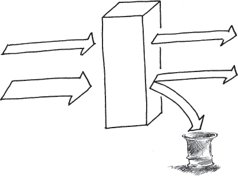

This pattern focuses on those super-requests that are groupings of requests received at independent times, offering a way to improve their throughput. FRESH WORK BEFORE STALE (55) addresses requests that arrive singly and are not related to other requests. It can also be layered on top of this pattern to choose which initial requests should be allowed to start processing.

Being able to identify and categorize arriving requests means that they can be sorted by other criteria as well, which can help SHED LOAD (49). …

# 55. Fresh Work Before Stale

… More requests for service are arriving than the system can possibly handle. You are concerned about quality of service and want to maximize the overall quality of service.

The requestors can abandon requests prior to completion by their requestors. This is common when the requests are made by people, for example web page requests or telephone calls. Another scenario where this is common is when the requester is timing the response from the system and finds that it is too long and abandons the previously sent request and sends a new copy of it. This pattern is not applicable if every request, once initiated, must be completed.

The system has the ability to sort incoming requests into different categories, which enables it to FINISH WORK IN PROGRESS (54) and to intelligently SHED LOAD (49).

**How can you ensure that the maximum number of requests get good service?**

When requests take a very long time to process, the requestors may give up waiting. This makes more work for the system as it must then FINAL HANDLE (50) the request. If delays grow too long, the system will spend time initiating processing on already abandoned requests.

When the system is processing as many requests as it can, it will almost always need to queue requests before they can be served, QUEUE FOR RESOURCES(46). The most simple way to queue, or buffer, the requests is to use a buffer that acts like a First In First Out queue, as shown in <a href="#c07.htm#fig7.85" id="c07.htm#fig7.85a">Figure 85</a>. A problem with this is that requests that are in the queue might be abandoned by their requestor. This will only be discovered when the system begins processing the request and finds out that the requestor doesn’t reply or indicates that the request is outdated. The requests are all delayed the same amount by being in the queue.

**[Figure 85](#c07.htm#fig7.85a)** First In First Out queue

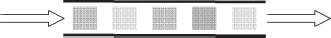

Requests can be processed quickly when they are queued using a stack, also known as a Last In First Out queue, <a href="#c07.htm#fig7.86" id="c07.htm#fig7.86a">Figure 86</a>. Processing starting with the fresh requests will increase the likelihood that still-valid requests are processed. When the fresh requests have all been removed from the queue, the aging, possibly abandoned ones, will remain and be processed.

**[Figure 86](#c07.htm#fig7.86a)** Last In First Out queue

If the system knows how long requests wait for service before being abandoned it can intelligently choose which requests to continue by knowing how far down into the queue to extract requests from.

However, keeping track of how long requests have been waiting is a difficult task. The timers need to be continually updated which adds overhead processing to the system. Extra overhead is contrary to the need during overload to reduce overload, so a simplified timing mechanism must be used.

To ensure that some requests receive service quickly, process a few requests as soon as they arrive without any buffering. This ensures that the quality of service for at least a few requests will be excellent.

Therefore,

**Use a Last In First Out queue and also serve some new requests immediately, <a href="#c07.htm#fig7.87" id="c07.htm#fig7.87a">Figure 87</a>. In that way, at least some requests will have a high quality of service.**

**[Figure 87](#c07.htm#fig7.87a)** Fresh work before stale

Some requests are receiving a high quality of service. Some other requests will receive a poor quality of service; however, they are the ones most likely to have been abandoned.

If requests are related to each other then FINISH WORK IN PROGRESS (54) should be used to continue processing the work that has already been started. …

# 56. Marked Data

… The system has a way to detect errors in data that it uses. Once detected, an ERROR CONTAINMENT BARRIER (13) will initiate processing of the error.

The system detected erroneous data, either in a message that is passing through this part of the system, or in an element of data that was stored earlier and accessed by this part of the system. Alternatively, the error was detected as the result of an operation.

The system does not have enough information to be able to correct the erroneous data automatically. This can be because there is not any record or *a priori* knowledge of what the correct value should be, or it does not contain sufficient information embedded within it to be corrected, e.g. it does not contain any ERROR CORRECTING CODES (57).

The error that has been detected has a limited scope that does not require that the system state be greatly altered even though it can’t be immediately corrected. In other words, error mitigation is more appropriate than error recovery actions such as restoring from a CHECKPOINT (37), or conducting a ROLLBACK (32) and ROLL-FORWARD (33).

**When the system finds uncorrectable erroneous data, how can the error be kept from spreading?**

Sometimes stored data contains an error, for example when it is something that was put away for later use into medium to longer-term storage. The part of the system that is going to contain the error might not have enough information to be able to determine if it was incorrect when first stored or if it was corrupted during storage. Using the invalid data will cause a failure; it must be contained to prevent this from happening. The corruption may have occurred in the past, but it remained unidentified until the data is about to be used. ROUTINE AUDITS (24) are used to detect corrupt data before the data is needed for processing. In many cases, CORRECTING AUDITS (2) correct these elements of faulty data. However, if the audits are not available, or the nature of the data prevents automatic correction, then the data won’t be correctable.

The storage medium sometimes attempts to tolerate errors on its own. For example, the memory of the system contains ERROR CORRECTING CODES (57). These codes can only detect a certain number of bit errors in a given memory unit, but this will be sufficient for many error cases. This memory is common in systems designed from the hardware up to be fault tolerant, but these error correcting and detecting code memories add expense.

If the data cannot be corrected it must be QUARANTINED (28). In the short term, the entity that detects that it is erroneous should not use it. The system must discard the results of any actions taken with that data.

We also do not want the data used by any other parts of the system. It can be marked in a way that other parts of the system do not have to spend much time detecting that it was erroneous, and can quietly contain the impact of the error. Rules must be defined for how to proceed when encountering any data items that have been marked.

In some cases merely marking the data as erroneous is insufficient and the system must undertake active error recovery steps in order to contain an error. For example, when there is no correct action possible because the erroneous data will control a branching of program execution.

The IEEE ’Not a Number’ is an example for marking a value erroneous in a way that enables processing to continue. The IEEE standard 754-1985 defines standard representations for binary floating-point numbers. While defining the numerical representation they also define a special value ‘Not a Number’ or ‘NaN’. NaN is stored in place of a floating-point value as the result of certain illegal floating-point operations, for example division by zero. The standard defines rules for how subsequent computations should behave when one of the operands is NaN. \[IEEE754\]

Rules for processing an operand that is marked by someone else as being erroneous should include two different types of information, which are both present in the NaN rules from the IEEE. The first type of information is how the operation should proceed. Possible rules include assuming a default value, skipping the operation and marking the result as erroneous, seeking the information from an alternate source, aborting execution or invoking an ERROR HANDLER (30), and so on. The second type of information that should be part of any rule is whether any notification to other parts of the system should be made when a previously marked erroneous value is encountered. The IEEE standard refers to this as signaled or quiet. This signaling is appropriate if some intermediate mechanism would have been expected to correct the error and so the current occurrence of the erroneous flag is totally unexpected.

Messages sometimes contain erroneous data elements. These must also be contained. In some cases, the system must discard the entire message. This is most effortless when the protocol supports retransmission because the message is unacknowledged.

Individual data elements within the message are sometimes identifiable as being erroneous. If only parts of a message are incorrect then a mechanism such as the IEEE NaN can be used to identify the erroneous part. This allows computing to continue while taking into account the erroneous elements.

When the results of a computation or processing are determined to be erroneous, the NaN approach of marking the data element can work as well. In some cases, the detection of an error at this level indicates that the part of the system that performed the computation is erroneous. The entire part of the system should be marked and avoided rather than just the result, but the IEEE NaN is too low level. One approach is to report to the FAULT OBSERVER (10) and rely on higher level system functions to contain and repair the faulty entity.

Marking data or results so that they are not used is not free. In the case of IEEE NaN the mark is encoded in place of the value, but sometimes the error mark might require additional ‘meta-memory’. Resources are required to check for the erroneous mark and take appropriate actions.

Therefore,

**Mark erroneous data to indicate that it is unusable, <a href="#c07.htm#fig7.88" id="c07.htm#fig7.88a">Figure 88</a>. Define rules for processing these values when they are encountered.**

**[Figure 88](#c07.htm#fig7.88a)** Mark the erroneous data

The periodic checking of data for correctness is a variant of this pattern. Instead of waiting for the data to be accessed in normal operations, the ROUTINE AUDIT (24) mechanism will periodically check for correctness and either mark or correct it.

Marking data can also be done to indicate that a data value is known to be correct, or that it is now eligible for use.

‘CHECKS’ by Ward Cunningham \[Cun95\] introduces the idea of an exceptional value as a computational result. This effectively contains the error to everywhere upstream from the point of detection. Failures are prevented because the system does not use the erroneous valve if it is flagged as exceptional. …

# 57. Error Correcting Code

… CHECKSUMS (25) can be used to detect whether data values (in memory or messages) are correct.

**How can the system data paths and storage be made as error free as possible?**

CHECKSUMS (25) work to detect that the item being protected is incorrect. They cannot correct the data.

To reduce errors you would like the data value corrected automatically. A number of techniques will correct erroneous data values automatically. These include ROUTINE AUDITS (24), DATA RESET (41) and even restoring from a CHECKPOINT (37). Maintaining a duplicate copy of the data eliminates the need to be able to correct an individual value. If the duplicate is stored in a location designed to be less prone to corruption, the problem of knowing which one is correct is eliminated.

These techniques all work by correcting the data to some known correct value.

An alternative is to undo the error, ignoring the value totally. In order to ignore the data value the system would need to know precisely what changed. Then the system can undo the change without knowing the value. The CHECKSUM (25) example of a parity bit will tell the system that a data value has changed, but it doesn’t provide enough information to be able to know what has changed.

However, if you introduce parity over smaller and smaller parts of the data you will eventually reach the point where the system can tell what has changed. For example, if one parity bit watches over one data bit the system can tell which data bit changed. This assumes that the parity bit does not change erroneously. In order to tell if the parity bit has changed, put another parity bit watching over it.

Eventually you must stop adding bits to watch the watching (parity) bits. Making some design assumptions about the number of concurrent faults will help.

Error correcting codes are a very fast way of ensuring correct data. This is especially valuable when there is a high rate of transient errors changing the data.

Error correcting codes are frequently applied to data streams to ensure that they are received correctly. Some examples include MPEG data streams and CDMA mobile telephony.

Therefore,

**With each CHECKSUM (25) store enough information that will enable the system to automatically correct an erroneous data value when it is detected.** <a href="#c07.htm#fig7.89" id="c07.htm#fig7.89a">Figure 89</a> shows an example of a two bit code being sufficient to correct single bit errors and to detect double bit errors in four bits of data.

**[Figure 89](#c07.htm#fig7.89a)** Two extra bits protects four data bits

Error correcting memories are in common use in many computers.

The particular design and implementation of a software error correcting code is very context specific. …

# CHAPTER 8

# Fault Treatment Patterns

After an error is processed, fault treatment prevents the error from reoccurring. This includes repairing the fault. This can mean patching the system, which is installing a new fault-free version of the software or the data. It can also mean correcting a procedure so that a person won’t cause the same error again.

Sometimes error detection will immediately precede fault treatment without the execution of an error recovery phase.

The steps of fault removal are: verification, diagnosis and correction. Verification is done to determine if the system behavior conforms to its specifications. This is done to check whether the fault is still present in the system. The aim of diagnosis is to determine the cause, both in terms of location of the fault and the nature of the fault. Correction is the step in which the fault is made passive. After correction, verification is needed again to see that the system behavior is restored to conformance with its specification. Fault removal is an example of *corrective maintenance.*

Not all maintenance tasks are corrective. Preventive maintenance corrects a fault before it is activated. ROUTINE AUDITS (24), in Chapter 5, is an example of something that is both an error detection technique and a preventive maintenance task.

<a href="#c08.htm#tab8.1" id="c08.htm#tab8.1a">Table 8.1</a> lists all of the patterns in this chapter. Their order is that of the language shown in <a href="#c08.htm#fig8.90" id="c08.htm#fig8.90a">Figure 90</a> and also the order that the patterns appear within this chapter.

[**Table 8.1**](#c08.htm#tab8.1a) Fault treatment patterns

---

**PATTERN**                  **PATTERN INTENT**                                                                                                                                              **VERIFICATION, DIAGNOSIS, CORRECTION**
LET SLEEPING DOGS LIE (58)   Consider the true benefits to the system of correcting the faults versus leaving the fault present.                                                             Correction
REINTEGRATION (59)           After making the faults passive, return the repaired component to service.                                                                                      Correction
REPRODUCIBLE ERROR (60)      Activate a fault while monitoring its behavior to determine clues to its nature and potential corrective treatments                                             Verification
SMALL PATCHES (61)           Surgically correct an erroneous program part.                                                                                                                   Correction
ROOT CAUSE ANALYSIS (62)     Identify the first fault in a sequence as the target of treatment actions.                                                                                      Diagnosis
REVISE PROCEDURE (63)        After a failure in which people contributed to downtime instead of minimized it, revise the procedures that they followed to avoid the problem in the future.   Correction

---

**[Figure 90](#c08.htm#fig8.90a)** Fault treatment pattern language map

[Figure 90](#c08.htm#fig8.90) shows a possible language mapping for the patterns in this chapter.

People are more involved in the patterns of this chapter than they were in the patterns of the other chapters. Deciding whether the benefits of correcting a fault outweigh the risks of introducing other faults can only be done by people. This is discussed in LET SLEEPING DOGS LIE (58). In some of the earlier patterns the operating personnel were mentioned. Several of the patterns in this chapter, specifically REVISE PROCEDURE (63) and REINTEGRATION (59), discuss procedures and methods of operations intended for these operating personnel. System architects and developers are the main actors in ROOT CAUSE ANALYSIS (62), REVISE PROCEDURE and SMALL PATCHES (61). REPRODUCIBLE ERROR (60) describes a practice that any of the operating personnel, architects, and designers employ to verify that the system still does not behave as specified; in other words that a fault is still present, and that correcting the fault eliminates the failure.

# 58. Let Sleeping Dogs Lie

… The system detected and corrected an error or failure. Now you are correcting the fault that caused them.

**Should you correct all faults that the system and the maintainers find?**

Correcting faults in real systems is like surgery and in surgery there is always the risk of complications. When correcting a fault the patient is your software, and the risk of complications is real.

Whenever a change is made, for example via SMALL PATCHES (61) or a SOFTWARE UPDATE (11), faults can unintentionally be injected into the system. This is common. Patches to correct faults add complexity to the system, which adds ‘scar tissue’ to the software, making it more difficult to read and maintain. Faults are added to the system within this complexity.

You must weigh the benefits of correcting the known fault and the errors that it causes with the potential unknown faults and errors you might accidentally introduce. With the known fault you have an idea what the risk of future unavailability is in the case that the fault activates again.

Every latent fault that you identify and are able to fix presents a risk that exists in the system. You should consider what the likelihood of the fault reactivating is. What is the risk to the system if the fault activates again and causes an error? What is the size and complexity of the correction? What is the probability you can construct the correction without new faults and then install it without introducing other faults? You need to consider all these risks when deciding whether to fix the fault. <a href="#c08.htm#fig8.91" id="c08.htm#fig8.91a">Figure 91</a> shows the balance required.

**[Figure 91](#c08.htm#fig8.91a)** Balancing known versus potential faults

You must also consider the costs associated with correcting the fault. There are the costs associated with recreating it in the test system, costs associated with making the change and verifying that it is correct, and also costs associated with distributing the change to the production systems. As pointed out above, new faults can be introduced at any of these times, which will add their own costs to be considered. Costs to goodwill with the system’s owners must also be considered. How will they react to their need to correct the system, which might require downtime?

What are the benefits associated with correcting a fault? It won’t reoccur, a known source of error will be eliminated, reducing the error probability, which will increase the availability. When making the correction you have an opportunity to correct other faults. Proactive correction of faults can increase goodwill with the system’s owners. <a href="#c08.htm#fig8.92" id="c08.htm#fig8.92a">Figure 92</a> shows the dimensions to consider when deciding whether to correct a fault.

**[Figure 92](#c08.htm#fig8.92a)** Trade offs to consider

Every fault that is considered will balance the trade offs in [Figure 92](#c08.htm#fig8.92) differently. If the fault is causing system instability and failures that result in total unavailability, the balance should result in its being corrected. If, on the other hand, the fault produces errors that have a simple workaround or are very unlikely to reoccur, then the best choice might be to leave the fault uncorrected. For example if the failure occurs during time of day exchange between two processors in a small distributed system, but the failure only occurs when daylight savings time is invoked, then in many environments it will not be fixed.

Therefore,

**Weigh the risks and costs with the benefits and rewards associated with the correction. Sometimes it will be best to LET SLEEPING DOGS LIE** and not make the correction. Deciding whether to correct a fault is like wondering if there is a wolf just outside the window, <a href="#c08.htm#fig8.93" id="c08.htm#fig8.93a">Figure 93</a>.

**[Figure 93](#c08.htm#fig8.93a)** Picking the known or the unknown

You are deciding whether you should correct all of the faults that you know about. You are correcting the ones with the highest risk of reoccurring or the highest potential for damage if they do reoccur. You are not correcting the ones with a lower risk to avoid introducing new faults. …

# 59. Reintegration

… You have corrected a fault but the previously faulty element is not doing useful work yet. The faulty element was either REDUNDANT (3) and the application is still available, or it wasn’t REDUNDANT and the application is unavailable.

Error Treatment might have been achieved through the use of a mitigation technique from Chapter 7, or SOFTWARE UPDATE (11) was used to apply a SMALL PATCH(61).

**What should you do with a component that you have fixed?**

There are a number of steps that need to be done in order to guarantee that the treated component can be returned to service effectively and quickly. If any of the steps are not done then the same or a different error might occur and cause further error processing steps to be taken. This will reduce availability.

The treated component might still be in lists of errors that RIDING OVER TRANSIENTS(26) is monitoring. There might also be lists of faulty components that were used to isolate and locate the fault. It should be removed from these lists since it is now treated.

The fault may not have been corrected. The treated component should be watched for a short while to ensure that the error that you think you corrected does not reappear. By watching it you will also be checking that new faults have not been inserted into the system with the SOFTWARE UPDATE(11) that you applied. This process of watching the component is called soaking, hardening or trialing. RECOVERY BLOCK(4) mechanisms can be used to automatically return to the unchanged software if the change should fail.

The previously faulty component should be reintegrated into the system. If the component is part of a load sharing group, allow it to start handling load again.

The restoration procedure has a number of things to do to make sure that all of the other parts of the system know that the corrected component is available. Capture these instructions in a reusable procedure.

When the component that you are returning to service is a redundant copy of another element, you have to decide whether the returning component should become the active or the standby. If the redundancy is set up in a load sharing arrangement, then this choice is not relevant. Most often, the system makes the active/standby decision within the context of the overall architecture of the system. What is the normal mode of operation? Does the system architecture call for the now active standby to be active only when the usually active component is processing an error? This might be the case in an N+M redundancy scheme, or when the standby is not a fully functional unit, but is only able to act as the active for a short time. If the standby is a fully functional component, then the general decision should be to leave the current active unit active, <a href="#c08.htm#fig8.94" id="c08.htm#fig8.94a">Figure 94</a>. This uses ROUTINE EXERCISES(23) in verifying the full functionality of the currently active (formerly standby) component. It also reduces the unavailability due to the time it takes to apply the correction via SOFTWARE UPDATE (36) and to make the returning component active.

**[Figure 94](#c08.htm#fig8.94a)** Keeping the repaired component as the standby

As the previous discussion shows, there are many steps that need to be done. Failing to perform them can result in errors and further unavailability. You can execute each step in an ad hoc manner or you can follow a predefined procedure. With a procedure you will not forget anything, the actions that you take will be appropriate to the situation, and all the parts of the system will know what steps are involved in restoration. A clear procedure definition enables an evolution to automatically restore the treated component. Automatic restoration and automatic actions, MINIMIZE HUMAN INTERVENTION (5), will speed error processing and reduce unavailability.

Therefore,

**Follow a predetermined procedure to reintegrate a corrected component into the system, <a href="#c08.htm#fig8.95" id="c08.htm#fig8.95a">Figure 95</a>.**

**[Figure 95](#c08.htm#fig8.95a)** Follow a process to reintegrate a task

The system is now more operational than it was before. You have corrected the fault and restored all of the system’s components to operation.

ROUTINE MAINTENANCE (22) and ROUTINE EXERCISES (23) are used to protect the system and keep it ready for future errors and failures. …

# 60. Reproducible Error

… The system detected an error or failure and the error was processed. You are now interested in correcting it.

You are not just staring at a blank page wondering what to correct because the system captured information about the nature of the error and failure. You identified (or think that you have identified) the stimuli that triggers the fault to activate.

**You want to correct a real fault, not waste time on something only imagined to be the fault.**

When the error was detected, techniques such as RIDING OVER TRANSIENTS (26) were used to ensure that a real, persistent error has been found. The system has not been static in the time between when the error processing completed and you begin treating the fault. Faults are sometimes corrected and removed from the system as a side effect of some other fault treatment or SOFTWARE UPDATE (11).

Unless you very clearly identified the fault that caused the previously detected error, you cannot be certain that it is still present unless it causes the error again. You need to be sure that it is really broken before you can fix it. You also need to be sure that you are fixing the fault that causes the error or failure of interest.

The system can be designed to automatically reapply the stimuli in some cases. Automatically reapplying stimuli that has caused an error is not usually done because of the complexity that gets added to the system to perform this functionality. This complexity provides ample opportunity for other faults to be latent in the system.

Automatic stimulation to detect latent faults, or to verify that known faults are no longer present, is done in some systems as a form of system diagnostics. A QUARANTINE(28) zone is established and sequences of stimuli are introduced to see if the system behaves according to specification. These diagnostic tests are very effective if run in conjunction with ROUTINE EXERCISES (23).

The operating personnel can introduce stimuli into the system to verify that the system is performing according to its specification. This same test method will report if the fault under investigation is still present in the system.

There is always a risk when a fault activates that the recovery will be unsuccessful and a failure will result. The benefits of correcting the fault must be weighed with the benefits of leaving the fault alone (LET SLEEPING DOGS LIE (58)). If the fault is not corrected you should consider providing better error processing for this particular fault (or class of faults) in a future SOFTWARE UPDATE (11).

Consider an example scenario of controlled execution for systems that are highly dependant on incoming messages. In these systems some of the messages might be killer messages. One way of mitigating the effects of killer messages is to isolate the killer messages in a safe queue or holding area, where they won’t be of further risk. When the fault that the killer message activates is isolated, the killer message is reintroduced into the system in a controlled way. The QUARANTINE (28) zone required for this must prevent the fault’s activation from causing work disrupting errors in other parts of the system.

Therefore,

**Stimulate the fault in a controlled manner to verify that the fault did indeed cause the observed error and that the fault is still present in the system, <a href="#c08.htm#fig8.96" id="c08.htm#fig8.96a">Figure 96</a>. To know that a fault exists, compare the results of applying the stimuli to the behavior described in the system specification.**

**[Figure 96](#c08.htm#fig8.96a)** Observe the error

This controlled failure testing is a kind of regression testing.

You now know that the fault still exists and what an error that the fault causes looks like. You can now proceed to make the changes needed to correct the fault, such as SMALL PATCHES (61) or SOFTWARE UPDATE (11). …

# 61. Small Patches

… You know how to correct the fault that caused a detected error or failure. You have weighed the options of LETTING SLEEPING DOGS LIE (58), and you now want to deploy the correction. You want to deploy it with minimal risk of downtime due to either the installation of the correction or latent faults in the correction.

**What kind of SOFTWARE UPDATE (11) will have the least chance of introducing extraneous faults or bringing in extra capabilities that are not needed?**

Coding faults can be as simple as a misplaced comma. They are easy to introduce and hard to detect even with the fault prevention efforts you employ.

The likelihood of a fault in the SOFTWARE UPDATE (11) you prepare to remove a fault increases as the size of the update increases. With more code, there are more places for the fault to hide and more complexity to understand and test. Extra effort is needed to correctly develop and test the correction.

There are a wide variety of techniques and tools available to correct computer programs. They range from very low level to high level.

Some tools allow you to create byte level difference records to apply to an old version to produce a new version. This enables deployment of minimal updates. Examine these differences to determine if anything unexpected has changed, which is a clue that there are other faults within the update. You might not be able to examine individual bits and determine if they are correct, but you should be able to identify whether the differences are located in appropriate or inappropriate locations. An example is when you expect two to four bytes to be changed but instead the tools inform you that 3000 bytes changed.

The tools to install small, possibly bit or byte level, corrections in a system could be prohibitively complicated. Typically they will require a portion be a permanent part of the system. Application of the correction might be quick, from an application downtime viewpoint, but the overall time that the system spends managing the correction can be significant.

In many cases the only way to correct a faulty computer program is to stop its execution, install the new version and restart it. In addition to a long period of unavailability, this results in the entire program being moved around to convey the correction. Reinstalling the complete program or even updating to a new version of the complete program is time–consuming, as just noted. It also opens the system to corruption or installation of faults in other parts of the system that didn’t need to be corrected. Care must be taken to ensure that the entire program update includes only the desired correction and doesn’t include untested or partially implemented capabilities in some unaffected part of the system.

So much depends on your tools. If they support the application of byte level updates then that method becomes an option. If the smallest change that you can make is to change an executable file, that defines the minimal size of the update.

Tool limitations can occur from both the tools that develop the update and from the tools that apply the update to the system. The size and nature of the updates should be considered when the SOFTWARE UPDATE (11) functionality is being designed and built.

Therefore,

**Create as small an update as your tools and what needs to be patched allow.**

<a href="#c08.htm#fig8.97" id="c08.htm#fig8.97a">Figure 97</a> shows that patches can be large or small.

**[Figure 97](#c08.htm#fig8.97a)** Various size patches

By reducing the size of changes to the system, you have reduced the risk of introducing new faults into the system. …

# 62. Root Cause Analysis

… An error or a failure occurred. The error has been processed or mitigated and the system returned to service. Now it is time to correct the fault that caused the error that caused the failure.

**What fault should you fix?**

The detected failure (or error) might be the result of a long sequence of fault → error → failure, where one failure acts as the fault to cause a different error, see <a href="#c08.htm#fig8.98" id="c08.htm#fig8.98a">Figure 98</a>. Which fault should you correct?

**[Figure 98](#c08.htm#fig8.98a)** Failure sequences

The detected errors or failures were either Error C or Failure C in the below diagram. If A or B had been detected then they would have been processed and Failure C would have been prevented from occurring. Correcting Fault C will prevent its activation from causing Error C and Failure C. However, the whole sequence of fault activations, errors and failures really began much earlier in time. What you would like to correct is the primary or ‘′root cause’ and not just a symptom.

Remember from Chapter 1 that there are different classifications of faults. The cause of a fault might be a design or coding oversight. Or the fault might have been an incorrect procedure for a human to follow, or even an incorrect action taken by a human operator. The kinds of faults are many and varied.

Correcting the symptoms such as releasing the inaccessible memory is useful, but it doesn’t prevent the error from occurring again. To prevent the error from reoccurring identify and correct the underlying fault rather than just correcting the symptom.

Employing the Fault Tolerant Mindset to corrective maintenance entails asking *why?* an error happened and *why?* a fault is present in the system. Asking *why?* repeatedly is one way at getting to the root cause of the situation.

An example of looking at a failure and asking why:

**Why** was the data record lost?

Because the transaction failed in the middle.

**Why** did the transaction fail in the middle?

Because it ran out of memory.

**Why** did it run out of memory?

Because there was no more memory available for allocation.

**Why** was there no more memory available for allocation?

Because the memory was inaccessible.

**Why** was the memory inaccessible?

Because its owning task had terminated without releasing it.

Reaching the end produces a fault that can be corrected, namely that of tasks terminating without releasing memory.

There might be more than one root cause of an error. For example, the root causes might be found to be that there was a mistake in a procedure, and also that the operating personnel deviated from the procedure.

Along the way to identifying the root cause of a problem other faults will be encountered. Record these and fix them also, don’t ignore them because they are just along the way to the root cause.

Therefore,

**Fix the root cause of the error and any faults that you find while determining the root cause. A useful technique is to ask** ***why?*** **five times when determining the root cause of the error or failure that you are treating. Correct the faults found at this depth of the analysis.** Keep peeling back the layers to look inside the system to isolate the root cause as shown in <a href="#c08.htm#fig8.99" id="c08.htm#fig8.99a">Figure 99</a>.

**[Figure 99](#c08.htm#fig8.99a)** Keep looking inside

Five is a suggested number of question iterations, but five is not special. Asking the question a different number of times is still useful, the objective is to be satisfied that the investigation has not stopped at the superficial level, but has gone to one of the real causes of the fault. There might still be faults at deeper levels, but you have done a good job identifying and correcting the source of the problem.

‘5 Whys’ is a quality technique employed by Six Sigmas and other quality methodologies. For other techniques to determine the root cause, turn to the software and process quality literature. …

# 63. Revise Procedure

… The system has had a failure. You have corrected any faults that you identified via ROOT CAUSE ANALYSIS (62) using SOFTWARE UPDATE (11).

Your ROOT CAUSE ANALYSIS (62) identified some faults that were related to the way that the operating personnel of the system behaved. The system design might have been incomplete in its implementation of MINIMIZE HUMAN INTERVENTION (5) or the personnel might have thought incorrectly that people knew best.

Systems that are designed to be highly available or highly reliable frequently are maintained and operate in environments where there are human operators that surround them, in computing centers, telecom central offices, etc. In these situations, it is prudent to develop detailed operating procedures so that these operators know how to care for the system.

**How can a repetition of errors caused by the operating personnel be avoided?**

True experts know what to do, so when they intervene they rarely cause a failure to become more severe. Their intervention aids error processing and reduces unavailability. They know what to do because they know the system very well; for example, they might have been the system’s designers. MAXIMIZE HUMAN PARTICIPATION (6) provides the means to intervene.

Many of the people who are maintaining your system are not true experts in its operation. They may not know how to correctly interpret the error messages. When confronted with ambiguous, misleading, or poorly worded instructions they might just start typing/clicking anything in an attempt to correct the error. They are truly dangerous and will cause many failures. The procedures for them to follow must be very clear and painstakingly researched.

Some of the people who are not experts will read the procedures that you have developed to explain how to manage the system. In some cases, errors can still occur, because the procedures that the people followed were not correct, were not complete, or were unclear.

REINTEGRATION (59) relies on a predetermined procedure to ensure that recovered and treated components are correctly returned to service. Other operational scenarios, such as SOFTWARE UPDATE (11), system configuration changes, and system backups are executed frequently and also benefit from predetermined procedures. Availability suffers when the procedures cannot be followed by the operating personnel.

Therefore,

**When operating personnel following the system’s predetermined procedures contribute to failure durations, revise the procedures to avoid repeating the same sequence of errors.**

Mark up the procedures, <a href="#c08.htm#fig8.100" id="c08.htm#fig8.100a">Figure 100</a>, to make them better for the next time they are needed.

**[Figure 100](#c08.htm#fig8.100a)** Correct the procedure

If you can show the group of human operators that just blindly types to correct the problem that the procedures you have written lead to successful recovery, they might be enticed to use them in the next error situation.

Your system and the environment in which it operates will be more robust with higher availability. There will be fewer human caused errors and failures. …

**Conclusion**

The previous five chapters contain patterns that can help make your software designs more fault tolerant. Chapter 4 contained architectural principles that you should use to structure your overall solution. Chapter 5 presented patterns to help detect the presence of errors and faults before failures occur. Chapters 6 and 7 gave ways to process errors. Sometimes the processing results in the system execution state changing, and sometimes the errors and faults can be processed in a way that doesn’t change the execution flow. Chapter 8 contained patterns to help treat the faults and return the erroneous component to availability. This chapter shows the complete pattern language and gives an example of how the patterns can work together.

# *A Pattern Language for Fault Tolerant Software*

Each chapter began with a description of the patterns and how they related to each other and how they worked together to make a system more fault tolerant. Linkages between the patterns in different chapters were not highlighted, except in the individual pattern descriptions. See back of book for a map of all of the patterns. Within this overall pattern map you can see some of the linkages between the patterns of the individual phases.

This figure represents only one possible combination of these patterns into a usable language. Others are possible, because the choice of patterns to apply to a given design problem depends on the context and the nature of the system, as illustrated through the example in the next section.

The key connections between the patterns in the different chapters, as well as within the chapters, are shown. Not every possible connection that you might make when combining these patterns into a project specific language are shown. Neither is every reference made in the pattern text shown.

There are four main entry points (top level patterns) into this language map. These are UNITS OF MITIGATION (1), CORRECTING AUDITS (2), MINIMIZE HUMAN INTERVENTION (5) and SOFTWARE UPDATE(11). These four architectural patterns from Chapter 4 start many of the pattern sequences through the language.

The interconnections and flow of patterns beginning with UNITS OF MITIGATION (1) proceeds to REDUNDANCY (3) and to the active error processing patterns of ESCALATION (9) and QUARANTINE (28). These patterns form the basis for most of the patterns of error detection and error processing. This includes the recovery related patterns of RESTART (31), ROLLBACK(32), ROLL-FORWARD (33), and RETURN TO REFERENCE POINT (34) in addition to the patterns related to CHECKPOINTING (37). The SYSTEM MONITOR (15) and related patterns, HEARTBEAT (16), ACKNOWLEDGEMENTS (17), and WATCHDOG (18) are also reached through the starting point of UNITS OF MITIGATION. The error mitigation patterns found in Chapter 7 are reached through FAULT CORRELATION (12), which is one of the central patterns in the language and is reached from the UNITS OF MITIGATION starting point as well.

CORRECTING AUDITS (2) starts the paths through the language that contain the data related patterns, such as CHECKSUM (25), ERROR CORRECTING CODES(57) and MARKED DATA (56). These patterns, and the others shown, provide the primary means to deal with faults in data or data storage.

MINIMIZE HUMAN INTERVENTION (5) starts the language paths related to information getting out of the system and to the people that are interested in the system’s operation. These include MAXIMIZE HUMAN PARTICIPATION (6), FAULT OBSERVER (10), the MINIMIZE MAINTENANCE INTERFACE (7), and the fault treatment pattern of REVISE PROCEDURE (63).

The paths and flows that begin at SOFTWARE UPDATE (11) are also closely related to people. Many of the fault treatment (Chapter 8) patterns flow out of SOFTWARE UPDATE because they either assist in the process of updating the system’s software, or because they are related to the human processes that require or facilitate updating the system.

To make use of the patterns presented in this book you need to think about which ones will be most relevant and useful to the problem at hand. Most projects will not include all of these patterns. The next part of this chapter shows an example of selecting the patterns that are relevant and creating a design based upon them.

# *A Presence Server Example*

In this section an example system will be discussed, that of a Presence Server. The requirements and main functions of a Presence Server are introduced and then the section proceeds through the six step methodology to develop a fault tolerant Presence Server. At the appropriate stage of the method the patterns from the earlier chapters of this book will be assembled into a pattern language to design a fault tolerant system. There are many, many architecture and design issues involved with a system such as this. Only those directly related to fault tolerance and the patterns in this book will be mentioned.

A Presence Server collects, stores, and distributes information about an entity’s availability and willingness to communicate. A model for Presence Servers is described in RFC 2278 \[DRS00\]. This entity of interest is referred to as the *presentity*. The Presence Server receives notification events from the presentity’s agent, combines the events with other events related to the presentity, and makes their presence information available to interested watchers.

Watchers are either *fetchers* or *subscribers*. Fetchers actively poll the Presence Server for information about the presentities that they are interested in. Subscribers register their interest in advance and then the Presence Server publishes presence information to them.

Presence information consists of *presence tuples* that contain presence status, a communication address, and potentially other information related to the presentity. The communication address field consists of a communication means and an address. Updates to the presence information are received from the presentity’s user agents. The presence information is always available to fetchers. Changes to presence information are published by the Presence Server to the subscribers.

## Non-functional Requirements

The section above presents a general overview of the functions that a Presence Server must perform. Other requirements on the Presence Server define and constrain the non-functional requirements related to performance, reliability, and maintainability.

The Presence Server should be scalable to handle presence information for a large number of presentities. The requirements define how quickly presence information is made available to the watchers. The Presence Server should also be reliable, with as high availability as possible. For this discussion the actual performance and capacity requirement numbers are not needed.

Some commercial processors and operating systems require periodic reboots as preventive maintenance. Rebooting the Presence Server once per week seems like an acceptable alternative. If the reboot is done during a period of low activity, and if the data is saved over reboot, will that be sufficient to meet the requirements? Assume that the reboot takes one minute. One minute times 52 weeks equals 52 minutes per year. This is very close to 99.99%, or four nines, availability. In some usage scenarios four nines will be sufficient. For the purposes of this chapter, assume that this is acceptable. Higher than 99.99% availability will be needed if Presence Server will be used by a network provider as a service to many customers. They will have thousands and thousands of presentities that do not share a common one minute per week in which the server can be rebooted.

The Presence Server should operate unattended without constant human oversight.

## Implementation Choices

For the purposes of this example, consider that the architects of the Presence Server have decided a few things. These will help shape the discussion of use of patterns later. The architects want to be able to add processors in a clustering arrangement to support growth and reliability. These processors will be active-active and load balancing. In the initial and smallest configuration there will be only two processors. Additional processors will be added as they are needed. <a href="#bm.htm#fig1.101" id="bm.htm#fig1.101a">Figure 101</a> shows a view of the hardware building blocks. Load balancing of incoming presence information is done by one of the two processors which shares the workload by passing some of the incoming information to the other processors for service.

**[Figure 101](#bm.htm#fig1.101a)** System building blocks

The presence information will be stored on disks local to the cluster. The overhead of a database management system outweighs the benefits of the system, so the Presence Server will not use an off the shelf database.

# *Designing for Fault Tolerance*

In Chapter 2 a six step method for designing for fault tolerance was introduced. The main benefit of this method is that it provides a structure to employ the Fault Tolerant Mindset and examine the system’s potential failures and risks and to mitigate them through the application of patterns. The six steps are:

**1.** Determine the things that can go wrong with the system.

**2.** Define the strategies needed to mitigate the risks

**3.** Identifying the primary system dividing points and modes of redundancy.

**4.** Make the architectural and major design decisions.

**5.** Design in the capabilities for the system to implement the risk mitigation strategies identified in step 2.

**6.** Designing human computer interactions and modes of management are important and must be done sensibly to ensure that failures won’t be initiated by the people who are trying to administer the system.

## Step 1: Assess the Things that can go Wrong

The first step is to begin by determining what can go wrong. Define what is a failure for the presence server. Well written specifications will clearly identify the failures as situations to be avoided.

For the Presence Server there are three main failure types: incorrect information, untimely information, and Presence Server unavailability.

 Incorrect presence information failures: Incorrect, either incomplete or not current, presence information given to subscribers. Incorrect, either incomplete or not current, presence information made available to the fetchers. All presence information that arrives at the system should be processed, even though some of it will be invalid, for example data that has been superceded because the presentity’s state has changed.

 Untimely presence information failures: Presence information is not available within the time window defined in the specifications.

 Presence server unavailability failures: When the Presence Server is not able to receive presentity notifications, the Presence Server is unable to send presence information and the Presence Server is not able to process requests for information from the fetching watchers.

Once the failures are identified, what are the faults that can lead to them? <a href="#bm.htm#tab1" id="bm.htm#tab1a">Table 1</a> lists some of the possible faults for each of these potential failures.

[**Table 1**](#bm.htm#tab1a) Potential failures

<table class="bodytable">
<colgroup>
<col style="width: 50%" />
<col style="width: 50%" />
</colgroup>
<tbody>
<tr class="odd" data-valign="top">
<td class="bodycell" style="border-bottom: 1px solid black; border-top: 1px solid black; background-color: black; color: white"><strong>FAILURE</strong></td>
<td class="bodycell" style="border-bottom: 1px solid black; border-top: 1px solid black; background-color: black; color: white"><strong>POSSIBLE FAULTS</strong></td>
</tr>
<tr class="even" data-valign="top">
<td class="bodycell" style="border-bottom: 1px solid black">Incorrect presence information</td>
<td class="bodycell" style="border-bottom: 1px solid black">Incorrect notification from presentity 
Presentity notification received incorrectly 
Presentity update combined incorrectly with stored presence information 
Presence information saved incorrectly internally 
Presentity identification incorrect so misplaced data</td>
</tr>
<tr class="odd" data-valign="top">
<td class="bodycell" style="border-bottom: 1px solid black">Untimely information</td>
<td class="bodycell" style="border-bottom: 1px solid black">Message buffered for too long 
Presentity updates coming at higher rate than the system can handle 
Publication not occurring frequently enough 
Publication not happening 
Fetches ignored 
Fetches buffered for too long 
Fetches coming at a higher rate than specified in requirements</td>
</tr>
<tr class="even" data-valign="top">
<td class="bodycell" style="border-bottom: 1px solid black">Presence Server unavailability</td>
<td class="bodycell" style="border-bottom: 1px solid black">Presence server in an infinite loop 
Presence server network interfaces faulty 
Application failed to restart 
Operating system fault keeps it from executing 
Presence Server application stopped</td>
</tr>
</tbody>
</table>

## Step 2: Decide how to Mitigate the Risks

Step 2 is where the patterns in this book come in. Identify the patterns that help mitigate the failures described in the previous step. While you are getting started designing fault tolerant systems with the patterns in this book and other sources, explicitly noting the ones that are useful to the situation will be helpful, as shown in <a href="#bm.htm#tab2" id="bm.htm#tab2a">Table 2</a>. Diagramming them helps to understand and remember how they interrelate and build upon each other (Please see <a href="#bm.htm#fig1.102" id="bm.htm#fig1.102a">Figure 102</a>).

[**Table 2**](#bm.htm#tab2a) Presence Server pattern language

**[Figure 102](#bm.htm#fig1.102a)** Presence Server pattern language map

### *Applying the Language*

To apply the patterns in this book to the solution of the example problem, first build a working pattern language for the project. The language will contain those elements of the fault tolerant vocabulary presented here that will be useful in the design of the system. Patterns are not included if they will clearly not be needed or useful.

[Table 2](#bm.htm#tab2) lists the patterns in our pattern language.

Why these patterns? These are the ones that will be the most useful in our system. The specification for the Presence Server indicates that it must be scalable in size and availability. This has resulted in REDUNDANCY (3) being added to the system. RECOVERY BLOCKS (4), a means of implementing software redundancy, is not added to the pattern language because the systems’ requirements are not stringent enough to warrant the extra work required to implement the recovery blocks. In order to support REDUNDANCY a system of HEARTBEATS (16) monitored by a SYSTEM MONITOR(15) will be used.

A number of patterns were eliminated because the Presence Server is only a four nines system. For example, an occasional reboot is okay, so the patterns that restart processing more quickly than a RESTART (31), such as ROLLBACK (32) and ROLL-FORWARD (33) are not included. Automatic correction of data like that provided by ERROR CORRECTING CODES(57) is similarly not needed and so is not included in our pattern language.

CHECKPOINT (37) and related patterns also do not appear in our pattern language because of the nature of the presence related transactions. The notification events can be processed quickly. This means that they are short lived and CHECKPOINTS are most useful when the system has a considerable investment in completing long lived transactions.

A number of the patterns listed above will appear in almost all fault tolerant project’s languages. Every system will need SOFTWARE UPDATE(11) capabilities. Almost all can make good use of a MAINTENANCE INTERFACE(7). Determining the UNITS OF MITIGATION(1) is a basic activity of the designer, so that pattern is included. The number of nines in the system’s availability goes down rapidly if every error requires a person to act upon it, so MINIMIZE HUMAN INTERVENTION(5) is included. It is also included because of the requirement for unattended operation.

The choice of mitigation techniques is also guided by the overall availability need of the system. With a four nines or better goal, failure does not require that extra unused capabilities that can be activated as EXPANSIVE AUTOMATIC CONTROLS(47) be added to the system. Since the requirement of the system is to present presence information in a timely and correct fashion, all requests are important. The load shedding patterns are not included. QUEUE FOR RESOURCES(46) is added to the language because we anticipate the need to queue presence information during periods of overload to handle it when there is time. FRESH WORK BEFORE STALE(55) is in the language because by adding arrival time information to the presence information stored, the system will have the ability to discard some presentity updates if more recent ones have already been processed.

Since the system will not use a database to store the presence information, CORRECTING AUDITS (2) will be used to keep the data correct. CHECKSUM (25) will be used for detection by CORRECTING AUDITS and also to detect errors in messages. MARKED DATA (56) will be used in conjunction with DATA RESET (41) to process errors in the data.

You want the system to get better over time, so you will fix problems as they are detected and also correct deficiencies in the system. This plan introduces SOFTWARE UPDATE (11), REPRODUCIBLE ERROR (60), REINTEGRATION (59) and ROOT CAUSE ANALYSIS (62) into the project pattern language.

Putting all these patterns together and drawing the language and relationship between these patterns results in [Figure 102](#bm.htm#fig1.102).

## Step 3: Identifying Redundancy

Redundancy is a basic property of fault tolerant systems. In this step the redundancy of the system is assessed by comparing the architecture elements such as the chosen processor architecture and the system specification with the availability requirements.

The UNITS OF MITIGATION (1) and the boundaries needed for REDUNDANCY (3) are led by the system requirements. A system with four nines availability requirements does not need high levels of redundancy, in either the hardware or the software. However it will be built in a cluster that can grow. In the case of the Presence Server, the system should be designed to support the migration of key functions from one processor to another as the system size and scope increases. Single processors will be the basic unit of hardware and system redundancy.

Depending on the type of disk and its inherent failure rate redundant disks, and the volume of presence information expected, a disk redundancy method such as RAID-1 or RAID-2 should be used to mitigate the disk error rates.

The ability to monitor the active Presence Server processors is needed. A FAULT OBSERVER (10) interface to an external monitor is one option. Since the system includes multiple processors they should watch each other through heartbeating mechanisms such as HEARTBEAT (16).

## Step 4: Architectural Design Decisions

During this step the aspects of the system that have impact across the whole system will be added. This is done by deciding how the architectural patterns in our language will be implemented.

The previous steps have identified the basic UNITS OF MITIGATION (1) and REDUNDANCY (3). The system specification states that the system should not require active human intervention, so MINIMIZE HUMAN INTERVENTION (5) will be used. A FAULT OBSERVER (10) interface is needed to report the status to monitoring systems. This is a capability that might not be needed in the initial release, but will be required when the system grows to more processors eventually.

Load sharing will be accomplished by having all the network traffic delivered to the two lowest numbered processors in the system. Number refers to whatever identification system is used for the cluster members. The processor with the lowest number is always the master that receives the presence tuples and fetcher requests and distributes them evenly across all the processors in the cluster. A HEARTBEAT (16) is established between these two processors. If the lowest numbered processor should fail and stop heartbeating then the next lowest numbered processor will assume the responsibility for load distribution to the active processors in the cluster. After the lowest number has recovered, it will resume heartbeats with the other processor and again assume the load distribution responsibility.

If there are enough processors in the cluster then the task of publishing presence information to subscribers will be assigned to a pair of processors that aren’t doing the incoming load balancing, e.g. the third and fourth processors in the cluster. These two processors will watch each other (via a HEARTBEAT (16)) to ensure that one of them is always active and publishing presence information to the subscribers.

HEARTBEATS (16) will be instituted between the two processors with the lowest numbers and all the other processors in the cluster. This will enable the two processors that are balancing the load to maintain a list of active processors to which work can be distributed.

All of the system’s HEARTBEATS (16) will be subject to REALISTIC THRESHOLDS (19). RIDING OVER TRANSIENTS (26) will be used to provide appropriate system response to short duration processor problems.

All presence information arriving at the system will be given a timestamp and QUEUED FOR RESOURCES (46) and processed within a FRESH WORK BEFORE STALE (55) Last In First Out queue. If a presence tuple with a later timestamp has already been processed then the earlier one can be discarded without being processed. This ensures that both the recent change in status and the old requests are processed eventually, and will maximize the correctness of the presence information.

CORRECTING AUDITS (2) are used to ensure that data is correctly stored. Some example audits include: Verification that queue pointers are correct and there are no isolated elements in the queues. Verification that the presence tuple data stored on disk is correctly organized. All arriving presence information should be verified with CHECKSUMS (25) to determine if it was received correctly.

The ability to correct faults and add new capabilities is always required so the provisions for SOFTWARE UPDATE (11) are included at this point.

## Step 5: Risk Mitigation Capabilities

Step 5 is concerned with the strategies needed to mitigate the risks mentioned in the earlier sections. The list of risks discussed in the previous section is shown with the patterns that can be used to mitigate them in <a href="#bm.htm#tab3" id="bm.htm#tab3a">Table 3</a>. This step serves as a check to see if the risks and failure causes identified in Step 1 have been mitigated.

[**Table 3**](#bm.htm#tab3a) Risk mitigations

---

**RISK**                                                                  **PATTERNS TO MITIGATE RISK**
Incorrect notification from presentity                                    CHECKSUM (25)
Presentity notification received incorrectly                              CHECKSUM (25), FRESH WORK BEFORE STALE (55)
Presentity update combined incorrectly with stored presence information   CHECKSUM (25), CORRECTING AUDITS (2)
Presence information saved incorrectly internally                         CHECKSUM (25), CORRECTING AUDITS (2)
Presentity identification incorrect so misplaced data                     CHECKSUM (25), CORRECTING AUDITS (2)
Message buffered for too long                                             FRESH WORK BEFORE STALE (55)
Presentity updates coming at higher rate than specified in requirements   QUEUE FOR RESOURCES (46), FRESH WORK BEFORE STALE (55)
Publication not occurring frequently enough                               FRESH WORK BEFORE STALE (55), SYSTEM MONITOR (15)
Publication not happening                                                 ACKNOWLEDGEMENT (17), HEARTBEAT (16), SYSTEM MONITOR (15)
Fetches ignored                                                           ACKNOWLEDGEMENT (17), SYSTEM MONITOR (15)
Fetches buffered for too long                                             FRESH WORK BEFORE STALE (55), SYSTEM MONITOR (15)
Fetches coming at a higher rate than specified in requirements            QUEUE FOR RESOURCES (46), FRESH WORK BEFORE STALE (55)
Presence server in an infinite loop                                       ACKNOWLEDGEMENT (17), SYSTEM MONITOR (15)
Presence server network interfaces faulty                                 ACKNOWLEDGEMENT (18), CHECKSUM (25), HEARTBEAT (16), FAULT OBSERVER (10)
Application failed to restart                                             SYSTEM MONITOR (15), HEARTBEAT (16), FAULT OBSERVER (10)
Operating system fault keeps it from executing                            HEARTBEAT (16), SYSTEM MONITOR (15), FAULT OBSERVER (10)
Presence server application stopped                                       HEARTBEAT (16), SYSTEM MONITOR (16), FAULT OBSERVER (10)

---

## Step 6: Human Computer Interactions

In this last step the style and means of human interaction with the system is defined. The Presence Server will have primarily a maintenance interaction with humans, which can effectively be implemented through a simple web form interface style.

# *Software Structure*

<a href="#bm.htm#fig1.103" id="bm.htm#fig1.103a">Figure 103</a> shows a possible block diagram of the major software components in the system. Note that the application that writes to the presence information store is a gray box that has had little done to it to support the system’s reliability.

**[Figure 103](#bm.htm#fig1.103a)** Presence Server Software Architecture

This design includes several primary components with responsibility for other parts. These components were identified partly for clarity of the example in this chapter. Their functions follow the recommendations offered within the patterns. When the system is actually being implemented further combination of the functions is possible. For examples, the Maintenance Interface and the Fault Observer can be combined, as can the System Monitor and the Overload Monitor.

While the design is being implemented its reliability and availability should be assessed through testing and reliability engineering.

**References and Bibliography**

\[ACG+96\] Adams, M., J. Coplien, R. Gamoke, R. Hanmer, F. Keeve and K. Nicodemus. 1996. ‘Fault-Tolerant Telecommunication System Patterns’ in \[VCK96\] pp 549-562.

\[ACM+00\] Ammar, H. H., B. Cukic, A. Mili and C. Fuhrman, ‘A Comparative Analysis of Hardware and Software Fault Tolerance: Impact on Software Reliability Engineering,’ *Annals of Software Engineering*, vol. 10, nos. 1–4, November 2000, pp 103–150.

\[AIS+77\] Alexander, C., S. Ishikawa, M. Silverstein, M. Jacobson, I. Fiksdahl-King and S. Angel. *A Pattern Language*. New York: Oxford University Press, 1977.

\[AJ06\] Ahluwalia, K. S. and A. Jain. ‘High Availability Design Patterns.’ Paper presented at the 11th Annual Pattern Languages of Programming Conference, Portland, OR, 2006.

\[AK76\] Anderson, T., R. Kerr, ‘Recovery Blocks in Action: A System Supporting High Reliability,’ Proceedings of the 2nd International Conference on Software Engineering, San Francisco, CA, October 1976, pp 447–457.

\[Ale79\] Alexander, C. *The Timeless Way of Building*, New York: Oxford University Press. 1979.

\[BMR+96\] Buschmann, F., R. Meunier, H. Rohnert, P. Sommerlad and M. Stal. *Pattern-Oriented Software Architecture: A System of Patterns*. Chichester, John Wiley & Sons, Ltd, 1996.

\[CA78\] Chen, L., and A. Avizienis, ‘N-Version Programming: A Fault-Tolerance Approach to Reliability of Software Operation,’ Digest of Papers FTCS-8: Eighth Annual International Conference on Fault-Tolerant Computing, Toulouse, pp 3–9 (June 1978).

\[CBF+04\] Candea, G., A. B. Brown, A. Fox and D. Patterson, ‘Recovery-Oriented Computing: Building Multitier Dependability,’ *IEEE Computer*, vol. 37, no. 11 (Nov. 2004) 60–67.

\[CCR+77\] Cieslak, T., L. Croxall, J. Roberts. M. Saad, and J. Scanlon, 1977. ‘No 4 ESS: Software Organization and Basic Call handling.’ *Bell System Technical Journal*, vol. 56, no. 7, Sept, 1977, pp 1113–1138.

\[CLV05\] Cai, X., M. R. Lyu and M. A. Vouk. ‘Experimental Evaluation of Reliability Features of N-Version Programming.’ Proc. 16th IEEE Intl. Symp. on Software Reliability Engineering, Nov. 2005, pp 161–170.

\[Cop92\] Coplien, J. *Advanced C*++ *Programming Styles and Idioms*. Reading: Addison-Wesley, 1992.

\[CS95\] Coplien, J. and Schmidt, D., eds. *Pattern Languages of Program Design*. Reading: Addison-Wesley, 1995.

\[Cun95\] Cunningham, W., ‘The CHECKS Pattern Language of Information Integrity.’ In \[CS95\], pp 145–155.

\[DRS00\] Day, M., J. Rosenberg, and H. Sugano. IETF RFC 2278. ‘A Model for Presence and Instant Messaging,’ February 2000
[http://rfc.net/rfc2278.html](http://rfc.net/rfc2278.html). Accessed 21/08/2007

\[Dug95\] Dugan, J. B. ‘Software System Analysis Using Fault Trees,’ Ch. 15 in \[Lyu95\].

\[EAW+98\] Elnozahy, E. N., L. Alvisi, Y-M. Wang, and D. B. Johnson. 1998. ‘A Survey of Rollback-Recovery Protocols in Message-Passing Systems.’ *ACM Computing Surveys*, vol., no. 3, September.

\[ESA96\] European Space Agency. ‘Ariane 501 Inquiry Board Report.’ European Space Agency.
[http://esamultimedia.esa.int/docs/esa-x-1819eng.pdf](http://esamultimedia.esa.int/docs/esa-x-1819eng.pdf). Accessed 21/08/2007

\[GHH+77\] Green, T. V., D. G. Haenschke, B. H. Hornbach and C. E. Johnson. 1977. ‘No 4 ESS: Network Management and Traffic Administration.’ *Bell System Technical Journal*, vol. 56, no. 7, Sept, 1977, pp 1169–1202.

\[GHJ+95\] Gamma, E., R. Helm, R. Johnson, and J. Vlissides. 1995. *Design Patterns Elements of Reusable Object-Oriented Software*. Reading, MA: Addison-Wesley Publishing Co.

\[GHJ98\] Godefroid, P., R. S. Hanmer and L. J. Jagadeesan, ‘Systematic Software Testing using Versisoft: An Analysis of the 4ESS™ Heart-Beat Monitor,’ *Bell Labs Technical Journal*, vol. 3, no. 2, April–June 1998, pp 32–46.

\[GvW03\] Graff, Mark G. and Kenneth R. van Wyk. *Secure Coding: Principles & Practices*. Sebastopol, CA: O’Reilly & Associates, 2003.

\[Haa02\] Haase, A., ‘Java Idioms: Exception Handling,’ in Proceedings of 2002 EuroPLoP Conference, Kloster Irsee, Germany, July 2002, pp 41–70.

\[Han06a\] Hanmer, R. ‘Real Time and Resource Overload’ in \[MVN06\], pp 127–152.

\[Han06b\] Hanmer, R. ‘Error Containment,’ in Proceedings of 2004 PLoP Conference, Portland, OR, October, 2006.

\[HFR00\] Harrison, N., B. Foote and H. Rohnert, eds. *Pattern Languages of Program Design – 4*. Reading, MA: Addison Wesley, 2000.

\[HK04\] Hanmer, R. and K. F. Kocan, ‘Documenting Architectures with Patterns,’ *Bell Labs Technical Journal*, vol. 9, no. 1, 2004, pp 143–163.

\[HS00\] Hanmer, R., and G. Stymfal, 1999. ‘An Input and Output Pattern Language: Lessons from Telecommunications,’ in \[HFR00\].

\[IEEE754\] IEEE 754–1984, *IEEE Standard for Binary Floating-Point Arithmetic*. New York: IEEE 1985.

\[Kim95\] Kim, K. H. ‘The Distributed Recovery Block Scheme,’ in \[Lyu95\].

\[KL86\] Knight, J. C. and N. G. Leveson, ‘An Experimental Evaluation of the Assumption of Independence in Multi-version Programming,’ *IEEE Transactions on Software Engineering*, vol. SE-12, no. 1 (January 1986), pp 96–109.

\[KL90\] Knight, J. C. and N. G. Leveson, ‘A reply to the criticisms of the Knight & Leveson experiment,’ *SIGSOFT Softw. Eng. Notes* 15, 1 (Jan. 1990), 24–35.

\[Kop79\] Kopetz, H., *Software Reliability*. New York: Macmillan Press Ltd., 1979

\[Kop97\] Kopetz, H. *Real-Time Systems: Design Principles for Distributed Embedded Applications*. Norwell, MA: Kluwer Academic Publishers, 1997.

\[Kuh97\] Kuhn, D. R., ‘Sources of Failure in the Public Switched Telephone Network,’ *IEEE Computer*, vol. 30, no. 4 (April 1997), pp 31–36.

\[LA90\] Lee, P. and T. Anderson *Fault Tolerance Principles and Practice*, 2d edition. New York: Springer-Verlag Wien. 1990.

\[Lap91\] Laprie, J. C., ed. *Dependability: Basic Concepts and Terminology*. New York: Springer-Verlag Wien, 1991.

\[LCE89\] Lorczack, P. R., A. K. Caglayan and D. E. Eckhardt. A Theoretical Investigation of Generalized Voters for Redundant Systems, Digest of Papers FTCS-19: The Nineteenth International Symposium on Fault-Tolerant Computing, 1989, pp. 444–451.

\[Lea97\] Lea, D. *Concurrent Programming in Java*. Reading, MA: Addison-Wesley, 1997.

\[Lop06\] Lopez, R. Personal communication, October 23, 2006.

\[Lyu95\] Lyu, M., ed. *Software Fault Tolerance*. Chichester, UK: John Wiley & Sons, Ltd, 1995.

\[Lyu96\] Lyu, M., ed. *The Handbook of Software Reliability Engineering*. Los Alamitos: IEEE Press, 1996.

\[Mes96\] Meszaros, G. 1996. ‘A Pattern Language for Improving the Capacity of Reactive Systems’ in \[VCK96\].

\[MFI+96\] Musa, J., G. Fuoco, N. Irving, D. Kropfl and B. Juhlin. ‘The Operational Profile,’ Ch. 5 in \[Lyu96\], pp 575–591.

\[Mor05\] Morgan, P. S., ‘Fault Prevention Techniques in JPL Spacecraft,’ Presented at ISHEM 2005, Napa, CA
[http://ti.arc.nasa.gov/projects/ishem/Papers/Morgan_Spacecraft.pdf](http://ti.arc.nasa.gov/projects/ishem/Papers/Morgan_Spacecraft.pdf). Accessed 21/08/2007.

\[MRY77\] Meyers, M. N., W. A. Routt and K. W. Yoder, ‘Maintenance Software,’ *Bell System Technical Journal*, vol. 56, no. 7 (September 1997), pp 1139–1167.

\[MS00\] Marcus, E. and H. Stern. *Blueprints for High Availability*. New York: John Wiley & Sons, Ltd., 2000.

\[MVN06\] Manolescu, D., M. Voelter and J. Noble, eds. *Pattern Languages of Program Design – 5*. Upper Saddle River, NJ: Addison Wesley, 2006.

\[NASA04\] ‘About Face: Rover Engineers Change the Rules for Driving,’ July 16, 2004
[http://marsrovers.jpl.nasa.gov/spotlight/20040716.html](http://marsrovers.jpl.nasa.gov/spotlight/20040716.html). Accessed 21/08/2007.

\[NASA06\] ‘NASA Mars Team Teaches Old Rovers New Tricks to Kick Off Year Four,’ December 28, 2006
[http://marsrovers.jpl.nasa.gov/newsroom/pressreleases/20061228a.html](http://marsrovers.jpl.nasa.gov/newsroom/pressreleases/20061228a.html)

\[Nic95\] Nicoli, V., ‘Checkpointing and the Modeling of Program Execution Times,’ Chapter 7 in \[Lyu95\].

\[NW01\] Noble, J. and C. Weir. *Small Memory Software*, Harlow: Addison-Wesley, 2001.

\[Pfi98\] Pfister, G. *In Search of Clusters, 2nd Edition*. Upper Saddle River, NJ: Prentice-Hall, 1998.

\[PGK88\] Patterson, D. A., G. Gibson, and R. H. Katz, ‘A Case for Redundant Arrays of Inexpensive Disks,’ Proc. of the 1988 ACM SIGMOD Intl. Conf. On Management of Data, Chicago, IL, 1988, pp 109–116.

\[PO02\] Pont, M. and R. Ong, Using Watchdog Timers to Improve the Reliability of Single-Processor Embedded Systems: Seven New Patterns and a Case Study. Proceedings of VikingPLoP 2002, pp 159–200.

\[Pon01\] Pont, M. *Patterns for Time-Triggered Embedded Systems: Building Reliable Applications with the 8051 Family of Microcontrollers*. New York: ACM Press. 2001

\[PT02\] Parssinen, J. and M. Turenen, ‘Pattern Language for Specification of Communication Protocols,’ Proceedings of EuroPLoP 2002, Kloster Irsee, Germany, July 2002, pp 259–277.

\[RH03\] Raveh, A. and O. Homsky, ‘Design for Maintainability; Maintainability by Design
[http://hillside.net/Wiki/files/D4M-MbyD.pdf](http://hillside.net/Wiki/files/D4M-MbyD.pdf) (accessed May 1, 2007).

\[Rin03\] Rinard, M., ‘Acceptability-Oriented Computing,’ Companion of the 18th Annual ACM SIGPLAN Conference on Object-Oriented Programming, Systems, Languages, and Applications, Anaheim, CA, pp 221–239, 2003.

\[Sar02\] Saridakis, T. A System of Patterns for Fault Tolerance, Proceedings of EuroPLoP 2002, Kloster Irsee, Germany, July 2002, pp 535–582.

\[Sar03\] Saridakis, T., ‘Design Patterns for Checkpoint-Based Rollback Recovery,’ Presented at PLoP 2003, Monticello, IL, September, 2003.

\[Skl76\] Sklaroff, J. R., ‘Redundancy Management Technique for Space Shuttle Computers,’ *IBM J. of Res. And Dev*., vol. 20, Jan. 1976, 20–28.

\[Tan81\] Tanenbaum, A.S. *Computer Networks*. Englewood Cliffs, NJ: Prentice-Hall, 1981.

\[Tid05\] Tidwell, J., *Designing Interfaces: Patterns for Effective Interaction Design*. O’Reilly Media, Sebastopol, CA 2005.

\[Tom88\] Tomayko, J. E., Computers in Spaceflight: The NASA Experiment, NASA Contractor Report 182505,
[http://history.nasa.gov/computers/Compspace.html](http://history.nasa.gov/computers/Compspace.html) (accessed May 4, 2007).

\[Tor00\] Torres-Pomales, W., Software Fault Tolerance: A Tutorial, Technical Report, Report No. NASA-2000-tm210616, 2000.

\[Uta05\] Utas, G., *Robust Communications Software Extreme Availability, Reliability and Scalability for Carrier-Grade Systems*. Chichester: John Wiley & Sons, Ltd, 2005.

\[VCK96\] Vlissides, J., J. Coplien and N. Kerth, eds. *Pattern Languages of Program Design-2*. Reading, Mass: Addison-Wesley, 1996.

\[WWF96\] Wake, W., B. Wake, and E. Fox. ‘Improving Responsiveness in Interactive Applications Using Queues’ in \[VCK96\], pp 563–573.

**Appendices**

# Patterns for Fault Tolerant Software Thumbnails

**Table 1** Patterns for fault tolerant software

---

**PATTERN**                          **PATTERN INTENT**
ACKNOWLEDGEMENT (17)                 Send a reply message to let a communicating party know that that the sender is alive.
CHECKPOINT (37)                      Save state periodically so that it does not need to be regenerated from the beginning of execution
CHECKSUM (25)                        Add information to data or messages to verify that they are correct.
COMPLETE PARAMETER CHECKING (14)     Check all the inputs and parameters rigorously to prevent bad results from causing errors during execution.
CONCENTRATED RECOVERY (29)           The system should have as few distractions as possible during error recovery.
CORRECTING AUDITS                    Design data to be checked and check data for errors. If errors are found, correct both the erroneous data and look for errors in related data.
DATA RESET (41)                      Restore some data to its initial (or a predetermined) value when it is found incorrect.
DEFERRABLE WORK (43)                 A system that is performing well in an overload situation does not need to be fixed by ROUTINE MAINTENANCE (22).
EQUITABLE RESOURCE ALLOCATION (45)   Divide the resources up equitably between all the requestors.
ERROR CONTAINMENT BARRIER (13)       Isolate errors so that they do not spread.
ERROR CORRECTING CODES (57)          Add redundant information to data so that errors can be detected as in CHECKSUM (25) and also automatically corrected.
ERROR HANDLER (30)                   Provide a controlled manner for handling errors.
ESCALATION (9)                       When error processing steps are not producing the desired effect on the system, try a more all-encompassing means.
EXISTING METRICS (20)                Monitor metrics that are already included in the system and won’t take the precious computing time to compute.
EXPANSIVE AUTOMATIC CONTROLS (47)    Protect the system from too much work/traffic by providing new ways to do the work.
FAILOVER (36)                        Recover by switching to a redundant unit.
FAULT CORRELATION (12)               Analyze multiple error indications to identify the actual active fault.
FAULT OBSERVER (10)                  Coordinate reporting to all observers that a fault is present, reported, and recovery actions escalated.
FINAL HANDLING (50)                  Gracefully remove resource allocations using the same means that normal processing does to save effort and reduce faults.
FINISH WORK IN PROGRESS (54)         Categorize arriving work as either new work or related to something that is already in progress. Give priority to work that continues work that is already in progress work.
FRESH WORK BEFORE STALE (55)         Giving better service to recent requests enables at least some of the requests to get good service. If all requests wait in a Queue For Resources then none of them receives good service.
HEARTBEAT (16)                       Send a status report at regular intervals to let other parts of the system know their status.
INDIVIDUALS DECIDE TIMING (40)       Let each process decide when to take a checkpoint based on their knowledge of their own needs
LEAKY BUCKET COUNTER (27)            Implement a method to RIDE OVER TRANSIENTS (26) by keeping a counter that is automatically decremented and incremented by errors.
LET SLEEPING DOGS LIE (58)           Consider the true benefits to the system of correcting the faults versus leaving the fault present.
LIMIT RETRIES (35)                   Do not return to the scene of an error without changing something, because the error might reoccur.
MAINTENANCE INTERFACE (7)            Establish an interface to the system separate from the application’s interface to facilitate maintenance interactions.
MARKED DATA (56)                     Mark erroneous data so that others are not corrupted by it.
MAXIMIZE HUMAN PARTICIPATION (6)     Provide the capability for knowledgeable people to guide the systems error processing.
MINIMIZE HUMAN INTERVENTION (5)      People make mistakes and are slow; to minimize downtime the system should take care of itself, without human intervention.
OVERLOAD TOOLBOXES (42)              Have separate collections of techniques for dealing with different kinds of overloads.
PROTECTIVE AUTOMATIC CONTROLS (48)   Protect the system from too much work by restricting what work is allowed into the system.
QUARANTINE (28)                      Take steps to isolate and confine a sick element to keep it from corrupting the rest of the system.
QUEUE FOR RESOURCES (46)             Queue requests for resources in a way that will protect the system.
REALISTIC THRESHOLD (19)             Thresholds for detection of problems should be set realistically. This applies to communications (HEARTBEAT (16), ACKNOWLEDGEMENTS (17)) as well as anything counted (LEAKY BUCKET COUNTERS (27)).
REASSESS OVERLOAD DECISION (44)      Periodically check that the error detection and correlation was correct.
RECOVERY BLOCKS (4)                  Increase the probability of successfully meeting acceptance tests by providing sequential execution of alternate computations.
REDUNDANCY (3)                       Maximize availability by having alternate hardware or software that can perform the same function.
REINTEGRATION (59)                   After making the faults passive, return the repaired component to service.
REMOTE STORAGE (39)                  Consider REDUNDANCY (3) and other recovery factors when deciding where to place checkpoints.
REPRODUCIBLE EERROR (60)             Activate a fault while monitoring its behaviour to determine clues to its nature and potential corrective treatments.
RESTART (31)                         Resume execution by restarting the program from the beginning.
RETURN TO REFERENCE POINT (34)       Resume execution by returning to a specific known state. That place might not have been in the execution path that led to the error, but it is known to be safe.
REVISE PROCEDURE (63)                After a failure in which people contributed to downtime instead of minimized it, revise the procedures that they followed to avoid the problem in the future.
RIDING OVER TRANSIENTS (26)          Sometimes the prudent thing to do is to ignore an error if it is something that might be due to a transient situation.
ROLLBACK (32)                        Resume normal execution by moving to a state in the execution path but before the error occurred.
ROLL-FORWARD (33)                    Resume normal execution by advancing to a future state that would have been reached if the error had not occurred.
ROOT CAUSE ANALYSIS (62)             Identify the first fault in a sequence as the target of treatment actions.
ROUTINE AUDITS (24)                  Check data by a background task to make sure that it is correct.
ROUTINE EXERCISES (23)               Run Routine Exercises to know that Redundant (3) hardware is available for use when needed.
ROUTINE MAINTENANCE (22)             Periodically and automatically perform routine, preventive maintenance to prevent faults from silently accumulating.
SHARE THE LOAD (51)                  Move some processing to another processor. When deciding what to move, look for things that are clearly separable because this will reduce the amount of synchronization that is required.
SHED LOAD (49)                       Discard some requests for service to offer better service to other requests.
SHED WORK AT PERIPHERY (52)          As work proceeds further into the system, more effort is expended on it. To minimize the wasted effort on work that will be shed, discard it where it first enters the system.
SLOW IT DOWN (53)                    Sometimes the best thing to do when many errors are occurring is to slow down. Transients might clear and the permanent errors will become evident.
SMALL PATCHES (61)                   Surgically correct an erroneous program part.
SOFTWARE UPDATE (11)                 Design the system to allow the installation of new versions of the software.
SOMEONE IN CHARGE (8)                Every fault tolerance action undertaken by the system should have a clearly identified entity controlling and monitoring the action.
SYSTEM MONITOR (15)                  Some errors will only manifest themselves at a system level. Check for them at this level.
UNITS OF MITIGATION (1)              Decide what the units of fault tolerance will be during the architecture phase.
VOTING (21)                          When more than one result is available for a computational result or question or task, vote to pick the correct one.
WATCHDOG (18)                        Build a special entity to watch over another to make sure that it is still operating well.
WHAT TO SAVE (38)                    Checkpoints should save information of global interest to long-duration processes.

---

# External Pattern Thumbnails

<a href="#app.htm#appA.2" id="app.htm#appA.2a">Table 2</a> contains the intent of those patterns mentioned but not included in this book.

[**Table 2**](#app.htm#appA.2a) External pattern thumbnails

---

**PATTERN**              **PATTERN INTENT**                                                                                                                                                                                                                                    **REFERENCE**
AUDIBLE ALARMS           Sound audible alarms to alert office personnel of problems.                                                                                                                                                                                           HS00
DECORATOR                “Attach additional responsibilities to an object dynamically. Decorators provide a flexible alternative to subclassing for extending functionality.”                                                                                                  GHJ+95
FAçADE                   “Provide a unified interface to a set of interfaces in a subsystem. Facade defines a higher-level interface that makes the subsystem easier to use.”                                                                                                  GHJ+95
FLYWEIGHT                “Use sharing to support large numbers of fine-grained objects efficiently.”                                                                                                                                                                           GHJ+95
IO TRIAGE                Add a priority tag to each output message and sort the output using them.                                                                                                                                                                             HS00
MIND YOUR OWN BUSINESS   Only send output to concerned terminal groups (logical channels).                                                                                                                                                                                     HS00
PUBLISHER-SUBSCRIBER     “The *Publisher-Subscriber* design pattern helps to keep the state of cooperating components synchronized. To achieve this it enables one-way propagation of changes: one publisher notifies any number of subscribers about changes to its state.”   BMR+96
STRATEGY                 “Define a family of algorithms, encapsulate each one, and make them interchangeable. Strategy lets the algorithm vary independently from clients that use it.”                                                                                        GHJ+95

---

**Table 3** Photographic credits

---

**PATTERN**                                        **PHOTOGRAPH**
ACKNOWLEDGEMENT                                    Photo used courtesy US National Archives and Records Administration, [www.nara.gov](http://www.nara.gov), ARC Identifier 198752
CHECKPOINT                                         Photo by Marion Post Wolcott, 1939, Library of Congress, Prints and Photographs Division, FSA-OWI Collection, \[LC-USF34- 052685-D\]
CHECKSUM                                           ©[iStockphoto.com/Tom](http://iStockphoto.com/Tom) Horyn
COMPLETE PARAMETER CHECKING                        Photo used courtesy US National Archives and Records Administration, [www.nara.gov](http://www.nara.gov), ARC Identifier 198978
CONCENTRATED RECOVERY                              Photo by Lee Russell, 1946, used courtesy US National Archives and Records Administration, [www.nara.gov](http://www.nara.gov), ARC Identifier 541420
CORRECTING AUDITS                                  Photo used courtesy US National Archives and Records Administration, [www.nara.gov](http://www.nara.gov), ARC Identifier 513934
DATA RESET                                         ©[iStockphoto.com/Don](http://iStockphoto.com/Don) Wilkie
DEFERRABLE WORK                                    Photo by Flip Schulke, 1974, used courtesy US National Archives and Records Administration, [www.nara.gov](http://www.nara.gov), ARC Identifier 558380
EQUITABLE RESOURCE ALLOCATION                      Photo by Michael Philip Manheim, 1973, used courtesy US National Archives and Records Administration, [www.nara.gov](http://www.nara.gov), ARC Identifier 548439
ERROR CONTAINMENT BARRIER                          Photo by George Saxton, courtesy US National Oceanic and Atmospheric Administration/Department of Commerce, Image mvey0506, NOAA’s Small World Collection
ERROR HANDLER                                      Library of Congress, Prints and Photographs Division, FSA-OWI Collection, \[LC-USF34-014113-D\]
ESCALATION                                         ©[iStockphoto.com/Reuben](http://iStockphoto.com/Reuben) Schulz
EXISTING METRICS                                   Photo courtesy US National Oceanic and Atmospheric Administration/Department of Commerce, NOAA’s National Weather Service (NWS) Collection, Image wea00907
EXPANSIVE AUTOMATIC CONTROLS                       Photo courtesy US National Oceanic and Atmospheric Administration/Department of Commerce, NOAA’s National Weather Service (NWS) Collection, Image wea01118
FAULT CORRELATION                                  Photo by Arthur Rothstein, 1938, Library of Congress, Prints and Photographs Division, FSA-OWI Collection, \[LC-USF34- 012947-D\]
FAULT OBSERVER                                     Photo by Anne Labastille, 1973, used courtesy US National Archives and Records Administration, [www.nara.gov](http://www.nara.gov), ARC Identifier 554452
FINAL HANDLING                                     Photo by Marjory Collins, 1942, Library of Congress Prints and Photographs Division, FSA-OWI Collection, \[LC-USW3-009055-E\]
FRESH WORK BEFORE STALE                            Photo by John Collier, 1941, Library of Congress, Prints and Photographs Division, FSA-OWI Collection, \[LC-USF34- 080598-C\]
HEARTBEAT                                          ©[iStockphoto.com/Kativ](http://iStockphoto.com/Kativ)
INDIVIDUALS DECIDE TIMING                          Photo by Charles O’Rear, 1974, used courtesy US National Archives and Records Administration, [www.nara.gov](http://www.nara.gov), ARC Identifier 556064
LEAKY BUCKET COUNTERS                              Reproduced by permission of Karen Hanmer, [karenhanmer.com](http://karenhanmer.com)
LET SLEEPING DOGS LIE                              ©[iStockphoto.com/Julie](http://iStockphoto.com/Julie) Hagan
LIMITED RETRIES                                    ©[iStockphoto.com/David](http://iStockphoto.com/David) Maczkowiack
MAINTENANCE INTERFACE                              Photo used courtesy US National Archives and Records Administration, [www.nara.gov](http://www.nara.gov), ARC Identifier 594262
MARKED DATA                                        Reproduced by permission of Karen Hanmer, [karenhanmer.com](http://karenhanmer.com)
MAXIMIZE HUMAN PARTICIPATION                       Photo by Jack Delano, Library of Congress, Prints and Photographs Division, FSA-OWI Collection, \[LC-USF35-601\]
MINIMIZE HUMAN INTERVENTION (INTRODUCTORY IMAGE)   Used with Permission
MINIMIZE HUMAN INTERVENTION (SOLUTION)             ©[iStockphoto.com/Don](http://iStockphoto.com/Don) Bayley
OVERLOAD TOOLBOXES                                 Photo used courtesy US National Archives and Records Administration, [www.nara.gov](http://www.nara.gov), ARC Identifier 515954
PROTECTIVE AUTOMATIC CONTROLS                      Photo by Howard R. Hollem, 1942, Library of Congress, Prints and Photographs Division, FSA-OWI Collection, \[LC-DIG-fsac-1a34870 DLC\]
QUARANTINE                                         Photo by John Vachon, 1940, Library of Congress, Prints and Photographs Division, FSA/OWI Collection, \[reproduction number LC-USF33- 001709-M2\]
QUEUE FOR RESOURCES                                Photo taken 1937, used courtesy US National Archives and Records Administration, [www.nara.gov](http://www.nara.gov), ARC Identifier 283845
REALISTIC THRESHOLD                                Photo by John Messina, 1973, used courtesy US National Archives and Records Administration, [www.nara.gov](http://www.nara.gov), ARC Identifier 552813
REASSESS OVERLOAD DECISION                         Reproduced by permission of Karen Hanmer, [karenhanmer.com](http://karenhanmer.com)
RECOVERY BLOCKS                                    Reproduced by permission of Karen Hanmer, [karenhanmer.com](http://karenhanmer.com)
REDUNDANCY                                         Photo taken 1942, used courtesy US National Archives and Records Administration, [www.nara.gov](http://www.nara.gov), ARC Identifier 196396
REMOTE STORAGE                                     Photo by John Vachon, 1940, Library of Congress, Prints and Photographs Division, FSA/OWI Collection, \[reproduction number LC-USF34-061509-D\]
REPRODUCIBLE ERROR                                 Photo by Bill Gillette, 1972, used courtesy US National Archives and Records Administration, [www.nara.gov](http://www.nara.gov), ARC Identifier 543797
RESTART                                            Famopily Board game and photograph reproduced by permission of Karen Hanmer, [karenhanmer.com](http://karenhanmer.com)
RETURN TO REFERENCE POINT                          Famopily Board game and photograph reproduced by permission of Karen Hanmer, [karenhanmer.com](http://karenhanmer.com)
REVISE PROCEDURE                                   Photo by Marjory Collins, 1942, Library of Congress, Prints and Photographs Division, FSA/OWI Collection, \[reproduction number LC-USW3-009007-D\]
RIDING OVER TRANSIENTS                             Library of Congress, Prints and Photographs Division, FSA/OWI Collection, \[reproduction number LC-USE6-D-006044\]
ROLLBACK                                           Famopily Board game and photograph reproduced by permission of Karen Hanmer, [karenhanmer.com](http://karenhanmer.com)
ROLL-FORWARD                                       Famopily Board game and photograph reproduced by permission of Karen Hanmer, [karenhanmer.com](http://karenhanmer.com)
ROOT CAUSE ANALYSIS                                Photo by Entheos, 1973, used courtesy US National Archives and Records Administration, [www.nara.gov](http://www.nara.gov), ARC Identifier 555203
ROUTINE AUDITS                                     Photo by Albert Freeman, William Perlitch or Roger Smith, 1942 or 1943, Library of Congress, Prints and Photographs Division, FSA-OWI Collection, \[LC-USE6-D-008518\]
ROUTINE EXERCISES                                  Photo used courtesy US National Archives and Records Administration, [www.nara.gov](http://www.nara.gov), ARC Identifier 533693
ROUTINE MAINTENANCE                                Photo by Ann Rosener, 1943, Library of Congress, Prints and Photographs Division, FSA-OWI Collection, \[LC-USW3- 025383-D\]
SHARE THE LOAD                                     Photo by Alfred Palmer, 1942, Library of Congress, Prints and Photographs Division, FSA-OWI Collection, \[LC-DIG-fsac-1a35254DLC\]
SLOW IT DOWN                                       Photo by Arthur Siegel, 1943, Library of Congress, Prints and Photographs Division, FSA-OWI Collection, \[LC-USW3- 023629-D\]
SMALL PATCHES                                      Photo by Russell Lee, Library of Congress, Prints and Photographs Division, FSA-OWI Collection, \[LC-USF35-577\]
SOFTWARE UPDATE                                    Courtesy NASA/JPL-Caltech
SOMEONE IN CHARGE                                  Photo by James H. Pickerell, 1974, used courtesy US National Archives and Records Administration, [www.nara.gov](http://www.nara.gov), ARC Identifier 556794
SYSTEM MONITOR                                     Photo by Yoichi Okamota, 1973, used courtesy US National Archives and Records Administration, [www.nara.gov](http://www.nara.gov), ARC Identifier 551901
UNITS OF MITIGATION                                Photo by Dorthea Lange, 1940, used courtesy US National Archives and Records Administration, [www.nara.gov](http://www.nara.gov), ARC Identifier 521765
VOTING                                             Photo by Arthur Rothstein, 1937, Library of Congress, Prints and Photographs Division, FSA-OWI Collection, \[LC-USF34- 026032-D\]
WATCHDOG                                           Used with Permission
WHAT TO SAVE                                       Photo used courtesy US National Archives and Records Administration, [www.nara.gov](http://www.nara.gov), ARC Identifier 295568

---

**Index**

100%

1B processor

3B20D processor

4ESS Switch

5 Why’s

5ESS Switch

99.99%

99.995%

99.999%

99.9999%

*A priori* knowledge

Acceptance tests

ACKNOWLEDGEMENT (17)

Action Message

Active element

Ada language

Alexander, Christopher

Algorithms

Alpha particle

Alteration

Apollo 13

Application

defined

interfaces

Presence Server

Application server

Architects

Architecture

coupling

phase

style

Ariane rocket

Aspect Oriented Programming

Asserts

Assumptions

AUDIBLE ALARMS \[HS00\]

Audit Implicator Index

Audits

Presence Server example

Automatic actions

Automatic Teller Machine

Availability

analysis

defined

high

loss of

maximizing

system

Avionics

Babbling Idiot

Backup

Bandwidth

Barrier

Bayesian learning

Behaviour, expected

BLEEP

Boundary

testing

break statement

Buffer

Bug

Built-in tests

C language

C++ language

Call Processing

Call stack

Capacity

Catch statement

CHECKPOINT (37)

Checkpoint

consistency

overhead

storage

timing

types of

CHECKS pattern langauge

CHECKSUM (25)

ChiliPLoP

Clean-up

Cluster

Code inspections

Coding standards

Command, validity

Communications

latency

protocol

see also messaging

Compatibility, backward and forward

COMPLETE PARAMETER CHECKING (14)

Complexity

Component

defined

repaired

unreliable

Computation

CONCENTRATED RECOVERY (29)

Conditional branches

Congestion, see overload

Containment

Control flow

CORRECTING AUDITS (2)

CORRECTING AUDITS (2), see also ROUTINE AUDITS (24)

Corrective actions

Correctness

Corruption

Cost-benefit analysis

Costs

Counter

Counter, leaky bucket

Coverage

Critical element

Currency exchange rate

Data

auditing

auditing, see also CORRECTING AUDITS (2)

auditing, see also ROUTINE AUDITS (24)

error, see error, data

value

context

initial value

known correlations

marked

properties of

reconstruction

routine checks

DATA RESET (41)

Data structure, design

Database

Deadlines

DECORATOR \[GHJ+95\]

Defect

Defensive Programming

DEFERRABLE WORK (43)

Degraded operation

Denial of service

Dependability

Deployment, see software update

Design

fault tolerant

methodology

phase

tradeoffs

Design Patterns \[GHJ+95\]

Designers

Designing Interfaces

Detection

latency

Determinism

Developers

Development environment

Diagnostic tests

Disk

mirroring

storage

striping

Disks, redundant

Domain Name Server

Downtime

planned

Dual master

Duplicated system

EQUITABLE RESOURCE ALLOCATION (45)

Error

categorized

coding

containment

corrected

correction

counters

data

detection

handling

history

identification

ignoring

intermittent

isolation

location

malicious

marking

masking

mitigation

multiple causes

notification

performance, see also Overload

permanent

prediction

preventable

probability

procedural

propagation

rate

repeated

report

response

severity

signature

simultaneous

threshold

transient

triangulation

ERROR CONTAINMENT BARRIER (13)

ERROR CORRECTING CODES (57)

Error correction

Error detection

defined

ERROR HANDLER (30)

Error handling

Error mitigation

defined

Error processing

Error processing mechanisms

Error recovery

defined

Error tolerance

Error-free

Errors, disk

ESCALATION (9)

Escalation

example

number of stages

Ethernet

European Space Agency

Event driven

Exception

EXISTING METRICS (20)

EXPANSIVE AUTOMATIC CONTROLS (47)

Experts

FACADE \[GHJ+95\]

FAILOVER (36)

Fail-silent

Fail-stop

Failure

Failure, corrected

cost of

defined

detection

examples in Presence Server

incorrect report

missing report

perception

performance

rate

threshold

types of

Failure in Time (FIT)

Failure-free

Fast recovery

Fault

activation

caused by people

costs of correction

data

defined

design

examples of

found in development

history

identification

intentional activation

latent

prediction

prediction, see Software Reliability Engineering

proactive correction

recovery

single

transient

types of

FAULT CORRELATION (12)

Fault correlation

Fault density

Fault diagnosis

FAULT OBSERVER (10)

Fault prevention

Fault tolerance

defined

phases of

Fault Tolerant Mindset

Fault treatment

defined

Fault trees

Fault verification

Fault-free

Feedback

FIFO, see First In First Out queue

Files

FINAL HANDLING (50)

FINISH WORK IN PROGRESS (54)

Firewall

Firmware

First In First Out queue

FIT, see Failure in Time

Fix on fix

Flash memory

Floating point numbers

FLYWEIGHT \[GHJ+95\]

FPGA

FRESH WORK BEFORE STALE (55)

Gang of Four

Garbage collection

Hardening

Hardware timer

Hardware units

Hardware, fault

for monitoring

operational state

physics of materials

watchdog

Hashing algorithm

HCI, see Human computer interaction

HEARTBEAT (16)

Heartbeat

High availability

High performance systems

High reliability

Highway examples

Human computer interaction

see also MAXIMIZE HUMAN PARTICIPATION (6)

see also MINIMIZE HUMAN INTERVENTION (5)

Hystersis

IEEE NaN

Incremental changes

Indicators, existing

INDIVIDUALS DECIDE TIMING (40)

Infinite loop

Information, alteration

global

redundant

Initialization

levels

weekly

Input and Output Pattern Language

Input/Output channel

Interface

design

maintenance

see also messaging

Internet Protocol

Invasive test

IO TRIAGE \[HS00\]

Isolation, see error, containment

Java language

Journaling

Keep It Simple

Last In First Out queue

Latency, see detection latency and messaging latency

LEAKY BUCKET COUNTER (27)

LET SLEEPING DOGS LIE (58)

LIFO, see Last In First Out queue

Lightning

LIMIT RETRIES (35)

Linked list

Lint (format)

Liveliness

Load balancing

Load sharing, see load balancing

Logging

longjmp statement

Maintainability, Design for

Maintenance

corrective

preventative

Maintenance functions

MAINTENANCE INTERFACE (7)

Maintenance messages

MARKED DATA (56)

Markov models

Mars Exploration Rover

MAXIMIZE HUMAN PARTICIPATION (6)

Mean Time Between Failures

Mean Time To Failure

Mean Time To Repair

Memory

Memory corruption

Memory leak

MER, see Mars Exploration Rover

Message buffer

Message order

Message Versioning

Messages

acknowledgement

checksums

killer

piggybacking

retransmission

Messaging

latency

Metrics

MIND YOUR OWN BUSINESS \[HS00\]

MINIMIZE HUMAN INTERVENTION (5)

Modeling

Module

defined

in architecture

Monitor, external

Monitoring

MTBF, see Mean Time Between Failures

MTTF, see Mean Time To Failure

MTTR, see Mean Time To Repair

NaN, see IEEE NaN

Network connections

Network, defined

Networking, see also messaging

Nice(1)

Normal operations or processing

Notification

N-Version Programming

NVP, see N-Version Programming

Object Oriented Design

Observer

Off hours

Operating system

Operational profile

Operator, see people

Opportunity, see Mars Exploration Rover

Overflow

Overhead

of error processing

of messaging

of processing

Overload

resource related

see also error, performance

see also Workload, excessive

time related

OVERLOAD TOOLBOXES (42)

Overload, memory related

Overload, real time levels

Parity

Partial Input Validation

Patches

Patches, see also SMALL PATCHES (61)

Patches, see also Software Update

Patterns

Alexanderian style

defined

shared context

Pattern Language of Fault Tolerance

Pattern language

defined

diagrams

example figure

Presence Server

starting points

using

Pattern Languages of Programming Conference

Patterns for Time Triggered Embedded Systems \[Pon01\]

Peers, defined

People

behaviour

malicious

operating

see also experts

Performance

Performance engineering

Performance error, see Error, performance

Performance failure, see Failure, performance

Peripheral equipment

Periphery, see peripheral equipment

Pointers

Power-on

Precondition

Presence Server

Preventive maintenance

Priority Inversion

Procedures (manual)

defined

Processes

Processing

normal

resuming

Processor

idle

Processor occupancy

Processor time

Program counter

Programming by contract

PROTECTIVE AUTOMATIC CONTROLS (48)

Protocol, see messaging

PUBLISHER-SUBSCRIBER \[BMR+96\]

Quality

Quality of service

Quality Without A Name

QUARANTINE (28)

Queue

QUEUE FOR RESOURCES (46)

QWAN, see Quality Without A Name

RAID

REALISTIC THRESHOLD (19)

Real-time

data

hard

soft

REASSESS OVERLOAD DECISION (44)

RECOVERY BLOCKS (4)

Recovery

automatic

automatic, see also automatic actions

failed

repeated

safety of

scope of

time for

REDUNDANCY (3)

Redundancy

active-active

active-standby

costs of

informational

N+1

N+M

software

spatial

temporal/time

Redundant Array of Inexpensive Disks, see RAID

Reference points

safe

Reference points, see also synchronization points

Reinitialize

REINTEGRATION (59)

Reliability

defined

engineering

hardware

measuring

Reliability Growth Modeling

REMOTE STORAGE (39)

REPRODUCIBLE ERROR (60)

Requests for service

Requirements

availability

missed

Presence Server example

Resources

contention for

contraction of

expansion of

kinds of

Responsibilities

RESTART (31)

RETURN TO REFERENCE POINT (34)

REVISE PROCEDURE (63)

RIDING OVER TRANSIENTS (26)

Risk analysis

Risk mitigation

Risk-benefit

ROLLBACK (32)

ROLL-FORWARD (33)

Root cause

ROOT CAUSE ANALYSIS (62)

ROUTINE AUDITS (24)

ROUTINE EXERCISES (23)

ROUTINE MAINTENANCE (22)

Rovers, see Mars Exploration Rover

Safe mode

Safety

Sanity checks

Scheduler

Security

Self-checks

Sensors

SHARE THE LOAD (51)

SHED LOAD (49)

SHED WORK AT PERIPHERY (52)

Shutdown

Side-effects

Signal noise

Single point of failure

Six Sigmas

SLOW IT DOWN (53)

SMALL PATCHES (61)

Soaking

Software Reliability Engineering

SOFTWARE UPDATE (11)

Software update, see also patches

Software, determinism

evolution

releases

SOMEONE IN CHARGE (8)

Space Shuttle

Spacecraft

Spare pool

Spare

see redundancy

see standby

see standby element

Specifications, see requirements

SPOF, see single point of failure

Standby element

Standby, cold

Standby, hot

State

State transition

State

consistent

deleting

fault/error/failure-free

internal

of system

saved

specific

unchanged

where to save

Stateful

Stateless

Static analysis tools

Static electric discharge

Status report

Steady state

Stimuli, ignoring

Stock price

Storage

STRATEGY \[GHJ+95\]

Surgical complications

switch statement

Switchover

Synchronization point

System calls

SYSTEM MONITOR (15)

System requirements

System, characteristics

System

components

defined

monitored

partitioning

Task

deferring

defined

different types

failure

low priority

maintenance

monitored

monitoring

terminating

Telecommunications systems

Telemetry

Terminal/protocol handlers

Terminology

Test phase

Testing

fault insertion

stability

Thrashing

Threads

Thresholds

Throughput

throw statement

Time-out

Timers

Timestamp

Transactions

Trapdoor

Trends

Trialing

Triple Modular Redundancy

Trustworthiness

try statement

TSS operating system

Unavailability

minimizing

see also availability

Underflow

Unit, defined

UNITS OF MITIGATION (1)

Unix Operating System

Update

Uptime

Verification

VOTING (21)

Voting

acceptable

assumptions

data sensitivity

different methods

Voyager spacecraft

WATCHDOG (18)

Web requests

Web server

Web-based interface

WHAT TO SAVE (38)

What-if

Why?

Wild transfer

Wild write

Work

in progress

lost

repeated

Workload

excessive

light

malicious

measuring

restricting

sharing

terminating

types of

Wrapper

WYSIWYG editor

**Pattern Index**

ACKNOWLEDGEMENT (17)

AUDIBLE ALARMS \[HS00\]

CHECKPOINT (37)

CHECKSUM (25)

COMPLETE PARAMETER CHECKING (14)

CONCENTRATED RECOVERY (29)

CORRECTING AUDITS (2)

DATA RESET (41)

DECORATOR \[GHJ+95\]

DEFERRABLE WORK (43)

EQUITABLE RESOURCE ALLOCATION (45)

ERROR CONTAINMENT BARRIER (13)

ERROR CORRECTING CODES (57)

ERROR HANDLER (30)

ESCALATION (9)

EXISTING METRICS (20)

EXPANSIVE AUTOMATIC CONTROLS (47)

FACADE \[GHJ+95\]

FAILOVER (36)

FAULT CORRELATION (12)

FAULT OBSERVER (10)

FINAL HANDLING (50)

FINISH WORK IN PROGRESS (54)

FLYWEIGHT \[GHJ+95\]

FRESH WORK BEFORE STALE (55)

HEARTBEAT (16)

INDIVIDUALS DECIDE TIMING (40)

IO TRIAGE \[HS00\]

LEAKY BUCKET COUNTER (27)

LET SLEEPING DOGS LIE (58)

LIMIT RETRIES (35)

MAINTENANCE INTERFACE (7)

MARKED DATA (56)

MAXIMIZE HUMAN PARTICIPATION (6)

MESSAGE VERSIONING \[PT01\]

MIND YOUR OWN BUSINESS \[HS00\]

MINIMIZE HUMAN INTERVENTION (5)

OVERLOAD TOOLBOXES (42)

PROTECTIVE AUTOMATIC CONTROLS (48)

PUBLISHER-SUBSCRIBER \[BMR+96\]

QUARANTINE (28)

QUEUE FOR RESOURCES (46)

REALISTIC THRESHOLD (19)

REASSESS OVERLOAD DECISION (44)

RECOVERY BLOCKS (4)

REDUNDANCY (3)

REINTEGRATION (59)

REMOTE STORAGE (39)

REPRODUCIBLE ERROR (60)

RESTART (31)

RETURN TO REFERENCE POINT (34)

REVISE PROCEDURE (63)

RIDING OVER TRANSIENTS (26)

ROLL-FORWARD (33)

ROLLBACK (32)

ROOT CAUSE ANALYSIS (62)

ROUTINE AUDITS (24)

ROUTINE EXERCISES (23)

ROUTINE MAINTENANCE (22)

SHARE THE LOAD (51)

SHED LOAD (49)

SHED WORK AT PERIPHERY (52)

SLOW IT DOWN (53)

SMALL PATCHES (61)

SOFTWARE UPDATE (11)

SOMEONE IN CHARGE (8)

STRATEGY \[GHJ+95\]

SYSTEM MONITOR (15)

UNITS OF MITIGATION (1)

VOTING (21)

WATCHDOG (18)

WHAT TO SAVE (38)

**A Pattern Language for Fault Tolerant Software**

